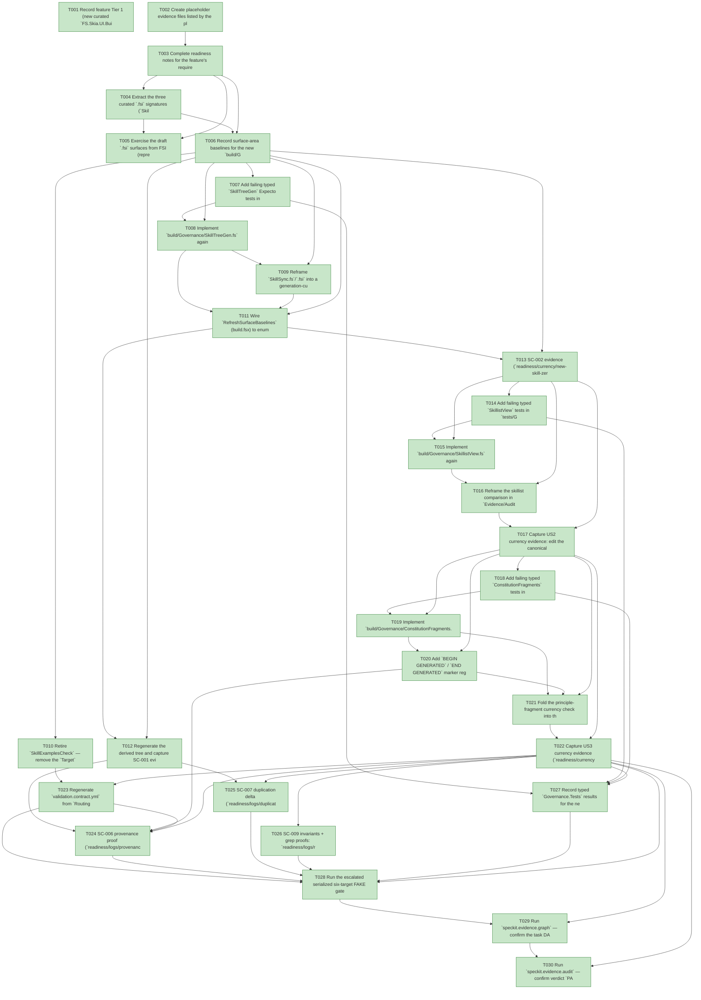

# Task Graph — 044-foundations-single-source-generation

## ✓ Graph is acyclic and consistent

## Skill Match Assessments

| Task | Candidate | Confidence | Signals | Reviewer disposition | Diagnostic |
|------|-----------|------------|---------|----------------------|------------|
| T001 | (none) | none |  | accepted-empty | T001: no high-confidence capability signal detected |
| T002 | (none) | none |  | accepted-empty | T002: no high-confidence capability signal detected |
| T003 | (none) | none |  | accepted-empty | T003: no high-confidence capability signal detected |
| T004 | (none) | none |  | accepted-empty | T004: no high-confidence capability signal detected |
| T005 | (none) | none |  | accepted-empty | T005: no high-confidence capability signal detected |
| T006 | (none) | none |  | accepted-empty | T006: no high-confidence capability signal detected |
| T007 | (none) | none |  | declared | T007: no high-confidence capability signal detected |
| T008 | (none) | none |  | declared | T008: no high-confidence capability signal detected |
| T009 | (none) | none |  | declared | T009: no high-confidence capability signal detected |
| T010 | (none) | none |  | declared | T010: no high-confidence capability signal detected |
| T011 | (none) | none |  | declared | T011: no high-confidence capability signal detected |
| T012 | (none) | none |  | declared | T012: no high-confidence capability signal detected |
| T013 | (none) | none |  | declared | T013: no high-confidence capability signal detected |
| T014 | (none) | none |  | declared | T014: no high-confidence capability signal detected |
| T015 | (none) | none |  | declared | T015: no high-confidence capability signal detected |
| T016 | (none) | none |  | declared | T016: no high-confidence capability signal detected |
| T017 | (none) | none |  | declared | T017: no high-confidence capability signal detected |
| T018 | (none) | none |  | declared | T018: no high-confidence capability signal detected |
| T019 | (none) | none |  | declared | T019: no high-confidence capability signal detected |
| T020 | (none) | none |  | accepted-empty | T020: no high-confidence capability signal detected |
| T021 | (none) | none |  | declared | T021: no high-confidence capability signal detected |
| T022 | (none) | none |  | declared | T022: no high-confidence capability signal detected |
| T023 | (none) | none |  | declared | T023: no high-confidence capability signal detected |
| T024 | (none) | none |  | accepted-empty | T024: no high-confidence capability signal detected |
| T025 | (none) | none |  | accepted-empty | T025: no high-confidence capability signal detected |
| T026 | (none) | none |  | accepted-empty | T026: no high-confidence capability signal detected |
| T027 | (none) | none |  | declared | T027: no high-confidence capability signal detected |
| T028 | (none) | none |  | declared | T028: no high-confidence capability signal detected |
| T029 | (none) | none |  | declared | T029: no high-confidence capability signal detected |
| T030 | speckit-evidence-audit | high | diff-scan | accepted | T030: task text matches speckit-evidence-audit; trigger_group=evidence audit; matched_trigger=diff-scan |

## Status counts (effective)

| Status | Count |
|--------|-------|
| [X] done | 30 |
| [S] synthetic | 0 |
| [S*] auto-synthetic | 0 |
| accepted [SEH] synthetic | 0 |
| unaccepted synthetic | 0 |

## Graph



## ASCII view

```
T001 [X] Record feature Tier 1 (new curated `FS.Skia.UI.Build` governance `.fsi` modules) + escalated `.specify/**`/governance status, the affected layer (`build/Governance/**` + `build.fsx` + `.specify/**` + the skill trees, build-tooling/governance only), public-API impact (no product `.fsi`; new build-tooling `.fsi` per Principle II), Elmish/MVU applicability (generation logic is pure; the only interpreter touched is `build.fsx`'s `BuildEffect` — `update` stays pure, all reads/writes at `interpret`), and the real-evidence obligations (the three currency demonstrations, byte-identity across 25 pairs, typed `Governance.Tests`, grep proofs, serialized FAKE logs; zero synthetic evidence)
T002 [X] Create placeholder evidence files listed by the plan under `specs/044-foundations-single-source-generation/readiness/` so the audit-enforced readiness files are discoverable at setup: `logs/serialized-gates.md`, `logs/byte-identity-25.md`, `logs/provenance-headers.md`, `logs/duplication-delta.md`, `logs/runtime-untouched.md`, `logs/no-fcs-grep.txt`, `logs/no-shell-diff-grep.txt`, `currency/skills-edit-without-regen.md`, `currency/new-skill-zero-allowlist.md`, `currency/skillist-edit-without-regen.md`, `currency/skillist-no-historical-regression.md`, `currency/constitution-edit-without-regen.md`, `unit-tests.md`, `fsi-session.txt`, and the governance scaffolds named in T003
T003 [X] Complete readiness notes for the feature's required readiness placeholder files (`governance-risk-levels.md`, `aggregate-hang-diagnostics.md`, `runtime-limitations.md`, `generated-validation-authority.md`, `evidence-graph.md`, `evidence-audit.md`, `skill-loading-evidence.md`), each naming its authoritative command, artifact path, failure class, and next action
T004 [X] Extract the three curated `.fsi` signatures (`SkillTreeGen`, `SkillistView`, `ConstitutionFragments`) from `contracts/` into standalone files under `build/Governance/`, add skeleton `.fs` companions against the signatures, and add their `<Compile>` entries to `FS.Skia.UI.Build.fsproj` in dependency order (after `Capabilities`); no access modifiers in the `.fs` bodies (Principle I/II, FR-014)
T005 [X] Exercise the draft `.fsi` surfaces from FSI (representative `SkillTreeGen.plan`, `SkillistView.renderAnnotation`, and `ConstitutionFragments.extract` calls over small literal inputs), capturing the session transcript to `readiness/fsi-session.txt`
T006 [X] Record surface-area baselines for the new `build/Governance` modules and the unsupported-scope / failure handling: missing/empty/malformed canonical input raises rather than emitting a partial derived artifact (spec Edge Cases, Principle VII); the Stage 5/6/7 deferrals and symlink-based sharing stay out of scope
T007 [X] Add failing typed `SkillTreeGen` Expecto tests in `tests/Governance.Tests/SkillTreeGenTests.fs` — enumeration covers a synthetic 26th skill outside any allowlist (SC-002); the derived plan is content-identical to canonical across the enumerated set (SC-001); a tampered derived byte yields a `Some` currency diagnostic; empty/missing/unreadable canonical input raises a generator error (Principle VII); register the file in `Governance.Tests.fsproj` before `Program.fs` — red before `SkillTreeGen.fs` exists
T008 [X] Implement `build/Governance/SkillTreeGen.fs` against its `.fsi` — `derivedRelPath`, `renderManifest`, `plan` (enumerate canonical files → derived entries + the tree-level provenance manifest, raising on empty/unreadable input), `currency`, `isCurrent`, and `currencyDrift` naming `./fake.sh build -t RefreshSurfaceBaselines`; the 6-slug `expectedSlugs` allowlist is **deleted** (coverage is by enumeration, FR-002)
T009 [X] Reframe `SkillSync.fs`/`.fsi` into a generation-currency check delegating to `SkillTreeGen.currency` — fail when `.claude/skills` is not a current regeneration of `.agents/skills` across all 25 pairs, with an actionable diagnostic naming the regeneration target rather than a bare "A and B differ" (FR-004/FR-012)
T010 [X] Retire `SkillExamplesCheck` — remove the `Target` DU case and its `name` / `directPrerequisites` / dispatch references in `Targets.fs`, delete `SkillExamples.fsi`/`.fs` and the `build.fsx` `SkillExamplesGate` effect + `runSkillExamplesGate`, and remove its `Governance.Tests` suite; the exhaustive `Target` match makes any missed reference a compile error (FR-004/FR-015, research R6)
T011 [X] Wire `RefreshSurfaceBaselines` (build.fsx) to enumerate `.agents/skills`, read each canonical `SKILL.md`, call `SkillTreeGen.plan`, and write the derived `.claude/skills` tree + provenance manifest; point the `SkillSyncCheck` gate arm at the reframed currency function. All filesystem enumeration/read/write stays at the interpreter edge; `update` emits effect data only (Principle IV)
T012 [X] Regenerate the derived tree and capture SC-001 evidence: in-process byte-identity across all 25 derived `SKILL.md` (`readiness/logs/byte-identity-25.md`) and the currency demonstration (`readiness/currency/skills-edit-without-regen.md`) — edit one of the 19 previously-unguarded slugs without regenerating → `SkillSyncCheck` fails naming `RefreshSurfaceBaselines`; regenerate → byte-identical → passes; editing the derived tree directly is reported as drift (SC-008)
T013 [X] SC-002 evidence (`readiness/currency/new-skill-zero-allowlist.md`): add a new skill directory to `.agents/skills`, run `RefreshSurfaceBaselines`, and confirm the derived tree gains the skill with **zero** edits to any per-skill allowlist or hardcoded slug list
T014 [X] Add failing typed `SkillistView` tests in `tests/Governance.Tests/SkillistViewTests.fs` — `renderAnnotation [a; b] = ""` and `[] = ""`; `spliceAnnotation` changes only the bracketed token on a task line and preserves the rest of the line (raises when the line carries no annotation token); `currency` flags a stale derived annotation and passes a current one; an absent annotation is reported, not silently inserted — red before `SkillistView.fs` exists
T015 [X] Implement `build/Governance/SkillistView.fs` against its `.fsi` — `renderAnnotation`, `spliceAnnotation` (in-place bracket-token replacement anchored by the existing `` regex, leaving every other byte of the line unchanged), `currency` (active-feature, keyed by task id; absent annotation reported), and `currencyDrift` naming `./fake.sh build -t RefreshSurfaceBaselines`
T016 [X] Reframe the skillist comparison in `Evidence/Audit.fs` (the active-feature merge-gate) from a symmetric peer complaint into an asymmetric currency diagnostic — "the `tasks.md` `` view for `<task>` is stale relative to its canonical `tasks.deps.yml` source; regenerate via `./fake.sh build -t RefreshSurfaceBaselines`" — delegating the rendered token to `SkillistView`; the active-feature scope is unchanged so the historical feature directories are never re-derived (FR-007, SC-004)
T017 [X] Capture US2 currency evidence: edit the canonical `tasks.deps.yml` `skillist:` for a task in this feature → the active-feature merge-gate flags the derived `` annotation stale; regenerate → green; edit the derived annotation alone → flagged stale (`readiness/currency/skillist-edit-without-regen.md`, SC-003). Confirm SC-004: re-deriving across the existing feature directories yields zero new failures (`readiness/currency/skillist-no-historical-regression.md`)
T018 [X] Add failing typed `ConstitutionFragments` tests in `tests/Governance.Tests/ConstitutionFragmentsTests.fs` — `extract` derives the fixed principle-summary fragment set deterministically from a `.specify/memory/constitution.md` fixture (raises when a required `### Principle` heading is missing); `regions` locates the `BEGIN GENERATED`/`END GENERATED` pairs; `splice` replaces only the inner region text and preserves every out-of-marker byte (property-style byte-equality over a fixture template, FR-010); `currency` flags a stale region after a simulated principle edit and passes a current one — red before the module exists
T019 [X] Implement `build/Governance/ConstitutionFragments.fs` against its `.fsi` — `fragmentIds`, `extract` (structural derivation from the `### Principle` headings of `.specify/memory/constitution.md`; no free-form paraphrase), `regions`, `splice` (marker-delimited; out-of-marker bytes preserved, FR-010), `currency`, and `currencyDrift` naming `./fake.sh build -t RefreshSurfaceBaselines`
T020 [X] Add `BEGIN GENERATED` / `END GENERATED` marker regions to `.specify/templates/plan-template.md` and `.specify/templates/tasks-template.md` carrying the four principle-summary fragments (`tests-first`, `mvu-boundary`, `synthetic-disclosure`, `fsi-visibility`) per the locked data-model inventory; genuine hand-written guidance prose stays **outside** the markers (FR-008/FR-010)
T021 [X] Fold the principle-fragment currency check into the `TargetMetadataDrift` gate (build.fsx) alongside the existing `ContractView` currency check, and wire `RefreshSurfaceBaselines` to splice the fragments into the two templates via `ConstitutionFragments.splice` (FR-009)
T022 [X] Capture US3 currency evidence (`readiness/currency/constitution-edit-without-regen.md`, SC-005/SC-008): change a `### Principle` in `.specify/memory/constitution.md` → `TargetMetadataDrift` flags the stale template region; run `RefreshSurfaceBaselines` → the templates reflect the change; hand-written prose outside the markers is preserved byte-for-byte
T023 [X] Regenerate `validation.contract.yml` from `Routing.fs` after the `SkillExamplesCheck` target removal and confirm `TargetMetadataDrift` / `ContractView` stay coherent — the target-set change must keep the currency gate green (research R6 coherence follow-through)
T024 [X] SC-006 provenance proof (`readiness/logs/provenance-headers.md`): record that every generated artifact carries machine-readable provenance — the tree-level manifest at the derived skill-tree root naming source + regeneration command, the `BEGIN GENERATED:` marker comments, and the `# GENERATED from … Routing.fs` header on `validation.contract.yml`; every replaced drift-check now emits an actionable "regenerate" diagnostic on failure (FR-011/FR-012)
T025 [X] SC-007 duplication delta (`readiness/logs/duplication-delta.md`): record the eliminated-line delta vs the Stage-0 baseline (`docs/reports/_baselines/2026-05-31-foundations.md`) — the ~5,854-line skill mirror collapses to one canonical source plus a generator
T026 [X] SC-009 invariants + grep proofs: `readiness/logs/runtime-untouched.md` (`git diff --stat` over product `src/**` = 0), `readiness/logs/no-fcs-grep.txt` (no `FSharp.Compiler.*` reference added), `readiness/logs/no-shell-diff-grep.txt` (no `diff`/`cmp`/`sha256sum`/symlink shelling in the generation path), and `PackageSurfaceCheck` / `FsiTranscripts` show no product baseline diff; confirm every generated/derived artifact (`.claude/skills/**` + its provenance manifest, the `BEGIN/END GENERATED` template regions) is tracked and not gitignored (`git check-ignore` returns nothing for them), proving FR-013
T027 [X] Record typed `Governance.Tests` results for the new generation/currency modules (`SkillTreeGen`, `SkillistView`, `ConstitutionFragments`) to `readiness/unit-tests.md`, including each module's failing-first stale-fixture case turning green
T028 [X] Run the escalated serialized six-target FAKE gate set sequentially (`Dev` → `GeneratedGuidanceCheck` → `TemplateCheck` → `GeneratedProductCheck` → the final graph and audit gates `T029`/`T030`), never concurrently; record aggregate FAKE results as **non-authoritative** and rerun any race-like or environment-flaky failure (the `SkiaViewer.Tests` headless crash, the `FsiTranscripts` toolchain issue) in focused isolation under a stash control as the authoritative result; logs under `readiness/logs/serialized-gates.md`
T029 [X] Run `speckit.evidence.graph` — confirm the task DAG is acyclic, no dangling refs, no `[S*]` surprises, and the `skillist` metadata and visible mirrors are valid
T030 [X] Run `speckit.evidence.audit` — confirm verdict `PASS` (0 unaccepted-synthetic, 0 auto-synthetic, 0 late-seh, 0 diff-scan blocking, 0 readiness-contract blocking) with zero synthetic evidence to accept (SC-008)
```

