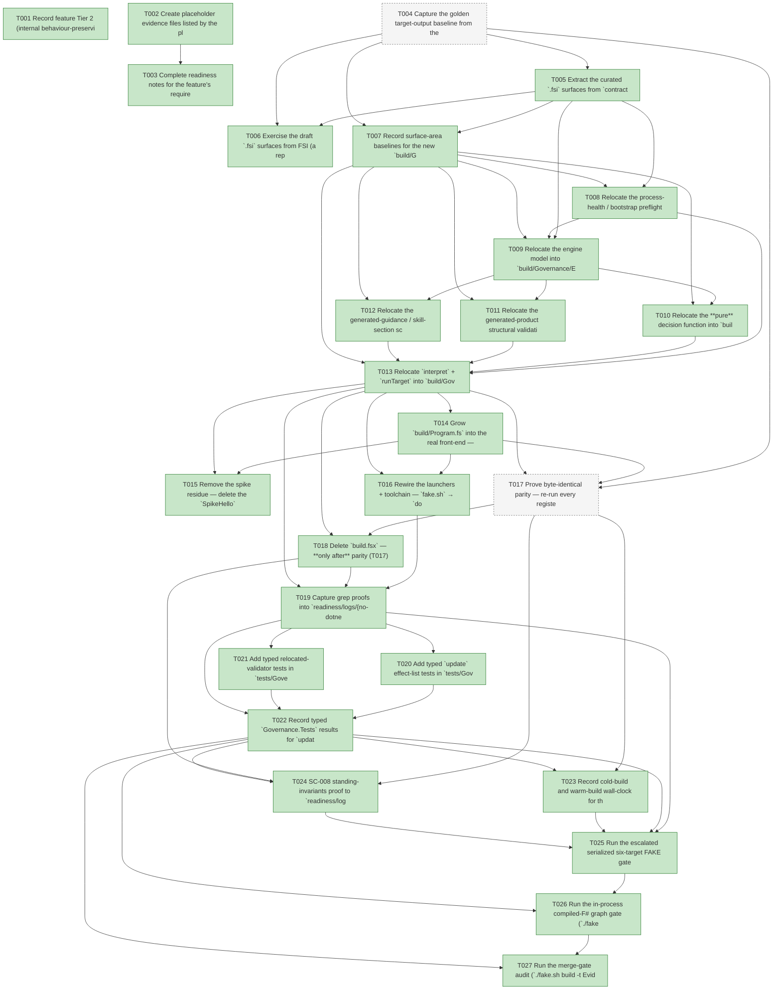

# Task Graph — 045-foundations-build-frontend

## ✓ Graph is acyclic and consistent

## Skill Match Assessments

| Task | Candidate | Confidence | Signals | Reviewer disposition | Diagnostic |
|------|-----------|------------|---------|----------------------|------------|
| T001 | (none) | none |  | accepted-empty | T001: no high-confidence capability signal detected |
| T002 | (none) | none |  | accepted-empty | T002: no high-confidence capability signal detected |
| T003 | (none) | none |  | accepted-empty | T003: no high-confidence capability signal detected |
| T004 | (none) | none |  | declared | T004: no high-confidence capability signal detected |
| T005 | (none) | none |  | accepted-empty | T005: no high-confidence capability signal detected |
| T006 | (none) | none |  | accepted-empty | T006: no high-confidence capability signal detected |
| T007 | (none) | none |  | accepted-empty | T007: no high-confidence capability signal detected |
| T008 | (none) | none |  | declared | T008: no high-confidence capability signal detected |
| T009 | (none) | none |  | declared | T009: no high-confidence capability signal detected |
| T010 | (none) | none |  | declared | T010: no high-confidence capability signal detected |
| T011 | (none) | none |  | declared | T011: no high-confidence capability signal detected |
| T012 | (none) | none |  | declared | T012: no high-confidence capability signal detected |
| T013 | (none) | none |  | declared | T013: no high-confidence capability signal detected |
| T014 | (none) | none |  | declared | T014: no high-confidence capability signal detected |
| T015 | (none) | none |  | accepted-empty | T015: no high-confidence capability signal detected |
| T016 | (none) | none |  | accepted-empty | T016: no high-confidence capability signal detected |
| T017 | (none) | none |  | declared | T017: no high-confidence capability signal detected |
| T018 | (none) | none |  | accepted-empty | T018: no high-confidence capability signal detected |
| T019 | (none) | none |  | accepted-empty | T019: no high-confidence capability signal detected |
| T020 | (none) | none |  | declared | T020: no high-confidence capability signal detected |
| T021 | (none) | none |  | declared | T021: no high-confidence capability signal detected |
| T022 | (none) | none |  | declared | T022: no high-confidence capability signal detected |
| T023 | (none) | none |  | accepted-empty | T023: no high-confidence capability signal detected |
| T024 | (none) | none |  | accepted-empty | T024: no high-confidence capability signal detected |
| T025 | (none) | none |  | declared | T025: no high-confidence capability signal detected |
| T026 | speckit-evidence-graph | high | EvidenceGraph | accepted | T026: task text matches speckit-evidence-graph; trigger_group=graph validation; matched_trigger=EvidenceGraph |
| T027 | speckit-evidence-audit | high | diff-scan | accepted | T027: task text matches speckit-evidence-audit; trigger_group=evidence audit; matched_trigger=diff-scan |

## Status counts (effective)

| Status | Count |
|--------|-------|
| [X] done | 25 |
| [S] synthetic | 0 |
| [S*] auto-synthetic | 0 |
| [-] skipped | 2 |
| accepted [SEH] synthetic | 0 |
| unaccepted synthetic | 0 |

## Graph



## ASCII view

```
T001 [X] Record feature Tier 2 (internal behaviour-preserving refactor of the build tooling, escalated by `Route` to the full serialized gate set as a `build.fsx`/launcher/`.config/dotnet-tools.json`/governance-path change), the affected layer (`build/Build.fsproj` + `build/Program.fs` + `build/Governance/**` + `build.fsx` + `fake.sh`/`fake.cmd` + `.config/dotnet-tools.json`; build-tooling only), public-API impact (no product `.fsi`/surface-baseline change; only curated build-tooling `.fsi` per Principle II), Elmish/MVU applicability (the relocated **build-side** MEL engine — `update` stays a pure `Msg × Model → Model × Effect list`, all filesystem/`git`/process I/O at the `interpret` edge, FR-007; the product Elmish runtime is untouched), and the real-evidence obligations (golden parity baseline + byte-identical diff, typed `update` effect-list + relocated-validator unit tests, `build.fsx`-deletion line-delta proof, grep proofs for no `dotnet fake`/`fake-cli`/`FSharp.Compiler.*`, recorded cold/warm wall-clock, serialized FAKE logs; zero synthetic evidence)
T002 [X] Create placeholder evidence files listed by the plan under `specs/045-foundations-build-frontend/readiness/` so the audit-enforced readiness files are discoverable at setup: `parity/exclusions.md`, `build-fsx-line-delta.md`, `unit-tests.md`, `fsi-session.txt`, `logs/no-dotnet-fake.txt`, `logs/no-fake-cli.txt`, `logs/no-fcs.txt`, `logs/build-timing.md`, `logs/serialized-gates.md`, `logs/runtime-untouched.md`, and the governance scaffolds named in T003 (`governance-risk-levels.md`, `aggregate-hang-diagnostics.md`, `runtime-limitations.md`, `generated-validation-authority.md`, `evidence-graph.md`, `evidence-audit.md`)
T003 [X] Complete readiness notes for the feature's required readiness placeholder files (`governance-risk-levels.md`, `aggregate-hang-diagnostics.md`, `runtime-limitations.md`, `generated-validation-authority.md`, `evidence-graph.md`, `evidence-audit.md`, and the `parity/exclusions.md` oracle-exclusion register), each naming its authoritative command, artifact path, failure class, and next action
T004 [-] Capture the golden target-output baseline from the current `build.fsx` (`dotnet fake`) path **before any relocation** — for every target in `Targets.dispatchTargets`, capture its deterministic governance reports/artifacts into `readiness/parity/<target>/baseline/`, normalizing known nondeterminism (timestamps, absolute paths, ordering) per `contracts/parity-oracle.md`, and record the stash-control proof that the two pre-existing-RED gates (`FsiTranscripts`, `TemplateCheck`'s `SkiaViewer.Tests` headless flake) fail identically with this feature's edits stashed into `readiness/parity/exclusions.md` (FR-012/SC-002)
T005 [X] Extract the curated `.fsi` surfaces from `contracts/library-modules.md` into standalone files under `build/Governance/` — `Engine/Model.fsi` (`BuildModel`, `BuildMsg`, the ~35-case `BuildEffect`, `init`), `Engine/Update.fsi` (pure `update`, exposing **no** filesystem/`git`/process symbol so the compiler enforces Principle IV), `Engine/Interpret.fsi` (`interpret` + `runTarget`), `GeneratedProduct.fsi`, `Guidance.fsi`, `Preflight.fsi` — add skeleton `.fs` companions against the signatures and their `<Compile>` entries to `FS.Skia.UI.Build.fsproj` in dependency order (`Preflight` → `Engine/Model` → `Engine/Update` → `GeneratedProduct`/`Guidance` → `Engine/Interpret`); no access modifiers in the `.fs` bodies (Principle I/II)
T006 [X] Exercise the draft `.fsi` surfaces from FSI (a representative `update (StartTarget t)` over a small literal model, plus a `GeneratedProduct`/`Guidance`/`Preflight` entry over a small literal input) and capture the session transcript to `readiness/fsi-session.txt`
T007 [X] Record surface-area baselines for the new `build/Governance` build-tooling modules and the unsupported-scope / failure handling: these are **build-tooling** `.fsi` (not product surface — `PackageSurfaceCheck`/`FsiTranscripts` show **no** product baseline diff); generated-product `schema_version` / deprecation-window is Stage 6.4 and explicitly out of scope; the relocation preserves every diagnostic verbatim (Principle VII) — compiler-enforced `.fsi` is the surface guard for these build-tooling modules, so the absence of a `PackageSurfaceCheck`/`FsiTranscripts` product baseline is intentional (Principle II satisfied via `.fsi`), not an omission
T008 [X] Relocate the process-health / bootstrap preflight (~267 lines) into `build/Governance/Preflight.fs` against `Preflight.fsi` — `collectProcessHealth`, `validateRunnerBootstrap`, and the `ProcessHealthThreshold`/`ProcessHealthSnapshot`/`BootstrapValidation` value types (from `build.fsx:118–162` / `1431–1800`), behaviour-preserving; the `git`/process wrapping stays here at the edge (relocated first because `Engine/Model.fsi`'s `BuildMsg` references `Preflight.ProcessHealthSnapshot`/`BootstrapValidation`)
T009 [X] Relocate the engine model into `build/Governance/Engine/Model.fs` against `Model.fsi` — the `BuildModel` record (repository-derived paths + `CompletedTargets`), `BuildMsg` (`StartTarget of Targets.Target` + the completion/health/verdict messages), the ~35-case `BuildEffect` DU, and `init` (pure path derivation from `root`), verbatim from `build.fsx:197–281`; compile clean under `TreatWarningsAsErrors`
T010 [X] Relocate the **pure** decision function into `build/Governance/Engine/Update.fs` against `Update.fsi` — `update : BuildMsg -> BuildModel -> BuildModel * BuildEffect list`, replacing the stringly-typed `StartTarget "…"` dispatch with the typed `Targets.Target` dispatch, with **no** filesystem/`git`/process/write I/O so it is unit-testable without touching the repo tree (Principle IV/FR-007)
T011 [X] Relocate the generated-product structural validation (~800 lines) into `build/Governance/GeneratedProduct.fs` against `GeneratedProduct.fsi` — `scanGeneratedProjects`, `generateV3Products`, `scanV3GeneratedProducts`, `validateGeneratedConsumer` (from `build.fsx:~2052–3500`) returning `Findings.ValidationFinding list` plus a **byte-identical** rendered report; structural checks behaviour-identical (no `schema_version` / deprecation window — Stage 6.4, out of scope)
T012 [X] Relocate the generated-guidance / skill-section scanners (~200 lines) into `build/Governance/Guidance.fs` against `Guidance.fsi` — `scanGeneratedGuidance` (from `build.fsx:~3635–4300`) returning typed `Findings.ValidationFinding` results plus a byte-identical report, behaviour-preserving
T013 [X] Relocate `interpret` + `runTarget` into `build/Governance/Engine/Interpret.fs` against `Interpret.fsi` — the **only** I/O module; each `BuildEffect` arm calls the relocated `GeneratedProduct`/`Guidance`/`Preflight` function or a local I/O helper and writes its report; `runTarget = init → update (StartTarget t) → interpret` over the emitted effect list (the function the exe's `Target.create` bodies call)
T014 [X] Grow `build/Program.fs` into the real front-end — iterate `Targets.dispatchTargets` registering **every** target via `Fake.Core.Target`, wire `==>` from `Targets.targetDependencyRows`, make each `Target.create` body call `Engine.Interpret.runTarget`, and dispatch via `Target.runOrDefaultWithArguments` forwarding target names and flags (e.g. `Route --enforce`) with identical semantics; consume the existing `Routing.fs` (feature 042) in-process for the `Route` target with **no** new routing logic (FR-005); the exhaustive `Target` match makes a missing registration a compile error, and the exe contains **no** inlined orchestration/validation logic (FR-001/SC-006)
T015 [X] Remove the spike residue — delete the `SpikeHello` target, `build/spike-verify.sh`, and any `build/SkillExamples/` remnants (`SkillExamplesCheck` was retired in feature 044) without affecting any registered target
T016 [X] Rewire the launchers + toolchain — `fake.sh` → `dotnet run --project build/Build.fsproj -- "$@"` (drop `dotnet tool restore` + `dotnet fake`), `fake.cmd` → `dotnet run --project build/Build.fsproj -- %*` (preserve `%ERRORLEVEL%`), and remove `fake-cli` from `.config/dotnet-tools.json`; the FAKE-sequencing invariant (never concurrent) and the `.fake`-cache independence are preserved (FR-002/FR-003)
T017 [-] Prove byte-identical parity — re-run every registered target through the compiled front-end into `readiness/parity/<target>/after/`, normalize, and DiffPlex-diff against `baseline/` (T004); every Class-A/Class-B diff is empty, test-shelling targets are compared by **verdict + report** not raw stdout, and the two enumerated pre-existing-RED gates are excluded via the `readiness/parity/exclusions.md` stash-control proof; resolve any diff by fixing the relocation, never by weakening the oracle (FR-012/SC-002)
T018 [X] Delete `build.fsx` — **only after** parity (T017) is clean; record the line delta (4,767 working / 4,688 Stage-0 → 0) in `readiness/build-fsx-line-delta.md`; the ≤200-line `#r`-the-DLL shim is used **only** if a concrete blocker surfaced (record the residual count and the blocker) (FR-011/SC-001)
T019 [X] Capture grep proofs into `readiness/logs/{no-dotnet-fake,no-fake-cli,no-fcs}.txt` — no `dotnet fake` invocation remains in the launchers/scripts, `fake-cli` is absent from `.config/dotnet-tools.json`, and no `FSharp.Compiler.*` / FCS reference exists anywhere (`--include=*.fs --include=*.fsproj --include=*.fsx`) (FR-003/FR-004/SC-003/SC-004)
T020 [X] Add typed `update` effect-list tests in `tests/Governance.Tests/BuildEngineUpdateTests.fs` — for representative targets (e.g. `Dev`, `Route`, `DependencyReport`, `PackLocal`) assert `update (StartTarget t)` returns the expected typed `BuildEffect` list as a **pure** function (no I/O), register the file in `Governance.Tests.fsproj` before `Program.fs`, and record the failing-first evidence via a **stash control** — stash the relocated `Engine/Update.fs` body (reverting `update` to its T005 skeleton) to capture RED, then unstash to capture GREEN — in `readiness/unit-tests.md`, the same stash-control discipline the parity oracle uses (FR-013/SC-005)
T021 [X] Add typed relocated-validator tests in `tests/Governance.Tests/{GeneratedProductValidatorTests,GuidanceValidatorTests,PreflightValidatorTests}.fs` — assert typed `Findings.ValidationFinding` results and golden-report parity against fixtures for `GeneratedProduct`, `Guidance`, and `Preflight`, registered before `Program.fs`; record the failing-first → green evidence via the same **stash control** (stash the relocated `GeneratedProduct.fs`/`Guidance.fs`/`Preflight.fs` bodies for RED, unstash for GREEN) (FR-013/SC-005)
T022 [X] Record typed `Governance.Tests` results for `update` + the three relocated validators to `readiness/unit-tests.md`, including each suite's stash-control failing-first (RED) → GREEN transition and the assertion that `update` is exercised with **no** repo-tree I/O
T023 [X] Record cold-build and warm-build wall-clock for the compiled front-end vs the prior `dotnet fake` script-recompile baseline in `readiness/logs/build-timing.md` — a **recorded-and-explained measurement, NOT a merge gate** (FR-014/SC-007): warm builds are *expected* at least as fast, but a non-improvement does not block the feature provided parity (T017) holds and any regression is explained
T024 [X] SC-008 standing-invariants proof to `readiness/logs/runtime-untouched.md` — `git diff --stat` over product `src/**` = 0 (runtime untouched), `PackageSurfaceCheck`/`FsiTranscripts` show no product baseline diff, generated consumers stay byte-identical (`TemplateCheck`/`GeneratedProductCheck`/`GeneratedGuidanceCheck`), `DependencyReport` green/unchanged, and no new `PackageVersion` lives outside `Directory.Packages.props`
T025 [X] Run the escalated serialized six-target FAKE gate set sequentially (`Dev` → `GeneratedGuidanceCheck` → `TemplateCheck` → `GeneratedProductCheck` → the final graph and audit gates T026/T027), never concurrently; record aggregate FAKE results as **non-authoritative** and rerun any race-like or environment-flaky failure (the `SkiaViewer.Tests` headless crash, the `FsiTranscripts` toolchain issue) in focused isolation under a stash control as the authoritative result; logs under `readiness/logs/serialized-gates.md`
T026 [X] Run the in-process compiled-F# graph gate (`./fake.sh build -t EvidenceGraph`) — confirm the task DAG is acyclic, no dangling refs, no `[S*]` surprises, and the `skillist` metadata and visible mirrors are valid
T027 [X] Run the merge-gate audit (`./fake.sh build -t EvidenceAudit`) — confirm verdict `PASS` (0 unaccepted-synthetic, 0 auto-synthetic, 0 late-seh, 0 diff-scan blocking, 0 readiness-contract blocking) with zero synthetic evidence to accept (SC-008)
```

