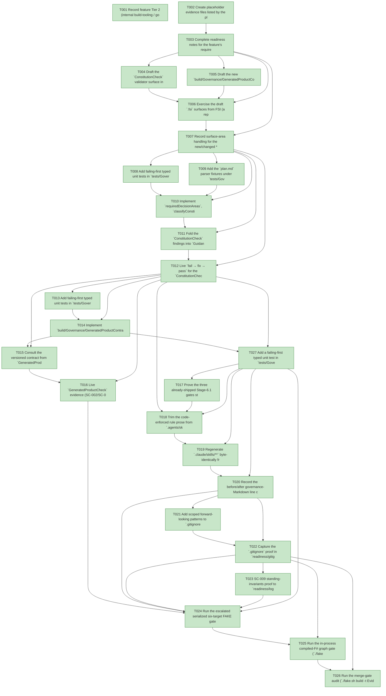

# Task Graph — 046-foundations-rule-codification

## ✓ Graph is acyclic and consistent

## Skill Match Assessments

| Task | Candidate | Confidence | Signals | Reviewer disposition | Diagnostic |
|------|-----------|------------|---------|----------------------|------------|
| T001 | (none) | none |  | accepted-empty | T001: no high-confidence capability signal detected |
| T002 | (none) | none |  | accepted-empty | T002: no high-confidence capability signal detected |
| T003 | (none) | none |  | accepted-empty | T003: no high-confidence capability signal detected |
| T004 | (none) | none |  | accepted-empty | T004: no high-confidence capability signal detected |
| T005 | (none) | none |  | accepted-empty | T005: no high-confidence capability signal detected |
| T006 | (none) | none |  | accepted-empty | T006: no high-confidence capability signal detected |
| T007 | (none) | none |  | accepted-empty | T007: no high-confidence capability signal detected |
| T008 | (none) | none |  | declared | T008: no high-confidence capability signal detected |
| T009 | (none) | none |  | accepted-empty | T009: no high-confidence capability signal detected |
| T010 | (none) | none |  | declared | T010: no high-confidence capability signal detected |
| T011 | (none) | none |  | declared | T011: no high-confidence capability signal detected |
| T012 | (none) | none |  | accepted-empty | T012: no high-confidence capability signal detected |
| T013 | (none) | none |  | declared | T013: no high-confidence capability signal detected |
| T014 | (none) | none |  | declared | T014: no high-confidence capability signal detected |
| T015 | (none) | none |  | declared | T015: no high-confidence capability signal detected |
| T016 | (none) | none |  | accepted-empty | T016: no high-confidence capability signal detected |
| T017 | (none) | none |  | accepted-empty | T017: no high-confidence capability signal detected |
| T018 | (none) | none |  | accepted-empty | T018: no high-confidence capability signal detected |
| T019 | (none) | none |  | accepted-empty | T019: no high-confidence capability signal detected |
| T020 | (none) | none |  | accepted-empty | T020: no high-confidence capability signal detected |
| T021 | (none) | none |  | accepted-empty | T021: no high-confidence capability signal detected |
| T022 | (none) | none |  | accepted-empty | T022: no high-confidence capability signal detected |
| T023 | (none) | none |  | accepted-empty | T023: no high-confidence capability signal detected |
| T024 | (none) | none |  | declared | T024: no high-confidence capability signal detected |
| T025 | speckit-evidence-graph | high | EvidenceGraph | accepted | T025: task text matches speckit-evidence-graph; trigger_group=graph validation; matched_trigger=EvidenceGraph |
| T026 | speckit-evidence-audit | high | diff-scan | accepted | T026: task text matches speckit-evidence-audit; trigger_group=evidence audit; matched_trigger=diff-scan |
| T027 | (none) | none |  | declared | T027: no high-confidence capability signal detected |

## Status counts (effective)

| Status | Count |
|--------|-------|
| [X] done | 27 |
| [S] synthetic | 0 |
| [S*] auto-synthetic | 0 |
| accepted [SEH] synthetic | 0 |
| unaccepted synthetic | 0 |

## Graph



## ASCII view

```
T001 [X] Record feature Tier 2 (internal build-tooling / governance, escalated by `Route` to the full serialized set as a `build/Governance/**` + `.agents/skills/**` + `.specify/**` + generated-product-contract change), the affected layer (`build/Governance/Guidance.fs(/.fsi)`, new `build/Governance/GeneratedProductContract.fs(/.fsi)`, `build/Governance/GeneratedProduct.fs(/.fsi)`, `tests/Governance.Tests/**`, `.agents/skills/**`, `.gitignore`), the public-API impact (no product `.fsi`/surface-baseline change — SC-009; the **consumer** generated-product contract gains `schema_version` + a deprecation window, US2/T1), the Elmish/MVU applicability (product runtime untouched; the new validators are **pure functions** returning typed results with file I/O confined to the existing `interpret`/`Front` edge — Principle IV satisfied, product MVU **not applicable**), and the real-evidence obligations (typed unit tests, seeded-violation proofs, live gate fail→fix→pass, generation-currency green, `git check-ignore` proof, prose-delta measurement, serialized escalated FAKE logs; zero synthetic)
T002 [X] Create placeholder evidence files listed by the plan under `specs/046-foundations-rule-codification/readiness/` so the audit-enforced readiness files are discoverable at setup: `governance-risk-levels.md`, `aggregate-hang-diagnostics.md`, `runtime-limitations.md`, `validation-contract.md`, `evidence-graph.md`, `evidence-audit.md`, `evidence-policy-separation.md`, `prose-delta.md`, `gitignore-check.md`, `unit-tests.md`, `fsi-session.txt`, `seeded-violations/` (one note per deleted rule), and `logs/` (`dev.log`, `generated-guidance-check.log`, `template-check.log`, `generated-product-check.log`, `evidence-graph.log`, `evidence-audit.log`)
T003 [X] Complete readiness notes for the feature's required readiness placeholder files (`governance-risk-levels.md` with the small/medium/broad levels, their required evidence, and when broad validation is required; `aggregate-hang-diagnostics.md` with verdict / stage / elapsed duration / last observed command / focused rerun / non-authoritative aggregate; `runtime-limitations.md` with the .NET 10 desktop / Vulkan / SkiaSharp preview / unsupported macOS/mobile/browser / no software-renderer fallback statements; and `validation-contract.md`, `evidence-graph.md`, `evidence-audit.md`, `evidence-policy-separation.md`), each naming its authoritative command, artifact path, failure class, and next action
T004 [X] Draft the `ConstitutionCheck` validator surface in `build/Governance/Guidance.fsi` — `requiredDecisionAreas: RequiredDecisionArea list`, `classifyConstitutionCheck: string -> ConstitutionCheckResult`, `constitutionCheckFindings: string -> ConstitutionCheckResult -> Findings.ValidationFinding list`, and the `RequiredDecisionArea` / `AreaStatus` / `ConstitutionCheckResult` types from `data-model.md`; add the matching skeleton bodies in `Guidance.fs` (no access modifiers, Principle I/II) so the module compiles `TreatWarningsAsErrors`-clean against the new signature
T005 [X] Draft the new `build/Governance/GeneratedProductContract.fsi` surface — `ContractSchemaVersion`, `RuleLifecycle` (`Required | Deprecated of removalVersion | Removed`), `StructuralRule`, `ContractChangeKind`, `ContractChangelogEntry`, `GeneratedProductContract`, `RuleOutcome` (`Pass | Warn of string | Fail`), plus `current`, `classifyViolation: GeneratedProductContract -> string -> RuleOutcome` and `renderContractHeader: GeneratedProductContract -> string` (from `data-model.md` / `contracts/generated-product-contract.md`); add the skeleton `.fs` companion and its `<Compile>` entry to `FS.Skia.UI.Build.fsproj` ahead of `GeneratedProduct`
T006 [X] Exercise the draft `.fsi` surfaces from FSI (a representative `classifyConstitutionCheck` over a small literal complete/incomplete plan body, and a `classifyViolation` over a small literal contract with a `Required` and a `Deprecated` rule), capturing the session transcript to `readiness/fsi-session.txt`
T007 [X] Record surface-area handling for the new/changed **build-tooling** `.fsi` modules and the unsupported-scope / failure diagnostics: these are build-tooling `.fsi` (not tracked product baselines — `PackageSurfaceCheck`/`FsiTranscripts` show **no** product baseline diff, intentional per Principle II), the contract header renders an explicit `schema_version`, and the unrecognized-template-revision path emits a distinct actionable diagnostic rather than a false pass
T008 [X] Add failing-first typed unit tests in `tests/Governance.Tests/ConstitutionCheckTests.fs` asserting `ConstitutionCheckResult` / `Findings.ValidationFinding` values (no string matching): all 11 areas filled → pass; each unfilled variant (empty / still-boilerplate / `NEEDS CLARIFICATION`-or-`TODO` placeholder) → a finding naming the exact area id and the plan path; an area marked N/A-with-rationale → filled/pass; a live template that no longer maps to the typed identifiers → the `UnrecognizedTemplateRevision` case — register the file in `Governance.Tests.fsproj` before `Program.fs` and record the failing-first (RED) capture in `readiness/unit-tests.md`
T009 [X] Add the `plan.md` parser fixtures under `tests/Governance.Tests/fixtures/` — a complete plan, a missing/blanked-area plan, a still-boilerplate-prompt plan, a `NEEDS CLARIFICATION`/`TODO` plan, an N/A-with-rationale plan, and a future/renamed-template plan — covering every case asserted by T008
T010 [X] Implement `requiredDecisionAreas`, `classifyConstitutionCheck`, and `constitutionCheckFindings` in `build/Governance/Guidance.fs` against the `.fsi` — parse the *Repository Governance Decisions* section with the existing `markdownSections` / `tryHeading` helpers, key off the **hard-coded 11 stable area identifiers** (not exact headings), reuse `Guidance.planGuidancePrompts` as the still-boilerplate sentinels, treat N/A-with-rationale as `Filled`, and emit the `UnrecognizedTemplateRevision` diagnostic when the live `plan-template.md` no longer maps to the identifiers (FR-001/003); turn T008 GREEN
T011 [X] Fold the `ConstitutionCheck` findings into `Guidance.runGeneratedGuidanceScan` so a non-empty unfilled-area set (or the unrecognized-template-revision case) contributes build-failing `ValidationFinding`s to the existing `GeneratedGuidanceCheck` aggregate report, each naming the area display name and the `plan.md` path; a complete plan adds zero findings (FR-002, A5 — no new top-level target)
T012 [X] Live `fail → fix → pass` for the `ConstitutionCheck` gate on this feature's own `plan.md` via `./fake.sh build -t GeneratedGuidanceCheck` — PASS complete → blank one required area → FAIL naming that exact area → restore → PASS; capture the three runs under `readiness/seeded-violations/constitution-check.md` (SC-001)
T013 [X] Add failing-first typed unit tests in `tests/Governance.Tests/GeneratedProductContractTests.fs` asserting the `RuleOutcome` of `classifyViolation` over a literal contract: a `Required` rule violated → `Fail`; a `Deprecated removalVersion` rule violated while `SchemaVersion < removalVersion` → `Warn` naming the removal version; the same rule once `SchemaVersion >= removalVersion` → `Fail` (window closed); a rule promoted `Deprecated → Required` → `Fail`; a `Removed` rule → not evaluated; and assert the typed `Changelog` records each transition and `renderContractHeader` exposes the `schema_version` — register before `Program.fs`, capture RED in `readiness/unit-tests.md`
T014 [X] Implement `build/Governance/GeneratedProductContract.fs` against its `.fsi` — the typed `ContractSchemaVersion`, the per-rule `RuleLifecycle`, the `current` contract value wrapping the existing structural-rule ids, the embedded typed `Changelog`, `classifyViolation` (the `Required`/`Deprecated`/window-closed/`Removed` evaluation rule from `data-model.md` R4), and `renderContractHeader` (schema_version + changelog summary); turn T013 GREEN
T015 [X] Consult the versioned contract from `GeneratedProduct.runScanV3GeneratedProducts` so a product that violates **only** a `Deprecated` rule emits a warning (naming the removal version) instead of a finding, while `Required`/window-closed rules still fail, and surface `renderContractHeader` in the `GeneratedProductCheck` output — the existing structural checks stay behaviour-identical for `Required` rules (no product regression)
T016 [X] Live `GeneratedProductCheck` evidence (SC-002/SC-003) — `./fake.sh build -t GeneratedProductCheck` on a current generated project stays green with the `schema_version` visible in output; demonstrate `warn → promote → fail` (a product violating only a `Deprecated` rule warns; after bumping `schema_version` and promoting the rule to `Required` the same product fails, with the changelog recording both); capture under `readiness/logs/generated-product-check.log`
T017 [X] Prove the three already-shipped Stage-6.1 gates still block, via seeded violations, before any prose is deleted (FR-008): the late-`[SEH]` design-phase-timing rule (`Evidence/Audit.fs` `late-seh-tasks`), the skill-id resolution / no-dangling-id rule (`Evidence/Engine.fs`), and the surface-baseline-presence rule (`Capabilities.fs`); seed one violation per rule, confirm each fails the build, restore, and record the three proofs under `readiness/seeded-violations/`
T018 [X] Trim the code-enforced rule prose from `.agents/skills/**` — delete the rule statements now enforced by the four proven gates (the new `ConstitutionCheck` completeness gate plus the three Stage-6.1 gates from T017), replacing each with a one-line pointer to its enforcing gate where useful, and **keep** genuine rationale / intent / when-to-use guidance; perform a deletion only for a rule with a recorded seeded-violation proof (T012, T017)
T019 [X] Regenerate `.claude/skills/**` byte-identically from the trimmed `.agents/skills/**` via `./fake.sh build -t RefreshSurfaceBaselines`, then confirm the feature-044 generation-currency / skill-sync check stays green via `./fake.sh build -t GeneratedGuidanceCheck` (FR-009, SC-005) — the two skill trees remain byte-identical
T020 [X] Record the before/after governance-Markdown line count and the per-invocation skill-byte load versus the Stage-0 baseline (≈ 6,882 rule/guidance lines today, **not** the overstated ~23,000 — spec A2), with the reproduction command for each figure, in `readiness/prose-delta.md`; justify every rule-prose passage retained as genuine guidance (FR-010, SC-006)
T021 [X] Add scoped forward-looking patterns to `.gitignore` for regenerable readiness logs and `readiness*.zip` archives, scoped to `specs/*/readiness/logs/**` and `specs/*/readiness/**/readiness*.zip` so authored non-regenerable evidence (all `*.md` notes **and** the `fsi-session.txt` transcript) stays tracked — never a broad non-`.md` sweep (FR-011); make **no** removal of committed evidence and **no** history rewrite (FR-012/D3)
T022 [X] Capture the `.gitignore` proof in `readiness/gitignore-check.md` — `git check-ignore -v` on a freshly generated `readiness*.zip` / readiness log shows it ignored, and `git ls-files --error-unmatch` on **two** previously-committed evidence files — a `*.md` note and the non-`.md` `fsi-session.txt` transcript — shows both still tracked (controls proving the scope spares authored `.txt`, not only `.md`); confirm no committed evidence was removed (SC-007)
T023 [X] SC-009 standing-invariants proof to `readiness/logs/runtime-untouched.md` — `git diff --stat` over product `src/**` = 0 (runtime / `.fsi` untouched), `PackageSurfaceCheck` / `FsiTranscripts` show no product baseline diff, generated consumers stay governed, no new `PackageVersion` lives outside `Directory.Packages.props`, and invariants 1–6 hold (FR-014)
T024 [X] Run the escalated serialized six-target FAKE gate set sequentially (`Dev` → `GeneratedGuidanceCheck` → `TemplateCheck` → `GeneratedProductCheck` → the final graph and audit gates T025/T026), never concurrently; record aggregate FAKE results as **non-authoritative** and rerun any race-like or environment-flaky failure (the known `SkiaViewer.Tests` headless crash) in focused isolation as the authoritative result; logs under `readiness/logs/serialized-gates.md`
T025 [X] Run the in-process compiled-F# graph gate (`./fake.sh build -t EvidenceGraph`) — confirm the DAG is acyclic, no dangling refs, no `[S*]` surprises, and the `skillist` metadata and visible mirrors are valid
T026 [X] Run the merge-gate audit (`./fake.sh build -t EvidenceAudit`) — confirm `verdict=PASS` (0 unaccepted-synthetic, 0 auto-synthetic, 0 late-seh, 0 diff-scan blocking, 0 readiness-contract blocking) with zero synthetic evidence to accept (SC-010)
T027 [X] Add a failing-first typed unit test in `tests/Governance.Tests/GeneratedProductContractTests.fs` asserting changelog⇄`SchemaVersion` consistency over the `current` contract — every breaking `ContractChangelogEntry` (`PromotedToRequired` / `RuleRemoved`) has a `Version` strictly greater than the prior schema version, and `current.SchemaVersion` is ≥ the maximum changelog-entry version — then implement that pure consistency check in `build/Governance/GeneratedProductContract.fs` so a breaking rule change that forgets the bump fails the test instead of relying on reviewer attention; turn it GREEN and record the RED capture in `readiness/unit-tests.md` (FR-006, SC-011, gate-enforces the C1 bump obligation)
```

