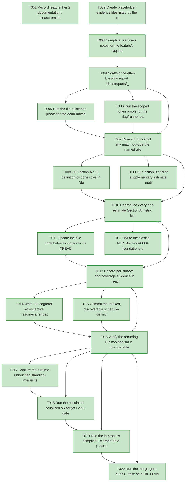

# Task Graph — 047-foundations-programme-closeout

## ✓ Graph is acyclic and consistent

## Skill Match Assessments

| Task | Candidate | Confidence | Signals | Reviewer disposition | Diagnostic |
|------|-----------|------------|---------|----------------------|------------|
| T001 | (none) | none |  | accepted-empty | T001: no high-confidence capability signal detected |
| T002 | (none) | none |  | accepted-empty | T002: no high-confidence capability signal detected |
| T003 | (none) | none |  | accepted-empty | T003: no high-confidence capability signal detected |
| T004 | (none) | none |  | accepted-empty | T004: no high-confidence capability signal detected |
| T005 | (none) | none |  | accepted-empty | T005: no high-confidence capability signal detected |
| T006 | (none) | none |  | accepted-empty | T006: no high-confidence capability signal detected |
| T007 | (none) | none |  | accepted-empty | T007: no high-confidence capability signal detected |
| T008 | (none) | none |  | accepted-empty | T008: no high-confidence capability signal detected |
| T009 | (none) | none |  | accepted-empty | T009: no high-confidence capability signal detected |
| T010 | (none) | none |  | accepted-empty | T010: no high-confidence capability signal detected |
| T011 | (none) | none |  | accepted-empty | T011: no high-confidence capability signal detected |
| T012 | (none) | none |  | accepted-empty | T012: no high-confidence capability signal detected |
| T013 | (none) | none |  | accepted-empty | T013: no high-confidence capability signal detected |
| T014 | (none) | none |  | accepted-empty | T014: no high-confidence capability signal detected |
| T015 | (none) | none |  | accepted-empty | T015: no high-confidence capability signal detected |
| T016 | (none) | none |  | accepted-empty | T016: no high-confidence capability signal detected |
| T017 | (none) | none |  | accepted-empty | T017: no high-confidence capability signal detected |
| T018 | (none) | none |  | accepted-empty | T018: no high-confidence capability signal detected |
| T019 | speckit-evidence-graph | high | EvidenceGraph | accepted | T019: task text matches speckit-evidence-graph; trigger_group=graph validation; matched_trigger=EvidenceGraph |
| T020 | speckit-evidence-audit | high | diff-scan | accepted | T020: task text matches speckit-evidence-audit; trigger_group=evidence audit; matched_trigger=diff-scan |

## Status counts (effective)

| Status | Count |
|--------|-------|
| [X] done | 20 |
| [S] synthetic | 0 |
| [S*] auto-synthetic | 0 |
| accepted [SEH] synthetic | 0 |
| unaccepted synthetic | 0 |

## Graph



## ASCII view

```
T001 [X] Record feature Tier 2 (documentation / measurement / verification-record, escalated by `Route` to the full serialized set because it touches `CLAUDE.md` / `AGENTS.md` / governance docs and the recurring-run schedule file), the affected surfaces (`docs/reports/_baselines/2026-06-02-foundations-after.md`, `docs/adr/0006-foundations-programme-closeout.md`, `README.md`, `docs/reports/build.md`, `docs/reports/speckit.md`, `CLAUDE.md`, `AGENTS.md`, the tracked recurring-run schedule file, and `specs/047-foundations-programme-closeout/readiness/**`), the public-API impact (none — no product `.fsi`, surface-baseline, or `PackageVersion` change, SC-006), the Elmish/MVU applicability (N/A — no stateful or I/O-bearing workflow; the measurement artifacts only *read* `git`/build outputs and add no `Model`/`Msg`/`Effect`), and the real-evidence obligations (committed grep proofs, the after-baseline with per-row reproduction commands, the closing ADR, the dogfood retrospective + recurring-run mechanism, the runtime-untouched proof, and the serialized escalated FAKE gate logs; zero synthetic)
T002 [X] Create placeholder evidence files listed by the plan under `specs/047-foundations-programme-closeout/readiness/` so the audit-enforced readiness files are discoverable at setup: `scaffolding-proof.md`, `after-baseline-repro.md`, `docs-coverage.md`, `retrospective.md`, `runtime-untouched.md`, the three always-required contract files `governance-risk-levels.md`, `aggregate-hang-diagnostics.md`, `runtime-limitations.md`, and `logs/` (`dev.log`, `generated-guidance-check.log`, `template-check.log`, `generated-product-check.log`, `evidence-graph.log`, `evidence-audit.log`)
T003 [X] Complete readiness notes for the feature's required readiness placeholder files — `governance-risk-levels.md` (the small / medium / broad levels, their required evidence, and when broad validation is required), `aggregate-hang-diagnostics.md` (verdict / stage / elapsed duration / last observed command / focused rerun / non-authoritative aggregate), and `runtime-limitations.md` (the .NET 10 desktop / Vulkan / SkiaSharp preview / unsupported macOS/mobile/browser / no software-renderer fallback statements) — each naming its authoritative command, artifact path, failure class, and next action
T004 [X] Scaffold the after-baseline report `docs/reports/_baselines/2026-06-02-foundations-after.md` per `contracts/after-baseline.md` — the pinned-context header block (`git_commit` full+short, `branch`, `captured_at`, toolchain), the empty Section A 11-row definition-of-done table (`Dimension | Baseline (2026-05-31) | After (this SHA) | Reproduction command | Met-target / rationale`), the empty Section B supplementary-estimate table (clearly labelled, excluded from the 100% total), and the fixed-path cross-link placeholders to the Stage-0 baseline `2026-05-31-foundations.md` and the closing ADR `docs/adr/0006-foundations-programme-closeout.md` (values filled in US2)
T005 [X] Run the file-existence proofs for the dead artifacts — `git ls-files build.fsx`, `git ls-files '**/select-tier.fsx'`, `git ls-files '**/run-audit.sh'`, `git ls-files '.specify/**/*.py'` — and record each exact command with its empty output in `readiness/scaffolding-proof.md` (excluding gitignored build output and the by-design generated `template/base/build.fsx`)
T006 [X] Run the scoped token proofs for the flag/runner patterns (`--legacy-evidence`; `fake-cli` / `dotnet fake` / `FSharp.Compiler.*`) per `contracts/scaffolding-proof.md` — record the full unscoped matches and the allowlist-scoped zero result, naming each retained match's non-scaffolding class (frozen `specs/**` + impl-plan history, the `build/Governance/Guidance.fs` enforcement scan-strings, the `Directory.Packages.props` assert-the-absence comments, and the live-FAKE entry-point diagnostics in `build/Program.fs` / `build/Governance/Preflight.fs`) in `readiness/scaffolding-proof.md`
T007 [X] Remove or correct any match outside the named allowlist as a genuine residual (e.g. a live dead-script reference or unguarded flag the scoped sweep surfaces), re-run the affected proof until the scoped result is zero, and record each correction with `verdict = residual-removed`; where the sweep is already clean, record `verdict = clean` for that entry. The `branch-vs-master` stale doc reference in `docs/reports/build.md` is corrected by the US3 doc pass (T011), not here. (FR-002)
T008 [X] Fill Section A's 11 definition-of-done rows in `docs/reports/_baselines/2026-06-02-foundations-after.md` — each with its Stage-0 baseline value (from `2026-05-31-foundations.md`), its current value, the exact reproduction command, the pinned feature SHA, and a met-target marker or a written rationale; include the corrected ≈6,882-line governance-Markdown baseline rationale (feature 046, **not** the overstated ~23,000) and the framework-author-process estimate rationale (no timing harness; the mechanism is the `inner-loop` light tier now being the `Route` default), reusing the US1 proof commands for the `build.fsx → 0` / removed-runner rows
T009 [X] Fill Section B's three supplementary estimate metrics (per-feature ceremony time, agent context bytes, warm-build time) in the clearly-labelled estimate section — each with its baseline value, after value, and an `estimate` basis stating why it is not command-reproducible — explicitly excluded from the 100% definition-of-done total (spec Clarification, SC-002)
T010 [X] Reproduce every non-estimate Section A metric by re-running its recorded command at the pinned SHA and confirm the output matches the reported After value, capturing the re-runs (command + output) in `readiness/after-baseline-repro.md` (SC-003)
T011 [X] Update the five contributor-facing surfaces (`README.md`, `docs/reports/build.md`, `docs/reports/speckit.md`, `CLAUDE.md`, `AGENTS.md`) to describe the new development model — the two-tier process, the `Route` entry point, the `FS.Skia.UI.Build` governance library as the single home of all rules, and the generate-don't-sync principle — ensuring none presents the serialized six-target order as the unconditional default (it is the escalated `maintainer-verify` path), and repoint `AGENTS.md`'s `<!-- SPECKIT START -->`…`<!-- SPECKIT END -->` plan reference to this feature's plan (FR-006/007)
T012 [X] Write the closing ADR `docs/adr/0006-foundations-programme-closeout.md` in the 0001–0005 format (`Status`, `Date`, `Decision source`, `## Context`, `## Decision`, `## Alternatives considered`, `## Consequences / rationale`) recording the programme outcome, the realized decisions D1–D6, and the new steady-state development model, linking the Stage-0 baseline and the after-baseline (FR-008, SC-005)
T013 [X] Record per-surface doc-coverage evidence in `readiness/docs-coverage.md` — for each of the five surfaces, the presence of the four required concepts (two-tier process, `Route` entry point, governance library as the single home of all rules, generate-don't-sync) and the absence of any instruction presenting the serialized six-target order as the unconditional default (FR-006/007, SC-004)
T014 [X] Write the dogfood retrospective `readiness/retrospective.md` confirming features 042 and 043 each exercised the full serialized pipeline green (with pointers to their readiness), concluding the harness was kept honest, and identifying the recurring-run mechanism; add the cross-link back from the after-baseline so the closeout artifacts form a connected record (SC-005)
T015 [X] Commit the tracked, discoverable schedule-definition file (path + format fixed per `contracts/recurring-run.md`) naming the dogfood set (042, 043), the full serialized six-target pipeline as the body to re-run, and a cadence, and document the manual full-pipeline fallback command sequence (`Dev` → `GeneratedGuidanceCheck` → `TemplateCheck` → `GeneratedProductCheck` → the final graph and audit gates, run sequentially), with no dependency on a live external CI service (FR-009)
T016 [X] Verify the recurring-run mechanism is discoverable and runnable — the schedule file is tracked (`git ls-files`), the manual fallback is documented and runnable by hand, and neither requires a live external CI service to exist — recording the confirmation in `readiness/retrospective.md` (SC-005)
T017 [X] Capture the runtime-untouched standing-invariants proof in `readiness/runtime-untouched.md` — `git diff --stat -- 'src/**'` is empty (product runtime / `.fsi` untouched), `PackageSurfaceCheck` / `FsiTranscripts` show no product surface-baseline diff, and no new `PackageVersion` lives outside `Directory.Packages.props` (FR-010, SC-006)
T018 [X] Run the escalated serialized six-target FAKE gate set sequentially (`Dev` → `GeneratedGuidanceCheck` → `TemplateCheck` → `GeneratedProductCheck` → the final graph and audit gates T019/T020), never concurrently; record aggregate FAKE results as **non-authoritative** and rerun any race-like or environment-flaky failure (the known `SkiaViewer.Tests` headless crash) in focused isolation as the authoritative result; logs under `readiness/logs/`
T019 [X] Run the in-process compiled-F# graph gate (`./fake.sh build -t EvidenceGraph`) — confirm the DAG is acyclic, no dangling refs, no `[S*]` surprises, and the structured `skillist` metadata and visible mirrors are valid (`verdict=ok`)
T020 [X] Run the merge-gate audit (`./fake.sh build -t EvidenceAudit`) — confirm `verdict=PASS` (0 unaccepted-synthetic, 0 auto-synthetic, 0 late-seh, 0 blocking diff-scan, 0 blocking readiness-contract) with zero synthetic evidence to accept (SC-007)
```

