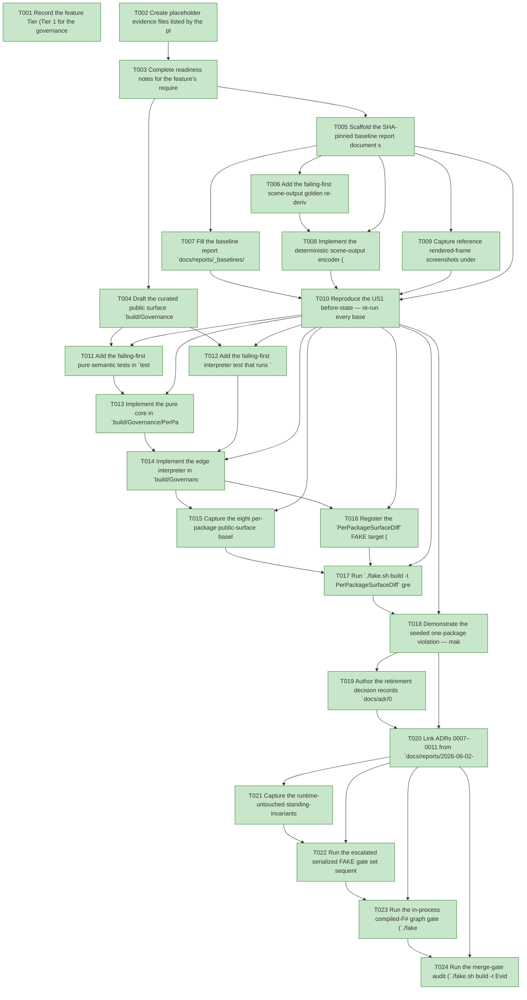

# Task Graph — 048-v3-retirement-baseline

## ✓ Graph is acyclic and consistent

## Skill Match Assessments

| Task | Candidate | Confidence | Signals | Reviewer disposition | Diagnostic |
|------|-----------|------------|---------|----------------------|------------|
| T001 | (none) | none |  | accepted-empty | T001: no high-confidence capability signal detected |
| T002 | (none) | none |  | accepted-empty | T002: no high-confidence capability signal detected |
| T003 | (none) | none |  | accepted-empty | T003: no high-confidence capability signal detected |
| T004 | (none) | none |  | declared | T004: no high-confidence capability signal detected |
| T005 | (none) | none |  | accepted-empty | T005: no high-confidence capability signal detected |
| T006 | (none) | none |  | declared | T006: no high-confidence capability signal detected |
| T007 | (none) | none |  | accepted-empty | T007: no high-confidence capability signal detected |
| T008 | (none) | none |  | declared | T008: no high-confidence capability signal detected |
| T009 | (none) | none |  | declared | T009: no high-confidence capability signal detected |
| T010 | (none) | none |  | accepted-empty | T010: no high-confidence capability signal detected |
| T011 | (none) | none |  | declared | T011: no high-confidence capability signal detected |
| T012 | (none) | none |  | declared | T012: no high-confidence capability signal detected |
| T013 | (none) | none |  | declared | T013: no high-confidence capability signal detected |
| T014 | (none) | none |  | declared | T014: no high-confidence capability signal detected |
| T015 | (none) | none |  | declared | T015: no high-confidence capability signal detected |
| T016 | (none) | none |  | declared | T016: no high-confidence capability signal detected |
| T017 | (none) | none |  | declared | T017: no high-confidence capability signal detected |
| T018 | (none) | none |  | declared | T018: no high-confidence capability signal detected |
| T019 | (none) | none |  | accepted-empty | T019: no high-confidence capability signal detected |
| T020 | (none) | none |  | accepted-empty | T020: no high-confidence capability signal detected |
| T021 | (none) | none |  | accepted-empty | T021: no high-confidence capability signal detected |
| T022 | (none) | none |  | accepted-empty | T022: no high-confidence capability signal detected |
| T023 | speckit-evidence-graph | high | structured task metadata | accepted | T023: task text matches speckit-evidence-graph; trigger_group=graph validation; matched_trigger=structured task metadata |
| T024 | speckit-evidence-audit | high | diff-scan | accepted | T024: task text matches speckit-evidence-audit; trigger_group=evidence audit; matched_trigger=diff-scan |

## Status counts (effective)

| Status | Count |
|--------|-------|
| [X] done | 24 |
| [S] synthetic | 0 |
| [S*] auto-synthetic | 0 |
| accepted [SEH] synthetic | 0 |
| unaccepted synthetic | 0 |

## Graph



## ASCII view

```
T001 [X] Record the feature Tier (Tier 1 for the governance/build surface only — one new curated `build/Governance/PerPackageSurface.fsi`, the `PerPackageSurfaceDiff` target, a Routing rule, and new baseline artifacts; Tier 2-equivalent for the runtime — no runtime `.fsi`, package identity/version, or rendering behaviour change, FR-010/FR-011/SC-007), the affected surfaces (`docs/reports/_baselines/2026-06-02-v3-before.md`, `tests/Parity.Tests/fixtures/v3-host-golden/**`, `readiness/per-package-surface/**`, `readiness/per-package-surface-expectations.md`, `build/Governance/PerPackageSurface.fs(i)`, `build/Governance/Targets.fs(i)` / `Routing.fs` / `Engine/Model.fs` / `Engine/Update.fs`, `tests/Governance.Tests/PerPackageSurfaceTests.fs`, `docs/adr/0007–0011`, and `specs/048-v3-retirement-baseline/readiness/**`), the public-API impact (no runtime `.fsi`; exactly one new governance `.fsi`), the Elmish/MVU applicability (N/A — the capability is a pure `diff` with file reads at a thin edge interpreter; no `Model`/`Msg`/`Cmd`/subscription, Principle IV not warranted), and the real-evidence obligations (SHA-pinned baseline report with per-metric reproduction commands, byte-identical parity golden re-derivation, eight zero-drift per-package baselines, a reverted one-package seeded drift, ADRs 0007–0011, the runtime-untouched proof, and the serialized escalated FAKE gate logs; zero synthetic)
T002 [X] Create placeholder evidence files listed by the plan under `specs/048-v3-retirement-baseline/readiness/` so the audit-enforced readiness files are discoverable at setup: `per-package-surface-diff.md`, `seeded-violation.md`, `baseline-repro.md`, `parity-oracle.md`, `runtime-untouched.md`, the always-required contract trio `governance-risk-levels.md`, `aggregate-hang-diagnostics.md`, `runtime-limitations.md`, the gate records `validation-contract.md`, `evidence-graph.md`, `evidence-audit.md`, the `fsi/per-package-surface-diff.txt` transcript placeholder, and `logs/` (`dev.log`, `per-package-surface-diff.log`, `generated-guidance-check.log`, `template-check.log`, `generated-product-check.log`, `evidence-graph.log`, `evidence-audit.log`)
T003 [X] Complete readiness notes for the feature's required readiness placeholder files — `governance-risk-levels.md` (the small / medium / broad levels, their required evidence, and when broad validation is required), `aggregate-hang-diagnostics.md` (verdict / stage / elapsed duration / last observed command / focused rerun / non-authoritative aggregate, for the known `SkiaViewer.Tests` headless crash), and `runtime-limitations.md` (the .NET 10 desktop / Vulkan / SkiaSharp preview / unsupported macOS/mobile/browser / no software-renderer fallback statements) — each naming its authoritative command, artifact path, failure class, and next action
T004 [X] Draft the curated public surface `build/Governance/PerPackageSurface.fsi` per `contracts/per-package-surface-diff.md` — `PackageId`, `Surface`, `SurfaceLineChange` (`Added`/`Removed`), `PackageDrift`, `DiffOutcome` (`Drifted`/`CheckedPackages`/`MissingBaselines`), and the vals `packagesInScope`, `normalize`, `diffPackage`, `diff`, `captureCurrent`, `loadBaselines`, `runReport` — with the eight in-scope split packages and the monolith + `FS.Skia.UI.Build` exclusion encoded as the surface contract (signatures only; implementation follows in US2)
T005 [X] Scaffold the SHA-pinned baseline report document shape `docs/reports/_baselines/2026-06-02-v3-before.md` per `contracts/baseline-report.md` — the pin header, and the empty labelled sections for monolith LOC (per file), runtime dependency graph, duplicate-type inventory, leak proof, and consumer inventory, each with a placeholder for its reproduction command (values filled in US1)
T006 [X] Add the failing-first scene-output golden re-derivation test under `tests/Parity.Tests/fixtures/v3-host-golden/` that re-runs the deterministic encoder over the current host's seed scenes and asserts **byte-identical** output (0-byte diff, SC-003); it is red until the encoder and committed fixtures exist (T008)
T007 [X] Fill the baseline report `docs/reports/_baselines/2026-06-02-v3-before.md` sections with measured values — `src/Lib/*.fs(i)` LOC per file, the runtime package dependency graph, the duplicate-type inventory across `src/Scene/Scene.fsi` and `src/Lib/Library.fsi`, the leak proof showing `FS.Skia.UI.SkiaViewer → FS.Skia.UI` and a generated default `app` resolving the monolith, and the complete consumer inventory (runtime `src/SkiaViewer`, all sample projects at the pin classified monolith-consumer vs split-package-only, the test projects, and `build/Governance/Front/Support.fs`) — each headline metric naming the exact command that reproduces it (FR-001/002/003, SC-001/002)
T008 [X] Implement the deterministic scene-output encoder (stable node ordering, canonical numeric formatting, no timestamps/environment-dependent fields, versioned with the fixture) and capture the golden fixtures under `tests/Parity.Tests/fixtures/v3-host-golden/scene-output/<seed>.txt` from the current host, turning T006 green (FR-004, SC-003)
T009 [X] Capture reference rendered-frame screenshots under `tests/Parity.Tests/fixtures/v3-host-golden/screenshots/<sample>.png` from the current host (`ScreenshotGallery`/`EffectsGallery`/`BasicViewer`) together with `capture-environment.md` (OS, GPU/driver, .NET/toolchain, capture command, timestamp), recorded as **corroboration only** with scene-output documented as the authoritative oracle; if the known `SkiaViewer.Tests` libdecor-gtk headless crash prevents capture in this environment, mark the screenshot capture `[-]` with a Principle V infeasibility note in `capture-environment.md` (environment + failure class + the GPU-passthrough host required) rather than faking frames — scene-output (T008) remains the authoritative gate (FR-005)
T010 [X] Reproduce the US1 before-state — re-run every baseline headline metric and the leak-proof dump from their recorded commands and confirm the report values match, and re-derive the scene-output golden byte-identically — recording the re-runs (command + output) in `readiness/baseline-repro.md` and `readiness/parity-oracle.md` (SC-001/002/003)
T011 [X] Add the failing-first pure semantic tests in `tests/Governance.Tests/PerPackageSurfaceTests.fs` exercising the `PerPackageSurface` surface through its `.fsi` — identical surfaces yield empty `Drifted`; a single mutated signature yields exactly one `PackageDrift` for that package and no other (the SC-005 oracle over literal-but-real surface text); a current package with no baseline lands in `MissingBaselines` and fails (Principle VII)
T012 [X] Add the failing-first interpreter test that runs `captureCurrent`/`loadBaselines` over the real source tree and committed baselines and asserts `Drifted = []` and `MissingBaselines = []` at the pin (the SC-004 oracle); red until the edge interpreter and the eight baselines exist
T013 [X] Implement the pure core in `build/Governance/PerPackageSurface.fs` — `normalize` (strip `//` and `(* *)` comments, trim trailing whitespace, collapse blank-line runs, normalize newlines to `\n`, preserve declaration order), `diffPackage` (DiffPlex line comparison, `None` ⇒ zero drift), and `diff` (per-package, missing baseline ⇒ `MissingBaselines`), turning T011 green
T014 [X] Implement the edge interpreter in `build/Governance/PerPackageSurface.fs` — `captureCurrent` (read each in-scope package's `.fsi` file(s) and normalize, aggregating the `Controls` package's multiple `.fsi` files in filename order), `loadBaselines` (read `readiness/per-package-surface/*.fsi.txt`), and `runReport` (write the per-package drift report, return clean ⇔ no drift and no missing) — failing loud with the package, the added/removed lines, and the baseline path on drift
T015 [X] Capture the eight per-package public-surface baselines at the pin under `readiness/per-package-surface/<PackageId>.fsi.txt` (`Scene`, `SkiaViewer`, `Elmish`, `KeyboardInput`, `Layout`, `Controls`, `Controls.Elmish`, `Testing`), excluding the monolith `FS.Skia.UI` and the build-tooling `FS.Skia.UI.Build`, turning T012 green
T016 [X] Register the `PerPackageSurfaceDiff` FAKE target (`Targets.fs(i)` `allTargets`/`name`/`directPrerequisites = [ Build ]`/metadata), wire the `BuildEffect`/`StartTarget` arm in `Engine/Model.fs` + `Engine/Update.fs`, add the new `Routing.fs` rule over `readiness/per-package-surface/**` + the new module path (tier `FocusedAuthority`, gates `[ PerPackageSurfaceDiff ]`, expected artifact `readiness/per-package-surface-expectations.md`), author that expectations doc. **Routing-rule sub-step deferred (runtime-coupling finding):** a rule would render `PerPackageSurfaceDiff` into `validation.contract.yml`, whose known-gate allowlist is validated by the runtime monolith (`src/Lib/AgentValidation.fs` `knownGates`); adding the gate there would modify runtime code, violating SC-007 (`src/**` byte-unchanged). The target ships additive + runnable directly; Route-gating is deferred with the Stage-5 hard-gate enforcement and the Stage-2 `AgentValidation` relocation (ADR 0009). `validation.contract.yml` is therefore unchanged. See `readiness/per-package-surface-expectations.md` and `readiness/runtime-untouched.md`
T017 [X] Run `./fake.sh build -t PerPackageSurfaceDiff` green at the pin (zero drift across the eight packages, SC-004), capture the FSI transcript exercising `diff`/`captureCurrent` to `readiness/fsi/per-package-surface-diff.txt`, and record the zero-drift run in `readiness/per-package-surface-diff.md`
T018 [X] Demonstrate the seeded one-package violation — make a reverted scratch edit to one public `.fsi` (e.g. `src/Scene/Scene.fsi`), re-run the target so `Drifted` reports exactly that one package and no other, then `git checkout --` the file and re-run to confirm zero drift — recording the demonstration in `readiness/seeded-violation.md` (real reverted edit over real files, SC-005)
T019 [X] Author the retirement decision records `docs/adr/0007-host-ownership.md`, `0008-scene-vocabulary-single-source.md`, `0009-agentvalidation-placement.md`, `0010-legacy-sample-policy.md`, `0011-parity-oracle-method.md` in the existing `0006-*` ADR format — each with Status, Date, Decision source, Context, Decision, Alternatives, Rationale, and **Affected stages** (research.md D8)
T020 [X] Link ADRs 0007–0011 from `docs/reports/2026-06-02-v3-modular-distribution-implementation-plan.md` and confirm each ADR is present with all required sections, recording the presence + link check in `readiness/baseline-repro.md` (FR-009, SC-006)
T021 [X] Capture the runtime-untouched standing-invariants proof in `readiness/runtime-untouched.md` — `git diff --stat -- 'src/**'` is empty (monolith, split packages, host, and `SceneConversion.fs` byte-unchanged, SC-007) and the existing aggregate `PackageSurfaceCheck` stays green and unchanged with no new `PackageVersion` outside `Directory.Packages.props` (FR-010/FR-011)
T022 [X] Run the escalated serialized FAKE gate set sequentially — `Dev` → `PerPackageSurfaceDiff` → `GeneratedGuidanceCheck` → `TemplateCheck` → `GeneratedProductCheck` → the final graph and audit gates (T023/T024) — never concurrently; record aggregate FAKE results as **non-authoritative** and rerun any race-like or environment-flaky failure (the known `SkiaViewer.Tests` headless crash) in focused isolation as the authoritative result; logs under `readiness/logs/`
T023 [X] Run the in-process compiled-F# graph gate (`./fake.sh build -t EvidenceGraph`) — confirm the DAG is acyclic, no dangling refs, no `[S*]` surprises, and the structured task metadata and visible mirrors are valid (`verdict=ok`)
T024 [X] Run the merge-gate audit (`./fake.sh build -t EvidenceAudit`) — confirm `verdict=PASS` (0 unaccepted-synthetic, 0 auto-synthetic, 0 late-seh, 0 blocking diff-scan, 0 blocking readiness-contract) with zero synthetic evidence to accept (SC-008)
```

