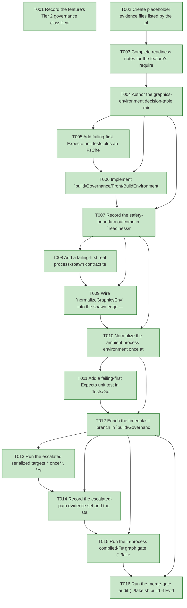

# Task Graph — 049-fix-escalated-flake

## ✓ Graph is acyclic and consistent

## Skill Match Assessments

| Task | Candidate | Confidence | Signals | Reviewer disposition | Diagnostic |
|------|-----------|------------|---------|----------------------|------------|
| T001 | (none) | none |  | accepted-empty | T001: no high-confidence capability signal detected |
| T002 | (none) | none |  | accepted-empty | T002: no high-confidence capability signal detected |
| T003 | (none) | none |  | accepted-empty | T003: no high-confidence capability signal detected |
| T004 | (none) | none |  | accepted-empty | T004: no high-confidence capability signal detected |
| T005 | (none) | none |  | declared | T005: no high-confidence capability signal detected |
| T006 | (none) | none |  | accepted-empty | T006: no high-confidence capability signal detected |
| T007 | (none) | none |  | accepted-empty | T007: no high-confidence capability signal detected |
| T008 | (none) | none |  | declared | T008: no high-confidence capability signal detected |
| T009 | (none) | none |  | declared | T009: no high-confidence capability signal detected |
| T010 | (none) | none |  | declared | T010: no high-confidence capability signal detected |
| T011 | (none) | none |  | declared | T011: no high-confidence capability signal detected |
| T012 | (none) | none |  | declared | T012: no high-confidence capability signal detected |
| T013 | (none) | none |  | accepted-empty | T013: no high-confidence capability signal detected |
| T014 | (none) | none |  | accepted-empty | T014: no high-confidence capability signal detected |
| T015 | speckit-evidence-graph | high | EvidenceGraph | accepted | T015: task text matches speckit-evidence-graph; trigger_group=graph validation; matched_trigger=EvidenceGraph |
| T016 | speckit-evidence-audit | high | diff-scan | accepted | T016: task text matches speckit-evidence-audit; trigger_group=evidence audit; matched_trigger=diff-scan |

## Status counts (effective)

| Status | Count |
|--------|-------|
| [X] done | 16 |
| [S] synthetic | 0 |
| [S*] auto-synthetic | 0 |
| accepted [SEH] synthetic | 0 |
| unaccepted synthetic | 0 |

## Graph



## ASCII view

```
T001 [X] Record the feature's Tier 2 governance classification (internal build-tooling: no public `.fsi`, surface-baseline, or `PackageVersion` change — `Route` escalates it to `maintainer-verify` via default-deny because the changed paths under `build/**` and `tests/**` fall outside the inner-loop `src/**` allowance), the affected surfaces (`build/Governance/Front/BuildEnvironment.fs`, `BuildProcess.fs`, `BuildProcessHealth.fs`, `build/Program.fs`, `tests/Governance.Tests/GraphicsEnvironmentTests.fs`, and `specs/049-fix-escalated-flake/readiness/**`), the public-API impact (none), the Elmish/MVU applicability (N/A — the build front-end already owns an Engine `Model`/`Update`/`Interpret`; the new `normalizeGraphicsEnv` is a pure function consumed at the existing interpreter edge and adds no new `Model`/`Msg`/`Effect`), and the real-evidence obligations (failing-first unit + property + spawn-contract tests, a single-run escalated execution, and the named readiness set; zero synthetic)
T002 [X] Create placeholder evidence files listed by the plan under `specs/049-fix-escalated-flake/readiness/` so the audit-enforced readiness files are discoverable at setup: `aggregate-hang-diagnostics.md`, `runtime-limitations.md`, `graphics-env-contract.md`, `governance-risk-levels.md`, the escalated-path evidence set `target-metadata.md` and `agent-ready-verdict.md`, and `logs/` (`dev.log`, `generated-guidance-check.log`, `template-check.log`, `generated-product-check.log`, `evidence-graph.log`, `evidence-audit.log`)
T003 [X] Complete readiness notes for the feature's required readiness placeholder files — `governance-risk-levels.md` (the small / medium / broad levels, their required evidence, and when broad validation is required), `aggregate-hang-diagnostics.md` (verdict / stage / elapsed duration / last observed command / whether a focused rerun was needed / the now-authoritative single-run aggregate), and `runtime-limitations.md` (deterministic graphics-backend selection in headless/unsupported environments, no software-renderer fallback, unsupported macOS/mobile/browser) — each naming its authoritative command, artifact path, failure class, and next action
T004 [X] Author the graphics-environment decision-table mirror at `specs/049-fix-escalated-flake/readiness/graphics-env-contract.md` reflecting `contracts/graphics-env-contract.md` — the display-state classification (DualDisplay / WaylandOnly / X11Only / Neither), the per-condition mutation table (`WAYLAND_DISPLAY` removed, `GDK_BACKEND=x11`, `SDL_VIDEODRIVER=x11` on DualDisplay; identity otherwise), the child-propagation guarantee, the safety clause on already-working hosts, the bounded-failure clause, and the no-exit-code-masking clause — and record the no-`.fsi` exemption rationale (the build front-end is an internal compiled application, not a packed library with a curated public surface, so Principle II's `.fsi` requirement is N/A)
T005 [X] Add failing-first Expecto unit tests plus an FsCheck property test for `normalizeGraphicsEnv` in `tests/Governance.Tests/GraphicsEnvironmentTests.fs` — DualDisplay input → `WAYLAND_DISPLAY` removed and `GDK_BACKEND=x11` / `SDL_VIDEODRIVER=x11` set; WaylandOnly / X11Only / Neither inputs → identity (unchanged); and the totality + idempotence properties (`normalize (normalize m) = normalize m`, defined for every map including empty, no entries touched beyond the three named keys)
T006 [X] Implement `build/Governance/Front/BuildEnvironment.fs` — the `GraphicsDisplayState` classification derived from `WAYLAND_DISPLAY` / `DISPLAY` presence, and the pure `normalizeGraphicsEnv : Map<string,string> -> Map<string,string>` that applies the DualDisplay mutation only and is identity for every other classification, until T005's tests pass green (FR-002/FR-007)
T007 [X] Record the safety-boundary outcome in `readiness/runtime-limitations.md` — that under WaylandOnly / X11Only / Neither the guard is a no-op, so backend selection, behavior, and visual output are unchanged from before this feature — citing the green single-display / no-display unit cases as the authoritative evidence (FR-007, SC-004)
T008 [X] Add a failing-first real process-spawn contract test in `tests/Governance.Tests/GraphicsEnvironmentTests.fs` — under a synthesized DualDisplay ambient environment, a child launched by `BuildProcess.runProcessWithAllowedExitCodes` MUST observe **no** `WAYLAND_DISPLAY` and MUST observe `GDK_BACKEND=x11` (contract C2 / FR-003); **and a child that returns a non-zero exit code under the same normalized spawn MUST still be reported as failing — its exit code is propagated unchanged (C5 / FR-008 / SC-006)**; the test inspects the spawned child's real inherited environment and real exit code, not a mock
T009 [X] Wire `normalizeGraphicsEnv` into the spawn edge — build each child's `startInfo.Environment` from the current environment plus the caller's map, then normalize, in `build/Governance/Front/BuildProcess.fs` (`runProcessWithAllowedExitCodes`) and `build/Governance/Front/BuildProcessHealth.fs` (`runShortCommand`), and preserve the child's exit code unchanged so genuine failures still surface (C2 / C5, FR-003 / FR-008), until T008 passes green
T010 [X] Normalize the ambient process environment once at `build/Program.fs` startup when DualDisplay holds (remove `WAYLAND_DISPLAY`; set `GDK_BACKEND=x11` / `SDL_VIDEODRIVER=x11`) so every descendant — `dotnet test`, FSI, and nested `bash ./fake.sh build -t <target>` — inherits the deterministic selection, and log the decision once (forced/removed keys, or "no-op: condition not met") (FR-002 / FR-003)
T011 [X] Add a failing-first Expecto unit test in `tests/Governance.Tests/GraphicsEnvironmentTests.fs` for the kill-on-timeout diagnostic builder — given a process killed at its `WaitForExit` bound, the produced message MUST name a probable graphics-backend initialization failure as a candidate cause and point to `readiness/runtime-limitations.md`, while remaining distinct from an ordinary nonzero-exit message (FR-005, SC-005)
T012 [X] Enrich the timeout/kill branch in `build/Governance/Front/BuildProcess.fs` so a kill-at-`WaitForExit` appends the diagnostic from T011 (probable graphics-backend init failure + pointer to `runtime-limitations.md`), leaving the existing 30-minute bound and the child exit code unchanged so the fix fails fast without masking real regressions (FR-005 / FR-008, SC-005), until T011 passes green
T013 [X] Run the escalated serialized targets **once**, **sequentially** (shared `.fake` state), with no manual `env -u WAYLAND_DISPLAY` prefix — `Dev` → `GeneratedGuidanceCheck` → `TemplateCheck` → `GeneratedProductCheck` — capturing each log under `readiness/logs/` and recording the single-run authoritative verdict in `readiness/aggregate-hang-diagnostics.md`: no `libdecor-gtk` teardown crash — the GUI/viewer tests pass their assertions **and are reported as passing**, with the focused `dotnet test tests/SkiaViewer.Tests -m:1` control captured under `readiness/logs/` as corroboration that a green run is no longer turned red on teardown (US1 / FR-001 / FR-004, SC-001), `GeneratedProductCheck` within its normal envelope with no ~20-minute graphics-init stall (US2 / FR-003, SC-002), and an authoritative pass obtained from a single run with the obsolete "non-authoritative aggregate / rerun by hand" caveat removed for this flake class (FR-006 / FR-009, SC-003)
T014 [X] Record the escalated-path evidence set and the standing-invariants proof — `readiness/target-metadata.md` (no FAKE target added, removed, or renamed; `validation.contract.yml` / `TargetMetadata` / `TargetMetadataDrift` outputs unchanged, contract C6) and `readiness/agent-ready-verdict.md` (the agent-ready judgement from the single-run escalated evidence) — and confirm `git diff --stat -- 'src/**'` is empty so product runtime and `.fsi` are byte-unchanged (SC-004, plan Tier 2)
T015 [X] Run the in-process compiled-F# graph gate (`./fake.sh build -t EvidenceGraph`) — confirm the DAG is acyclic, no dangling refs, no `[S*]` surprises, and the structured `skillist` metadata and visible mirrors are valid (`verdict=ok`)
T016 [X] Run the merge-gate audit (`./fake.sh build -t EvidenceAudit`) — confirm `verdict=PASS` (0 unaccepted-synthetic, 0 auto-synthetic, 0 late-seh, 0 blocking diff-scan, 0 blocking readiness-contract) with zero synthetic evidence to accept
```

