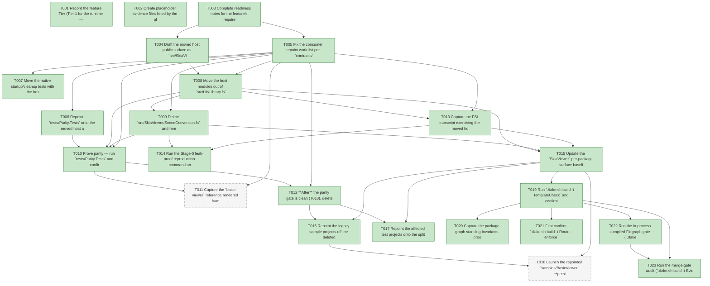

# Task Graph — 050-v3-host-extraction

## ✓ Graph is acyclic and consistent

## Skill Match Assessments

| Task | Candidate | Confidence | Signals | Reviewer disposition | Diagnostic |
|------|-----------|------------|---------|----------------------|------------|
| T001 | (none) | none |  | accepted-empty | T001: no high-confidence capability signal detected |
| T002 | (none) | none |  | accepted-empty | T002: no high-confidence capability signal detected |
| T003 | (none) | none |  | accepted-empty | T003: no high-confidence capability signal detected |
| T004 | (none) | none |  | declared | T004: no high-confidence capability signal detected |
| T005 | (none) | none |  | accepted-empty | T005: no high-confidence capability signal detected |
| T006 | (none) | none |  | declared | T006: no high-confidence capability signal detected |
| T007 | (none) | none |  | declared | T007: no high-confidence capability signal detected |
| T008 | (none) | none |  | declared | T008: no high-confidence capability signal detected |
| T009 | (none) | none |  | declared | T009: no high-confidence capability signal detected |
| T010 | (none) | none |  | declared | T010: no high-confidence capability signal detected |
| T011 | (none) | none |  | declared | T011: no high-confidence capability signal detected |
| T012 | (none) | none |  | declared | T012: no high-confidence capability signal detected |
| T013 | (none) | none |  | declared | T013: no high-confidence capability signal detected |
| T014 | (none) | none |  | declared | T014: no high-confidence capability signal detected |
| T015 | (none) | none |  | declared | T015: no high-confidence capability signal detected |
| T016 | (none) | none |  | declared | T016: no high-confidence capability signal detected |
| T017 | (none) | none |  | declared | T017: no high-confidence capability signal detected |
| T018 | (none) | none |  | declared | T018: no high-confidence capability signal detected |
| T019 | (none) | none |  | declared | T019: no high-confidence capability signal detected |
| T020 | (none) | none |  | accepted-empty | T020: no high-confidence capability signal detected |
| T021 | (none) | none |  | accepted-empty | T021: no high-confidence capability signal detected |
| T022 | speckit-evidence-graph | high | structured task metadata | accepted | T022: task text matches speckit-evidence-graph; trigger_group=graph validation; matched_trigger=structured task metadata |
| T023 | speckit-evidence-audit | high | diff-scan | accepted | T023: task text matches speckit-evidence-audit; trigger_group=evidence audit; matched_trigger=diff-scan |

## Status counts (effective)

| Status | Count |
|--------|-------|
| [X] done | 21 |
| [S] synthetic | 0 |
| [S*] auto-synthetic | 0 |
| [-] skipped | 2 |
| accepted [SEH] synthetic | 0 |
| unaccepted synthetic | 0 |

## Graph



## ASCII view

```
T001 [X] Record the feature Tier (Tier 1 for the runtime — public surface moves between packages: new `src/SkiaViewer/Host/*.fsi`, re-pointed `src/SkiaViewer/SkiaViewer.fsi`, shrunken `src/Lib/Library.fsi`, dropped packed `FS.Skia.UI.SkiaViewer → FS.Skia.UI` dependency, deleted `src/SkiaViewer/SceneConversion.fs` and `src/Lib` host + duplicate-scene modules), the affected surfaces (`src/SkiaViewer/**`, `src/Lib/Library.fs(i)` + `VulkanStartup`/`VulkanResources`, the repointed `samples/**` + `tests/**` `.fsproj`s, `readiness/per-package-surface/FS.Skia.UI.SkiaViewer.fsi.txt`, and `specs/050-v3-host-extraction/readiness/**`), the public-API impact (net `SkiaViewer` surface expected stable — the wrapper already re-exposed the host; any delta recorded), the Elmish/MVU applicability (the host **is** the Elmish runtime edge — `Viewer.create`/`run`/event/effect/subscription mappings; the boundary is **moved with identical function shapes**, `update` purity and effect-at-edge preserved, proven by parity + native startup/cleanup tests, not redesigned), and the real-evidence obligations (byte-identical scene-output parity vs the Stage-0 golden, the leak-proof dump, the updated per-package surface baseline with a clean `PerPackageSurfaceDiff`, native startup/cleanup, a persistent `BasicViewer` launch / recorded headless infeasibility, and the serialized escalated FAKE gate logs; zero synthetic)
T002 [X] Create placeholder evidence files listed by the plan under `specs/050-v3-host-extraction/readiness/` so the audit-enforced readiness files are discoverable at setup: `parity-scene-output-diff.md`, `parity-reference-frame.md`, `leak-proof.md`, `per-package-surface-diff.md`, `native-startup-cleanup.md`, `acyclic-graph.md`, `window-visibility.md`, `template-check-validation.md`, the always-required contract trio `governance-risk-levels.md`, `aggregate-hang-diagnostics.md`, `runtime-limitations.md`, the gate records `validation-contract.md`, `evidence-graph.md`, `evidence-audit.md`, the `fsi/skiaviewer-host.txt` transcript placeholder, and `logs/` (`dev.log`, `per-package-surface-diff.log`, `generated-guidance-check.log`, `template-check.log`, `generated-product-check.log`, `evidence-graph.log`, `evidence-audit.log`)
T003 [X] Complete readiness notes for the feature's required readiness placeholder files — `governance-risk-levels.md` (the small / medium / broad levels, their required evidence, and when broad validation is required), `aggregate-hang-diagnostics.md` (verdict / stage / elapsed duration / last observed command / focused rerun / non-authoritative aggregate, for the known `SkiaViewer.Tests` headless crash), and `runtime-limitations.md` (the .NET 10 desktop / Vulkan / SkiaSharp preview / unsupported macOS/mobile/browser / no software-renderer fallback statements) — each naming its authoritative command, artifact path, failure class, and next action
T004 [X] Draft the moved host public surface as `src/SkiaViewer/Host/*.fsi` per `contracts/host-extraction.md` — `Host/Viewer.fsi` (`create`/`run`/`withEventMapping`/`withEffectMapping`/`withSubscription`/`defaultConfiguration`, preserving the wrapper's re-exposed shapes), `Host/Diagnostics.fsi` (`RenderDiagnostic` / the `Diagnostics` module, unless `RenderDiagnostic` is retained by `Lib.Parity` — resolve its canonical home at edit time), and the internal `Host/Vulkan.fsi` (`VulkanStartup`/`VulkanResources` + the relocated `VulkanHost` body), every host-facing scene type already named as the `FS.Skia.UI.Scene` equivalent (signatures only; implementation follows in US1)
T005 [X] Fix the consumer repoint work-list per `contracts/repoint-matrix.md` — enumerate each affected `samples/**` and `tests/**` project's current `Lib` `ProjectReference` and its post-move target (`Scene` + `SkiaViewer` (+ `Elmish` where used), or the reduced `AgentValidation`/`Parity` reference retained for `Governance.Tests`/`ParityGallery`), recorded as the work-list with no edits yet
T006 [X] Repoint `tests/Parity.Tests` onto the moved host and add the failing-first byte-identical scene-output assertion that re-derives the deterministic scene-output for the three Stage-0 seeds (`basic-viewer`/`effects-gallery`/`screenshot-gallery`) and asserts **0-byte** diff vs `tests/Parity.Tests/fixtures/v3-host-golden/scene-output/<seed>.txt`; it is red until the host moves (T008) and **retains** `Parity.Tests` as the parity harness (FR-007, SC-002)
T007 [X] Move the native startup/cleanup tests with the host into the `SkiaViewer` test surface and assert unchanged native startup/cleanup lifetime behaviour (FR-012); red/relocated until the host modules land in `src/SkiaViewer/Host` (T008)
T008 [X] Move the host modules out of `src/Lib/Library.fs` (+ the separate `VulkanStartup.fs(i)`/`VulkanResources.fs(i)`) into `src/SkiaViewer/Host/{Vulkan,Diagnostics,Viewer}.fs(i)`, retyped onto the `FS.Skia.UI.Scene` vocabulary (every internal `Vertex`/`VertexMode`/`TextRun`/`FontSpec`/`PerspectiveTransform`/`Scene`/`Paint`/`Path`/`Colors` use rewritten to the `Scene` equivalent), preserving the public function shapes, and add the `Host/*` compile items to `SkiaViewer.fsproj` in dependency order — turning T006/T007 buildable (FR-001/002)
T009 [X] Delete `src/SkiaViewer/SceneConversion.fs` and remove the `SkiaViewer → Lib` `ProjectReference` from `SkiaViewer.fsproj` so `FS.Skia.UI.SkiaViewer` depends only on `Scene` + `KeyboardInput` + its native packages, and re-point `SkiaViewer.fs` onto the in-package host (no `Lib.Viewer.*` call, no conversion) (FR-003/004)
T010 [X] Prove parity — run `tests/Parity.Tests` and confirm the moved host re-derives the Stage-0 scene-output golden **byte-identically (0-byte diff)** for all three seeds (turning T006 green), recording the run in `readiness/parity-scene-output-diff.md`; this is the merge gate that **must** be clean before any legacy host source is deleted (FR-008, SC-002, ADR 0011)
T011 [-] Capture the `basic-viewer` reference rendered frame from the moved host and confirm it matches the Stage-0 capture (`tests/Parity.Tests/fixtures/v3-host-golden/screenshots/basic-viewer.png`), recorded as corroboration in `readiness/parity-reference-frame.md`; if the known `SkiaViewer.Tests` libdecor-gtk headless crash prevents capture in this environment, mark this `[-]` with a Principle V infeasibility note (environment + failure class + the GPU-passthrough host required) rather than faking the frame — scene-output (T010) remains the authoritative oracle (FR-008) — SKIPPED rationale: headless environment lacks guaranteed GPU passthrough; reference-frame re-capture infeasible, disclosed per Principle V in readiness/parity-reference-frame.md (scene-output parity is authoritative and clean).
T012 [X] **After** the parity gate is clean (T010), delete `src/Lib`'s now-redundant host + duplicate scene modules from `Library.fs(i)` (`Colors`/`Paint`/`Path`/`Scene`/`Diagnostics`/`Viewer` + the relocated `VulkanHost`) and remove the `VulkanStartup`/`VulkanResources` compile items from `Lib.fsproj`, leaving `Lib` with only `AgentValidation`, the duplicate `KeyboardInput`, and the `Parity` helper, and record the residue confirmation (FR-005, SC-004)
T013 [X] Capture the FSI transcript exercising the moved host's public surface (`create` / `run` / `defaultConfiguration`) through the `SkiaViewer` package surface to `readiness/fsi/skiaviewer-host.txt`, evidencing the preserved function shapes (FR-001)
T014 [X] Run the Stage-0 leak-proof reproduction command and record `readiness/leak-proof.md` — (a) the packed `FS.Skia.UI.SkiaViewer` dependency group has **no** `FS.Skia.UI` entry (SC-001), and (b) a freshly generated default `app` resolves **without** `FS.Skia.UI` in its transitive dependency set (SC-003) — the authoritative leak-closed signal
T015 [X] Update the `SkiaViewer` per-package surface baseline `readiness/per-package-surface/FS.Skia.UI.SkiaViewer.fsi.txt` to the post-move `.fsi`, run `./fake.sh build -t PerPackageSurfaceDiff` clean against it, and record the net public-surface delta (expected empty; any delta from a formerly-converted type now surfaced as the `Scene` type explicitly justified) in `readiness/per-package-surface-diff.md`, confirming the aggregate `PackageSurfaceCheck` stays green and `FS.Skia.UI.Scene` remains FSharp.Core-only (FR-011, SC-006/SC-007)
T016 [X] Repoint the legacy sample projects off the deleted `Lib` modules onto `FS.Skia.UI.Scene` + `FS.Skia.UI.SkiaViewer` (+ `Elmish` where used) — `samples/BasicViewer`, `samples/EffectsGallery`, `samples/ScreenshotGallery`, `samples/InteractiveViewer`, and drop the now-redundant `Lib` reference from `samples/DemoReel` (it already references `SkiaViewer`/`Layout`/`Controls`/`Elmish`) — and confirm each restores/builds (FR-006, SC-005)
T017 [X] Repoint the affected test projects onto the split packages — `tests/Lib.Tests`, `tests/Smoke.Tests`, `tests/Package.Tests` onto `FS.Skia.UI.Scene` + `FS.Skia.UI.SkiaViewer` for the host/scene surface they assert; keep the reduced `Lib` reference for `tests/Governance.Tests` (→ `AgentValidation` only) and `samples/ParityGallery` (→ the `Parity` helper only); confirm each restores/builds/runs (FR-006, SC-005)
T018 [-] Launch the repointed `samples/BasicViewer` **persistently** from its default executable path and confirm a visible window renders a first frame matching the Stage-0 `basic-viewer` reference, recording `readiness/window-visibility.md` (visible-window / first-frame evidence); if GPU passthrough is unavailable, record the unsupported-host diagnostic and the GPU-passthrough host required per Principle V rather than substituting a metadata-only run — SKIPPED rationale: persistent visible-window first-frame requires GPU passthrough unavailable headlessly; unsupported-host diagnostic recorded per Principle V in readiness/window-visibility.md (repointed BasicViewer builds + links the moved host).
T019 [X] Run `./fake.sh build -t TemplateCheck` and confirm the default `app` template profile restores/builds/runs and that its generated output no longer pulls `FS.Skia.UI` transitively (cross-referencing the T014 leak proof), recording `readiness/template-check-validation.md` (FR-009, SC-008)
T020 [X] Capture the package-graph standing-invariants proof in `readiness/acyclic-graph.md` — `FS.Skia.UI.SkiaViewer → { FS.Skia.UI.Scene, FS.Skia.UI.KeyboardInput }` + native packages only, **no** `SkiaViewer → Lib` edge, **no** `Scene → SkiaViewer` back-edge, `FS.Skia.UI.Scene` FSharp.Core-only, the package graph acyclic, no new `PackageVersion` outside `Directory.Packages.props`, and no FCS / dynamic compilation / runtime script-loading introduced by the host move (FR-010, FR-013, SC-006; carried invariant 7)
T021 [X] First confirm `./fake.sh build -t Route --enforce` reports the escalated tier with every required evidence artifact present, then run the escalated serialized FAKE gate set sequentially — `Dev` → `PerPackageSurfaceDiff` → `GeneratedGuidanceCheck` → `TemplateCheck` → `GeneratedProductCheck` → the final graph and audit gates (T022/T023) — never concurrently; record aggregate FAKE results as **non-authoritative** and rerun any race-like or environment-flaky failure (the known `SkiaViewer.Tests` headless crash) in focused isolation as the authoritative result, with deterministic scene-output as the primary parity oracle; logs under `readiness/logs/`
T022 [X] Run the in-process compiled-F# graph gate (`./fake.sh build -t EvidenceGraph`) — confirm the DAG is acyclic, no dangling refs, no `[S*]` surprises, and the structured task metadata and visible mirrors are valid (`verdict=ok`)
T023 [X] Run the merge-gate audit (`./fake.sh build -t EvidenceAudit`) — confirm `verdict=PASS` (0 unaccepted-synthetic, 0 auto-synthetic, 0 late-seh, 0 blocking diff-scan, 0 blocking readiness-contract) with zero synthetic evidence to accept (SC-008)
```

