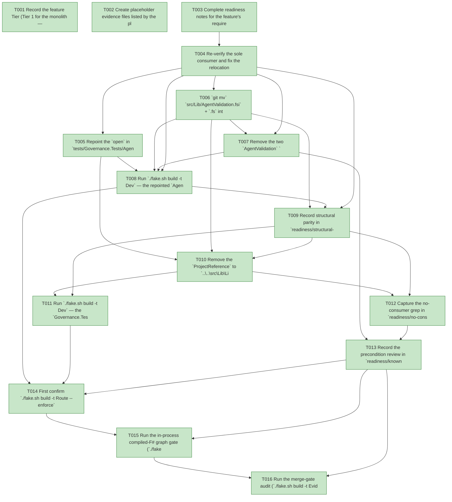

# Task Graph — 051-relocate-agentvalidation

## ✓ Graph is acyclic and consistent

## Skill Match Assessments

| Task | Candidate | Confidence | Signals | Reviewer disposition | Diagnostic |
|------|-----------|------------|---------|----------------------|------------|
| T001 | (none) | none |  | accepted-empty | T001: no high-confidence capability signal detected |
| T002 | (none) | none |  | accepted-empty | T002: no high-confidence capability signal detected |
| T003 | (none) | none |  | accepted-empty | T003: no high-confidence capability signal detected |
| T004 | (none) | none |  | accepted-empty | T004: no high-confidence capability signal detected |
| T005 | (none) | none |  | accepted-empty | T005: no high-confidence capability signal detected |
| T006 | (none) | none |  | declared | T006: no high-confidence capability signal detected |
| T007 | (none) | none |  | declared | T007: no high-confidence capability signal detected |
| T008 | (none) | none |  | accepted-empty | T008: no high-confidence capability signal detected |
| T009 | (none) | none |  | accepted-empty | T009: no high-confidence capability signal detected |
| T010 | (none) | none |  | accepted-empty | T010: no high-confidence capability signal detected |
| T011 | (none) | none |  | accepted-empty | T011: no high-confidence capability signal detected |
| T012 | (none) | none |  | accepted-empty | T012: no high-confidence capability signal detected |
| T013 | (none) | none |  | accepted-empty | T013: no high-confidence capability signal detected |
| T014 | (none) | none |  | accepted-empty | T014: no high-confidence capability signal detected |
| T015 | speckit-evidence-graph | high | structured task metadata | accepted | T015: task text matches speckit-evidence-graph; trigger_group=graph validation; matched_trigger=structured task metadata |
| T016 | speckit-evidence-audit | high | diff-scan | accepted | T016: task text matches speckit-evidence-audit; trigger_group=evidence audit; matched_trigger=diff-scan |

## Status counts (effective)

| Status | Count |
|--------|-------|
| [X] done | 16 |
| [S] synthetic | 0 |
| [S*] auto-synthetic | 0 |
| accepted [SEH] synthetic | 0 |
| unaccepted synthetic | 0 |

## Graph



## ASCII view

```
T001 [X] Record the feature Tier (Tier 1 for the monolith — the published `FS.Skia.UI` package loses the `AgentValidation` public surface and its surface baseline shrinks), the affected surfaces (`build/Governance/FS.Skia.UI.Build.fsproj` + the relocated `AgentValidation.fs(i)`, `src/Lib/Lib.fsproj`, `tests/Governance.Tests/Governance.Tests.fsproj` + `AgentValidationFrameworkTests.fs`, `readiness/surface-baselines/FS.Skia.UI.txt`, and `specs/051-relocate-agentvalidation/readiness/**`), the public-API impact (monolith `.fsi` shrinks by the removed module; **no** runtime split-package baseline changes), the Elmish/MVU applicability (the `ValidationSelection` model/msg/effect/`init`/pure `update`/`ValidationSelectionInterpreter` edge **moves intact** with behaviour preserved — `update` stays pure and file/`git` I/O stays at the interpreter edge, proven by the repointed suite, not redesigned), and the real-evidence obligations (repointed suite green with the same assertion count, identical `knownGates` + accept/reject diagnostics, the structural-rename diff, the no-consumer grep, generated-consumer gates green, and the serialized escalated FAKE gate logs; zero synthetic)
T002 [X] Create placeholder evidence files listed by the plan under `specs/051-relocate-agentvalidation/readiness/` so the audit-enforced readiness files are discoverable at setup: the always-required contract trio `governance-risk-levels.md`, `aggregate-hang-diagnostics.md`, `runtime-limitations.md`; the record notes `structural-parity.md`, `surface-baseline-diff.md`, `no-consumer-grep.md`, `knowngates-precondition.md`; the gate records `validation-contract.md`, `evidence-graph.md`, `evidence-audit.md`; and `logs/` (`dev.log`, `generated-guidance-check.log`, `template-check.log`, `generated-product-check.log`, `evidence-graph.log`, `evidence-audit.log`)
T003 [X] Complete readiness notes for the feature's required readiness placeholder files — `governance-risk-levels.md` (the small / medium / broad levels, their required evidence, and when broad validation is required), `aggregate-hang-diagnostics.md` (verdict / stage / elapsed duration / last observed command / focused rerun / non-authoritative aggregate), and `runtime-limitations.md` (the .NET 10 build-host / governance-tooling statements; no runtime/Vulkan/Skia surface touched) — each naming its authoritative command, artifact path, failure class, and next action
T004 [X] Re-verify the sole consumer and fix the relocation work-list per `contracts/agentvalidation-surface.md` and `research.md` (D2/D6) — `grep -rn "FS.Skia.UI.AgentValidation"` over `*.fs`/`*.fsi`/`*.fsproj`/`*.fsx` confirms only `AgentValidationFrameworkTests.fs`'s `open` plus the two `src/Lib/Lib.fsproj` compile items (the files being moved); record the compile-order slot (`AgentValidation.fsi`/`.fs` immediately after the `Spike` pair, **before** `Routing` so the Stage-5 `Routing → knownGates` consumption stays forward-compatible) and the `FS.Skia.UI.AgentValidation.*` baseline lines to drop — the work-list, no edits yet
T005 [X] Repoint the `open` in `tests/Governance.Tests/AgentValidationFrameworkTests.fs` from `FS.Skia.UI.AgentValidation` to `FS.Skia.UI.Build.AgentValidation` as the **failing-first** compile break (the relocated namespace does not exist until T006); preserve every fixture and assertion unchanged so the suite remains the parity oracle with the **same** assertion count (FR-005, SC-002)
T006 [X] `git mv` `src/Lib/AgentValidation.fsi` + `.fs` into `build/Governance/`, rewrite only the `namespace` line (`FS.Skia.UI.AgentValidation` → `FS.Skia.UI.Build.AgentValidation`) and the doc-comment phrase (`"…exposed by this FS.Skia.UI package."` → `"…exposed by the FS.Skia.UI.Build governance library."`), add the two `<Compile Include>` items **after the `Spike.fsi`/`Spike.fs` pair and before `Routing`** in `build/Governance/FS.Skia.UI.Build.fsproj`, and build the governance library green — no `val`/`type`/field/case added, removed, or retyped (FR-001/003, D1/D2/D3); leaves `Front/Support.fs`'s distinct same-named shadow types untouched and non-colliding (FR-011)
T007 [X] Remove the two `AgentValidation` `<Compile Include>` lines from `src/Lib/Lib.fsproj`, drop every `FS.Skia.UI.AgentValidation.*` line from `readiness/surface-baselines/FS.Skia.UI.txt` (the monolith aggregate baseline; add **no** `FS.Skia.UI.Build.txt` — build-tooling is excluded from surface tooling, D4), build the monolith green, re-run `./fake.sh build -t PackageSurfaceCheck` clean, and confirm `git ls-files src/Lib/AgentValidation.*` returns nothing (FR-002/010, SC-001/006)
T008 [X] Run `./fake.sh build -t Dev` — the repointed `AgentValidationFrameworkTests` suite builds and passes against the relocated module with the **same** assertion count, turning T005 green; this is the behavioural-parity oracle (contract parse accept/reject diagnostics, the `knownGates` set, the `ValidationSelection` MVU transitions, and `AgentVerdict` (de)serialization) (FR-004, SC-002)
T009 [X] Record structural parity in `readiness/structural-parity.md` — `git diff -M --stat` shows `AgentValidation.fs(i)` as renamed `src/Lib` → `build/Governance` at ~100% similarity (only the namespace line + doc-comment phrase differ) — and confirm via the suite that the relocated parser yields an **identical** `knownGates` set and **identical** accept/reject diagnostics vs the pre-move module (SC-003)
T010 [X] Remove the `ProjectReference` to `..\..\src\Lib\Lib.fsproj` from `tests/Governance.Tests/Governance.Tests.fsproj` (it existed solely for `AgentValidation`), leaving the suite referencing only `..\..\build\Governance\FS.Skia.UI.Build.fsproj` for this capability (FR-006)
T011 [X] Run `./fake.sh build -t Dev` — the `Governance.Tests` suite restores/builds/runs green with **no** link back into `src/Lib`, proving the parser without the monolith reference (FR-006, SC-004)
T012 [X] Capture the no-consumer grep in `readiness/no-consumer-grep.md` — `grep -rn "FS.Skia.UI.AgentValidation" --include=*.fs --include=*.fsi --include=*.fsproj --include=*.fsx .` returns nothing (outside git history) and `grep -n "Lib.fsproj" tests/Governance.Tests/Governance.Tests.fsproj` returns nothing (FR-007, SC-004)
T013 [X] Record the precondition review in `readiness/knowngates-precondition.md` — `grep -rn "knownGates" build/Governance/AgentValidation.fs` shows it defined in the governance library and `grep -rn "knownGates" src/Lib` returns nothing; confirm that adding a gate name to the allowlist and rendering it into `validation.contract.yml` would touch only governance/build paths and **no** `src/**` runtime file, and that `validation.contract.yml` is unchanged this stage (currency vs `Routing.fs` preserved) — the Stage-0 deferral precondition is met (FR-008, SC-005/SC-007)
T014 [X] First confirm `./fake.sh build -t Route --enforce` reports the escalated tier with every required evidence artifact present, then run the escalated serialized FAKE gate set sequentially — `Dev` → `GeneratedGuidanceCheck` → `TemplateCheck` → `GeneratedProductCheck` → the final graph and audit gates (T015/T016) — never concurrently; confirm **no** runtime per-package surface baseline drifts (the only surface delta is the monolith shedding the module), the default `app` is byte-unchanged, and the generated-consumer gates stay green (FR-009/010, SC-006); record aggregate FAKE results as **non-authoritative** and rerun any race-like or environment-flaky failure in focused isolation as the authoritative result; logs under `readiness/logs/`
T015 [X] Run the in-process compiled-F# graph gate (`./fake.sh build -t EvidenceGraph`) — confirm the DAG is acyclic, no dangling refs, no `[S*]` surprises, and the structured task metadata and visible mirrors are valid (`verdict=ok`)
T016 [X] Run the merge-gate audit (`./fake.sh build -t EvidenceAudit`) — confirm `verdict=PASS` (0 unaccepted-synthetic, 0 auto-synthetic, 0 late-seh, 0 blocking diff-scan, 0 blocking readiness-contract) with zero synthetic evidence to accept (SC-008)
```

