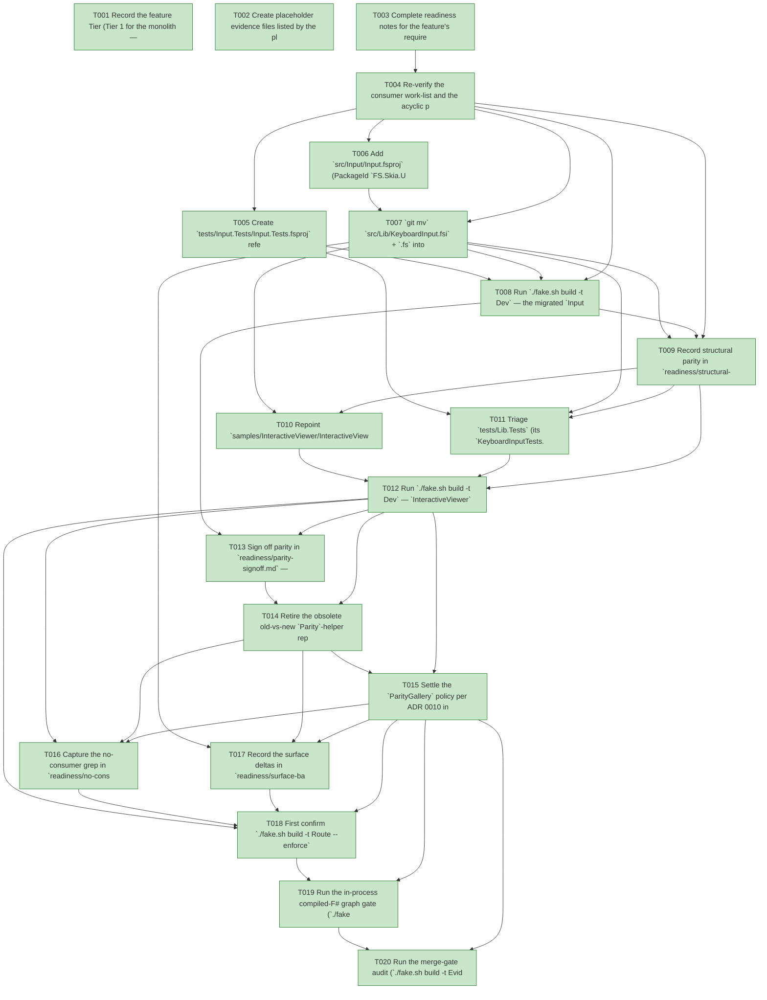

# Task Graph — 052-v3-lib-decoupling

## ✓ Graph is acyclic and consistent

## Skill Match Assessments

| Task | Candidate | Confidence | Signals | Reviewer disposition | Diagnostic |
|------|-----------|------------|---------|----------------------|------------|
| T001 | (none) | none |  | accepted-empty | T001: no high-confidence capability signal detected |
| T002 | (none) | none |  | accepted-empty | T002: no high-confidence capability signal detected |
| T003 | (none) | none |  | accepted-empty | T003: no high-confidence capability signal detected |
| T004 | (none) | none |  | accepted-empty | T004: no high-confidence capability signal detected |
| T005 | (none) | none |  | declared | T005: no high-confidence capability signal detected |
| T006 | (none) | none |  | declared | T006: no high-confidence capability signal detected |
| T007 | (none) | none |  | declared | T007: no high-confidence capability signal detected |
| T008 | (none) | none |  | accepted-empty | T008: no high-confidence capability signal detected |
| T009 | (none) | none |  | accepted-empty | T009: no high-confidence capability signal detected |
| T010 | (none) | none |  | accepted-empty | T010: no high-confidence capability signal detected |
| T011 | (none) | none |  | accepted-empty | T011: no high-confidence capability signal detected |
| T012 | (none) | none |  | accepted-empty | T012: no high-confidence capability signal detected |
| T013 | (none) | none |  | declared | T013: no high-confidence capability signal detected |
| T014 | (none) | none |  | declared | T014: no high-confidence capability signal detected |
| T015 | (none) | none |  | accepted-empty | T015: no high-confidence capability signal detected |
| T016 | (none) | none |  | accepted-empty | T016: no high-confidence capability signal detected |
| T017 | (none) | none |  | declared | T017: no high-confidence capability signal detected |
| T018 | (none) | none |  | accepted-empty | T018: no high-confidence capability signal detected |
| T019 | speckit-evidence-graph | high | structured task metadata | accepted | T019: task text matches speckit-evidence-graph; trigger_group=graph validation; matched_trigger=structured task metadata |
| T020 | speckit-evidence-audit | high | diff-scan | accepted | T020: task text matches speckit-evidence-audit; trigger_group=evidence audit; matched_trigger=diff-scan |

## Status counts (effective)

| Status | Count |
|--------|-------|
| [X] done | 20 |
| [S] synthetic | 0 |
| [S*] auto-synthetic | 0 |
| accepted [SEH] synthetic | 0 |
| unaccepted synthetic | 0 |

## Graph



## ASCII view

```
T001 [X] Record the feature Tier (Tier 1 for the monolith — the published `FS.Skia.UI` package loses the rich `KeyboardInput` surface now and the `Parity` helper after sign-off, and its surface baseline shrinks; a new published package `FS.Skia.UI.Input` is added with its own baseline), the affected surfaces (new `src/Input/Input.fsproj` + the moved `KeyboardInput.fs(i)`, `src/Lib/Lib.fsproj` + `Library.fs(i)`, `samples/InteractiveViewer`, `tests/{Lib.Tests,Parity.Tests,Package.Tests}`, new `tests/Input.Tests`, `readiness/per-package-surface/{FS.Skia.UI.Input,FS.Skia.UI}.fsi.txt`, the aggregate `PackageSurfaceCheck` baseline, and `specs/052-v3-lib-decoupling/readiness/**`), the public-API impact (monolith `.fsi` shrinks; new package `.fsi` is a namespace-rename of the moved module; `validation.contract.yml` unchanged), the Elmish/MVU applicability (the `InputRuntime`/`InputMsg`/`InputEffect`/`init`/pure `update` input model **moves intact** with behaviour preserved — `update` stays pure and YAML/file I/O stays at the interpreter edge, proven by the migrated suite, not redesigned), and the real-evidence obligations (migrated suite green with the same assertion count, structural-rename diff, scene-output byte-identity vs the Stage-0 golden, the no-consumer grep, generated-consumer gates green, and the serialized escalated FAKE gate logs; zero synthetic)
T002 [X] Create placeholder evidence files listed by the plan under `specs/052-v3-lib-decoupling/readiness/` so the audit-enforced readiness files are discoverable at setup: the always-required contract trio `governance-risk-levels.md`, `aggregate-hang-diagnostics.md`, `runtime-limitations.md`; the record notes `acyclic-graph-proof.md`, `structural-parity.md`, `surface-baseline-diff.md`, `no-consumer-grep.md`, `parity-signoff.md`, `paritygallery-policy.md`; the gate records `validation-contract.md`, `evidence-graph.md`, `evidence-audit.md`; and `logs/` (`dev.log`, `generated-guidance-check.log`, `template-check.log`, `generated-product-check.log`, `evidence-graph.log`, `evidence-audit.log`)
T003 [X] Complete readiness notes for the feature's required readiness placeholder files — `governance-risk-levels.md` (the small / medium / broad levels, their required evidence, and when broad validation is required), `aggregate-hang-diagnostics.md` (verdict / stage / elapsed duration / last observed command / focused rerun / non-authoritative aggregate), and `runtime-limitations.md` (the .NET 10 build-host statements; the rich input runtime couples to `SkiaViewer.Host` but no Vulkan/Skia behaviour changes; reference-frame re-capture stays headless-GPU-infeasible — disclosed, not synthetic) — each naming its authoritative command, artifact path, failure class, and next action
T004 [X] Re-verify the consumer work-list and the acyclic package edge per `research.md` (R1/R4) — `grep -rn -E "Lib\.fsproj|Include=\"FS\.Skia\.UI\"" samples tests src --include=*.fsproj` confirms exactly the four consumers (`samples/InteractiveViewer`, `tests/Lib.Tests`, `tests/Parity.Tests`, `tests/Package.Tests`) plus the files being moved, and that `samples/ParityGallery` is already monolith-free; record that the new edge `FS.Skia.UI.Input → SkiaViewer → {Scene, KeyboardInput}` and `→ Scene` is acyclic (no package depends on `Input`), and list the `FS.Skia.UI.*` baseline lines to shed — the work-list, no edits yet
T005 [X] Create `tests/Input.Tests/Input.Tests.fsproj` referencing the new `FS.Skia.UI.Input` package (+ `Scene`/`SkiaViewer` as needed) and move `tests/Lib.Tests/KeyboardInputTests.fs` into it, rewriting its `open FS.Skia.UI` (keyboard input) to `open FS.Skia.UI.Input` as the **failing-first** compile break (the relocated namespace does not exist until T007); preserve every fixture and assertion unchanged so the suite stays the behavioural-parity oracle with the **same** assertion count (FR-002/004, SC-004)
T006 [X] Add `src/Input/Input.fsproj` (PackageId `FS.Skia.UI.Input`, net10 conventions inherited from `Directory.Build.props`, `ProjectReference` to `..\Scene\Scene.fsproj` + `..\SkiaViewer\SkiaViewer.fsproj`, no new external `PackageVersion`), add it to the solution and to `PackLocal`/the dependency report — the empty package builds green and introduces no `Directory.Packages.props` change (FR-008, plan §Dependency impact)
T007 [X] `git mv` `src/Lib/KeyboardInput.fsi` + `.fs` into `src/Input/`, rewrite only the `namespace` line (`FS.Skia.UI` → `FS.Skia.UI.Input`), add the two `<Compile Include>` items to `Input.fsproj`, remove them from `src/Lib/Lib.fsproj`, and build both `FS.Skia.UI.Input` and the shrunk monolith green — no `val`/`type`/field/case added, removed, or retyped (FR-001/002, R1/R2); confirm `git ls-files src/Lib/KeyboardInput.*` returns nothing
T008 [X] Run `./fake.sh build -t Dev` — the migrated `Input.Tests` suite builds and passes against the relocated module with the **same** assertion count, turning T005 green; this is the behavioural-parity oracle for the rich input runtime (binding/mode/sequence semantics, command intents, diagnostics, state-display projection) (FR-002, SC-004)
T009 [X] Record structural parity in `readiness/structural-parity.md` — `git diff -M --stat` shows `KeyboardInput.fs(i)` as renamed `src/Lib` → `src/Input` at ~100% similarity (only the namespace line differs) — and confirm via the migrated suite that the relocated runtime yields identical behaviour vs the pre-move module (SC-004); record the `FS.Skia.UI.Input` per-package baseline equals the post-move `.fsi` modulo the namespace line
T010 [X] Repoint `samples/InteractiveViewer/InteractiveViewer.fsproj` off the monolith — drop the `ProjectReference` to `..\..\src\Lib\Lib.fsproj` and the `PackageReference` to `FS.Skia.UI`; add `FS.Skia.UI.Input` (`ProjectReference` on the source path, `PackageReference` on the `UsePackedPackage` path) alongside the existing `Scene`/`SkiaViewer` references (FR-003)
T011 [X] Triage `tests/Lib.Tests` (its `KeyboardInputTests.fs` migrated to `tests/Input.Tests` in T005): the residual `Tests.fs` (930 LOC of Viewer/Scene/Diagnostics assertions) has **no** `Lib` dependency, so `Lib.Tests` keeps `Tests.fs` + `Program.fs` and the `Lib.fsproj` `ProjectReference` is dropped — it now references only `Scene` + `SkiaViewer`. **Scope deviation (maintainer-confirmed):** `tests/Package.Tests` retains its `Lib.fsproj` reference — it is a deliberate *packaging-contract* consumer that asserts the still-published `FS.Skia.UI` surface (`typeof<FS.Skia.UI.ParityReport>.Assembly`, the `VulkanResources`/`VulkanStartup` non-exports, the `PackLocal` entry); that decoupling retires **with the monolith in Stage 5** (FR-011). Recorded in `readiness/no-consumer-grep.md` (FR-004)
T012 [X] Run `./fake.sh build -t Dev` — `InteractiveViewer`, `Input.Tests`, and `Package.Tests` restore/build/run green with **no** link back into `src/Lib` for the keyboard-input path, proving the rich input runtime without the monolith reference (FR-003/004/006, SC-003)
T013 [X] Sign off parity in `readiness/parity-signoff.md` — confirm the deterministic scene-output check (`tests/Parity.Tests` over `tests/Parity.Tests/fixtures/v3-host-golden/scene-output/<seed>.txt`, format `scene-output/v1`) re-derives **byte-identically** to the Stage-0 golden for `basic-viewer`/`effects-gallery`/`screenshot-gallery`; record this byte-identity as the merge-gate sign-off that justifies retiring the bridge (FR-005)
T014 [X] Retire the obsolete old-vs-new `Parity`-helper report bridge: `git rm tests/Parity.Tests/Tests.fs` and drop the `Lib.fsproj` `ProjectReference` from `Parity.Tests.fsproj`. **The scene-output oracle is preserved in place** (`SceneOutput.fs`/`SceneOutputTests.fs` + fixtures stay in the now Scene-only `Parity.Tests` — no migration to `Scene.Tests`, which would churn the hardcoded fixture path + the governance scanning lists that reference `tests/Parity.Tests` for no gain). **Scope deviation (maintainer-confirmed):** the `Parity` helper itself (`src/Lib/Library.fs(i)`) is **kept** — it is the monolith's surface anchor asserted by `Package.Tests`, so it retires **with the monolith in Stage 5** (FR-011). `Dev` stays green (FR-005)
T015 [X] Settle the `ParityGallery` policy per ADR 0010 in `readiness/paritygallery-policy.md` — record the keep-vs-retire decision (recommended: retire `samples/ParityGallery` together with the bridge, since it visualized the old-vs-new report that no longer exists; if kept, note the supported capability it still demonstrates on `Scene`+`SkiaViewer`) and confirm it references no monolith either way (FR-007)
T016 [X] Capture the no-consumer grep in `readiness/no-consumer-grep.md` — `grep -rn -E "Lib\.fsproj|Include=\"FS\.Skia\.UI\"" samples tests src --include=*.fsproj` shows **zero** sample consumers (SC-001) and that the **only** remaining `src/Lib` consumer is `tests/Package.Tests` — the deliberate monolith-packaging contract that asserts the still-published `FS.Skia.UI` (kept by maintainer decision; retires with the monolith in Stage 5). Every keyboard-input + parity-bridge consumer is off `Lib`; record that `src/Lib` is still present and `FS.Skia.UI` still packable (FR-010/011). **SC-007 amended:** "fully reference-free" is a Stage 5 outcome — it cannot hold while `FS.Skia.UI` is a published package under packaging tests
T017 [X] Record the surface deltas in `readiness/surface-baseline-diff.md` and run `./fake.sh build -t PerPackageSurfaceDiff` clean — the new `readiness/per-package-surface/FS.Skia.UI.Input.fsi.txt` baseline is captured, `readiness/per-package-surface/FS.Skia.UI.fsi.txt` sheds exactly the rich `KeyboardInput` lines (and the `Parity` lines after T014), the aggregate `PackageSurfaceCheck` baseline records `FS.Skia.UI.Input.*` and drops the monolith's removed types, and `validation.contract.yml` is unchanged (FR-009, SC-006)
T018 [X] First confirm `./fake.sh build -t Route --enforce` reports the escalated tier with every required evidence artifact present, then run the escalated serialized FAKE gate set sequentially — `Dev` → `GeneratedGuidanceCheck` → `TemplateCheck` → `GeneratedProductCheck` → the final graph and audit gates (T019/T020) — never concurrently; confirm the default `app` still restores/builds/runs and does not pull the monolith transitively, and the generated-consumer gates stay green (FR-012); record aggregate FAKE results as **non-authoritative** and rerun any race-like or environment-flaky failure in focused isolation as the authoritative result; logs under `readiness/logs/`
T019 [X] Run the in-process compiled-F# graph gate (`./fake.sh build -t EvidenceGraph`) — confirm the DAG is acyclic, no dangling refs, no `[S*]` surprises, and the structured task metadata and visible mirrors are valid (`verdict=ok`)
T020 [X] Run the merge-gate audit (`./fake.sh build -t EvidenceAudit`) — confirm `verdict=PASS` (0 unaccepted-synthetic, 0 auto-synthetic, 0 late-seh, 0 blocking diff-scan, 0 blocking readiness-contract) with zero synthetic evidence to accept (SC-008)
```

