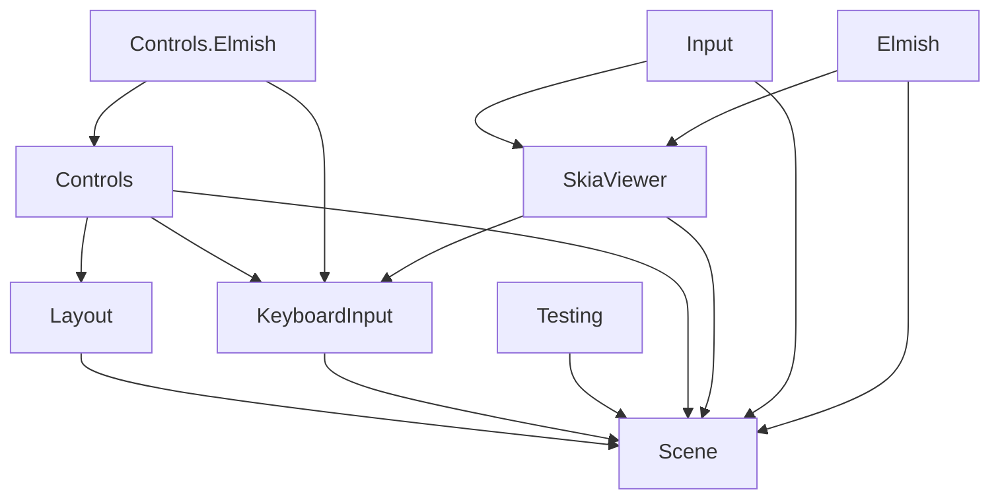

# Acyclic package-graph proof (post-deletion, FR-015 / SC-008)

After the `src/Lib` deletion the nine split packages form an acyclic graph and
`FS.Skia.UI.Scene` stays FSharp.Core-only. Verified from project references:

```bash
for f in src/*/*.fsproj; do echo "== $f =="; dotnet list "$f" reference; done
```

```
Scene            → (none)                                # foundation vocabulary, FSharp.Core-only
Layout           → Scene
KeyboardInput    → Scene
Input            → Scene, SkiaViewer                     # rich host-coupled input (052)
Testing          → Scene
Controls         → Scene, Layout, KeyboardInput
Controls.Elmish  → Controls, KeyboardInput
SkiaViewer       → Scene, KeyboardInput                  # host owned here since Stage 1 — NO monolith ref
Elmish           → Scene, SkiaViewer
```



- **No cycle**: every edge points toward `Scene`; `Scene` has no outgoing edge.
- **Leak closed**: `src/SkiaViewer/SkiaViewer.fsproj` references only `Scene` +
  `KeyboardInput` — the Stage-0 `SkiaViewer → Lib` leak is gone (host moved in Stage 1).
- **Scene minimal**: `dotnet list src/Scene/Scene.fsproj reference` is empty;
  `Scene.fsproj` carries no `Silk.NET`/`SkiaSharp`/`Fable.Elmish`/`Yoga.Net`/`YamlDotNet`
  package references (asserted by `SurfaceAreaTests` "Scene package stays dependency-light").
- `DependencyReport` re-runs this confirmation as part of the escalated gate set (T023).

failure class: DependencyCycle. next action: none — graph acyclic, Scene FSharp.Core-only.
