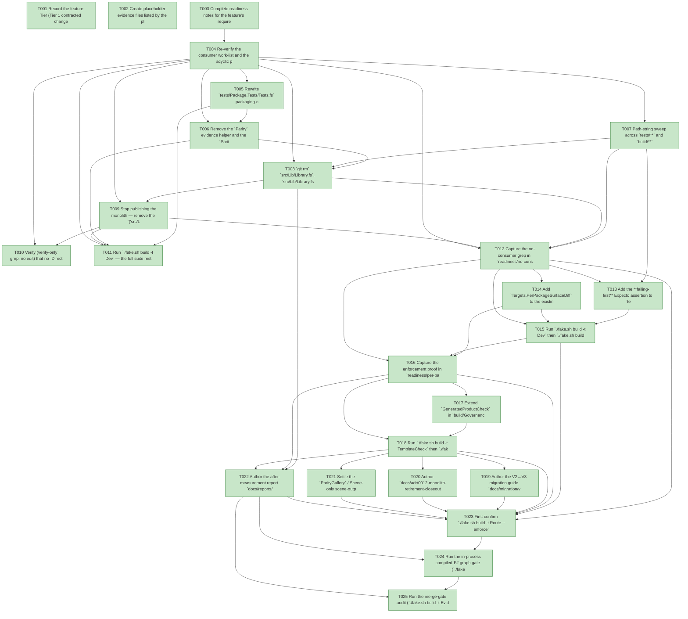

# Task Graph — 053-v3-monolith-retirement

## ✓ Graph is acyclic and consistent

## Skill Match Assessments

| Task | Candidate | Confidence | Signals | Reviewer disposition | Diagnostic |
|------|-----------|------------|---------|----------------------|------------|
| T001 | (none) | none |  | accepted-empty | T001: no high-confidence capability signal detected |
| T002 | (none) | none |  | accepted-empty | T002: no high-confidence capability signal detected |
| T003 | (none) | none |  | accepted-empty | T003: no high-confidence capability signal detected |
| T004 | (none) | none |  | accepted-empty | T004: no high-confidence capability signal detected |
| T005 | (none) | none |  | declared | T005: no high-confidence capability signal detected |
| T006 | (none) | none |  | accepted-empty | T006: no high-confidence capability signal detected |
| T007 | (none) | none |  | accepted-empty | T007: no high-confidence capability signal detected |
| T008 | (none) | none |  | accepted-empty | T008: no high-confidence capability signal detected |
| T009 | (none) | none |  | accepted-empty | T009: no high-confidence capability signal detected |
| T010 | (none) | none |  | accepted-empty | T010: no high-confidence capability signal detected |
| T011 | (none) | none |  | accepted-empty | T011: no high-confidence capability signal detected |
| T012 | (none) | none |  | accepted-empty | T012: no high-confidence capability signal detected |
| T013 | (none) | none |  | accepted-empty | T013: no high-confidence capability signal detected |
| T014 | (none) | none |  | declared | T014: no high-confidence capability signal detected |
| T015 | (none) | none |  | accepted-empty | T015: no high-confidence capability signal detected |
| T016 | (none) | none |  | declared | T016: no high-confidence capability signal detected |
| T017 | (none) | none |  | declared | T017: no high-confidence capability signal detected |
| T018 | (none) | none |  | accepted-empty | T018: no high-confidence capability signal detected |
| T019 | (none) | none |  | accepted-empty | T019: no high-confidence capability signal detected |
| T020 | (none) | none |  | accepted-empty | T020: no high-confidence capability signal detected |
| T021 | (none) | none |  | accepted-empty | T021: no high-confidence capability signal detected |
| T022 | (none) | none |  | accepted-empty | T022: no high-confidence capability signal detected |
| T023 | (none) | none |  | accepted-empty | T023: no high-confidence capability signal detected |
| T024 | speckit-evidence-graph | high | structured task metadata | accepted | T024: task text matches speckit-evidence-graph; trigger_group=graph validation; matched_trigger=structured task metadata |
| T025 | speckit-evidence-audit | high | diff-scan | accepted | T025: task text matches speckit-evidence-audit; trigger_group=evidence audit; matched_trigger=diff-scan |

## Status counts (effective)

| Status | Count |
|--------|-------|
| [X] done | 25 |
| [S] synthetic | 0 |
| [S*] auto-synthetic | 0 |
| accepted [SEH] synthetic | 0 |
| unaccepted synthetic | 0 |

## Graph



## ASCII view

```
T001 [X] Record the feature Tier (Tier 1 contracted change — the public `FS.Skia.UI` package identity is removed, `validation.contract.yml` changes, public-`.fsi` routing is edited), the affected surfaces (`src/Lib/Library.fs(i)` + `InternalsVisibleTo.fs` + `Lib.fsproj` deleted; `tests/Package.Tests`, `tests/Governance.Tests/{AsteroidsFeedbackSkillGuidanceTests,DependencyGovernanceTests,RuntimeOrganizationTests,PublicRecordInvariantTests,ControlsBoundaryCompositionTests,AgentValidationFrameworkTests,RoutingTests}`, `tests/Controls.Tests/DiagnosticsTests`, `build/Governance/{Routing.fs,AgentValidation.fs,PerPackageSurface.fs,GeneratedProduct.fs,Front/Helpers.fs}`, `FS-Skia-UI.sln`, `validation.contract.yml`, `docs/{migration,adr,reports}`, and `specs/053-v3-monolith-retirement/readiness/**`), the public-API impact (the `Parity`/`ParityReport` monolith surface is deleted; the `package-surface` rule gains `PerPackageSurfaceDiff` in `required_gates`; no split-package `.fsi` moves), the Elmish/MVU applicability (**N/A** — no stateful/I/O workflow, command, effect, subscription, or interpreter behaviour changes this stage; all runtime moved and was parity-proven in Stages 1–4), and the real-evidence obligations (rewritten packaging-contract suite green, repo-wide no-consumer grep, real reverted `PerPackageSurfaceDiff` enforcement proof, cleanliness gate green on a generated `app`, the migration doc + ADR 0012 + after-baseline, and the serialized escalated FAKE gate logs; zero synthetic)
T002 [X] Create placeholder evidence files listed by the plan under `specs/053-v3-monolith-retirement/readiness/` so the audit-enforced readiness files are discoverable at setup: the always-required contract trio `governance-risk-levels.md`, `aggregate-hang-diagnostics.md`, `runtime-limitations.md`; the record notes `consumer-work-list.md`, `no-consumer-grep.md`, `per-package-surface-enforcement.md`, `cleanliness-gate.md`, `acyclic-graph-proof.md`, `paritygallery-policy.md`, `closeout-docs.md`; the gate records `validation-contract.md`, `evidence-graph.md`, `evidence-audit.md`; and `logs/` (`dev.log`, `generated-guidance-check.log`, `template-check.log`, `generated-product-check.log`, `per-package-surface-diff.log`, `target-metadata-drift.log`, `evidence-graph.log`, `evidence-audit.log`)
T003 [X] Complete readiness notes for the feature's required readiness placeholder files — `governance-risk-levels.md` (the small / medium / broad levels, their required evidence, and when broad validation is required), `aggregate-hang-diagnostics.md` (verdict / stage / elapsed duration / last observed command / focused rerun / non-authoritative aggregate), and `runtime-limitations.md` (the .NET 10 desktop / Vulkan / SkiaSharp preview statements; unsupported macOS/mobile/browser; no software-renderer fallback; no runtime behaviour changes this stage — deletion + governance only; reference-frame re-capture stays headless-GPU-infeasible, disclosed not synthetic) — each naming its authoritative command, artifact path, failure class, and next action
T004 [X] Re-verify the consumer work-list and the acyclic package edge per `research.md` (R1/R2) and record it in `readiness/consumer-work-list.md` — confirm the only `ProjectReference` consumer of the monolith is `tests/Package.Tests` and enumerate every **path-string** call site to clear (the ~14 sites: `Package.Tests/Tests.fs`, `AsteroidsFeedbackSkillGuidanceTests.fs`, `DependencyGovernanceTests.fs`, `RuntimeOrganizationTests.fs`, `PublicRecordInvariantTests.fs`, `ControlsBoundaryCompositionTests.fs`, `AgentValidationFrameworkTests.fs`, `RoutingTests.fs`, `Controls.Tests/DiagnosticsTests.fs`, `Front/Helpers.fs`, `Routing.fs:214`, `PerPackageSurface.fs:29`, `GeneratedProduct.fs`, `FS-Skia-UI.sln`); confirm `src/Lib` holds only `Library.fs(i)` + `InternalsVisibleTo.fs` (no Vulkan/KeyboardInput/AgentValidation residue) and that removing it leaves the package dependency graph acyclic with `FS.Skia.UI.Scene` FSharp.Core-only (record in `readiness/acyclic-graph-proof.md`) — the work-list, no edits yet
T005 [X] Rewrite `tests/Package.Tests/Tests.fs` packaging-contract assertions against the split packages as the **failing-first** change — replace the `typeof<FS.Skia.UI.ParityReport>.Assembly` / `VulkanResources`/`VulkanStartup` non-export / `PackLocal` `src/Lib/Lib.fsproj` → `FS.Skia.UI` expectations with assertions over the nine split-package pack entries (and keep a real negative such as "Controls does not depend on `..\Lib\Lib.fsproj`"); the suite must go **red on the old monolith expectation before the rewrite, then green** and still assert a real packaging contract (FR-001, SC-003)
T006 [X] Remove the `Parity` evidence helper and the `ParityStatus`/`EvidenceType`/`ParityEvidenceItem`/`ParityReport` types from `src/Lib/Library.fs` + `Library.fsi` (FR-002), and drop the conditional `..\..\src\Lib\Lib.fsproj` `ProjectReference` from `tests/Package.Tests/Package.Tests.fsproj` (FR-001) — `Package.Tests` now references split packages only
T007 [X] Path-string sweep across `tests/**` and `build/**` (the Stage-2 lesson — a deleted file is referenced by *path*, not just symbol): **drop** the monolith enumerations (`AsteroidsFeedbackSkillGuidanceTests.fs` packable row, `DependencyGovernanceTests.fs` `src/Lib/Lib.fsproj` entries, `RuntimeOrganizationTests.fs` `src/Lib/Library.fs`, `PublicRecordInvariantTests.fs` `src/Lib/Library.fsi`, `ControlsBoundaryCompositionTests.fs` `"src/Lib"`, `AgentValidationFrameworkTests.fs` stale `src/Lib/AgentValidation.fsi` rule input); **repoint** the generic `.fsi`-example inputs in `RoutingTests.fs` (`src/Lib/Foo.fsi` → `src/Scene/Foo.fsi`); **triage** the `Controls.Tests/DiagnosticsTests.fs` and `build/Governance/GeneratedProduct.fs` diagnostic-string examples (keep those that survive deletion, repoint any that must name a living path) (FR-006)
T008 [X] `git rm` `src/Lib/Library.fs`, `src/Lib/Library.fsi`, `src/Lib/InternalsVisibleTo.fs`, and `src/Lib/Lib.fsproj`, remove the `Lib` project entry from `FS-Skia-UI.sln`, and `git rm` the monolith's aggregate surface baseline `readiness/surface-baselines/FS.Skia.UI.txt` (the aggregate `PackageSurfaceCheck` baseline retires with the package, per the spec's Public-contract-impact prompt) — `src/Lib` no longer exists on disk and is not in the solution and `PackageSurfaceCheck` no longer enumerates the deleted monolith assembly (FR-003); confirm `git ls-files src/Lib` returns nothing and `readiness/surface-baselines/` lists the nine split packages only
T009 [X] Stop publishing the monolith — remove the `("src/Lib/Lib.fsproj", "FS.Skia.UI")` entry from `packProjects` (`build/Governance/Front/Helpers.fs`) and the pack-version flow so the list is the nine split packages + `FS.Skia.UI.Build`, and drop the monolith row plus the historical `SkiaViewer → FS.Skia.UI` leak note from `docs/reports/dependencies.md` while affirming the preferred-package list (FR-004)
T010 [X] Verify (verify-only grep, no edit) that no `Directory.Packages.props` pin (root or `template/base`) and no template package pin names the `FS.Skia.UI` monolith — record the empty result alongside the no-consumer proof (FR-005)
T011 [X] Run `./fake.sh build -t Dev` — the full suite restores/builds/tests green with **zero** `Lib` references, the rewritten `Package.Tests` is green against the split packages (turning T005 green), the aggregate `PackageSurfaceCheck` baseline is current (no monolith assembly named, no drift after the T008 baseline removal), and nothing pulls the monolith (FR-003, FR-006, SC-002, SC-003)
T012 [X] Capture the no-consumer grep in `readiness/no-consumer-grep.md` — `grep -rn -E 'Lib\.fsproj|src/Lib|"FS\.Skia\.UI"'` over `src samples tests template build *.sln Directory.Packages.props` returns **zero** hits (programme history under `docs/`/`specs/` excluded); record the command and its empty output as the SC-001 proof (FR-006)
T013 [X] Add the **failing-first** Expecto assertion to `tests/Governance.Tests/RoutingTests.fs` that a diff touching `src/<InScopePackage>/**/*.fsi` returns a selection whose `Gates` contains `Targets.PerPackageSurfaceDiff` (alongside `PackageSurfaceCheck`/`FsiTranscripts`) at `Tier = FocusedAuthority`, using a live package path input (`src/Scene/Foo.fsi`); it is red until the rule is extended in T014 (C1)
T014 [X] Add `Targets.PerPackageSurfaceDiff` to the existing `package-surface` rule's `RequiredGates` in `build/Governance/Routing.fs:201`, add `"PerPackageSurfaceDiff"` to the `knownGates` allowlist in `build/Governance/AgentValidation.fs`, correct the stale `knownGates` comment at `Routing.fs:214` (FR-013) and the stale monolith-exclusion comment at `PerPackageSurface.fs:29`, and regenerate `validation.contract.yml` from `Routing.fs` so the rule + its rendering + the allowlist entry land together (FR-007)
T015 [X] Run `./fake.sh build -t Dev` then `./fake.sh build -t TargetMetadataDrift` — the RoutingTests assertion is green (turning T013 green), `validation.contract.yml`'s `package-surface` rule lists `PerPackageSurfaceDiff` in `required_gates`, and the contract is current vs `Routing.fs` (zero drift) (FR-007)
T016 [X] Capture the enforcement proof in `readiness/per-package-surface-enforcement.md` — `./fake.sh build -t PerPackageSurfaceDiff` is green at zero drift; a real, reverted one-line edit to one package's public `.fsi` (e.g. `src/Scene/<a public .fsi>`) without a baseline update **fails** the gate naming the drifted package; regenerating that package's `readiness/per-package-surface/<PackageId>.fsi.txt` baseline makes it pass; both the edit and the baseline are reverted (real evidence, SC-004)
T017 [X] Extend `GeneratedProductCheck` in `build/Governance/GeneratedProduct.fs` with cleanliness assertions — a generated default `app` (and the `governed` profile) contains **no** `samples/`, **no** framework documentation set (`docs/`), **no** historical `specs/`, **no** framework `README` copy (root `README.md`), and **references** the split packages rather than copying framework projects; pin the exact forbidden top-level globs (`samples/`, `docs/`, `specs/`, root `README.md`) so failure naming is deterministic, and the gate **fails naming the offending artifact** when any of those are planted (FR-008, C3)
T018 [X] Run `./fake.sh build -t TemplateCheck` then `./fake.sh build -t GeneratedProductCheck` — the cleanliness assertions are green on a freshly generated default `app` referencing split packages only, and red on a planted `samples/`/docs/`specs/`/README copy; record both outcomes in `readiness/cleanliness-gate.md` (FR-008/014, SC-005/006)
T019 [X] Author the V2→V3 migration guide `docs/migration/v2-to-v3.md` — a table mapping the old `FS.Skia.UI` surface to the split packages (`.Scene`/`.SkiaViewer`/`.Elmish`/`.KeyboardInput`/`.Input`/`.Layout`/`.Controls`), how to move an app's package references, the removed-`SceneConversion` note, and the rich keyboard-input → `FS.Skia.UI.Input` mapping (note that `.Controls.Elmish` and `.Testing` have no monolith public-surface predecessor and are intentionally absent from the surface map) (FR-009)
T020 [X] Author `docs/adr/0012-monolith-retirement-closeout.md` — status Accepted; records the completed retirement (`src/Lib` deleted, `FS.Skia.UI` unpublished, per-package gate enforced, cleanliness gate added) and links the programme ADRs 0007–0011 (FR-011)
T021 [X] Settle the `ParityGallery` / Scene-only scene-output oracle residue per ADR 0010 in `readiness/paritygallery-policy.md` — record that the oracle is **preserved** in the split-package suites and the keep-vs-retire decision for `samples/ParityGallery`, and clean governance scanning lists that still name `tests/Parity.Tests` where they assume the retired bridge (FR-012)
T022 [X] Author the after-measurement report `docs/reports/_baselines/2026-06-02-v3-after.md` mirroring the Stage-0 before-baseline — pin SHA; `src/Lib` LOC → 0; monolith transitive-pull → none; duplicate-type count → 0; package count (nine split + build engine); per-package baselines present (9); generated-`app` cleanliness asserted — **each metric with its reproduction command** (FR-010, SC-007); link the migration doc + ADR 0012 from the implementation plan
T023 [X] First confirm `./fake.sh build -t Route --enforce` reports the escalated tier with every required evidence artifact present, then run the escalated serialized FAKE gate set sequentially — `Dev` → `GeneratedGuidanceCheck` → `TemplateCheck` → `GeneratedProductCheck` → `DependencyReport` (post-deletion: the package graph is acyclic and `FS.Skia.UI.Scene` is FSharp.Core-only, verified from project references — FR-015, SC-008) → the final graph and audit gates (T024/T025) — never concurrently; confirm the default `app` restores/builds/runs referencing split packages only and pulls no monolith transitively (FR-014, SC-006); record aggregate FAKE results as **non-authoritative** and rerun any race-like or environment-flaky failure in focused isolation as the authoritative result; logs under `readiness/logs/`
T024 [X] Run the in-process compiled-F# graph gate (`./fake.sh build -t EvidenceGraph`) — confirm the DAG is acyclic, no dangling refs, no `[S*]` surprises, and the structured task metadata and visible mirrors are valid (`verdict=ok`)
T025 [X] Run the merge-gate audit (`./fake.sh build -t EvidenceAudit`) — confirm `verdict=PASS` (0 unaccepted-synthetic, 0 auto-synthetic, 0 late-seh, 0 blocking diff-scan, 0 blocking readiness-contract) with zero synthetic evidence to accept (SC-009)
```

