# Task Graph — 054-fix-review-findings

## ✓ Graph is acyclic and consistent

## Skill Match Assessments

| Task | Candidate | Confidence | Signals | Reviewer disposition | Diagnostic |
|------|-----------|------------|---------|----------------------|------------|
| T001 | (none) | none |  | accepted-empty | T001: no high-confidence capability signal detected |
| T002 | (none) | none |  | accepted-empty | T002: no high-confidence capability signal detected |
| T003 | (none) | none |  | accepted-empty | T003: no high-confidence capability signal detected |
| T004 | (none) | none |  | accepted-empty | T004: no high-confidence capability signal detected |
| T005 | (none) | none |  | declared | T005: no high-confidence capability signal detected |
| T006 | (none) | none |  | accepted-empty | T006: no high-confidence capability signal detected |
| T007 | (none) | none |  | declared | T007: no high-confidence capability signal detected |
| T008 | (none) | none |  | declared | T008: no high-confidence capability signal detected |
| T009 | (none) | none |  | accepted-empty | T009: no high-confidence capability signal detected |
| T010 | (none) | none |  | accepted-empty | T010: no high-confidence capability signal detected |
| T011 | (none) | none |  | accepted-empty | T011: no high-confidence capability signal detected |
| T012 | (none) | none |  | accepted-empty | T012: no high-confidence capability signal detected |
| T013 | (none) | none |  | accepted-empty | T013: no high-confidence capability signal detected |
| T014 | (none) | none |  | accepted-empty | T014: no high-confidence capability signal detected |
| T015 | (none) | none |  | accepted-empty | T015: no high-confidence capability signal detected |
| T016 | (none) | none |  | declared | T016: no high-confidence capability signal detected |
| T017 | (none) | none |  | accepted-empty | T017: no high-confidence capability signal detected |
| T018 | (none) | none |  | accepted-empty | T018: no high-confidence capability signal detected |
| T019 | (none) | none |  | declared | T019: no high-confidence capability signal detected |
| T020 | speckit-evidence-graph | high | structured task metadata | accepted | T020: task text matches speckit-evidence-graph; trigger_group=graph validation; matched_trigger=structured task metadata |
| T021 | speckit-evidence-audit | high | diff-scan | accepted | T021: task text matches speckit-evidence-audit; trigger_group=evidence audit; matched_trigger=diff-scan |

## Status counts (effective)

| Status | Count |
|--------|-------|
| [X] done | 21 |
| [S] synthetic | 0 |
| [S*] auto-synthetic | 0 |
| accepted [SEH] synthetic | 0 |
| unaccepted synthetic | 0 |

## Graph

```mermaid
graph TD
  T001["T001 Record feature scope and evidence obligations in t"]:::done
  T002["T002 Complete readiness notes for the audit-required re"]:::done
  T003["T003 Complete readiness notes for this feature's author"]:::done
  T004["T004 Capture the pre-change baselines as failing-first "]:::done
  T005["T005 Strengthen `tests/Governance.Tests/GeneratedProjec"]:::done
  T006["T006 Align the `template/base/build.fsx` `#r` literal t"]:::done
  T007["T007 Extend the canonical `fs-skia-template-update` ski"]:::done
  T008["T008 Demonstrate the gate live (SC-002 / SC-003) — brea"]:::done
  T009["T009 Establish the failing-first zero-FS3261 gate — con"]:::done
  T010["T010 Resolve the FS3261 sites in `build/Governance/Gene"]:::done
  T011["T011 Resolve the FS3261 sites in `build/Governance/Fron"]:::done
  T012["T012 Resolve the FS3261 sites in `build/Governance/Engi"]:::done
  T013["T013 Resolve the FS3261 sites in `build/Governance/Guid"]:::done
  T014["T014 Resolve the FS3261 sites in `build/Governance/Pref"]:::done
  T015["T015 Remove the project-local `<WarningsNotAsErrors>$(W"]:::done
  T016["T016 Verify SC-004 / SC-005 — a clean `--no-incremental"]:::done
  T017["T017 Add `specs/*/readiness/package/` to `.gitignore` u"]:::done
  T018["T018 Verify SC-006 / SC-007 — `git status --porcelain` "]:::done
  T019["T019 Confirm `./fake.sh build -t Route` (and `Route --e"]:::done
  T020["T020 Run `./fake.sh build -t EvidenceGraph` — confirm t"]:::done
  T021["T021 Run `./fake.sh build -t EvidenceAudit` — confirm `"]:::done
  T003 --> T004
  T004 --> T005
  T005 --> T006
  T004 --> T006
  T006 --> T007
  T004 --> T007
  T005 --> T008
  T007 --> T008
  T004 --> T008
  T008 --> T009
  T008 --> T010
  T008 --> T011
  T008 --> T012
  T008 --> T013
  T008 --> T014
  T010 --> T015
  T011 --> T015
  T012 --> T015
  T013 --> T015
  T014 --> T015
  T008 --> T015
  T009 --> T016
  T015 --> T016
  T008 --> T016
  T016 --> T017
  T017 --> T018
  T016 --> T018
  T008 --> T019
  T016 --> T019
  T018 --> T019
  T019 --> T020
  T018 --> T020
  T020 --> T021
  T018 --> T021
  classDef pending fill:#eeeeee,stroke:#999
  classDef done fill:#c8e6c9,stroke:#2e7d32
  classDef synthetic fill:#ffe0b2,stroke:#e65100,stroke-width:2px
  classDef autoSynthetic fill:#ffab91,stroke:#bf360c,stroke-width:2px,stroke-dasharray:5 3
  classDef failed fill:#ffcdd2,stroke:#b71c1c,stroke-width:2px
  classDef skipped fill:#f5f5f5,stroke:#666,stroke-dasharray:3 3
```



## ASCII view

```
T001 [X] Record feature scope and evidence obligations in the plan — Tier 2 internal; affected layers are the governance library (`build/Governance/**`), the generated template (`template/base/**`), `tests/Governance.Tests`, and `.gitignore`; no public-API/`.fsi`/surface-baseline impact; Principle IV (Elmish/MVU) is **not applicable** (no new stateful or I/O-bearing workflow); required real evidence = pin-parity grep/diff, before/after clean-build FS3261 logs, a simulated-bump proof, a deliberate-mismatch gate proof, and a `git status --porcelain` empty proof
T002 [X] Complete readiness notes for the audit-required readiness files — create `specs/054-fix-review-findings/readiness/` and author `governance-risk-levels.md` (the small / medium / broad risk levels, the focused validation required for the selected level, when broad validation is required, and how non-authoritative aggregate FAKE results are recorded), `aggregate-hang-diagnostics.md` (verdict / stage / elapsed duration / last observed command / focused rerun / non-authoritative aggregate), and `runtime-limitations.md` (.NET 10 desktop / Vulkan / SkiaSharp preview / unsupported macOS/mobile/browser / no software-renderer fallback) so the unconditional readiness-contract scan passes
T003 [X] Complete readiness notes for this feature's authored-evidence placeholders — create placeholder `readiness/pin-parity-proof.md`, `readiness/fs3261-before-after.md`, `readiness/simulated-bump-proof.md`, `readiness/deliberate-mismatch-gate.md`, and `readiness/clean-tree-proof.md`, each naming its authoritative command, artifact path, failure class, and next action (regenerable logs land under `readiness/logs/**`, already gitignored)
T004 [X] Capture the pre-change baselines as failing-first evidence — record the live pin drift (`template/base/build.fsx` `0.1.45-preview.1` ≠ `template/base/Directory.Packages.props` `0.1.56-preview.1`), the clean `--no-incremental` build FS3261 count (**34** across 8 files), and `git status --porcelain` showing the stray `specs/053-v3-monolith-retirement/readiness/package/` scratch, into the readiness baseline files (the before-state for SC-001 / SC-004 / SC-006)
T005 [X] Strengthen `tests/Governance.Tests/GeneratedProjectValidationTests.fs` to extract the `#r "nuget: FS.Skia.UI.Build, <ver>"` literal from `template/base/build.fsx` and the `FS.Skia.UI.Build` `PackageVersion` from `template/base/Directory.Packages.props`, then assert **exact string equality** (replacing the prefix-only `Expect.stringContains "#r \"nuget: FS.Skia.UI.Build"`), with a failure message naming both versions; confirm it **fails-first** against the current drift (FR-003, contract C1)
T006 [X] Align the `template/base/build.fsx` `#r` literal to `0.1.56-preview.1` so it equals the props `PackageVersion` (FR-001 / FR-004); confirm T005's parity assertion now **passes** (SC-001)
T007 [X] Extend the canonical `fs-skia-template-update` skill (`.agents/skills/fs-skia-template-update/SKILL.md`, step 3) so the pin-bump flow rewrites **both** the props `Version="<new>"` and the `build.fsx` `#r "nuget: FS.Skia.UI.Build, <new>"` literal in one flow (FR-002, contract C2), then regenerate the `.claude` peer via `./fake.sh build -t RefreshSurfaceBaselines`
T008 [X] Demonstrate the gate live (SC-002 / SC-003) — break the `#r` version, run `./fake.sh build -t TemplateCheck` (expect FAIL naming both versions), then `git checkout` and rerun (expect PASS); run a simulated pin bump through the extended skill flow and confirm both pins move together with no manual second edit; record the outcomes to `readiness/deliberate-mismatch-gate.md`, `readiness/simulated-bump-proof.md`, and `readiness/pin-parity-proof.md`
T009 [X] Establish the failing-first zero-FS3261 gate — confirm the clean `dotnet build build/Governance/FS.Skia.UI.Build.fsproj --no-incremental` currently emits **34** FS3261 across 8 files and record the before-log excerpt to `readiness/fs3261-before-after.md` (FR-005 baseline, SC-004)
T010 [X] Resolve the FS3261 sites in `build/Governance/GeneratedProduct.fs` (~22 sites, NullableBclString class) by pattern-matching `null` / `nonNull` / `Option.ofObj` with an explicit default — never force-unwrap; behaviour unchanged
T011 [X] Resolve the FS3261 sites in `build/Governance/Front/Governance.fs` (~20 sites) including the `Process.Start` result — `match Process.Start startInfo with null -> Error … | proc -> …` so it **fails fast** (returns `Error`) on a null process instead of dereferencing it (observability preserved per Principle VII)
T012 [X] Resolve the FS3261 sites in `build/Governance/Engine/Model.fs` (~14 sites) including line 72 — make the inferred value provably non-null so the impl matches the **existing** `.fsi` `val featureId: string` (no `.fsi` change, SignatureNullness class)
T013 [X] Resolve the FS3261 sites in `build/Governance/Guidance.fs` (~8) and `build/Governance/Front/BuildProcess.fs` (~8) by safe null handling (NullableBclString class), behaviour unchanged
T014 [X] Resolve the FS3261 sites in `build/Governance/Preflight.fs` (~6), `build/Governance/PerPackageSurface.fs` (~6), and `build/Governance/Front/BuildProcessHealth.fs` (~6) by safe null handling, behaviour unchanged
T015 [X] Remove the project-local `<WarningsNotAsErrors>$(WarningsNotAsErrors);FS3261</WarningsNotAsErrors>` from `build/Governance/FS.Skia.UI.Build.fsproj` (FR-009, contract C3) so FS3261 is now a build **error** for this project only — leave the repo-wide `Directory.Build.props` policy unchanged
T016 [X] Verify SC-004 / SC-005 — a clean `--no-incremental` build emits **0** FS3261 (down from 34); `./fake.sh build -t Dev` is green including every `Governance.Tests` (behaviour preserved, FR-006); a deliberately re-introduced FS3261 now fails the build (escape hatch gone); record the before(34)/after(0) excerpt to `readiness/fs3261-before-after.md`
T017 [X] Add `specs/*/readiness/package/` to `.gitignore` under the existing Feature-046 evidence-hygiene block (mirroring the `specs/*/readiness/logs/**` precedent), then `git rm`/delete the stray `specs/053-v3-monolith-retirement/readiness/package/local-packages.md` scratch (FR-007, contract C4) — the rule is scoped to the `package/` scratch subdir so authored `.md` evidence elsewhere stays tracked
T018 [X] Verify SC-006 / SC-007 — `git status --porcelain` is empty, the stray file is no longer tracked/present, and a routine framework-internal diff routes to `inner-loop` via `./fake.sh build -t Route` (the governance-path escalation is gone); record to `readiness/clean-tree-proof.md`
T019 [X] Confirm `./fake.sh build -t Route` (and `Route --enforce`) reports the escalated maintainer-verify tier with every required evidence artifact present, then run the escalated FAKE gate set **sequentially, never concurrently** — `Dev` → `GeneratedGuidanceCheck` → `TemplateCheck` → `GeneratedProductCheck` — recording aggregate results as **non-authoritative** and rerunning any race-like failure in focused isolation as the authoritative result; logs under `readiness/logs/`
T020 [X] Run `./fake.sh build -t EvidenceGraph` — confirm the DAG is acyclic, no dangling refs, no `[S*]` surprises, and the structured task metadata plus visible `skillist` mirrors are valid (`verdict=ok`)
T021 [X] Run `./fake.sh build -t EvidenceAudit` — confirm `verdict=PASS` (0 unaccepted-synthetic, 0 auto-synthetic, 0 blocking diff-scan, 0 blocking readiness-contract) with zero synthetic evidence to accept; this feature ships no `[S]` task
```

