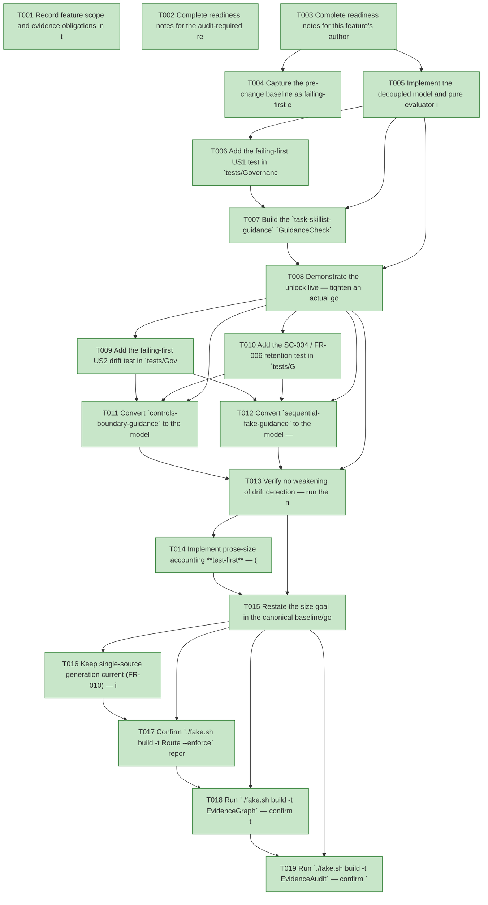

# Task Graph — 055-decouple-guidance-anchors

## ✓ Graph is acyclic and consistent

## Skill Match Assessments

| Task | Candidate | Confidence | Signals | Reviewer disposition | Diagnostic |
|------|-----------|------------|---------|----------------------|------------|
| T001 | (none) | none |  | accepted-empty | T001: no high-confidence capability signal detected |
| T002 | (none) | none |  | accepted-empty | T002: no high-confidence capability signal detected |
| T003 | (none) | none |  | accepted-empty | T003: no high-confidence capability signal detected |
| T004 | (none) | none |  | accepted-empty | T004: no high-confidence capability signal detected |
| T005 | (none) | none |  | declared | T005: no high-confidence capability signal detected |
| T006 | (none) | none |  | declared | T006: no high-confidence capability signal detected |
| T007 | (none) | none |  | declared | T007: no high-confidence capability signal detected |
| T008 | (none) | none |  | accepted-empty | T008: no high-confidence capability signal detected |
| T009 | (none) | none |  | declared | T009: no high-confidence capability signal detected |
| T010 | (none) | none |  | declared | T010: no high-confidence capability signal detected |
| T011 | (none) | none |  | declared | T011: no high-confidence capability signal detected |
| T012 | (none) | none |  | declared | T012: no high-confidence capability signal detected |
| T013 | (none) | none |  | declared | T013: no high-confidence capability signal detected |
| T014 | (none) | none |  | declared | T014: no high-confidence capability signal detected |
| T015 | (none) | none |  | accepted-empty | T015: no high-confidence capability signal detected |
| T016 | (none) | none |  | declared | T016: no high-confidence capability signal detected |
| T017 | (none) | none |  | declared | T017: no high-confidence capability signal detected |
| T018 | speckit-evidence-graph | high | structured task metadata | accepted | T018: task text matches speckit-evidence-graph; trigger_group=graph validation; matched_trigger=structured task metadata |
| T019 | speckit-evidence-audit | high | diff-scan | accepted | T019: task text matches speckit-evidence-audit; trigger_group=evidence audit; matched_trigger=diff-scan |

## Status counts (effective)

| Status | Count |
|--------|-------|
| [X] done | 19 |
| [S] synthetic | 0 |
| [S*] auto-synthetic | 0 |
| accepted [SEH] synthetic | 0 |
| unaccepted synthetic | 0 |

## Graph



## ASCII view

```
T001 [X] Record feature scope and evidence obligations in the plan — Tier 2 internal governance change; affected layers are `build/Governance/Guidance.fs[i]`, `tests/Governance.Tests/**`, governed guidance under `.specify/**` (templates, `fsharp-opinionated` presets, command/memory copies) and possibly `.agents/skills/**`, and the baseline/goal records `docs/reports/_baselines/2026-06-02-foundations-after.md` + `specs/047-foundations-programme-closeout/contracts/after-baseline.md`; no public product `.fsi`/surface/package/runtime impact; Principle IV (Elmish/MVU) is **not applicable** (pure validation refactor, IO confined to the existing read-file wrapper); required real evidence = prose-size accounting, the rewording-passes / drift-fails red→green, the enumerated contract-token set, and the restated-goal record
T002 [X] Complete readiness notes for the audit-required readiness files — create `specs/055-decouple-guidance-anchors/readiness/` and author `governance-risk-levels.md` (the small / medium / broad risk levels, the focused validation required for the selected level, when broad validation is required, and how non-authoritative aggregate FAKE results are recorded), `aggregate-hang-diagnostics.md` (verdict / stage / elapsed duration / last observed command / focused rerun / non-authoritative aggregate), and `runtime-limitations.md` (.NET 10 desktop / Vulkan / SkiaSharp preview / unsupported macOS/mobile/browser / no software-renderer fallback) so the unconditional readiness-contract scan passes
T003 [X] Complete readiness notes for this feature's authored-evidence placeholders — create placeholder `readiness/prose-size-accounting.md`, `readiness/decoupling-red-green.md`, `readiness/contract-tokens.md`, `readiness/evidence-policy-separation.md` (the specify-catchall / generated-guidance artifact `Route` requires for `.specify/**` edits), `readiness/validation-contract.md` (docs-only single-source-generation currency note), and `readiness/skill-loading-evidence.md`, each naming its authoritative command, artifact path, failure class, and next action (regenerable logs land under `readiness/logs/**`, already gitignored)
T004 [X] Capture the pre-change baseline as failing-first evidence — record that under today's literal-substring table a reworded-but-concept-preserving edit to a governed file trips a `missing` term finding (the freeze SC-001 lifts), and capture the current measured guidance-prose line count (`find .agents/skills -name '*.md' | xargs wc -l | tail -1` + `find .specify -name '*.md' | xargs wc -l | tail -1`) into the readiness baselines (the before-state for SC-001 / SC-005)
T005 [X] Implement the decoupled model and pure evaluator in `build/Governance/Guidance.fs` — the `ContractToken`, `MatchMode` (`AnyOf` / `AllOf`), `GuidanceObligation`, and `GuidanceCheck` types and `evaluateGuidanceCheck : (string -> string option) -> GuidanceCheck -> string list` implementing the data-model rules (token-present case-insensitive substring; forbidden-token must-not-appear; obligation `AnyOf`/`AllOf` over short concept anchors; missing-file), reusing the existing `ValidationFinding` convention; keep the gate entry point `runGeneratedGuidanceScan` and its IO wrapper unchanged; add the new types to `Guidance.fsi` **only if** a unit test references them directly
T006 [X] Add the failing-first US1 test in `tests/Governance.Tests/GuidanceValidatorTests.fs` — feed `evaluateGuidanceCheck` an in-memory lookup whose content **shortens/rewords** a governed paragraph while preserving the obligation's concept anchor, assert it returns **no findings** (PASS), and assert the pre-055 literal-substring table would have returned a `missing` term finding for the same edit; confirm the new-evaluator assertion **fails-first** until T007 wires the obligations (SC-001 red→green)
T007 [X] Build the `task-skillist-guidance` `GuidanceCheck` value and wire it — map the pre-055 literal table to `ContractToken`s (``, `skillist:`, `deps:`, `[SEH]`, `synthetic-error-handling-approved`, `loaded_at`, `work_started_at`, `readiness/skill-loading-evidence.md`) and `GuidanceObligation`s (`skillist-structured` `AnyOf`, `skillist-minimal-ordered` `AnyOf`, `skillist-confidence-fields` `AllOf`, `skill-breadth`, `aggregate-non-authoritative`, `graph-before-after`, `persistent-launch`, `seh-discipline`, `tasks-skill-gate`, `implement-skill-loading`, `tasks-post-gen-timing`, and the remaining concept obligations defined in `data-model.md`) per the data-model mapping, with **every twin** (template + `fsharp-opinionated` preset copy + command copy + memory copy) listed in each `Files`; redefine `validateTaskSkillistGuidance` as `evaluateGuidanceCheck (realLookup model)` over that value; confirm T006 now PASSes (SC-001)
T008 [X] Demonstrate the unlock live — tighten an actual governed paragraph (e.g. in `.specify/templates/tasks-template.md`) so it shortens/rewords while keeping its obligation concept, run `./fake.sh build -t GeneratedGuidanceCheck` and observe PASS where the pre-055 table failed; regenerate any touched `.agents`→`.claude`/preset twin via `./fake.sh build -t RefreshSurfaceBaselines`; record the red→green transcript to `readiness/decoupling-red-green.md` (SC-001)
T009 [X] Add the failing-first US2 drift test in `tests/Governance.Tests/GuidanceValidatorTests.fs` — feed `evaluateGuidanceCheck` a lookup with an obligation's concept anchor **removed while its sibling `ContractToken` remains present**, and assert it FAILs with the exact diagnostic shape `"{file}: obligation '{id}' ({source}) not reflected [{tag}]"` naming the file, obligation id, and source of truth (proving the obligation fails on prose-concept loss, not merely on token loss — the anchor-disjointness rule); include the twin-coverage case (drift in one twin file is still caught) (SC-002, FR-003)
T010 [X] Add the SC-004 / FR-006 retention test in `tests/Governance.Tests/GuidanceValidatorTests.fs` — assert that removing any machine-contract token (e.g. ``, `synthetic-error-handling-approved`) from the lookup still FAILs with a `missing \`{token}\`` finding, and that reintroducing a forbidden/stale term still FAILs with the stale-term finding
T011 [X] Convert `controls-boundary-guidance` to the model — `ContractToken`s (`FS.Skia.UI.Controls`, `Control<'msg>`, `DataGrid`, `FS.Skia.UI.Controls.Elmish`, `ControlsElmish.program`), obligations (`controls-skia-rendered` `AnyOf`, `controls-no-charts-shim` `AllOf`), and **every** `Forbidden` stale-term entry preserved verbatim (`FS.Skia.UI.Charts`, `fs-skia-charts`, `chart-only`, `DataGrid as chart`, `renderer neutral`, `host loop ownership`, …) so removed-Charts language cannot re-enter (FR-006); redefine `validateControlsBoundaryGuidance` over the new value
T012 [X] Convert `sequential-fake-guidance` to the model — a `fake-sequential` obligation (`AllOf` over the four facets `FAKE-backed` / `.fake` / `sequential` / `not safe to run concurrently`, source `CLAUDE.md:FAKE concurrency rule`) while retaining the structural regex assertions (FAKE-command-present, numbered-order requirement, parallelism non-FAKE caveat) as unchanged machine logic; redefine `validateSerializedRunnerGuidance` over the new value
T013 [X] Verify no weakening of drift detection — run the new T009/T010 tests green, confirm the real-repository `runGeneratedGuidanceScan` still PASSes via `./fake.sh build -t GeneratedGuidanceCheck` (SC-006 regression), confirm all three mixed-purpose sites are now migrated with no list freezing prose as a pure currency proxy (SC-003), and record the US2 drift transcript plus the enumerated machine-contract-token set to `readiness/decoupling-red-green.md` and `readiness/contract-tokens.md` (SC-002, SC-004)
T014 [X] Implement prose-size accounting **test-first** — (a) add a failing-first byte-determinism test in `tests/Governance.Tests/ProseSizeAccountingTests.fs` feeding the pure render function a known `ProseSizeAccounting` record (baseline `6882`, fixed agents/specify counts) and asserting the rendered Markdown states the corrected baseline, the summed current count, the signed delta, and the restated target; then (b) implement the pure report-rendering function over a `ProseSizeAccounting` record (corrected baseline `6882`, the `.agents/skills/**/*.md` and `.specify/**/*.md` line counts gathered by the front-end IO enumeration, the summed current count, the delta, and the restated target) rendered to `readiness/prose-size-accounting.md` with the `find … | wc -l` reproduction commands, turning the test green (FR-007, SC-005)
T015 [X] Restate the size goal in the canonical baseline/goal records — edit `docs/reports/_baselines/2026-06-02-foundations-after.md` (row 5) and `specs/047-foundations-programme-closeout/contracts/after-baseline.md` so the discredited ~23,000-line / "low hundreds" figure is retired as the live target and tracking is stated against the corrected ≈6,882 baseline, with the actual large-scale reduction recorded as a bounded follow-up (FR-008, SC-005)
T016 [X] Keep single-source generation current (FR-010) — if any `.agents/skills/*/SKILL.md` prose was tightened, regenerate via `./fake.sh build -t RefreshSurfaceBaselines`, then confirm `SkillSyncCheck` (`.claude/skills/**` is a byte-identical reproduction of `.agents/skills/**`) and `TargetMetadataDrift` (`validation.contract.yml` generated from `Routing.fs` stays current; `Routing.fs` is not edited so it must not regenerate) stay **green**; record to `readiness/validation-contract.md`
T017 [X] Confirm `./fake.sh build -t Route --enforce` reports the escalated maintainer-verify tier with every required evidence artifact present, then run the escalated FAKE gate set **sequentially, never concurrently** — `Dev` → `GeneratedGuidanceCheck` → `TemplateCheck` → `GeneratedProductCheck` — recording aggregate results as **non-authoritative** and rerunning any race-like failure in focused isolation as the authoritative result; logs under `readiness/logs/` (SC-006)
T018 [X] Run `./fake.sh build -t EvidenceGraph` — confirm the acyclic DAG has no dangling refs, no `[S*]` surprises, and valid structured task metadata plus visible `skillist` mirrors (`verdict=ok`)
T019 [X] Run `./fake.sh build -t EvidenceAudit` — confirm `verdict=PASS` (0 unaccepted-synthetic, 0 auto-synthetic, 0 blocking diff-scan, 0 blocking readiness-contract) with zero synthetic evidence to accept; this feature ships no `[S]` task
```

