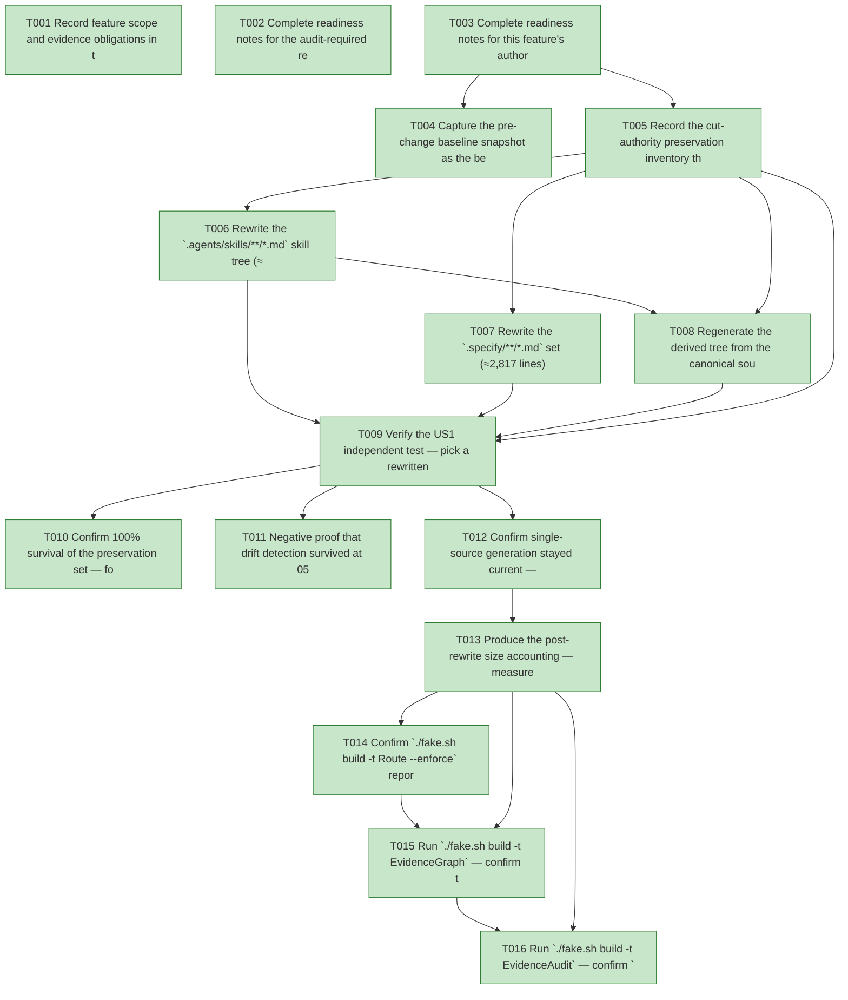

# Task Graph — 056-rewrite-governance-mds

## ✓ Graph is acyclic and consistent

## Skill Match Assessments

| Task | Candidate | Confidence | Signals | Reviewer disposition | Diagnostic |
|------|-----------|------------|---------|----------------------|------------|
| T001 | (none) | none |  | accepted-empty | T001: no high-confidence capability signal detected |
| T002 | (none) | none |  | accepted-empty | T002: no high-confidence capability signal detected |
| T003 | (none) | none |  | accepted-empty | T003: no high-confidence capability signal detected |
| T004 | (none) | none |  | accepted-empty | T004: no high-confidence capability signal detected |
| T005 | (none) | none |  | accepted-empty | T005: no high-confidence capability signal detected |
| T006 | (none) | none |  | accepted-empty | T006: no high-confidence capability signal detected |
| T007 | (none) | none |  | accepted-empty | T007: no high-confidence capability signal detected |
| T008 | (none) | none |  | declared | T008: no high-confidence capability signal detected |
| T009 | (none) | none |  | declared | T009: no high-confidence capability signal detected |
| T010 | (none) | none |  | declared | T010: no high-confidence capability signal detected |
| T011 | (none) | none |  | declared | T011: no high-confidence capability signal detected |
| T012 | (none) | none |  | declared | T012: no high-confidence capability signal detected |
| T013 | (none) | none |  | declared | T013: no high-confidence capability signal detected |
| T014 | (none) | none |  | declared | T014: no high-confidence capability signal detected |
| T015 | speckit-evidence-graph | high | structured task metadata | accepted | T015: task text matches speckit-evidence-graph; trigger_group=graph validation; matched_trigger=structured task metadata |
| T016 | speckit-evidence-audit | high | diff-scan | accepted | T016: task text matches speckit-evidence-audit; trigger_group=evidence audit; matched_trigger=diff-scan |

## Status counts (effective)

| Status | Count |
|--------|-------|
| [X] done | 16 |
| [S] synthetic | 0 |
| [S*] auto-synthetic | 0 |
| accepted [SEH] synthetic | 0 |
| unaccepted synthetic | 0 |

## Graph



## ASCII view

```
T001 [X] Record feature scope and evidence obligations in the plan — Tier 2 internal governance prose change; affected surfaces are the canonical corpus (`.agents/skills/**/*.md`, `.specify/**/*.md` templates/presets/twins and `constitution.md`), the regenerated `.claude/skills/**` tree, and `readiness/`; no public product `.fsi`, surface baseline, package identity/version, or runtime impact; the 055 currency model (`build/Governance/Guidance.fs` `ContractToken`/`GuidanceObligation`/forbidden inventory) is **preserved exactly, not altered**; Principle IV (Elmish/MVU) is **not applicable** (static prose editing verified by pure file-scan gates); Principle V is N/A (all evidence real); required real evidence = prose-size accounting, contract-token survival, the mutation red→green, generation currency, and the green escalated six-target order
T002 [X] Complete readiness notes for the audit-required readiness contract files — create `specs/056-rewrite-governance-mds/readiness/` and author `governance-risk-levels.md` (the small / medium / broad risk levels, the focused validation required for the selected level, when broad validation is required, and how non-authoritative aggregate FAKE results are recorded), `aggregate-hang-diagnostics.md` (verdict / stage / elapsed duration / last observed command / focused rerun / non-authoritative aggregate), and `runtime-limitations.md` (.NET 10 desktop / Vulkan / SkiaSharp preview / unsupported macOS/mobile/browser / no software-renderer fallback) so the unconditional readiness-contract scan passes
T003 [X] Complete readiness notes for this feature's authored-evidence placeholders — create placeholder `readiness/prose-size-accounting.md`, `readiness/contract-tokens.md`, `readiness/rewrite-red-green.md`, `readiness/generated-guidance.md`, `readiness/skill-sync-check.md`, `readiness/validation-contract.md`, `readiness/template-drift.md`, `readiness/skill-loading-evidence.md`, `readiness/evidence-graph.md`, and `readiness/evidence-audit.md`, each naming its authoritative command, artifact path, failure class, and next action (regenerable logs land under `readiness/logs/**`, already gitignored)
T004 [X] Capture the pre-change baseline snapshot as the before-state for SC-001 — record the current measured guidance-prose line counts (`find .agents/skills -name '*.md' | xargs wc -l | tail -1` ≈4072, `find .specify -name '*.md' | xargs wc -l | tail -1` ≈2817, sum ≈6889) against the corrected ≈6,882 baseline (features 046/055, consumed not re-derived) into `readiness/logs/baseline-snapshot.md` (the gitignored before-state — **T013 is the sole writer** of the deterministic `readiness/prose-size-accounting.md`, so the before-state is kept here to avoid being clobbered by the render), identifying the largest single targets first (`speckit-checklist` SKILL 367, `fsharp-parsing` SKILL 341, `speckit-specify` SKILL 325; the `constitution-template.md` / `tasks-template.md` twins 328/315 ×2)
T005 [X] Record the cut-authority preservation inventory the rewrite is checked against — confirm `build/Governance/Guidance.fs[i]` is **read-only** in scope and enumerate, from `contracts/governance-currency-contract.md` and the live `taskSkillistGuidanceCheck` / `controlsBoundaryGuidanceCheck` / `serializedRunnerObligation` values, the full C1 contract-token set (e.g. ``, `skillist:`, `deps:`, `[SEH]`, `synthetic-error-handling-approved`, `loaded_at`, `work_started_at`, `readiness/skill-loading-evidence.md`, `FS.Skia.UI.Controls`, `Control<'msg>`, `DataGrid`), the C2 obligation set with its `AnyOf`/`AllOf` mode (the AllOf anchors — `confidence`·`matched signals`·`reviewer disposition`, `legacy Charts package`·`no compatibility shim`, `FAKE-backed`·`.fake`·`sequential`·`not safe to run concurrently` — are non-negotiable phrases), and the C3 forbidden list (`FS.Skia.UI.Charts`, `fs-skia-charts`, `chart-only`, `DataGrid as chart`, `renderer neutral`, `host loop ownership`, …) into `readiness/contract-tokens.md` as the authority on what may not be cut
T006 [X] Rewrite the `.agents/skills/**/*.md` skill tree (≈4,072 lines) for tightness and clarity, largest files first — remove redundancy, restating, and ceremony that carries no rule while, per `contracts/governance-currency-contract.md`, keeping every C1 token verbatim in its home files, every C2 concept anchor matchable (AllOf phrases deleted by nobody), reintroducing no C3 forbidden term, and leaving every rule a reader can still extract (C5); per file, diff against its pre-feature version to confirm it is shorter without dropping an obligation or token (FR-001/FR-002/FR-003/FR-004/FR-005, SC-001/SC-006)
T007 [X] Rewrite the `.specify/**/*.md` set (≈2,817 lines) — `memory/constitution.md`, the `templates/*.md` documents (`spec-template.md`, `plan-template.md`, `tasks-template.md`, `constitution-template.md`), the `presets/fsharp-opinionated/{templates,commands}` twins, the `tasks-deps-template.yml` twin (comment prose only — its structural `skillist:` / `deps:` keys are C1 tokens preserved verbatim, not "tightened"), and `extensions/**/*.md` docs — tightening prose under the same C1–C5 contract; rewrite identical template/preset **twins in lockstep** so twins meant to stay identical remain byte-identical, and any intentional divergence still satisfies both files' obligations (FR-001/FR-007, SC-001/SC-006)
T008 [X] Regenerate the derived tree from the canonical source — run `./fake.sh build -t RefreshSurfaceBaselines` so `.claude/skills/**` is a byte-identical reproduction of the rewritten `.agents/skills/**` (never hand-edited), then confirm `SkillSyncCheck` is **green**; record the regeneration to `readiness/skill-sync-check.md` (FR-006, SC-004)
T009 [X] Verify the US1 independent test — pick a rewritten file, diff it against its pre-feature version to confirm it is materially shorter, run `./fake.sh build -t GeneratedGuidanceCheck` and observe **green** over the rewritten corpus (every obligation resolves, every token present, no forbidden term), and confirm by reading that every previously conveyed rule is still extractable **and that the diff introduces no new normative rule** (the FR-010 reviewer attestation — only wording, length, and redundancy changed; no rule added or dropped); record the transcript and the attestation to `readiness/generated-guidance.md` (US1 independent test, FR-010, SC-001/SC-006)
T010 [X] Confirm 100% survival of the preservation set — for every C1 contract token verify it remains a (case-insensitive) substring of each of its home files post-rewrite (twins included), and for every C2 obligation verify it still resolves for each home file under its `AnyOf`/`AllOf` mode; capture the present/matchable confirmation per home file plus the green `GeneratedGuidanceCheck` result to `readiness/contract-tokens.md` (FR-002/FR-003, SC-002)
T011 [X] Negative proof that drift detection survived at 055 strength — mutate one source-of-truth obligation (delete an AllOf concept phrase from a home file, e.g. remove `no compatibility shim` from `src/Controls/skill/SKILL.md`), run `./fake.sh build -t GeneratedGuidanceCheck` and observe it **fail** with the diagnostic `"{file}: obligation '{id}' ({source}) not reflected [{tag}]"` naming the file and unmet obligation, then `git checkout` the file and observe green; repeat for one contract-token removal and for reintroducing one C3 forbidden term (each must still fail), reverting after each; record the red→green log to `readiness/rewrite-red-green.md` (FR-002/FR-004, SC-003/SC-005)
T012 [X] Confirm single-source generation stayed current — verify `validation.contract.yml` is byte-unchanged (generated from `Routing.fs`, which is **not** edited) and `TargetMetadataDrift` is **green**, alongside the `SkillSyncCheck` confirmation from T008 (`.claude` regenerated, not hand-synced); record to `readiness/validation-contract.md` (FR-008, SC-004)
T013 [X] Produce the post-rewrite size accounting — measure the rewritten `.agents/skills/**/*.md` and `.specify/**/*.md` line counts (the two `find … | xargs wc -l | tail -1` commands), populate the `ProseSizeAccounting` record (corrected baseline `6882`, summed `Current`, signed `Delta`, restated target "lose no meaning, drop every word that earns nothing" — no fixed line count, no discredited ~23,000 figure), and render (as **sole writer**) the byte-deterministic `readiness/prose-size-accounting.md` via `renderProseSizeAccounting` with the reproduction commands; reconcile `Current` against the T004 `readiness/logs/baseline-snapshot.md` before-state and confirm it is materially below the ≈6,889 pre-feature count achieved purely by tightening (FR-009, SC-001/SC-007)
T014 [X] Confirm `./fake.sh build -t Route --enforce` reports the escalated maintainer-verify tier with every required evidence artifact present (naming any missing one), then run the escalated FAKE gate set **sequentially, never concurrently** — `Dev` → `GeneratedGuidanceCheck` → `TemplateCheck` → `GeneratedProductCheck` — recording aggregate results as **non-authoritative** and rerunning any race-like failure in focused isolation as the authoritative result; record the `TemplateCheck` transcript to `readiness/template-drift.md` and keep aggregate logs under `readiness/logs/` (SC-008)
T015 [X] Run `./fake.sh build -t EvidenceGraph` — confirm the acyclic DAG has no dangling refs, no `[S*]` surprises, and valid structured task metadata plus visible `skillist` mirrors, recording the graph before/after the status updates to `readiness/evidence-graph.md` (`verdict=ok`)
T016 [X] Run `./fake.sh build -t EvidenceAudit` — confirm `verdict=PASS` (0 unaccepted-synthetic, 0 auto-synthetic, 0 blocking diff-scan, 0 blocking readiness-contract) with zero synthetic evidence to accept; record to `readiness/evidence-audit.md` (this feature ships no `[S]` task)
```

