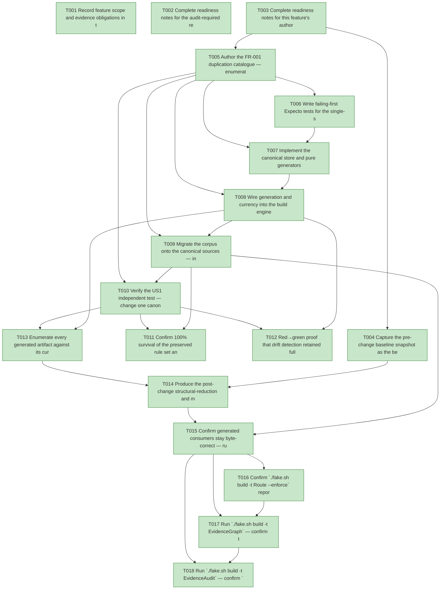

# Task Graph — 057-dedupe-governance-corpus

## ✓ Graph is acyclic and consistent

## Skill Match Assessments

| Task | Candidate | Confidence | Signals | Reviewer disposition | Diagnostic |
|------|-----------|------------|---------|----------------------|------------|
| T001 | (none) | none |  | accepted-empty | T001: no high-confidence capability signal detected |
| T002 | (none) | none |  | accepted-empty | T002: no high-confidence capability signal detected |
| T003 | (none) | none |  | accepted-empty | T003: no high-confidence capability signal detected |
| T004 | (none) | none |  | accepted-empty | T004: no high-confidence capability signal detected |
| T005 | (none) | none |  | accepted-empty | T005: no high-confidence capability signal detected |
| T006 | (none) | none |  | declared | T006: no high-confidence capability signal detected |
| T007 | (none) | none |  | declared | T007: no high-confidence capability signal detected |
| T008 | (none) | none |  | declared | T008: no high-confidence capability signal detected |
| T009 | (none) | none |  | declared | T009: no high-confidence capability signal detected |
| T010 | (none) | none |  | declared | T010: no high-confidence capability signal detected |
| T011 | (none) | none |  | declared | T011: no high-confidence capability signal detected |
| T012 | (none) | none |  | declared | T012: no high-confidence capability signal detected |
| T013 | (none) | none |  | declared | T013: no high-confidence capability signal detected |
| T014 | (none) | none |  | declared | T014: no high-confidence capability signal detected |
| T015 | (none) | none |  | declared | T015: no high-confidence capability signal detected |
| T016 | (none) | none |  | declared | T016: no high-confidence capability signal detected |
| T017 | speckit-evidence-graph | high | structured task metadata | accepted | T017: task text matches speckit-evidence-graph; trigger_group=graph validation; matched_trigger=structured task metadata |
| T018 | speckit-evidence-audit | high | diff-scan | accepted | T018: task text matches speckit-evidence-audit; trigger_group=evidence audit; matched_trigger=diff-scan |

## Status counts (effective)

| Status | Count |
|--------|-------|
| [X] done | 18 |
| [S] synthetic | 0 |
| [S*] auto-synthetic | 0 |
| accepted [SEH] synthetic | 0 |
| unaccepted synthetic | 0 |

## Graph



## ASCII view

```
T001 [X] Record feature scope and evidence obligations in the plan — Tier 2 internal governance tooling change; affected surfaces are `build/Governance/**` (rule *carriage*, the new `GovernedBlocks` canonical store, `ConstitutionFragments` full-body generalization, `TargetMetadata` currency fold, `Engine/Update.fs` effects), the governed corpus (`.agents/skills/**`, `.specify/**` templates/presets/twins and `constitution.md`, `template/base/docs/product.md`, `src/Controls/skill/SKILL.md`), the regenerated `.claude/skills/**` tree, and `readiness/`; no public product `.fsi`, surface baseline, package identity/version, or runtime impact; the `Guidance.fs` rule *set* (`ContractToken`/`GuidanceObligation`/forbidden inventory) is **preserved exactly** — only how copies are carried/generated changes; Principle IV is satisfied by the existing build-engine MVU boundary (pure render/currency unit-tested, `WriteFile`/regenerate effects emitted from `update`, real interpreter run via `RefreshSurfaceBaselines` at the `Interpret.fs` edge); Principle V is N/A (all evidence real)
T002 [X] Complete readiness notes for the audit-required readiness contract files — create `specs/057-dedupe-governance-corpus/readiness/` and author `governance-risk-levels.md` (the small / medium / broad risk levels, the focused validation required for the selected level, when broad validation is required, and how non-authoritative aggregate FAKE results are recorded), `aggregate-hang-diagnostics.md` (verdict / stage / elapsed duration / last observed command / focused rerun / non-authoritative aggregate), and `runtime-limitations.md` (.NET 10 desktop / Vulkan / SkiaSharp preview / unsupported macOS/mobile/browser / no software-renderer fallback) so the unconditional readiness-contract scan passes
T003 [X] Complete readiness notes for this feature's authored-evidence placeholders — create placeholder `readiness/duplication-catalogue.md`, `readiness/single-source-demo.md`, `readiness/dedupe-red-green.md`, `readiness/silent-drift-audit.md`, `readiness/generated-consumer-currency.md`, `readiness/structural-reduction.md`, `readiness/contract-tokens.md`, `readiness/generated-guidance.md`, `readiness/target-metadata-drift.md`, `readiness/skill-sync-check.md`, `readiness/validation-contract.md`, `readiness/template-drift.md`, `readiness/skill-loading-evidence.md`, `readiness/evidence-graph.md`, and `readiness/evidence-audit.md`, each naming its authoritative command, artifact path, failure class, and next action (regenerable logs land under `readiness/logs/**`, already gitignored)
T004 [X] Capture the pre-change baseline snapshot as the before-state for SC-002 — record the current measured corpus line counts (`find .agents/skills -name '*.md' | xargs wc -l | tail -1`, `find .specify -name '*.md' | xargs wc -l | tail -1`, plus the touched `template/**` and `src/Controls/skill/SKILL.md` files) against the honest 056 baseline of **6772** lines into `readiness/logs/baseline-snapshot.md` (the gitignored before-state — T014 is the sole writer of the deterministic `readiness/structural-reduction.md`, so the before-state is kept here to avoid being clobbered by the render), and the current files-touched-per-rule count for a sample token (`[SEH]` = 9 home files) as the N in the N→1 maintenance-surface claim
T005 [X] Author the FR-001 duplication catalogue — enumerate every structural-duplication instance across the four classes (per-file token carriage, per-file obligation anchors, in-file scanner echoes, `constitution.md`/`constitution-template.md`/fragment triple-maintenance), each traced to the validator that requires it (`task-skillist-guidance`, `controls-boundary-guidance`, `evaluateGuidanceCheck`, `ConstitutionFragments`), with its home files, proposed canonical source, hybrid-by-consumer resolution (`DeleteScanCanonical` vs `GenerateAndCheck`), and the currency gate that will guard each generated copy; distinguish genuine identical-content duplication from legitimate per-file variation (FR-011); record to `readiness/duplication-catalogue.md` as the authority the rest of the feature is checked against
T006 [X] Write failing-first Expecto tests for the single-source machinery — in `tests/Governance.Tests/GovernedBlocksTests.fs` (new) assert the pure `GovernedBlocks` render produces each home file's region from one `CanonicalText`, that currency returns current for a faithful regeneration and flags a tampered copy naming the file and its source, and that bytes outside a generated region are preserved; extend `ConstitutionFragmentsTests.fs` for full-principle-body extraction plus the substitution map (substituted render for `constitution.md`, verbatim render for the two `constitution-template.md` twins); these fail before the implementation exists (Principle VI failing-before)
T007 [X] Implement the canonical store and pure generators — add `build/Governance/GovernedBlocks.fs` with the `GovernedBlock` model (id, `CanonicalText`, `Targets` of `(path, RenderMode)`, cross-refs to the `Guidance.fs` tokens/obligations it satisfies), a pure render that splices each block into its home files via `BEGIN/END GENERATED: gov/<id>` markers, and a pure currency that compares an on-disk copy to a fresh render; generalize `ConstitutionFragments` from first-sentence extraction to full-principle-body ownership with a placeholder substitution map (`Verbatim` for the twins, `Substituted` for `constitution.md`); keep `Guidance.fs` rule set untouched (FR-002/FR-004/FR-007), make T006 pass
T008 [X] Wire generation and currency into the build engine — emit the new generation effects from `RefreshSurfaceBaselines` in `Engine/Update.fs` (splice every `gov/<id>` block + render the three `constitution.md`/`constitution-template.md` files from the placeholder-bearing source), keeping I/O at the `Interpret.fs` edge; fold the `GovernedBlocks` currency and the `constitution.md`/`constitution-template.md` render currency checks into `TargetMetadataDrift` so each generated copy is guarded by a gate that fails on drift naming the file and its source plus the `./fake.sh build -t RefreshSurfaceBaselines` repair command (FR-003); add the `RequireFiles` assertions for the new generated artifacts
T009 [X] Migrate the corpus onto the canonical sources — insert the `gov/<id>` markers into the home files that genuinely carry each token/obligation (the SKILL/command twins, the templates, `constitution.md`); migrate the class-1 per-file token carriage — the `[SEH]`/`synthetic-error-handling-approved` token across its home files and the controls tokens across `template/fragments/controls/**`, `template/base/docs/product.md`, and `src/Controls/skill/SKILL.md` — onto its canonical source under the hybrid-by-consumer rule (delete where an in-repo scanner reads canonical; generate-and-check where the consumer is a shipped/agent file), matching the `N` recorded in T004's baseline; delete the in-repo scanner echoes the scanner can now read from canonical prose (`Exact skill phrases for scans:`, `Exact readiness phrases for scans:`, `Exact visual proof rejection phrases for scans:`, `Exact owner phrases for scans:` in `tasks-template.md` ×2, `speckit.tasks.md`, `speckit-tasks`/`fs-skia-layout-evidence` SKILL.md, `template/base/docs/product.md`) per the hybrid-by-consumer rule (FR-006); convert the `constitution.md` / `constitution-template.md` triple to the placeholder-bearing canonical source plus two generated render modes; run `./fake.sh build -t RefreshSurfaceBaselines` so every derived copy is populated and `.claude/skills/**` is regenerated, never hand-edited — class-1/class-2 token/obligation carriage was determined to be FR-011 legitimate per-file variation (the token is required only as a present substring, not as identical prose; see readiness/duplication-catalogue.md FR-011 reclassification), so only the genuine class-3 cross-file phrase duplication and the constitution.md/constitution-template.md triple were single-sourced
T010 [X] Verify the US1 independent test — change one canonical contract token and one principle body in `constitution.md`'s placeholder-bearing source, run `./fake.sh build -t RefreshSurfaceBaselines`, and confirm (a) every derived home-file copy reflects both changes, (b) no home file was hand-edited (only the canonical source + regenerated outputs differ in `git diff`), and (c) `./fake.sh build -t GeneratedGuidanceCheck` and `./fake.sh build -t TargetMetadataDrift` are both **green**; record the demonstration and the per-rule files-touched (N→1) to `readiness/single-source-demo.md` (US1 independent test, SC-001/SC-003)
T011 [X] Confirm 100% survival of the preserved rule set and that the existing negatives still bite — verify every `Guidance.fs` contract token remains a (case-insensitive) substring of each home file post-migration (twins included) and every obligation still resolves under its `AnyOf`/`AllOf` mode; confirm the existing 056/055 negatives in `GuidanceValidatorTests.fs` (deleted obligation concept, removed contract token, reintroduced forbidden term) are unchanged and still fail; record the present/matchable confirmation per home file plus the green `GeneratedGuidanceCheck` to `readiness/contract-tokens.md` (FR-004/FR-005, SC-003/SC-006)
T012 [X] Red→green proof that drift detection retained full strength, including the new failure class — reproduce the three 056 mutations (delete an `AllOf` obligation concept from its canonical source; remove a contract token; reintroduce one forbidden term) and observe `./fake.sh build -t GeneratedGuidanceCheck` **fail** with the file+rule diagnostic each time, reverting after each; then add the **new** case — hand-edit one generated copy so it no longer matches its source and observe `./fake.sh build -t TargetMetadataDrift` **fail** naming the drifted file and its canonical source, then `./fake.sh build -t RefreshSurfaceBaselines` back to green; record the red→green log to `readiness/dedupe-red-green.md` (FR-005, SC-004)
T013 [X] Enumerate every generated artifact against its currency guard (no silent drift hole) — list each generated copy (the `gov/<id>` spliced regions, the three `constitution.md`/`constitution-template.md` render targets, the `.claude/skills/**` peers, `validation.contract.yml`) paired with the gate that guards it (`TargetMetadataDrift`, `SkillSyncCheck`), confirm no artifact has an empty guard cell, add an enumeration test asserting the pairing, and confirm `validation.contract.yml` is byte-unchanged (`Routing.fs` unedited) with `TargetMetadataDrift` green; record to `readiness/silent-drift-audit.md` and `readiness/validation-contract.md` (FR-003/FR-008, SC-005)
T014 [X] Produce the post-change structural-reduction and maintenance-surface accounting — measure the regenerated corpus line counts (the same `find … | xargs wc -l | tail -1` commands plus the touched `template/**` and `src` files), compute the signed delta against the honest 056 baseline of **6772** (no fixed target, no discredited historical figure), and render (as **sole writer**) the deterministic `readiness/structural-reduction.md` with the reproduction commands, the per-class line savings cross-referenced to `readiness/duplication-catalogue.md` (so the reduction is attributable to collapsed duplication, not dropped rules), and the files-touched-per-rule-change before vs after (N→1) reconciled against the T004 `readiness/logs/baseline-snapshot.md` before-state (FR-009, SC-002)
T015 [X] Confirm generated consumers stay byte-correct — run `./fake.sh build -t SkillSyncCheck` and the template-drift gate and observe both **green** (the `.agents`↔`.claude` peers and template-owned files remain synchronized after regeneration), then instantiate a `dotnet new fs-skia-ui` project and confirm it receives correct, non-stale governance guidance (its `constitution.md` and skill set match the regenerated canonical sources); record the transcripts to `readiness/generated-consumer-currency.md` and `readiness/template-drift.md` (FR-010, SC-007)
T016 [X] Confirm `./fake.sh build -t Route --enforce` reports the escalated maintainer-verify tier with every required evidence artifact present (naming any missing one), then run the escalated FAKE gate set **sequentially, never concurrently** — `Dev` → `GeneratedGuidanceCheck` → `TargetMetadataDrift` → `TemplateCheck` → `GeneratedProductCheck` — recording aggregate results as **non-authoritative** and rerunning any race-like failure in focused isolation as the authoritative result; record the `GeneratedGuidanceCheck`/`TargetMetadataDrift`/`TemplateCheck` transcripts to `readiness/generated-guidance.md`, `readiness/target-metadata-drift.md`, `readiness/skill-sync-check.md`, and keep aggregate logs under `readiness/logs/`
T017 [X] Run `./fake.sh build -t EvidenceGraph` — confirm the acyclic DAG has no dangling refs, no `[S*]` surprises, and valid structured task metadata plus visible `skillist` mirrors, recording the graph before/after the status updates to `readiness/evidence-graph.md` (`verdict=ok`)
T018 [X] Run `./fake.sh build -t EvidenceAudit` — confirm `verdict=PASS` (0 unaccepted-synthetic, 0 auto-synthetic, 0 blocking diff-scan, 0 blocking readiness-contract) with zero synthetic evidence to accept; record to `readiness/evidence-audit.md` (this feature ships no `[S]` task)
```

