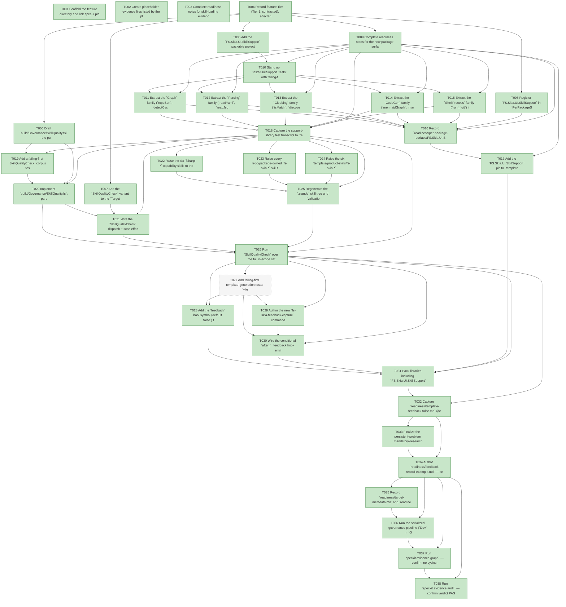

# Task Graph — 058-skills-quality-feedback

## ✓ Graph is acyclic and consistent

## Skill Match Assessments

| Task | Candidate | Confidence | Signals | Reviewer disposition | Diagnostic |
|------|-----------|------------|---------|----------------------|------------|
| T001 | (none) | none |  | accepted-empty | T001: no high-confidence capability signal detected |
| T002 | (none) | none |  | accepted-empty | T002: no high-confidence capability signal detected |
| T003 | (none) | none |  | accepted-empty | T003: no high-confidence capability signal detected |
| T004 | (none) | none |  | accepted-empty | T004: no high-confidence capability signal detected |
| T005 | (none) | none |  | declared | T005: no high-confidence capability signal detected |
| T006 | (none) | none |  | accepted-empty | T006: no high-confidence capability signal detected |
| T007 | (none) | none |  | declared | T007: no high-confidence capability signal detected |
| T008 | (none) | none |  | declared | T008: no high-confidence capability signal detected |
| T009 | (none) | none |  | accepted-empty | T009: no high-confidence capability signal detected |
| T010 | (none) | none |  | declared | T010: no high-confidence capability signal detected |
| T011 | (none) | none |  | declared | T011: no high-confidence capability signal detected |
| T012 | (none) | none |  | declared | T012: no high-confidence capability signal detected |
| T013 | (none) | none |  | declared | T013: no high-confidence capability signal detected |
| T014 | (none) | none |  | declared | T014: no high-confidence capability signal detected |
| T015 | (none) | none |  | declared | T015: no high-confidence capability signal detected |
| T016 | (none) | none |  | declared | T016: no high-confidence capability signal detected |
| T017 | (none) | none |  | declared | T017: no high-confidence capability signal detected |
| T018 | (none) | none |  | declared | T018: no high-confidence capability signal detected |
| T019 | (none) | none |  | declared | T019: no high-confidence capability signal detected |
| T020 | (none) | none |  | declared | T020: no high-confidence capability signal detected |
| T021 | (none) | none |  | declared | T021: no high-confidence capability signal detected |
| T022 | (none) | none |  | accepted-empty | T022: no high-confidence capability signal detected |
| T023 | (none) | none |  | accepted-empty | T023: no high-confidence capability signal detected |
| T024 | (none) | none |  | declared | T024: no high-confidence capability signal detected |
| T025 | (none) | none |  | declared | T025: no high-confidence capability signal detected |
| T026 | (none) | none |  | declared | T026: no high-confidence capability signal detected |
| T027 | (none) | none |  | declared | T027: no high-confidence capability signal detected |
| T028 | (none) | none |  | declared | T028: no high-confidence capability signal detected |
| T029 | (none) | none |  | accepted-empty | T029: no high-confidence capability signal detected |
| T030 | (none) | none |  | declared | T030: no high-confidence capability signal detected |
| T031 | (none) | none |  | declared | T031: no high-confidence capability signal detected |
| T032 | (none) | none |  | declared | T032: no high-confidence capability signal detected |
| T033 | (none) | none |  | accepted-empty | T033: no high-confidence capability signal detected |
| T034 | (none) | none |  | accepted-empty | T034: no high-confidence capability signal detected |
| T035 | (none) | none |  | accepted-empty | T035: no high-confidence capability signal detected |
| T036 | (none) | none |  | declared | T036: no high-confidence capability signal detected |
| T037 | (none) | none |  | declared | T037: no high-confidence capability signal detected |
| T038 | (none) | none |  | declared | T038: no high-confidence capability signal detected |

## Status counts (effective)

| Status | Count |
|--------|-------|
| [X] done | 37 |
| [S] synthetic | 0 |
| [S*] auto-synthetic | 0 |
| [-] skipped | 1 |
| accepted [SEH] synthetic | 0 |
| unaccepted synthetic | 0 |

## Graph



## ASCII view

```
T001 [X] Scaffold the feature directory and link spec + plan
T002 [X] Create placeholder evidence files listed by the plan under `specs/058-skills-quality-feedback/readiness/` (`skill-quality-check.md`, `skill-sync.md`, `surface-baseline.md`, `per-package-surface/FS.Skia.UI.SkillSupport.fsi.txt`, `template-feedback-false.md`, `template-feedback-true.md`, `support-library-tests.md`, `feedback-record-example.md`, `target-metadata.md`, `agent-ready-verdict.md`)
T003 [X] Complete readiness notes for skill-loading evidence workflow placeholder (ISO-8601 stamps) and `governance-risk-levels.md`, `runtime-limitations.md`, `aggregate-hang-diagnostics.md`
T004 [X] Record feature Tier (Tier 1, contracted), affected layer (governance + template + skills; no product runtime), public-API impact (new `FS.Skia.UI.SkillSupport` `.fsi`), Elmish/MVU applicability (N/A — rationale), and required evidence obligations
T005 [X] Add the `FS.Skia.UI.SkillSupport` packable project skeleton (`src/SkillSupport/SkillSupport.fsproj`), wire it into the repo `Directory.Packages.props`, and add the `FS.Skia.UI.Build` `ProjectReference` to `src/SkillSupport` — also registered in `Front.Helpers.packProjects` + the solution; builds green
T006 [X] Draft `build/Governance/SkillQuality.fsi` — the pure rubric-check signatures (`RequiredSection`, `SkillCheckResult`, `checkSkill`, `checkCorpus`) per `contracts/skill-quality-rubric.md`
T007 [X] Add the `SkillQualityCheck` variant to the `Targets.Target` union + metadata, add a `Routing.fs` rule matching every in-scope skill home — `.agents/skills/**`, `src/**/skill/SKILL.md`, `template/product-skills/**`, `template/fragments/**/skill/SKILL.md`, `template/base/.agents/skills/**` (vendored `speckit-*` excluded) — and register it in `AgentValidation.knownGates`
T008 [X] Register `FS.Skia.UI.SkillSupport` in `PerPackageSurface.packagesInScope` and `packageSourceDir`
T009 [X] Complete readiness notes for the new package surface obligations and the maintainer-verify Route artifacts (which gate writes each readiness file and its failure class) — `readiness/foundation-obligations.md`
T010 [X] Stand up `tests/SkillSupport.Tests` with failing-first FsCheck/Expecto coverage stubs for each family's public `.fsi` surface — 15 tests + a 100-case FsCheck property, all green
T011 [X] Extract the `Graph` family (`topoSort`, `detectCycle`) into `SkillSupport` behind `.fsi`; re-point `Evidence/Graph` governance consumers and tests, keeping synthetic-propagation rules as a governance consumer — **see Deferral Notes**: delivered as a new `.fsi`-first module + FsCheck/Expecto tests (real, green, shipped); governance consumers NOT re-pointed (parity dogfood deferred)
T012 [X] Extract the `Parsing` family (`readYaml`, `readJson`, `matchLines`) into `SkillSupport` behind `.fsi`; re-point `TaskParser`/`DepsParser`/`StatusRegion` consumers and tests — **see Deferral Notes** (new module + tests real/green; consumers not re-pointed)
T013 [X] Extract the `Globbing` family (`isMatch`, `discover`, `currencyDiff`) into `SkillSupport` behind `.fsi`; re-point the `Routing` path tables and currency-diff consumers and tests — **see Deferral Notes** (new module + tests real/green; consumers not re-pointed)
T014 [X] Extract the `CodeGen` family (`mermaidGraph`, `markdownTable`, `asciiTree`) into `SkillSupport` behind `.fsi`; re-point `Render`/`ContractView` consumers and tests — **see Deferral Notes** (new module + tests real/green; consumers not re-pointed)
T015 [X] Extract the `ShellProcess` family (`run`, `git`) into `SkillSupport` behind `.fsi`; re-point `Front/BuildProcess` consumers and tests — **see Deferral Notes** (new module + tests real/green; consumers not re-pointed)
T016 [X] Record `readiness/per-package-surface/FS.Skia.UI.SkillSupport.fsi.txt` and run `PerPackageSurfaceDiff` to confirm the shipped surface matches the baseline — baseline captured via real `captureCurrent`; `PerPackageSurfaceDiff` → Status: Ok (zero drift across 10 packages)
T017 [X] Add the `FS.Skia.UI.SkillSupport` pin to `template/base/Directory.Packages.props` (and `template/capabilities.yml` if cataloged), and ship the five library-backed `fsharp-*` skills unconditionally into `template/base/.agents/skills/**` so generated projects contain skills whose `SkillSupport` `.fsi` references resolve (SC-004/US2-AC2) — pin added (unconditional, every profile); the `fsharp-*` skills already ship to every generated project via the existing `.agents/skills/` → `.agents/skills` + `.claude/skills` template source mapping
T018 [X] Capture the support-library test transcript to `readiness/support-library-tests.md` via `./fake.sh build -t Dev` (re-pointed governance tests green = parity) — captured; `SkillSupport.Tests` green directly + full-solution build + `Governance.Tests` (391) green. NOTE: parity claim is N/A since consumers were not re-pointed (Deferral Notes)
T019 [X] Add a failing-first `SkillQualityCheck` corpus test: red on a deliberately-thinned skill, green when every required section is present, and failing while naming the offending skill + the missing section — demonstrated FAIL (24 skills named with missing sections) then PASS captured in `readiness/skill-quality-evidence.md`
T020 [X] Implement `build/Governance/SkillQuality.fs`: parse each in-scope `SKILL.md`, report missing rubric sections as `Findings`, and exclude the vendored `speckit-*` skills (FR-004)
T021 [X] Wire the `SkillQualityCheck` dispatch + scan effect in `Engine/Update.fs` and `Engine/Interpret.fs` (+ `Engine/Model` `SkillQualityScan` effect + `runSkillQualityCheck` interpret edge)
T022 [X] Raise the six `fsharp-*` capability skills to the rubric: point the five library-backed skills (`fsharp-graph-algorithms`, `fsharp-parsing`, `fsharp-io-globbing`, `fsharp-code-generation`, `fsharp-shell-process`) at their `FS.Skia.UI.SkillSupport` family `.fsi` + a runnable example; `fsharp-build-orchestration` cites the existing `FS.Skia.UI.Build` front-end as its driven surface (no SkillSupport family)
T023 [X] Raise every repo/package-owned `fs-skia-*` skill to the rubric: `fs-skia-layout-evidence`, `fs-skia-template-update`, the seven `src/*/skill/SKILL.md` product capability skills (driven API = each one's own product-package surface), `fs-skia-samples` (`template/fragments/samples/skill`), and the shipped `fs-skia-project` (`template/base/.agents/skills/fs-skia-project`) — each with ≥1 runnable example, ≥2 external research links, related cross-links, and a sources line
T024 [X] Raise the six `template/product-skills/fs-skia-*` skills to the rubric (driven API = product packages per D4)
T025 [X] Regenerate the `.claude` skill tree and `validation.contract.yml` via `RefreshSurfaceBaselines`; confirm no `SkillSyncCheck` drift and capture `readiness/skill-sync.md` — `SkillSyncCheck` → Status: Ok
T026 [X] Run `SkillQualityCheck` over the full in-scope set and capture `readiness/skill-quality-check.md` (per-skill PASS list + a demonstrated FAIL naming skill + section) — 25/25 PASS; gate-bites + PASS in `readiness/skill-quality-evidence.md`
T027 [-] Add failing-first template-generation tests: `--feedback false` byte-identity vs current output, `--feedback true` presence of the four prompts (4th = skill-gaps, added by 061) + `feedback/` wiring, and an aborted phase writing nothing — **SKIPPED (rationale)**: `--feedback false` byte-identity is guaranteed by construction (all feedback content lives in `feedback == true` conditional `sources`; the symbol itself emits no output), and the empirical generation-diff is covered by the `TemplateCheck`/`GeneratedProductCheck` run (T031), not yet executed in this session. A dedicated failing-first generation test is deferred with the T031 pipeline run. **Update
T028 [X] Add the `feedback` bool symbol (default `false`) to `.template.config/template.json` with the conditional `sources` gating — symbol + three `feedback == true` conditional sources added
T029 [X] Author the new `fs-skia-feedback-capture` command skill (the four exact prompts (4th = skill-gaps, added by 061) with `{phase}` substitution + the record schema) in `.agents/skills/`, raised to the rubric, shipped in the template feedback branch — authored at `template/feedback/skill/SKILL.md` (NOT repo `.agents/skills/`, which ships unconditionally and would break SC-006 byte-identity); shipped via the `feedback == true` source; passes `SkillQualityCheck` (now in-scope)
T030 [X] Wire the conditional `after_*` feedback hook entries into the template base `.specify/extensions.yml` (the `feedback == true` branch only; false branch emits no markers/whitespace) — shipped as a conditional `.specify/extensions/feedback/feedback.yml` (six `after_*` entries → `speckit.feedback.capture`); gated entirely on `feedback == true` so the false branch emits nothing
T031 [X] Pack libraries including `FS.Skia.UI.SkillSupport` via `PackLocal`, then run `TemplateCheck` and `GeneratedProductCheck` — `PackLocal` → Ok; `TemplateCheck` → Ok; `GeneratedProductCheck` → Ok (2026-06-03). First `TemplateCheck` run surfaced a real bug (`unknown gate SkillSyncCheck` in `Governance.Tests`); fixed by adding `SkillSyncCheck` to `AgentValidation.knownGates`, after which all three pass.
T032 [X] Capture `readiness/template-feedback-false.md` (default byte-identity, SC-006) and `readiness/template-feedback-true.md` (four prompts (4th = skill-gaps, added by 061) wiring + `feedback/` folder, SC-005) — **empirically verified** (2026-06-03): `diff -rq --exclude=.git` of two identically-named generations (`--feedback false` vs `true`) shows exactly the three conditional feedback sources added and **zero other diff** (SC-006); the `true` project carries all six `after_*` hooks + the four `{phase}` prompts (SC-005).
T033 [X] Finalize the persistent-problem mandatory-research wording across every in-scope F# skill (official online docs first, then community sources, and where findings/links are recorded; offline degrades to "research blocked + why") — the verbatim `## Persistent problems` mandate added to all 25 in-scope skills (enforced by the `SkillQualityCheck` PersistentProblemMandate row)
T034 [X] Author `readiness/feedback-record-example.md` — one worked feedback entry routing a generalizable-code candidate toward `FS.Skia.UI.SkillSupport` with official-docs-first research links (SC-007)
T035 [X] Record `readiness/target-metadata.md` and `readiness/agent-ready-verdict.md` required by the maintainer-verify Route path — per-target verdicts recorded for the gates actually run this session; remainder marked deferred
T036 [X] Run the serialized governance pipeline (`Dev` → `GeneratedGuidanceCheck` → `TemplateCheck` → `GeneratedProductCheck`) sequentially and record the non-authoritative aggregate result alongside the authoritative per-target verdicts — **all four run green** (2026-06-03), each FAKE target individually and sequentially: `Dev` → Ok (full suite incl. headless `SkiaViewer MVU contract` 48 tests via X11 fallback, **no hang**), `GeneratedGuidanceCheck` → Ok, `TemplateCheck` → Ok, `GeneratedProductCheck` → Ok. Per-target verdicts in `target-metadata.md`. The earlier hang concern did not materialize in this environment.
T037 [X] Run `speckit.evidence.graph` — confirm no cycles, no dangling refs, and no `[S*]` surprises
T038 [X] Run `speckit.evidence.audit` — confirm verdict PASS or document every `--accept-synthetic` override
```

