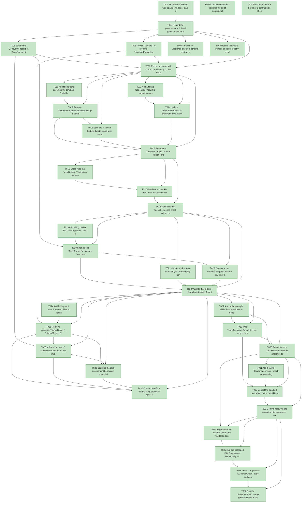

# Task Graph — 059-speckit-tasks-validation-feedback

## ✓ Graph is acyclic and consistent

## Skill Match Assessments

| Task | Candidate | Confidence | Signals | Reviewer disposition | Diagnostic |
|------|-----------|------------|---------|----------------------|------------|
| T001 | (none) | none |  | accepted-empty | T001: skillist trusted as declared; no owns-based capability requirement |
| T002 | (none) | none |  | accepted-empty | T002: skillist trusted as declared; no owns-based capability requirement |
| T003 | (none) | none |  | accepted-empty | T003: skillist trusted as declared; no owns-based capability requirement |
| T004 | (none) | none |  | accepted-empty | T004: skillist trusted as declared; no owns-based capability requirement |
| T005 | (none) | none |  | declared | T005: skillist trusted as declared; no owns-based capability requirement |
| T006 | (none) | none |  | accepted-empty | T006: skillist trusted as declared; no owns-based capability requirement |
| T007 | (none) | none |  | accepted-empty | T007: skillist trusted as declared; no owns-based capability requirement |
| T008 | (none) | none |  | accepted-empty | T008: skillist trusted as declared; no owns-based capability requirement |
| T009 | (none) | none |  | accepted-empty | T009: skillist trusted as declared; no owns-based capability requirement |
| T010 | (none) | none |  | declared | T010: skillist trusted as declared; no owns-based capability requirement |
| T011 | (none) | none |  | accepted-empty | T011: skillist trusted as declared; no owns-based capability requirement |
| T012 | (none) | none |  | declared | T012: skillist trusted as declared; no owns-based capability requirement |
| T013 | (none) | none |  | declared | T013: skillist trusted as declared; no owns-based capability requirement |
| T014 | (none) | none |  | accepted-empty | T014: skillist trusted as declared; no owns-based capability requirement |
| T015 | (none) | none |  | declared | T015: skillist trusted as declared; no owns-based capability requirement |
| T016 | (none) | none |  | declared | T016: skillist trusted as declared; no owns-based capability requirement |
| T017 | (none) | none |  | declared | T017: skillist trusted as declared; no owns-based capability requirement |
| T018 | (none) | none |  | declared | T018: skillist trusted as declared; no owns-based capability requirement |
| T019 | (none) | none |  | declared | T019: skillist trusted as declared; no owns-based capability requirement |
| T020 | (none) | none |  | declared | T020: skillist trusted as declared; no owns-based capability requirement |
| T021 | (none) | none |  | accepted-empty | T021: skillist trusted as declared; no owns-based capability requirement |
| T022 | speckit-tasks | high | owns:task-generation | accepted | T022: owns task-generation requires skill speckit-tasks; trigger_group=owns; matched_trigger=owns:task-generation |
| T023 | (none) | none |  | declared | T023: skillist trusted as declared; no owns-based capability requirement |
| T024 | (none) | none |  | declared | T024: skillist trusted as declared; no owns-based capability requirement |
| T025 | (none) | none |  | declared | T025: skillist trusted as declared; no owns-based capability requirement |
| T026 | (none) | none |  | declared | T026: skillist trusted as declared; no owns-based capability requirement |
| T027 | (none) | none |  | accepted-empty | T027: skillist trusted as declared; no owns-based capability requirement |
| T028 | (none) | none |  | declared | T028: skillist trusted as declared; no owns-based capability requirement |
| T029 | (none) | none |  | declared | T029: skillist trusted as declared; no owns-based capability requirement |
| T030 | (none) | none |  | accepted-empty | T030: skillist trusted as declared; no owns-based capability requirement |
| T031 | (none) | none |  | declared | T031: skillist trusted as declared; no owns-based capability requirement |
| T032 | (none) | none |  | accepted-empty | T032: skillist trusted as declared; no owns-based capability requirement |
| T033 | (none) | none |  | declared | T033: skillist trusted as declared; no owns-based capability requirement |
| T034 | (none) | none |  | declared | T034: skillist trusted as declared; no owns-based capability requirement |
| T035 | (none) | none |  | accepted-empty | T035: skillist trusted as declared; no owns-based capability requirement |
| T036 | speckit-evidence-graph | high | owns:graph-validation | accepted | T036: owns graph-validation requires skill speckit-evidence-graph; trigger_group=owns; matched_trigger=owns:graph-validation |
| T037 | speckit-evidence-audit | high | owns:evidence-audit | accepted | T037: owns evidence-audit requires skill speckit-evidence-audit; trigger_group=owns; matched_trigger=owns:evidence-audit |
| T038 | (none) | none |  | declared | T038: skillist trusted as declared; no owns-based capability requirement |

## Status counts (effective)

| Status | Count |
|--------|-------|
| [X] done | 38 |
| [S] synthetic | 0 |
| [S*] auto-synthetic | 0 |
| accepted [SEH] synthetic | 0 |
| unaccepted synthetic | 0 |

## Graph



## ASCII view

```
T001 [X] Scaffold the feature workspace: link spec, plan, research, data-model, and contracts, and create the `readiness/` directory
T002 [X] Complete readiness notes for the audit-enforced placeholder files (`readiness/governance-risk-levels.md`, `readiness/aggregate-hang-diagnostics.md`, `readiness/runtime-limitations.md`, `readiness/generated-validation-authority.md`, `readiness/skill-loading-evidence-workflow.md`, plus `target-metadata.md` and `agent-ready-verdict.md` for the escalated path), each naming the authoritative command, artifact path, failure class, and next action
T003 [X] Record the feature Tier (Tier 1 contracted), affected layers (compiled governance engine plus consumer template and bundled skills), public-contract impact, Principle IV / MVU applicability (not applicable — governance tooling, no runtime state), and the required evidence obligations
T004 [X] Record the governance-risk level (small, medium, broad), the focused validation selected for this change, when broad validation is required, and how non-authoritative aggregate results are captured
T005 [X] Extend the `DepsEntry` record in `DepsParser.fsi` and `DepsParser.fs` with an optional `owns` field and parse the per-task `owns` key (default none)
T006 [X] Revise `Audit.fsi` to drop the `expectedCapabilityMatches` signature and declare the `owns`-driven assessment surface
T007 [X] Finalize the versioned deps-file schema contract under `contracts/tasks-deps-schema.md` as the shipped consumer contract, with the `owns` vocabulary and the directive error table
T008 [X] Record the public-surface and skill-registry baseline obligations and the `RefreshSurfaceBaselines` regeneration step for the contract change
T009 [X] Record unsupported-scope boundaries (no new validator capabilities, no synthetic-propagation redesign) and the loud-failure diagnostics expected at the resolver and parser edges
T010 [X] Add failing tests asserting the template `build.fsx` resolves the feature from `.specify/feature.json`, honors the override variable, and fails loud with no sample fallback
T011 [X] Add a failing `GeneratedProduct.fs` expectation asserting a generated project ships no sample feature and inherits the loud-fail resolver behaviour
T012 [X] Replace `ensureGeneratedEvidencePackage` in `template/base/build.fsx` with a `feature.json` resolver (`SPECKIT_FEATURE_DIR` override, then `.specify/feature.json`, then loud fail) and delete the sample synthesiser, the `specs/generated-evidence-workflow` fallback, and the sample-era `GENERATED_EVIDENCE_FEATURE_DIR` selector
T013 [X] Echo the resolved feature directory and task count (and the `SPECKIT_FEATURE_DIR` override when set) from the validation target so authors can confirm what was validated
T014 [X] Update `GeneratedProduct.fs` expectations to assert sample absence and the loud-fail message naming `.specify/feature.json` and the override variable
T015 [X] Generate a consumer project, run the validation target, and confirm the echoed directory and count match the feature with a loud failure when none resolves; capture the transcript under `readiness/`
T016 [X] Cross-read the `speckit-tasks` Validation section and the `speckit-evidence-graph` skill to confirm they name the same in-process `EvidenceGraph` entry point
T017 [X] Rewrite the `speckit-tasks` skill Validation section to remove the non-existent `run-audit.sh` runner and defer to the canonical `EvidenceGraph` target, documenting the `SPECKIT_FEATURE_DIR` override variable
T018 [X] Reconcile the `speckit-evidence-graph` skill so both skills present one non-contradictory validation entry point
T019 [X] Add failing parser tests: bare top-level `Tnnn` keys missing the wrapper emit the standalone directive error and are not buried under downstream no-key errors
T020 [X] Short-circuit `DepsParser.fs` to detect bare top-level task-id keys missing the `tasks` wrapper and emit the FR-007 directive message first and standalone
T021 [X] Update `tasks-deps-template.yml` to exemplify `schema_version`, the `tasks` wrapper, and the per-task `owns` field with a complete minimal example
T022 [X] Document the required wrapper, version key, and `owns` field in the `speckit-tasks` skill with an embedded copyable deps example (the removed sample is no longer the only reference)
T023 [X] Validate that a deps file authored strictly from the template and skill text passes the schema gate on the first attempt (SC-003)
T024 [X] Add failing audit tests: free-form titles no longer block, ownership derives from the `owns` field, and unknown `owns` values and missing implied skills are reported
T025 [X] Remove `capabilityTriggerGroups`, `triggerMatchesTitle`, and `expectedCapabilityMatches` from `Audit.fs` and derive the `SkillAssessment` from the `owns` field
T026 [X] Validate the `owns` closed vocabulary and the implied-skill-present rule in `Audit.fs` with directive error messages
T027 [X] Author the two split skills `fs-skia-evidence-mode` and `fs-skia-layout-readability` under `.agents/skills` and retire `fs-skia-layout-evidence`
T028 [X] Wire `.template.config/template.json` sources and `template/capabilities.yml` to register both new skills, then regenerate the `.claude` peers via `RefreshSurfaceBaselines`
T029 [X] Describe the skill-assessment behaviour honestly in the `speckit-tasks` skill (trusted-as-declared, and what the high-confidence cases key off) and add `owns` migration guidance
T030 [X] Confirm free-form natural-language titles never flip evidence ownership now that the title matcher is gone (SC-006)
T031 [X] Add a failing `Governance.Tests` check enumerating every skill id in the bundled hint tables and asserting each resolves to exactly one consumer-registerable skill
T032 [X] Correct the bundled hint tables in the `speckit-tasks` skill and the deps template, replacing the unresolvable `fs-skia-layout` hint and the layout example with the registered readability skill id
T033 [X] Confirm following the corrected hints produces zero unresolved-skill validation failures (SC-004)
T034 [X] Regenerate the `.claude` peers and `validation.contract.yml` via `RefreshSurfaceBaselines` and confirm `SkillSyncCheck` and `TargetMetadataDrift` currency (SC-007)
T035 [X] Run the escalated FAKE gate order sequentially — `Dev`, `GeneratedGuidanceCheck`, `TemplateCheck`, `GeneratedProductCheck` — and record the non-authoritative aggregate results
T036 [X] Run the in-process `EvidenceGraph` target and confirm no cycles, no dangling references, the correct feature directory and task count echo, and no `[S*]` surprises
T037 [X] Run the `EvidenceAudit` merge gate and confirm the verdict is PASS or document every accepted synthetic override
T038 [X] Re-point every compiled and authored reference to the retired `fs-skia-layout-evidence`: the two `Verbatim` splice sources and the hardcoded capability-skill list in `build/Governance/GovernedBlocks.fs` (L158, L170, L303-315) to the two split skills; the canonical capability-skill list authored in `.specify/templates/constitution-template.md` and its preset twin; and the prose refs in `template/base/README.md`, `.specify/templates/tasks-template.md`, and `.specify/presets/fsharp-opinionated/{templates/tasks-template.md,commands/speckit.tasks.md}` — so `GeneratedGuidanceCheck` / `SkillSyncCheck` stay green (FR-012/FR-013)
```

