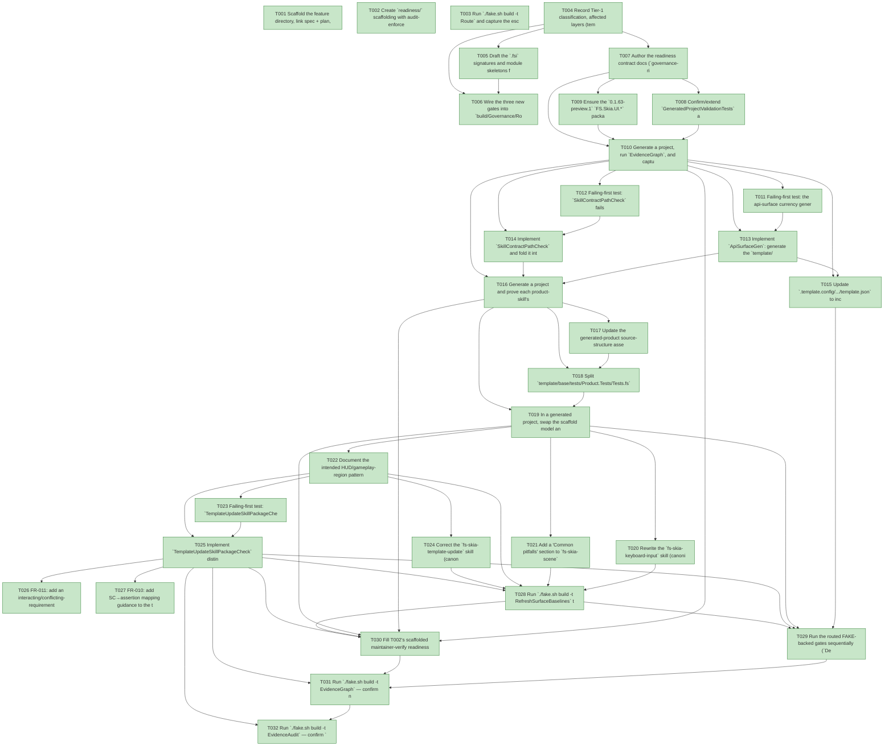

# Task Graph — 060-asteroids-consumer-friction-followups

## ✓ Graph is acyclic and consistent

## Skill Match Assessments

| Task | Candidate | Confidence | Signals | Reviewer disposition | Diagnostic |
|------|-----------|------------|---------|----------------------|------------|
| T001 | (none) | none |  | accepted-empty | T001: skillist trusted as declared; no owns-based capability requirement |
| T002 | (none) | none |  | accepted-empty | T002: skillist trusted as declared; no owns-based capability requirement |
| T003 | (none) | none |  | accepted-empty | T003: skillist trusted as declared; no owns-based capability requirement |
| T004 | (none) | none |  | accepted-empty | T004: skillist trusted as declared; no owns-based capability requirement |
| T005 | (none) | none |  | accepted-empty | T005: skillist trusted as declared; no owns-based capability requirement |
| T006 | (none) | none |  | accepted-empty | T006: skillist trusted as declared; no owns-based capability requirement |
| T007 | (none) | none |  | accepted-empty | T007: skillist trusted as declared; no owns-based capability requirement |
| T008 | (none) | none |  | declared | T008: skillist trusted as declared; no owns-based capability requirement |
| T009 | (none) | none |  | declared | T009: skillist trusted as declared; no owns-based capability requirement |
| T010 | (none) | none |  | declared | T010: skillist trusted as declared; no owns-based capability requirement |
| T011 | (none) | none |  | declared | T011: skillist trusted as declared; no owns-based capability requirement |
| T012 | (none) | none |  | declared | T012: skillist trusted as declared; no owns-based capability requirement |
| T013 | (none) | none |  | declared | T013: skillist trusted as declared; no owns-based capability requirement |
| T014 | (none) | none |  | declared | T014: skillist trusted as declared; no owns-based capability requirement |
| T015 | (none) | none |  | accepted-empty | T015: skillist trusted as declared; no owns-based capability requirement |
| T016 | (none) | none |  | declared | T016: skillist trusted as declared; no owns-based capability requirement |
| T017 | (none) | none |  | declared | T017: skillist trusted as declared; no owns-based capability requirement |
| T018 | (none) | none |  | declared | T018: skillist trusted as declared; no owns-based capability requirement |
| T019 | (none) | none |  | declared | T019: skillist trusted as declared; no owns-based capability requirement |
| T020 | (none) | none |  | declared | T020: skillist trusted as declared; no owns-based capability requirement |
| T021 | (none) | none |  | declared | T021: skillist trusted as declared; no owns-based capability requirement |
| T022 | (none) | none |  | declared | T022: skillist trusted as declared; no owns-based capability requirement |
| T023 | (none) | none |  | declared | T023: skillist trusted as declared; no owns-based capability requirement |
| T024 | (none) | none |  | declared | T024: skillist trusted as declared; no owns-based capability requirement |
| T025 | (none) | none |  | declared | T025: skillist trusted as declared; no owns-based capability requirement |
| T026 | (none) | none |  | accepted-empty | T026: skillist trusted as declared; no owns-based capability requirement |
| T027 | (none) | none |  | accepted-empty | T027: skillist trusted as declared; no owns-based capability requirement |
| T028 | (none) | none |  | declared | T028: skillist trusted as declared; no owns-based capability requirement |
| T029 | (none) | none |  | accepted-empty | T029: skillist trusted as declared; no owns-based capability requirement |
| T030 | (none) | none |  | accepted-empty | T030: skillist trusted as declared; no owns-based capability requirement |
| T031 | speckit-evidence-graph | high | owns:graph-validation | accepted | T031: owns graph-validation requires skill speckit-evidence-graph; trigger_group=owns; matched_trigger=owns:graph-validation |
| T032 | speckit-evidence-audit | high | owns:evidence-audit | accepted | T032: owns evidence-audit requires skill speckit-evidence-audit; trigger_group=owns; matched_trigger=owns:evidence-audit |

## Status counts (effective)

| Status | Count |
|--------|-------|
| [X] done | 32 |
| [S] synthetic | 0 |
| [S*] auto-synthetic | 0 |
| accepted [SEH] synthetic | 0 |
| unaccepted synthetic | 0 |

## Graph



## ASCII view

```
T001 [X] Scaffold the feature directory, link spec + plan, and repoint the `AGENTS.md` SPECKIT marker at this plan
T002 [X] Create `readiness/` scaffolding with audit-enforced placeholder files discoverable before implementation: `target-metadata.md`, `agent-ready-verdict.md`, `skill-loading-evidence.md`, `aggregate-hang-diagnostics.md`, `governance-risk-levels.md`, `runtime-limitations.md`, `skill-quality-check.md`, `generated-project/{feature-resolution,api-surface,test-split}.log`, `template/{template-pack.log,template-package-contents.md}`
T003 [X] Run `./fake.sh build -t Route` and capture the escalated `maintainer-verify` tier and authoritative gate list for this change
T004 [X] Record Tier-1 classification, affected layers (template / governance / skills), public-API impact (none — signatures unchanged), Elmish/MVU applicability (N/A — no stateful workflow), and the evidence obligations (FR-001/FR-003/FR-005 real generated-project logs)
T005 [X] Draft the `.fsi` signatures and module skeletons for the three new governance modules in `FS.Skia.UI.Build` (`ApiSurfaceGen`, `SkillContractPath`, `TemplateUpdatePackage`) over the entities in `data-model.md`
T006 [X] Wire the three new gates into `build/Governance/Routing.fs`, regenerate `validation.contract.yml`, and confirm `TargetMetadataDrift` currency for the routed globs
T007 [X] Author the readiness contract docs (`governance-risk-levels.md`, `aggregate-hang-diagnostics.md`, `runtime-limitations.md`) naming the authoritative command, artifact path, failure class, and next action for each
T008 [X] Confirm/extend `GeneratedProjectValidationTests` asserting the generated `build.fsx` `resolveFeatureDir` echoes `feature-directory=`/`tasks=` for a multi-task feature and **fails loudly** for a missing `SPECKIT_FEATURE_DIR` / empty `feature.json`
T009 [X] Ensure the `0.1.63-preview.1` `FS.Skia.UI.*` packages are packed to the local feed; **bump the *template* package version only** (`.template.package/FS.Skia.UI.Template.fsproj`), run `TemplatePack`, and install so a freshly generated project carries the merged `0.1.63-preview.1` resolver (FR-002); capture `readiness/template/template-pack.log` + `template-package-contents.md`
T010 [X] Generate a project, run `EvidenceGraph`, and capture the echoed `feature-directory=`/`tasks=` and the loud-failure path into `readiness/generated-project/feature-resolution.log` (FR-001 proof, SC-001)
T011 [X] Failing-first test: the api-surface currency generator emits `docs/api-surface/<Pkg>/<file>.fsi` **byte-identical** to each `capabilities.yml` `contracts:` source `.fsi`, and drift fails the currency gate
T012 [X] Failing-first test: `SkillContractPathCheck` fails when a capability/product skill names a `docs/api-surface/...fsi` path absent from the emitted tree, on an orphan emitted file no skill claims, and on a "no DLL reflection needed" claim against an absent path (FR-004)
T013 [X] Implement `ApiSurfaceGen`: generate the `template/base/docs/api-surface/` tree single-source from `capabilities.yml` `contracts:`, regenerated via `RefreshSurfaceBaselines` and currency-enforced (FR-003)
T014 [X] Implement `SkillContractPathCheck` and fold it into `GeneratedProductCheck`/`TemplateCheck` with diagnostics naming the skill and the missing/extra path (FR-004)
T015 [X] Update `.template.config/.../template.json` to include the emitted `docs/api-surface/**` content
T016 [X] Generate a project and prove each product-skill's named `docs/api-surface/<Pkg>/<Pkg>.fsi` exists and is byte-identical to source into `readiness/generated-project/api-surface.log` (SC-002)
T017 [X] Update the generated-product source-structure assertions (`TemplateCheck`/`GeneratedProductCheck`) to require `GovernanceTests.fs` + `BehaviorTests.fs` in `Product.Tests` (failing-first against the single `Tests.fs`)
T018 [X] Split `template/base/tests/Product.Tests/Tests.fs` into durable `GovernanceTests.fs` (model-agnostic source/structure/visual-evidence scans) and replaceable `BehaviorTests.fs`; update `Product.Tests.fsproj` compile order and `template.json` (FR-005)
T019 [X] In a generated project, swap the scaffold model and prove `GovernanceTests.fs` still compiles/runs while only `BehaviorTests.fs` needs rewriting into `readiness/generated-project/test-split.log` (SC-003)
T020 [X] Rewrite the `fs-skia-keyboard-input` skill (canonical `.agents`/template source) to show only the `mapKey : ViewerKey -> bool -> Msg option` boundary the `app` host threads, removing the `Keyboard.init bindings` / `KeyboardEffect` reducer flow as the consumer path (FR-006, SC-004); and add a "Common pitfalls" note covering duplicate DU case names across co-opened modules (`ViewerKey.Unknown` vs `ViewerRunBlockedStage.Unknown`) with the fully-qualified resolution, so the keyboard skill carries its half of the pitfall coverage (FR-007, SC-005)
T021 [X] Add a "Common pitfalls" section to `fs-skia-scene`: consumer geometry records (`Vec2`) colliding with framework `Point`/`Rect`, with the conversion note (the keyboard DU-case pitfall is owned by T020) (FR-007, SC-005)
T022 [X] Document the intended HUD/gameplay-region pattern in `fs-skia-layout-readability` (reserve a HUD band; confine/clamp gameplay bounds to the gameplay region; overdraw the HUD) (FR-008, SC-005)
T023 [X] Failing-first test: `TemplateUpdateSkillPackageCheck` diffs the `fs-skia-template-update` enumerated package IDs against the packable `.fsproj` set (11 projects) and fails on any phantom or missing package (SC-006)
T024 [X] Correct the `fs-skia-template-update` skill (canonical `.agents`): remove the phantom bare-Lib `FS.Skia.UI` feed check, add `FS.Skia.UI.SkillSupport` and `FS.Skia.UI.Input` to the step-5 feed loop, and fix the "nine repo packages" count (FR-009)
T025 [X] Implement `TemplateUpdateSkillPackageCheck` distinguishing the feed-loop enumeration (all packable, incl. non-pinned `Input`) from the props-pin enumeration (FR-009, SC-006)
T026 [X] FR-011: add an interacting/conflicting-requirement note to the spec-authoring guidance (entity-count bound vs. per-wave escalation — "count may cap; difficulty continues via speed") — authoring guidance, not a new gate
T027 [X] FR-010: add SC→assertion mapping guidance to the tasks-authoring template, with the split governance test as the worked example of an enforcing assertion — authoring guidance, not a new gate
T028 [X] Run `./fake.sh build -t RefreshSurfaceBaselines` to regenerate the `.claude` tree from `.agents` and the api-surface tree; confirm `SkillSyncCheck` / `TargetMetadataDrift` / `SkillQualityCheck` green; capture `readiness/skill-quality-check.md` (FR-012)
T029 [X] Run the routed FAKE-backed gates sequentially (`Dev`, `GeneratedGuidanceCheck`, `TemplateCheck`, `GeneratedProductCheck`) and record any non-authoritative aggregate/headless results in `readiness/aggregate-hang-diagnostics.md`
T030 [X] Fill T002's scaffolded maintainer-verify readiness artifacts: `target-metadata.md`, `agent-ready-verdict.md`, and `skill-loading-evidence.md`. This only *aggregates* the pre-task skill loads that each skilled task (T008–T025) recorded with ISO-8601 timestamps **before** its code changes began; it does not originate them
T031 [X] Run `./fake.sh build -t EvidenceGraph` — confirm no cycles, no dangling refs, no `[S*]` surprises, and the echoed `feature-directory`/`tasks` match this feature
T032 [X] Run `./fake.sh build -t EvidenceAudit` — confirm `verdict=PASS` for `specs/060-asteroids-consumer-friction-followups` (SC-007)
```

