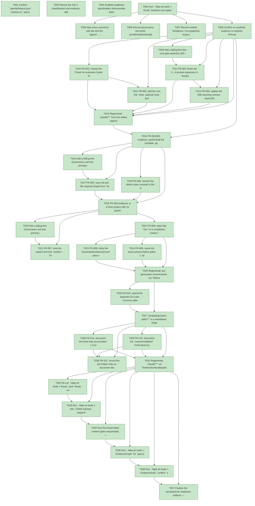

# Task Graph — 061-breakout-consumer-friction-followups

## ✓ Graph is acyclic and consistent

## Skill Match Assessments

| Task | Candidate | Confidence | Signals | Reviewer disposition | Diagnostic |
|------|-----------|------------|---------|----------------------|------------|
| T001 | (none) | none |  | accepted-empty | T001: skillist trusted as declared; no owns-based capability requirement |
| T002 | (none) | none |  | accepted-empty | T002: skillist trusted as declared; no owns-based capability requirement |
| T003 | (none) | none |  | accepted-empty | T003: skillist trusted as declared; no owns-based capability requirement |
| T004 | (none) | none |  | accepted-empty | T004: skillist trusted as declared; no owns-based capability requirement |
| T005 | (none) | none |  | accepted-empty | T005: skillist trusted as declared; no owns-based capability requirement |
| T006 | (none) | none |  | accepted-empty | T006: skillist trusted as declared; no owns-based capability requirement |
| T007 | (none) | none |  | accepted-empty | T007: skillist trusted as declared; no owns-based capability requirement |
| T008 | (none) | none |  | accepted-empty | T008: skillist trusted as declared; no owns-based capability requirement |
| T009 | (none) | none |  | declared | T009: skillist trusted as declared; no owns-based capability requirement |
| T010 | (none) | none |  | accepted-empty | T010: skillist trusted as declared; no owns-based capability requirement |
| T011 | (none) | none |  | accepted-empty | T011: skillist trusted as declared; no owns-based capability requirement |
| T012 | (none) | none |  | accepted-empty | T012: skillist trusted as declared; no owns-based capability requirement |
| T013 | (none) | none |  | accepted-empty | T013: skillist trusted as declared; no owns-based capability requirement |
| T014 | (none) | none |  | declared | T014: skillist trusted as declared; no owns-based capability requirement |
| T015 | (none) | none |  | declared | T015: skillist trusted as declared; no owns-based capability requirement |
| T016 | (none) | none |  | declared | T016: skillist trusted as declared; no owns-based capability requirement |
| T017 | (none) | none |  | declared | T017: skillist trusted as declared; no owns-based capability requirement |
| T018 | (none) | none |  | accepted-empty | T018: skillist trusted as declared; no owns-based capability requirement |
| T019 | (none) | none |  | declared | T019: skillist trusted as declared; no owns-based capability requirement |
| T020 | (none) | none |  | declared | T020: skillist trusted as declared; no owns-based capability requirement |
| T021 | (none) | none |  | declared | T021: skillist trusted as declared; no owns-based capability requirement |
| T022 | (none) | none |  | accepted-empty | T022: skillist trusted as declared; no owns-based capability requirement |
| T023 | (none) | none |  | accepted-empty | T023: skillist trusted as declared; no owns-based capability requirement |
| T024 | (none) | none |  | accepted-empty | T024: skillist trusted as declared; no owns-based capability requirement |
| T025 | (none) | none |  | declared | T025: skillist trusted as declared; no owns-based capability requirement |
| T026 | (none) | none |  | declared | T026: skillist trusted as declared; no owns-based capability requirement |
| T027 | (none) | none |  | declared | T027: skillist trusted as declared; no owns-based capability requirement |
| T028 | (none) | none |  | declared | T028: skillist trusted as declared; no owns-based capability requirement |
| T029 | (none) | none |  | declared | T029: skillist trusted as declared; no owns-based capability requirement |
| T030 | (none) | none |  | accepted-empty | T030: skillist trusted as declared; no owns-based capability requirement |
| T031 | (none) | none |  | declared | T031: skillist trusted as declared; no owns-based capability requirement |
| T032 | (none) | none |  | accepted-empty | T032: skillist trusted as declared; no owns-based capability requirement |
| T033 | (none) | none |  | declared | T033: skillist trusted as declared; no owns-based capability requirement |
| T034 | (none) | none |  | declared | T034: skillist trusted as declared; no owns-based capability requirement |
| T035 | speckit-evidence-graph | high | owns:graph-validation | accepted | T035: owns graph-validation requires skill speckit-evidence-graph; trigger_group=owns; matched_trigger=owns:graph-validation |
| T036 | speckit-evidence-audit | high | owns:evidence-audit | accepted | T036: owns evidence-audit requires skill speckit-evidence-audit; trigger_group=owns; matched_trigger=owns:evidence-audit |
| T037 | (none) | none |  | accepted-empty | T037: skillist trusted as declared; no owns-based capability requirement |

## Status counts (effective)

| Status | Count |
|--------|-------|
| [X] done | 37 |
| [S] synthetic | 0 |
| [S*] auto-synthetic | 0 |
| accepted [SEH] synthetic | 0 |
| unaccepted synthetic | 0 |

## Graph



## ASCII view

```
T001 [X] Confirm `.specify/feature.json` resolves to `specs/061-breakout-consumer-friction-followups` and cross-link spec/plan/research/data-model/contracts for this feature
T002 [X] Record the Tier-2 classification and evidence obligations: no public `.fsi` change (D8 documents helpers, not ships); Principle IV N/A (no stateful/IO runtime); Principle V none-planned (all real evidence); Principle I degenerate (no new API to sketch in `.fsi`)
T003 [X] Scaffold readiness placeholders discoverable before implementation — `target-metadata.md`, `agent-ready-verdict.md`, `skill-loading-evidence.md`, `aggregate-hang-diagnostics.md`, `governance-risk-levels.md`, `runtime-limitations.md`, `feedback-hook-autofire.md`, `readiness-recoverability.md`, `arcade-helper-triage.md` — each naming its authoritative command, artifact path, failure class, and next action
T004 [X] Run `./fake.sh build -t Route` baseline and capture the printed tier + minimal gate list to `readiness/focused-gates.md`
T005 [X] Map every canonical edit site and the `.agents`→`.claude` regeneration discipline: phase-skill sources `.agents/skills/speckit-{specify,clarify,plan,tasks,analyze,checklist,implement}/SKILL.md`; template-only `template/feedback/skill/SKILL.md`; governance `build/Governance/{Evidence/Scans.fs,Evidence/Audit.fs,Front/Governance.fs,SkillQuality.fs}`; `.specify` presets; `template/base/**`; keyboard-input skill canonical source; `src/Elmish/skill` + `.agents/skills/fs-skia-layout-readability` — confirm which require `RefreshSurfaceBaselines`
T006 [X] Record governance risk levels (small/medium/broad), the focused validation per level, when broad validation is required, and how non-authoritative aggregate results are recorded → `readiness/governance-risk-levels.md`
T007 [X] Record runtime limitations / non-graphical scope (no rendering, no persistent launch; FAKE-backed targets serialized on shared `.fake` state) and the aggregate-hang diagnostics shape → `readiness/runtime-limitations.md` + `readiness/aggregate-hang-diagnostics.md`
T008 [X] Confirm no synthetic evidence is required (Principle V) and define the real-evidence harness: a fresh `dotnet new fs-skia-ui --feedback true` project plus real gate runs; record that `[S]`/`[SEH]` are not anticipated
T009 [X] Add a failing-first low-cost gate assertion (D6 / FB-5, `SkillQuality.fs`- or `TemplateCheck`-adjacent) that the generated feedback skill enumerates exactly four `1.`–`4.` prompts and the record schema contains a `## Skill gaps` section — fails before T012
T010 [X] FR-001: rewrite the "Check for extension hooks" block in every canonical phase-skill source to multi-file discovery — read `.specify/extensions.yml`, then enumerate `.specify/extensions/*/*.yml`, merge `hooks.<before|after>_<phase>`, dedup by `(extension, command)` (first wins), drop `enabled: false`, do not evaluate `condition` (HD-1/2/3/5)
T011 [X] FR-002: add the one-line `Note: optional hook {extension}:{command} is registered but was not run (skipped).` phase-end notice to the same discovery block for discovered-but-not-run optional hooks (HD-4)
T012 [X] FR-003: finish the 3→4 prompt expansion in `template/feedback/skill/SKILL.md` — the fourth prompt ("What additional or new skills would have been helpful during the *{phase}* phase? … or 'none'") and the matching `## Skill gaps` record-schema section, including the "none" parity path (FB-1/2/3)
T013 [X] FR-003: update the 058 sourcing contract `specs/058-skills-quality-feedback/contracts/feedback-capture.md` (attribution credits 061) and sweep every stale "three prompts" reference to four across `specs/058-skills-quality-feedback/{spec.md,research.md,plan.md,tasks.md,readiness/template-feedback-true.md,readiness/task-graph.*}` (FB-4 / SC-002)
T014 [X] Regenerate `.claude/**` from the edited `.agents` phase-skill sources via `RefreshSurfaceBaselines`; confirm `SkillSyncCheck` / `TargetMetadataDrift` green and `.claude` mirrors `.agents` byte-for-byte (HD-6)
T015 [X] FR-001/003 evidence: pack/install the template, generate a fresh `--feedback true` project with the hook present only under `.specify/extensions/feedback/feedback.yml`, complete a phase **without an explicit nudge**, and capture the auto-fired record (with the new `## Skill gaps` section) + the no-surviving-"three prompts" grep → `readiness/feedback-hook-autofire.md` (SC-001/002)
T016 [X] Add a failing-first Governance unit test pinning the per-file readiness-contract failure diagnostic — `fileName` + the full `required-tokens` (+ `required-fields` / `required-table-header` where applicable) + the `missing:` subset, derived from the same `requiredTokens` data that enforces the rule (RC-1/RC-2) — fails before T017
T017 [X] FR-004: carry the per-file required shape from `Scans.fs` (`MissingTerms` already holds it) through `Audit.fs` and print the complete expected schema per failing readiness file in `Front/Governance.fs` (replace the bare `readiness-contract-hits=%d` collapse) — single source = the enforced `terms` list, cannot drift
T018 [X] FR-005: resolve the defect-class concept to the single literal `product-defect` across the readiness audit and any source governance scan; discover and remove/correct any residual project-prefixed `<project>-defect` rule, template, doc, or test (or document a genuinely-distinct use at both sites) (DC-1/DC-2 / SC-004)
T019 [X] FR-004 evidence: in a fresh project with no passing sibling, trigger the readiness-contract failures and reach a passing `EvidenceAudit` using **only** the audit output (and/or shipped templates) — no `FS.Skia.UI.Build.dll` decompilation, no sibling copy → `readiness/readiness-recoverability.md` (SC-003)
T020 [X] Add a failing-first Governance unit test pinning the `EvidenceGraph` terminal token `verdict=ok (no cycles, no dangling refs, no [S*])` on a clean graph and `verdict=error (<reason>)` on failure, consistent with `EvidenceAudit`'s `verdict=PASS|FAIL` style (GV-1/2/3) — fails before T021
T021 [X] FR-007: emit the explicit terminal `verdict=…` line in the `EvidenceGraph` in-process output (`Front/Governance.fs` `=== speckit.evidence.graph ===` block), reasons inline, additive to exit-code semantics
T022 [X] FR-006: state that `Dev` is a completion-marker / log-writer target (`readiness/logs/Dev.txt`, no real compile feedback) and that `Test`/`Verify` (`dotnet test`) is the authoritative compile/test path, in `template/base/README.md`, `template/base/docs/product.md`, and the tasks-template build guidance
T023 [X] FR-008: inline the `GeneratedGuidanceCheck` pass-criteria as a template comment in the *Repository Governance Decisions* block of the plan template (no empty/boilerplate/`NEEDS CLARIFICATION`/placeholder markers; `N/A`-with-rationale counts as filled) — `.specify/presets/fsharp-opinionated/templates/plan-template.md` (authoritative) and the generic `.specify/templates/plan-template.md`
T024 [X] FR-009: name the exact preset-relative paths (`.specify/presets/fsharp-opinionated/templates/tasks-template.md` and `…/tasks-deps-template.yml`) in `.agents/skills/speckit-tasks/SKILL.md`, and add a one-line "authoritative copy: preset path — edit there" pointer to the generic `.specify/templates/tasks-template.md`
T025 [X] Regenerate any generation-owned blocks via `RefreshSurfaceBaselines` (constitution fragments live in the generic copies), and confirm `GeneratedGuidanceCheck` / `TemplateDrift` green after the template/skill edits
T026 [X] FR-010: extend the duplicate-DU-case "Common pitfalls" note in `template/product-skills/fs-skia-keyboard-input/SKILL.md` (the standalone, shipped canonical copy where 060's note lives — `src/KeyboardInput/skill/SKILL.md` carries no such note and is not its source) with the consumer-internal cross-module example `GameMode.Launch` vs `Msg.Launch` — bare `Launch` binds to the last-declared type, yielding misleading "expected GameMode but has type Msg" errors — and the fully-qualified resolution
T027 [X] `template/product-skills/**` is a standalone shipped skill root (not generated from `.agents`/`src`, so `SkillSyncCheck` does not govern it and no `RefreshSurfaceBaselines` regen is needed). Confirm `SkillQualityCheck` + `TemplateCheck` / `GeneratedProductCheck` / `TemplateDrift` green after the edit (FR-012)
T028 [X] FR-011: document the fixed-step accumulator (`1/120 s`, capped steps/tick) deterministic `step` driver, the AABB / circle-vs-rect collision + single-reflection-per-step (axis by normalized penetration), and the paddle-rebound angle with a `|Dy|` floor as canonical MVU update/game-loop conventions (with reference snippets) in `src/Elmish/skill/SKILL.md`
T029 [X] FR-011: document the `reserveHudBand` HUD-band reservation convention (gameplay region = surface − reserved band, clamp gameplay, overdraw HUD last) in `.agents/skills/fs-skia-layout-readability/SKILL.md`, extending 060 FR-008's HUD/gameplay pattern doc
T030 [X] FR-011: record the per-helper ship-vs-document decision (all four = `document`, with home skill and canonical-convention reference per helper) → `readiness/arcade-helper-triage.md` (SC-008); if any task elects to *ship* a helper instead, escalate that helper to Tier 1 and add its `.fsi` + surface baseline (D8 reversibility gate)
T031 [X] Regenerate `.claude/**` via `RefreshSurfaceBaselines`; confirm `SkillSyncCheck` / `TargetMetadataDrift` / `SkillQualityCheck` green after the two skill edits (FR-012)
T032 [X] Re-run `./fake.sh build -t Route` (and `Route --enforce`) after all change-sets; capture the final authoritative tier + gate list to `readiness/focused-gates.md`
T033 [X] Run `./fake.sh build -t Dev` (FAKE-backed, sequential) → `readiness/logs/Dev.txt`; obtain real compile/test feedback via `Test`/`Verify` (`dotnet test`); record the aggregate result as non-authoritative
T034 [X] Run the Route-listed content gates sequentially — `GeneratedGuidanceCheck`, `TemplateCheck`, `GeneratedProductCheck`, `TemplateDrift`, `SkillContractPathCheck` — capturing each log under `readiness/logs/`
T035 [X] Run `./fake.sh build -t EvidenceGraph` for `specs/061-breakout-consumer-friction-followups`; confirm no cycles, no dangling refs, no `[S*]`, and the new `verdict=ok` terminal line prints (graph before/after recorded)
T036 [X] Run `./fake.sh build -t EvidenceAudit`; confirm `verdict=PASS` for `specs/061-breakout-consumer-friction-followups` with no synthetic-propagation or diff-scan blocks (SC-009)
T037 [X] Finalize the escalated-tier readiness artifacts — `target-metadata.md`, `agent-ready-verdict.md`, `skill-loading-evidence.md` (ISO-8601 timestamped rows, skill-loading notes), `aggregate-hang-diagnostics.md` — for `Route --enforce`
```

