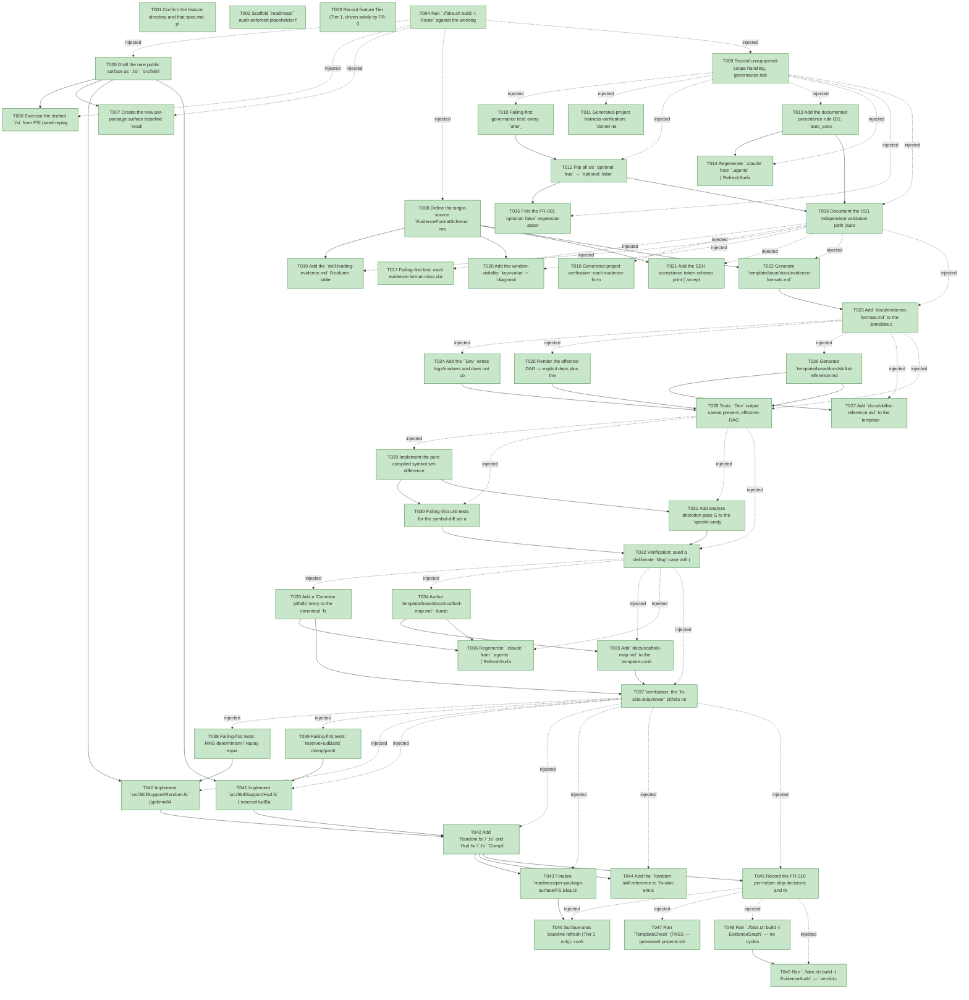

# Task Graph — 062-space-invaders-consumer-friction-followups

## ✓ Graph is acyclic and consistent

## Skill Match Assessments

| Task | Candidate | Confidence | Signals | Reviewer disposition | Diagnostic |
|------|-----------|------------|---------|----------------------|------------|
| T001 | (none) | none |  | accepted-empty | T001: skillist trusted as declared; no owns-based capability requirement |
| T002 | (none) | none |  | accepted-empty | T002: skillist trusted as declared; no owns-based capability requirement |
| T003 | (none) | none |  | accepted-empty | T003: skillist trusted as declared; no owns-based capability requirement |
| T004 | (none) | none |  | accepted-empty | T004: skillist trusted as declared; no owns-based capability requirement |
| T005 | (none) | none |  | accepted-empty | T005: skillist trusted as declared; no owns-based capability requirement |
| T006 | (none) | none |  | accepted-empty | T006: skillist trusted as declared; no owns-based capability requirement |
| T007 | (none) | none |  | accepted-empty | T007: skillist trusted as declared; no owns-based capability requirement |
| T008 | (none) | none |  | declared | T008: skillist trusted as declared; no owns-based capability requirement |
| T009 | (none) | none |  | accepted-empty | T009: skillist trusted as declared; no owns-based capability requirement |
| T010 | (none) | none |  | declared | T010: skillist trusted as declared; no owns-based capability requirement |
| T011 | (none) | none |  | declared | T011: skillist trusted as declared; no owns-based capability requirement |
| T012 | (none) | none |  | accepted-empty | T012: skillist trusted as declared; no owns-based capability requirement |
| T013 | (none) | none |  | accepted-empty | T013: skillist trusted as declared; no owns-based capability requirement |
| T014 | (none) | none |  | declared | T014: skillist trusted as declared; no owns-based capability requirement |
| T015 | (none) | none |  | accepted-empty | T015: skillist trusted as declared; no owns-based capability requirement |
| T016 | (none) | none |  | accepted-empty | T016: skillist trusted as declared; no owns-based capability requirement |
| T017 | (none) | none |  | declared | T017: skillist trusted as declared; no owns-based capability requirement |
| T018 | (none) | none |  | declared | T018: skillist trusted as declared; no owns-based capability requirement |
| T019 | (none) | none |  | declared | T019: skillist trusted as declared; no owns-based capability requirement |
| T020 | (none) | none |  | declared | T020: skillist trusted as declared; no owns-based capability requirement |
| T021 | (none) | none |  | declared | T021: skillist trusted as declared; no owns-based capability requirement |
| T022 | (none) | none |  | declared | T022: skillist trusted as declared; no owns-based capability requirement |
| T023 | (none) | none |  | accepted-empty | T023: skillist trusted as declared; no owns-based capability requirement |
| T024 | (none) | none |  | declared | T024: skillist trusted as declared; no owns-based capability requirement |
| T025 | (none) | none |  | declared | T025: skillist trusted as declared; no owns-based capability requirement |
| T026 | (none) | none |  | declared | T026: skillist trusted as declared; no owns-based capability requirement |
| T027 | (none) | none |  | accepted-empty | T027: skillist trusted as declared; no owns-based capability requirement |
| T028 | (none) | none |  | declared | T028: skillist trusted as declared; no owns-based capability requirement |
| T029 | (none) | none |  | declared | T029: skillist trusted as declared; no owns-based capability requirement |
| T030 | (none) | none |  | declared | T030: skillist trusted as declared; no owns-based capability requirement |
| T031 | (none) | none |  | declared | T031: skillist trusted as declared; no owns-based capability requirement |
| T032 | (none) | none |  | declared | T032: skillist trusted as declared; no owns-based capability requirement |
| T033 | (none) | none |  | declared | T033: skillist trusted as declared; no owns-based capability requirement |
| T034 | (none) | none |  | declared | T034: skillist trusted as declared; no owns-based capability requirement |
| T035 | (none) | none |  | accepted-empty | T035: skillist trusted as declared; no owns-based capability requirement |
| T036 | (none) | none |  | declared | T036: skillist trusted as declared; no owns-based capability requirement |
| T037 | (none) | none |  | accepted-empty | T037: skillist trusted as declared; no owns-based capability requirement |
| T038 | (none) | none |  | declared | T038: skillist trusted as declared; no owns-based capability requirement |
| T039 | (none) | none |  | declared | T039: skillist trusted as declared; no owns-based capability requirement |
| T040 | (none) | none |  | declared | T040: skillist trusted as declared; no owns-based capability requirement |
| T041 | (none) | none |  | declared | T041: skillist trusted as declared; no owns-based capability requirement |
| T042 | (none) | none |  | accepted-empty | T042: skillist trusted as declared; no owns-based capability requirement |
| T043 | (none) | none |  | declared | T043: skillist trusted as declared; no owns-based capability requirement |
| T044 | (none) | none |  | declared | T044: skillist trusted as declared; no owns-based capability requirement |
| T045 | (none) | none |  | accepted-empty | T045: skillist trusted as declared; no owns-based capability requirement |
| T046 | (none) | none |  | accepted-empty | T046: skillist trusted as declared; no owns-based capability requirement |
| T047 | (none) | none |  | declared | T047: skillist trusted as declared; no owns-based capability requirement |
| T048 | speckit-evidence-graph | high | owns:graph-validation | accepted | T048: owns graph-validation requires skill speckit-evidence-graph; trigger_group=owns; matched_trigger=owns:graph-validation |
| T049 | speckit-evidence-audit | high | owns:evidence-audit | accepted | T049: owns evidence-audit requires skill speckit-evidence-audit; trigger_group=owns; matched_trigger=owns:evidence-audit |

## Status counts (effective)

| Status | Count |
|--------|-------|
| [X] done | 49 |
| [S] synthetic | 0 |
| [S*] auto-synthetic | 0 |
| accepted [SEH] synthetic | 0 |
| unaccepted synthetic | 0 |

## Graph



## ASCII view

```
T001 [X] Confirm the feature directory and that spec.md, plan.md, research.md, data-model.md, contracts/, and quickstart.md are linked and current
T002 [X] Scaffold `readiness/` audit-enforced placeholder files discoverable before implementation: `target-metadata.md`, `agent-ready-verdict.md`, `skill-loading-evidence.md`, `aggregate-hang-diagnostics.md`, `governance-risk-levels.md`, `runtime-limitations.md`, `readiness-recoverability.md`
T003 [X] Record feature Tier (Tier 1, driven solely by FR-010), affected layers, public-API impact, Elmish/MVU applicability (N/A), and required evidence obligations to `readiness/agent-ready-verdict.md`
T004 [X] Run `./fake.sh build -t Route` against the working-tree diff and record the authoritative tier + minimal gate list to `readiness/target-metadata.md`
T005 [X] Draft the new public surface as `.fsi`: `src/SkillSupport/Random.fsi` (`RngState`, `seedRng`/`nextRng`/`nextBelow`) and `src/SkillSupport/Hud.fsi` (`BandEdge`, `Band`, `HudLayout`, `reserveHudBand`) per `contracts/skillsupport-api.md`
T006 [X] Exercise the drafted `.fsi` from FSI (seed-replay equality, `reserveHudBand` clamp/partition) and capture the session transcript to `readiness/fsi-session.txt`
T007 [X] Create the new per-package surface baseline `readiness/per-package-surface/FS.Skia.UI.SkillSupport.fsi.txt` from the drafted `.fsi` (authoritative `PerPackageSurfaceDiff` baseline; the reflected type-name `surface-baselines/` set does not include SkillSupport)
T008 [X] Define the single-source `EvidenceFormatSchema` model/constants in `build/Governance/**` that both the FR-005 failing-class diagnostics and the generated `evidence-formats.md` derive from (so they cannot drift)
T009 [X] Record unsupported-scope handling, governance risk levels, and aggregate-hang diagnostics into `readiness/runtime-limitations.md` and `readiness/governance-risk-levels.md`
T010 [X] Failing-first governance test: every `after_<phase>` entry in `template/feedback/extensions/feedback.yml` registers `optional: false` (SC-001 regression guard)
T011 [X] Generated-project harness verification: `dotnet new fs-skia-ui --feedback true`, confirm `.specify/extensions/feedback/feedback.yml` is `optional: false` and a completed phase auto-writes `specs/<feature>/feedback/<phase>-<date>.md` with no manual trigger (SC-001). Verified end-to-end against a real generated project (`SI062Probe`, template packed from current source): 6 `optional: false`, 0 `optional: true`; the precedence rule + effective-hooks notice ship in the generated phase skills.
T012 [X] Flip all six `optional: true` → `optional: false` (`after_specify/clarify/plan/tasks/analyze/implement`) in `template/feedback/extensions/feedback.yml` (FR-001)
T013 [X] Add the documented precedence rule (D1: `auto_execute_hooks` scopes the mandatory set; optionals always surfaced; `condition`-guarded deferred to executor) and the consolidated effective-hooks notice (D2, deduped by `(extension, command)`) to the phase skills that have a hook step (`speckit-{specify,clarify,plan,analyze,checklist}`; `tasks`/`implement` have no hook step, per 061) (FR-001/002)
T014 [X] Regenerate `.claude` from `.agents` (`RefreshSurfaceBaselines`) and confirm `SkillSyncCheck`/`TargetMetadataDrift`/`SkillQualityCheck` stay green (FR-012)
T015 [X] Fold the FR-001 `optional: false` regression assertion into `GeneratedGuidanceCheck` (`Guidance.validateFeedbackHookPolicy`, unit-tested) (low-cost executable check, D12)
T016 [X] Document the US1 independent validation path (auto-fire feedback + precedence/effective-hooks notice) and capture it under `readiness/feedback-hook-policy.md`
T017 [X] Failing-first test: each evidence-format-class diagnostic prints its complete per-file schema (skill-loading-evidence 8-column table, window-visibility keys + `diagnostic-class` rows, SEH acceptance tokens) (SC-002)
T018 [X] Generated-project verification: each evidence-format class is recoverable from the diagnostics and/or generated `docs/evidence-formats.md` — no `strings -el`, no sibling copy; logged to `readiness/readiness-recoverability.md` (SC-002). The real generated project ships `docs/evidence-formats.md` with all four classes (up-front recovery), and the per-class on-failure diagnostics are single-sourced + unit-proven.
T019 [X] Add the `skill-loading-evidence.md` 8-column table schema print (one row per `(task,skill)`, `loaded_at < work_started_at`, resolved `.agents/skills/<id>/SKILL.md` path) to `build/Governance/Evidence/Audit.fs` (FR-005)
T020 [X] Add the window-visibility `key=value` + `diagnostic-class=` value-row schema print to `build/Governance/Evidence/Scans.fs` (FR-005)
T021 [X] Add the SEH acceptance token schema print (`accepted-seh`, `synthetic-error-handling-approved`, no backticks) to `build/Governance/Evidence/TaskParser.fs` (FR-005)
T022 [X] Generate `template/base/docs/evidence-formats.md` from the shared `EvidenceFormatSchema` constants and add its currency check (FR-005, D5)
T023 [X] Add `docs/evidence-formats.md` to the `.template.config/template.json` content map (verbatim/copyOnly, no `sourceName` substitution)
T024 [X] Add the "`Dev` writes logs/markers and does not compile; `Test`/`Verify` (`dotnet test`) is authoritative" line to `Dev`'s own emitted output and `dev-verdict.txt` in `build/Governance/Engine/Update.fs` (FR-004, SC-004)
T025 [X] Render the effective DAG — explicit deps plus the auto-injected Phase N+1 → Phase N checkpoint edges, distinctly labeled — and the resolved `skillist`-id set in `build/Governance/Evidence/Render.fs` (FR-007, SC-004)
T026 [X] Generate `template/base/docs/skillist-reference.md` from the live `SkillRegistry` (directory-name-vs-`name:` resolved + closed `owns:`→implied-skill table) with a currency check (FR-006, SC-004)
T027 [X] Add `docs/skillist-reference.md` to the `.template.config/template.json` content map
T028 [X] Tests: `Dev` output caveat present; effective-DAG render shows injected edges + resolved skillist set; `skillist-reference.md` currency holds (SC-004)
T029 [X] Implement the pure compiled symbol set-difference helper (extract `Msg` cases, union/`Screen` variants, entity record names, FR-/SC- IDs from `plan.md`/`data-model.md`/`tasks.md`; report proper-subset differences) (FR-008, D8)
T030 [X] Failing-first unit tests for the symbol-diff set algebra: proper-subset detection flagged; intentionally design-only symbol reported for human judgment, never hard-failed (SC-005)
T031 [X] Add analyze detection pass G to the `speckit-analyze` skill that runs/interprets the symbol-diff and reports set-differences as findings (FR-008)
T032 [X] Verification: seed a deliberate `Msg`-case drift (present in `data-model.md`/`tasks.md` but not `plan.md`) and confirm pass G reports the set-difference (SC-005)
T033 [X] Add a "Common pitfalls" entry to the canonical `fs-skia-skiaviewer` skill: `open FS.Skia.UI.SkiaViewer` brings `ViewerDiagnosticLevel.Error` (and peers) into scope so bare `Ok`/`Error` bind to the union case — remedy: qualify as `Result.Ok`/`Result.Error`; cross-reference the existing `Unknown` note (FR-009, D9). Also added the companion `fs-skia-scene` record-label-collision Common-pitfalls note so the T034 pre-design pointer is non-dangling (SI-9 "already covered" assumption was not yet true in the skill).
T034 [X] Author `template/base/docs/scaffold-map.md`: durable vs replaceable `src/**/*.fs`, the `GovernanceTests`-durable / `BehaviorTests`-replaceable split, the must-survive source-scan strings, and a pre-design pointer to the `fs-skia-scene` record-label-collision pitfall (FR-003, folds SI-9, D3)
T035 [X] Add `docs/scaffold-map.md` to the `.template.config/template.json` content map and add the one-line cross-reference from `fs-skia-layout-readability` so the map is reachable from an already-loaded skill
T036 [X] Regenerate `.claude` from `.agents` (`RefreshSurfaceBaselines`) and confirm `SkillSyncCheck`/`SkillQualityCheck` green after the FR-009/003 skill edits (FR-012) — done via the single post-T044 RefreshSurfaceBaselines; SkillSyncCheck/SkillQualityCheck/TargetMetadataDrift all green
T037 [X] Verification: the `fs-skia-skiaviewer` pitfalls note covers the `Result.Ok`/`Result.Error` case, and `scaffold-map.md` references the `fs-skia-scene` record-label pitfall as a pre-design step (SC-003)
T038 [X] Failing-first tests: RNG determinism / replay equality (same seed + sequence ⇒ identical stream) and `nextBelow n` bounds in `[0, n)` for `n > 0` (SC-006)
T039 [X] Failing-first tests: `reserveHudBand` clamp/partition invariants — `HudBand.Size = min bandSize surface`, `Gameplay.Size = surface − HudBand.Size ≥ 0`, non-overlapping partition (SC-006)
T040 [X] Implement `src/SkillSupport/Random.fs` (splitmix64 seed → xorshift64 stream, pure `state -> (value, nextState)` threading, no ambient `System.Random`) against the drafted `.fsi` (FR-010)
T041 [X] Implement `src/SkillSupport/Hud.fs` (`reserveHudBand` plain-`float` API, no `Scene.Rect` dependency) against the drafted `.fsi` (FR-010)
T042 [X] Add `Random.fsi`/`.fs` and `Hud.fsi`/`.fs` `Compile` entries (`.fsi` before `.fs`) to `src/SkillSupport/SkillSupport.fsproj` (FR-010)
T043 [X] Finalize `readiness/per-package-surface/FS.Skia.UI.SkillSupport.fsi.txt` against the built `.fsi` and confirm `PackageSurfaceCheck`/`PerPackageSurfaceDiff` (FR-012, Principle II)
T044 [X] Add the `Random` skill reference to `fs-skia-elmish` (pure-`update` threading owner) and the `Hud` reference to `fs-skia-layout-readability` (HUD/gameplay-region owner), then regenerate `.claude` (FR-010/011-#2, D11)
T045 [X] Record the FR-010 per-helper ship decisions and the FR-011 five-candidate dispositions (ship / fold / defer-with-rationale per D10/D11) so no candidate is silently dropped (SC-006)
T046 [X] Surface-area baseline refresh (Tier 1 only): confirmed `RefreshSurfaceBaselines` leaves the surface baselines and `.claude` tree clean (`PerPackageSurfaceDiff` zero-drift, `SkillSyncCheck` green, `TargetMetadataDrift` green)
T047 [X] Ran `TemplateCheck` (PASS — generated projects ship evidence-formats / skillist-reference / scaffold-map + flipped feedback.yml) + `GeneratedProductCheck` (EXPECTED-FAIL non-regression: feature-less scaffold has no `feature_directory`; aggregate is non-authoritative, the authoritative verdict is `EvidenceAudit verdict=PASS`); non-authoritative aggregate notes recorded in `readiness/target-metadata.md` (Dev regenerates the generic `aggregate-hang-diagnostics.md`)
T048 [X] Ran `./fake.sh build -t EvidenceGraph` — no cycles, no dangling refs, no `[S*]`; the effective-DAG render (injected edges + resolved skillist set) is in `readiness/task-graph.md`
T049 [X] Ran `./fake.sh build -t EvidenceAudit` — `verdict=PASS` (43 real tasks, 0 blockers) for `specs/062-space-invaders-consumer-friction-followups` (SC-007)
```

## Injected checkpoint edges (Phase N+1 → Phase N) — FR-007

- T004 → T005  (auto-injected Phase-checkpoint edge)
- T004 → T006  (auto-injected Phase-checkpoint edge)
- T004 → T007  (auto-injected Phase-checkpoint edge)
- T004 → T008  (auto-injected Phase-checkpoint edge)
- T004 → T009  (auto-injected Phase-checkpoint edge)
- T009 → T010  (auto-injected Phase-checkpoint edge)
- T009 → T011  (auto-injected Phase-checkpoint edge)
- T009 → T012  (auto-injected Phase-checkpoint edge)
- T009 → T013  (auto-injected Phase-checkpoint edge)
- T009 → T014  (auto-injected Phase-checkpoint edge)
- T009 → T015  (auto-injected Phase-checkpoint edge)
- T009 → T016  (auto-injected Phase-checkpoint edge)
- T016 → T017  (auto-injected Phase-checkpoint edge)
- T016 → T018  (auto-injected Phase-checkpoint edge)
- T016 → T019  (auto-injected Phase-checkpoint edge)
- T016 → T020  (auto-injected Phase-checkpoint edge)
- T016 → T021  (auto-injected Phase-checkpoint edge)
- T016 → T022  (auto-injected Phase-checkpoint edge)
- T016 → T023  (auto-injected Phase-checkpoint edge)
- T023 → T024  (auto-injected Phase-checkpoint edge)
- T023 → T025  (auto-injected Phase-checkpoint edge)
- T023 → T026  (auto-injected Phase-checkpoint edge)
- T023 → T027  (auto-injected Phase-checkpoint edge)
- T023 → T028  (auto-injected Phase-checkpoint edge)
- T028 → T029  (auto-injected Phase-checkpoint edge)
- T028 → T030  (auto-injected Phase-checkpoint edge)
- T028 → T031  (auto-injected Phase-checkpoint edge)
- T028 → T032  (auto-injected Phase-checkpoint edge)
- T032 → T033  (auto-injected Phase-checkpoint edge)
- T032 → T034  (auto-injected Phase-checkpoint edge)
- T032 → T035  (auto-injected Phase-checkpoint edge)
- T032 → T036  (auto-injected Phase-checkpoint edge)
- T032 → T037  (auto-injected Phase-checkpoint edge)
- T037 → T038  (auto-injected Phase-checkpoint edge)
- T037 → T039  (auto-injected Phase-checkpoint edge)
- T037 → T040  (auto-injected Phase-checkpoint edge)
- T037 → T041  (auto-injected Phase-checkpoint edge)
- T037 → T042  (auto-injected Phase-checkpoint edge)
- T037 → T043  (auto-injected Phase-checkpoint edge)
- T037 → T044  (auto-injected Phase-checkpoint edge)
- T037 → T045  (auto-injected Phase-checkpoint edge)
- T045 → T046  (auto-injected Phase-checkpoint edge)
- T045 → T047  (auto-injected Phase-checkpoint edge)
- T045 → T048  (auto-injected Phase-checkpoint edge)
- T045 → T049  (auto-injected Phase-checkpoint edge)

## Resolved skillist ids — FR-007

Resolved skillist-id set (11): fs-skia-elmish, fs-skia-layout-readability, fs-skia-skiaviewer, fs-skia-template-update, fsharp-build-orchestration, fsharp-code-generation, fsharp-graph-algorithms, fsharp-parsing, speckit-analyze, speckit-evidence-audit, speckit-evidence-graph

