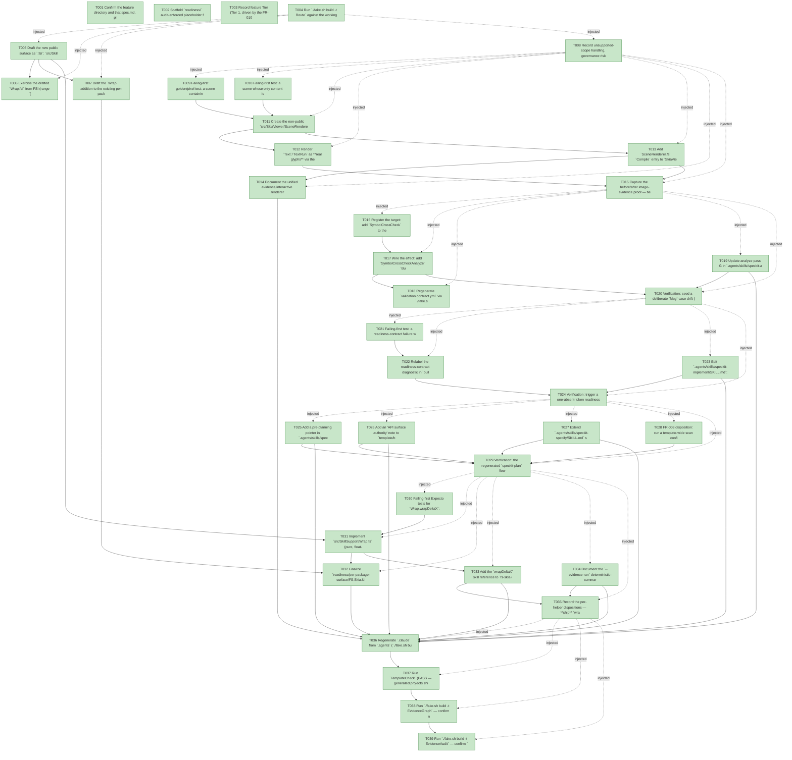

# Task Graph — 063-lunar-lander-consumer-friction-followups

## ✓ Graph is acyclic and consistent

## Skill Match Assessments

| Task | Candidate | Confidence | Signals | Reviewer disposition | Diagnostic |
|------|-----------|------------|---------|----------------------|------------|
| T001 | (none) | none |  | accepted-empty | T001: skillist trusted as declared; no owns-based capability requirement |
| T002 | (none) | none |  | accepted-empty | T002: skillist trusted as declared; no owns-based capability requirement |
| T003 | (none) | none |  | accepted-empty | T003: skillist trusted as declared; no owns-based capability requirement |
| T004 | (none) | none |  | accepted-empty | T004: skillist trusted as declared; no owns-based capability requirement |
| T005 | (none) | none |  | accepted-empty | T005: skillist trusted as declared; no owns-based capability requirement |
| T006 | (none) | none |  | accepted-empty | T006: skillist trusted as declared; no owns-based capability requirement |
| T007 | (none) | none |  | accepted-empty | T007: skillist trusted as declared; no owns-based capability requirement |
| T008 | (none) | none |  | accepted-empty | T008: skillist trusted as declared; no owns-based capability requirement |
| T009 | (none) | none |  | declared | T009: skillist trusted as declared; no owns-based capability requirement |
| T010 | (none) | none |  | declared | T010: skillist trusted as declared; no owns-based capability requirement |
| T011 | (none) | none |  | declared | T011: skillist trusted as declared; no owns-based capability requirement |
| T012 | (none) | none |  | declared | T012: skillist trusted as declared; no owns-based capability requirement |
| T013 | (none) | none |  | declared | T013: skillist trusted as declared; no owns-based capability requirement |
| T014 | (none) | none |  | declared | T014: skillist trusted as declared; no owns-based capability requirement |
| T015 | (none) | none |  | declared | T015: skillist trusted as declared; no owns-based capability requirement |
| T016 | (none) | none |  | declared | T016: skillist trusted as declared; no owns-based capability requirement |
| T017 | (none) | none |  | declared | T017: skillist trusted as declared; no owns-based capability requirement |
| T018 | (none) | none |  | declared | T018: skillist trusted as declared; no owns-based capability requirement |
| T019 | (none) | none |  | declared | T019: skillist trusted as declared; no owns-based capability requirement |
| T020 | (none) | none |  | declared | T020: skillist trusted as declared; no owns-based capability requirement |
| T021 | (none) | none |  | declared | T021: skillist trusted as declared; no owns-based capability requirement |
| T022 | (none) | none |  | declared | T022: skillist trusted as declared; no owns-based capability requirement |
| T023 | (none) | none |  | declared | T023: skillist trusted as declared; no owns-based capability requirement |
| T024 | (none) | none |  | accepted-empty | T024: skillist trusted as declared; no owns-based capability requirement |
| T025 | (none) | none |  | declared | T025: skillist trusted as declared; no owns-based capability requirement |
| T026 | (none) | none |  | declared | T026: skillist trusted as declared; no owns-based capability requirement |
| T027 | (none) | none |  | declared | T027: skillist trusted as declared; no owns-based capability requirement |
| T028 | (none) | none |  | declared | T028: skillist trusted as declared; no owns-based capability requirement |
| T029 | (none) | none |  | accepted-empty | T029: skillist trusted as declared; no owns-based capability requirement |
| T030 | (none) | none |  | declared | T030: skillist trusted as declared; no owns-based capability requirement |
| T031 | (none) | none |  | declared | T031: skillist trusted as declared; no owns-based capability requirement |
| T032 | (none) | none |  | declared | T032: skillist trusted as declared; no owns-based capability requirement |
| T033 | (none) | none |  | declared | T033: skillist trusted as declared; no owns-based capability requirement |
| T034 | (none) | none |  | declared | T034: skillist trusted as declared; no owns-based capability requirement |
| T035 | (none) | none |  | accepted-empty | T035: skillist trusted as declared; no owns-based capability requirement |
| T036 | (none) | none |  | declared | T036: skillist trusted as declared; no owns-based capability requirement |
| T037 | (none) | none |  | declared | T037: skillist trusted as declared; no owns-based capability requirement |
| T038 | speckit-evidence-graph | high | owns:graph-validation | accepted | T038: owns graph-validation requires skill speckit-evidence-graph; trigger_group=owns; matched_trigger=owns:graph-validation |
| T039 | speckit-evidence-audit | high | owns:evidence-audit | accepted | T039: owns evidence-audit requires skill speckit-evidence-audit; trigger_group=owns; matched_trigger=owns:evidence-audit |

## Status counts (effective)

| Status | Count |
|--------|-------|
| [X] done | 39 |
| [S] synthetic | 0 |
| [S*] auto-synthetic | 0 |
| accepted [SEH] synthetic | 0 |
| unaccepted synthetic | 0 |

## Graph



## ASCII view

```
T001 [X] Confirm the feature directory and that spec.md, plan.md, research.md, data-model.md, contracts/ (renderer-parity, symbol-crosscheck-target, skillsupport-wrap-api, authoring-and-skill-edits), and quickstart.md are linked and current
T002 [X] Scaffold `readiness/` audit-enforced placeholder files discoverable before implementation: `target-metadata.md`, `agent-ready-verdict.md`, `skill-loading-evidence.md`, `aggregate-hang-diagnostics.md`, `governance-risk-levels.md`, `runtime-limitations.md`, `renderer-image-evidence.md`, `symbol-cross-check.md`, `evidence-discoverability.md`, `evidence-path-token-scan.md`, `helper-dispositions.md`
T003 [X] Record feature Tier (Tier 1, driven by the FR-010 `Wrap` surface + FR-003 new governance target; the renderer fix is Tier-2 internal but escalates the overall change), affected layers, public-API impact, Elmish/MVU applicability (N/A), and required evidence obligations to `readiness/agent-ready-verdict.md`
T004 [X] Run `./fake.sh build -t Route` against the working-tree diff and record the authoritative tier + minimal gate list to `readiness/target-metadata.md`
T005 [X] Draft the new public surface as `.fsi`: `src/SkillSupport/Wrap.fsi` (`module Wrap` with `val wrapDeltaX: worldWidth: float -> fromX: float -> toX: float -> float`) per `contracts/skillsupport-wrap-api.md`
T006 [X] Exercise the drafted `Wrap.fsi` from FSI (range `(-w/2, w/2]`, shortest-path examples `wrapDeltaX 100 90 10 = 20` / `wrapDeltaX 100 10 90 = -20`, identity `wrapDeltaX w a a = 0`) and capture the session transcript to `readiness/fsi-session.txt`
T007 [X] Draft the `Wrap` addition to the existing per-package surface baseline `readiness/per-package-surface/FS.Skia.UI.SkillSupport.fsi.txt` (authoritative `PerPackageSurfaceDiff` baseline; finalized against the built `.fsi` in T032)
T008 [X] Record unsupported-scope handling, governance risk levels (small/medium/broad), and aggregate-hang diagnostics into `readiness/runtime-limitations.md`, `readiness/governance-risk-levels.md`, and `readiness/aggregate-hang-diagnostics.md`
T009 [X] Failing-first golden/pixel test: a scene containing `Line` + `Path` + `Text` rendered through the image-evidence path produces a decoded PNG with non-blank pixels in the expected regions (not a single 40×40 placeholder block), and `Text` produces glyph pixels (SC-001)
T010 [X] Failing-first test: a scene whose only content is a `Line` node can no longer pass a "scene is visible" check by node count alone via a placeholder substitution — node-count/`Scene.describe` is structural, the image is the visual proof (SC-002)
T011 [X] Create the non-public `src/SkiaViewer/SceneRenderer.fs` shared painter — `paintNode: SKCanvas -> SceneNode -> unit` with an **exhaustive `match` over every `SceneNode` case (no wildcard)** — and move the paint helpers (`skColor`, `configurePaint`, `toSkPath`, `drawTextWithFallback`, support fns) out of `VulkanHost` into it (FR-001, D1; SC-002 compile guard)
T012 [X] Render `Text`/`TextRun` as **real glyphs** via the moved `drawTextWithFallback` and delete the placeholder-rectangle substitution for `Text` (`SkiaViewer.fs:1796-1799`) (FR-001, D2)
T013 [X] Add `SceneRenderer.fs` `Compile` entry to `SkiaViewer.fsproj` before its consumers; retype `drawScene` (`Host/Vulkan.fs:1005-1160`) and `drawScreenshotScene` (`SkiaViewer.fs:1771-1808`) to delegate to `SceneRenderer.paintNode`; delete the catch-all placeholder wildcard at `SkiaViewer.fs:1804-1806`. SkiaViewer per-package surface baseline is **unchanged** (shared module is non-public) (FR-001, D1/D11)
T014 [X] Document the unified evidence/interactive renderer (one shared painter) and the render-backed primitive set in the `fs-skia-scene` skill (`src/Scene/skill/SKILL.md`), so node-count tests are understood as structural not visual proof (FR-002, D3)
T015 [X] Capture the before/after image-evidence proof — before: `Line`/`Path` render blank/placeholder and `Text` is a box; after: terrain `Line` + filled-ground `Path` + real-glyph `Text` render to pixels and node-count no longer passes on an invisible scene — to `readiness/renderer-image-evidence.md` (SC-001/SC-002)
T016 [X] Register the target: add `SymbolCrossCheck` to the `Target` DU, `allTargets`, `name`, and `directPrerequisites` in `build/Governance/Targets.fs`, and add `"SymbolCrossCheck"` to `ValidationContract.knownGates` in `build/Governance/AgentValidation.fs` (the separate allowlist — omitting it fails `Governance.Tests` with an unknown-gate diagnostic) (FR-003, D4)
T017 [X] Wire the effect: add `SymbolCrossCheckAnalyze` `BuildEffect` (`Engine/Model.fs`), `StartTarget Targets.SymbolCrossCheck` → effect + `RequireFiles` on the output (`Engine/Update.fs`), interpret it (`Engine/Interpret.fs`: resolve the feature dir, read `plan.md`/`data-model.md`/`tasks.md`, `SymbolCrossCheck.render (SymbolCrossCheck.diff …)`, print + write `readiness/symbol-cross-check.md`), and add the `focusedGateContract` case (`Front/Helpers.fs`). No new analyzer/renderer — reuse the existing `build/Governance/SymbolCrossCheck.fs` (FR-003, D4)
T018 [X] Regenerate `validation.contract.yml` via `./fake.sh build -t RefreshSurfaceBaselines` and confirm `TargetMetadataDrift` stays green and `Governance.Tests` reports no unknown-gate diagnostic (FR-011)
T019 [X] Update analyze pass G in `.agents/skills/speckit-analyze/SKILL.md` to run `./fake.sh build -t SymbolCrossCheck` (consuming the compiled output) instead of "do not eyeball it" with no invocation path (FR-003, D4)
T020 [X] Verification: seed a deliberate `Msg`-case drift (present in `data-model.md` + `tasks.md` but absent from `plan.md`), run `./fake.sh build -t SymbolCrossCheck` from a read-only checkout, and confirm the proper-subset finding prints in the documented `## Symbol consistency (analyze pass G)` format and `readiness/symbol-cross-check.md` is written; confirm a no-drift run prints a well-formed empty section — no throwaway harness (SC-003)
T021 [X] Failing-first test: a readiness-contract failure with exactly **one** absent token prints the full required set and the absent subset under **distinct** labels (`full-required-set:` vs `absent-from-file:`), so one missing token does not read as "all missing" (SC-004)
T022 [X] Relabel the readiness-contract diagnostic in `build/Governance/Evidence/Render.fs:471-480`: `required-tokens:` → `full-required-set:` and `missing:` → `absent-from-file:` (labels only — `Required = Some terms` and `MissingTerms` already exist in `Scans.fs:95-106`; no data shape change) (FR-004, D5)
T023 [X] Edit `.agents/skills/speckit-implement/SKILL.md`: add a pre-implementation pointer to read `docs/evidence-formats.md` **before** writing readiness/evidence files, and document that `skill-loading-evidence.md` is read from the **feature** readiness dir (`specs/<feature>/readiness/`, not repo-root), needs one row per (task, declared-skill) with `.agents/skills/<id>/SKILL.md` paths and `loaded_at < work_started_at`, and is **enforced only once tasks flip to `[X]`** (FR-004 / FR-005, D5)
T024 [X] Verification: trigger a one-absent-token readiness-contract failure and confirm the distinct labels print; confirm the regenerated `speckit-implement` skill body names `docs/evidence-formats.md` and the `skill-loading-evidence.md` location/timing — logged to `readiness/evidence-discoverability.md` (SC-004)
T025 [X] Add a pre-planning pointer in `.agents/skills/speckit-plan/SKILL.md` telling an author working on a generated product to read `docs/scaffold-map.md` before reconstructing the durable-vs-replaceable map by hand (FR-006, D6)
T026 [X] Add an "API surface authority" note to `template/base/docs/scaffold-map.md`: the shipped `.fsi` surfaces / `docs/api-surface/` are the **authoritative** API reference and agent-generated API summaries (e.g. Explore output) are supporting reference only, never ground truth (FR-006, D6)
T027 [X] Extend `.agents/skills/speckit-specify/SKILL.md` step 3: when the feature input is an **external URL**, after fetching snapshot the source into `specs/<feature>/source-spec.md` (record the URL in a header) and reference the in-repo snapshot; for local-file or inline input the step is an explicit no-op (FR-007, D7)
T028 [X] FR-008 disposition: run a template-wide scan confirming **no** generated artifact template seeds a divergent `evidence/` token (`.specify/templates/spec-template.md` references neither path; `tasks-template.md` uses `readiness/`; `template/base/docs/**` seeds no `specs/<feature>/evidence/`); record the consumer-authoring-only finding to `readiness/evidence-path-token-scan.md` and close with **no code change** (FR-008, D8)
T029 [X] Verification: the regenerated `speckit-plan` flow references `docs/scaffold-map.md` and the map carries the `.fsi`/`docs/api-surface`-authoritative note; specifying from a URL yields an in-repo `source-spec.md` snapshot while local input creates no redundant copy; the evidence-path token question is resolved (SC-005)
T030 [X] Failing-first Expecto tests for `Wrap.wrapDeltaX`: range `result ∈ (-worldWidth/2, worldWidth/2]` for `worldWidth > 0`, shortest-path examples (`wrapDeltaX 100 90 10 = 20`, `wrapDeltaX 100 10 90 = -20`), identity (`wrapDeltaX w a a = 0`), and symmetry (`wrapDeltaX w a b = -(wrapDeltaX w b a)` except at the `+w/2` boundary) (SC-006)
T031 [X] Implement `src/SkillSupport/Wrap.fs` (pure, float-only, no `Scene`/`Layout` dependency) against the drafted `.fsi`, and add `Wrap.fsi`/`Wrap.fs` `Compile` entries (`.fsi` before `.fs`, after `Hud`) to `src/SkillSupport/SkillSupport.fsproj` (FR-010, D10)
T032 [X] Finalize `readiness/per-package-surface/FS.Skia.UI.SkillSupport.fsi.txt` against the built `.fsi` (adds the `Wrap` module) and confirm `PackageSurfaceCheck`/`PerPackageSurfaceDiff` green (FR-011, Principle II)
T033 [X] Add the `wrapDeltaX` skill reference to `fs-skia-layout-readability` (alongside the existing `reserveHudBand` note) and document the **deferred** camera-centered projection (closure over per-game state, soft `Scene.Point` dependency, varies per game) with rationale + next-recurrence bar (FR-010, D10)
T034 [X] Document the `--evidence-run` deterministic-summary **discipline** (pure model + per-frame held-input script + `InvariantCulture`/`F3` float formatting + `determinism=byte-identical` marker) in `fs-skia-evidence-mode` with the LunarLander1 / AsteroidsDemo3 functions as canonical examples, and record the deferral rationale (field set varies per game) + next-recurrence bar (a stable cross-game field set) (FR-009, D9)
T035 [X] Record the per-helper dispositions — **ship** `wrapDeltaX`; **document** the camera projection; **document + defer** the `--evidence-run` summary pattern — each with rationale and next-recurrence bar to `readiness/helper-dispositions.md`, so no candidate is silently dropped (SC-006)
T036 [X] Regenerate `.claude` from `.agents` (`./fake.sh build -t RefreshSurfaceBaselines`) after all skill/doc edits and confirm `SkillSyncCheck`/`SkillQualityCheck`/`TargetMetadataDrift` stay green; confirm `PerPackageSurfaceDiff` zero-drift for the finalized SkillSupport baseline (FR-011)
T037 [X] Run `TemplateCheck` (PASS — generated projects ship the faithful image-evidence renderer, the regenerated phase skills + `evidence-formats`/`scaffold-map` pointers, and the `wrapDeltaX` helper) + `GeneratedProductCheck` (EXPECTED-FAIL non-regression: a feature-less scaffold has no `feature_directory`; the aggregate is non-authoritative, the authoritative verdict is `EvidenceAudit verdict=PASS`); record the non-authoritative aggregate notes in `readiness/target-metadata.md`
T038 [X] Run `./fake.sh build -t EvidenceGraph` — confirm no cycles, no dangling refs, no `[S*]`; the effective-DAG render (explicit deps + auto-injected checkpoint edges + resolved skillist set) is written to `readiness/task-graph.md`
T039 [X] Run `./fake.sh build -t EvidenceAudit` — confirm `verdict=PASS` for `specs/063-lunar-lander-consumer-friction-followups` with no `[S]`/`[S*]` and no diff-scan hits, and that all Route-printed gates pass including the new `SymbolCrossCheck` wiring and the SkillSupport surface baseline (SC-007)
```

## Injected checkpoint edges (Phase N+1 → Phase N) — FR-007

- T004 → T005  (auto-injected Phase-checkpoint edge)
- T004 → T006  (auto-injected Phase-checkpoint edge)
- T004 → T007  (auto-injected Phase-checkpoint edge)
- T004 → T008  (auto-injected Phase-checkpoint edge)
- T008 → T009  (auto-injected Phase-checkpoint edge)
- T008 → T010  (auto-injected Phase-checkpoint edge)
- T008 → T011  (auto-injected Phase-checkpoint edge)
- T008 → T012  (auto-injected Phase-checkpoint edge)
- T008 → T013  (auto-injected Phase-checkpoint edge)
- T008 → T014  (auto-injected Phase-checkpoint edge)
- T008 → T015  (auto-injected Phase-checkpoint edge)
- T015 → T016  (auto-injected Phase-checkpoint edge)
- T015 → T017  (auto-injected Phase-checkpoint edge)
- T015 → T018  (auto-injected Phase-checkpoint edge)
- T015 → T019  (auto-injected Phase-checkpoint edge)
- T015 → T020  (auto-injected Phase-checkpoint edge)
- T020 → T021  (auto-injected Phase-checkpoint edge)
- T020 → T022  (auto-injected Phase-checkpoint edge)
- T020 → T023  (auto-injected Phase-checkpoint edge)
- T020 → T024  (auto-injected Phase-checkpoint edge)
- T024 → T025  (auto-injected Phase-checkpoint edge)
- T024 → T026  (auto-injected Phase-checkpoint edge)
- T024 → T027  (auto-injected Phase-checkpoint edge)
- T024 → T028  (auto-injected Phase-checkpoint edge)
- T024 → T029  (auto-injected Phase-checkpoint edge)
- T029 → T030  (auto-injected Phase-checkpoint edge)
- T029 → T031  (auto-injected Phase-checkpoint edge)
- T029 → T032  (auto-injected Phase-checkpoint edge)
- T029 → T033  (auto-injected Phase-checkpoint edge)
- T029 → T034  (auto-injected Phase-checkpoint edge)
- T029 → T035  (auto-injected Phase-checkpoint edge)
- T035 → T036  (auto-injected Phase-checkpoint edge)
- T035 → T037  (auto-injected Phase-checkpoint edge)
- T035 → T038  (auto-injected Phase-checkpoint edge)
- T035 → T039  (auto-injected Phase-checkpoint edge)

## Resolved skillist ids — FR-007

Resolved skillist-id set (14): fs-skia-evidence-mode, fs-skia-layout-readability, fs-skia-scene, fs-skia-skiaviewer, fs-skia-template-update, fsharp-build-orchestration, fsharp-io-globbing, fsharp-parsing, speckit-analyze, speckit-evidence-audit, speckit-evidence-graph, speckit-implement, speckit-plan, speckit-specify

