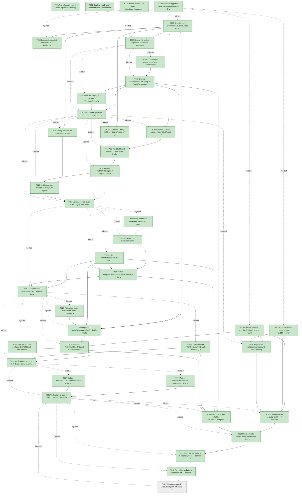

# Task Graph — 064-publish-nuget-distribution

## ✓ Graph is acyclic and consistent

## Skill Match Assessments

| Task | Candidate | Confidence | Signals | Reviewer disposition | Diagnostic |
|------|-----------|------------|---------|----------------------|------------|
| T001 | (none) | none |  | accepted-empty | T001: skillist trusted as declared; no owns-based capability requirement |
| T002 | (none) | none |  | accepted-empty | T002: skillist trusted as declared; no owns-based capability requirement |
| T003 | (none) | none |  | accepted-empty | T003: skillist trusted as declared; no owns-based capability requirement |
| T004 | (none) | none |  | accepted-empty | T004: skillist trusted as declared; no owns-based capability requirement |
| T005 | (none) | none |  | accepted-empty | T005: skillist trusted as declared; no owns-based capability requirement |
| T006 | (none) | none |  | declared | T006: skillist trusted as declared; no owns-based capability requirement |
| T007 | (none) | none |  | declared | T007: skillist trusted as declared; no owns-based capability requirement |
| T008 | (none) | none |  | accepted-empty | T008: skillist trusted as declared; no owns-based capability requirement |
| T009 | (none) | none |  | accepted-empty | T009: skillist trusted as declared; no owns-based capability requirement |
| T010 | (none) | none |  | accepted-empty | T010: skillist trusted as declared; no owns-based capability requirement |
| T011 | (none) | none |  | declared | T011: skillist trusted as declared; no owns-based capability requirement |
| T012 | (none) | none |  | declared | T012: skillist trusted as declared; no owns-based capability requirement |
| T013 | (none) | none |  | declared | T013: skillist trusted as declared; no owns-based capability requirement |
| T014 | (none) | none |  | declared | T014: skillist trusted as declared; no owns-based capability requirement |
| T015 | (none) | none |  | declared | T015: skillist trusted as declared; no owns-based capability requirement |
| T016 | (none) | none |  | accepted-empty | T016: skillist trusted as declared; no owns-based capability requirement |
| T017 | (none) | none |  | accepted-empty | T017: skillist trusted as declared; no owns-based capability requirement |
| T018 | (none) | none |  | declared | T018: skillist trusted as declared; no owns-based capability requirement |
| T019 | (none) | none |  | declared | T019: skillist trusted as declared; no owns-based capability requirement |
| T020 | (none) | none |  | declared | T020: skillist trusted as declared; no owns-based capability requirement |
| T021 | (none) | none |  | declared | T021: skillist trusted as declared; no owns-based capability requirement |
| T022 | (none) | none |  | declared | T022: skillist trusted as declared; no owns-based capability requirement |
| T023 | (none) | none |  | declared | T023: skillist trusted as declared; no owns-based capability requirement |
| T024 | (none) | none |  | declared | T024: skillist trusted as declared; no owns-based capability requirement |
| T025 | (none) | none |  | accepted-empty | T025: skillist trusted as declared; no owns-based capability requirement |
| T026 | (none) | none |  | declared | T026: skillist trusted as declared; no owns-based capability requirement |
| T027 | (none) | none |  | declared | T027: skillist trusted as declared; no owns-based capability requirement |
| T028 | (none) | none |  | declared | T028: skillist trusted as declared; no owns-based capability requirement |
| T029 | (none) | none |  | declared | T029: skillist trusted as declared; no owns-based capability requirement |
| T030 | (none) | none |  | declared | T030: skillist trusted as declared; no owns-based capability requirement |
| T031 | (none) | none |  | declared | T031: skillist trusted as declared; no owns-based capability requirement |
| T032 | (none) | none |  | declared | T032: skillist trusted as declared; no owns-based capability requirement |
| T033 | (none) | none |  | accepted-empty | T033: skillist trusted as declared; no owns-based capability requirement |
| T034 | (none) | none |  | accepted-empty | T034: skillist trusted as declared; no owns-based capability requirement |
| T035 | (none) | none |  | accepted-empty | T035: skillist trusted as declared; no owns-based capability requirement |
| T036 | (none) | none |  | declared | T036: skillist trusted as declared; no owns-based capability requirement |
| T037 | (none) | none |  | declared | T037: skillist trusted as declared; no owns-based capability requirement |
| T038 | (none) | none |  | declared | T038: skillist trusted as declared; no owns-based capability requirement |
| T039 | speckit-evidence-graph | high | owns:graph-validation | accepted | T039: owns graph-validation requires skill speckit-evidence-graph; trigger_group=owns; matched_trigger=owns:graph-validation |
| T040 | speckit-evidence-audit | high | owns:evidence-audit | accepted | T040: owns evidence-audit requires skill speckit-evidence-audit; trigger_group=owns; matched_trigger=owns:evidence-audit |
| T041 | (none) | none |  | declared | T041: skillist trusted as declared; no owns-based capability requirement |

## Status counts (effective)

| Status | Count |
|--------|-------|
| [ ] pending | 1 |
| [X] done | 40 |
| [S] synthetic | 0 |
| [S*] auto-synthetic | 0 |
| accepted [SEH] synthetic | 0 |
| unaccepted synthetic | 0 |

## Graph



## ASCII view

```
T001 [X] Run `./fake.sh build -t Route` against the working-tree diff and record the authoritative tier + minimal gate list to `readiness/target-metadata.md`
T002 [X] Scaffold `readiness/` audit-enforced placeholder files discoverable before implementation: `target-metadata.md`, `agent-ready-verdict.md`, `skill-loading-evidence.md`, `aggregate-hang-diagnostics.md`, `governance-risk-levels.md`, `runtime-limitations.md`, `fresh-consumer-restore.md`, `publish-dry-run.md`, `publish-idempotency.md`, `single-edit-upgrade.md`, `prepublish-check.md`, `validation-contract.md`, `production-publish.md`, `evidence-graph.md`, `evidence-audit.md` (no visual-demo scaffolds — this feature has no rendering/window-visibility surface)
T003 [X] Record feature Tier (Tier 1 distribution/consumer-contract change), affected layers (`build/Governance/**`, `template/base/**`, `src/*/*.fsproj`, docs), public-API impact (no runtime `.fsi`; distribution contract only), Elmish/MVU applicability (build front-end MVU — publish effects), and required evidence obligations to `readiness/agent-ready-verdict.md`
T004 [X] Record unsupported scope (private-feed Option 2, bespoke upgrade tool, floating ranges, `.snupkg`), the small/medium/broad governance risk levels, and aggregate-hang diagnostics into `readiness/runtime-limitations.md`, `readiness/governance-risk-levels.md`, and `readiness/aggregate-hang-diagnostics.md`
T005 [X] Draft the new governance public surface as `.fsi`: `build/Governance/PrePublish.fsi` (`PrePublishFinding` { Package; Field; Rule; Detail }, the four-rule `check` surface) and the publish additions to `Engine/Model.fsi` / `Update.fsi` / `Interpret.fsi` (`PublishConfig` fields, `PublishPlanRow`, `PublishPackages` / `PrePublishValidate` effect cases) — no runtime framework `.fsi` change
T006 [X] Register `Publish` and `PrePublishCheck` in `build/Governance/Targets.fs` (DU + `name` + `directPrerequisites` + `allTargets`; bump the registry-count comment near `Targets.fs:58` and any `TargetMetadata`/count test by **+2** — verify the exact current count from `Targets.fs`) and add both to the `knownGates` allowlist in `AgentValidation.fs`
T007 [X] Add a distribution routing rule to `build/Governance/Routing.fs` classifying the publish/pre-publish targets plus `template/base/build.fsx` + `Directory.Packages.props` changes (escalated tier)
T008 [X] Exercise the drafted `PrePublish.fsi` + `PublishConfig`/`PublishPlanRow` types from FSI and capture the session transcript to `readiness/fsi-session.txt`
T009 [X] Record the surface disposition — the new governance `.fsi` files are internal to `FS.Skia.UI.Build` (not packed), so `PerPackageSurfaceDiff`/`PackageSurfaceCheck` baselines are unaffected; note this in `readiness/target-metadata.md`
T010 [X] Add a failing-first Governance.Tests assertion that the consumer `NuGet.config` emitted by `writeLocalNuGetConfig` contains **no** absolute local feed path (`/home/.../nuget-local`) and references the public feed only (SC-001)
T011 [X] Change `writeLocalNuGetConfig` in `build/Governance/GeneratedProduct.fs:1372` to emit a **public-feed-only** consumer `NuGet.config` (drop the machine-absolute `local` source); keep the in-repo dev loop's local feed separate
T012 [X] Add the staging-feed overlay so `TemplateCheck`'s in-repo restore still resolves `FS.Skia.UI.*` from `~/.local/share/nuget-local` even though the emitted consumer config no longer carries that path
T013 [X] Verification: generate the `app` and `governed` profiles, run `dotnet restore`/`build`/`test` from the throwaway local-directory **staging** feed with **no** machine-local path present, and capture the transcript to `readiness/fresh-consumer-restore.md` (SC-001)
T014 [X] Failing-first pure-`update` test: `StartTarget Targets.Publish` emits the `PublishPackages` effect (and `PrePublishCheck` emits `PrePublishValidate`); `update` stays pure with all I/O at the interpreter edge; **and a non-dry-run with `ApiKeyPresent = false` aborts before any push, naming the missing key (data-model PublishConfig "Validation"), while dry-run needs no credential** (FR-002 / spec Edge Case "missing/invalid API key")
T015 [X] Failing-first test: the dry-run plan is exactly **12** `PublishPlanRow`s (11 libs from `packProjects` + `FS.Skia.UI.Template`) with per-package version + push/skip decision and performs no network push (SC-002)
T016 [X] Add `PublishConfig` fields to `Engine/Model.fs` (FeedUrl/ReadUrl/ApiKeyPresent/DryRun/IsLocalFeed), read from env at the interpreter edge
T017 [X] Add the `StartTarget Publish` / `StartTarget PrePublishCheck` handlers to `Engine/Update.fs` — pure `update` emitting `PublishPackages` / `PrePublishValidate` (reuse `processEffect` for pack)
T018 [X] Interpret `PublishPackages` in `Engine/Interpret.fs`: anonymous read of the target feed (nuget.org flat-container `index.json` or local-directory listing), compute skip/push per package, and run `dotnet nuget push --skip-duplicate`; a non-dry-run with no API key aborts fast pushing nothing
T019 [X] Regenerate `validation.contract.yml` from `Routing.fs` (`RefreshSurfaceBaselines`) so `Publish`/`PrePublishCheck` appear and `TargetMetadataDrift` stays green (FR-007)
T020 [X] Verification: run `Publish` in **dry-run** against the local-directory staging feed with **no** credential and capture the 12-row push/skip plan (no network push) to `readiness/publish-dry-run.md` (SC-002)
T021 [X] Verification: real push to the staging feed, then a second run **skips** all 12 (idempotent), and a partial-failure re-run pushes only the remainder — capture to `readiness/publish-idempotency.md` (SC-003)
T022 [X] Failing-first test: a generated project has exactly **one** literal `FS.Skia.UI` version value, and `build.fsx`'s engine reference resolves from `<FsSkiaUiVersion>` rather than a second literal (single-source invariant) (SC-004)
T023 [X] Introduce `<FsSkiaUiVersion>` in `template/base/Directory.Packages.props` and rewrite the 11 `<PackageVersion Include="FS.Skia.UI.*">` pins to `Version="$(FsSkiaUiVersion)"`
T024 [X] Make `template/base/build.fsx` read `<FsSkiaUiVersion>` from `Directory.Packages.props` at runtime and `#r` the resolved engine assembly path (R1 technique), dropping the literal `#r "nuget: FS.Skia.UI.Build, <ver>"` version — disclosed with a one-line comment at the use site
T025 [X] Author `template/base/docs/UPGRADING.md` — the single value to change, `dotnet restore`, how to verify, and preview-vs-stable selection (FR-005)
T026 [X] Verification: in a generated project, change the one documented version value, run `dotnet restore`, and confirm both the libraries **and** the build engine resolve at the new version with no second edit — capture to `readiness/single-edit-upgrade.md` (SC-004)
T027 [X] Failing-first tests: `PrePublishCheck` produces a finding **naming the offending package/field** for each skew class — `PinParity` (template pin ≠ shipped version), `EnginePinMatch` (build-engine pin ≠ lib version), `NoMachineLocalPath` (absolute local path in emitted config), `RequiredMetadata` (blank license/repo/authors/description/README) (SC-005)
T028 [X] Implement `build/Governance/PrePublish.fs` (the four rules over `template/base/Directory.Packages.props`, `build.fsx`, the emitted `NuGet.config`, and each packable + template `.fsproj`), each finding naming expected-vs-actual
T029 [X] Wire the `PrePublishCheck` target to compose with / extend `TemplateCheck`, aborting the publish and naming the offender on any finding
T030 [X] Add per-package `README.md` ×11 and `RepositoryUrl` / license expression / authors / description / `PackageReadmeFile` (+ tags/icon where applicable) metadata to each `src/*/<Pkg>.fsproj` (FR-010)
T031 [X] Add the template package `README.md` and required metadata to `.template.package/FS.Skia.UI.Template.fsproj` (FR-010)
T032 [X] Verification: introduce a deliberate skew, confirm `PrePublishCheck` fails naming the specific package/field, restore consistency, confirm it passes and publish cannot proceed while it fails — capture fail+pass to `readiness/prepublish-check.md` (SC-005)
T033 [X] Author `docs/distribution.md`: consumer install flow (`dotnet new install FS.Skia.UI.Template` → `dotnet new fs-skia-ui` → restore/build), the public feed + preview/stable channel, and the maintainer release+publish flow (bump → pack → pre-publish check → publish)
T034 [X] Update `docs/adr/0001-...distribution.md` to record that the publish path is now implemented, superseding the "distribution deferred" note
T035 [X] Verification: sweep in-repo docs confirming none still present distribution as deferred or local-feed-only as the consumer story; record the disposition (SC-006)
T036 [X] Regenerate the `.claude` skill tree + `validation.contract.yml` (`RefreshSurfaceBaselines`) and confirm `TargetMetadataDrift` / `SkillSyncCheck` green with the new targets; record currency to `readiness/validation-contract.md` (FR-011)
T037 [X] Bump, pack, and install the `FS.Skia.UI.Template` package so the distribution changes (public-feed config, single-source pin, `UPGRADING.md`, READMEs) reach generated consumers (FR-011)
T038 [X] Run the Route-printed gates sequentially — `Dev`, `GeneratedGuidanceCheck`, `TemplateCheck`, `GeneratedProductCheck` — and record the **non-authoritative** aggregate notes to `readiness/target-metadata.md` (the authoritative verdict is `EvidenceAudit verdict=PASS`)
T039 [X] Run `./fake.sh build -t EvidenceGraph` — confirm no cycles, no dangling refs, no `[S*]` surprises; write the effective DAG to `readiness/task-graph.md` and `readiness/evidence-graph.md`
T040 [X] Run `./fake.sh build -t EvidenceAudit` — confirm `verdict=PASS` for `specs/064-publish-nuget-distribution` with no `[S]`/`[S*]` and no diff-scan hits, and that all Route-printed gates pass; record to `readiness/evidence-audit.md` (SC-007)
T041 [ ] **Maintainer-gated** production push (FR-008): after the gate is green, the maintainer supplies the nuget.org credential and pushes the current `-preview` versions unchanged (libs `0.1.67-preview.1`, template `0.1.86-preview.1`) on the preview channel; capture the live push transcript + a fresh-consumer restore against **nuget.org** proving all 12 packages publicly resolvable to `readiness/production-publish.md` (SC-008). This task legitimately remains `[ ]` after `EvidenceAudit verdict=PASS` (T040) — the audit gates on `[S]`/`[S*]`/diff-scan, not pending maintainer steps, so a green audit is **not** by itself "feature complete" per SC-008.
```

## Injected checkpoint edges (Phase N+1 → Phase N) — FR-007

- T004 → T005  (auto-injected Phase-checkpoint edge)
- T004 → T006  (auto-injected Phase-checkpoint edge)
- T004 → T007  (auto-injected Phase-checkpoint edge)
- T004 → T008  (auto-injected Phase-checkpoint edge)
- T004 → T009  (auto-injected Phase-checkpoint edge)
- T009 → T010  (auto-injected Phase-checkpoint edge)
- T009 → T011  (auto-injected Phase-checkpoint edge)
- T009 → T012  (auto-injected Phase-checkpoint edge)
- T009 → T013  (auto-injected Phase-checkpoint edge)
- T013 → T014  (auto-injected Phase-checkpoint edge)
- T013 → T015  (auto-injected Phase-checkpoint edge)
- T013 → T016  (auto-injected Phase-checkpoint edge)
- T013 → T017  (auto-injected Phase-checkpoint edge)
- T013 → T018  (auto-injected Phase-checkpoint edge)
- T013 → T019  (auto-injected Phase-checkpoint edge)
- T013 → T020  (auto-injected Phase-checkpoint edge)
- T013 → T021  (auto-injected Phase-checkpoint edge)
- T021 → T022  (auto-injected Phase-checkpoint edge)
- T021 → T023  (auto-injected Phase-checkpoint edge)
- T021 → T024  (auto-injected Phase-checkpoint edge)
- T021 → T025  (auto-injected Phase-checkpoint edge)
- T021 → T026  (auto-injected Phase-checkpoint edge)
- T026 → T027  (auto-injected Phase-checkpoint edge)
- T026 → T028  (auto-injected Phase-checkpoint edge)
- T026 → T029  (auto-injected Phase-checkpoint edge)
- T026 → T030  (auto-injected Phase-checkpoint edge)
- T026 → T031  (auto-injected Phase-checkpoint edge)
- T026 → T032  (auto-injected Phase-checkpoint edge)
- T032 → T033  (auto-injected Phase-checkpoint edge)
- T032 → T034  (auto-injected Phase-checkpoint edge)
- T032 → T035  (auto-injected Phase-checkpoint edge)
- T035 → T036  (auto-injected Phase-checkpoint edge)
- T035 → T037  (auto-injected Phase-checkpoint edge)
- T035 → T038  (auto-injected Phase-checkpoint edge)
- T035 → T039  (auto-injected Phase-checkpoint edge)
- T035 → T040  (auto-injected Phase-checkpoint edge)
- T035 → T041  (auto-injected Phase-checkpoint edge)

## Resolved skillist ids — FR-007

Resolved skillist-id set (8): fs-skia-template-update, fsharp-build-orchestration, fsharp-code-generation, fsharp-io-globbing, fsharp-parsing, fsharp-shell-process, speckit-evidence-audit, speckit-evidence-graph

