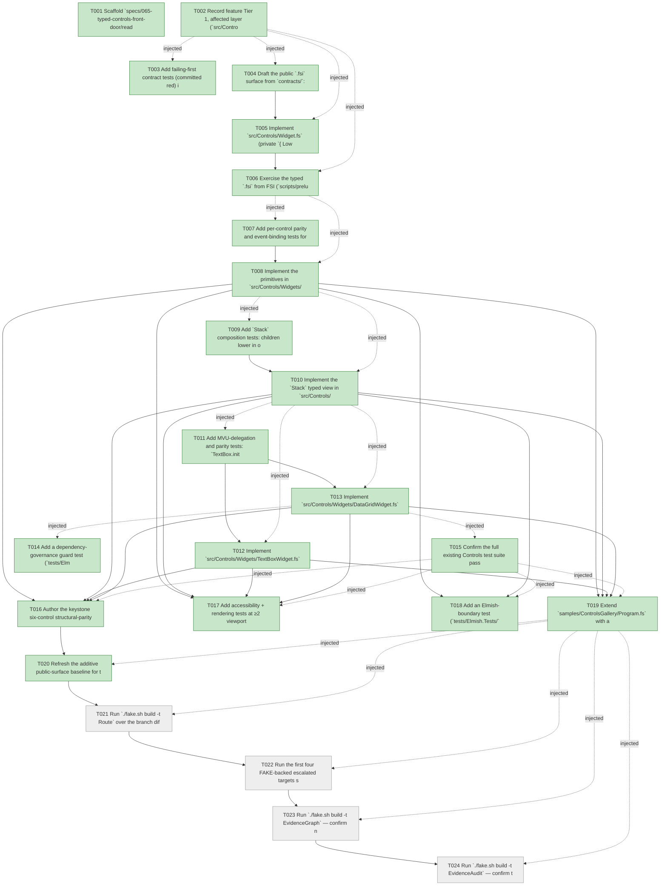

# Task Graph — 065-typed-controls-front-door

## ✓ Graph is acyclic and consistent

## Skill Match Assessments

| Task | Candidate | Confidence | Signals | Reviewer disposition | Diagnostic |
|------|-----------|------------|---------|----------------------|------------|
| T001 | (none) | none |  | accepted-empty | T001: skillist trusted as declared; no owns-based capability requirement |
| T002 | (none) | none |  | accepted-empty | T002: skillist trusted as declared; no owns-based capability requirement |
| T003 | (none) | none |  | declared | T003: skillist trusted as declared; no owns-based capability requirement |
| T004 | (none) | none |  | declared | T004: skillist trusted as declared; no owns-based capability requirement |
| T005 | (none) | none |  | declared | T005: skillist trusted as declared; no owns-based capability requirement |
| T006 | (none) | none |  | declared | T006: skillist trusted as declared; no owns-based capability requirement |
| T007 | (none) | none |  | declared | T007: skillist trusted as declared; no owns-based capability requirement |
| T008 | (none) | none |  | declared | T008: skillist trusted as declared; no owns-based capability requirement |
| T009 | (none) | none |  | declared | T009: skillist trusted as declared; no owns-based capability requirement |
| T010 | (none) | none |  | declared | T010: skillist trusted as declared; no owns-based capability requirement |
| T011 | (none) | none |  | declared | T011: skillist trusted as declared; no owns-based capability requirement |
| T012 | (none) | none |  | declared | T012: skillist trusted as declared; no owns-based capability requirement |
| T013 | (none) | none |  | declared | T013: skillist trusted as declared; no owns-based capability requirement |
| T014 | (none) | none |  | accepted-empty | T014: skillist trusted as declared; no owns-based capability requirement |
| T015 | (none) | none |  | declared | T015: skillist trusted as declared; no owns-based capability requirement |
| T016 | (none) | none |  | declared | T016: skillist trusted as declared; no owns-based capability requirement |
| T017 | (none) | none |  | declared | T017: skillist trusted as declared; no owns-based capability requirement |
| T018 | (none) | none |  | declared | T018: skillist trusted as declared; no owns-based capability requirement |
| T019 | (none) | none |  | declared | T019: skillist trusted as declared; no owns-based capability requirement |
| T020 | (none) | none |  | accepted-empty | T020: skillist trusted as declared; no owns-based capability requirement |
| T021 | (none) | none |  | accepted-empty | T021: skillist trusted as declared; no owns-based capability requirement |
| T022 | (none) | none |  | accepted-empty | T022: skillist trusted as declared; no owns-based capability requirement |
| T023 | speckit-evidence-graph | high | owns:graph-validation | accepted | T023: owns graph-validation requires skill speckit-evidence-graph; trigger_group=owns; matched_trigger=owns:graph-validation |
| T024 | speckit-evidence-audit | high | owns:evidence-audit | accepted | T024: owns evidence-audit requires skill speckit-evidence-audit; trigger_group=owns; matched_trigger=owns:evidence-audit |

## Status counts (effective)

| Status | Count |
|--------|-------|
| [ ] pending | 4 |
| [X] done | 20 |
| [S] synthetic | 0 |
| [S*] auto-synthetic | 0 |
| accepted [SEH] synthetic | 0 |
| unaccepted synthetic | 0 |

## Graph



## ASCII view

```
T001 [X] Scaffold `specs/065-typed-controls-front-door/readiness/` placeholder files discoverable before implementation — the routing-required `typed-controls-front-door.md` and `package-surface-expectations.md`, the supporting `typed-lowering-parity.md` and `controls-rendering.md`, plus `governance-risk-levels.md` and `runtime-limitations.md`; each names its authoritative command, artifact path, failure class, and next action
T002 [X] Record feature Tier 1, affected layer (`src/Controls/**`), public-API impact (additive `.fsi`), Elmish/MVU applicability (stateful `TextBox`/`DataGrid` delegate to the existing pure `TextInput`/`DataGrid` models — Principle IV satisfied by delegation), and required evidence obligations into `readiness/typed-controls-front-door.md`
T003 [X] Add failing-first contract tests (committed red) in `tests/Controls.Tests/TypedControlContractTests.fs` asserting the `Widget` type/module and the six typed modules (`TextBlock`, `Button`, `CheckBox`, `Stack`, `TextBox`, `DataGrid`) exist under `FS.Skia.UI.Controls.Typed`, plus an `.fsi`-grep guard that no new typed field is `obj` or a string-named event (FR-005)
T004 [X] Draft the public `.fsi` surface from `contracts/`: `src/Controls/Widget.fsi` (sealed `Widget<'msg>` + `module Widget` with `toControl`/`ofControl`/`render`) and `src/Controls/Widgets/{Primitives,TextBoxWidget,DataGridWidget}.fsi` under the `FS.Skia.UI.Controls.Typed` namespace, leaving existing `.fsi` files untouched (FR-001, FR-007, FR-010)
T005 [X] Implement `src/Controls/Widget.fs` (private `{ Lowered: Control<'msg> }` record kept off the `.fsi`; `toControl`/`ofControl`/`render` with round-trip invariant `toControl (ofControl c) = c`) and wire `<Compile>` order in `Controls.fsproj` (`Widget` after `Control`; `Widgets/*` after the stateful controls) (FR-002)
T006 [X] Exercise the typed `.fsi` from FSI (`scripts/prelude.fsx`), author a representative widget tree, finish with `Widget.toControl`, and capture the transcript to `readiness/fsi-session.txt` (`FsiTranscripts` gate)
T007 [X] Add per-control parity and event-binding tests for the three primitives (`tests/Controls.Tests/TypedLoweringTests.fs`, `InteractionTests.fs`): `TextBlock`/`Button`/`CheckBox` views lower structurally equal to the legacy `*.create [...]` output; `Button.OnClick = Some m` binds identically to `Button.onClick m` and `OnClick = None` lowers to **no** binding; `CheckBox.OnChanged` payload mapping matches legacy; and an automated negative-compilation check (an `fsc`/FSI expect-error harness over the `quickstart.md` compile-fail snippets) confirms a wrong field type and a wrong `OnClick` message type are rejected by the compiler, not at runtime (FR-004, FR-008, SC-001, US1 scenario 2)
T008 [X] Implement the primitives in `src/Controls/Widgets/Primitives.fs` — `TextBlockProps`, `ButtonIntent`/`ButtonProps`, `CheckBoxProps`, each with `defaults` and `view`, lowering to the legacy builders so T007 turns green (FR-003, FR-005)
T009 [X] Add `Stack` composition tests: children lower in order via `Widget.toControl` into `Stack.children`; `Widget.ofControl` bridges a legacy `Control` into the typed children and round-trips unchanged; the composed `Stack` lowers structurally equal to the legacy `Stack.create` (FR-002, FR-004)
T010 [X] Implement the `Stack` typed view in `src/Controls/Widgets/Primitives.fs` (`StackOrientation`, `StackProps`, `defaults`, `view`) lowering `Children` via `Widget.toControl` while preserving order (FR-003)
T011 [X] Add MVU-delegation and parity tests: `TextBox.init`/`update` return state and effects equal to `TextInput.init`/`update`, and `DataGrid.init`/`update` equal `DataGrid.init`/`update` (no parallel state types); each typed `view` lowers structurally equal to the legacy `TextBox.create`/`DataGrid.create` for the current model state (FR-006)
T012 [X] Implement `src/Controls/Widgets/TextBoxWidget.fs` reusing `TextInputModel`/`TextInputMsg`/`TextInputEffect`; `init`/`update` delegate to `TextInput`, and `view` lowers to legacy `TextBox.create` attrs (FR-003, FR-006)
T013 [X] Implement `src/Controls/Widgets/DataGridWidget.fs` reusing `DataGridModel`/`DataGridMsg`/`DataGridEffect`; `init`/`update` delegate to `DataGrid`, and `view` lowers to legacy `DataGrid.create` attrs (FR-003, FR-006)
T014 [X] Add a dependency-governance guard test (`tests/Elmish.Tests/`) asserting `Controls.fsproj` references no `Fable.Elmish` and gains no new dependency (FR-011, SC-004)
T015 [X] Confirm the full existing Controls test suite passes unchanged and the existing samples compile/run with no source edits after the typed surface is added; record the no-behavioral-diff result in `readiness/typed-controls-front-door.md` (FR-007, SC-003)
T016 [X] Author the keystone six-control structural-parity matrix in `tests/Controls.Tests/TypedLoweringTests.fs` (attribute order normalized out of the comparison), proving 100% parity across all six controls, and populate `readiness/typed-lowering-parity.md` (FR-004, SC-002)
T017 [X] Add accessibility + rendering tests at ≥2 viewports proving typed views produce no visual or a11y diff vs the legacy IR (same render path reused byte-for-byte); capture render evidence to `readiness/controls-rendering.md` (`ControlsRenderingCheck`)
T018 [X] Add an Elmish-boundary test (`tests/Elmish.Tests/`) proving a `Widget.toControl`-terminated `view` runs through `AdapterProgram` unchanged, with no adapter edit (FR-009)
T019 [X] Extend `samples/ControlsGallery/Program.fs` with a typed-authoring panel reachable from the sample's default executable path; render proof for this feature is headless (T017 `RenderingTests`), so this panel demonstrates authoring and is not claimed as interactive graphical readiness
T020 [X] Refresh the additive public-surface baseline for the `Widget` + `Typed` modules (`./fake.sh build -t RefreshSurfaceBaselines`), review the intentional diff, and populate `readiness/package-surface-expectations.md` (`PackageSurfaceCheck`, SC-005, SC-006)
T021 [ ] Run `./fake.sh build -t Route` over the branch diff; confirm the `controls-public-surface` escalation and run every printed gate (`ControlsCatalogCheck`, `ControlsInteractionCheck`, `ControlsRenderingCheck`, `PackageSurfaceCheck`, `FsiTranscripts`, `GeneratedProductCheck`); run `Route --enforce` to confirm no routing-required artifact is missing (SC-005, SC-006)
T022 [ ] Run the first four FAKE-backed escalated targets sequentially — `Dev`, `GeneratedGuidanceCheck`, `TemplateCheck`, `GeneratedProductCheck` — recording the medium governance risk level and the non-authoritative aggregate alongside each authoritative per-target verdict
T023 [ ] Run `./fake.sh build -t EvidenceGraph` — confirm no cycles, no dangling refs, and no `[S*]` surprises in the propagated task graph
T024 [ ] Run `./fake.sh build -t EvidenceAudit` — confirm the merge-gate verdict is PASS (no synthetic evidence is expected; document any `--accept-synthetic` override if one ever arises)
```

## Injected checkpoint edges (Phase N+1 → Phase N) — FR-007

- T002 → T003  (auto-injected Phase-checkpoint edge)
- T002 → T004  (auto-injected Phase-checkpoint edge)
- T002 → T005  (auto-injected Phase-checkpoint edge)
- T002 → T006  (auto-injected Phase-checkpoint edge)
- T006 → T007  (auto-injected Phase-checkpoint edge)
- T006 → T008  (auto-injected Phase-checkpoint edge)
- T008 → T009  (auto-injected Phase-checkpoint edge)
- T008 → T010  (auto-injected Phase-checkpoint edge)
- T010 → T011  (auto-injected Phase-checkpoint edge)
- T010 → T012  (auto-injected Phase-checkpoint edge)
- T010 → T013  (auto-injected Phase-checkpoint edge)
- T013 → T014  (auto-injected Phase-checkpoint edge)
- T013 → T015  (auto-injected Phase-checkpoint edge)
- T015 → T016  (auto-injected Phase-checkpoint edge)
- T015 → T017  (auto-injected Phase-checkpoint edge)
- T015 → T018  (auto-injected Phase-checkpoint edge)
- T015 → T019  (auto-injected Phase-checkpoint edge)
- T019 → T020  (auto-injected Phase-checkpoint edge)
- T019 → T021  (auto-injected Phase-checkpoint edge)
- T019 → T022  (auto-injected Phase-checkpoint edge)
- T019 → T023  (auto-injected Phase-checkpoint edge)
- T019 → T024  (auto-injected Phase-checkpoint edge)

## Resolved skillist ids — FR-007

Resolved skillist-id set (6): fs-skia-elmish, fs-skia-layout-readability, fs-skia-scene, fs-skia-ui-widgets, speckit-evidence-audit, speckit-evidence-graph

