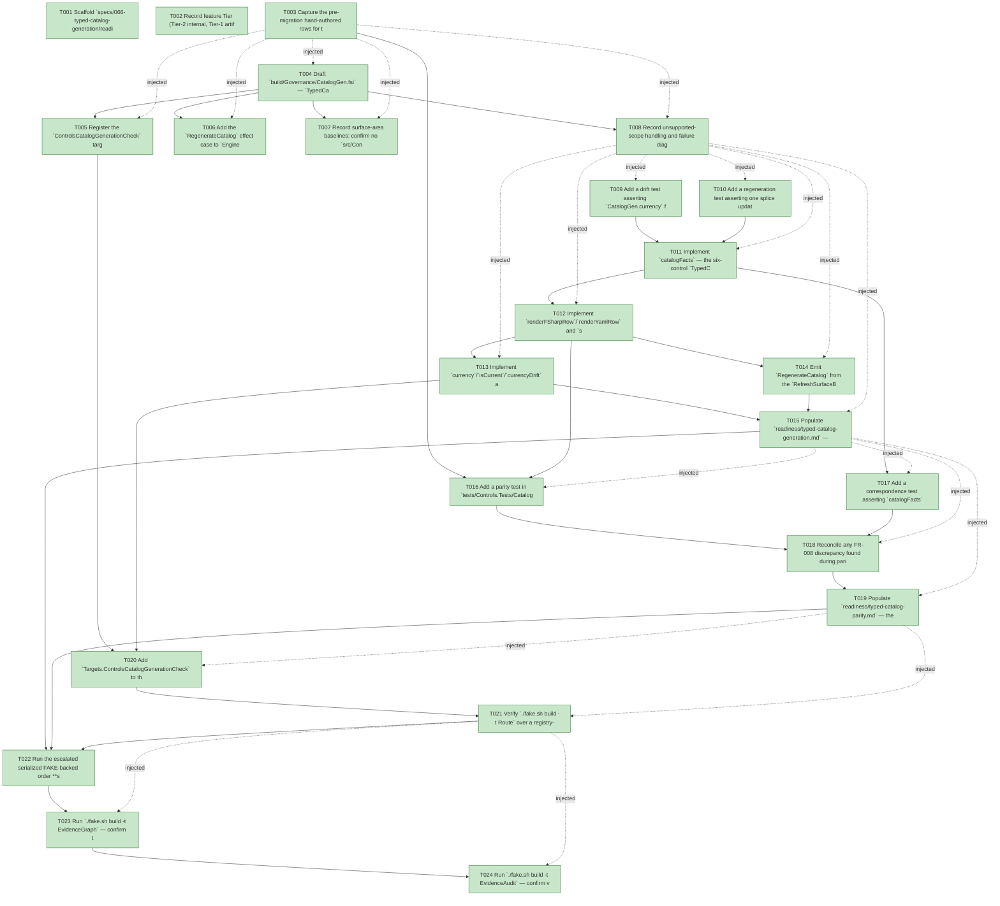

# Task Graph — 066-typed-catalog-generation

## ✓ Graph is acyclic and consistent

## Skill Match Assessments

| Task | Candidate | Confidence | Signals | Reviewer disposition | Diagnostic |
|------|-----------|------------|---------|----------------------|------------|
| T001 | (none) | none |  | accepted-empty | T001: skillist trusted as declared; no owns-based capability requirement |
| T002 | (none) | none |  | accepted-empty | T002: skillist trusted as declared; no owns-based capability requirement |
| T003 | (none) | none |  | declared | T003: skillist trusted as declared; no owns-based capability requirement |
| T004 | (none) | none |  | declared | T004: skillist trusted as declared; no owns-based capability requirement |
| T005 | (none) | none |  | declared | T005: skillist trusted as declared; no owns-based capability requirement |
| T006 | (none) | none |  | declared | T006: skillist trusted as declared; no owns-based capability requirement |
| T007 | (none) | none |  | declared | T007: skillist trusted as declared; no owns-based capability requirement |
| T008 | (none) | none |  | declared | T008: skillist trusted as declared; no owns-based capability requirement |
| T009 | (none) | none |  | declared | T009: skillist trusted as declared; no owns-based capability requirement |
| T010 | (none) | none |  | declared | T010: skillist trusted as declared; no owns-based capability requirement |
| T011 | (none) | none |  | declared | T011: skillist trusted as declared; no owns-based capability requirement |
| T012 | (none) | none |  | declared | T012: skillist trusted as declared; no owns-based capability requirement |
| T013 | (none) | none |  | declared | T013: skillist trusted as declared; no owns-based capability requirement |
| T014 | (none) | none |  | declared | T014: skillist trusted as declared; no owns-based capability requirement |
| T015 | (none) | none |  | declared | T015: skillist trusted as declared; no owns-based capability requirement |
| T016 | (none) | none |  | declared | T016: skillist trusted as declared; no owns-based capability requirement |
| T017 | (none) | none |  | declared | T017: skillist trusted as declared; no owns-based capability requirement |
| T018 | (none) | none |  | declared | T018: skillist trusted as declared; no owns-based capability requirement |
| T019 | (none) | none |  | declared | T019: skillist trusted as declared; no owns-based capability requirement |
| T020 | (none) | none |  | declared | T020: skillist trusted as declared; no owns-based capability requirement |
| T021 | (none) | none |  | declared | T021: skillist trusted as declared; no owns-based capability requirement |
| T022 | (none) | none |  | declared | T022: skillist trusted as declared; no owns-based capability requirement |
| T023 | speckit-evidence-graph | high | owns:graph-validation | accepted | T023: owns graph-validation requires skill speckit-evidence-graph; trigger_group=owns; matched_trigger=owns:graph-validation |
| T024 | speckit-evidence-audit | high | owns:evidence-audit | accepted | T024: owns evidence-audit requires skill speckit-evidence-audit; trigger_group=owns; matched_trigger=owns:evidence-audit |

## Status counts (effective)

| Status | Count |
|--------|-------|
| [X] done | 24 |
| [S] synthetic | 0 |
| [S*] auto-synthetic | 0 |
| accepted [SEH] synthetic | 0 |
| unaccepted synthetic | 0 |

## Graph



## ASCII view

```
T001 [X] Scaffold `specs/066-typed-catalog-generation/readiness/` with audit-enforced placeholder files (`typed-catalog-generation.md`, `typed-catalog-parity.md`, `governance-risk-levels.md`, `runtime-limitations.md`), each naming its authoritative command, artifact path, failure class, and next action
T002 [X] Record feature Tier (Tier-2 internal, Tier-1 artifact rigor via `controls-public-surface`), affected layer (`FS.Skia.UI.Build` only; no `FS.Skia.UI.Controls` runtime dependency — FR-009), public-API impact (none; `ControlDefinition`/`Catalog.supportedControls` unchanged), MVU applicability (pure transform; `RegenerateCatalog` effect at the interpreter edge), and evidence obligations (FR-010, SC-006)
T003 [X] Capture the pre-migration hand-authored rows for the six `065` controls from `src/Controls/catalog.yml` and `src/Controls/Catalog.fs` as the parity baseline (the captured fixtures US2 asserts against)
T004 [X] Draft `build/Governance/CatalogGen.fsi` — `TypedCatalogFact`, `RegionStatus`, `CatalogCurrency`, `catalogFacts`, `catalogYmlRel`/`catalogFsRel`, `renderFSharpRow`/`renderYamlRow`, `spliceFSharp`/`spliceYaml`, `currency`/`isCurrent`/`currencyDrift` (build-tooling scope, `SkillTreeGen.fsi` precedent; not a tracked runtime baseline)
T005 [X] Register the `ControlsCatalogGenerationCheck` target (enum case, `allTargets`, `name`, `directPrerequisites = []`, `timeoutClass "focused"`, `cost "low"`, `failureOwner "product"` in `Targets.fs`/`.fsi`), add it to `AgentValidation.ValidationContract.knownGates`, and insert `CatalogGen.fsi`/`.fs` into `FS.Skia.UI.Build.fsproj` after `GovernedBlocks.fs`
T006 [X] Add the `RegenerateCatalog` effect case to `Engine/Interpret.fs(/.fsi)` with an interpreter handler that reads both catalog files and writes both back in one operation (Principle IV edge; partial-regeneration edge case cannot occur — FR-002)
T007 [X] Record surface-area baselines: confirm no `src/Controls/Catalog.fsi` or tracked runtime surface-baseline delta is expected; the only new `.fsi` is build-front `CatalogGen.fsi` (build-tooling scope). A moved shipped-package baseline is a regression to investigate, not an expected delta
T008 [X] Record unsupported-scope handling and failure diagnostics: the drift gate names the divergent control(s) and the regeneration command; a missing marker region fails loudly (no silent passthrough); generation never invents rows for untyped controls nor drops the 41 hand-authored rows (FR-003, edge cases)
T009 [X] Add a drift test asserting `CatalogGen.currency` flags a hand-mutated `typed-catalog/<id>` region and `currencyDrift` names the divergent control and the regeneration command (SC-003)
T010 [X] Add a regeneration test asserting one splice updates **both** files' regions deterministically from the single source and is idempotent (re-splicing a current tree is a no-op; stable ordering/formatting — "ordering/formatting churn" + "partial regeneration" edge cases)
T011 [X] Implement `catalogFacts` — the six-control `TypedCatalogFact` table (the single source, FR-001) covering exactly `{text-block, button, check-box, stack, text-box, data-grid}`, reusing the shared catalog constants so derived facts stay byte-identical
T012 [X] Implement `renderFSharpRow`/`renderYamlRow` and `spliceFSharp`/`spliceYaml` (reusing `GovernedBlocks` splice/currency primitives), and add per-control `BEGIN/END GENERATED: typed-catalog/<id>` markers around the six rows in `src/Controls/catalog.yml` (`#`) and `src/Controls/Catalog.fs` (`//`), leaving the 41 hand-authored rows unmarked (FR-002/FR-003)
T013 [X] Implement `currency`/`isCurrent`/`currencyDrift` and wire the `ControlsCatalogGenerationCheck` gate arm in `Engine/Update.fs`: read both files at the edge, compute currency, `WriteStructuredReport` a PASS/FAIL readiness report, and `FailWith` the drift diagnostics naming the control(s) when stale/missing (FR-005)
T014 [X] Emit `RegenerateCatalog` from the `RefreshSurfaceBaselines` arm in `Engine/Update.fs` (alongside `RegenerateGovernedBlocks`) so one `./fake.sh build -t RefreshSurfaceBaselines` makes both catalog files current (FR-002); exercise it and capture the transcript under `readiness/`
T015 [X] Populate `readiness/typed-catalog-generation.md` — single-source design, per-control marker model, drift-gate behavior, and an explicit statement that generation is real (no `[S]`); name the authoritative command, artifact path, failure class, next action
T016 [X] Add a parity test in `tests/Controls.Tests/CatalogTests.fs` asserting each of the six generated rows (in both `catalog.yml` and `Catalog.fs`) is byte-identical (exact-text golden-diff) to the captured pre-migration row from T003, with a structural-equality assertion as a secondary guard (SC-002, FR-004)
T017 [X] Add a correspondence test asserting `catalogFacts` covers exactly the six `FS.Skia.UI.Controls.Typed` modules, each `Category` is one of the existing 10, each fact's `RequiredAttributes` agree with the typed `Props` required fields, and `data-grid` keeps `Category = "data"`/`Module = "DataGrid"`
T018 [X] Reconcile any FR-008 discrepancy found during parity/correspondence: the registry value is authoritative — correct the hand-authored row to match and disclose it; confirm `ControlsCatalogCheck`, the existing `CatalogTests` assertions, `supportedCount: 47`, all ten categories, and the 41 untyped rows remain unchanged (FR-007, SC-005)
T019 [X] Populate `readiness/typed-catalog-parity.md` — the six-row generated-vs-source parity matrix and any hand-authored row corrected to the registry under FR-008, with the disclosure (SC-006)
T020 [X] Add `Targets.ControlsCatalogGenerationCheck` to the `controls-public-surface` rule's `RequiredGates` in `Routing.fs`, then regenerate `validation.contract.yml` via `./fake.sh build -t RefreshSurfaceBaselines` so its `controls-public-surface.required_gates` lists the new gate (FR-006)
T021 [X] Verify `./fake.sh build -t Route` over a registry-touching diff lists `ControlsCatalogGenerationCheck`, `./fake.sh build -t Route --enforce` blocks a stale generated catalog as a failed obligation, and `TargetMetadataDrift` is green on the regenerated contract (SC-004, US3); capture the Route output under `readiness/`
T022 [X] Run the escalated serialized FAKE-backed order **sequentially** (`Dev`, `GeneratedGuidanceCheck`, `TemplateCheck`, `GeneratedProductCheck`) per CLAUDE.md/AGENTS.md, then populate `readiness/governance-risk-levels.md` with the small/medium/broad levels, focused validation per level, and the non-authoritative aggregate-result recording note
T023 [X] Run `./fake.sh build -t EvidenceGraph` — confirm the feature resolves, no cycles, no dangling refs, no unexpected `[S*]` promotion; record before/after graph paths
T024 [X] Run `./fake.sh build -t EvidenceAudit` — confirm verdict PASS with an empty Synthetic-Evidence Inventory (no `--accept-synthetic` override needed)
```

## Injected checkpoint edges (Phase N+1 → Phase N) — FR-007

- T003 → T004  (auto-injected Phase-checkpoint edge)
- T003 → T005  (auto-injected Phase-checkpoint edge)
- T003 → T006  (auto-injected Phase-checkpoint edge)
- T003 → T007  (auto-injected Phase-checkpoint edge)
- T003 → T008  (auto-injected Phase-checkpoint edge)
- T008 → T009  (auto-injected Phase-checkpoint edge)
- T008 → T010  (auto-injected Phase-checkpoint edge)
- T008 → T011  (auto-injected Phase-checkpoint edge)
- T008 → T012  (auto-injected Phase-checkpoint edge)
- T008 → T013  (auto-injected Phase-checkpoint edge)
- T008 → T014  (auto-injected Phase-checkpoint edge)
- T008 → T015  (auto-injected Phase-checkpoint edge)
- T015 → T016  (auto-injected Phase-checkpoint edge)
- T015 → T017  (auto-injected Phase-checkpoint edge)
- T015 → T018  (auto-injected Phase-checkpoint edge)
- T015 → T019  (auto-injected Phase-checkpoint edge)
- T019 → T020  (auto-injected Phase-checkpoint edge)
- T019 → T021  (auto-injected Phase-checkpoint edge)
- T021 → T023  (auto-injected Phase-checkpoint edge)
- T021 → T024  (auto-injected Phase-checkpoint edge)

## Resolved skillist ids — FR-007

Resolved skillist-id set (6): fs-skia-ui-widgets, fsharp-build-orchestration, fsharp-code-generation, fsharp-io-globbing, speckit-evidence-audit, speckit-evidence-graph

