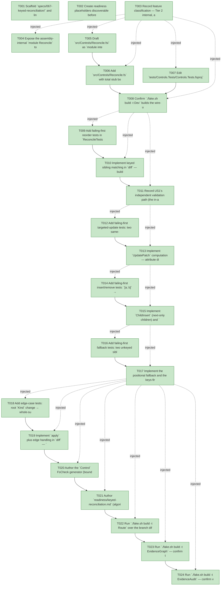

# Task Graph — 067-keyed-reconciliation

## ✓ Graph is acyclic and consistent

## Skill Match Assessments

| Task | Candidate | Confidence | Signals | Reviewer disposition | Diagnostic |
|------|-----------|------------|---------|----------------------|------------|
| T001 | (none) | none |  | accepted-empty | T001: skillist trusted as declared; no owns-based capability requirement |
| T002 | (none) | none |  | accepted-empty | T002: skillist trusted as declared; no owns-based capability requirement |
| T003 | (none) | none |  | accepted-empty | T003: skillist trusted as declared; no owns-based capability requirement |
| T004 | (none) | none |  | accepted-empty | T004: skillist trusted as declared; no owns-based capability requirement |
| T005 | (none) | none |  | declared | T005: skillist trusted as declared; no owns-based capability requirement |
| T006 | (none) | none |  | declared | T006: skillist trusted as declared; no owns-based capability requirement |
| T007 | (none) | none |  | declared | T007: skillist trusted as declared; no owns-based capability requirement |
| T008 | (none) | none |  | declared | T008: skillist trusted as declared; no owns-based capability requirement |
| T009 | (none) | none |  | declared | T009: skillist trusted as declared; no owns-based capability requirement |
| T010 | (none) | none |  | declared | T010: skillist trusted as declared; no owns-based capability requirement |
| T011 | (none) | none |  | accepted-empty | T011: skillist trusted as declared; no owns-based capability requirement |
| T012 | (none) | none |  | declared | T012: skillist trusted as declared; no owns-based capability requirement |
| T013 | (none) | none |  | declared | T013: skillist trusted as declared; no owns-based capability requirement |
| T014 | (none) | none |  | declared | T014: skillist trusted as declared; no owns-based capability requirement |
| T015 | (none) | none |  | declared | T015: skillist trusted as declared; no owns-based capability requirement |
| T016 | (none) | none |  | declared | T016: skillist trusted as declared; no owns-based capability requirement |
| T017 | (none) | none |  | declared | T017: skillist trusted as declared; no owns-based capability requirement |
| T018 | (none) | none |  | declared | T018: skillist trusted as declared; no owns-based capability requirement |
| T019 | (none) | none |  | declared | T019: skillist trusted as declared; no owns-based capability requirement |
| T020 | (none) | none |  | declared | T020: skillist trusted as declared; no owns-based capability requirement |
| T021 | (none) | none |  | accepted-empty | T021: skillist trusted as declared; no owns-based capability requirement |
| T022 | (none) | none |  | declared | T022: skillist trusted as declared; no owns-based capability requirement |
| T023 | speckit-evidence-graph | high | owns:graph-validation | accepted | T023: owns graph-validation requires skill speckit-evidence-graph; trigger_group=owns; matched_trigger=owns:graph-validation |
| T024 | speckit-evidence-audit | high | owns:evidence-audit | accepted | T024: owns evidence-audit requires skill speckit-evidence-audit; trigger_group=owns; matched_trigger=owns:evidence-audit |

## Status counts (effective)

| Status | Count |
|--------|-------|
| [X] done | 24 |
| [S] synthetic | 0 |
| [S*] auto-synthetic | 0 |
| accepted [SEH] synthetic | 0 |
| unaccepted synthetic | 0 |

## Graph



## ASCII view

```
T001 [X] Scaffold `specs/067-keyed-reconciliation/` and link spec, plan, data-model, and `contracts/reconcile.fsi`
T002 [X] Create readiness placeholders discoverable before implementation: `readiness/typed-controls-front-door.md`, `readiness/package-surface-expectations.md`, `readiness/keyed-reconciliation.md` (FAKE-emitted gate logs land alongside them later)
T003 [X] Record feature classification — Tier 2 internal, affected layer `src/Controls/**` (internal module), zero public-API impact (FR-002), MVU N/A (pure diff), and the three evidence obligations
T004 [X] Expose the assembly-internal `module Reconcile` to `Controls.Tests` via an SDK `<InternalsVisibleTo Include="Controls.Tests" />` MSBuild item in `Controls.fsproj` (the SDK generates the assembly attribute at build time — a source `AssemblyInfo.fs` would lack the `.fsi` pair the surface-area gate requires, so the MSBuild item is used instead)
T005 [X] Draft `src/Controls/Reconcile.fsi` as `module internal Reconcile` — `FieldChange<'a>`, `AttrChange<'msg>`, `NodePatch<'msg>`, `UpdatePatch<'msg>`, `ChildOp<'msg>`, `ReconcileResult<'msg>`, and the `diff`/`apply` signatures, matching `contracts/reconcile.fsi`
T006 [X] Add `src/Controls/Reconcile.fs` with total stub bodies (e.g. `diff` returns `Replace next`, `apply` returns `prev`) and insert `Reconcile.fsi`/`Reconcile.fs` after `Control.fs` in `Controls.fsproj`; confirm the `Controls.fsproj` reference set is unchanged — `Scene`, `Layout`, `KeyboardInput` only, **no `Fable.Elmish`** and no renderer dependency (FR-013)
T007 [X] Edit `tests/Controls.Tests/Controls.Tests.fsproj` — add the `FsCheck` `<PackageReference>` (pinned 3.3.3, test-only) and register `ReconcileTests.fs` before `Program.fs`
T008 [X] Confirm `./fake.sh build -t Dev` builds the wire-up green and verify `PackageSurfaceCheck` shows a byte-for-byte unchanged public-surface baseline (FR-002 / SC-005)
T009 [X] Add failing-first reorder tests in `ReconcileTests.fs`: keyed `[a; b; c]` → `[c; a; b]` produces **zero** `Replace` ops, child ops are `ChildKeep`/`ChildMove` keyed to a/b/c, and a moved-but-unchanged node carries `NodePatch.Keep` (SC-001, US1 AC#1–2)
T010 [X] Implement keyed sibling matching in `diff` — build prev/next key buckets (keys-first), emit `ChildKeep`/`ChildMove` with next-relative indices, recurse into matched children — to green US1
T011 [X] Record US1's independent validation path (the in-assembly reorder test) in `readiness/keyed-reconciliation.md`
T012 [X] Add failing-first targeted-update tests: two same-key/same-kind nodes differing in one attribute yield exactly one `AttrSet` and touch no other node (SC-003); a content-only difference records exactly one `ContentChange`
T013 [X] Implement `UpdatePatch` computation — attribute diff by `Name` sorted for determinism (FR-007), `ContentChange`/`AccessibilityChange` as `FieldChange` (FR-004), recurse via child ops (FR-005), and canonicalize an all-empty `Update` to `Keep` (identical-trees no-op) — to green US2
T014 [X] Add failing-first insert/remove tests: `[a; b]` → `[a; b; c]` yields exactly one `ChildInsert` for `c`; `[a; b; c]` → `[a; c]` yields exactly one `ChildRemove` for `b`, others kept
T015 [X] Implement `ChildInsert` (next-only children) and `ChildRemove` (prev-only children, keyed by `ControlId option` + index) emission to green US3
T016 [X] Add failing-first fallback tests: two unkeyed sibling lists reconcile byte-for-byte identically on repeated runs; a mixed keyed/unkeyed list matches keyed nodes by key first, then the residual unkeyed nodes positionally (FR-010, US4 AC#1–2)
T017 [X] Implement the positional fallback and the keys-first-then-residual-positional matching rule (FR-010) to green US4
T018 [X] Add edge-case tests: root `Kind` change → whole-subtree `Replace` (FR-006); duplicate keys in one sibling list → first-occurrence wins **and** a `KeyCollision` `Warning` diagnostic on `ReconcileResult.Diagnostics` (FR-011); empty→non-empty all-inserts, non-empty→empty all-removes, both-empty `Keep`; identical trees → `Keep` (SC-007 totality)
T019 [X] Implement `apply` plus edge handling in `diff` — `Replace` on `Kind` mismatch, the first-occurrence `KeyCollision` diagnostic, empty-tree/identical canonicalization, and totality (never throws) — to green the edge tests
T020 [X] Author the `Control<int>` FsCheck generator (bounded depth, keyed/unkeyed mix, duplicate-key cases) and the properties: round-trip `apply prev (diff prev next).Patch ≡ next` over ≥1000 cases (FR-008 / SC-002) and determinism `diff prev next = diff prev next` (SC-004); green
T021 [X] Author `readiness/keyed-reconciliation.md` (algorithm, keys-first matching rule, duplicate-key first-occurrence diagnostic, round-trip + determinism property results) and finalize `readiness/typed-controls-front-door.md` and `readiness/package-surface-expectations.md` recording the **zero** public-surface delta (SC-005)
T022 [X] Run `./fake.sh build -t Route` over the branch diff, confirm it prints the `controls-public-surface` escalation, then run the printed gates (`ControlsCatalogCheck`, `ControlsCatalogGenerationCheck`, `ControlsInteractionCheck`, `ControlsRenderingCheck`, `PackageSurfaceCheck`, `FsiTranscripts`, `GeneratedProductCheck`) to green — SC-006. The `ControlsRenderingCheck` / `ControlsInteractionCheck` gates are the enforcer that render, layout, diagnostics, accessibility, and interaction behavior are unchanged (FR-012)
T023 [X] Run `./fake.sh build -t EvidenceGraph` — confirm the echoed feature directory/task count match, no cycles, no dangling refs, and no `[S*]` surprises
T024 [X] Run `./fake.sh build -t EvidenceAudit` — confirm verdict PASS (no synthetic propagation; no `--accept-synthetic` override expected)
```

## Injected checkpoint edges (Phase N+1 → Phase N) — FR-007

- T003 → T004  (auto-injected Phase-checkpoint edge)
- T003 → T005  (auto-injected Phase-checkpoint edge)
- T003 → T006  (auto-injected Phase-checkpoint edge)
- T003 → T007  (auto-injected Phase-checkpoint edge)
- T003 → T008  (auto-injected Phase-checkpoint edge)
- T008 → T009  (auto-injected Phase-checkpoint edge)
- T008 → T010  (auto-injected Phase-checkpoint edge)
- T008 → T011  (auto-injected Phase-checkpoint edge)
- T011 → T012  (auto-injected Phase-checkpoint edge)
- T011 → T013  (auto-injected Phase-checkpoint edge)
- T013 → T014  (auto-injected Phase-checkpoint edge)
- T013 → T015  (auto-injected Phase-checkpoint edge)
- T015 → T016  (auto-injected Phase-checkpoint edge)
- T015 → T017  (auto-injected Phase-checkpoint edge)
- T017 → T018  (auto-injected Phase-checkpoint edge)
- T017 → T019  (auto-injected Phase-checkpoint edge)
- T017 → T020  (auto-injected Phase-checkpoint edge)
- T017 → T021  (auto-injected Phase-checkpoint edge)
- T017 → T022  (auto-injected Phase-checkpoint edge)
- T017 → T023  (auto-injected Phase-checkpoint edge)
- T017 → T024  (auto-injected Phase-checkpoint edge)

## Resolved skillist ids — FR-007

Resolved skillist-id set (5): fs-skia-ui-widgets, fsharp-build-orchestration, fsharp-graph-algorithms, speckit-evidence-audit, speckit-evidence-graph

