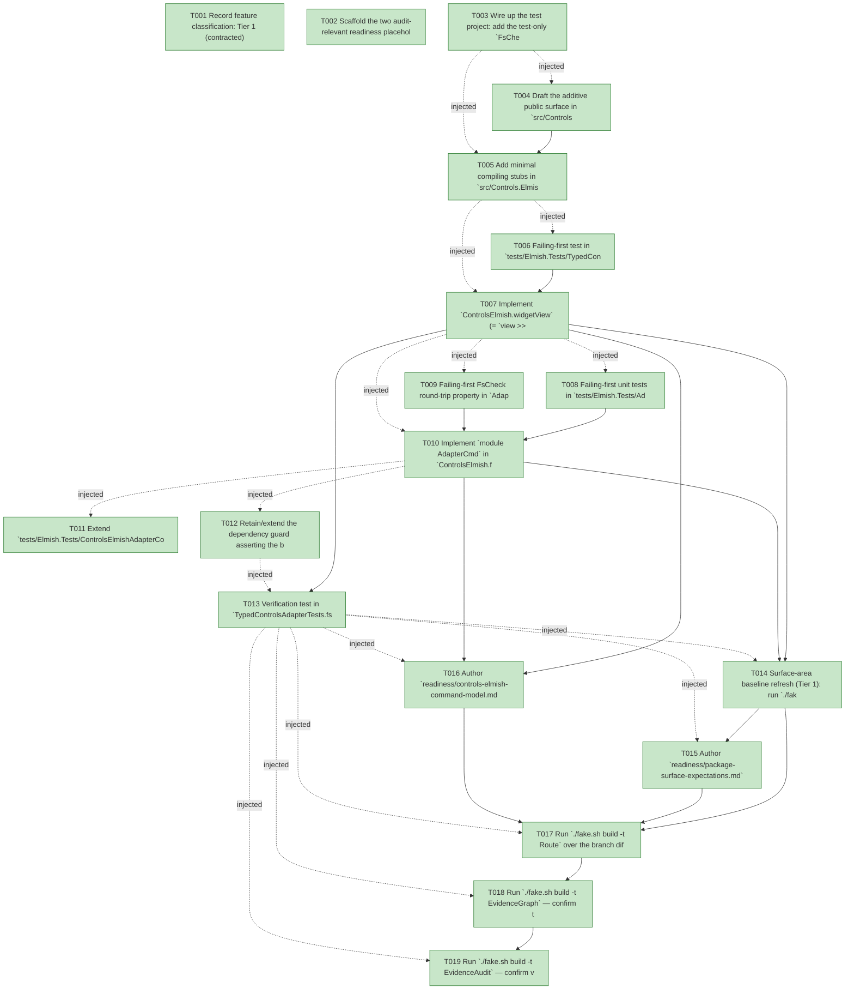

# Task Graph — 068-controls-elmish-command-model

## ✓ Graph is acyclic and consistent

## Skill Match Assessments

| Task | Candidate | Confidence | Signals | Reviewer disposition | Diagnostic |
|------|-----------|------------|---------|----------------------|------------|
| T001 | (none) | none |  | accepted-empty | T001: skillist trusted as declared; no owns-based capability requirement |
| T002 | (none) | none |  | accepted-empty | T002: skillist trusted as declared; no owns-based capability requirement |
| T003 | (none) | none |  | declared | T003: skillist trusted as declared; no owns-based capability requirement |
| T004 | (none) | none |  | declared | T004: skillist trusted as declared; no owns-based capability requirement |
| T005 | (none) | none |  | declared | T005: skillist trusted as declared; no owns-based capability requirement |
| T006 | (none) | none |  | declared | T006: skillist trusted as declared; no owns-based capability requirement |
| T007 | (none) | none |  | declared | T007: skillist trusted as declared; no owns-based capability requirement |
| T008 | (none) | none |  | declared | T008: skillist trusted as declared; no owns-based capability requirement |
| T009 | (none) | none |  | declared | T009: skillist trusted as declared; no owns-based capability requirement |
| T010 | (none) | none |  | declared | T010: skillist trusted as declared; no owns-based capability requirement |
| T011 | (none) | none |  | declared | T011: skillist trusted as declared; no owns-based capability requirement |
| T012 | (none) | none |  | declared | T012: skillist trusted as declared; no owns-based capability requirement |
| T013 | (none) | none |  | declared | T013: skillist trusted as declared; no owns-based capability requirement |
| T014 | (none) | none |  | declared | T014: skillist trusted as declared; no owns-based capability requirement |
| T015 | (none) | none |  | declared | T015: skillist trusted as declared; no owns-based capability requirement |
| T016 | (none) | none |  | declared | T016: skillist trusted as declared; no owns-based capability requirement |
| T017 | (none) | none |  | declared | T017: skillist trusted as declared; no owns-based capability requirement |
| T018 | speckit-evidence-graph | high | owns:graph-validation | accepted | T018: owns graph-validation requires skill speckit-evidence-graph; trigger_group=owns; matched_trigger=owns:graph-validation |
| T019 | speckit-evidence-audit | high | owns:evidence-audit | accepted | T019: owns evidence-audit requires skill speckit-evidence-audit; trigger_group=owns; matched_trigger=owns:evidence-audit |

## Status counts (effective)

| Status | Count |
|--------|-------|
| [X] done | 19 |
| [S] synthetic | 0 |
| [S*] auto-synthetic | 0 |
| accepted [SEH] synthetic | 0 |
| unaccepted synthetic | 0 |

## Graph



## ASCII view

```
T001 [X] Record feature classification: Tier 1 (contracted), affected layer `src/Controls.Elmish/**`, additive-only public-API impact on `FS.Skia.UI.Controls.Elmish`, Elmish/MVU applicability (this package **is** the MVU boundary; `init`/`update` stay pure, interpreters unchanged), and the evidence obligations (`readiness/package-surface-expectations.md`, `readiness/controls-elmish-command-model.md`)
T002 [X] Scaffold the two audit-relevant readiness placeholders discoverable before implementation: `readiness/package-surface-expectations.md` (required by the `package-surface` routing rule) and `readiness/controls-elmish-command-model.md` (feature-specific), each naming its authoritative command, artifact path, failure class, and next action
T003 [X] Wire up the test project: add the test-only `FsCheck` `<PackageReference>` (pinned 3.3.3) and a placeholder `AdapterCmdTests.fs` (before `Program.fs`) to `tests/Elmish.Tests/Elmish.Tests.fsproj`; confirm `./fake.sh build -t Dev` still builds green
T004 [X] Draft the additive public surface in `src/Controls.Elmish/ControlsElmish.fsi` per `contracts/controls-elmish.fsi`: `ControlsElmish.widgetView`, `ControlsElmish.programOfWidget`, and `module AdapterCmd` (`none`/`ofMessage`/`productMessages`/`toCmd`), with `open Elmish` to name `Cmd<'msg>`; every existing signature (`AdapterProgram.View`, `program`, `AdapterCommand`/`AdapterEffect`/`AdapterSubscription`, interpreters) left byte-for-byte unchanged (FR-002)
T005 [X] Add minimal compiling stubs in `src/Controls.Elmish/ControlsElmish.fs` for the new symbols (e.g. `failwith`/placeholder bodies) so the package builds against the new `.fsi` and the failing-first tests can compile red; confirm `./fake.sh build -t Dev` builds with the expanded surface
T006 [X] Failing-first test in `tests/Elmish.Tests/TypedControlsAdapterTests.fs`: build a `view: 'model -> Widget<'msg>` from typed modules, construct the program via `programOfWidget`, render it, and assert (a) no `Widget.toControl` appears in product code (SC-001) and (b) the resulting `Control<'msg>` tree is structurally equal to `program init update (view >> Widget.toControl) subscriptions` (lowering parity, SC-002 / FR-004)
T007 [X] Implement `ControlsElmish.widgetView` (= `view >> Widget.toControl`) and `ControlsElmish.programOfWidget` (= `program init update (widgetView view) subscriptions`) as pure composition in `ControlsElmish.fs`; green the US1 parity test (FR-001/FR-004)
T008 [X] Failing-first unit tests in `tests/Elmish.Tests/AdapterCmdTests.fs`: empty-command edge (`toCmd route [] = AdapterCmd.none`), effect-order preservation, and a recording dispatcher delivering exactly the carried `DispatchProductMessage` payloads in order with none dropped or duplicated (FR-003/FR-008 acceptance scenarios)
T009 [X] Failing-first FsCheck round-trip property in `AdapterCmdTests.fs`: for generated commands, `dispatchedMessages (toCmd projectProduct command) = productMessages command` across ≥1,000 cases with no counterexample (FR-008/SC-003)
T010 [X] Implement `module AdapterCmd` in `ControlsElmish.fs` — `none` (= `Cmd.none`), `ofMessage`, `productMessages` (ordered `List.choose`), and a **total** `toCmd route` mapping every `AdapterEffect` case (product and non-product) to a `'msg` preserving order with `[] -> Cmd.none`; green the US2 unit and FsCheck property tests (FR-003/FR-008)
T011 [X] Extend `tests/Elmish.Tests/ControlsElmishAdapterContractTests.fs`: assert the existing `.fsi` surface (`AdapterProgram.View: 'model -> Control<'msg>`, `program`, `AdapterCommand`/`AdapterEffect`/`AdapterSubscription`, `interpretKeyboardEffect`/`interpretControlEffect`/`subscriptions`) is unchanged and that a `Control<'msg>`-view program compiles with no source edit and behaves identically (FR-002/FR-009/SC-004)
T012 [X] Retain/extend the dependency guard asserting the base `FS.Skia.UI.Controls` package declares **no** `Fable.Elmish` reference, preserving the dependency split (FR-006/SC-005)
T013 [X] Verification test in `TypedControlsAdapterTests.fs`: a `Widget<'msg>` built via `Widget.ofControl` lowers identically to rendering the legacy control directly (`toControl (ofControl c) = c`), and a program on the Widget-view path coexists with another on the Control-view path with no interference (FR-010 / edge cases)
T014 [X] Surface-area baseline refresh (Tier 1): run `./fake.sh build -t RefreshSurfaceBaselines` to regenerate `readiness/surface-baselines/FS.Skia.UI.Controls.Elmish.txt` and `readiness/per-package-surface/FS.Skia.UI.Controls.Elmish.fsi.txt`; review the diff and confirm it is **additive-only** and confined to this package (SC-006)
T015 [X] Author `readiness/package-surface-expectations.md`: the additive-only `FS.Skia.UI.Controls.Elmish` delta and the regenerated-baseline rationale, satisfying the `package-surface` routing rule and `Route --enforce` (SC-006)
T016 [X] Author `readiness/controls-elmish-command-model.md`: the Widget-view path, the `AdapterCommand`↔`Cmd<'msg>` total-mapping rule, the lowering-parity result, the command round-trip property results, and the additive/peer compatibility note (Widget preferred, Control frozen peer)
T017 [X] Run `./fake.sh build -t Route` over the branch diff; confirm it prints the `package-surface` escalation and run **only** the printed gates (`PackageSurfaceCheck`, `FsiTranscripts`, `PerPackageSurfaceDiff`) sequentially to green (SC-007); then run the serialized broad maintainer-verify order (`Dev`, `GeneratedGuidanceCheck`, `TemplateCheck`, `GeneratedProductCheck`) sequentially as this is a consumer-contract change
T018 [X] Run `./fake.sh build -t EvidenceGraph` — confirm the feature DAG resolves with no cycles, no dangling refs, and no `[S*]` surprises
T019 [X] Run `./fake.sh build -t EvidenceAudit` — confirm verdict PASS (no synthetic evidence to accept)
```

## Injected checkpoint edges (Phase N+1 → Phase N) — FR-007

- T003 → T004  (auto-injected Phase-checkpoint edge)
- T003 → T005  (auto-injected Phase-checkpoint edge)
- T005 → T006  (auto-injected Phase-checkpoint edge)
- T005 → T007  (auto-injected Phase-checkpoint edge)
- T007 → T008  (auto-injected Phase-checkpoint edge)
- T007 → T009  (auto-injected Phase-checkpoint edge)
- T007 → T010  (auto-injected Phase-checkpoint edge)
- T010 → T011  (auto-injected Phase-checkpoint edge)
- T010 → T012  (auto-injected Phase-checkpoint edge)
- T012 → T013  (auto-injected Phase-checkpoint edge)
- T013 → T014  (auto-injected Phase-checkpoint edge)
- T013 → T015  (auto-injected Phase-checkpoint edge)
- T013 → T016  (auto-injected Phase-checkpoint edge)
- T013 → T017  (auto-injected Phase-checkpoint edge)
- T013 → T018  (auto-injected Phase-checkpoint edge)
- T013 → T019  (auto-injected Phase-checkpoint edge)

## Resolved skillist ids — FR-007

Resolved skillist-id set (5): fs-skia-elmish, fs-skia-ui-widgets, fsharp-build-orchestration, speckit-evidence-audit, speckit-evidence-graph

