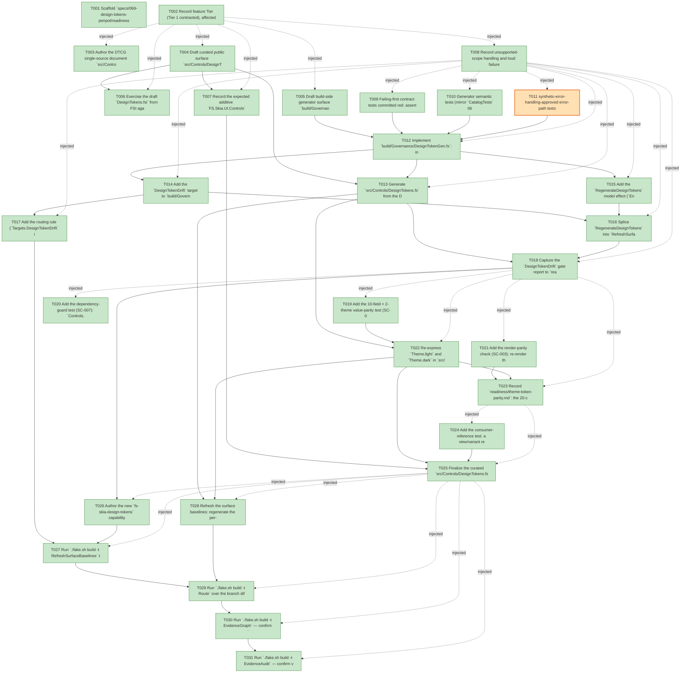

# Task Graph — 069-design-tokens-penpot

## ✓ Graph is acyclic and consistent

## Skill Match Assessments

| Task | Candidate | Confidence | Signals | Reviewer disposition | Diagnostic |
|------|-----------|------------|---------|----------------------|------------|
| T001 | (none) | none |  | accepted-empty | T001: skillist trusted as declared; no owns-based capability requirement |
| T002 | (none) | none |  | accepted-empty | T002: skillist trusted as declared; no owns-based capability requirement |
| T003 | (none) | none |  | accepted-empty | T003: skillist trusted as declared; no owns-based capability requirement |
| T004 | (none) | none |  | declared | T004: skillist trusted as declared; no owns-based capability requirement |
| T005 | (none) | none |  | declared | T005: skillist trusted as declared; no owns-based capability requirement |
| T006 | (none) | none |  | accepted-empty | T006: skillist trusted as declared; no owns-based capability requirement |
| T007 | (none) | none |  | accepted-empty | T007: skillist trusted as declared; no owns-based capability requirement |
| T008 | (none) | none |  | accepted-empty | T008: skillist trusted as declared; no owns-based capability requirement |
| T009 | (none) | none |  | declared | T009: skillist trusted as declared; no owns-based capability requirement |
| T010 | (none) | none |  | declared | T010: skillist trusted as declared; no owns-based capability requirement |
| T011 | (none) | none |  | declared | T011: skillist trusted as declared; no owns-based capability requirement |
| T012 | (none) | none |  | declared | T012: skillist trusted as declared; no owns-based capability requirement |
| T013 | (none) | none |  | declared | T013: skillist trusted as declared; no owns-based capability requirement |
| T014 | (none) | none |  | declared | T014: skillist trusted as declared; no owns-based capability requirement |
| T015 | (none) | none |  | declared | T015: skillist trusted as declared; no owns-based capability requirement |
| T016 | (none) | none |  | declared | T016: skillist trusted as declared; no owns-based capability requirement |
| T017 | (none) | none |  | declared | T017: skillist trusted as declared; no owns-based capability requirement |
| T018 | (none) | none |  | declared | T018: skillist trusted as declared; no owns-based capability requirement |
| T019 | (none) | none |  | declared | T019: skillist trusted as declared; no owns-based capability requirement |
| T020 | (none) | none |  | declared | T020: skillist trusted as declared; no owns-based capability requirement |
| T021 | (none) | none |  | declared | T021: skillist trusted as declared; no owns-based capability requirement |
| T022 | (none) | none |  | declared | T022: skillist trusted as declared; no owns-based capability requirement |
| T023 | (none) | none |  | accepted-empty | T023: skillist trusted as declared; no owns-based capability requirement |
| T024 | (none) | none |  | declared | T024: skillist trusted as declared; no owns-based capability requirement |
| T025 | (none) | none |  | declared | T025: skillist trusted as declared; no owns-based capability requirement |
| T026 | (none) | none |  | accepted-empty | T026: skillist trusted as declared; no owns-based capability requirement |
| T027 | (none) | none |  | declared | T027: skillist trusted as declared; no owns-based capability requirement |
| T028 | (none) | none |  | declared | T028: skillist trusted as declared; no owns-based capability requirement |
| T029 | (none) | none |  | declared | T029: skillist trusted as declared; no owns-based capability requirement |
| T030 | speckit-evidence-graph | high | owns:graph-validation | accepted | T030: owns graph-validation requires skill speckit-evidence-graph; trigger_group=owns; matched_trigger=owns:graph-validation |
| T031 | speckit-evidence-audit | high | owns:evidence-audit | accepted | T031: owns evidence-audit requires skill speckit-evidence-audit; trigger_group=owns; matched_trigger=owns:evidence-audit |

## Status counts (effective)

| Status | Count |
|--------|-------|
| [X] done | 30 |
| [S] synthetic | 1 |
| [S*] auto-synthetic | 0 |
| accepted [SEH] synthetic | 1 |
| unaccepted synthetic | 0 |

## Synthetic Error-Handling Classification

| Task | Accepted | Label | Design source | Synthetic input class | Expected error behavior | Diagnostics |
|------|----------|-------|---------------|-----------------------|-------------------------|-------------|
| T011 | yes | yes | plan Synthetic evidence; spec Edge Cases (DTCG references/aliases, malformed/incomplete source); FR-006 | Malformed JSON document plus cyclic/unresolvable alias a-to-b-to-a | Generation raises a failure naming the offending token; emits no F# (no partial module) | (none) |

## Graph



## ASCII view

```
T001 [X] Scaffold `specs/069-design-tokens-penpot/readiness/` with audit-discoverable placeholder files: `design-tokens.md`, `design-token-drift.md`, `theme-token-parity.md`, `package-surface-expectations.md`, plus `governance-risk-levels.md`, `runtime-limitations.md`, and the `fsi/` and `logs/` subfolders (each placeholder naming its authoritative command, artifact path, failure class, and next action)
T002 [X] Record feature Tier (Tier 1 contracted), affected layer (`FS.Skia.UI.Controls` additive surface + `FS.Skia.UI.Build` generator), public-API impact (additive `DesignTokens` module only), MVU applicability (N/A — pure build transform, single `RegenerateDesignTokens` effect), and evidence obligations into `readiness/design-tokens.md`
T003 [X] Author the DTCG single-source document `src/Controls/design-tokens.tokens.json` — both `light` and `dark` groups, all 10 primitives, values reproducing today's `Theme.fs` literals exactly (data-model §1); include the worked `dark.danger` alias `"{light.danger}"`
T004 [X] Draft curated public surface `src/Controls/DesignTokens.fsi` from `contracts/design-tokens.fsi` (`DesignTokens.Light.*` / `DesignTokens.Dark.*`; Principle II — sole public declaration, `.fs` carries no access modifiers)
T005 [X] Draft build-side generator surface `build/Governance/DesignTokenGen.fsi` from `contracts/design-token-gen.fsi` (`TokenKind`, `DesignTokenFact`, `RegionStatus`, `TokenCurrency`, `parse`/`renderValue`/`renderModule`/`splice`/`currency`/`isCurrent`/`currencyDrift`), mirroring `CatalogGen.fsi`
T006 [X] Exercise the draft `DesignTokens.fsi` from FSI against a hand-stubbed `.fs` (`DesignTokens.Light.foreground`, `= Theme.light.Foreground`) and capture the transcript to `readiness/fsi/design-tokens-surface.txt`
T007 [X] Record the expected additive `FS.Skia.UI.Controls` surface delta and regenerated-baseline rationale into `readiness/package-surface-expectations.md` (new `DesignTokens` names only; `Theme`/`Control` signatures unchanged)
T008 [X] Record unsupported-scope handling and loud failure diagnostics into `readiness/runtime-limitations.md`: no live Penpot/MCP, no remaining-41-controls migration, malformed/cyclic/missing DTCG fails loudly naming the offending token with no partial emit
T009 [X] Failing-first contract tests committed red: assert `DesignTokenGen` exposes `parse`/`renderValue`/`renderModule`/`splice`/`currency`/`currencyDrift`, and that `DesignTokens.fsi` declares the `Light`/`Dark` token surface
T010 [X] Generator semantic tests (mirror `CatalogTests` 066 block): byte-identity of `renderModule` vs. committed fixture, `currency` PASS on the committed tree, `splice` idempotency, **drift FAIL** on a hand-mutated generated file (diagnostic names the token + theme + `RefreshSurfaceBaselines`), missing/whole-file reported as all-`Missing` loudly, determinism (regenerate twice ⇒ byte-identical — SC-006), and deterministic alias resolution (`{light.danger}` ⇒ `#b91c1cff`)
T011 [S] synthetic-error-handling-approved error-path tests: malformed DTCG JSON and cyclic/unresolvable alias each raise a generation failure naming the offending token and emit **no** F# (no partial module). Real input is infeasible to source for a malformed/cyclic document; these validate explicit failure behavior (plan §"Synthetic evidence")   ← accepted [SEH]
T012 [X] Implement `build/Governance/DesignTokenGen.fs`: in-process DTCG JSON parse, deterministic alias resolution with cycle detection, `renderValue` (hex → `Colors.rgba R G B A`; dimension/number → float w/ decimal point; `fontFamily` null → `None`), `renderModule` (whole-file w/ GENERATED banner + regenerate command), `splice`, `currency`/`isCurrent`/`currencyDrift` — pure over in-memory text
T013 [X] Generate `src/Controls/DesignTokens.fs` from the DTCG source via the generator and insert its `<Compile>` (`.fsi` then `.fs`) after `Theme` in `src/Controls/Controls.fsproj`, adding **no** new package reference
T014 [X] Add the `DesignTokenDrift` target to `build/Governance/Targets.fs`/`Targets.fsi` (`Target` enum, `allTargets`, name map, `directPrerequisites`, `failureOwner`), mirroring `ControlsCatalogGenerationCheck`
T015 [X] Add the `RegenerateDesignTokens` model effect (`Engine/Model.fs`/`Model.fsi` next to `RegenerateCatalog`), dispatch it in `Engine/Interpret.fs`, and implement `regenerateDesignTokens` in `Front/Governance.fs` (mirrors `regenerateCatalog`; write is the only filesystem effect, at the interpreter edge)
T016 [X] Splice `RegenerateDesignTokens` into `RefreshSurfaceBaselines` and add the `DesignTokenDrift` arm in `Engine/Update.fs` so the DTCG document is the one edit point
T017 [X] Add the routing rule (`Targets.DesignTokenDrift` into the `controls-public-surface` gate list in `build/Governance/Routing.fs`) and regenerate `validation.contract.yml` from `Routing.fs` (no hand-sync)
T018 [X] Capture the `DesignTokenDrift` gate report to `readiness/design-token-drift.md` — currency PASS on the committed tree plus a hand-edit/stale FAIL transcript (under `readiness/logs/`) showing the named token + regenerate command. Also capture the **SC-004 value-edit propagation walkthrough** (US1 independent test): edit one DTCG token value → `./fake.sh build -t RefreshSurfaceBaselines` → show the generated `DesignTokens.*` value **and** the resolved `Theme.<field>` both updated from that **single** edit with no manual edit to the generated module, then revert the value
T019 [X] Add the 10-field × 2-theme value-parity test (SC-002): each `Theme.light/dark.<Field>` equals its pre-feature literal from the frozen data-model §4 table; assert `DesignTokens.Light/Dark.*` resolve byte-identically
T020 [X] Add the dependency-guard test (SC-007): `Controls.fsproj` gains **no** new package reference (in particular no `Fable.Elmish` and no JSON dependency), mirroring the `068` guard
T021 [X] Add the render-parity check (SC-003): re-render the controls gallery against the token-derived themes and assert node/visual output is identical to the pre-feature themes
T022 [X] Re-express `Theme.light` and `Theme.dark` in `src/Controls/Theme.fs` in terms of `DesignTokens.Light.*`/`DesignTokens.Dark.*` — value-identical, **zero** inline color/size/density/radius/contrast literals for the migrated fields; `Name` stays a code constant (`Types.fsi` signatures unchanged)
T023 [X] Record `readiness/theme-token-parity.md`: the 20-cell parity table (token-derived ≡ pre-feature literal) and the render-parity result
T024 [X] Add the consumer-reference test: a view/variant references a generated token by typed name (e.g. `DesignTokens.Light.accent`), compiles, and resolves to the DTCG value; assert `PackageSurfaceCheck`/`PerPackageSurfaceDiff` reports the `FS.Skia.UI.Controls` delta as **additive-only** (SC-008)
T025 [X] Finalize the curated `src/Controls/DesignTokens.fsi`, add a small sample/FSI snippet demonstrating token-first authoring against a named token, and complete `readiness/package-surface-expectations.md` with the realized additive delta
T026 [X] Author the new `fs-skia-design-tokens` capability skill at `.agents/skills/fs-skia-design-tokens/SKILL.md` (canonical source) — the DTCG → generated-F# flow, the `DesignTokenDrift` gate, and the tokens-first authoring flow (plan §16.4 / FR-010)
T027 [X] Run `./fake.sh build -t RefreshSurfaceBaselines` to regenerate the `.claude/skills/fs-skia-design-tokens/**` peer (and `validation.contract.yml`) from the canonical `.agents` tree, then confirm `SkillSyncCheck`/`SkillQualityCheck`/`GeneratedGuidanceCheck` pass
T028 [X] Refresh the surface baselines: regenerate the per-package snapshot `readiness/per-package-surface/FS.Skia.UI.Controls.fsi.txt` via `PerPackageSurface.captureCurrent` (not produced by `RefreshSurfaceBaselines`) and the aggregate `readiness/surface-baselines/FS.Skia.UI.Controls.txt`; confirm the diff is additive-only
T029 [X] Run `./fake.sh build -t Route` over the branch diff, confirm it prints the escalated `controls-public-surface` set **including** `DesignTokenDrift`, then run **only** the printed gates sequentially (`Dev`, `DesignTokenDrift`, the public-surface gates, `GeneratedGuidanceCheck`, `TemplateCheck`, `GeneratedProductCheck`); record the non-authoritative aggregate summary plus authoritative per-gate PASS lines in `readiness/logs/`
T030 [X] Run `./fake.sh build -t EvidenceGraph` — confirm `feature-directory=specs/069-design-tokens-penpot`, no cycles, no dangling refs, every `skillist` resolves, and no `[S*]` surprises; refresh `readiness/task-graph.md`
T031 [X] Run `./fake.sh build -t EvidenceAudit` — confirm verdict PASS with the only `[S]` being the approved `[SEH]` T011 row; no undisclosed synthetic propagation
```

## Injected checkpoint edges (Phase N+1 → Phase N) — FR-007

- T002 → T003  (auto-injected Phase-checkpoint edge)
- T002 → T004  (auto-injected Phase-checkpoint edge)
- T002 → T005  (auto-injected Phase-checkpoint edge)
- T002 → T006  (auto-injected Phase-checkpoint edge)
- T002 → T007  (auto-injected Phase-checkpoint edge)
- T002 → T008  (auto-injected Phase-checkpoint edge)
- T008 → T009  (auto-injected Phase-checkpoint edge)
- T008 → T010  (auto-injected Phase-checkpoint edge)
- T008 → T011  (auto-injected Phase-checkpoint edge)
- T008 → T012  (auto-injected Phase-checkpoint edge)
- T008 → T013  (auto-injected Phase-checkpoint edge)
- T008 → T014  (auto-injected Phase-checkpoint edge)
- T008 → T015  (auto-injected Phase-checkpoint edge)
- T008 → T016  (auto-injected Phase-checkpoint edge)
- T008 → T017  (auto-injected Phase-checkpoint edge)
- T008 → T018  (auto-injected Phase-checkpoint edge)
- T018 → T019  (auto-injected Phase-checkpoint edge)
- T018 → T020  (auto-injected Phase-checkpoint edge)
- T018 → T021  (auto-injected Phase-checkpoint edge)
- T018 → T022  (auto-injected Phase-checkpoint edge)
- T018 → T023  (auto-injected Phase-checkpoint edge)
- T023 → T024  (auto-injected Phase-checkpoint edge)
- T023 → T025  (auto-injected Phase-checkpoint edge)
- T025 → T026  (auto-injected Phase-checkpoint edge)
- T025 → T027  (auto-injected Phase-checkpoint edge)
- T025 → T028  (auto-injected Phase-checkpoint edge)
- T025 → T029  (auto-injected Phase-checkpoint edge)
- T025 → T030  (auto-injected Phase-checkpoint edge)
- T025 → T031  (auto-injected Phase-checkpoint edge)

## Resolved skillist ids — FR-007

Resolved skillist-id set (8): fs-skia-scene, fs-skia-ui-widgets, fsharp-build-orchestration, fsharp-code-generation, fsharp-graph-algorithms, fsharp-parsing, speckit-evidence-audit, speckit-evidence-graph

