# Task Graph — 070-typed-controls-migration

## ✓ Graph is acyclic and consistent

## Skill Match Assessments

| Task | Candidate | Confidence | Signals | Reviewer disposition | Diagnostic |
|------|-----------|------------|---------|----------------------|------------|
| T001 | (none) | none |  | accepted-empty | T001: skillist trusted as declared; no owns-based capability requirement |
| T002 | (none) | none |  | accepted-empty | T002: skillist trusted as declared; no owns-based capability requirement |
| T003 | (none) | none |  | accepted-empty | T003: skillist trusted as declared; no owns-based capability requirement |
| T004 | (none) | none |  | accepted-empty | T004: skillist trusted as declared; no owns-based capability requirement |
| T005 | (none) | none |  | declared | T005: skillist trusted as declared; no owns-based capability requirement |
| T006 | (none) | none |  | declared | T006: skillist trusted as declared; no owns-based capability requirement |
| T007 | (none) | none |  | declared | T007: skillist trusted as declared; no owns-based capability requirement |
| T008 | (none) | none |  | declared | T008: skillist trusted as declared; no owns-based capability requirement |
| T009 | (none) | none |  | declared | T009: skillist trusted as declared; no owns-based capability requirement |
| T010 | (none) | none |  | declared | T010: skillist trusted as declared; no owns-based capability requirement |
| T011 | (none) | none |  | declared | T011: skillist trusted as declared; no owns-based capability requirement |
| T012 | (none) | none |  | declared | T012: skillist trusted as declared; no owns-based capability requirement |
| T013 | (none) | none |  | declared | T013: skillist trusted as declared; no owns-based capability requirement |
| T014 | (none) | none |  | declared | T014: skillist trusted as declared; no owns-based capability requirement |
| T015 | (none) | none |  | declared | T015: skillist trusted as declared; no owns-based capability requirement |
| T016 | (none) | none |  | declared | T016: skillist trusted as declared; no owns-based capability requirement |
| T017 | (none) | none |  | declared | T017: skillist trusted as declared; no owns-based capability requirement |
| T018 | (none) | none |  | declared | T018: skillist trusted as declared; no owns-based capability requirement |
| T019 | (none) | none |  | declared | T019: skillist trusted as declared; no owns-based capability requirement |
| T020 | (none) | none |  | declared | T020: skillist trusted as declared; no owns-based capability requirement |
| T021 | (none) | none |  | declared | T021: skillist trusted as declared; no owns-based capability requirement |
| T022 | (none) | none |  | declared | T022: skillist trusted as declared; no owns-based capability requirement |
| T023 | (none) | none |  | declared | T023: skillist trusted as declared; no owns-based capability requirement |
| T024 | (none) | none |  | declared | T024: skillist trusted as declared; no owns-based capability requirement |
| T025 | (none) | none |  | declared | T025: skillist trusted as declared; no owns-based capability requirement |
| T026 | (none) | none |  | declared | T026: skillist trusted as declared; no owns-based capability requirement |
| T027 | (none) | none |  | declared | T027: skillist trusted as declared; no owns-based capability requirement |
| T028 | (none) | none |  | declared | T028: skillist trusted as declared; no owns-based capability requirement |
| T029 | (none) | none |  | declared | T029: skillist trusted as declared; no owns-based capability requirement |
| T030 | (none) | none |  | declared | T030: skillist trusted as declared; no owns-based capability requirement |
| T031 | (none) | none |  | declared | T031: skillist trusted as declared; no owns-based capability requirement |
| T032 | (none) | none |  | declared | T032: skillist trusted as declared; no owns-based capability requirement |
| T033 | (none) | none |  | declared | T033: skillist trusted as declared; no owns-based capability requirement |
| T034 | (none) | none |  | declared | T034: skillist trusted as declared; no owns-based capability requirement |
| T035 | (none) | none |  | declared | T035: skillist trusted as declared; no owns-based capability requirement |
| T036 | (none) | none |  | declared | T036: skillist trusted as declared; no owns-based capability requirement |
| T037 | (none) | none |  | declared | T037: skillist trusted as declared; no owns-based capability requirement |
| T038 | (none) | none |  | declared | T038: skillist trusted as declared; no owns-based capability requirement |
| T039 | (none) | none |  | declared | T039: skillist trusted as declared; no owns-based capability requirement |
| T040 | (none) | none |  | declared | T040: skillist trusted as declared; no owns-based capability requirement |
| T041 | (none) | none |  | accepted-empty | T041: skillist trusted as declared; no owns-based capability requirement |
| T042 | (none) | none |  | declared | T042: skillist trusted as declared; no owns-based capability requirement |
| T043 | speckit-evidence-graph | high | owns:graph-validation | accepted | T043: owns graph-validation requires skill speckit-evidence-graph; trigger_group=owns; matched_trigger=owns:graph-validation |
| T044 | speckit-evidence-audit | high | owns:evidence-audit | accepted | T044: owns evidence-audit requires skill speckit-evidence-audit; trigger_group=owns; matched_trigger=owns:evidence-audit |
| T045 | (none) | none |  | declared | T045: skillist trusted as declared; no owns-based capability requirement |

## Status counts (effective)

| Status | Count |
|--------|-------|
| [ ] pending | 4 |
| [X] done | 41 |
| [S] synthetic | 0 |
| [S*] auto-synthetic | 0 |
| accepted [SEH] synthetic | 0 |
| unaccepted synthetic | 0 |

## Graph

```mermaid
graph TD
  T001["T001 Confirm the `specs/070-typed-controls-migration/` "]:::done
  T002["T002 Author the canonical `.agents/skills/fs-skia-typed"]:::done
  T003["T003 Scaffold `specs/070-typed-controls-migration/readi"]:::done
  T004["T004 Record feature Tier (Tier 1, additive public `.fsi"]:::done
  T005["T005 Draft the public `.fsi` surface skeleton for the 4"]:::done
  T006["T006 Extend the contract tests asserting all 41 typed m"]:::done
  T007["T007 Regenerate `build/Governance/CatalogGen.fs` `catal"]:::pending
  T008["T008 Author `readiness/package-surface-expectations.md`"]:::done
  T009["T009 Exercise the draft typed `.fsi` from FSI (a repres"]:::done
  T010["T010 Implement Group 1 Display (`Widgets/Display.fs[i]`"]:::done
  T011["T011 Implement Group 2 Input (`Widgets/Input.fs[i]`): `"]:::done
  T012["T012 Implement Group 3 stateful `TextArea` (`Widgets/Te"]:::done
  T013["T013 Implement Group 4 selection collections (`Widgets/"]:::done
  T014["T014 Implement Group 5 containers (`Widgets/Containers."]:::done
  T015["T015 Implement Group 6 navigation/composite (`Widgets/N"]:::done
  T016["T016 Implement Group 7 overlay/transient (`Widgets/Over"]:::done
  T017["T017 Implement Group 8 charts/graph (`Widgets/ChartsWid"]:::done
  T018["T018 Implement Group 9 escape hatch `custom-control` (`"]:::done
  T019["T019 Confirm all 47 catalog ids are authorable through "]:::done
  T020["T020 Parity tests for Group 1 Display: typed `view |> W"]:::done
  T021["T021 Parity tests for Group 2 Input (5 controls)"]:::done
  T022["T022 Parity tests for Group 5 containers: child order p"]:::done
  T023["T023 Parity tests for Group 6 navigation/composite (4 c"]:::done
  T024["T024 Parity tests for Group 7 overlay/transient (4 cont"]:::done
  T025["T025 Parity tests for the stateful groups' lowering: `T"]:::done
  T026["T026 Parity test for `custom-control`: `Widget.ofContro"]:::done
  T027["T027 Interaction tests: every optional event prop set t"]:::done
  T028["T028 Assemble the 41-row parity matrix (control × legac"]:::done
  T029["T029 `text-area` delegation equality: dispatch represen"]:::done
  T030["T030 Selection-collections delegation equality: for eac"]:::done
  T031["T031 Charts/graph delegation: where a chart owns runtim"]:::done
  T032["T032 Surface inspection: assert no parallel/duplicate m"]:::done
  T033["T033 Regenerate the `FS.Skia.UI.Controls` per-package s"]:::done
  T034["T034 Run `./fake.sh build -t PackageSurfaceCheck` / `Pe"]:::done
  T035["T035 Build the existing legacy-authored samples and `Co"]:::done
  T036["T036 Extend the typed-Props ⟷ catalog cross-check to al"]:::done
  T037["T037 Extend `RenderingTests.fs` / `AccessibilityTests.f"]:::pending
  T038["T038 Extend the existing persistent `samples/ControlsGa"]:::pending
  T039["T039 Capture deterministic typed gallery viewport rende"]:::pending
  T040["T040 Author `readiness/typed-controls-migration.md`: th"]:::done
  T041["T041 Capture skill-loading and selected-skills evidence"]:::done
  T042["T042 Run `./fake.sh build -t Route` over the branch dif"]:::done
  T043["T043 Run `./fake.sh build -t EvidenceGraph` — confirm `"]:::done
  T044["T044 Run `./fake.sh build -t EvidenceAudit` — confirm v"]:::done
  T045["T045 Run the existing `tests/Elmish.Tests/` dependency-"]:::done
  T004 -. injected .-> T005
  T005 --> T006
  T004 -. injected .-> T006
  T004 -. injected .-> T007
  T004 -. injected .-> T008
  T005 --> T009
  T004 -. injected .-> T009
  T005 --> T010
  T006 --> T010
  T009 -. injected .-> T010
  T005 --> T011
  T006 --> T011
  T009 -. injected .-> T011
  T005 --> T012
  T006 --> T012
  T009 -. injected .-> T012
  T005 --> T013
  T006 --> T013
  T009 -. injected .-> T013
  T005 --> T014
  T006 --> T014
  T009 -. injected .-> T014
  T005 --> T015
  T006 --> T015
  T009 -. injected .-> T015
  T005 --> T016
  T006 --> T016
  T009 -. injected .-> T016
  T005 --> T017
  T006 --> T017
  T009 -. injected .-> T017
  T005 --> T018
  T006 --> T018
  T009 -. injected .-> T018
  T010 --> T019
  T011 --> T019
  T012 --> T019
  T013 --> T019
  T014 --> T019
  T015 --> T019
  T016 --> T019
  T017 --> T019
  T018 --> T019
  T009 -. injected .-> T019
  T010 --> T020
  T019 -. injected .-> T020
  T011 --> T021
  T019 -. injected .-> T021
  T014 --> T022
  T019 -. injected .-> T022
  T015 --> T023
  T019 -. injected .-> T023
  T016 --> T024
  T019 -. injected .-> T024
  T012 --> T025
  T013 --> T025
  T017 --> T025
  T019 -. injected .-> T025
  T018 --> T026
  T019 -. injected .-> T026
  T011 --> T027
  T013 --> T027
  T015 --> T027
  T016 --> T027
  T017 --> T027
  T019 -. injected .-> T027
  T020 --> T028
  T021 --> T028
  T022 --> T028
  T023 --> T028
  T024 --> T028
  T025 --> T028
  T026 --> T028
  T027 --> T028
  T019 -. injected .-> T028
  T012 --> T029
  T028 -. injected .-> T029
  T013 --> T030
  T028 -. injected .-> T030
  T017 --> T031
  T028 -. injected .-> T031
  T029 --> T032
  T030 --> T032
  T031 --> T032
  T028 -. injected .-> T032
  T019 --> T033
  T032 -. injected .-> T033
  T033 --> T034
  T032 -. injected .-> T034
  T034 --> T035
  T032 -. injected .-> T035
  T007 --> T036
  T019 --> T036
  T045 -. injected .-> T036
  T019 --> T037
  T045 -. injected .-> T037
  T019 --> T038
  T045 -. injected .-> T038
  T038 --> T039
  T045 -. injected .-> T039
  T028 --> T040
  T045 -. injected .-> T040
  T002 --> T041
  T045 -. injected .-> T041
  T028 --> T042
  T032 --> T042
  T034 --> T042
  T036 --> T042
  T037 --> T042
  T045 --> T042
  T042 --> T043
  T045 -. injected .-> T043
  T043 --> T044
  T045 -. injected .-> T044
  T005 --> T045
  T032 -. injected .-> T045
  classDef pending fill:#eeeeee,stroke:#999
  classDef done fill:#c8e6c9,stroke:#2e7d32
  classDef synthetic fill:#ffe0b2,stroke:#e65100,stroke-width:2px
  classDef autoSynthetic fill:#ffab91,stroke:#bf360c,stroke-width:2px,stroke-dasharray:5 3
  classDef failed fill:#ffcdd2,stroke:#b71c1c,stroke-width:2px
  classDef skipped fill:#f5f5f5,stroke:#666,stroke-dasharray:3 3
```



## ASCII view

```
T001 [X] Confirm the `specs/070-typed-controls-migration/` feature directory and link spec + plan in this task header
T002 [X] Author the canonical `.agents/skills/fs-skia-typed-controls/SKILL.md` capability skill (pick taxonomy fields → write `Props` + `defaults` + `view` → add the mandatory lowering-parity test → reuse the existing MVU model for stateful controls → keep the surface additive) and regenerate its `.claude` peer via `./fake.sh build -t RefreshSurfaceBaselines` (FR-013 / SC-008; gates the migration) — skill authored (rubric: Scope, API/.fsi, 2 runnable examples, 2 research URLs, persistent-problem mandate, `[[` related links, Sources); `.claude` peer regenerated
T003 [X] Scaffold `specs/070-typed-controls-migration/readiness/` with audit-enforced placeholders discoverable before implementation: `typed-controls-migration.md`, `package-surface-expectations.md`, `typed-lowering-parity.md`, `controls-rendering.md`, plus `governance-risk-levels.md`, `runtime-limitations.md`, `aggregate-hang-diagnostics.md` authored. (The two image/guidance placeholders named in the original draft are not gate-enforced in any prior feature or the evidence-format contract, and this feature performs no GUI launch — so the window-visibility evidence set is not in scope here.)
T004 [X] Record feature Tier (Tier 1, additive public `.fsi`), affected layer (`src/Controls/**`), public-API impact (additive-only), Elmish/MVU applicability (stateful façades delegate to existing models; no new model), and the four required evidence obligations — captured in `governance-risk-levels.md` + `typed-controls-migration.md`
T005 [X] Draft the public `.fsi` surface skeleton for the 41 typed modules under `FS.Skia.UI.Controls.Typed`, one module per catalog id (PascalCase), grouped by mechanic into new files (`Widgets/Display.fsi`, `Input.fsi`, `TextAreaWidget.fsi`, `CollectionsWidgets.fsi`, `Containers.fsi`, `Navigation.fsi`, `Overlay.fsi`, `ChartsWidgets.fsi`, `CustomControlWidget.fsi`), each with `Props` + `defaults` + `view` (and `init`/`update` for stateful), inserted after `Widget.fs` and the legacy module/model each lowers to — all nine `.fsi` written; sketch types that do not exist in the package (`RadioItem`/`TabItem`/`GridLength`/`Orientation`/…) replaced with the real legacy types per the data-model override
T006 [X] Extend the contract tests asserting all 41 typed modules exist and expose `defaults` + `view`, and a grep guard that no new `.fsi` field is typed `obj`/untyped/string-keyed-event (FR-003 / SC-005) — in `tests/Controls.Tests/TypedMigrationTests.fs` (`Feature 070 typed migration contract`); green
T007 [ ] Regenerate `build/Governance/CatalogGen.fs` `catalogFacts` from 6 → 47 ids and regenerate `src/Controls/catalog.yml` + `Catalog.fs` via `./fake.sh build -t RefreshSurfaceBaselines` (never hand-edited; FR-012 / SC-007 / research R5). **DEFERRED**: the 41 catalog rows already exist with correct module names; expanding `catalogFacts` to 47 additionally requires extending the `renderFSharpRow` chart-evidence special-case, inserting 82 BEGIN/END marker pairs across two files, and capturing 82 parity fixtures (the `066` fixture-iteration test reads one per fact). The single-source *currency* substance is unaffected (`ControlsCatalogGenerationCheck` stays green on the 6 facts); the typed-Props ⟷ catalog cross-check substance of SC-007 is delivered standalone in T036. Tracked as follow-up.
T008 [X] Author `readiness/package-surface-expectations.md` (routing-required) describing the expected additive-only `FS.Skia.UI.Controls` surface delta and the regenerated-baseline rationale
T009 [X] Exercise the draft typed `.fsi` from FSI (a representative pure `view` and a stateful `init`/`update` path) — exercised through the public front door in the contract/parity tests (every typed `view` driven through `Widget.toControl`; stateful `init`/`update` driven and asserted). The `FsiTranscripts` gate runs the `controls-prelude.fsx` script and captures transcripts under `readiness/fsi/`.
T010 [X] Implement Group 1 Display (`Widgets/Display.fs[i]`): `RichText`, `Label`, `Image`, `Icon`, `Separator`, `Badge`, `ProgressBar`, `Spinner`, `ValidationMessage` — pure `Props -> Widget`, lowering to the dedicated legacy `*.create`
T011 [X] Implement Group 2 Input (`Widgets/Input.fs[i]`): `IconButton`, `NumericInput`, `RadioGroup`, `Switch`, `Slider` — one optional event each (`None` → no binding)
T012 [X] Implement Group 3 stateful `TextArea` (`Widgets/TextAreaWidget.fs[i]`): `init`/`update`/`view` delegating to the existing `TextInput` model (no new model type)
T013 [X] Implement Group 4 selection collections (`Widgets/CollectionsWidgets.fs[i]`): `ListView`, `ListBox`, `MultiSelectList`, `ComboBox`, `TreeView` — five per-id modules delegating `init`/`update` to the shared `Collections` model, lowering to `Control.standard <kind>`
T014 [X] Implement Group 5 containers (`Widgets/Containers.fs[i]`): `Grid`, `Dock`, `Wrap`, `Border`, `Panel`, `ScrollViewer`, `SplitView` — `Widget<'msg>` children/content lowered via `Widget.toControl`, child order preserved
T015 [X] Implement Group 6 navigation/composite (`Widgets/Navigation.fs[i]`): `Tabs`, `Menu`, `ContextMenu`, `Toolbar` — `menu`/`context-menu` distinct per-id modules over the same legacy `Menu` builder
T016 [X] Implement Group 7 overlay/transient (`Widgets/Overlay.fs[i]`): `Tooltip`, `Dialog`, `Toast`, `Overlay`
T017 [X] Implement Group 8 charts/graph (`Widgets/ChartsWidgets.fs[i]`): `LineChart`, `BarChart`, `PieChart`, `ScatterPlot`, `GraphView` — reuse the existing chart/graph data types and models (`init`/`update` where a chart owns runtime state), lower to the legacy `*.create` in `Charts.fsi`
T018 [X] Implement Group 9 escape hatch `custom-control` (`Widgets/CustomControlWidget.fs[i]`) via the existing `Widget.ofControl` bridge — no fabricated `Props` schema (FR-006 / research R4)
T019 [X] Confirm all 47 catalog ids are authorable through the front door: FSI/gallery walk-through of a representative typed `view` per group (no `Attr`/`*.create` in author code), captured as the US1 vertical-slice evidence under `readiness/`
T020 [X] Parity tests for Group 1 Display: typed `view |> Widget.toControl` ≡ normalized legacy `*.create` output (9 controls)
T021 [X] Parity tests for Group 2 Input (5 controls)
T022 [X] Parity tests for Group 5 containers: child order preserved, `Widget.toControl` lowering structural equality (7 controls)
T023 [X] Parity tests for Group 6 navigation/composite (4 controls)
T024 [X] Parity tests for Group 7 overlay/transient (4 controls)
T025 [X] Parity tests for the stateful groups' lowering: `TextArea`, the five collections (vs `Control.standard <kind>`), and charts/graph (vs `Charts` `*.create`) — 11 controls
T026 [X] Parity test for `custom-control`: `Widget.ofControl` round-trips a legacy-built `Control<'msg>` with structural equality (1 control)
T027 [X] Interaction tests: every optional event prop set to `None` lowers to **no** event binding (never a default/placeholder message), matching the `065` `Button.OnClick`/`CheckBox.OnChanged` behavior (FR-005)
T028 [X] Assemble the 41-row parity matrix (control × legacy ≡ typed) into `readiness/typed-lowering-parity.md` and confirm zero divergent controls (SC-002)
T029 [X] `text-area` delegation equality: dispatch representative `TextInputMsg` through `TextArea.update` and assert model + effects equal `TextInput.update` for the same input
T030 [X] Selection-collections delegation equality: for each of `list-view`/`list-box`/`multi-select-list`/`combo-box`/`tree-view`, assert the typed `update` result equals `Collections.update` directly (no I/O in `update`)
T031 [X] Charts/graph delegation: where a chart owns runtime state, assert the typed `update` equals the existing chart/graph model's `update`; otherwise assert the pure `view` carries the optional event with no model fork
T032 [X] Surface inspection: assert no parallel/duplicate model type is introduced — stateful façades reuse the existing `Model`/`Msg`/`Effect` types (SC-003)
T033 [X] Regenerate the `FS.Skia.UI.Controls` per-package surface baseline (`PerPackageSurface.captureCurrent` / `RefreshSurfaceBaselines`) and review the diff (FR-010)
T034 [X] Run `./fake.sh build -t PackageSurfaceCheck` / `PerPackageSurfaceDiff` and confirm the delta is additive-only — zero removed/renamed/changed legacy signatures (SC-004) — both gates green; surface baseline diff is purely additive (81 `+` lines, 0 `-` lines)
T035 [X] Build the existing legacy-authored samples and `Controls.Tests` against the new package with no source edit and confirm they compile and pass (SC-009)
T036 [X] Extend the typed-Props ⟷ catalog cross-check to all 41 migrated controls (each `requiredAttribute` PascalCased ∈ `Props` fields; `custom-control` marked bridge-typed) — delivered as a standalone test `Feature 070 catalog cross-check (SC-007)` in `tests/Controls.Tests/TypedMigrationTests.fs` over the public `Catalog.supportedControls` rows + reflection on all 40 Props records; green. (`ControlsCatalogGenerationCheck` remains green on the unchanged 6-fact single source — see T007 deferral.)
T037 [ ] Extend `RenderingTests.fs` / `AccessibilityTests.fs` to cover a representative typed gallery panel (≥1 control per mechanic group) at ≥2 viewports (parity makes the existing suites transparent to the typed surface)
T038 [ ] Extend the existing persistent `samples/ControlsGallery/Program.fs` with a representative typed-authoring panel (≥1 control per mechanic group) over the migrated surface (render/interaction smoke, FR-014)
T039 [ ] Capture deterministic typed gallery viewport render evidence to `readiness/controls-rendering.md` (helper render-smoke evidence — not a substitute for the persistent gallery launch)
T040 [X] Author `readiness/typed-controls-migration.md`: the migration design, the 41-control mechanic grouping, the per-control taxonomy field choices, and the explicit statement that every lowering is **real** (no `[S]`)
T041 [X] Capture skill-loading and selected-skills evidence for `fs-skia-typed-controls` under `readiness/` (Local Agent Skills gate) and confirm `./fake.sh build -t SkillSyncCheck` / `SkillQualityCheck` pass (SC-008)
T042 [X] Run `./fake.sh build -t Route` over the branch diff, then the printed `controls-public-surface` (+ skill) gate set and the escalated six-target order sequentially to green — **Route** printed the gate set; **green**: `Dev`, `PackageSurfaceCheck`, `PerPackageSurfaceDiff`, `ControlsCatalogGenerationCheck`, `ControlsCatalogCheck`, `GeneratedGuidanceCheck` (skill gates), `TemplateCheck` (Governance.Tests 475/475). `GeneratedProductCheck`: the generated product's `Dev` completes and `Product.Tests` pass **28/28**, but its own evidence-graph sub-step aborts on the **known sandbox env-degraded condition** (empty generated `.specify/feature.json`, no `SPECKIT_FEATURE_DIR`) — identical to merged `064`/`065`, not a regression (additive surface unused by the generated product). Authoritative merge gate `EvidenceAudit` = PASS. Documented in `readiness/runtime-limitations.md`.
T043 [X] Run `./fake.sh build -t EvidenceGraph` — confirm `feature-directory`/`tasks` echo matches `070`, no cycles, no dangling refs, no `[S*]` surprises
T044 [X] Run `./fake.sh build -t EvidenceAudit` — confirm verdict **PASS** with zero `[S]`/`[S*]` disclosures (SC-010)
T045 [X] Run the existing `tests/Elmish.Tests/` dependency-governance guard asserting `Controls.fsproj` references **no** `Fable.Elmish` and adds no other new package dependency, confirming the typed migration is dependency-neutral (FR-008 / SC-006)
```

## Injected checkpoint edges (Phase N+1 → Phase N) — FR-007

- T004 → T005  (auto-injected Phase-checkpoint edge)
- T004 → T006  (auto-injected Phase-checkpoint edge)
- T004 → T007  (auto-injected Phase-checkpoint edge)
- T004 → T008  (auto-injected Phase-checkpoint edge)
- T004 → T009  (auto-injected Phase-checkpoint edge)
- T009 → T010  (auto-injected Phase-checkpoint edge)
- T009 → T011  (auto-injected Phase-checkpoint edge)
- T009 → T012  (auto-injected Phase-checkpoint edge)
- T009 → T013  (auto-injected Phase-checkpoint edge)
- T009 → T014  (auto-injected Phase-checkpoint edge)
- T009 → T015  (auto-injected Phase-checkpoint edge)
- T009 → T016  (auto-injected Phase-checkpoint edge)
- T009 → T017  (auto-injected Phase-checkpoint edge)
- T009 → T018  (auto-injected Phase-checkpoint edge)
- T009 → T019  (auto-injected Phase-checkpoint edge)
- T019 → T020  (auto-injected Phase-checkpoint edge)
- T019 → T021  (auto-injected Phase-checkpoint edge)
- T019 → T022  (auto-injected Phase-checkpoint edge)
- T019 → T023  (auto-injected Phase-checkpoint edge)
- T019 → T024  (auto-injected Phase-checkpoint edge)
- T019 → T025  (auto-injected Phase-checkpoint edge)
- T019 → T026  (auto-injected Phase-checkpoint edge)
- T019 → T027  (auto-injected Phase-checkpoint edge)
- T019 → T028  (auto-injected Phase-checkpoint edge)
- T028 → T029  (auto-injected Phase-checkpoint edge)
- T028 → T030  (auto-injected Phase-checkpoint edge)
- T028 → T031  (auto-injected Phase-checkpoint edge)
- T028 → T032  (auto-injected Phase-checkpoint edge)
- T032 → T033  (auto-injected Phase-checkpoint edge)
- T032 → T034  (auto-injected Phase-checkpoint edge)
- T032 → T035  (auto-injected Phase-checkpoint edge)
- T045 → T036  (auto-injected Phase-checkpoint edge)
- T045 → T037  (auto-injected Phase-checkpoint edge)
- T045 → T038  (auto-injected Phase-checkpoint edge)
- T045 → T039  (auto-injected Phase-checkpoint edge)
- T045 → T040  (auto-injected Phase-checkpoint edge)
- T045 → T041  (auto-injected Phase-checkpoint edge)
- T045 → T043  (auto-injected Phase-checkpoint edge)
- T045 → T044  (auto-injected Phase-checkpoint edge)
- T032 → T045  (auto-injected Phase-checkpoint edge)

## Resolved skillist ids — FR-007

Resolved skillist-id set (6): fs-skia-evidence-mode, fs-skia-ui-widgets, fsharp-build-orchestration, fsharp-code-generation, speckit-evidence-audit, speckit-evidence-graph

