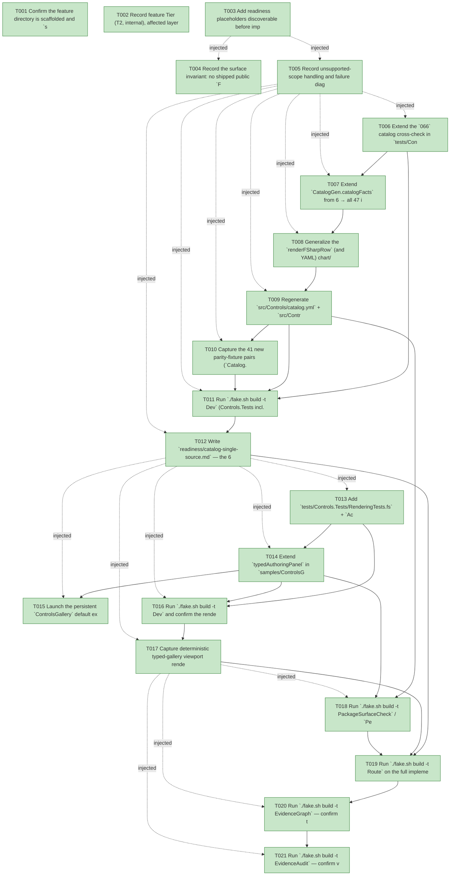

# Task Graph — 071-typed-controls-followups

## ✓ Graph is acyclic and consistent

## Skill Match Assessments

| Task | Candidate | Confidence | Signals | Reviewer disposition | Diagnostic |
|------|-----------|------------|---------|----------------------|------------|
| T001 | (none) | none |  | accepted-empty | T001: skillist trusted as declared; no owns-based capability requirement |
| T002 | (none) | none |  | accepted-empty | T002: skillist trusted as declared; no owns-based capability requirement |
| T003 | (none) | none |  | accepted-empty | T003: skillist trusted as declared; no owns-based capability requirement |
| T004 | (none) | none |  | accepted-empty | T004: skillist trusted as declared; no owns-based capability requirement |
| T005 | (none) | none |  | accepted-empty | T005: skillist trusted as declared; no owns-based capability requirement |
| T006 | (none) | none |  | declared | T006: skillist trusted as declared; no owns-based capability requirement |
| T007 | (none) | none |  | declared | T007: skillist trusted as declared; no owns-based capability requirement |
| T008 | (none) | none |  | declared | T008: skillist trusted as declared; no owns-based capability requirement |
| T009 | (none) | none |  | declared | T009: skillist trusted as declared; no owns-based capability requirement |
| T010 | (none) | none |  | declared | T010: skillist trusted as declared; no owns-based capability requirement |
| T011 | (none) | none |  | accepted-empty | T011: skillist trusted as declared; no owns-based capability requirement |
| T012 | (none) | none |  | accepted-empty | T012: skillist trusted as declared; no owns-based capability requirement |
| T013 | (none) | none |  | declared | T013: skillist trusted as declared; no owns-based capability requirement |
| T014 | (none) | none |  | declared | T014: skillist trusted as declared; no owns-based capability requirement |
| T015 | (none) | none |  | declared | T015: skillist trusted as declared; no owns-based capability requirement |
| T016 | (none) | none |  | accepted-empty | T016: skillist trusted as declared; no owns-based capability requirement |
| T017 | (none) | none |  | declared | T017: skillist trusted as declared; no owns-based capability requirement |
| T018 | (none) | none |  | accepted-empty | T018: skillist trusted as declared; no owns-based capability requirement |
| T019 | (none) | none |  | accepted-empty | T019: skillist trusted as declared; no owns-based capability requirement |
| T020 | speckit-evidence-graph | high | owns:graph-validation | accepted | T020: owns graph-validation requires skill speckit-evidence-graph; trigger_group=owns; matched_trigger=owns:graph-validation |
| T021 | speckit-evidence-audit | high | owns:evidence-audit | accepted | T021: owns evidence-audit requires skill speckit-evidence-audit; trigger_group=owns; matched_trigger=owns:evidence-audit |

## Status counts (effective)

| Status | Count |
|--------|-------|
| [X] done | 21 |
| [S] synthetic | 0 |
| [S*] auto-synthetic | 0 |
| accepted [SEH] synthetic | 0 |
| unaccepted synthetic | 0 |

## Graph



## ASCII view

```
T001 [X] Confirm the feature directory is scaffolded and `spec.md` / `plan.md` / `research.md` / `data-model.md` / `quickstart.md` / `contracts/` are linked and current
T002 [X] Record feature Tier (T2, internal), affected layer (build-side fact table + generated governance artifacts + tests/sample/evidence — no shipped public `.fsi`), public-API impact (none; additive-only per-package surface), Elmish/MVU applicability (**Principle IV not applicable** — reuses `070` façades, no new `Model`/`Msg`/`Effect`, no I/O added to any `update`), and the evidence obligations (`readiness/catalog-single-source.md`, `readiness/controls-rendering.md`, parity fixtures under `specs/066-typed-catalog-generation/readiness/parity-fixtures/`, gate evidence) — recorded in `readiness/feature-scope.md`
T003 [X] Add readiness placeholders discoverable before implementation: `readiness/catalog-single-source.md`, `readiness/controls-rendering.md`, `readiness/governance-risk-levels.md`, `readiness/runtime-limitations.md`, `readiness/skill-loading-evidence-workflow.md`, `readiness/evidence-graph.md`, `readiness/evidence-audit.md` — each naming its authoritative command, artifact path, failure class, and next action
T004 [X] Record the surface invariant: no shipped public `FS.Skia.UI.Controls` `.fsi` signature changes (the 41 typed modules shipped in `070`); the catalog single source (`catalog.yml`/`Catalog.fs`) and the fact table are generated/internal cross-check inputs, so the per-package surface baseline delta MUST be additive-only or empty (FR-010, SC-007, contract C11)
T005 [X] Record unsupported-scope handling and failure diagnostics in `readiness/runtime-limitations.md`: the currency gate names the stale `typed-catalog/<id>` region + the `./fake.sh build -t RefreshSurfaceBaselines` command on drift; the `066` fixture-iteration names the missing fixture id on a gap; render evidence is render-only (no GPU window) through the `Widget.toControl` IR path — and the deferred-scope boundary (no catalog expansion / overlays / virtualization / motion, FR-011)
T006 [X] Extend the `066` catalog cross-check in `tests/Controls.Tests/CatalogTests.fs`: grow `typedPropsById` toward all 47 typed ids and assert `catalogFacts` ids == typed ids, each non-`custom-control` `requiredAttribute` PascalCased ∈ that control's `Props` fields, `custom-control` excluded from the Props-field assertion, and one fixture exists per fact — confirm RED on the 6-fact table / missing fixtures (contracts C8/C9/C10, SC-003)
T007 [X] Extend `CatalogGen.catalogFacts` from 6 → all 47 ids in `build/Governance/CatalogGen.fs`, copying each control's facts (id, display name, category, module, purpose, required attributes, events, accessibility role) from the matching hand-maintained row; set `RequiredAttributes = []` for `custom-control` (FR-001/FR-006, contract C6)
T008 [X] Generalize the `renderFSharpRow` (and YAML) chart/data-grid evidence special-case from `fact.Id = "data-grid"` to membership in `{ data-grid; line-chart; bar-chart; pie-chart; scatter-plot; graph-view }` so exactly those six rows append `|> withChartDataGridEvidence` / the YAML evidence path and no other row does (FR-004, contracts C4/C5)
T009 [X] Regenerate `src/Controls/catalog.yml` + `src/Controls/Catalog.fs` via `./fake.sh build -t RefreshSurfaceBaselines`; confirm 47 generator-emitted `BEGIN/END GENERATED: typed-catalog/<id>` regions, **zero** rows hand-maintained outside markers, and that the 41 new regions' inner bytes match the previously hand-maintained rows (markers-only diff) (FR-001/FR-002, contracts C1/C7, SC-001)
T010 [X] Capture the 41 new parity-fixture pairs (`Catalog.fs.<id>.txt` + `catalog.yml.<id>.txt`, 82 files) into `specs/066-typed-catalog-generation/readiness/parity-fixtures/` from real `renderFSharpRow` / `renderYamlRow` output, trailing newline trimmed as the test does (FR-005, data-model E5)
T011 [X] Run `./fake.sh build -t Dev` (Controls.Tests incl. `CatalogTests.fs` green over 47) then prove the currency gate bites: hand-edit one generated region, run `ControlsCatalogGenerationCheck`, confirm it fails naming the stale `typed-catalog/<id>` region + the regen command; revert and confirm green (FR-003, contracts C2/C3, SC-002)
T012 [X] Write `readiness/catalog-single-source.md` — the 6→47 fact-table extension, the regeneration rationale, the six evidence-carrying ids the special-case covers, and the statement that all 47 rows are generated (zero hand-maintained)
T013 [X] Add `tests/Controls.Tests/RenderingTests.fs` + `AccessibilityTests.fs` cases that render/assert the typed gallery panel at ≥2 viewports through the existing render path (mirroring the existing viewport-coverage + typed-vs-legacy parity tests); confirm RED before the panel exists (contracts G5/G6/G7, FR-008, SC-005)
T014 [X] Extend `typedAuthoringPanel` in `samples/ControlsGallery/Program.fs` from {TextBlock, Button, CheckBox} to ≥1 control per mechanic group (display, input, stateful input, layout container, navigation/composite, overlay, selection collection, charts/graph) authored **only** through `FS.Skia.UI.Controls.Typed.*` `view` functions — no `Attr`, no `*.create` call; stateful controls reuse the shipped `070` MVU models. Resolve "≥1 per group" against the **mechanic-group → catalog `Category` crosswalk** in `contracts/typed-gallery-panel.contract.md` (the 8 gallery groups map onto the 11-value catalog taxonomy; `data`/`feedback`/`custom` are not required groups) (FR-007/SC-004, contracts G1/G2/G4)
T015 [X] Launch the persistent `ControlsGallery` default executable and confirm the typed-authored panel renders alongside the existing panels as a real render/interaction smoke over the migrated surface (FR-007 AS2, contract G3) — this is the user-reachable entry point required for `[X]` on US2
T016 [X] Run `./fake.sh build -t Dev` and confirm the rendering + accessibility suites pass over the typed panel at ≥2 viewports with expected accessibility roles (FR-008, contracts G5/G6, SC-005)
T017 [X] Capture deterministic typed-gallery viewport render evidence to `readiness/controls-rendering.md` — render-only, ≥2 viewports, **no** `[S]`/`[S*]` disclosure; re-run the capture and confirm byte-identical output. Record the per-group satisfying control ids (per the `Category` crosswalk) so SC-004 coverage is auditable from the evidence (FR-009/SC-006, contracts G8/G9/G10)
T018 [X] Run `./fake.sh build -t PackageSurfaceCheck` / `PerPackageSurfaceDiff` and confirm the `FS.Skia.UI.Controls` per-package surface baseline delta is additive-only or empty — no shipped public signature changed (FR-010/SC-007, contract C11)
T019 [X] Run `./fake.sh build -t Route` on the full implementation diff and run **exactly** the gates it prints, FAKE-backed targets sequentially in deterministic order (`Dev`, `GeneratedGuidanceCheck`, `TemplateCheck`, `GeneratedProductCheck`, `EvidenceGraph`, `EvidenceAudit` when escalated); record the aggregate non-authoritative result under `readiness/logs/` (SC-008)
T020 [X] Run `./fake.sh build -t EvidenceGraph` — confirm the DAG is acyclic with no dangling refs and no `[S*]` surprises, the echoed `feature-directory=` / `tasks=` match this feature, and write `readiness/evidence-graph.md`
T021 [X] Run `./fake.sh build -t EvidenceAudit` — confirm verdict **PASS** with no `[S]`/`[S*]` disclosures, and write `readiness/evidence-audit.md`
```

## Injected checkpoint edges (Phase N+1 → Phase N) — FR-007

- T003 → T004  (auto-injected Phase-checkpoint edge)
- T003 → T005  (auto-injected Phase-checkpoint edge)
- T005 → T006  (auto-injected Phase-checkpoint edge)
- T005 → T007  (auto-injected Phase-checkpoint edge)
- T005 → T008  (auto-injected Phase-checkpoint edge)
- T005 → T009  (auto-injected Phase-checkpoint edge)
- T005 → T010  (auto-injected Phase-checkpoint edge)
- T005 → T011  (auto-injected Phase-checkpoint edge)
- T005 → T012  (auto-injected Phase-checkpoint edge)
- T012 → T013  (auto-injected Phase-checkpoint edge)
- T012 → T014  (auto-injected Phase-checkpoint edge)
- T012 → T015  (auto-injected Phase-checkpoint edge)
- T012 → T016  (auto-injected Phase-checkpoint edge)
- T012 → T017  (auto-injected Phase-checkpoint edge)
- T017 → T018  (auto-injected Phase-checkpoint edge)
- T017 → T020  (auto-injected Phase-checkpoint edge)
- T017 → T021  (auto-injected Phase-checkpoint edge)

## Resolved skillist ids — FR-007

Resolved skillist-id set (6): fs-skia-evidence-mode, fs-skia-typed-controls, fs-skia-ui-widgets, fsharp-code-generation, speckit-evidence-audit, speckit-evidence-graph

