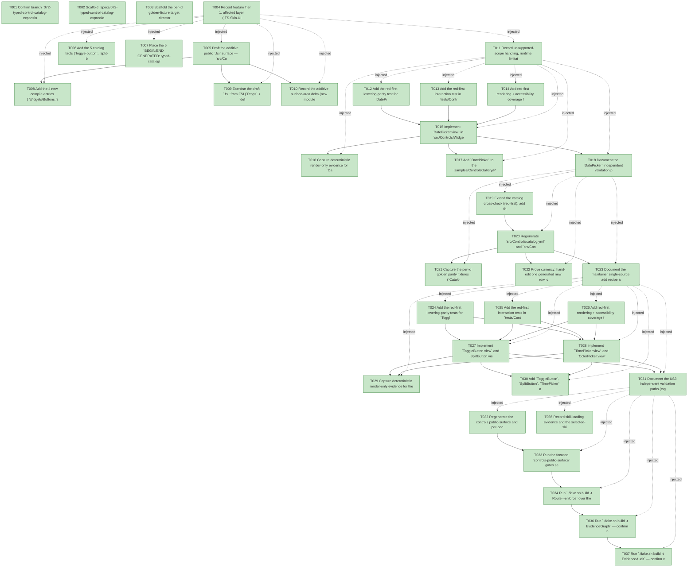

# Task Graph — 072-typed-control-catalog-expansion

## ✓ Graph is acyclic and consistent

## Skill Match Assessments

| Task | Candidate | Confidence | Signals | Reviewer disposition | Diagnostic |
|------|-----------|------------|---------|----------------------|------------|
| T001 | (none) | none |  | accepted-empty | T001: skillist trusted as declared; no owns-based capability requirement |
| T002 | (none) | none |  | accepted-empty | T002: skillist trusted as declared; no owns-based capability requirement |
| T003 | (none) | none |  | accepted-empty | T003: skillist trusted as declared; no owns-based capability requirement |
| T004 | (none) | none |  | declared | T004: skillist trusted as declared; no owns-based capability requirement |
| T005 | (none) | none |  | declared | T005: skillist trusted as declared; no owns-based capability requirement |
| T006 | (none) | none |  | declared | T006: skillist trusted as declared; no owns-based capability requirement |
| T007 | (none) | none |  | declared | T007: skillist trusted as declared; no owns-based capability requirement |
| T008 | (none) | none |  | declared | T008: skillist trusted as declared; no owns-based capability requirement |
| T009 | (none) | none |  | accepted-empty | T009: skillist trusted as declared; no owns-based capability requirement |
| T010 | (none) | none |  | declared | T010: skillist trusted as declared; no owns-based capability requirement |
| T011 | (none) | none |  | declared | T011: skillist trusted as declared; no owns-based capability requirement |
| T012 | (none) | none |  | declared | T012: skillist trusted as declared; no owns-based capability requirement |
| T013 | (none) | none |  | declared | T013: skillist trusted as declared; no owns-based capability requirement |
| T014 | (none) | none |  | declared | T014: skillist trusted as declared; no owns-based capability requirement |
| T015 | (none) | none |  | declared | T015: skillist trusted as declared; no owns-based capability requirement |
| T016 | (none) | none |  | declared | T016: skillist trusted as declared; no owns-based capability requirement |
| T017 | (none) | none |  | declared | T017: skillist trusted as declared; no owns-based capability requirement |
| T018 | (none) | none |  | accepted-empty | T018: skillist trusted as declared; no owns-based capability requirement |
| T019 | (none) | none |  | declared | T019: skillist trusted as declared; no owns-based capability requirement |
| T020 | (none) | none |  | declared | T020: skillist trusted as declared; no owns-based capability requirement |
| T021 | (none) | none |  | declared | T021: skillist trusted as declared; no owns-based capability requirement |
| T022 | (none) | none |  | declared | T022: skillist trusted as declared; no owns-based capability requirement |
| T023 | (none) | none |  | accepted-empty | T023: skillist trusted as declared; no owns-based capability requirement |
| T024 | (none) | none |  | declared | T024: skillist trusted as declared; no owns-based capability requirement |
| T025 | (none) | none |  | declared | T025: skillist trusted as declared; no owns-based capability requirement |
| T026 | (none) | none |  | declared | T026: skillist trusted as declared; no owns-based capability requirement |
| T027 | (none) | none |  | declared | T027: skillist trusted as declared; no owns-based capability requirement |
| T028 | (none) | none |  | declared | T028: skillist trusted as declared; no owns-based capability requirement |
| T029 | (none) | none |  | declared | T029: skillist trusted as declared; no owns-based capability requirement |
| T030 | (none) | none |  | declared | T030: skillist trusted as declared; no owns-based capability requirement |
| T031 | (none) | none |  | accepted-empty | T031: skillist trusted as declared; no owns-based capability requirement |
| T032 | (none) | none |  | declared | T032: skillist trusted as declared; no owns-based capability requirement |
| T033 | (none) | none |  | declared | T033: skillist trusted as declared; no owns-based capability requirement |
| T034 | (none) | none |  | declared | T034: skillist trusted as declared; no owns-based capability requirement |
| T035 | (none) | none |  | accepted-empty | T035: skillist trusted as declared; no owns-based capability requirement |
| T036 | speckit-evidence-graph | high | owns:graph-validation | accepted | T036: owns graph-validation requires skill speckit-evidence-graph; trigger_group=owns; matched_trigger=owns:graph-validation |
| T037 | speckit-evidence-audit | high | owns:evidence-audit | accepted | T037: owns evidence-audit requires skill speckit-evidence-audit; trigger_group=owns; matched_trigger=owns:evidence-audit |

## Status counts (effective)

| Status | Count |
|--------|-------|
| [X] done | 37 |
| [S] synthetic | 0 |
| [S*] auto-synthetic | 0 |
| accepted [SEH] synthetic | 0 |
| unaccepted synthetic | 0 |

## Graph



## ASCII view

```
T001 [X] Confirm branch `072-typed-control-catalog-expansion` and link spec, plan, research, data-model, and quickstart in `specs/072-typed-control-catalog-expansion/`
T002 [X] Scaffold `specs/072-typed-control-catalog-expansion/readiness/` with the audit-enforced placeholder files discoverable before implementation: `typed-controls-front-door.md`, `package-surface-expectations.md`, `controls-rendering.md`, `typed-lowering-parity.md`, `control-catalog-generation.md`, `catalog-single-source.md`, `governance-risk-levels.md`, `aggregate-hang-diagnostics.md`, `runtime-limitations.md`, `skill-loading-evidence.md`, `evidence-graph.md`, `evidence-audit.md` — each naming the authoritative command, artifact path, failure class, and next action
T003 [X] Scaffold the per-id golden-fixture target directory `specs/066-typed-catalog-generation/readiness/parity-fixtures/` and the `072` parity matrix slot for the 5 new ids (`toggle-button`, `split-button`, `date-picker`, `time-picker`, `color-picker`)
T004 [X] Record feature Tier 1, affected layer (`FS.Skia.UI.Controls`), additive public-API impact, Principle IV applicability (no new `Model`/`Msg`/`Effect` — values product-owned in `Props`, mirroring `CheckBox`), and the **no-`[S]`** evidence obligations in `readiness/typed-controls-front-door.md`
T005 [X] Draft the additive public `.fsi` surface — `src/Controls/Widgets/Buttons.fsi` (`ToggleButton`, `SplitButton`, `SplitButtonItem`) and `src/Controls/Widgets/Pickers.fsi` (`DatePicker`, `TimePicker`, `ColorPicker`, `ColorSwatch`): each `Props<'msg>` record, `defaults`, and `view : Props<'msg> -> Widget<'msg>` per `data-model.md`; no existing signature changes
T006 [X] Add the 5 catalog facts (`toggle-button`, `split-button`, `date-picker`, `time-picker`, `color-picker`) to `build/Governance/CatalogGen.fs` `catalogFacts` (47→52) with their `Module` / category / `RequiredAttributes` / `Events` / `AccessibilityRole` per `data-model.md` — the single source; no generator-mechanism change
T007 [X] Place the 5 `BEGIN/END GENERATED: typed-catalog/<id>` marker pairs in `src/Controls/catalog.yml` and `src/Controls/Catalog.fs` so the splice has regions to replace (generation itself is proven in US2)
T008 [X] Add the 4 new compile entries (`Widgets/Buttons.fsi`, `Widgets/Buttons.fs`, `Widgets/Pickers.fsi`, `Widgets/Pickers.fs`) to `src/Controls/Controls.fsproj` after the existing `Widgets/*` block
T009 [X] Exercise the draft `.fsi` from FSI (`Props` + `defaults` for each of the 5 modules) and capture the session transcript to `readiness/fsi-session.txt`
T010 [X] Record the additive surface-area delta (new modules / `Props` records / `SplitButtonItem` / `ColorSwatch`) and the regenerated-baseline rationale in `readiness/package-surface-expectations.md`
T011 [X] Record unsupported-scope handling, runtime limitations, the small/medium/broad governance risk levels, and aggregate-hang diagnostics in `readiness/runtime-limitations.md`, `readiness/governance-risk-levels.md`, and `readiness/aggregate-hang-diagnostics.md`
T012 [X] Add the red-first lowering-parity test for `DatePicker` in `tests/Controls.Tests/TypedExpansionTests.fs` — `DatePicker.view props |> Widget.toControl` ≡ the explicit hand-written composition of existing legacy builders (field + trigger `Button` + `Overlay` calendar `Stack`/`Grid` of day `Button`s), order-normalized, events canonicalized (SC-002)
T013 [X] Add the red-first interaction test in `tests/Controls.Tests/InteractionTests.fs` — selecting a day dispatches `OnChange` carrying the chosen `DateOnly`; `Value = None` renders an empty field and dispatches nothing; `OnChange = None` lowers to no binding
T014 [X] Add red-first rendering + accessibility coverage for `DatePicker` at ≥2 viewports (role `TextBox`, keyboard affordance — focusable trigger + activation/arrow keys, stable node counts) in `tests/Controls.Tests/RenderingTests.fs` and `tests/Controls.Tests/AccessibilityTests.fs`
T015 [X] Implement `DatePicker.view` in `src/Controls/Widgets/Pickers.fs` composing existing legacy builders only (no new `StandardControlKind` variant): `Border`/`Stack` of [ field showing the formatted `Value` or placeholder; trigger `Button` ] plus an `Overlay` calendar popup when `IsOpen`; green T012–T014 (SC-001, SC-007)
T016 [X] Capture deterministic render-only evidence for `DatePicker` and record it in `readiness/controls-rendering.md`, plus the real-lowering parity statement (explicitly **no `[S]`**) in `readiness/typed-controls-front-door.md`
T017 [X] Add `DatePicker` to the `samples/ControlsGallery/Program.fs` `typedAuthoringPanel` so the date-time front door is dogfooded end-to-end (FR-010)
T018 [X] Document the `DatePicker` independent validation path (author panel → render ≥2 viewports → parity → `OnChange` dispatch) in `readiness/typed-controls-front-door.md`
T019 [X] Extend the catalog cross-check (red-first): add the 5 new ids to `typedPropsById` (each id → its `*Props` type, with every `RequiredAttributes` entry PascalCased present as a `Props` field) and bump the `supportedCount` assertion 47→52 in `tests/Controls.Tests/CatalogTests.fs` (SC-003)
T020 [X] Regenerate `src/Controls/catalog.yml` and `src/Controls/Catalog.fs` from the fact table via `./fake.sh build -t RefreshSurfaceBaselines`, bump the `catalog.yml` `supportedCount` header 47→52, and confirm the 5 new rows appear in both artifacts (no row hand-edited)
T021 [X] Capture the per-id golden parity fixtures (`Catalog.fs.<id>.txt` + `catalog.yml.<id>.txt`) for the 5 new ids under `specs/066-typed-catalog-generation/readiness/parity-fixtures/`; record a pointer to this cross-feature fixture location in `readiness/typed-lowering-parity.md` so the coupling is discoverable (066 archival must keep these)
T022 [X] Prove currency: hand-edit one generated new row, confirm `./fake.sh build -t ControlsCatalogGenerationCheck` fails naming the stale `typed-catalog/<id>` region, then revert and confirm it passes; record the proof in `readiness/control-catalog-generation.md` (SC-003)
T023 [X] Document the maintainer single-source add recipe and US2 independent validation path in `readiness/catalog-single-source.md`
T024 [X] Add the red-first lowering-parity tests for `ToggleButton`, `SplitButton`, `TimePicker`, and `ColorPicker` in `tests/Controls.Tests/TypedExpansionTests.fs` — each `view |> Widget.toControl` ≡ its explicit existing-builder composition, order-normalized, events canonicalized (SC-002)
T025 [X] Add the red-first interaction tests in `tests/Controls.Tests/InteractionTests.fs` — `ToggleButton` `OnToggle (not IsOn)`; `SplitButton` `OnClick` + `OnSelected key`; `ColorPicker` `OnSelected swatch`; `TimePicker` `OnChange time`; empty `Items`/`Swatches` lower to an empty/disabled popup (must not fail to lower); `None` callbacks lower to no binding
T026 [X] Add red-first rendering + accessibility coverage for the 4 controls at ≥2 viewports with roles `Button` / `Menu` / `TextBox` / `List`, each control's keyboard affordance (focusable trigger + activation/arrow keys) asserted, and stable node counts in `tests/Controls.Tests/RenderingTests.fs` and `tests/Controls.Tests/AccessibilityTests.fs`
T027 [X] Implement `ToggleButton.view` and `SplitButton.view` in `src/Controls/Widgets/Buttons.fs` — product-owned `IsOn` boolean and `Items`/`IsOpen` command-list + `Overlay`/`Menu`; composed from existing builders only, no new `Model`/`Msg`/`Effect`; green T024–T026 (SC-001, SC-007)
T028 [X] Implement `TimePicker.view` and `ColorPicker.view` in `src/Controls/Widgets/Pickers.fs` — `TimeOnly` segment composition and a `Wrap`/`Grid` of `FS.Skia.UI.Scene.Color` swatch cells (`Selected` highlighted); composed from existing builders only; green T024–T026 (SC-001, SC-007)
T029 [X] Capture deterministic render-only evidence for the 4 controls; extend `readiness/controls-rendering.md` and complete the 5-control parity matrix in `readiness/typed-lowering-parity.md` (explicitly **no `[S]`**)
T030 [X] Add `ToggleButton`, `SplitButton`, `TimePicker`, and `ColorPicker` to the `samples/ControlsGallery/Program.fs` `typedAuthoringPanel` (FR-010)
T031 [X] Document the US3 independent validation paths (toggle pressed-state, split-button popup menu, swatch grid selection, time segments) in `readiness/typed-controls-front-door.md`
T032 [X] Regenerate the controls public-surface and per-package surface baselines (`./fake.sh build -t RefreshSurfaceBaselines` + `PerPackageSurface.captureCurrent`) and confirm the only delta is additions via `PackageSurfaceCheck` / `PerPackageSurfaceDiff`; record `readiness/per-package-surface-diff.md` (SC-004)
T033 [X] Run the focused `controls-public-surface` gates sequentially — `Dev`, `ControlsCatalogGenerationCheck`, `ControlsCatalogCheck`, `ControlsInteractionCheck`, `ControlsRenderingCheck`, `PackageSurfaceCheck`, `FsiTranscripts`, `DesignTokenDrift` — and record the focused-gate list plus non-authoritative aggregate notes in `readiness/focused-gates.md`
T034 [X] Run `./fake.sh build -t Route --enforce` over the branch diff; confirm escalation to `controls-public-surface` and that every required evidence artifact is present and populated (SC-006, SC-007)
T035 [X] Record skill-loading evidence and the selected-skills set in `readiness/skill-loading-evidence.md`
T036 [X] Run `./fake.sh build -t EvidenceGraph` — confirm no cycles, no dangling refs, no `[S*]` surprises; record `readiness/evidence-graph.md`
T037 [X] Run `./fake.sh build -t EvidenceAudit` — confirm verdict PASS with no synthetic disclosures; record `readiness/evidence-audit.md` (SC-006)
```

## Injected checkpoint edges (Phase N+1 → Phase N) — FR-007

- T004 → T005  (auto-injected Phase-checkpoint edge)
- T004 → T006  (auto-injected Phase-checkpoint edge)
- T004 → T007  (auto-injected Phase-checkpoint edge)
- T004 → T008  (auto-injected Phase-checkpoint edge)
- T004 → T009  (auto-injected Phase-checkpoint edge)
- T004 → T010  (auto-injected Phase-checkpoint edge)
- T004 → T011  (auto-injected Phase-checkpoint edge)
- T011 → T012  (auto-injected Phase-checkpoint edge)
- T011 → T013  (auto-injected Phase-checkpoint edge)
- T011 → T014  (auto-injected Phase-checkpoint edge)
- T011 → T015  (auto-injected Phase-checkpoint edge)
- T011 → T016  (auto-injected Phase-checkpoint edge)
- T011 → T017  (auto-injected Phase-checkpoint edge)
- T011 → T018  (auto-injected Phase-checkpoint edge)
- T018 → T019  (auto-injected Phase-checkpoint edge)
- T018 → T020  (auto-injected Phase-checkpoint edge)
- T018 → T021  (auto-injected Phase-checkpoint edge)
- T018 → T022  (auto-injected Phase-checkpoint edge)
- T018 → T023  (auto-injected Phase-checkpoint edge)
- T023 → T024  (auto-injected Phase-checkpoint edge)
- T023 → T025  (auto-injected Phase-checkpoint edge)
- T023 → T026  (auto-injected Phase-checkpoint edge)
- T023 → T027  (auto-injected Phase-checkpoint edge)
- T023 → T028  (auto-injected Phase-checkpoint edge)
- T023 → T029  (auto-injected Phase-checkpoint edge)
- T023 → T030  (auto-injected Phase-checkpoint edge)
- T023 → T031  (auto-injected Phase-checkpoint edge)
- T031 → T032  (auto-injected Phase-checkpoint edge)
- T031 → T033  (auto-injected Phase-checkpoint edge)
- T031 → T034  (auto-injected Phase-checkpoint edge)
- T031 → T035  (auto-injected Phase-checkpoint edge)
- T031 → T036  (auto-injected Phase-checkpoint edge)
- T031 → T037  (auto-injected Phase-checkpoint edge)

## Resolved skillist ids — FR-007

Resolved skillist-id set (7): fs-skia-evidence-mode, fs-skia-typed-controls, fs-skia-ui-widgets, fsharp-build-orchestration, fsharp-code-generation, speckit-evidence-audit, speckit-evidence-graph

