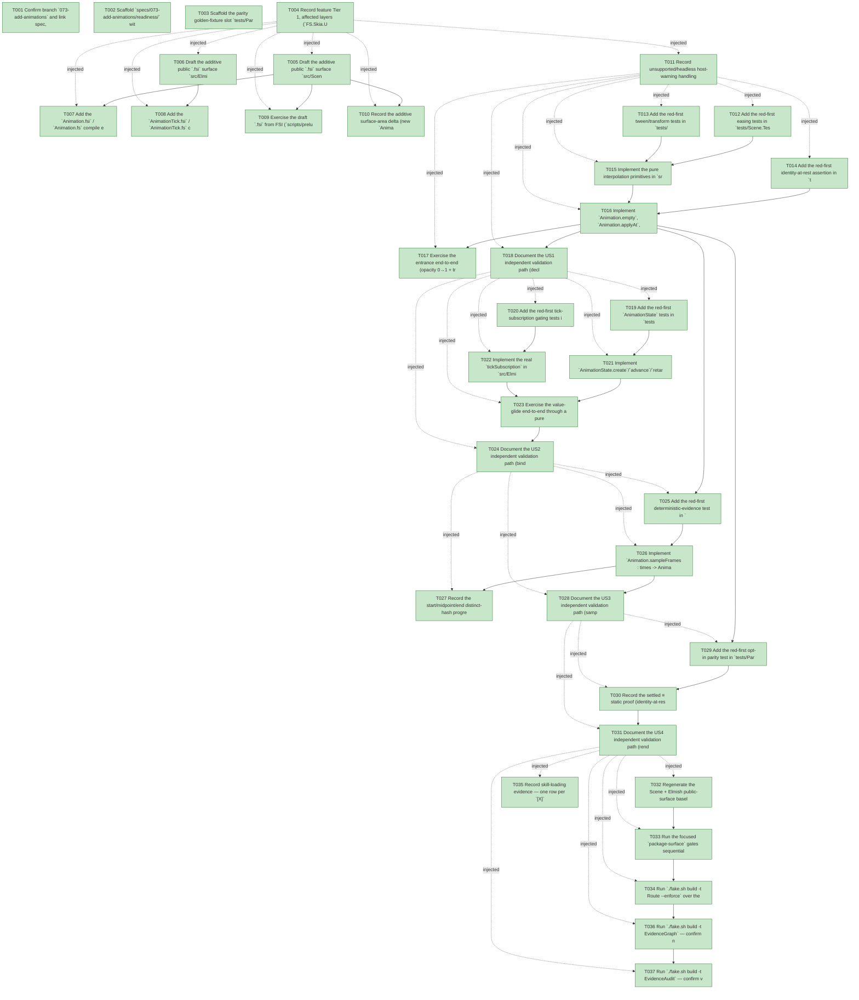

# Task Graph — 073-add-animations

## ✓ Graph is acyclic and consistent

## Skill Match Assessments

| Task | Candidate | Confidence | Signals | Reviewer disposition | Diagnostic |
|------|-----------|------------|---------|----------------------|------------|
| T001 | (none) | none |  | accepted-empty | T001: skillist trusted as declared; no owns-based capability requirement |
| T002 | (none) | none |  | accepted-empty | T002: skillist trusted as declared; no owns-based capability requirement |
| T003 | (none) | none |  | accepted-empty | T003: skillist trusted as declared; no owns-based capability requirement |
| T004 | (none) | none |  | declared | T004: skillist trusted as declared; no owns-based capability requirement |
| T005 | (none) | none |  | declared | T005: skillist trusted as declared; no owns-based capability requirement |
| T006 | (none) | none |  | declared | T006: skillist trusted as declared; no owns-based capability requirement |
| T007 | (none) | none |  | declared | T007: skillist trusted as declared; no owns-based capability requirement |
| T008 | (none) | none |  | declared | T008: skillist trusted as declared; no owns-based capability requirement |
| T009 | (none) | none |  | accepted-empty | T009: skillist trusted as declared; no owns-based capability requirement |
| T010 | (none) | none |  | declared | T010: skillist trusted as declared; no owns-based capability requirement |
| T011 | (none) | none |  | declared | T011: skillist trusted as declared; no owns-based capability requirement |
| T012 | (none) | none |  | declared | T012: skillist trusted as declared; no owns-based capability requirement |
| T013 | (none) | none |  | declared | T013: skillist trusted as declared; no owns-based capability requirement |
| T014 | (none) | none |  | declared | T014: skillist trusted as declared; no owns-based capability requirement |
| T015 | (none) | none |  | declared | T015: skillist trusted as declared; no owns-based capability requirement |
| T016 | (none) | none |  | declared | T016: skillist trusted as declared; no owns-based capability requirement |
| T017 | (none) | none |  | declared | T017: skillist trusted as declared; no owns-based capability requirement |
| T018 | (none) | none |  | accepted-empty | T018: skillist trusted as declared; no owns-based capability requirement |
| T019 | (none) | none |  | declared | T019: skillist trusted as declared; no owns-based capability requirement |
| T020 | (none) | none |  | declared | T020: skillist trusted as declared; no owns-based capability requirement |
| T021 | (none) | none |  | declared | T021: skillist trusted as declared; no owns-based capability requirement |
| T022 | (none) | none |  | declared | T022: skillist trusted as declared; no owns-based capability requirement |
| T023 | (none) | none |  | declared | T023: skillist trusted as declared; no owns-based capability requirement |
| T024 | (none) | none |  | accepted-empty | T024: skillist trusted as declared; no owns-based capability requirement |
| T025 | (none) | none |  | declared | T025: skillist trusted as declared; no owns-based capability requirement |
| T026 | (none) | none |  | declared | T026: skillist trusted as declared; no owns-based capability requirement |
| T027 | (none) | none |  | declared | T027: skillist trusted as declared; no owns-based capability requirement |
| T028 | (none) | none |  | accepted-empty | T028: skillist trusted as declared; no owns-based capability requirement |
| T029 | (none) | none |  | declared | T029: skillist trusted as declared; no owns-based capability requirement |
| T030 | (none) | none |  | declared | T030: skillist trusted as declared; no owns-based capability requirement |
| T031 | (none) | none |  | accepted-empty | T031: skillist trusted as declared; no owns-based capability requirement |
| T032 | (none) | none |  | declared | T032: skillist trusted as declared; no owns-based capability requirement |
| T033 | (none) | none |  | declared | T033: skillist trusted as declared; no owns-based capability requirement |
| T034 | (none) | none |  | declared | T034: skillist trusted as declared; no owns-based capability requirement |
| T035 | (none) | none |  | accepted-empty | T035: skillist trusted as declared; no owns-based capability requirement |
| T036 | speckit-evidence-graph | high | owns:graph-validation | accepted | T036: owns graph-validation requires skill speckit-evidence-graph; trigger_group=owns; matched_trigger=owns:graph-validation |
| T037 | speckit-evidence-audit | high | owns:evidence-audit | accepted | T037: owns evidence-audit requires skill speckit-evidence-audit; trigger_group=owns; matched_trigger=owns:evidence-audit |

## Status counts (effective)

| Status | Count |
|--------|-------|
| [X] done | 37 |
| [S] synthetic | 0 |
| [S*] auto-synthetic | 0 |
| accepted [SEH] synthetic | 0 |
| unaccepted synthetic | 0 |

## Graph



## ASCII view

```
T001 [X] Confirm branch `073-add-animations` and link spec, plan, research, data-model, quickstart, and the two contracts in `specs/073-add-animations/`
T002 [X] Scaffold `specs/073-add-animations/readiness/` with the audit-enforced placeholder files discoverable before implementation: `animation-front-door.md`, `deterministic-sampling.md`, `settled-static-parity.md`, `redraw-gating.md`, `package-surface-expectations.md`, `per-package-surface-diff.md`, `governance-risk-levels.md`, `aggregate-hang-diagnostics.md`, `runtime-limitations.md`, `skill-loading-evidence.md`, `evidence-graph.md`, `evidence-audit.md` — each naming the authoritative command, artifact path, failure class, and next action
T003 [X] Scaffold the parity golden-fixture slot `tests/Parity.Tests/fixtures/v3-host-golden/scene-output/` for the `animation-*.txt` frame hashes (the captured goldens land in US3)
T004 [X] Record feature Tier 1, affected layers (`FS.Skia.UI.Scene` core + additive `FS.Skia.UI.Elmish` tick helper), additive public-API impact, Principle IV applicability (author-owned `AnimationState`, `AnimationTick` message, tick subscription at the interpreter edge — no hidden registry), and the **no-`[S]`** evidence obligations in `readiness/animation-front-door.md`
T005 [X] Draft the additive public `.fsi` surface `src/Scene/Animation.fsi` per `contracts/animation-surface.contract.md` — value types (`Easing`, `Transform`, `Tween<'a>`, `Animation`, `AnimationState<'a>`) and the `Easing` / `Transform` / `Color` / `Tween` / `Animation` / `AnimationState` module signatures plus `lerpFloat`, including `Easing.Default = EaseInOut` (the **FR-003** documented default authors reference for an unspecified curve). Note: `Tween.Easing` / `Tween.Duration` are mandatory record fields — the spec Assumptions' "short default duration" is quickstart guidance (e.g. 300 ms), not an omitted-field API default. No existing `FS.Skia.UI.Scene` signature changes shape
T006 [X] Draft the additive public `.fsi` surface `src/Elmish/AnimationTick.fsi` — the `AnimationTick of TimeSpan` message (or wrapper) and `tickSubscription : isAnimating:('model -> bool) -> Sub<'msg>` routed to `AnimationTick`, per `data-model.md`, and land a **compiling stub** `src/Elmish/AnimationTick.fs` (a no-op subscription) so the project builds from foundation onward; the real emit-while-active / settled-silent gating is implemented at T022 (Principle II keeps the `.fsi` complete). No existing `FS.Skia.UI.Elmish` signature changes shape
T007 [X] Add the `Animation.fsi` / `Animation.fs` compile entries to `src/Scene/Scene.fsproj` immediately after `Scene.fs` (the module depends on `Scene`); land `Animation.fs` with **compiling stubs** for the vals filled in by later stories (`AnimationState` → T021, `Animation.sampleFrames` → T026) so each phase ends in a buildable, test-runnable state per the tests-first cycle
T008 [X] Add the `AnimationTick.fsi` / `AnimationTick.fs` compile entries to `src/Elmish/Elmish.fsproj` after the existing subscription block (the `.fs` is the compiling stub from T006; its real gating behavior lands at T022)
T009 [X] Exercise the draft `.fsi` from FSI (`scripts/prelude.fsx` or ad-hoc): `Easing.apply`, `Tween.sample`, `Animation.applyAt`, `AnimationState.create`/`retarget`, and `AnimationTick`/`tickSubscription` shape; capture the session transcript to `readiness/fsi/animation-session.txt`
T010 [X] Record the additive surface-area delta (new `Animation` module in Scene, new `AnimationTick` surface in Elmish, the generic `Tween<'a>` / `AnimationState<'a>` records) and the regenerated-baseline rationale (additions only) in `readiness/package-surface-expectations.md`
T011 [X] Record unsupported/headless host-warning handling (FR-010 — animation falls through the existing benign/blocking/deferred classification; the deterministic-scene path needs no GPU), the small/medium/broad governance risk levels, and aggregate-hang diagnostics in `readiness/runtime-limitations.md`, `readiness/governance-risk-levels.md`, and `readiness/aggregate-hang-diagnostics.md`
T012 [X] Add the red-first easing tests in `tests/Scene.Tests/AnimationTests.fs` — `Easing.apply e 0.0 = 0.0` and `Easing.apply e 1.0 = 1.0` for every case, per-curve monotonicity over `t ∈ [0,1]` (FsCheck), `t` clamped outside the domain, and `Easing.Default = EaseInOut` (the FR-003 documented default for an unspecified curve) (SC-002, FR-003)
T013 [X] Add the red-first tween/transform tests in `tests/Scene.Tests/AnimationTests.fs` — `Tween.progress`/`Tween.sample` clamp `elapsed` to `[0, Duration]`, non-positive `Duration` ⇒ progress `1.0` ⇒ immediate `End` value (no divide-by-zero), `lerpFloat` / `Color.lerp` / `Transform.lerp` per-field bounds, and `Transform.identity`/`isIdentity` (SC-002, SC-007)
T014 [X] Add the red-first identity-at-rest assertion in `tests/Parity.Tests/AnimationOutputTests.fs` — `Animation.applyAt` returns the target scene **unwrapped** (structurally equal to the static node) when sampled opacity `= 1.0` and transform is identity, and wraps in a `PerspectiveNode` only for a non-identity transform (SC-004)
T015 [X] Implement the pure interpolation primitives in `src/Scene/Animation.fs` — `Easing.apply` (cubic ease curves, clamped input, `Easing.Default = EaseInOut`), `lerpFloat`, `Color.lerp` (per-RGBA-byte rounded), `Transform` (`identity`/`isIdentity`/`lerp`/`toPerspectiveTransform` composing translate∘rotate∘scale into the existing 3×3), and `Tween.progress`/`Tween.sample`; green T012–T013
T016 [X] Implement `Animation.empty`, `Animation.applyAt`, and `Animation.isSettled` in `src/Scene/Animation.fs` with the identity-at-rest lowering rule (R5) — fold sampled opacity into `Paint.Opacity`/`Color.Alpha`, lower a non-identity sampled transform to `PerspectiveNode`, and pass the target through unwrapped at identity; green T014 (SC-002, SC-004)
T017 [X] Exercise the entrance end-to-end (opacity 0→1 + translateY 24→0, ease-out, 300ms): drive `Animation.applyAt` at start/midpoint/settle through the deterministic-scene render path, confirm monotonic opacity/position progression and that the settled frame equals the static render with no redraw requested; capture the render-only evidence under `readiness/` and the real-sampling (no `[S]`) statement in `readiness/animation-front-door.md` (SC-001, SC-004)
T018 [X] Document the US1 independent validation path (declare entrance → advance across the duration → start/mid/end monotone frames → settled ≡ static → no idle redraw) in `readiness/animation-front-door.md`, and record the FR-003 default resolution: the documented default curve is `Easing.Default = EaseInOut`, and `Tween.Easing` / `Tween.Duration` are explicit fields (no omitted-field defaulting — the spec Assumptions' "short default duration" is quickstart guidance only)
T019 [X] Add the red-first `AnimationState` tests in `tests/Scene.Tests/AnimationTests.fs` — `create` sets `Current = Start = Target`, `advance` adds the delta capped at `Duration` and recomputes `Current` via easing `Start`→`Target`, `retarget` sets `Start = Current` / `Target = new` / `Elapsed = 0` (no snap-back, including a mid-flight second retarget), and `isActive` is false once settled (SC-006, SC-007)
T020 [X] Add the red-first tick-subscription gating tests in `tests/Elmish.Tests/AnimationTickTests.fs` — `tickSubscription` emits `AnimationTick` deltas while `isAnimating` holds and goes silent once all animations settle (FR-006), and dropping the animating state from the model (removed widget) stops further ticks cleanly (SC-004, SC-007)
T021 [X] Implement `AnimationState.create`/`advance`/`retarget`/`value`/`isActive` in `src/Scene/Animation.fs` (replacing the T007 stubs) as pure transitions over the author-supplied `interp`; green T019 (SC-006)
T022 [X] Implement the real `tickSubscription` in `src/Elmish/AnimationTick.fs` (replacing the T006 no-op stub) — a subscription that yields `AnimationTick` frame deltas only while `isAnimating` holds and self-suspends on settle (redraw gating at the framework-request level, host present loop unchanged); green T020 (FR-006)
T023 [X] Exercise the value-glide end-to-end through a pure `update` (FSI/render): `advance` over ticks toward a target, then a mid-flight `retarget` continuing from the displayed value with no jump back to the original start; capture the evidence and the active-emits/settled-silent observation in `readiness/redraw-gating.md` (SC-006, FR-006)
T024 [X] Document the US2 independent validation path (bind a value to `AnimationState` → dispatch target change → glide → mid-flight retarget without snap-back) in `readiness/animation-front-door.md`
T025 [X] Add the red-first deterministic-evidence test in `tests/Parity.Tests/AnimationOutputTests.fs` — `Animation.sampleFrames` at start/midpoint/end rendered through `SceneEvidence.render` with `RendererMode = "deterministic-scene"` produces **distinct** hashes whose underlying property values move monotonically, and re-rendering the same samples is byte-identical; assert concurrent independent animations each sample without interference (SC-003, SC-007)
T026 [X] Implement `Animation.sampleFrames : times -> Animation -> Scene -> Scene list` in `src/Scene/Animation.fs` (replacing the T007 stub), then capture the golden frame hashes `tests/Parity.Tests/fixtures/v3-host-golden/scene-output/animation-*.txt` via `FS_SKIA_CAPTURE_GOLDEN=1 dotnet test tests/Parity.Tests`; re-run without the env var (and in a fresh process) to prove byte-identical re-capture; green T025 (SC-003)
T027 [X] Record the start/midpoint/end distinct-hash progression and the same-process + fresh-process byte-identical re-capture proof in `readiness/deterministic-sampling.md` (SC-003)
T028 [X] Document the US3 independent validation path (sample at explicit `TimeSpan` points → render through the existing deterministic-scene path → re-render twice and on a fresh process → identical bytes) in `readiness/deterministic-sampling.md`
T029 [X] Add the red-first opt-in parity test in `tests/Parity.Tests/AnimationOutputTests.fs` — a representative existing scene rendered with `Animation.empty` (and with no animation node at all) is byte-identical to today's static deterministic-scene evidence for that scene, and authoring it requires no new parameter (FR-007, SC-005)
T030 [X] Record the settled ≡ static proof (identity-at-rest, FR-006/SC-004) and the un-animated-unchanged proof (FR-007/SC-005) in `readiness/settled-static-parity.md`; green T029 (no new code beyond the T016 identity-at-rest rule)
T031 [X] Document the US4 independent validation path (render a representative existing view with no animation declaration → golden parity vs. current behavior → no animation-related parameter required) in `readiness/settled-static-parity.md`
T032 [X] Regenerate the Scene + Elmish public-surface baselines (`./fake.sh build -t RefreshSurfaceBaselines`) and the per-package `.fsi.txt` snapshots (`PerPackageSurface.captureCurrent`), and confirm the only delta is additions via `PackageSurfaceCheck` / `PerPackageSurfaceDiff`; record `readiness/per-package-surface-diff.md`
T033 [X] Run the focused `package-surface` gates sequentially — `Dev`, `PackageSurfaceCheck`, `FsiTranscripts`, `PerPackageSurfaceDiff` — and record the focused-gate list plus non-authoritative aggregate notes (e.g. `GeneratedProductCheck`'s known local environment failure) in `readiness/package-surface-expectations.md`
T034 [X] Run `./fake.sh build -t Route --enforce` over the branch diff; confirm escalation to the `package-surface` rule and that every required evidence artifact is present and populated
T035 [X] Record skill-loading evidence — one row per `[X]` task with a non-empty `skillist`, each `ResolvedSkillPath` the registry-scanned path (`.agents/skills/<id>/SKILL.md`, or `src/Scene/skill/SKILL.md` / `src/Elmish/skill/SKILL.md` for `fs-skia-scene` / `fs-skia-elmish`) and `LoadedAt` strictly before `WorkStartedAt` — in `readiness/skill-loading-evidence.md`
T036 [X] Run `./fake.sh build -t EvidenceGraph` — confirm no cycles, no dangling refs, no `[S*]` surprises; record `readiness/evidence-graph.md`
T037 [X] Run `./fake.sh build -t EvidenceAudit` — confirm verdict PASS with no synthetic disclosures; record `readiness/evidence-audit.md`
```

## Injected checkpoint edges (Phase N+1 → Phase N) — FR-007

- T004 → T005  (auto-injected Phase-checkpoint edge)
- T004 → T006  (auto-injected Phase-checkpoint edge)
- T004 → T007  (auto-injected Phase-checkpoint edge)
- T004 → T008  (auto-injected Phase-checkpoint edge)
- T004 → T009  (auto-injected Phase-checkpoint edge)
- T004 → T010  (auto-injected Phase-checkpoint edge)
- T004 → T011  (auto-injected Phase-checkpoint edge)
- T011 → T012  (auto-injected Phase-checkpoint edge)
- T011 → T013  (auto-injected Phase-checkpoint edge)
- T011 → T014  (auto-injected Phase-checkpoint edge)
- T011 → T015  (auto-injected Phase-checkpoint edge)
- T011 → T016  (auto-injected Phase-checkpoint edge)
- T011 → T017  (auto-injected Phase-checkpoint edge)
- T011 → T018  (auto-injected Phase-checkpoint edge)
- T018 → T019  (auto-injected Phase-checkpoint edge)
- T018 → T020  (auto-injected Phase-checkpoint edge)
- T018 → T021  (auto-injected Phase-checkpoint edge)
- T018 → T022  (auto-injected Phase-checkpoint edge)
- T018 → T023  (auto-injected Phase-checkpoint edge)
- T018 → T024  (auto-injected Phase-checkpoint edge)
- T024 → T025  (auto-injected Phase-checkpoint edge)
- T024 → T026  (auto-injected Phase-checkpoint edge)
- T024 → T027  (auto-injected Phase-checkpoint edge)
- T024 → T028  (auto-injected Phase-checkpoint edge)
- T028 → T029  (auto-injected Phase-checkpoint edge)
- T028 → T030  (auto-injected Phase-checkpoint edge)
- T028 → T031  (auto-injected Phase-checkpoint edge)
- T031 → T032  (auto-injected Phase-checkpoint edge)
- T031 → T033  (auto-injected Phase-checkpoint edge)
- T031 → T034  (auto-injected Phase-checkpoint edge)
- T031 → T035  (auto-injected Phase-checkpoint edge)
- T031 → T036  (auto-injected Phase-checkpoint edge)
- T031 → T037  (auto-injected Phase-checkpoint edge)

## Resolved skillist ids — FR-007

Resolved skillist-id set (6): fs-skia-elmish, fs-skia-evidence-mode, fs-skia-scene, fsharp-build-orchestration, speckit-evidence-audit, speckit-evidence-graph

