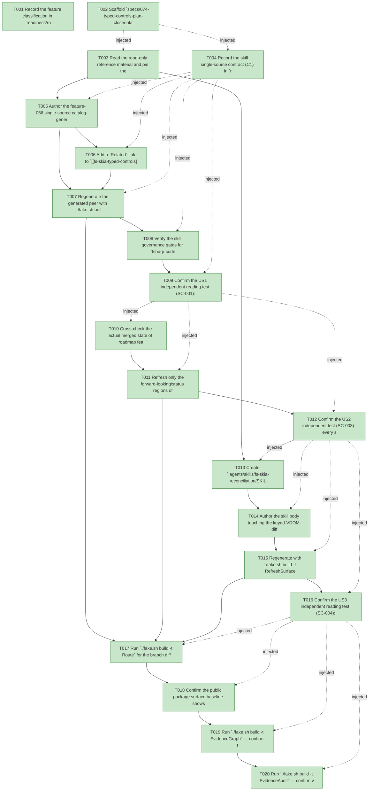

# Task Graph — 074-typed-controls-plan-closeout

## ✓ Graph is acyclic and consistent

## Skill Match Assessments

| Task | Candidate | Confidence | Signals | Reviewer disposition | Diagnostic |
|------|-----------|------------|---------|----------------------|------------|
| T001 | (none) | none |  | accepted-empty | T001: skillist trusted as declared; no owns-based capability requirement |
| T002 | (none) | none |  | accepted-empty | T002: skillist trusted as declared; no owns-based capability requirement |
| T003 | (none) | none |  | accepted-empty | T003: skillist trusted as declared; no owns-based capability requirement |
| T004 | (none) | none |  | accepted-empty | T004: skillist trusted as declared; no owns-based capability requirement |
| T005 | (none) | none |  | declared | T005: skillist trusted as declared; no owns-based capability requirement |
| T006 | (none) | none |  | accepted-empty | T006: skillist trusted as declared; no owns-based capability requirement |
| T007 | (none) | none |  | accepted-empty | T007: skillist trusted as declared; no owns-based capability requirement |
| T008 | (none) | none |  | accepted-empty | T008: skillist trusted as declared; no owns-based capability requirement |
| T009 | (none) | none |  | accepted-empty | T009: skillist trusted as declared; no owns-based capability requirement |
| T010 | (none) | none |  | accepted-empty | T010: skillist trusted as declared; no owns-based capability requirement |
| T011 | (none) | none |  | accepted-empty | T011: skillist trusted as declared; no owns-based capability requirement |
| T012 | (none) | none |  | accepted-empty | T012: skillist trusted as declared; no owns-based capability requirement |
| T013 | (none) | none |  | accepted-empty | T013: skillist trusted as declared; no owns-based capability requirement |
| T014 | (none) | none |  | accepted-empty | T014: skillist trusted as declared; no owns-based capability requirement |
| T015 | (none) | none |  | accepted-empty | T015: skillist trusted as declared; no owns-based capability requirement |
| T016 | (none) | none |  | accepted-empty | T016: skillist trusted as declared; no owns-based capability requirement |
| T017 | (none) | none |  | accepted-empty | T017: skillist trusted as declared; no owns-based capability requirement |
| T018 | (none) | none |  | accepted-empty | T018: skillist trusted as declared; no owns-based capability requirement |
| T019 | speckit-evidence-graph | high | owns:graph-validation | accepted | T019: owns graph-validation requires skill speckit-evidence-graph; trigger_group=owns; matched_trigger=owns:graph-validation |
| T020 | speckit-evidence-audit | high | owns:evidence-audit | accepted | T020: owns evidence-audit requires skill speckit-evidence-audit; trigger_group=owns; matched_trigger=owns:evidence-audit |

## Status counts (effective)

| Status | Count |
|--------|-------|
| [X] done | 20 |
| [S] synthetic | 0 |
| [S*] auto-synthetic | 0 |
| accepted [SEH] synthetic | 0 |
| unaccepted synthetic | 0 |

## Graph



## ASCII view

```
T001 [X] Record the feature classification in `readiness/runtime-limitations.md`: Tier 2 (internal/documentation-governance), affected paths (`.agents/skills/fsharp-code-generation`, new `.agents/skills/fs-skia-reconciliation`, the plan report; regenerated `.claude` peers), public-API impact = none (SC-005), MVU applicability = N/A, and the evidence obligations (skill-currency for both skills + the refreshed plan report)
T002 [X] Scaffold `specs/074-typed-controls-plan-closeout/readiness/` with the audit-enforced governance placeholders discoverable before implementation: `governance-risk-levels.md`, `aggregate-hang-diagnostics.md`, `runtime-limitations.md`, `generated-validation-authority.md`, `skill-loading-evidence-workflow.md`, `audit-diagnostics.md`, `readiness-contract-discovery.md`, `framework-guidance.md`, `evidence-vocabulary.md`, `evidence-graph.md`, and `evidence-audit.md` (each naming its authoritative command, artifact path, failure class, and next action)
T003 [X] Read the read-only reference material and pin the facts the skills must state accurately — `build/Governance/CatalogGen.fsi` (US1: `catalogFacts`, `catalog.yml`/`Catalog.fs`, `RegenerateCatalog`, `ControlsCatalogGenerationCheck`, splice markers, the `FS.Skia.UI.Controls.Typed` cross-check) and `src/Controls/Reconcile.fsi` (US3: `module internal`, `diff`/`apply`, key-then-positional matching, `NodePatch`/`ChildOp` set, `KeyCollision`, disposition) — without editing either file
T004 [X] Record the skill single-source contract (C1) in `readiness/skill-loading-evidence-workflow.md`: `.agents` is canonical, `.claude` is generated by `./fake.sh build -t RefreshSurfaceBaselines`, the peer is never hand-edited, discovery is by `SKILL.md` frontmatter `name:`, and `SkillSyncCheck` fails on any drift
T005 [X] Author the feature-066 single-source catalog-generation worked example in `.agents/skills/fsharp-code-generation/SKILL.md`: name the canonical `catalogFacts : TypedCatalogFact list`, the two generated artifacts (`catalog.yml` + `Catalog.fs`), `RegenerateCatalog` within `RefreshSurfaceBaselines`, and the `ControlsCatalogGenerationCheck` drift gate (FR-001); explain the `Module`/required-attribute cross-check against the `FS.Skia.UI.Controls.Typed` surface and state that hand-editing a generated `typed-catalog/<id>` region fails the gate while rows outside the markers are untouched (FR-003)
T006 [X] Add a `Related` link to `[[fs-skia-typed-controls]]` in the same skill, re-attributing the "typed authoring is the preferred front door" guidance to the skill that actually carries it (supports FR-005 re-attribution)
T007 [X] Regenerate the generated peer with `./fake.sh build -t RefreshSurfaceBaselines` so `.claude/skills/fsharp-code-generation/SKILL.md` is rebuilt from the canonical source (never hand-edited) (FR-002)
T008 [X] Verify the skill governance gates for `fsharp-code-generation`: `SkillSyncCheck` reports zero drift (SC-002), `SkillQualityCheck` and `SkillContractPathCheck` pass; capture results to `readiness/skill-loading-evidence-workflow.md`
T009 [X] Confirm the US1 independent reading test (SC-001): a maintainer reading the updated skill cold can name the fact table, both generated artifacts, the regeneration target, and the drift gate, and can state that hand-editing a generated artifact fails the gate — record the walk-through in `readiness/skill-loading-evidence-workflow.md`
T010 [X] Cross-check the actual merged state of roadmap features 065–073 against `git log` on `main` (gather each squash commit) and 073's "motion" delivery, so the refresh asserts facts rather than guesses (input to SC-003)
T011 [X] Refresh only the forward-looking/status regions of `docs/reports/2026-06-05-1802-typed-controls-front-door-implementation-plan.md` — status header + status-by-feature table (065–073 merged with squash commits, no lingering "awaiting"/"Planned", FR-004), §13 roadmap (073 animations recorded as the delivered "motion" item, FR-007), and §16 skills backlog (catalog-generation item marked done → US1; remove the `fs-skia-project` reference and re-attribute "typed is preferred" to `fs-skia-typed-controls`, FR-005; record shipped `fs-skia-typed-controls`/`fs-skia-design-tokens`/`fs-skia-reconciliation` vs. folded `fs-skia-catalog-generation` → `fsharp-code-generation`, FR-006) — leaving the §1-onward provenance body unedited (A4)
T012 [X] Confirm the US2 independent test (SC-003): every status claim in the progress table and §13 roadmap matches `git log` on `main` with zero contradictions, and the document contains zero `fs-skia-project` references — record the cross-check in `readiness/audit-diagnostics.md`
T013 [X] Create `.agents/skills/fs-skia-reconciliation/SKILL.md` with required frontmatter (`name: fs-skia-reconciliation`, one-line `description`, `compatibility` noting the internal/no-public-surface scope, `metadata.{author,source}`) so `SkillRegistry` discovers it by `name:` (FR-008)
T014 [X] Author the skill body teaching the keyed-VDOM-diff invariants — key-first-then-positional child matching, `Kind`-mismatch ⇒ whole-subtree `Replace`, the `NodePatch`/`ChildOp` operation set with `UpdatePatch`/`FieldChange`/`AttrChange`, the `KeyCollision` duplicate-key diagnostic, and the totality/determinism/identity-at-rest/round-trip properties — and recording the module **disposition**: `module internal`, property-tested via `InternalsVisibleTo("Controls.Tests")`, deliberately unwired, parked, with live-render-path integration named as deferred out-of-scope future work plus the integration point it would touch (FR-009, FR-010)
T015 [X] Regenerate with `./fake.sh build -t RefreshSurfaceBaselines` so the `.claude/skills/fs-skia-reconciliation/SKILL.md` peer and the skill index (`GENERATED.md` / skillist-reference) are produced from the canonical source, then verify `SkillSyncCheck` (zero drift, SC-002), `SkillQualityCheck`, and `SkillContractPathCheck` pass for the new skill
T016 [X] Confirm the US3 independent reading test (SC-004): a maintainer reading the skill cold can state it is a deliberately-parked internal spike (not dead code), name the diff invariants and operation set, and explain that render-path wiring is a separate out-of-scope future feature — record the walk-through in `readiness/skill-loading-evidence-workflow.md`
T017 [X] Run `./fake.sh build -t Route` for the branch diff to get the authoritative tier + minimal gate list, then run **only** the printed gates sequentially (`.fake` state is shared) — capturing each verdict to `readiness/focused-gates.md` and `readiness/generated-validation-authority.md` (SC-006); record any aggregate/multi-target timing as non-authoritative in `readiness/aggregate-hang-diagnostics.md`
T018 [X] Confirm the public package surface baseline shows zero delta attributable to this feature (SC-005) — documentation/governance only, no `.fsi` or surface change — and record the result in `readiness/generated-validation-authority.md`
T019 [X] Run `./fake.sh build -t EvidenceGraph` — confirm the DAG has no cycles, no dangling refs, valid `skillist` metadata, and no `[S*]` surprises; write the rendered graph to `readiness/evidence-graph.md`
T020 [X] Run `./fake.sh build -t EvidenceAudit` — confirm verdict PASS with no `[S]`/`[S*]` disclosures and no `--accept-synthetic` overrides; write the audit result to `readiness/evidence-audit.md`
```

## Injected checkpoint edges (Phase N+1 → Phase N) — FR-007

- T002 → T003  (auto-injected Phase-checkpoint edge)
- T002 → T004  (auto-injected Phase-checkpoint edge)
- T004 → T005  (auto-injected Phase-checkpoint edge)
- T004 → T006  (auto-injected Phase-checkpoint edge)
- T004 → T007  (auto-injected Phase-checkpoint edge)
- T004 → T008  (auto-injected Phase-checkpoint edge)
- T004 → T009  (auto-injected Phase-checkpoint edge)
- T009 → T010  (auto-injected Phase-checkpoint edge)
- T009 → T011  (auto-injected Phase-checkpoint edge)
- T009 → T012  (auto-injected Phase-checkpoint edge)
- T012 → T013  (auto-injected Phase-checkpoint edge)
- T012 → T014  (auto-injected Phase-checkpoint edge)
- T012 → T015  (auto-injected Phase-checkpoint edge)
- T012 → T016  (auto-injected Phase-checkpoint edge)
- T016 → T017  (auto-injected Phase-checkpoint edge)
- T016 → T018  (auto-injected Phase-checkpoint edge)
- T016 → T019  (auto-injected Phase-checkpoint edge)
- T016 → T020  (auto-injected Phase-checkpoint edge)

## Resolved skillist ids — FR-007

Resolved skillist-id set (3): fsharp-code-generation, speckit-evidence-audit, speckit-evidence-graph

