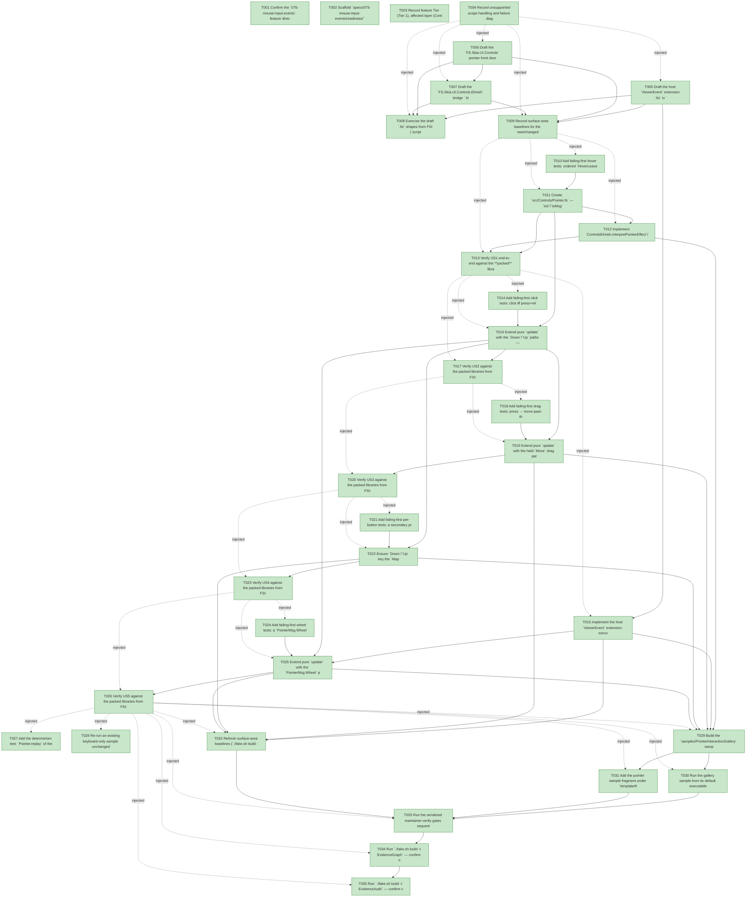

# Task Graph — 075-mouse-input-events

## ✓ Graph is acyclic and consistent

## Skill Match Assessments

| Task | Candidate | Confidence | Signals | Reviewer disposition | Diagnostic |
|------|-----------|------------|---------|----------------------|------------|
| T001 | (none) | none |  | accepted-empty | T001: skillist trusted as declared; no owns-based capability requirement |
| T002 | (none) | none |  | accepted-empty | T002: skillist trusted as declared; no owns-based capability requirement |
| T003 | (none) | none |  | accepted-empty | T003: skillist trusted as declared; no owns-based capability requirement |
| T004 | (none) | none |  | accepted-empty | T004: skillist trusted as declared; no owns-based capability requirement |
| T005 | (none) | none |  | declared | T005: skillist trusted as declared; no owns-based capability requirement |
| T006 | (none) | none |  | declared | T006: skillist trusted as declared; no owns-based capability requirement |
| T007 | (none) | none |  | declared | T007: skillist trusted as declared; no owns-based capability requirement |
| T008 | (none) | none |  | declared | T008: skillist trusted as declared; no owns-based capability requirement |
| T009 | (none) | none |  | accepted-empty | T009: skillist trusted as declared; no owns-based capability requirement |
| T010 | (none) | none |  | declared | T010: skillist trusted as declared; no owns-based capability requirement |
| T011 | (none) | none |  | declared | T011: skillist trusted as declared; no owns-based capability requirement |
| T012 | (none) | none |  | declared | T012: skillist trusted as declared; no owns-based capability requirement |
| T013 | (none) | none |  | declared | T013: skillist trusted as declared; no owns-based capability requirement |
| T014 | (none) | none |  | declared | T014: skillist trusted as declared; no owns-based capability requirement |
| T015 | (none) | none |  | declared | T015: skillist trusted as declared; no owns-based capability requirement |
| T016 | (none) | none |  | declared | T016: skillist trusted as declared; no owns-based capability requirement |
| T017 | (none) | none |  | declared | T017: skillist trusted as declared; no owns-based capability requirement |
| T018 | (none) | none |  | declared | T018: skillist trusted as declared; no owns-based capability requirement |
| T019 | (none) | none |  | declared | T019: skillist trusted as declared; no owns-based capability requirement |
| T020 | (none) | none |  | declared | T020: skillist trusted as declared; no owns-based capability requirement |
| T021 | (none) | none |  | declared | T021: skillist trusted as declared; no owns-based capability requirement |
| T022 | (none) | none |  | declared | T022: skillist trusted as declared; no owns-based capability requirement |
| T023 | (none) | none |  | declared | T023: skillist trusted as declared; no owns-based capability requirement |
| T024 | (none) | none |  | declared | T024: skillist trusted as declared; no owns-based capability requirement |
| T025 | (none) | none |  | declared | T025: skillist trusted as declared; no owns-based capability requirement |
| T026 | (none) | none |  | declared | T026: skillist trusted as declared; no owns-based capability requirement |
| T027 | (none) | none |  | declared | T027: skillist trusted as declared; no owns-based capability requirement |
| T028 | (none) | none |  | declared | T028: skillist trusted as declared; no owns-based capability requirement |
| T029 | (none) | none |  | declared | T029: skillist trusted as declared; no owns-based capability requirement |
| T030 | (none) | none |  | declared | T030: skillist trusted as declared; no owns-based capability requirement |
| T031 | (none) | none |  | declared | T031: skillist trusted as declared; no owns-based capability requirement |
| T032 | (none) | none |  | accepted-empty | T032: skillist trusted as declared; no owns-based capability requirement |
| T033 | (none) | none |  | declared | T033: skillist trusted as declared; no owns-based capability requirement |
| T034 | speckit-evidence-graph | high | owns:graph-validation | accepted | T034: owns graph-validation requires skill speckit-evidence-graph; trigger_group=owns; matched_trigger=owns:graph-validation |
| T035 | speckit-evidence-audit | high | owns:evidence-audit | accepted | T035: owns evidence-audit requires skill speckit-evidence-audit; trigger_group=owns; matched_trigger=owns:evidence-audit |

## Status counts (effective)

| Status | Count |
|--------|-------|
| [X] done | 35 |
| [S] synthetic | 0 |
| [S*] auto-synthetic | 0 |
| accepted [SEH] synthetic | 0 |
| unaccepted synthetic | 0 |

## Graph



## ASCII view

```
T001 [X] Confirm the `075-mouse-input-events` feature directory and ensure `spec.md`/`plan.md`/`research.md`/`data-model.md`/`quickstart.md`/`contracts/` are linked from the task breakdown
T002 [X] Scaffold `specs/075-mouse-input-events/readiness/` with the audit-enforced readiness-contract files this feature actually produces — `governance-risk-levels.md`, `aggregate-hang-diagnostics.md`, `runtime-limitations.md`, `skill-loading-evidence.md`, `keyboard-regression.md`, `evidence-graph.md`, `evidence-audit.md` — plus the `fsi/`, `sample-smoke/`, `package-surfaces/`, `package/`, `logs/`, and `generated-product-verify/` subdirectories (each artifact names its authoritative command, artifact path, failure class, next action). NOTE: this feature delivers a pure pointer-coordination contract proven deterministically; per `contracts/sample-contract.md` the deterministic smoke — not a persistent visible GUI window — is the authoritative sample evidence, so the window-visibility evidence class (a persistent-visible-window deliverable) does not apply and its files are intentionally not scaffolded
T003 [X] Record feature Tier (Tier 1), affected layer (Controls / Controls.Elmish / SkiaViewer host), public-API impact, Elmish/MVU applicability (**Principle IV applies** — `PointerState`/`PointerMsg`/`PointerInteraction`/`init`/`update`/`replay`), and required evidence obligations
T004 [X] Record unsupported-scope handling and failure diagnostics design: `HitTestMiss`/`StaleTarget` diagnostics (FR-010), the `DragCancelled` window-exit/focus-loss cancel path (FR-007), and the SEH classification decision (none approved — all paths proven with real scripted messages)
T005 [X] Draft the host `ViewerEvent` extension `.fsi` in `src/SkiaViewer/Host/Diagnostics.fsi` — `ViewerPointerButton`, `button` on `PointerPressed`/`PointerReleased`, new `PointerScrolled`/`PointerExited` cases — with the case-arity compatibility note (`contracts/viewer-event.host.fsi`)
T006 [X] Draft the `FS.Skia.UI.Controls` pointer front door `.fsi` in `src/Controls/Pointer.fsi` — `PointerButton`/`PointerOrigin`/`PointerPhase`/`PointerSample`/`PressCandidate`/`PointerState`/`PointerDiagnostic`/`PointerInteraction`/`PointerMsg` + `Pointer` module (`init`/`toMsg`/`update`/`replay`) — and add `Pointer.fs(i)` to `Controls.fsproj` compile order (`contracts/pointer.controls.fsi`)
T007 [X] Draft the `FS.Skia.UI.Controls.Elmish` bridge `.fsi` in `src/Controls.Elmish/ControlsElmish.fsi` — `interpretPointerEffect` + `interpretPointerOutcome`, reusing `ReportAdapterDiagnostic`/`DispatchControlRuntimeMessage` (add an `AdapterEffect` case only if needed) (`contracts/pointer.controls-elmish.fsi`)
T008 [X] Exercise the draft `.fsi` shapes from FSI (`scripts/prelude.fsx` or ad-hoc) — `Pointer.init`, a scripted `replay`, and a `interpretPointerOutcome` lowering — capturing the session transcript to `readiness/fsi-session.txt` (Principle I: fix the surface if it reads awkwardly)
T009 [X] Record surface-area baselines for the new/changed public modules (`FS.Skia.UI.Controls`, `FS.Skia.UI.Controls.Elmish`, `FS.Skia.UI.SkiaViewer`); confirm `Layout`/`KeyboardInput` baselines are unchanged
T010 [X] Add failing-first hover tests: ordered `HoverLeave(prior)` → `HoverEnter(next)`, no transition when the hit id is unchanged, leave-only on empty space / window exit (SC-001/FR-003), plus an FsCheck property "no duplicate or skipped hover transitions under random move bursts" (FR-003); also include one overlap case (topmost/front-most in paint order wins) and one hidden/collapsed-control case (never a hover target), asserting the pointer path honors the `Layout.hitTestComputed` paint-order/visibility contract (FR-002 edge cases)
T011 [X] Create `src/Controls/Pointer.fs` — `init`/`toMsg` and the `Move` path of pure `update` (hit-test via `Layout.hitTestComputed`, derive ordered hover transitions, emit `ControlRuntimeMsg.HoverControl` to keep runtime hover consistent)
T012 [X] Implement `ControlsElmish.interpretPointerEffect`/`interpretPointerOutcome` in `src/Controls.Elmish/ControlsElmish.fs` (route meaningful interactions via `mapInteraction`, no-ops → `[]`, diagnostics → `ReportAdapterDiagnostic`, runtime messages → `DispatchControlRuntimeMessage`)
T013 [X] Verify US1 end-to-end against the **packed** libraries from FSI: hover front door + Elmish bridge over a scripted move sequence; confirm every emitted effect is a `PointerInteraction` value carrying `PointerOrigin.Pointer` (type-distinct from keyboard/text effects), proving pointer-vs-keyboard origin discrimination (FR-011); capture transcript to `readiness/fsi/pointer-frontdoor.md`
T014 [X] Add failing-first click tests: click iff press+release over the **same** control, no click when released off the control (pressed state cleared), focus moves to a focusable pressed control (SC-002/FR-004/FR-005), plus an FsCheck property "press/release pair never dropped or reordered under interleaved moves" (FR-008)
T015 [X] Implement the host `ViewerEvent` extension: mirror the type in `src/SkiaViewer/Host/Diagnostics.fs`, capture `MouseButton` in `src/SkiaViewer/Host/Vulkan.fs` (drop the `_` discard, map Silk.NET → `ViewerPointerButton`), subscribe/dispose `IMouse.Scroll`, wire a mouse-leave/blur → `PointerExited`, and update the sole `SkiaViewer.fs` matcher in lockstep
T016 [X] Extend pure `update` with the `Down`/`Up` paths — record per-button `PressCandidate`, emit `PressedDown`/`ReleasedUp`/`Click` (click iff release over the press control), `FocusMovedByPointer` + `ControlRuntimeMsg.PressControl`/`FocusControl`, and `Diagnostic HitTestMiss` on a press miss
T017 [X] Verify US2 against the packed libraries from FSI: same-control click dispatches once, off-control release dispatches nothing, focus moves to the pressed focusable control; append transcript to `readiness/fsi/pointer-frontdoor.md`
T018 [X] Add failing-first drag tests: press → move-past-threshold emits one `DragBegin`, ordered `DragMove`s, one `DragEnd` on release; sub-threshold press/release is a `Click` not a drag (Click XOR drag); `WindowExited`/`FocusLost` mid-press/drag yields `DragCancelled` with `Presses` empty and no active drag (SC-003/SC-004/FR-006/FR-007)
T019 [X] Extend pure `update` with the held-`Move` drag path (`DragThreshold` distance test, `DragBegin`/`DragMove` + `ControlRuntimeMsg.StartDrag`/`MoveDrag`), the `Up` drag-end path (`DragEnd` + `EndDrag`), and the `WindowExited`/`FocusLost` cancel (`DragCancelled`, reset `Presses`/`Hover`, `CancelInteraction`)
T020 [X] Verify US3 against the packed libraries from FSI: a scripted drag (begin/move/end) and a scripted cancel-on-exit; append transcript to `readiness/fsi/pointer-frontdoor.md`
T021 [X] Add failing-first per-button tests: a secondary press/release yields `Click(_, Secondary, …)` and no primary click (and converse); a middle press/release yields `Click(_, Middle, …)` distinct from both (FR-013 covers primary/secondary/middle); overlapping presses across buttons resolve independently with zero cross-button misattribution (SC-008/FR-013)
T022 [X] Ensure `Down`/`Up` key the `Map<PointerButton, PressCandidate>` by button so each button's press resolves independently, and `Click`/drag effects carry the originating `PointerButton`
T023 [X] Verify US4 against the packed libraries from FSI: distinct secondary click + an overlapping primary/secondary sequence; append transcript to `readiness/fsi/pointer-frontdoor.md`
T024 [X] Add failing-first wheel tests: a `PointerMsg.Wheel` over a control emits `Scroll(control, dx, dy, x, y)` with the correct signed delta; a wheel over empty space emits no scroll interaction (SC-009/FR-014)
T025 [X] Extend pure `update` with the `PointerMsg.Wheel` path (hit-test → `Scroll` to control-under-pointer; silent miss over empty space) consuming the host `PointerScrolled` wired in T015
T026 [X] Verify US5 against the packed libraries from FSI: wheel-over-control vs wheel-over-empty; append transcript to `readiness/fsi/pointer-frontdoor.md`
T027 [X] Add the determinism test: `Pointer.replay` of the same `PointerMsg list` against the same `LayoutResult` yields identical effects on a re-run (SC-005/FR-009)
T028 [X] Re-run an existing keyboard-only sample unchanged and confirm no behavior change is forced (SC-006/FR-012); record the regression note under `readiness/`
T029 [X] Build the `samples/PointerInteractionGallery` sample (`Program.fs`): `ViewerEvent.Pointer*` → `PointerSample` → `Pointer.update` → `interpretPointerOutcome` → Elmish `Cmd`, demonstrating hover/click/drag/secondary/scroll using **only** `ControlId`-level messages and no consumer-side hit-testing (SC-007)
T030 [X] Run the gallery sample from its default executable path through the deterministic contract smoke (the authoritative sample evidence per `contracts/sample-contract.md`), exercising hover/click/secondary/drag/scroll across the public front door, and capture the smoke log to `readiness/sample-smoke/PointerInteractionGallery.txt`; per `fs-skia-evidence-mode`, a persistent Vulkan window / render-only screenshot is unavailable under the headless validation host and is classified as an environment condition (see `readiness/runtime-limitations.md`), not a product defect — the deterministic smoke is the authoritative visual proof
T031 [X] Add the pointer sample fragment under `template/fragments/samples/` so the generated Samples capability includes it, and add a short pointer-interaction paragraph to the selected Controls generated guidance
T032 [X] Refresh surface-area baselines (`./fake.sh build -t RefreshSurfaceBaselines`) and regenerate the per-package `.fsi.txt` snapshots via `PerPackageSurface.captureCurrent` for `FS.Skia.UI.Controls`, `FS.Skia.UI.Controls.Elmish`, `FS.Skia.UI.SkiaViewer`; move snapshots into `readiness/package-surfaces/`
T033 [X] Run the serialized maintainer-verify gates sequentially (`Dev` → `GeneratedGuidanceCheck` → `TemplateCheck` → `GeneratedProductCheck`), recording logs to `readiness/logs/` and the governance risk-level note; classify the known `GeneratedProductCheck` local failure as an environment failure under `readiness/generated-product-verify/`, not a product defect
T034 [X] Run `./fake.sh build -t EvidenceGraph` — confirm no cycles, no dangling refs, no `[S*]` surprises; write `readiness/evidence-graph.md` and `readiness/task-graph.{md,json}`
T035 [X] Run `./fake.sh build -t EvidenceAudit` — confirm verdict PASS (or document every `--accept-synthetic` override); write `readiness/evidence-audit.md`
```

## Injected checkpoint edges (Phase N+1 → Phase N) — FR-007

- T004 → T005  (auto-injected Phase-checkpoint edge)
- T004 → T006  (auto-injected Phase-checkpoint edge)
- T004 → T007  (auto-injected Phase-checkpoint edge)
- T004 → T008  (auto-injected Phase-checkpoint edge)
- T004 → T009  (auto-injected Phase-checkpoint edge)
- T009 → T010  (auto-injected Phase-checkpoint edge)
- T009 → T011  (auto-injected Phase-checkpoint edge)
- T009 → T012  (auto-injected Phase-checkpoint edge)
- T009 → T013  (auto-injected Phase-checkpoint edge)
- T013 → T014  (auto-injected Phase-checkpoint edge)
- T013 → T015  (auto-injected Phase-checkpoint edge)
- T013 → T016  (auto-injected Phase-checkpoint edge)
- T013 → T017  (auto-injected Phase-checkpoint edge)
- T017 → T018  (auto-injected Phase-checkpoint edge)
- T017 → T019  (auto-injected Phase-checkpoint edge)
- T017 → T020  (auto-injected Phase-checkpoint edge)
- T020 → T021  (auto-injected Phase-checkpoint edge)
- T020 → T022  (auto-injected Phase-checkpoint edge)
- T020 → T023  (auto-injected Phase-checkpoint edge)
- T023 → T024  (auto-injected Phase-checkpoint edge)
- T023 → T025  (auto-injected Phase-checkpoint edge)
- T023 → T026  (auto-injected Phase-checkpoint edge)
- T026 → T027  (auto-injected Phase-checkpoint edge)
- T026 → T028  (auto-injected Phase-checkpoint edge)
- T026 → T029  (auto-injected Phase-checkpoint edge)
- T026 → T030  (auto-injected Phase-checkpoint edge)
- T026 → T031  (auto-injected Phase-checkpoint edge)
- T026 → T032  (auto-injected Phase-checkpoint edge)
- T026 → T033  (auto-injected Phase-checkpoint edge)
- T026 → T034  (auto-injected Phase-checkpoint edge)
- T026 → T035  (auto-injected Phase-checkpoint edge)

## Resolved skillist ids — FR-007

Resolved skillist-id set (9): fs-skia-elmish, fs-skia-evidence-mode, fs-skia-keyboard-input, fs-skia-samples, fs-skia-skiaviewer, fs-skia-template-update, fs-skia-ui-widgets, speckit-evidence-audit, speckit-evidence-graph

