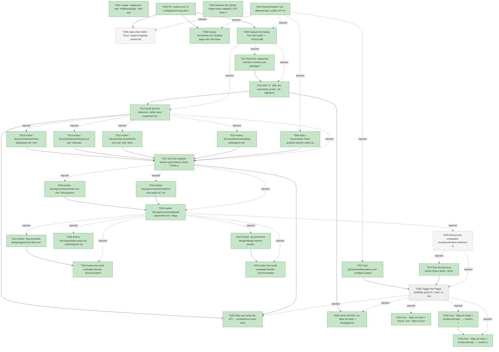

# Task Graph — 076-fsdocs-documentation-site

## ✓ Graph is acyclic and consistent

## Skill Match Assessments

| Task | Candidate | Confidence | Signals | Reviewer disposition | Diagnostic |
|------|-----------|------------|---------|----------------------|------------|
| T001 | (none) | none |  | accepted-empty | T001: skillist trusted as declared; no owns-based capability requirement |
| T002 | (none) | none |  | declared | T002: skillist trusted as declared; no owns-based capability requirement |
| T003 | (none) | none |  | declared | T003: skillist trusted as declared; no owns-based capability requirement |
| T004 | (none) | none |  | accepted-empty | T004: skillist trusted as declared; no owns-based capability requirement |
| T005 | (none) | none |  | accepted-empty | T005: skillist trusted as declared; no owns-based capability requirement |
| T006 | (none) | none |  | accepted-empty | T006: skillist trusted as declared; no owns-based capability requirement |
| T007 | (none) | none |  | declared | T007: skillist trusted as declared; no owns-based capability requirement |
| T008 | (none) | none |  | declared | T008: skillist trusted as declared; no owns-based capability requirement |
| T009 | (none) | none |  | declared | T009: skillist trusted as declared; no owns-based capability requirement |
| T010 | (none) | none |  | declared | T010: skillist trusted as declared; no owns-based capability requirement |
| T011 | (none) | none |  | declared | T011: skillist trusted as declared; no owns-based capability requirement |
| T012 | (none) | none |  | declared | T012: skillist trusted as declared; no owns-based capability requirement |
| T013 | (none) | none |  | declared | T013: skillist trusted as declared; no owns-based capability requirement |
| T014 | (none) | none |  | declared | T014: skillist trusted as declared; no owns-based capability requirement |
| T015 | (none) | none |  | declared | T015: skillist trusted as declared; no owns-based capability requirement |
| T016 | (none) | none |  | declared | T016: skillist trusted as declared; no owns-based capability requirement |
| T017 | (none) | none |  | declared | T017: skillist trusted as declared; no owns-based capability requirement |
| T018 | (none) | none |  | declared | T018: skillist trusted as declared; no owns-based capability requirement |
| T019 | (none) | none |  | declared | T019: skillist trusted as declared; no owns-based capability requirement |
| T020 | (none) | none |  | declared | T020: skillist trusted as declared; no owns-based capability requirement |
| T021 | (none) | none |  | declared | T021: skillist trusted as declared; no owns-based capability requirement |
| T022 | (none) | none |  | declared | T022: skillist trusted as declared; no owns-based capability requirement |
| T023 | (none) | none |  | declared | T023: skillist trusted as declared; no owns-based capability requirement |
| T024 | (none) | none |  | declared | T024: skillist trusted as declared; no owns-based capability requirement |
| T025 | (none) | none |  | declared | T025: skillist trusted as declared; no owns-based capability requirement |
| T026 | (none) | none |  | declared | T026: skillist trusted as declared; no owns-based capability requirement |
| T027 | (none) | none |  | declared | T027: skillist trusted as declared; no owns-based capability requirement |
| T028 | (none) | none |  | declared | T028: skillist trusted as declared; no owns-based capability requirement |
| T029 | (none) | none |  | declared | T029: skillist trusted as declared; no owns-based capability requirement |
| T030 | (none) | none |  | accepted-empty | T030: skillist trusted as declared; no owns-based capability requirement |
| T031 | (none) | none |  | accepted-empty | T031: skillist trusted as declared; no owns-based capability requirement |
| T032 | speckit-evidence-graph | high | owns:graph-validation | accepted | T032: owns graph-validation requires skill speckit-evidence-graph; trigger_group=owns; matched_trigger=owns:graph-validation |
| T033 | speckit-evidence-audit | high | owns:evidence-audit | accepted | T033: owns evidence-audit requires skill speckit-evidence-audit; trigger_group=owns; matched_trigger=owns:evidence-audit |

## Status counts (effective)

| Status | Count |
|--------|-------|
| [ ] pending | 1 |
| [X] done | 30 |
| [S] synthetic | 0 |
| [S*] auto-synthetic | 0 |
| [-] skipped | 2 |
| accepted [SEH] synthetic | 0 |
| unaccepted synthetic | 0 |

## Graph



## ASCII view

```
T001 [X] Create `readiness/` and `readiness/logs/` with audit-enforced placeholder files (`validation-contract.md`, `surface-baseline-unchanged.md`, `api-coverage.md`, `runtime-limitations.md`, `governance-risk-levels.md`, `manual-sc-verification.md`), each naming its authoritative command, artifact path, failure class, and next action. `manual-sc-verification.md` records the human verdict for the comprehension/navigation criteria with no mechanical gate (SC-003, SC-004, SC-008)
T002 [X] Pin `fsdocs-tool` in `.config/dotnet-tools.json`; merge `FsDocs*` properties (site root, source link, theme, `FsDocsWarnOnMissingDocs`) into `Directory.Build.props` without overwriting existing props; add `output/`, `.fsdocs/`, `tmp/` to `.gitignore` (establishes the fsdocs single-site toolchain, FR-001)
T003 [X] Resolve the GitHub Pages base subpath (`/FS-Skia-UI/`) and the fsdocs source-link `RepositoryUrl` per research R2 — override only the fsdocs root/source-link, leaving packable `PackageProjectUrl` metadata untouched
T004 [X] Record feature Tier, affected layer, public-API impact (the FR-004 doc-only invariant), MVU-not-applicable, and the required evidence obligations into the readiness notes
T005 [-] Add a thin FAKE `Docs` target wrapping `dotnet fsdocs build --strict`; regenerate `validation.contract.yml` from `Routing.fs` and update `TargetMetadata` together (build-target-contract escalation — keep `build.fsx`, the generated contract, and metadata in lockstep so `TargetMetadataDrift` stays green)
T006 [X] Add a `Governance.Tests` analysis-section check asserting every page under `docs/architecture/**` and each deep-dive section index closes with a delineated analysis naming both implementation strengths AND weaknesses and both design pros AND cons (SC-002 / FR-006)
T007 [X] Add `.github/workflows/docs.yml`: `configure-pages` → `dotnet tool restore` → `dotnet fsdocs build --strict` → `upload-pages-artifact` (`output/`) → `deploy-pages`, with `pages: write` / `id-token: write` and a `github-pages` environment; trigger on push to `main` + `workflow_dispatch`; commit no generated output (FR-012)
T008 [X] Create `docs/index.md` landing page with role-based navigation (consumer / contributor / speckit practitioner each reachable in ≤ 2 steps) plus the section skeleton (FR-016 / SC-008)
T009 [X] Capture the failing-first strict build — `FsDocsWarnOnMissingDocs` + `--strict` reporting undocumented supported members (red) — to `readiness/logs/fsdocs-build.txt` (the red signal SC-001 will turn green)
T010 [X] Build the supported-member inventory per package from the per-package surface baselines into `readiness/api-coverage.md`, listing every undocumented supported member (failing-first coverage table)
T011 [X] Add `///` XML doc comments on the `.fsi` signature files for every supported public member across the 10 published packages (FR-002 / FR-003); confirm internal-only / unsupported members are excluded from the supported reference (FR-014)
T012 [X] Build the API reference; verify every supported member shows a non-empty `<summary>` (zero stubs), parameters/returns render where applicable, and a known public type resolves in site search; update `readiness/api-coverage.md` to 0 undocumented (SC-001, US1 acceptance scenarios 1 & 3)
T013 [X] Author `docs/architecture/host-skiaviewer.md` (rendering/host) and `docs/architecture/scene.md`, each with an architecture body grounded in the existing ADRs/reports and a closing strengths/weaknesses + pros/cons analysis (FR-005 / FR-006)
T014 [X] Author `docs/architecture/layout.md` and `docs/architecture/input.md` (Input + KeyboardInput share one page), each with a closing analysis (FR-005 / FR-006)
T015 [X] Author `docs/architecture/elmish-mvu.md` and `docs/architecture/controls.md` (Controls + Controls.Elmish suite share one page), each with a closing analysis (FR-005 / FR-006)
T016 [X] Author `docs/architecture/testing-skillsupport.md` and the `docs/architecture/governance.md` overview page, each with a closing analysis (FR-005 / FR-006)
T017 [X] Run the analysis-section governance check (T006) plus a strict build over `docs/architecture/**`; confirm every major part is covered and each page closes with a both-sided analysis (SC-002 / US2 acceptance scenarios 1–3)
T018 [X] Author `docs/governance/index.md` and `docs/governance/routing-and-gates.md` explaining tier-and-gate selection (the `Route` selector) with practitioner usage guidance (how to run and respond) (FR-007 / FR-008)
T019 [X] Author `docs/governance/evidence-and-audit.md` (evidence model, `[S]`/`[S*]` propagation, merge-gate audit) and `docs/governance/single-source-generation.md` (`validation.contract.yml` from `Routing.fs`; `.claude` from `.agents`)
T020 [X] Author `docs/governance/speckit-placement.md` mapping each governance touchpoint to a named speckit phase (specify → clarify → plan → tasks → analyze → implement → merge) with usage guidance, and close the governance section with the strengths/weaknesses + pros/cons analysis (FR-008 / SC-003)
T021 [X] Author `docs/controls-design/typed-front-door.md` — authoring against the typed Props/MVU front door and how it lowers to the legacy builders — with a closing analysis (FR-009)
T022 [X] Author `docs/controls-design/design-tokens-penpot.md` — the design-token flow from design source (Penpot / DTCG) to the typed control surface, how to author it, and its speckit placement — with a closing analysis (FR-009 / FR-010 / SC-004)
T023 [X] Author `docs/speckit/process.md` explaining the speckit process itself and the specific phase(s) where custom FS Skia UI components are created and consumed (FR-010 / SC-004)
T024 [X] Author the build-evaluated literate `docs/examples/typed-control-mvu.fsx` exercising the typed control / MVU front door on GPU-free model/props/lowering paths (FR-017 / SC-009)
T025 [X] Author the build-evaluated literate `docs/examples/design-token-flow.fsx` exercising the design-token flow on GPU-free paths (FR-017 / SC-009)
T026 [-] Ensure any embedded visual/screenshot evidence in the docs follows evidence-mode rules (render-only, no fabricated visuals, benign degradation where rendering is unsupported); record the disposition in `readiness/runtime-limitations.md` (FR-015) — mark `[-]` with rationale if no visuals are embedded
T027 [X] Run the full local `dotnet fsdocs build --strict`; confirm a complete static site (API reference + authored technical content) with no build errors and every required `.fsx` evaluated; capture to `readiness/logs/fsdocs-build.txt` (FR-013 / SC-005 / SC-009)
T028 [ ] Trigger the Pages workflow (push to `main` or `workflow_dispatch`); confirm the live GitHub Pages site serves the generated API reference and authored docs, and that a content change republishes with no manual file shuffling; capture the run URL to `readiness/logs/pages-deploy.txt` (SC-005 / SC-006)
T029 [X] Wire and verify the API ↔ architecture cross-links (each API entry links to its subsystem page and architecture pages link back to relevant API entries); confirm the strict build resolves them with no broken-link warning (FR-011 / C7 / US1 acceptance scenario 2)
T030 [X] Verify FR-004: run `./fake.sh build -t PackageSurfaceCheck` and `./fake.sh build -t PerPackageSurfaceDiff`; confirm no surface-baseline diff after the `.fsi` doc work; save evidence to `readiness/surface-baseline-unchanged.md` (SC-007)
T031 [X] Run `./fake.sh build -t Route` and `./fake.sh build -t Route --enforce` for the actual diff; record the authoritative tier + minimal gate list to `readiness/logs/route.txt` and complete `readiness/validation-contract.md` (required by the `docs-only` focused rule)
T032 [X] Run `./fake.sh build -t EvidenceGraph` — confirm the feature resolves, no cycles, no dangling refs, and no `[S*]` surprises; record graph before/after
T033 [X] Run `./fake.sh build -t EvidenceAudit` — confirm verdict PASS (or document every `--accept-synthetic` override); record the non-authoritative aggregate result under `readiness/`
```

## Injected checkpoint edges (Phase N+1 → Phase N) — FR-007

- T004 → T005  (auto-injected Phase-checkpoint edge)
- T004 → T006  (auto-injected Phase-checkpoint edge)
- T004 → T007  (auto-injected Phase-checkpoint edge)
- T004 → T008  (auto-injected Phase-checkpoint edge)
- T004 → T009  (auto-injected Phase-checkpoint edge)
- T009 → T010  (auto-injected Phase-checkpoint edge)
- T009 → T011  (auto-injected Phase-checkpoint edge)
- T009 → T012  (auto-injected Phase-checkpoint edge)
- T012 → T013  (auto-injected Phase-checkpoint edge)
- T012 → T014  (auto-injected Phase-checkpoint edge)
- T012 → T015  (auto-injected Phase-checkpoint edge)
- T012 → T016  (auto-injected Phase-checkpoint edge)
- T012 → T017  (auto-injected Phase-checkpoint edge)
- T017 → T018  (auto-injected Phase-checkpoint edge)
- T017 → T019  (auto-injected Phase-checkpoint edge)
- T017 → T020  (auto-injected Phase-checkpoint edge)
- T020 → T021  (auto-injected Phase-checkpoint edge)
- T020 → T022  (auto-injected Phase-checkpoint edge)
- T020 → T023  (auto-injected Phase-checkpoint edge)
- T020 → T024  (auto-injected Phase-checkpoint edge)
- T020 → T025  (auto-injected Phase-checkpoint edge)
- T020 → T026  (auto-injected Phase-checkpoint edge)
- T026 → T027  (auto-injected Phase-checkpoint edge)
- T026 → T028  (auto-injected Phase-checkpoint edge)
- T028 → T029  (auto-injected Phase-checkpoint edge)
- T028 → T030  (auto-injected Phase-checkpoint edge)
- T028 → T031  (auto-injected Phase-checkpoint edge)
- T028 → T032  (auto-injected Phase-checkpoint edge)
- T028 → T033  (auto-injected Phase-checkpoint edge)

## Resolved skillist ids — FR-007

Resolved skillist-id set (10): fs-skia-design-tokens, fs-skia-evidence-mode, fs-skia-typed-controls, fsdocs-api-doc, fsdocs-build, fsdocs-examples, fsdocs-setup, fsdocs-technical, speckit-evidence-audit, speckit-evidence-graph

