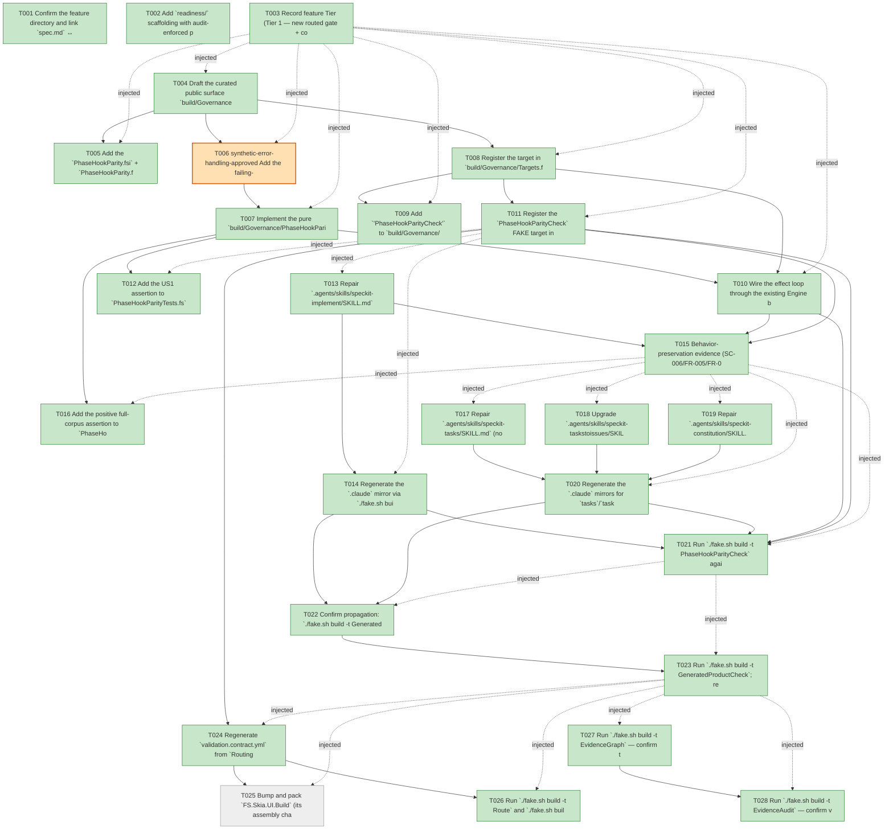

# Task Graph — 077-implement-feedback-hook-parity

## ✓ Graph is acyclic and consistent

## Skill Match Assessments

| Task | Candidate | Confidence | Signals | Reviewer disposition | Diagnostic |
|------|-----------|------------|---------|----------------------|------------|
| T001 | (none) | none |  | accepted-empty | T001: skillist trusted as declared; no owns-based capability requirement |
| T002 | (none) | none |  | accepted-empty | T002: skillist trusted as declared; no owns-based capability requirement |
| T003 | (none) | none |  | accepted-empty | T003: skillist trusted as declared; no owns-based capability requirement |
| T004 | (none) | none |  | declared | T004: skillist trusted as declared; no owns-based capability requirement |
| T005 | (none) | none |  | accepted-empty | T005: skillist trusted as declared; no owns-based capability requirement |
| T006 | (none) | none |  | declared | T006: skillist trusted as declared; no owns-based capability requirement |
| T007 | (none) | none |  | declared | T007: skillist trusted as declared; no owns-based capability requirement |
| T008 | (none) | none |  | declared | T008: skillist trusted as declared; no owns-based capability requirement |
| T009 | (none) | none |  | accepted-empty | T009: skillist trusted as declared; no owns-based capability requirement |
| T010 | (none) | none |  | declared | T010: skillist trusted as declared; no owns-based capability requirement |
| T011 | (none) | none |  | declared | T011: skillist trusted as declared; no owns-based capability requirement |
| T012 | (none) | none |  | declared | T012: skillist trusted as declared; no owns-based capability requirement |
| T013 | (none) | none |  | accepted-empty | T013: skillist trusted as declared; no owns-based capability requirement |
| T014 | (none) | none |  | accepted-empty | T014: skillist trusted as declared; no owns-based capability requirement |
| T015 | (none) | none |  | accepted-empty | T015: skillist trusted as declared; no owns-based capability requirement |
| T016 | (none) | none |  | declared | T016: skillist trusted as declared; no owns-based capability requirement |
| T017 | (none) | none |  | accepted-empty | T017: skillist trusted as declared; no owns-based capability requirement |
| T018 | (none) | none |  | accepted-empty | T018: skillist trusted as declared; no owns-based capability requirement |
| T019 | (none) | none |  | accepted-empty | T019: skillist trusted as declared; no owns-based capability requirement |
| T020 | (none) | none |  | accepted-empty | T020: skillist trusted as declared; no owns-based capability requirement |
| T021 | (none) | none |  | declared | T021: skillist trusted as declared; no owns-based capability requirement |
| T022 | (none) | none |  | declared | T022: skillist trusted as declared; no owns-based capability requirement |
| T023 | (none) | none |  | declared | T023: skillist trusted as declared; no owns-based capability requirement |
| T024 | (none) | none |  | accepted-empty | T024: skillist trusted as declared; no owns-based capability requirement |
| T025 | (none) | none |  | accepted-empty | T025: skillist trusted as declared; no owns-based capability requirement |
| T026 | (none) | none |  | accepted-empty | T026: skillist trusted as declared; no owns-based capability requirement |
| T027 | speckit-evidence-graph | high | owns:graph-validation | accepted | T027: owns graph-validation requires skill speckit-evidence-graph; trigger_group=owns; matched_trigger=owns:graph-validation |
| T028 | speckit-evidence-audit | high | owns:evidence-audit | accepted | T028: owns evidence-audit requires skill speckit-evidence-audit; trigger_group=owns; matched_trigger=owns:evidence-audit |

## Status counts (effective)

| Status | Count |
|--------|-------|
| [ ] pending | 1 |
| [X] done | 26 |
| [S] synthetic | 1 |
| [S*] auto-synthetic | 0 |
| accepted [SEH] synthetic | 1 |
| unaccepted synthetic | 0 |

## Synthetic Error-Handling Classification

| Task | Accepted | Label | Design source | Synthetic input class | Expected error behavior | Diagnostics |
|------|----------|-------|---------------|-----------------------|-------------------------|-------------|
| T006 | yes | yes | plan.md Constitution Check ("Synthetic evidence") + research.md D4 | block-stripped SKILL.md body (modern markers removed, in-memory string) | guard emits a `phase-hook-parity` finding / `PhaseHookParityCheck` fails | (none) |

## Graph



## ASCII view

```
T001 [X] Confirm the feature directory and link `spec.md` ↔ `plan.md` ↔ this `tasks.md`; confirm `.specify/feature.json` resolves to `specs/077-implement-feedback-hook-parity`
T002 [X] Add `readiness/` scaffolding with audit-enforced placeholders discoverable before implementation: `phase-hook-parity-check.md`, `skill-sync.md`, `template-check.md`, `generated-product-check.md`, `governance-risk-levels.md`, `aggregate-hang-diagnostics.md`, `runtime-limitations.md`, `generated-guidance-validation.md`, `evidence-graph.md`, `evidence-audit.md` — each naming its authoritative command, artifact path, failure class, and next action
T003 [X] Record feature Tier (Tier 1 — new routed gate + consumer-facing skill text), affected layer (governance `build/Governance/**` + `.agents/skills/**`, no product `.fsi`), public-API impact (none on product libraries), Elmish/MVU applicability (reuse of the existing governance Engine boundary — a new `StartTarget PhaseHookParityCheck` `Msg` emits a `PhaseHookScan` effect; the check itself is the pure `checkCorpus`; interpreter evidence is the real guard run, T021), and evidence obligations (guard PASS on repaired tree + red→green guard test + `.agents`↔`.claude` sync + generated-output propagation)
T004 [X] Draft the curated public surface `build/Governance/PhaseHookParity.fsi` (`roster : string list`; `type ParsedPhaseSkill = { Phase; RelPath; Body }`; `val checkCorpus : ParsedPhaseSkill list -> Findings.ValidationFinding list`; `val renderReport : ParsedPhaseSkill list -> string`) per `data-model.md`
T005 [X] Add the `PhaseHookParity.fsi` + `PhaseHookParity.fs` compile entries to `build/Governance/Governance.fsproj` (after `Findings`, before `Routing`)
T006 [S] synthetic-error-handling-approved Add the failing-first **negative** test in `tests/Governance.Tests/PhaseHookParityTests.fs`: feed a block-stripped SKILL.md body (modern markers removed) and assert a `phase-hook-parity` finding is produced — red before the guard logic exists (`./fake.sh build -t Dev`)   ← accepted [SEH]
T007 [X] Implement the pure `build/Governance/PhaseHookParity.fs`: the fixed nine-phase `roster`, the three strict literal markers (`.specify/extensions/*/*.yml` ≥ 2×, `(extension, command)` dedupe language, `## Effective hooks for <phase>`), `checkCorpus` (one finding per missing marker; missing/unreadable roster skill ⇒ named failure), and `renderReport` — turning T006 green
T008 [X] Register the target in `build/Governance/Targets.fs`: `PhaseHookParityCheck` DU variant + `allTargets` + `name` + `directPrerequisites [Build]` + timeout/cost/owner metadata
T009 [X] Add `"PhaseHookParityCheck"` to `build/Governance/AgentValidation.fs` `knownGates`
T010 [X] Wire the effect loop through the existing Engine boundary: `Engine/Update.fs` `StartTarget PhaseHookParityCheck` → `PhaseHookScan` effect; `Engine/Interpret.fs` `PhaseHookScan` handler (enumerate roster `.agents`/`.claude` SKILL.md → `checkCorpus` → `renderReport` → write `readiness/phase-hook-parity-check.md` → `failwith` on findings); `Front/Governance.fs` `runPhaseHookParityCheck` entry mirroring the `SkillQualityCheck` runner
T011 [X] Register the `PhaseHookParityCheck` FAKE target in `build.fsx`/`scripts/build/**` and add `Targets.PhaseHookParityCheck` to the `skill-quality` rule `RequiredGates` in `build/Governance/Routing.fs`
T012 [X] Add the US1 assertion to `PhaseHookParityTests.fs`: the real `speckit-implement` SKILL.md (and its `.claude` mirror) passes all three markers — red until T013 repairs the skill (`./fake.sh build -t Dev`)
T013 [X] Repair `.agents/skills/speckit-implement/SKILL.md`: add the `before_implement` pre-hook block and the `after_implement` post-hook block (multi-file discovery across central `extensions.yml` + every `.specify/extensions/*/*.yml`, dedupe by `(extension, command)`, optional/mandatory/condition/`enabled:false` precedence) plus the `## Effective hooks for implement` consolidated notice, mirroring `speckit-plan` (anchor = the implement workflow's first section)
T014 [X] Regenerate the `.claude` mirror via `./fake.sh build -t RefreshSurfaceBaselines` and confirm `SkillSyncCheck` reports no `.agents`↔`.claude` drift for `speckit-implement` (watch trailing-newline drift)
T015 [X] Behavior-preservation evidence (SC-006/FR-005/FR-009): run the implement phase / the guard in this repo (which registers only `git`/`evidence` hooks, no feedback) and confirm the new blocks are a silent no-op — no new error, prompt, or feedback file; record in `readiness/runtime-limitations.md`
T016 [X] Add the positive full-corpus assertion to `PhaseHookParityTests.fs` (SC-002/SC-003): every one of the nine roster phase skills — and each `.claude` mirror — passes all three markers; red until T017–T019 repair the remaining skills
T017 [X] Repair `.agents/skills/speckit-tasks/SKILL.md` (none → modern): add the `before_tasks`/`after_tasks` discovery blocks + `## Effective hooks for tasks` notice (FR-004)
T018 [X] Upgrade `.agents/skills/speckit-taskstoissues/SKILL.md` (legacy single-file → modern multi-file): replace the central-`extensions.yml`-only block with multi-file `.specify/extensions/*/*.yml` discovery + `(extension, command)` dedupe + `## Effective hooks for taskstoissues` notice
T019 [X] Repair `.agents/skills/speckit-constitution/SKILL.md` (none → modern): add the `before_constitution`/`after_constitution` blocks so the **mandatory** `before_constitution` `git.initialize` hook is honored, plus the `## Effective hooks for constitution` notice
T020 [X] Regenerate the `.claude` mirrors for `tasks`/`taskstoissues`/`constitution` via `RefreshSurfaceBaselines` and confirm `SkillSyncCheck` reports no drift (SC-004)
T021 [X] Run `./fake.sh build -t PhaseHookParityCheck` against the fully repaired tree → all nine in-scope phase skills PASS; capture `readiness/phase-hook-parity-check.md` (the real interpreter-edge guard run is the emitted-effect evidence for the new `PhaseHookScan` effect)
T022 [X] Confirm propagation: `./fake.sh build -t GeneratedGuidanceCheck` then `./fake.sh build -t TemplateCheck` (`TemplateSmoke` asserts the corrected `speckit-implement`/`speckit-tasks` skills are present in generated `.agents` and `.claude` output); capture `readiness/template-check.md` + `readiness/generated-guidance-validation.md` (SC-005)
T023 [X] Run `./fake.sh build -t GeneratedProductCheck`; record the result in `readiness/generated-product-check.md` and treat the known local env failure (no template `feature.json` / `Map.empty` env) as **non-authoritative** in `readiness/aggregate-hang-diagnostics.md` — rely on `TemplateCheck`/CI for the propagation proof
T024 [X] Regenerate `validation.contract.yml` from `Routing.fs` via `RefreshSurfaceBaselines` (new `PhaseHookParityCheck` gate on the `skill-quality` rule) and confirm `TargetMetadataDrift` reports no contract drift
T025 [ ] Bump and pack `FS.Skia.UI.Build` (its assembly changed) per the build-package-version-drift guidance so the template-posture check stays green, even though no product src libs were touched
T026 [X] Run `./fake.sh build -t Route` and `./fake.sh build -t Route --enforce`: confirm a `.agents/skills/**` diff escalates to `FocusedAuthority` and that `PhaseHookParityCheck` appears in the printed `skill-quality` gate list with its required evidence artifact present
T027 [X] Run `./fake.sh build -t EvidenceGraph` — confirm the echoed `feature-directory`/`tasks=<n>` match this feature, no cycles, no dangling refs, no `[S*]` surprises
T028 [X] Run `./fake.sh build -t EvidenceAudit` — confirm verdict PASS (synthetic-propagation + diff-scan); the single `[SEH]` row (T006) must remain `[S]`/`accepted-seh`, never `[X]`
```

## Injected checkpoint edges (Phase N+1 → Phase N) — FR-007

- T003 → T004  (auto-injected Phase-checkpoint edge)
- T003 → T005  (auto-injected Phase-checkpoint edge)
- T003 → T006  (auto-injected Phase-checkpoint edge)
- T003 → T007  (auto-injected Phase-checkpoint edge)
- T003 → T008  (auto-injected Phase-checkpoint edge)
- T003 → T009  (auto-injected Phase-checkpoint edge)
- T003 → T010  (auto-injected Phase-checkpoint edge)
- T003 → T011  (auto-injected Phase-checkpoint edge)
- T011 → T012  (auto-injected Phase-checkpoint edge)
- T011 → T013  (auto-injected Phase-checkpoint edge)
- T011 → T014  (auto-injected Phase-checkpoint edge)
- T015 → T016  (auto-injected Phase-checkpoint edge)
- T015 → T017  (auto-injected Phase-checkpoint edge)
- T015 → T018  (auto-injected Phase-checkpoint edge)
- T015 → T019  (auto-injected Phase-checkpoint edge)
- T015 → T020  (auto-injected Phase-checkpoint edge)
- T015 → T021  (auto-injected Phase-checkpoint edge)
- T021 → T022  (auto-injected Phase-checkpoint edge)
- T021 → T023  (auto-injected Phase-checkpoint edge)
- T023 → T024  (auto-injected Phase-checkpoint edge)
- T023 → T025  (auto-injected Phase-checkpoint edge)
- T023 → T026  (auto-injected Phase-checkpoint edge)
- T023 → T027  (auto-injected Phase-checkpoint edge)
- T023 → T028  (auto-injected Phase-checkpoint edge)

## Resolved skillist ids — FR-007

Resolved skillist-id set (7): fs-skia-template-update, fsharp-build-orchestration, fsharp-code-generation, fsharp-io-globbing, fsharp-parsing, speckit-evidence-audit, speckit-evidence-graph

