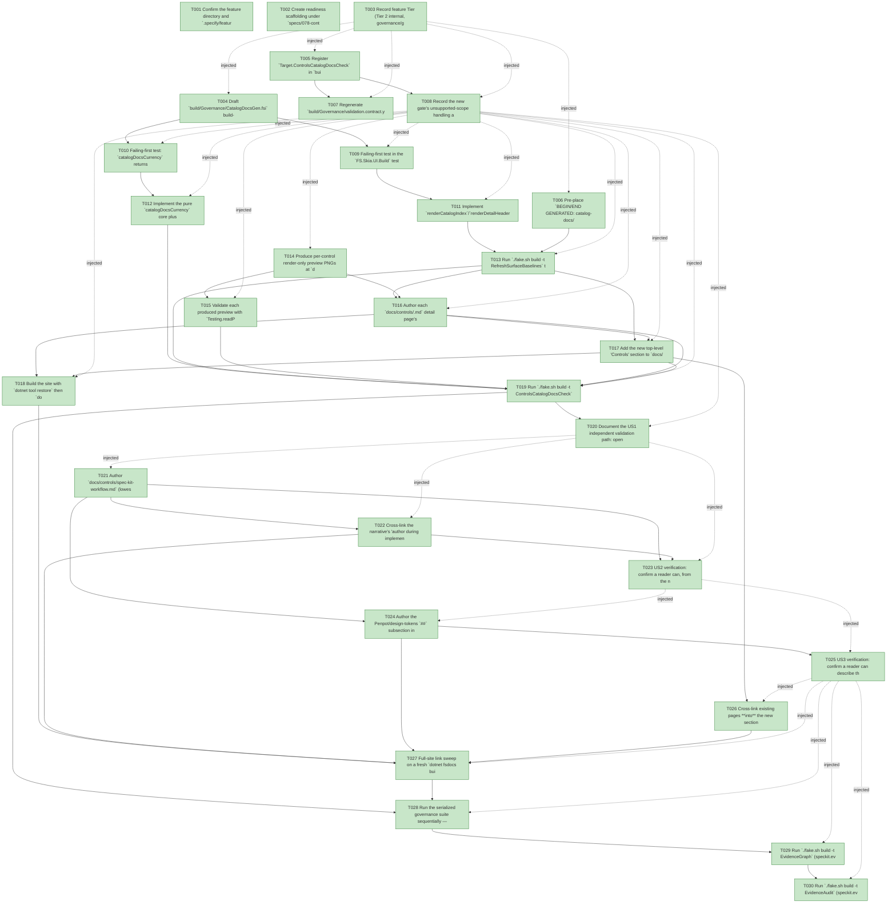

# Task Graph — 078-controls-doc-catalog

## ✓ Graph is acyclic and consistent

## Skill Match Assessments

| Task | Candidate | Confidence | Signals | Reviewer disposition | Diagnostic |
|------|-----------|------------|---------|----------------------|------------|
| T001 | (none) | none |  | accepted-empty | T001: skillist trusted as declared; no owns-based capability requirement |
| T002 | (none) | none |  | accepted-empty | T002: skillist trusted as declared; no owns-based capability requirement |
| T003 | (none) | none |  | accepted-empty | T003: skillist trusted as declared; no owns-based capability requirement |
| T004 | (none) | none |  | declared | T004: skillist trusted as declared; no owns-based capability requirement |
| T005 | (none) | none |  | declared | T005: skillist trusted as declared; no owns-based capability requirement |
| T006 | (none) | none |  | declared | T006: skillist trusted as declared; no owns-based capability requirement |
| T007 | (none) | none |  | declared | T007: skillist trusted as declared; no owns-based capability requirement |
| T008 | (none) | none |  | accepted-empty | T008: skillist trusted as declared; no owns-based capability requirement |
| T009 | (none) | none |  | declared | T009: skillist trusted as declared; no owns-based capability requirement |
| T010 | (none) | none |  | declared | T010: skillist trusted as declared; no owns-based capability requirement |
| T011 | (none) | none |  | declared | T011: skillist trusted as declared; no owns-based capability requirement |
| T012 | (none) | none |  | declared | T012: skillist trusted as declared; no owns-based capability requirement |
| T013 | (none) | none |  | declared | T013: skillist trusted as declared; no owns-based capability requirement |
| T014 | (none) | none |  | declared | T014: skillist trusted as declared; no owns-based capability requirement |
| T015 | (none) | none |  | declared | T015: skillist trusted as declared; no owns-based capability requirement |
| T016 | (none) | none |  | accepted-empty | T016: skillist trusted as declared; no owns-based capability requirement |
| T017 | (none) | none |  | accepted-empty | T017: skillist trusted as declared; no owns-based capability requirement |
| T018 | (none) | none |  | declared | T018: skillist trusted as declared; no owns-based capability requirement |
| T019 | (none) | none |  | accepted-empty | T019: skillist trusted as declared; no owns-based capability requirement |
| T020 | (none) | none |  | accepted-empty | T020: skillist trusted as declared; no owns-based capability requirement |
| T021 | (none) | none |  | declared | T021: skillist trusted as declared; no owns-based capability requirement |
| T022 | (none) | none |  | declared | T022: skillist trusted as declared; no owns-based capability requirement |
| T023 | (none) | none |  | accepted-empty | T023: skillist trusted as declared; no owns-based capability requirement |
| T024 | (none) | none |  | declared | T024: skillist trusted as declared; no owns-based capability requirement |
| T025 | (none) | none |  | accepted-empty | T025: skillist trusted as declared; no owns-based capability requirement |
| T026 | (none) | none |  | accepted-empty | T026: skillist trusted as declared; no owns-based capability requirement |
| T027 | (none) | none |  | declared | T027: skillist trusted as declared; no owns-based capability requirement |
| T028 | (none) | none |  | declared | T028: skillist trusted as declared; no owns-based capability requirement |
| T029 | speckit-evidence-graph | high | owns:graph-validation | accepted | T029: owns graph-validation requires skill speckit-evidence-graph; trigger_group=owns; matched_trigger=owns:graph-validation |
| T030 | speckit-evidence-audit | high | owns:evidence-audit | accepted | T030: owns evidence-audit requires skill speckit-evidence-audit; trigger_group=owns; matched_trigger=owns:evidence-audit |

## Status counts (effective)

| Status | Count |
|--------|-------|
| [X] done | 30 |
| [S] synthetic | 0 |
| [S*] auto-synthetic | 0 |
| accepted [SEH] synthetic | 0 |
| unaccepted synthetic | 0 |

## Graph



## ASCII view

```
T001 [X] Confirm the feature directory and `.specify/feature.json` resolve to `specs/078-controls-doc-catalog`; verify the `AGENTS.md` Spec Kit marker points at this plan
T002 [X] Create readiness scaffolding under `specs/078-controls-doc-catalog/readiness/` with audit-discoverable placeholders, each naming the authoritative command, artifact path, failure class, and next action: `controls-catalog-docs.md`, `controls-preview-evidence.md`, `docs-build.md`, `visual-evidence-honesty.md`, `real-image-evidence.md`, `window-visibility.md`, `governance-risk-levels.md`, `aggregate-hang-diagnostics.md`, `runtime-limitations.md`, `generated-guidance-validation.md`, `evidence-graph.md`, `evidence-audit.md`
T003 [X] Record feature Tier (Tier 2 internal, governance/generated-guidance escalation), affected layer (`build/Governance/**` + `docs/**`), public-API/`.fsi` impact (none), MVU/Elmish applicability (N/A — pure generators at the interpreter edge), and the evidence obligations (generated index, per-control detail pages, per-control preview, currency-check PASS, site build)
T004 [X] Draft `build/Governance/CatalogDocsGen.fsi` build-tool signatures: `renderCatalogIndex`, `renderDetailHeader`, `spliceCatalogDocs`, `catalogDocsCurrency` and the `Finding` discriminated union (closed over the data-model finding classes)
T005 [X] Register `Target.ControlsCatalogDocsCheck` in `build/Governance/Targets.fs`, add it to `AgentValidation.knownGates`, and route `docs/controls/**`, `docs/img/controls/**`, the catalog single source (`CatalogGen.fs` / `src/Controls/catalog.yml`), and the new generator in `Routing.fs`
T006 [X] Pre-place `BEGIN/END GENERATED: catalog-docs/<key>` marker pairs first (filled, never invented): the index region in `docs/controls/catalog.md` and a header-region marker pair in each of the 52 `docs/controls/<id>.md` detail-page stubs
T007 [X] Regenerate `build/Governance/validation.contract.yml` from `Routing.fs` via `RefreshSurfaceBaselines` and confirm `TargetMetadataDrift` currency (contract is generated, never hand-edited)
T008 [X] Record the new gate's unsupported-scope handling and failure diagnostics: each finding class names an actionable remedy + the `RefreshSurfaceBaselines` regenerate command, and missing required artifacts fail loudly via `RequireFiles`
T009 [X] Failing-first test in the `FS.Skia.UI.Build` test project: `renderCatalogIndex`/`renderDetailHeader` round-trip + byte-identity against `CatalogGen.catalogFacts`, and `spliceCatalogDocs` idempotence (replaces only inside existing markers)
T010 [X] Failing-first test: `catalogDocsCurrency` returns the right `Finding` for each class — `IndexStale`, `MissingDetailPage`, `StaleDetailHeader`, `OrphanDetailPage`, `MissingPreview`, `UndecodablePreview`, `OrphanPreview`, `DeadLink` — and an empty list (PASS) on a clean tree (SC-002, SC-004)
T011 [X] Implement `renderCatalogIndex`/`renderDetailHeader`/`spliceCatalogDocs`: deterministic, invariant-culture projection grouped by `Category`, DisplayName→`controls/<id>.html`, one-line `Purpose`, total count, and API-reference link derived from `Module` (slug verified per research R2)
T012 [X] Implement the pure `catalogDocsCurrency` core plus its `Engine/Update.fs` edge handler (file read/listing, `WriteStructuredReport`/`FailWith`, `RequireFiles`) and wire region regeneration into the `RefreshSurfaceBaselines` handler
T013 [X] Run `./fake.sh build -t RefreshSurfaceBaselines` to fill the index region and all 52 detail-page header regions from `catalogFacts`; confirm a clean re-run produces no diff
T014 [X] Produce per-control render-only preview PNGs at `docs/img/controls/<id>.png` through the existing deterministic render-only evidence path (committed source assets, GPU-free docs CI consumes them); for any control that cannot be honestly rendered, emit **no** asset and an explicit unsupported note — never a 1×1/placeholder image
T015 [X] Validate each produced preview with `Testing.readPngArtifact` (decodable, non-1×1 dimensions, non-trivial content); record per-control honesty (mode, dimensions, fallback classification, explicit unsupported reasons) in `readiness/controls-preview-evidence.md`
T016 [X] Author each `docs/controls/<id>.md` detail page's prose/usage **outside** the generated header region — purpose/explanation, the catalog usage example where one exists (honest omission otherwise), and the preview embed or honest unsupported note
T017 [X] Add the new top-level "Controls" section to `docs/index.md` entry-point nav and wire index→detail, detail→API-reference, and detail→back-to-index links so every page is reachable (FR-008, SC-001)
T018 [X] Build the site with `dotnet tool restore` then `dotnet fsdocs build --strict --eval`; confirm the catalog index, all 52 detail pages, and previews appear in `output/`; record `readiness/docs-build.md`
T019 [X] Run `./fake.sh build -t ControlsCatalogDocsCheck` → PASS; record `readiness/controls-catalog-docs.md` (index currency vs `catalogFacts`, detail-page completeness, preview present/current/decodable, link resolution) (SC-002, SC-003, SC-004)
T020 [X] Document the US1 independent validation path: open the site index → reach the catalog in one step → 52 controls grouped by category → drill into any detail page → resolving preview + API link
T021 [X] Author `docs/controls/spec-kit-workflow.md` (lowest `index:` in the section): where controls are **chosen** (specify/plan), **authored** (implement, via the typed front door), and **validated** (the evidence/gates the workflow expects) across specify → plan → tasks → implement
T022 [X] Cross-link the narrative's "author during implement" step to `controls-design/typed-front-door.md` and the typed-controls authoring guidance; verify no dead links (FR-002 authoring path, SC-005)
T023 [X] US2 verification: confirm a reader can, from the narrative alone, name the workflow phase(s) where controls are chosen/authored/validated and point to the relevant authoring guidance; record the reviewer checklist and pass/fail outcome under `readiness/` (SC-005)
T024 [X] Author the Penpot/design-tokens `##` subsection inside `docs/controls/spec-kit-workflow.md`: how control theming derives from design tokens, the token→typed-token-surface path, where the token single source lives, linking to `controls-design/design-tokens-penpot.md` as the deep dive (FR-007)
T025 [X] US3 verification: confirm a reader can describe the design-token/Penpot → control-theming path and locate the design-token single source from the subsection; record the reviewer checklist and pass/fail outcome under `readiness/` (SC-006)
T026 [X] Cross-link existing pages **into** the new section without relocating or duplicating it: `docs/architecture/controls.md` → catalog index; `docs/controls-design/typed-front-door.md` and `design-tokens-penpot.md` referenced from the narrative (FR-006, contract S3)
T027 [X] Full-site link sweep on a fresh `dotnet fsdocs build --strict --eval`: confirm 100% of narrative, Penpot, index→detail, detail→API, and cross-link targets resolve in `output/` — no dead links (FR-009, SC-003)
T028 [X] Run the serialized governance suite sequentially — `Dev` → `ControlsCatalogDocsCheck` → `GeneratedGuidanceCheck` — and record the broad-risk-level aggregate results non-authoritatively in `readiness/` (note any environment-failure caveats)
T029 [X] Run `./fake.sh build -t EvidenceGraph` (speckit.evidence.graph) — confirm no cycles, no dangling refs, no `[S*]` surprises
T030 [X] Run `./fake.sh build -t EvidenceAudit` (speckit.evidence.audit) — confirm verdict PASS or document every `--accept-synthetic` override in the Synthetic-Evidence Inventory
```

## Injected checkpoint edges (Phase N+1 → Phase N) — FR-007

- T003 → T004  (auto-injected Phase-checkpoint edge)
- T003 → T005  (auto-injected Phase-checkpoint edge)
- T003 → T006  (auto-injected Phase-checkpoint edge)
- T003 → T007  (auto-injected Phase-checkpoint edge)
- T003 → T008  (auto-injected Phase-checkpoint edge)
- T008 → T009  (auto-injected Phase-checkpoint edge)
- T008 → T010  (auto-injected Phase-checkpoint edge)
- T008 → T011  (auto-injected Phase-checkpoint edge)
- T008 → T012  (auto-injected Phase-checkpoint edge)
- T008 → T013  (auto-injected Phase-checkpoint edge)
- T008 → T014  (auto-injected Phase-checkpoint edge)
- T008 → T015  (auto-injected Phase-checkpoint edge)
- T008 → T016  (auto-injected Phase-checkpoint edge)
- T008 → T017  (auto-injected Phase-checkpoint edge)
- T008 → T018  (auto-injected Phase-checkpoint edge)
- T008 → T019  (auto-injected Phase-checkpoint edge)
- T008 → T020  (auto-injected Phase-checkpoint edge)
- T020 → T021  (auto-injected Phase-checkpoint edge)
- T020 → T022  (auto-injected Phase-checkpoint edge)
- T020 → T023  (auto-injected Phase-checkpoint edge)
- T023 → T024  (auto-injected Phase-checkpoint edge)
- T023 → T025  (auto-injected Phase-checkpoint edge)
- T025 → T026  (auto-injected Phase-checkpoint edge)
- T025 → T027  (auto-injected Phase-checkpoint edge)
- T025 → T028  (auto-injected Phase-checkpoint edge)
- T025 → T029  (auto-injected Phase-checkpoint edge)
- T025 → T030  (auto-injected Phase-checkpoint edge)

## Resolved skillist ids — FR-007

Resolved skillist-id set (12): fs-skia-design-tokens, fs-skia-evidence-mode, fs-skia-skiaviewer, fs-skia-testing, fs-skia-typed-controls, fsdocs-build, fsdocs-technical, fsharp-build-orchestration, fsharp-code-generation, fsharp-io-globbing, speckit-evidence-audit, speckit-evidence-graph

