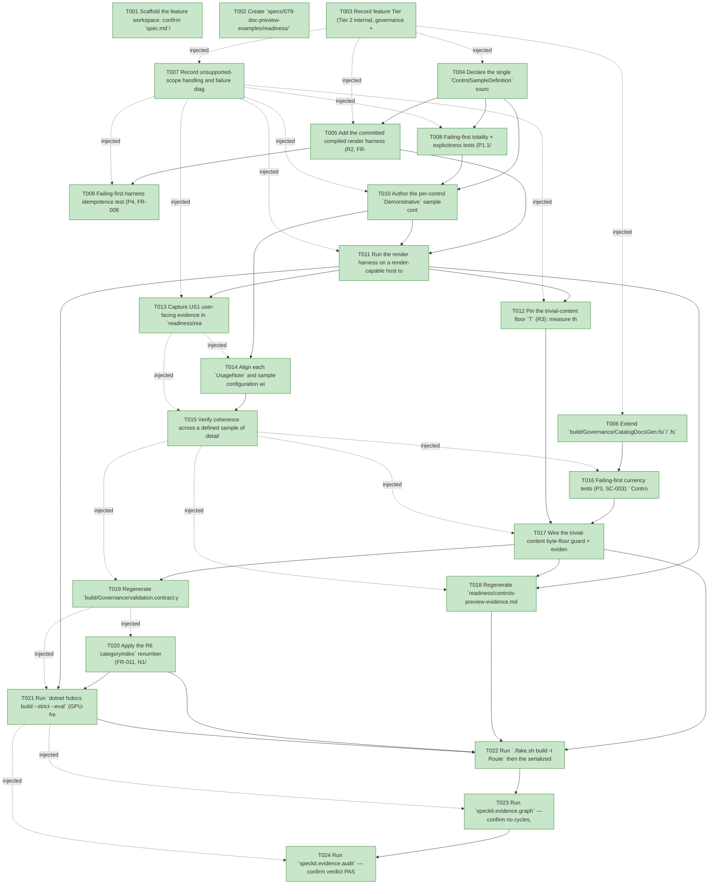

# Task Graph — 079-doc-preview-examples

## ✓ Graph is acyclic and consistent

## Skill Match Assessments

| Task | Candidate | Confidence | Signals | Reviewer disposition | Diagnostic |
|------|-----------|------------|---------|----------------------|------------|
| T001 | (none) | none |  | accepted-empty | T001: skillist trusted as declared; no owns-based capability requirement |
| T002 | (none) | none |  | accepted-empty | T002: skillist trusted as declared; no owns-based capability requirement |
| T003 | (none) | none |  | accepted-empty | T003: skillist trusted as declared; no owns-based capability requirement |
| T004 | (none) | none |  | declared | T004: skillist trusted as declared; no owns-based capability requirement |
| T005 | (none) | none |  | declared | T005: skillist trusted as declared; no owns-based capability requirement |
| T006 | (none) | none |  | declared | T006: skillist trusted as declared; no owns-based capability requirement |
| T007 | (none) | none |  | declared | T007: skillist trusted as declared; no owns-based capability requirement |
| T008 | (none) | none |  | declared | T008: skillist trusted as declared; no owns-based capability requirement |
| T009 | (none) | none |  | declared | T009: skillist trusted as declared; no owns-based capability requirement |
| T010 | (none) | none |  | declared | T010: skillist trusted as declared; no owns-based capability requirement |
| T011 | (none) | none |  | declared | T011: skillist trusted as declared; no owns-based capability requirement |
| T012 | (none) | none |  | accepted-empty | T012: skillist trusted as declared; no owns-based capability requirement |
| T013 | (none) | none |  | declared | T013: skillist trusted as declared; no owns-based capability requirement |
| T014 | (none) | none |  | declared | T014: skillist trusted as declared; no owns-based capability requirement |
| T015 | (none) | none |  | accepted-empty | T015: skillist trusted as declared; no owns-based capability requirement |
| T016 | (none) | none |  | declared | T016: skillist trusted as declared; no owns-based capability requirement |
| T017 | (none) | none |  | declared | T017: skillist trusted as declared; no owns-based capability requirement |
| T018 | (none) | none |  | accepted-empty | T018: skillist trusted as declared; no owns-based capability requirement |
| T019 | (none) | none |  | declared | T019: skillist trusted as declared; no owns-based capability requirement |
| T020 | (none) | none |  | declared | T020: skillist trusted as declared; no owns-based capability requirement |
| T021 | (none) | none |  | declared | T021: skillist trusted as declared; no owns-based capability requirement |
| T022 | (none) | none |  | declared | T022: skillist trusted as declared; no owns-based capability requirement |
| T023 | speckit-evidence-graph | high | owns:graph-validation | accepted | T023: owns graph-validation requires skill speckit-evidence-graph; trigger_group=owns; matched_trigger=owns:graph-validation |
| T024 | speckit-evidence-audit | high | owns:evidence-audit | accepted | T024: owns evidence-audit requires skill speckit-evidence-audit; trigger_group=owns; matched_trigger=owns:evidence-audit |

## Status counts (effective)

| Status | Count |
|--------|-------|
| [X] done | 24 |
| [S] synthetic | 0 |
| [S*] auto-synthetic | 0 |
| accepted [SEH] synthetic | 0 |
| unaccepted synthetic | 0 |

## Graph



## ASCII view

```
T001 [X] Scaffold the feature workspace: confirm `spec.md`/`plan.md`/`research.md`/`data-model.md`/`contracts/` are linked, and update `AGENTS.md` SPECKIT plan reference 078 → `specs/079-doc-preview-examples/plan.md`
T002 [X] Create `specs/079-doc-preview-examples/readiness/` with audit-enforced placeholder files discoverable before implementation: `controls-preview-evidence.md`, `controls-catalog-docs.md`, `docs-build.md`, `real-image-evidence.md`, `visual-evidence-honesty.md`, `window-visibility.md`, `governance-risk-levels.md`, `aggregate-hang-diagnostics.md`, `runtime-limitations.md`, `generated-guidance-validation.md`, `gate-diagnostics.md`, `evidence-graph.md`, `evidence-audit.md` (each naming its authoritative command, artifact path, failure class, next action)
T003 [X] Record feature Tier (Tier 2 internal, governance + `docs/**` consumed-contract generation surface), affected layers, **no public `.fsi`/API/behavior change**, MVU **N/A (runtime)**, and the real evidence obligations (preview evidence, catalog currency, docs build) in `readiness/runtime-limitations.md`
T004 [X] Declare the single `ControlSampleDefinition` source (R1, FR-002): one entry per `CatalogGen.catalogFacts` id, in catalog order, each with `Kind = Demonstrative | Unsupported`, a typed-front-door `Build`, optional fixed per-control `Canvas` (default 320×160), and a `UsageNote` — established as the one reviewable source (content authored in US1)
T005 [X] Add the committed compiled render harness (R2, FR-003/P2) referencing `FS.Skia.UI.Controls.Typed` + `Scene` + `SkiaViewer` + SkiaSharp: loop `Demonstrative` entries → `Widget.toControl` → `Control.render Theme.light` → `SceneNode.Group` → `SkiaViewer.captureScreenshotEvidence` with `CaptureMode = ViewerRenderTargetPng` → write `docs/img/controls/<id>.png`; write **no** image for `Unsupported`; document its invocation in quickstart
T006 [X] Extend `build/Governance/CatalogDocsGen.fsi`/`.fs` (pure core, SkiaSharp-free) with the `PreviewContentVerdict` set and a `TrivialPreview` byte-floor finding alongside the existing `Undecodable*`/`Missing*`/`Stale*`/`Orphan*`/`DeadLink` findings (data-model entity 3) — guard logic wired in US3
T007 [X] Record unsupported-scope handling and failure diagnostics in `readiness/runtime-limitations.md` + `readiness/visual-evidence-honesty.md`: how the harness/gate distinguish an honest `Unsupported` declaration (no image, `preview-status: unsupported` marker) from a real `RenderingFailure`, per the evidence-mode benign/blocking rules
T008 [X] Failing-first totality + explicitness tests (P1.1/P1.2): the set of `ControlSampleDefinition` ids set-equals `catalogFacts` ids (no gap/orphan), and no `Demonstrative` entry renders empty-content widgets
T009 [X] Failing-first harness idempotence test (P4, FR-008, SC-004): re-running the render harness over the same sample source yields byte-identical PNGs (asserted over committed bytes / a hash manifest)
T010 [X] Author the per-control `Demonstrative` sample content for every renderable control by family (R4): display text/glyphs/runs, labelled inputs, mid-track slider, checked/on selections, populated list/data-grid with selected row + columns/rows, sample chart series, composed layout children, single representative static frame for motion/overlay — sized/truncated to stay legible within the (fixed, documented) canvas (FR-001, SC-001)
T011 [X] Run the render harness on a render-capable host to regenerate `docs/img/controls/<id>.png` through the real render-only path; commit `Demonstrative` PNGs and **no** image for `Unsupported` ids (FR-003, FR-008)
T012 [X] Pin the trivial-content floor `T` (R3): measure the smallest demonstrative PNG and the empty-canvas (~363-byte) size, set `T` to a documented round value comfortably between them with headroom, and record the procedure/result in research/readiness
T013 [X] Capture US1 user-facing evidence in `readiness/real-image-evidence.md` + `readiness/visual-evidence-honesty.md`: catalog index + several detail pages show recognizable, control-specific content (not empty boxes), with 0 controls near-empty (SC-001)
T014 [X] Align each `UsageNote` and sample configuration with the control's documented detail-page usage so image and prose stay coherent (FR-006): e.g. a control documented as requiring `columns`/`rows` depicts columns and rows
T015 [X] Verify coherence across a defined sample of detail pages — at minimum ≥8 pages spanning the distinct control families (display/text, labelled input, slider, checkbox/switch, list-box, data-grid, chart, composed/overlay) — and record the review (0 contradictions) in `readiness/controls-catalog-docs.md` (SC-002)
T016 [X] Failing-first currency tests (P3, SC-003): `ControlsCatalogDocsCheck` FAILs with the matching finding on one negative case per class — `Trivial` (bytes < `T`), `Missing`, `Undecodable`, `Orphan`, stale/missing detail region, `DeadLink` — and PASSes on the regenerated demonstrative tree
T017 [X] Wire the trivial-content byte-floor guard + evidence-record consistency cross-check at the `build/Governance/Engine/Update.fs` edge; the report names `TrivialPreview` with an actionable remedy and the re-render command (FR-004/FR-005, P3.3)
T018 [X] Regenerate `readiness/controls-preview-evidence.md` honesty ledger (per-control: id, name, render-only mode, decodable, dimensions, bytes, content classification) plus the reconciled `rendered = N / unsupported = M`, `N + M == |catalog|` summary (FR-010, FR-007, SC-005); confirm `ControlsCatalogDocsCheck` PASS recorded in `readiness/controls-catalog-docs.md`
T019 [X] Regenerate `build/Governance/validation.contract.yml` from `Routing.fs` IFF a routed glob changed (never hand-edited; else confirm `TargetMetadataDrift` shows no drift)
T020 [X] Apply the R6 `categoryindex` renumber (FR-011, N1/N2): `docs/controls/*` 2→8, `docs/roadmap.md` 7→9, `docs/development.md`/`docs/distribution.md`/`docs/migration/v2-to-v3.md` 8→10 — change **only** `categoryindex` lines; no file moves, no `index`/slug changes
T021 [X] Run `dotnet fsdocs build --strict --eval` (GPU-free, no render host required — FR-009) and record in `readiness/docs-build.md`: built sidebar order is Examples → **Controls** → Guides, every preview present, every image and cross-link into `docs/controls/` resolves (FR-009, N3, SC-004, SC-006)
T022 [X] Run `./fake.sh build -t Route` then the serialized FAKE order it prints (`Dev`, `GeneratedGuidanceCheck`, `TemplateCheck`, `GeneratedProductCheck`) sequentially; name the small/medium/broad governance risk level and focused validation in `readiness/governance-risk-levels.md`, recording non-authoritative aggregate results (incl. the known local `GeneratedProductCheck` environment-failure) in `readiness/aggregate-hang-diagnostics.md`
T023 [X] Run `speckit.evidence.graph` — confirm no cycles, no dangling refs, no `[S*]` surprises; write `readiness/evidence-graph.md`
T024 [X] Run `speckit.evidence.audit` — confirm verdict PASS (no `[S]` expected at merge) or document every `--accept-synthetic` override; write `readiness/evidence-audit.md`
```

## Injected checkpoint edges (Phase N+1 → Phase N) — FR-007

- T003 → T004  (auto-injected Phase-checkpoint edge)
- T003 → T005  (auto-injected Phase-checkpoint edge)
- T003 → T006  (auto-injected Phase-checkpoint edge)
- T003 → T007  (auto-injected Phase-checkpoint edge)
- T007 → T008  (auto-injected Phase-checkpoint edge)
- T007 → T009  (auto-injected Phase-checkpoint edge)
- T007 → T010  (auto-injected Phase-checkpoint edge)
- T007 → T011  (auto-injected Phase-checkpoint edge)
- T007 → T012  (auto-injected Phase-checkpoint edge)
- T007 → T013  (auto-injected Phase-checkpoint edge)
- T013 → T014  (auto-injected Phase-checkpoint edge)
- T013 → T015  (auto-injected Phase-checkpoint edge)
- T015 → T016  (auto-injected Phase-checkpoint edge)
- T015 → T017  (auto-injected Phase-checkpoint edge)
- T015 → T018  (auto-injected Phase-checkpoint edge)
- T015 → T019  (auto-injected Phase-checkpoint edge)
- T019 → T020  (auto-injected Phase-checkpoint edge)
- T019 → T021  (auto-injected Phase-checkpoint edge)
- T021 → T023  (auto-injected Phase-checkpoint edge)
- T021 → T024  (auto-injected Phase-checkpoint edge)

## Resolved skillist ids — FR-007

Resolved skillist-id set (12): fs-skia-evidence-mode, fs-skia-layout-readability, fs-skia-scene, fs-skia-skiaviewer, fs-skia-typed-controls, fs-skia-ui-widgets, fsdocs-build, fsharp-build-orchestration, fsharp-code-generation, fsharp-io-globbing, speckit-evidence-audit, speckit-evidence-graph

