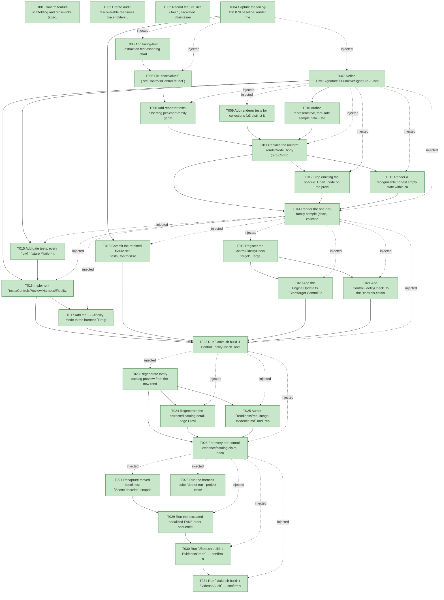

# Task Graph — 080-control-render-fidelity

## ✓ Graph is acyclic and consistent

## Skill Match Assessments

| Task | Candidate | Confidence | Signals | Reviewer disposition | Diagnostic |
|------|-----------|------------|---------|----------------------|------------|
| T001 | (none) | none |  | accepted-empty | T001: skillist trusted as declared; no owns-based capability requirement |
| T002 | (none) | none |  | declared | T002: skillist trusted as declared; no owns-based capability requirement |
| T003 | (none) | none |  | accepted-empty | T003: skillist trusted as declared; no owns-based capability requirement |
| T004 | (none) | none |  | declared | T004: skillist trusted as declared; no owns-based capability requirement |
| T005 | (none) | none |  | declared | T005: skillist trusted as declared; no owns-based capability requirement |
| T006 | (none) | none |  | declared | T006: skillist trusted as declared; no owns-based capability requirement |
| T007 | (none) | none |  | declared | T007: skillist trusted as declared; no owns-based capability requirement |
| T008 | (none) | none |  | declared | T008: skillist trusted as declared; no owns-based capability requirement |
| T009 | (none) | none |  | declared | T009: skillist trusted as declared; no owns-based capability requirement |
| T010 | (none) | none |  | declared | T010: skillist trusted as declared; no owns-based capability requirement |
| T011 | (none) | none |  | declared | T011: skillist trusted as declared; no owns-based capability requirement |
| T012 | (none) | none |  | declared | T012: skillist trusted as declared; no owns-based capability requirement |
| T013 | (none) | none |  | declared | T013: skillist trusted as declared; no owns-based capability requirement |
| T014 | (none) | none |  | declared | T014: skillist trusted as declared; no owns-based capability requirement |
| T015 | (none) | none |  | declared | T015: skillist trusted as declared; no owns-based capability requirement |
| T016 | (none) | none |  | declared | T016: skillist trusted as declared; no owns-based capability requirement |
| T017 | (none) | none |  | declared | T017: skillist trusted as declared; no owns-based capability requirement |
| T018 | (none) | none |  | declared | T018: skillist trusted as declared; no owns-based capability requirement |
| T019 | (none) | none |  | declared | T019: skillist trusted as declared; no owns-based capability requirement |
| T020 | (none) | none |  | declared | T020: skillist trusted as declared; no owns-based capability requirement |
| T021 | (none) | none |  | declared | T021: skillist trusted as declared; no owns-based capability requirement |
| T022 | (none) | none |  | declared | T022: skillist trusted as declared; no owns-based capability requirement |
| T023 | (none) | none |  | declared | T023: skillist trusted as declared; no owns-based capability requirement |
| T024 | (none) | none |  | declared | T024: skillist trusted as declared; no owns-based capability requirement |
| T025 | (none) | none |  | declared | T025: skillist trusted as declared; no owns-based capability requirement |
| T026 | (none) | none |  | declared | T026: skillist trusted as declared; no owns-based capability requirement |
| T027 | (none) | none |  | declared | T027: skillist trusted as declared; no owns-based capability requirement |
| T028 | (none) | none |  | declared | T028: skillist trusted as declared; no owns-based capability requirement |
| T029 | (none) | none |  | declared | T029: skillist trusted as declared; no owns-based capability requirement |
| T030 | speckit-evidence-graph | high | owns:graph-validation | accepted | T030: owns graph-validation requires skill speckit-evidence-graph; trigger_group=owns; matched_trigger=owns:graph-validation |
| T031 | speckit-evidence-audit | high | owns:evidence-audit | accepted | T031: owns evidence-audit requires skill speckit-evidence-audit; trigger_group=owns; matched_trigger=owns:evidence-audit |

## Status counts (effective)

| Status | Count |
|--------|-------|
| [X] done | 31 |
| [S] synthetic | 0 |
| [S*] auto-synthetic | 0 |
| accepted [SEH] synthetic | 0 |
| unaccepted synthetic | 0 |

## Graph



## ASCII view

```
T001 [X] Confirm feature scaffolding and cross-links (spec.md, plan.md, research.md, data-model.md, contracts/, quickstart.md); confirm branch `080-control-render-fidelity`
T002 [X] Create audit-discoverable readiness placeholders under `specs/080-control-render-fidelity/readiness/`: `control-fidelity.md`, `real-image-evidence.md`, `usage-coherence.md`, `visual-evidence-honesty.md`, `window-visibility.md`, `governance-risk-levels.md`, `aggregate-hang-diagnostics.md`, `runtime-limitations.md`, `generated-guidance-validation.md` — each naming the authoritative command, artifact path, failure class, and next action
T003 [X] Record feature Tier (Tier 1, escalated `maintainer-verify`), affected packages (`FS.Skia.UI.Controls`, `FS.Skia.UI.SkiaViewer`, `FS.Skia.UI.Build`, `FS.Skia.UI.Scene`), public-API impact (no public `.fsi` delta expected), Principle IV N/A rationale, evidence obligations, and the small/medium/broad governance risk levels with focused validation per level
T004 [X] Capture the failing-first 079 baseline: render the current schematic previews (`-- --render`) and stage the pre-fix label-on-box PNGs from `main` (e.g. `line-chart`, `list-box`, `image`, `icon`) as `lowfi` fixture candidates (quickstart §1; SC-003 red precondition)
T005 [X] Add failing-first extraction test asserting `chartValues` yields the structured `ChartSeries`/`ChartPoint` points (with X/Y/Label) for a typed chart control built from `sampleSeries` — today it yields `[]` (FR-002; root cause `Control.fs:159`)
T006 [X] Fix `chartValues` (`src/Controls/Control.fs:159`) to read `UntypedValue(ChartSeries list)` under `"series"` (line/bar/scatter) and `UntypedValue(ChartPoint list)` under `"values"` (pie), preserving X/Y/Label, keeping the flat-list fallback; make T005 green (FR-002)
T007 [X] Define `PixelSignature`/`PrimitiveSignature`/`ContentSignature` and the fail-closed `FidelityDeclaration` (`Signature` | `UnsupportedNoPreview`) in the harness, and add `Fidelity` as a **required** field on `ControlSampleDefinition` so a Demonstrative sample without a signature does not compile (data-model; content-signature.contract; D5/FR-013)
T008 [X] Add renderer tests asserting per-chart-family geometry is present in `Scene.describe`: line → `PathElement`, bar → `RectangleElement` (≥ #points), pie → `ArcElement`, scatter → `PointsElement`/`CircleElement`, graph → `CircleElement` + `LineElement`, all within canvas bounds (FR-002; US1 Acceptance 1)
T009 [X] Add renderer tests for collections (≥3 distinct item rows), value/selection chrome+state (track+thumb, filled progress, radio circles with selection, tab strip with active tab, toggle/tick), `image` framed placeholder, and `icon` font-supported glyph — all within canvas bounds (FR-003, FR-004, FR-005, FR-011; US1 Acceptance 2–4)
T010 [X] Author representative, font-safe sample data + the required `ContentSignature` for every Demonstrative control in `tests/ControlsPreview.Harness/PreviewSamples.fs`: collections ≥3 items, value/selection explicit state, `image` framed placeholder, `icon` glyph verified present in the rendering font (replace `★`); fixed literals only (FR-014; D7)
T011 [X] Replace the uniform `renderNode` body (`src/Controls/Control.fs:194`) with per-`Kind` faithful geometry lowered to existing Scene primitives within canvas bounds (charts → Path/Rectangle/Arc/Points; collections → rows; value/selection → chrome+state; `image` → frame; `icon` → glyph) (FR-001, FR-003, FR-004, FR-005)
T012 [X] Stop emitting the opaque `Chart` node on the preview path in `src/SkiaViewer/SceneRenderer.fs` so charts render as bounds-safe primitives and the `chartTop=180` off-canvas painter (`SceneRenderer.fs:394`) is bypassed (FR-002, FR-011; canvas-bounds edge case)
T013 [X] Render a recognizable honest empty state within canvas bounds for empty/missing-data controls; fall back to `Unsupported` only where no authored data yields a recognizable depiction; `custom-control` stays `Unsupported` (FR-009, FR-011)
T014 [X] Render the one-per-family sample (chart, collection, value/selection, icon, image, layout) via the harness and confirm each shows control-specific structure, not a label-on-a-box; record the family-recognition check under `readiness/real-image-evidence.md` (US1 Independent Test; SC-002)
T015 [X] Add gate tests: every `lowfi` fixture **fails** its control's signature, every `faithful` fixture **passes**; and a fail-closed test where a catalog id with neither a `Signature` nor `UnsupportedNoPreview` fails with a message naming the control (SC-003; FR-013)
T016 [X] Implement `tests/ControlsPreview.Harness/Fidelity.fs`: decode each committed PNG (`SKBitmap`), exclude the title band, compute coverage + distinct-color pixel signature, take `Scene.describe` from `Control.render Theme.light` for the primitive-kind signature, and emit a `FidelityVerdict` whose `FailureReason` names the control + missing component (FR-007; content-signature.contract; data-model)
T017 [X] Add the `-- --fidelity` mode to the harness `Program.fs` that runs the gate and writes the decoded-content report `readiness/control-fidelity.md` (per-control rows + fixture matrix); classify native-Skia-absent as a **blocking host warning** (never a silent pass) per `fs-skia-evidence-mode` (FR-008; Principle VII)
T018 [X] Commit the retained fixture set `tests/ControlsPreview.Harness/fixtures/fidelity/lowfi/*` (from the staged pre-fix `main` renders) and `faithful/*` (regenerated counterparts) with a `(* SYNTHETIC FIXTURE: ... *)` banner; lowfi MUST fail, faithful MUST pass (D6; SC-003)
T019 [X] Register the `ControlFidelityCheck` target: `Targets.Target` DU case + `allTargets` + `name` + `spec` (timeout=medium, cost=medium, owner=product) + `AgentValidation.knownGates` (fidelity-gate.contract §Target registration)
T020 [X] Add the `Engine/Update.fs` `StartTarget ControlFidelityCheck` process effect that shells out `dotnet run --project tests/ControlsPreview.Harness --no-restore -- --fidelity`, mirroring the `SkiaViewer.Tests -- --sequenced` pattern (`Update.fs:61`); keep `FS.Skia.UI.Build` SkiaSharp-free (FR-008)
T021 [X] Add `ControlFidelityCheck` to the `controls-catalog-docs` routing rule's `RequiredGates` and extend its `Paths` with `tests/ControlsPreview.Harness/**`, then regenerate `validation.contract.yml` via `./fake.sh build -t RefreshSurfaceBaselines`; `TargetMetadataDrift` enforces currency (no hand-edit) (FR-012)
T022 [X] Run `./fake.sh build -t ControlFidelityCheck` and demonstrate the red→green transition: the gate fails the pre-fix/lowfi previews and passes the faithful ones, with a control-naming message; capture to `readiness/control-fidelity.md` (US2 Independent Test; SC-003/SC-005)
T023 [X] Regenerate every catalog preview from the new renderer through the real render-only evidence path (genuine decodable PNG of documented dimensions): `docs/img/controls/*.png`; no image for `Unsupported` controls (FR-006)
T024 [X] Regenerate the corrected catalog detail-page Preview prose via `CatalogDocsGen` (`docs/controls/*.md`) so each per-control claim matches the decoded image content (FR-010)
T025 [X] Author `readiness/real-image-evidence.md` and `readiness/usage-coherence.md` against decoded images; present `custom-control` (and any non-depictable control) as honestly `Unsupported` (no image + explicit status); add a correction note on the 079 readiness overclaims pointing to 080 (FR-009, FR-010)
T026 [X] For every per-control evidence/catalog claim, decode the referenced image and confirm the described content is visibly present; confirm zero unverifiable per-control visual claims remain (US3 Independent Test; SC-004)
T027 [X] Recapture moved baselines: `Scene.describe` snapshots and screenshot baselines for chart/collection/value controls; per-package surface snapshots only if a `.fsi` actually changed (none expected — confirm; D8)
T028 [X] Run the harness suite `dotnet run --project tests/ControlsPreview.Harness -- --sequenced`; confirm totality/explicitness/idempotence retained and no product/runtime control regression (SC-006)
T029 [X] Run the escalated serialized FAKE order sequentially (shared `.fake` state): `Route --enforce`, `Dev`, `ControlFidelityCheck`, `GeneratedGuidanceCheck`, `TemplateCheck`, `GeneratedProductCheck` (known non-authoritative local env failure — record as such), capturing aggregate results to `readiness/aggregate-hang-diagnostics.md`
T030 [X] Run `./fake.sh build -t EvidenceGraph` — confirm no cycles, no dangling refs, no `[S*]` surprises; capture graph before/after
T031 [X] Run `./fake.sh build -t EvidenceAudit` — confirm verdict PASS (fidelity fixtures disclosed as gate test vectors, not product `[S]`; no `--accept-synthetic` anticipated)
```

## Injected checkpoint edges (Phase N+1 → Phase N) — FR-007

- T004 → T005  (auto-injected Phase-checkpoint edge)
- T004 → T006  (auto-injected Phase-checkpoint edge)
- T004 → T007  (auto-injected Phase-checkpoint edge)
- T007 → T008  (auto-injected Phase-checkpoint edge)
- T007 → T009  (auto-injected Phase-checkpoint edge)
- T007 → T011  (auto-injected Phase-checkpoint edge)
- T007 → T012  (auto-injected Phase-checkpoint edge)
- T007 → T013  (auto-injected Phase-checkpoint edge)
- T007 → T014  (auto-injected Phase-checkpoint edge)
- T014 → T015  (auto-injected Phase-checkpoint edge)
- T014 → T016  (auto-injected Phase-checkpoint edge)
- T014 → T017  (auto-injected Phase-checkpoint edge)
- T014 → T018  (auto-injected Phase-checkpoint edge)
- T014 → T019  (auto-injected Phase-checkpoint edge)
- T014 → T020  (auto-injected Phase-checkpoint edge)
- T014 → T021  (auto-injected Phase-checkpoint edge)
- T014 → T022  (auto-injected Phase-checkpoint edge)
- T022 → T023  (auto-injected Phase-checkpoint edge)
- T022 → T024  (auto-injected Phase-checkpoint edge)
- T022 → T025  (auto-injected Phase-checkpoint edge)
- T022 → T026  (auto-injected Phase-checkpoint edge)
- T026 → T027  (auto-injected Phase-checkpoint edge)
- T026 → T028  (auto-injected Phase-checkpoint edge)
- T026 → T029  (auto-injected Phase-checkpoint edge)
- T026 → T030  (auto-injected Phase-checkpoint edge)
- T026 → T031  (auto-injected Phase-checkpoint edge)

## Resolved skillist ids — FR-007

Resolved skillist-id set (10): fs-skia-evidence-mode, fs-skia-layout-readability, fs-skia-scene, fs-skia-skiaviewer, fs-skia-typed-controls, fs-skia-ui-widgets, fsharp-build-orchestration, fsharp-code-generation, speckit-evidence-audit, speckit-evidence-graph

