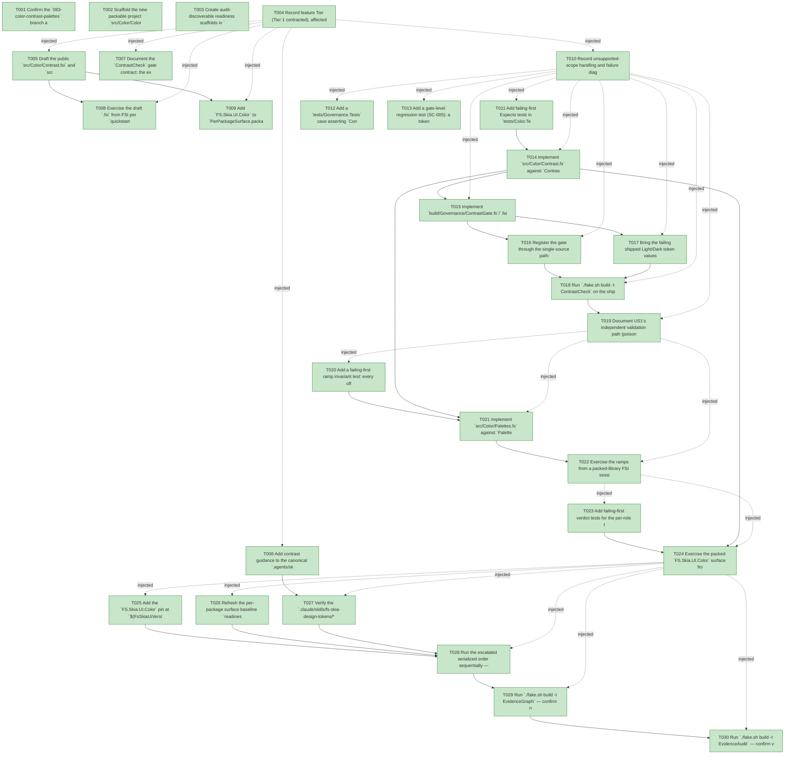

# Task Graph — 083-color-contrast-palettes

## ✓ Graph is acyclic and consistent

## Skill Match Assessments

| Task | Candidate | Confidence | Signals | Reviewer disposition | Diagnostic |
|------|-----------|------------|---------|----------------------|------------|
| T001 | (none) | none |  | accepted-empty | T001: skillist trusted as declared; no owns-based capability requirement |
| T002 | (none) | none |  | declared | T002: skillist trusted as declared; no owns-based capability requirement |
| T003 | (none) | none |  | accepted-empty | T003: skillist trusted as declared; no owns-based capability requirement |
| T004 | (none) | none |  | accepted-empty | T004: skillist trusted as declared; no owns-based capability requirement |
| T005 | (none) | none |  | declared | T005: skillist trusted as declared; no owns-based capability requirement |
| T006 | (none) | none |  | declared | T006: skillist trusted as declared; no owns-based capability requirement |
| T007 | (none) | none |  | declared | T007: skillist trusted as declared; no owns-based capability requirement |
| T008 | (none) | none |  | declared | T008: skillist trusted as declared; no owns-based capability requirement |
| T009 | (none) | none |  | accepted-empty | T009: skillist trusted as declared; no owns-based capability requirement |
| T010 | (none) | none |  | declared | T010: skillist trusted as declared; no owns-based capability requirement |
| T011 | (none) | none |  | declared | T011: skillist trusted as declared; no owns-based capability requirement |
| T012 | (none) | none |  | declared | T012: skillist trusted as declared; no owns-based capability requirement |
| T013 | (none) | none |  | declared | T013: skillist trusted as declared; no owns-based capability requirement |
| T014 | (none) | none |  | declared | T014: skillist trusted as declared; no owns-based capability requirement |
| T015 | (none) | none |  | declared | T015: skillist trusted as declared; no owns-based capability requirement |
| T016 | (none) | none |  | declared | T016: skillist trusted as declared; no owns-based capability requirement |
| T017 | (none) | none |  | declared | T017: skillist trusted as declared; no owns-based capability requirement |
| T018 | (none) | none |  | declared | T018: skillist trusted as declared; no owns-based capability requirement |
| T019 | (none) | none |  | accepted-empty | T019: skillist trusted as declared; no owns-based capability requirement |
| T020 | (none) | none |  | declared | T020: skillist trusted as declared; no owns-based capability requirement |
| T021 | (none) | none |  | declared | T021: skillist trusted as declared; no owns-based capability requirement |
| T022 | (none) | none |  | declared | T022: skillist trusted as declared; no owns-based capability requirement |
| T023 | (none) | none |  | declared | T023: skillist trusted as declared; no owns-based capability requirement |
| T024 | (none) | none |  | declared | T024: skillist trusted as declared; no owns-based capability requirement |
| T025 | (none) | none |  | declared | T025: skillist trusted as declared; no owns-based capability requirement |
| T026 | (none) | none |  | accepted-empty | T026: skillist trusted as declared; no owns-based capability requirement |
| T027 | (none) | none |  | declared | T027: skillist trusted as declared; no owns-based capability requirement |
| T028 | (none) | none |  | declared | T028: skillist trusted as declared; no owns-based capability requirement |
| T029 | speckit-evidence-graph | high | owns:graph-validation | accepted | T029: owns graph-validation requires skill speckit-evidence-graph; trigger_group=owns; matched_trigger=owns:graph-validation |
| T030 | speckit-evidence-audit | high | owns:evidence-audit | accepted | T030: owns evidence-audit requires skill speckit-evidence-audit; trigger_group=owns; matched_trigger=owns:evidence-audit |

## Status counts (effective)

| Status | Count |
|--------|-------|
| [X] done | 30 |
| [S] synthetic | 0 |
| [S*] auto-synthetic | 0 |
| accepted [SEH] synthetic | 0 |
| unaccepted synthetic | 0 |

## Graph



## ASCII view

```
T001 [X] Confirm the `083-color-contrast-palettes` branch and link spec, plan, research, data-model, contracts, and quickstart as the working set
T002 [X] Scaffold the new packable project `src/Color/Color.fsproj` (`net10.0`, `IsPackable=true`, `PackageId=FS.Skia.UI.Color`, one `ProjectReference` to `src/Scene/Scene.fsproj`) and add it to the solution
T003 [X] Create audit-discoverable readiness scaffolds in `readiness/`: `color-contrast-evidence.md` (placeholder), `governance-risk-levels.md`, `aggregate-hang-diagnostics.md`, `runtime-limitations.md`, `generated-guidance-validation.md` — each naming its authoritative command, artifact path, failure class, and next action
T004 [X] Record feature Tier (Tier 1 contracted), affected layers (new `FS.Skia.UI.Color` package, `FS.Skia.UI.Build` governance, `src/Controls` token values), public-API impact (new `.fsi`; `DesignTokens.fsi` surface unchanged), MVU applicability (N/A — pure/stateless, Principle IV not applicable), and evidence obligations
T005 [X] Draft the public `src/Color/Contrast.fsi` and `src/Color/Palettes.fsi` signatures (Role/Verdict/ContrastResult; `Contrast.relativeLuminance/ratio/compositeOver/verdict/check/checkPaint`; `Palettes.StepRole/RampVariant/PaletteStep/PaletteRamp/all/ramp/families`) — no `Model`/`Msg`/`Effect` (pure surface)
T006 [X] Add contrast guidance to the canonical `.agents/skills/fs-skia-design-tokens/SKILL.md` (how to measure contrast, choose ramp values, and interpret/cure `ContrastCheck` failures) and regenerate the `.claude` mirror through the existing sync path (FR-012)
T007 [X] Document the `ContrastCheck` gate contract: the explicit, role-tagged validated-pairing set, the text-vs-graphic threshold selection (`contrastRequiredRatio` vs fixed 3:1), the alpha-compositing and alias-resolution rules, and the `readiness/color-contrast-evidence.md` report format (FR-007, FR-009)
T008 [X] Exercise the draft `.fsi` from FSI per `quickstart.md` (representative `ratio`/`check`/`ramp` calls) and capture the session transcript to `readiness/fsi-session.txt`
T009 [X] Add `FS.Skia.UI.Color` to `PerPackageSurface.packagesInScope` and reserve the new per-package baseline path `readiness/per-package-surface/FS.Skia.UI.Color.fsi.txt` (a new package with no baseline is never treated as clean)
T010 [X] Record unsupported-scope handling and failure diagnostics in `readiness/runtime-limitations.md`: non-solid paints → `Indeterminate` (visible exclusion, never silently passed), and the fail-loud `ContrastCheck` message shape (token names, resolved colors, measured/required ratio, theme, role)
T011 [X] Add failing-first Expecto tests in `tests/Color.Tests` for WCAG reference pairs — `ratio` black-on-white ≈ 21.0 and white-on-white = 1.0 within 0.01, plus `relativeLuminance` spot values (SC-002)
T012 [X] Add a `tests/Governance.Tests` case asserting `ContrastCheck` is in `AgentValidation.knownGates` and is routed for `src/Controls/**` and `src/Color/**` changes (FR-011)
T013 [X] Add a gate-level regression test (SC-005): a token value dropped below threshold makes `ContrastCheck` fail naming the pairing, measured ratio, and required ratio; restoring an accessible value makes it pass
T014 [X] Implement `src/Color/Contrast.fs` against `Contrast.fsi`: `relativeLuminance` (sRGB linearization + 0.2126/0.7152/0.0722), `ratio` ((Llight+0.05)/(Ldark+0.05)), `compositeOver` (deterministic source-over for alpha), `verdict` (role→threshold; `Decorative` → `Exempt`), `check`, and `checkPaint` (solid → measured; non-solid → `Indeterminate` with `Ratio = nan`) (FR-001, FR-001a, FR-002, FR-003, FR-004, FR-004a)
T015 [X] Implement `build/Governance/ContrastGate.fs`/`.fsi`: the explicit documented `ValidatedPairing` set, resolve foreground/background token names to `Color` from the generated Light/Dark tokens (alias-resolved, alpha-composited over `background`), measure, select the threshold (Text→`contrastRequiredRatio`, GraphicOrUi→3.0, Decorative recorded-not-enforced), and emit `PairingOutcome` rows — pure core with the token load at the existing engine edge (FR-007, FR-008, FR-009)
T016 [X] Register the gate through the single-source path: add `ContrastCheck` to the `Targets` union, `allTargets`, and the `name`/`directPrerequisites`/`spec` arms; add it to `AgentValidation.knownGates`; append it to the `controls-public-surface` routing rule and add a new `color-contrast` rule for `src/Color/**`; regenerate `validation.contract.yml` from `Routing.fs` (FR-011)
T017 [X] Bring the failing shipped Light/Dark token values into conformance — edit only the failing `$value`s in `src/Controls/design-tokens.tokens.json` (drawing replacements from the new ramps), regenerate `DesignTokens.fs` via `RefreshSurfaceBaselines`, and confirm `DesignTokenDrift` currency; leave conforming tokens byte-unchanged (FR-010)
T018 [X] Run `./fake.sh build -t ContrastCheck` on the shipped themes, write `readiness/color-contrast-evidence.md` with every per-pairing row (both themes, measured vs required, pass/fail), and confirm PASS (SC-001)
T019 [X] Document US1's independent validation path (poison-a-token → gate fails → restore → gate passes) in `readiness/color-contrast-evidence.md`
T020 [X] Add a failing-first ramp invariant test: every offered family has a matched `Light` and `Dark` ramp, and at least one documented `Text`-step over a documented background-step measures ≥ 4.5:1 under `Contrast.ratio` (SC-003)
T021 [X] Implement `src/Color/Palettes.fs` against `Palettes.fsi`: Radix-derived, role-labelled ramps as literal `Color` steps with matched light/dark variants and `all`/`ramp`/`families`; record Radix MIT attribution in the package and skill (FR-005, FR-006)
T022 [X] Exercise the ramps from a packed-library FSI session (select a text step + background step from one family, confirm AA) and append the transcript to `readiness/fsi-session.txt` (US2 vertical slice)
T023 [X] Add failing-first verdict tests for the per-role thresholds: `Text` → AAA ≥7 / AA ≥4.5 / AA-Large ≥3 / Fail; `GraphicOrUi` → Aa ≥3 / Fail; `Decorative` → `Exempt` for **any** ratio; `checkPaint` non-solid input → `Verdict = Indeterminate` with `Ratio = nan` (the documented `System.Double.NaN` not-applicable sentinel); and `checkPaint` on a **solid** paint → a measured ratio with no render pass (declared-fill capability, FR-001a) (SC-004, FR-003, FR-004a)
T024 [X] Exercise the packed `FS.Skia.UI.Color` surface from FSI — obtain a ratio and an AA/AAA verdict in one `Contrast.check` call, replay the reference pairs and role thresholds — and append the consumer transcript to `readiness/fsi-session.txt` (SC-004 vertical slice)
T025 [X] Add the `FS.Skia.UI.Color` pin at `$(FsSkiaUiVersion)` to `template/base/Directory.Packages.props` and update the `fs-skia-template-update` expected package set; `TemplateCheck` / `GeneratedProductCheck` revalidate the new pin (FR-013)
T026 [X] Refresh the per-package surface baseline `readiness/per-package-surface/FS.Skia.UI.Color.fsi.txt` (Tier 1) from the current `FS.Skia.UI.Color` surface and confirm no surface drift
T027 [X] Verify the `.claude/skills/fs-skia-design-tokens/**` mirror is regenerated and carries the contrast guidance (`SkillSyncCheck` / `GeneratedGuidanceCheck`); record the outcome in `readiness/generated-guidance-validation.md`
T028 [X] Run the escalated serialized order sequentially — `Dev`, `GeneratedGuidanceCheck`, `TemplateCheck`, `GeneratedProductCheck` — and record the governance risk level and non-authoritative aggregate results in `readiness/governance-risk-levels.md` and `readiness/aggregate-hang-diagnostics.md`
T029 [X] Run `./fake.sh build -t EvidenceGraph` — confirm no cycles, no dangling refs, and no `[S*]` surprises; record `readiness/evidence-graph.md`
T030 [X] Run `./fake.sh build -t EvidenceAudit` — confirm verdict PASS or document every `--accept-synthetic` override; record `readiness/evidence-audit.md`
```

## Injected checkpoint edges (Phase N+1 → Phase N) — FR-007

- T004 → T005  (auto-injected Phase-checkpoint edge)
- T004 → T006  (auto-injected Phase-checkpoint edge)
- T004 → T007  (auto-injected Phase-checkpoint edge)
- T004 → T008  (auto-injected Phase-checkpoint edge)
- T004 → T009  (auto-injected Phase-checkpoint edge)
- T004 → T010  (auto-injected Phase-checkpoint edge)
- T010 → T011  (auto-injected Phase-checkpoint edge)
- T010 → T012  (auto-injected Phase-checkpoint edge)
- T010 → T013  (auto-injected Phase-checkpoint edge)
- T010 → T014  (auto-injected Phase-checkpoint edge)
- T010 → T015  (auto-injected Phase-checkpoint edge)
- T010 → T016  (auto-injected Phase-checkpoint edge)
- T010 → T017  (auto-injected Phase-checkpoint edge)
- T010 → T018  (auto-injected Phase-checkpoint edge)
- T010 → T019  (auto-injected Phase-checkpoint edge)
- T019 → T020  (auto-injected Phase-checkpoint edge)
- T019 → T021  (auto-injected Phase-checkpoint edge)
- T019 → T022  (auto-injected Phase-checkpoint edge)
- T022 → T023  (auto-injected Phase-checkpoint edge)
- T022 → T024  (auto-injected Phase-checkpoint edge)
- T024 → T025  (auto-injected Phase-checkpoint edge)
- T024 → T026  (auto-injected Phase-checkpoint edge)
- T024 → T027  (auto-injected Phase-checkpoint edge)
- T024 → T028  (auto-injected Phase-checkpoint edge)
- T024 → T029  (auto-injected Phase-checkpoint edge)
- T024 → T030  (auto-injected Phase-checkpoint edge)

## Resolved skillist ids — FR-007

Resolved skillist-id set (9): fs-skia-design-tokens, fs-skia-evidence-mode, fs-skia-scene, fs-skia-template-update, fsharp-build-orchestration, fsharp-code-generation, fsharp-parsing, speckit-evidence-audit, speckit-evidence-graph

