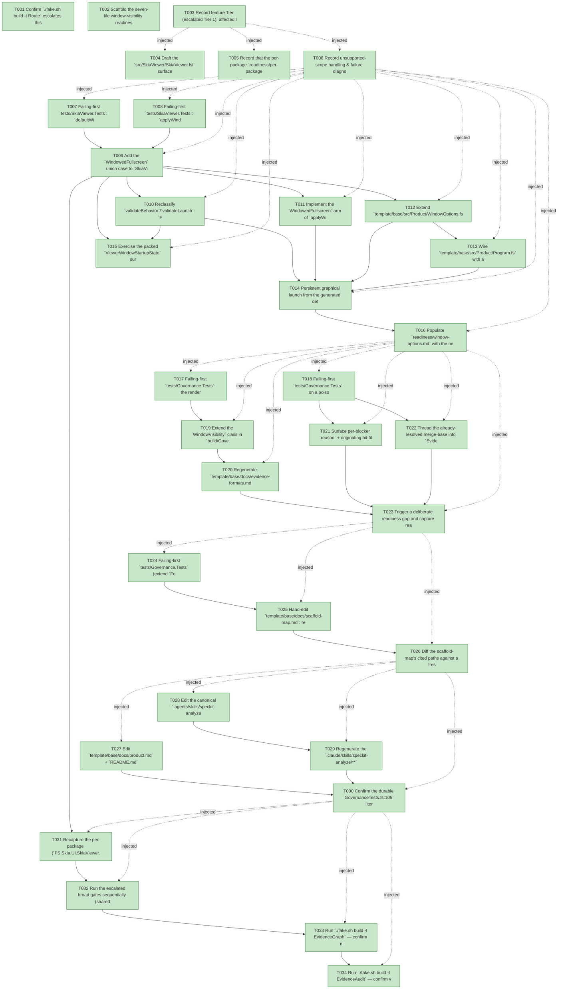

# Task Graph — 084-window-options-consumer-followups

## ✓ Graph is acyclic and consistent

## Skill Match Assessments

| Task | Candidate | Confidence | Signals | Reviewer disposition | Diagnostic |
|------|-----------|------------|---------|----------------------|------------|
| T001 | (none) | none |  | accepted-empty | T001: skillist trusted as declared; no owns-based capability requirement |
| T002 | (none) | none |  | declared | T002: skillist trusted as declared; no owns-based capability requirement |
| T003 | (none) | none |  | accepted-empty | T003: skillist trusted as declared; no owns-based capability requirement |
| T004 | (none) | none |  | declared | T004: skillist trusted as declared; no owns-based capability requirement |
| T005 | (none) | none |  | accepted-empty | T005: skillist trusted as declared; no owns-based capability requirement |
| T006 | (none) | none |  | declared | T006: skillist trusted as declared; no owns-based capability requirement |
| T007 | (none) | none |  | declared | T007: skillist trusted as declared; no owns-based capability requirement |
| T008 | (none) | none |  | declared | T008: skillist trusted as declared; no owns-based capability requirement |
| T009 | (none) | none |  | declared | T009: skillist trusted as declared; no owns-based capability requirement |
| T010 | (none) | none |  | declared | T010: skillist trusted as declared; no owns-based capability requirement |
| T011 | (none) | none |  | declared | T011: skillist trusted as declared; no owns-based capability requirement |
| T012 | (none) | none |  | declared | T012: skillist trusted as declared; no owns-based capability requirement |
| T013 | (none) | none |  | declared | T013: skillist trusted as declared; no owns-based capability requirement |
| T014 | (none) | none |  | declared | T014: skillist trusted as declared; no owns-based capability requirement |
| T015 | (none) | none |  | declared | T015: skillist trusted as declared; no owns-based capability requirement |
| T016 | (none) | none |  | accepted-empty | T016: skillist trusted as declared; no owns-based capability requirement |
| T017 | (none) | none |  | declared | T017: skillist trusted as declared; no owns-based capability requirement |
| T018 | (none) | none |  | declared | T018: skillist trusted as declared; no owns-based capability requirement |
| T019 | (none) | none |  | declared | T019: skillist trusted as declared; no owns-based capability requirement |
| T020 | (none) | none |  | declared | T020: skillist trusted as declared; no owns-based capability requirement |
| T021 | (none) | none |  | declared | T021: skillist trusted as declared; no owns-based capability requirement |
| T022 | (none) | none |  | declared | T022: skillist trusted as declared; no owns-based capability requirement |
| T023 | (none) | none |  | declared | T023: skillist trusted as declared; no owns-based capability requirement |
| T024 | (none) | none |  | declared | T024: skillist trusted as declared; no owns-based capability requirement |
| T025 | (none) | none |  | declared | T025: skillist trusted as declared; no owns-based capability requirement |
| T026 | (none) | none |  | declared | T026: skillist trusted as declared; no owns-based capability requirement |
| T027 | (none) | none |  | declared | T027: skillist trusted as declared; no owns-based capability requirement |
| T028 | (none) | none |  | declared | T028: skillist trusted as declared; no owns-based capability requirement |
| T029 | (none) | none |  | declared | T029: skillist trusted as declared; no owns-based capability requirement |
| T030 | (none) | none |  | declared | T030: skillist trusted as declared; no owns-based capability requirement |
| T031 | (none) | none |  | declared | T031: skillist trusted as declared; no owns-based capability requirement |
| T032 | (none) | none |  | declared | T032: skillist trusted as declared; no owns-based capability requirement |
| T033 | speckit-evidence-graph | high | owns:graph-validation | accepted | T033: owns graph-validation requires skill speckit-evidence-graph; trigger_group=owns; matched_trigger=owns:graph-validation |
| T034 | speckit-evidence-audit | high | owns:evidence-audit | accepted | T034: owns evidence-audit requires skill speckit-evidence-audit; trigger_group=owns; matched_trigger=owns:evidence-audit |

## Status counts (effective)

| Status | Count |
|--------|-------|
| [X] done | 34 |
| [S] synthetic | 0 |
| [S*] auto-synthetic | 0 |
| accepted [SEH] synthetic | 0 |
| unaccepted synthetic | 0 |

## Graph



## ASCII view

```
T001 [X] Confirm `./fake.sh build -t Route` escalates this change to `maintainer-verify`; record the printed tier + minimal gate list; link spec + plan in the feature directory
T002 [X] Scaffold the seven-file window-visibility readiness set under `readiness/` (`interactive-visible-window.md`, `window-state-diagnostics.md`, `window-options.md`, `close-reason-separation.md`, `real-image-evidence.md`, `generated-validation.md`, `evidence-audit.md`) plus the visual-demo scaffolds (`visual-evidence-honesty.md`, `window-visibility.md`, `governance-risk-levels.md`, `aggregate-hang-diagnostics.md`, `runtime-limitations.md`, `generated-guidance-validation.md`, `audit-diagnostics.md`) — each naming authoritative command, artifact path, failure class, next action
T003 [X] Record feature Tier (escalated Tier 1), affected layer (SkiaViewer + Build governance + template + skill), public-API impact (additive union case + default-value change), Elmish/MVU applicability (viewer is the stateful boundary; `ApplyWindowOptions` carrier unchanged, no new effect type), and evidence obligations
T004 [X] Draft the `src/SkiaViewer/SkiaViewer.fsi` surface delta: additive `WindowedFullscreen` case on `ViewerWindowStartupState` and the `defaultWindowBehavior` value-change note (signatures of `runApp`/`runAppWithWindowBehavior`/`validate*`/request/result/effect all unchanged) per `contracts/skiaviewer-window-surface.md`
T005 [X] Record that the per-package `readiness/per-package-surface/FS.Skia.UI.SkiaViewer.fsi.txt` baseline **and** the cross-package surface baseline move and must be recaptured (`RefreshSurfaceBaselines` / `PerPackageSurface`); note the additive-case incomplete-match warning is desirable
T006 [X] Record unsupported-scope handling & failure diagnostics: headless/no-display degrades to honest render-only (no false visible-window claim); exclusive fullscreen on an incapable host falls back with an honest diagnostic (not a false "honored"); windowed fullscreen remains the capable default
T007 [X] Failing-first `tests/SkiaViewer.Tests`: `defaultWindowBehavior.StartupState = WindowedFullscreen` (SC-001); `validateWindowBehavior`/`validateWindowLaunchBehavior` report `Honored` for `Fullscreen` and `WindowedFullscreen` and `UnsupportedOption` for `Minimized` (SC-002)
T008 [X] Failing-first `tests/SkiaViewer.Tests`: `applyWindowBehaviorToOptions` maps `WindowedFullscreen` to `WindowBorder.Hidden` + work-area `Position`/`Size` + `WindowState.Normal`, and `Fullscreen` to `WindowState.Fullscreen` (distinctness invariant)
T009 [X] Add the `WindowedFullscreen` union case to `SkiaViewer.fsi` + `SkiaViewer.fs` and change `defaultWindowBehavior.StartupState` to `WindowedFullscreen` (FR-001/FR-003)
T010 [X] Reclassify `validateBehavior`/`validateLaunch`: `Fullscreen` and `WindowedFullscreen` → `Honored` (replace the stale "not yet supported" message), keep `Minimized` `UnsupportedOption`; preserve the launch-aware capability check so an incapable host still falls back honestly (FR-002)
T011 [X] Implement the `WindowedFullscreen` arm of `applyWindowBehaviorToOptions` (hidden border + work-area geometry, `WindowState.Normal`) and the edge interpreter that reads default-monitor work-area bounds, degrading to honest render-only when bounds cannot be resolved (FR-001)
T012 [X] Extend `template/base/src/Product/WindowOptions.fs`: add the `windowed-fullscreen` flag value, change the no-flag default to `windowed-fullscreen`, reclassify `fullscreen`/`windowed-fullscreen` to honored, and resolve conflicting flags to the explicit last-specified value (FR-006, conflict edge case)
T013 [X] Wire `template/base/src/Product/Program.fs` with a guarded branch: `if windowFlagSupplied then Viewer.runAppWithWindowBehavior …` else the durable `Viewer.runApp viewerOptions generatedHost` literal — keeping that literal present and reachable (FR-004/FR-005)
T014 [X] Persistent graphical launch from the generated default executable path; capture real visible-window evidence for the no-flag windowed-fullscreen default and once per supported state (normal, maximized, fullscreen, windowed-fullscreen), writing decodable image evidence to `readiness/real-image-evidence.md` (SC-001/SC-002); on a headless host record the honest render-only degradation
T015 [X] Exercise the packed `ViewerWindowStartupState` surface from FSI (new default + Honored reclassification) and capture the transcript to `readiness/fsi-session.txt` (Principle I)
T016 [X] Populate `readiness/window-options.md` with the new states and document US1's independent validation path (`option=` rows for resize/maximize/startup-state/startup-position/backend reflecting windowed-fullscreen)
T017 [X] Failing-first `tests/Governance.Tests`: the rendered `evidence-formats.md` window-visibility file list **equals** `Scans.requiredFiles` (all seven files), so the doc cannot silently drift behind the engine (SC-003)
T018 [X] Failing-first `tests/Governance.Tests`: on a poisoned readiness fixture, audit stdout contains each blocker's area + file + one-line reason + hit-file path and a non-misleading `diff-scan base_ref:` line (SC-004)
T019 [X] Extend the `WindowVisibility` class in `build/Governance/Evidence/EvidenceFormatSchema.fs` (the single source) to enumerate all seven `Scans.requiredFiles` with each file's required tokens per `data-model.md` (FR-007)
T020 [X] Regenerate `template/base/docs/evidence-formats.md` from the extended schema via `./fake.sh build -t RefreshSurfaceBaselines` (no hand-edit of the generated doc)
T021 [X] Surface per-blocker `reason` + originating hit-file path on `EvidenceAudit` stdout by wiring the existing per-area renderers (`Render.readinessContractDiagnostics` and siblings) into the summary block in `GeneratedRunner.fs` / `Front/Governance.fs` (FR-008)
T022 [X] Thread the already-resolved merge-base into `EvidenceInputs` → populate `DiffScanResult.BaseRef` (was hardcoded `None`) and print `diff-scan base_ref:` to stdout; emit the explicit-absence message when no default-branch ancestor resolves (FR-009, base_ref edge case)
T023 [X] Trigger a deliberate readiness gap and capture real `EvidenceAudit` stdout proving every blocker + base-ref line is legible without opening any `*-hits.json`, to `readiness/audit-diagnostics.md` (SC-004)
T024 [X] Failing-first `tests/Governance.Tests` (extend `Feature062GovernanceTests`): `docs/scaffold-map.md` contains the `<ProjectName>`/`<ProductDir>` project-named paths, the durable-but-must-re-point class phrase, and a non-game HUD→headers / gameplay→grid remap example (SC-005)
T025 [X] Hand-edit `template/base/docs/scaffold-map.md`: replace `src/Product/**` with `<ProjectName>`/`<ProductDir>` placeholders, split durable into model-agnostic vs must-re-point (moving `LayoutEvidence.fs`/`EvidenceCommands.fs`/`WindowOptions.fs` into must-re-point with the "keep file + scanned tokens, re-point model-field references" definition), and add the non-game layout-region remap example (FR-010/FR-011)
T026 [X] Diff the scaffold-map's cited paths against a freshly generated project tree and confirm zero manual reconciliation (SC-005)
T027 [X] Edit `template/base/docs/product.md` + `README.md`: state that `Verify` embeds the merge-gate audit (`EvidenceGraph` then `EvidenceAudit`) before tests and hard-blocks until every task is `[X]`, name `-t Test` as the mid-implementation green-test path, and confirm the existing `Dev`-is-log-only disclosure is present (FR-012/FR-013)
T028 [X] Edit the canonical `.agents/skills/speckit-analyze/SKILL.md` so the symbol-cross-check step probes target availability and skips-with-documented-notice when `SymbolCrossCheck` is absent, mirroring how `EvidenceGraph` resolves the feature from `.specify/feature.json` (FR-014); keep `SkillQualityCheck` detector phrases intact
T029 [X] Regenerate the `.claude/skills/speckit-analyze/**` mirror from the canonical `.agents` tree via `./fake.sh build -t RefreshSurfaceBaselines` (SkillSyncCheck-enforced currency)
T030 [X] Confirm the durable `GovernanceTests.fs:105` literal still passes after the guarded launch wiring (FR-005); document the mid-implementation green-test path (`-t Test`, SC-006) and the `/speckit-analyze` graceful skip-with-notice in a project lacking `SymbolCrossCheck` (SC-007)
T031 [X] Recapture the per-package (`FS.Skia.UI.SkiaViewer.fsi.txt`) and cross-package surface baselines, the `.claude` skill mirror, and `validation.contract.yml` via `./fake.sh build -t RefreshSurfaceBaselines` (Tier 1 surface move)
T032 [X] Run the escalated broad gates sequentially (shared `.fake` state): `./fake.sh build -t Dev`, `-t GeneratedGuidanceCheck`, `-t TemplateCheck`, `-t GeneratedProductCheck`; record the governance risk level and note any non-authoritative aggregate/hang result with its sequential rerun
T033 [X] Run `./fake.sh build -t EvidenceGraph` — confirm no cycles, no dangling refs, no `[S*]` surprises; confirm the echoed `feature-directory=` matches this feature
T034 [X] Run `./fake.sh build -t EvidenceAudit` — confirm verdict PASS (no `[S]`/`[S*]`, clean diff-scan) or document every `--accept-synthetic` override
```

## Injected checkpoint edges (Phase N+1 → Phase N) — FR-007

- T003 → T004  (auto-injected Phase-checkpoint edge)
- T003 → T005  (auto-injected Phase-checkpoint edge)
- T003 → T006  (auto-injected Phase-checkpoint edge)
- T006 → T007  (auto-injected Phase-checkpoint edge)
- T006 → T008  (auto-injected Phase-checkpoint edge)
- T006 → T009  (auto-injected Phase-checkpoint edge)
- T006 → T010  (auto-injected Phase-checkpoint edge)
- T006 → T011  (auto-injected Phase-checkpoint edge)
- T006 → T012  (auto-injected Phase-checkpoint edge)
- T006 → T013  (auto-injected Phase-checkpoint edge)
- T006 → T014  (auto-injected Phase-checkpoint edge)
- T006 → T015  (auto-injected Phase-checkpoint edge)
- T006 → T016  (auto-injected Phase-checkpoint edge)
- T016 → T017  (auto-injected Phase-checkpoint edge)
- T016 → T018  (auto-injected Phase-checkpoint edge)
- T016 → T019  (auto-injected Phase-checkpoint edge)
- T016 → T020  (auto-injected Phase-checkpoint edge)
- T016 → T021  (auto-injected Phase-checkpoint edge)
- T016 → T022  (auto-injected Phase-checkpoint edge)
- T016 → T023  (auto-injected Phase-checkpoint edge)
- T023 → T024  (auto-injected Phase-checkpoint edge)
- T023 → T025  (auto-injected Phase-checkpoint edge)
- T023 → T026  (auto-injected Phase-checkpoint edge)
- T026 → T027  (auto-injected Phase-checkpoint edge)
- T026 → T028  (auto-injected Phase-checkpoint edge)
- T026 → T029  (auto-injected Phase-checkpoint edge)
- T026 → T030  (auto-injected Phase-checkpoint edge)
- T030 → T031  (auto-injected Phase-checkpoint edge)
- T030 → T032  (auto-injected Phase-checkpoint edge)
- T030 → T033  (auto-injected Phase-checkpoint edge)
- T030 → T034  (auto-injected Phase-checkpoint edge)

## Resolved skillist ids — FR-007

Resolved skillist-id set (10): fs-skia-evidence-mode, fs-skia-layout-readability, fs-skia-skiaviewer, fs-skia-template-update, fsharp-build-orchestration, fsharp-code-generation, fsharp-shell-process, speckit-analyze, speckit-evidence-audit, speckit-evidence-graph

