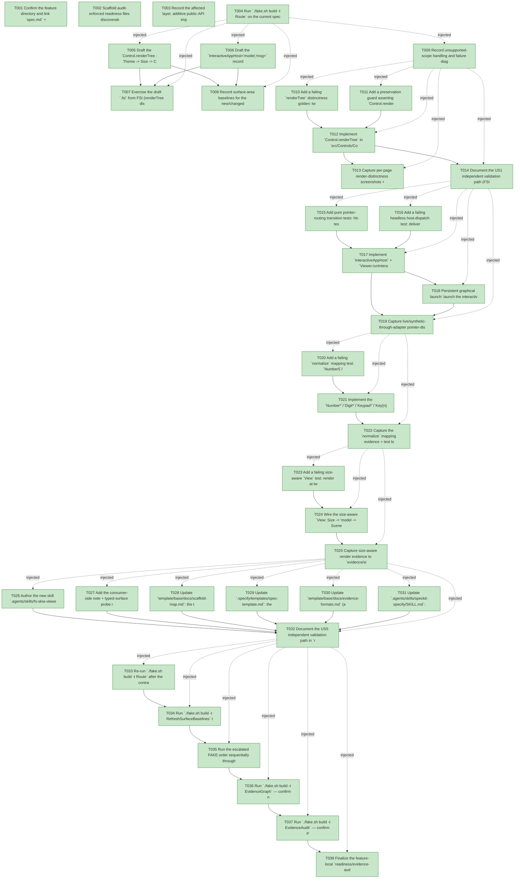

# Task Graph — 085-showcase-feedback-followups

## ✓ Graph is acyclic and consistent

## Skill Match Assessments

| Task | Candidate | Confidence | Signals | Reviewer disposition | Diagnostic |
|------|-----------|------------|---------|----------------------|------------|
| T001 | (none) | none |  | accepted-empty | T001: skillist trusted as declared; no owns-based capability requirement |
| T002 | (none) | none |  | accepted-empty | T002: skillist trusted as declared; no owns-based capability requirement |
| T003 | (none) | none |  | accepted-empty | T003: skillist trusted as declared; no owns-based capability requirement |
| T004 | (none) | none |  | accepted-empty | T004: skillist trusted as declared; no owns-based capability requirement |
| T005 | (none) | none |  | declared | T005: skillist trusted as declared; no owns-based capability requirement |
| T006 | (none) | none |  | declared | T006: skillist trusted as declared; no owns-based capability requirement |
| T007 | (none) | none |  | declared | T007: skillist trusted as declared; no owns-based capability requirement |
| T008 | (none) | none |  | accepted-empty | T008: skillist trusted as declared; no owns-based capability requirement |
| T009 | (none) | none |  | declared | T009: skillist trusted as declared; no owns-based capability requirement |
| T010 | (none) | none |  | declared | T010: skillist trusted as declared; no owns-based capability requirement |
| T011 | (none) | none |  | declared | T011: skillist trusted as declared; no owns-based capability requirement |
| T012 | (none) | none |  | declared | T012: skillist trusted as declared; no owns-based capability requirement |
| T013 | (none) | none |  | declared | T013: skillist trusted as declared; no owns-based capability requirement |
| T014 | (none) | none |  | accepted-empty | T014: skillist trusted as declared; no owns-based capability requirement |
| T015 | (none) | none |  | declared | T015: skillist trusted as declared; no owns-based capability requirement |
| T016 | (none) | none |  | declared | T016: skillist trusted as declared; no owns-based capability requirement |
| T017 | (none) | none |  | declared | T017: skillist trusted as declared; no owns-based capability requirement |
| T018 | (none) | none |  | declared | T018: skillist trusted as declared; no owns-based capability requirement |
| T019 | (none) | none |  | declared | T019: skillist trusted as declared; no owns-based capability requirement |
| T020 | (none) | none |  | declared | T020: skillist trusted as declared; no owns-based capability requirement |
| T021 | (none) | none |  | declared | T021: skillist trusted as declared; no owns-based capability requirement |
| T022 | (none) | none |  | declared | T022: skillist trusted as declared; no owns-based capability requirement |
| T023 | (none) | none |  | declared | T023: skillist trusted as declared; no owns-based capability requirement |
| T024 | (none) | none |  | declared | T024: skillist trusted as declared; no owns-based capability requirement |
| T025 | (none) | none |  | declared | T025: skillist trusted as declared; no owns-based capability requirement |
| T026 | (none) | none |  | declared | T026: skillist trusted as declared; no owns-based capability requirement |
| T027 | (none) | none |  | declared | T027: skillist trusted as declared; no owns-based capability requirement |
| T028 | (none) | none |  | declared | T028: skillist trusted as declared; no owns-based capability requirement |
| T029 | (none) | none |  | declared | T029: skillist trusted as declared; no owns-based capability requirement |
| T030 | (none) | none |  | declared | T030: skillist trusted as declared; no owns-based capability requirement |
| T031 | (none) | none |  | declared | T031: skillist trusted as declared; no owns-based capability requirement |
| T032 | (none) | none |  | accepted-empty | T032: skillist trusted as declared; no owns-based capability requirement |
| T033 | (none) | none |  | accepted-empty | T033: skillist trusted as declared; no owns-based capability requirement |
| T034 | (none) | none |  | accepted-empty | T034: skillist trusted as declared; no owns-based capability requirement |
| T035 | (none) | none |  | declared | T035: skillist trusted as declared; no owns-based capability requirement |
| T036 | speckit-evidence-graph | high | owns:graph-validation | accepted | T036: owns graph-validation requires skill speckit-evidence-graph; trigger_group=owns; matched_trigger=owns:graph-validation |
| T037 | speckit-evidence-audit | high | owns:evidence-audit | accepted | T037: owns evidence-audit requires skill speckit-evidence-audit; trigger_group=owns; matched_trigger=owns:evidence-audit |
| T038 | (none) | none |  | declared | T038: skillist trusted as declared; no owns-based capability requirement |

## Status counts (effective)

| Status | Count |
|--------|-------|
| [X] done | 38 |
| [S] synthetic | 0 |
| [S*] auto-synthetic | 0 |
| accepted [SEH] synthetic | 0 |
| unaccepted synthetic | 0 |

## Graph



## ASCII view

```
T001 [X] Confirm the feature directory and link `spec.md` + `plan.md`; record the branch and the escalated Tier-1 `maintainer-verify` classification
T002 [X] Scaffold audit-enforced readiness files discoverable before implementation: `readiness/governance-risk-levels.md`, `readiness/aggregate-hang-diagnostics.md`, `readiness/runtime-limitations.md`, `readiness/visual-evidence-honesty.md`, `readiness/window-visibility.md`, `readiness/real-image-evidence.md`, `readiness/generated-guidance-validation.md`, `readiness/framework-guidance.md`, `readiness/evidence-vocabulary.md`, `readiness/evidence-graph.md`, `readiness/evidence-audit.md`, and the window-visibility class (`interactive-visible-window.md`, `close-reason-separation.md`, `window-state-diagnostics.md`, `window-options.md`, `generated-validation.md`) — each naming its authoritative command, artifact path, failure class, and next action
T003 [X] Record the affected layer, additive public-API impact (FR-001, FR-004, FR-006, FR-009), MVU/effect applicability (US2 I/O-bearing), and required evidence obligations
T004 [X] Run `./fake.sh build -t Route` on the current spec-only diff and record the baseline tier (expect `focused-authority` pre-edit; re-checked post-edit in T033)
T005 [X] Draft the `Control.renderTree : Theme -> Size -> Control<'msg> -> ControlRenderResult<'msg>` addition in `src/Controls/Control.fsi` (additive; `render`/`Widget.render` untouched per FR-003)
T006 [X] Draft the `InteractiveAppHost<'model,'msg>` record (`Init`/`Update`/`View: Size -> 'model -> SceneNode`/`MapKey`/`MapPointer`/`Tick`/`Diagnostics`) and `Viewer.runInteractiveApp` in `src/SkiaViewer/SkiaViewer.fsi`, leaving `GeneratedAppHost` + `Viewer.runApp` literal intact (FR-006)
T007 [X] Exercise the draft `.fsi` from FSI (renderTree distinctness, host record construction + `runInteractiveApp` bounded run, representative `Init`/`Update`/`MapPointer`); capture the transcript to `readiness/fsi-session.txt`
T008 [X] Record surface-area baselines for the new/changed public modules (`FS.Skia.UI.Controls`, `FS.Skia.UI.SkiaViewer`) so post-implementation drift is reviewable
T009 [X] Record unsupported-scope handling and failure diagnostics in `readiness/runtime-limitations.md` and `readiness/aggregate-hang-diagnostics.md` (no live key/pointer injection ⇒ synthetic-event-through-real-adapter is the honest bar, not `[S]`)
T010 [X] Add a failing `renderTree` distinctness golden: two structurally different nested trees produce different `Scene`s and nested children (not just the outer container) are laid out and painted (SC-001)
T011 [X] Add a preservation guard asserting `Control.render`/`Widget.render` behavior + the Feature-080 `ControlFidelityCheck` goldens stay green (FR-003)
T012 [X] Implement `Control.renderTree` in `src/Controls/Control.fs`: recursive Yoga layout at the output `Size` plus paint of nested containers and their children (FR-001, FR-002)
T013 [X] Capture per-page render-distinctness screenshots + diff to `evidence/render-distinctness/*.png`; confirm the diff between two distinct pages is non-empty and record `readiness/real-image-evidence.md` (SC-001)
T014 [X] Document the US1 independent validation path (FSI distinctness check + screenshot diff) in `readiness/visual-evidence-honesty.md`
T015 [X] Add pure pointer-routing transition tests: hit-test (`Layout` × `EventBindings` by `ControlId`) → `PointerInteraction` with the 4px click/drag fold → `MapPointer` → `msg`; assert pure `Update` transitions and emitted `ViewerEffect`s (FR-004)
T016 [X] Add a failing headless host-dispatch test: deliver a synthetic `PointerPressed`/`PointerReleased` at a control's bounds through `runInteractiveApp` and observe the bound `msg` dispatched and the model changed (FR-004, FR-005; SC-002)
T017 [X] Implement `InteractiveAppHost` + `Viewer.runInteractiveApp` in `src/SkiaViewer/SkiaViewer.fs`, routing `ViewerEvent.Pointer*` via `ControlsElmish.interpretPointerOutcome`; keep the `Viewer.runApp viewerOptions generatedHost` GovernanceTests literal reachable (FR-004, FR-006)
T018 [X] Persistent graphical launch: launch the interactive host as a durable visible window from the default executable path (not bounded smoke/metadata) and capture `readiness/interactive-visible-window.md`, `readiness/window-state-diagnostics.md`, `readiness/close-reason-separation.md`, `readiness/window-options.md` as `key=value` blocks
T019 [X] Capture live/synthetic-through-adapter pointer-dispatch evidence to `evidence/pointer-dispatch.md` (`key=value`, msg + model change, FR-005; SC-002)
T020 [X] Add a failing `normalize` mapping test: `Number5`/`Digit5`/`Keypad5`/`Key5` → `Digit 5`, `KeyL` → `Letter 'L'` (case-insensitive), and an unrecognized name still → `Unknown raw` (totality, no regression) (SC-003)
T021 [X] Implement the `Number*`/`Digit*`/`Keypad*`/`Key{n}` digit families and `Key{X}` letter family in `src/KeyboardInput/KeyboardInput.fs` `normalize`; preserve the terminal `Unknown raw` arm and the unchanged `.fsi`/`ViewerKey` union (FR-007, FR-008)
T022 [X] Capture the `normalize` mapping evidence + test log to `evidence/normalize-mapping.md` (SC-003)
T023 [X] Add a failing size-aware `View` test: render at two different surface extents and assert content is laid out to the actual extent (no fixed-size upscaling) (SC-004)
T024 [X] Wire the size-aware `View: Size -> 'model -> SceneNode` into the `runInteractiveApp` render loop, sourcing the current extent from the real swapchain/window size (FR-009)
T025 [X] Capture size-aware render evidence to `evidence/size-aware-render/*.png` and record the windowed-fullscreen blur workaround (exactly one flag/setting, e.g. `--window-startup normal`) in `readiness/runtime-limitations.md` (SC-004; doc home lands in T028/T030)
T026 [X] Author the new skill `.agents/skills/fs-skia-viewer-host/SKILL.md` (distinct-named to avoid the existing package `fs-skia-skiaviewer` collision): host input surface (keyboard `MapKey`; pointer `MapPointer` seam), preview-vs-tree distinction (`Control.render` preview vs `renderTree`), and the windowed-fullscreen blur caveat + workaround (FR-011)
T027 [X] Add the consumer-side note + typed-surface probe recipe to `.agents/skills/fs-skia-typed-controls/SKILL.md`: author via `FS.Skia.UI.Controls.Typed.*`; verify availability from package / `catalog.yml` `module:` fields, **not** `docs/api-surface/` (FR-012)
T028 [X] Update `template/base/docs/scaffold-map.md`: the typed front door is absent from `docs/api-surface/` (legacy `X.create` only) + how to enumerate the typed surface; include the windowed-fullscreen blur workaround (FR-013/FR-010)
T029 [X] Update `.specify/templates/spec-template.md`: the Framework Governance Prompts section is exempt from the "no implementation details" rule (FR-014)
T030 [X] Update `template/base/docs/evidence-formats.md` (and/or the `fs-skia-evidence-mode` skill): evidence token parsing reads `key=value` lines; a markdown table with the same tokens does **not** satisfy the validators (FR-015); record `readiness/evidence-vocabulary.md`
T031 [X] Update `.agents/skills/speckit-specify/SKILL.md`: add the multi-file external-URL snapshot recipe (enumerate a GitHub tree, fetch per file, assemble `source-spec.md` with per-file headers) (FR-016)
T032 [X] Document the US5 independent validation path in `readiness/framework-guidance.md`: each artifact states its fact; the `.claude` mirror is generated from `.agents` (cite `.agents`, regenerated in T034) and passes `SkillSyncCheck`/`SkillQualityCheck`
T033 [X] Re-run `./fake.sh build -t Route` after the contract-bearing edits and confirm escalation to `maintainer-verify` (FR-018; SC-006)
T034 [X] Run `./fake.sh build -t RefreshSurfaceBaselines` to regenerate surface-area baselines, per-package `.fsi.txt` snapshots, the `.claude` skill mirror, and `skillist-reference.md` for the new `fs-skia-viewer-host` skill (FR-017)
T035 [X] Run the escalated FAKE order sequentially through `Dev` → `GeneratedGuidanceCheck` → `TemplateCheck` → `GeneratedProductCheck`, recording `GeneratedProductCheck` as non-authoritative if it fails for the known environment reason
T036 [X] Run `./fake.sh build -t EvidenceGraph` — confirm no cycles, no dangling refs, no `[S*]` surprises; refresh `readiness/evidence-graph.md`
T037 [X] Run `./fake.sh build -t EvidenceAudit` — confirm PASS or document every `--accept-synthetic` override; refresh `readiness/evidence-audit.md`
T038 [X] Finalize the feature-local `readiness/evidence-audit.md`, the window-visibility evidence class, `generated-validation.md`/`generated-guidance-validation.md`, and `readiness/governance-risk-levels.md` with the non-authoritative aggregate result recording
```

## Injected checkpoint edges (Phase N+1 → Phase N) — FR-007

- T004 → T005  (auto-injected Phase-checkpoint edge)
- T004 → T006  (auto-injected Phase-checkpoint edge)
- T004 → T007  (auto-injected Phase-checkpoint edge)
- T004 → T008  (auto-injected Phase-checkpoint edge)
- T004 → T009  (auto-injected Phase-checkpoint edge)
- T009 → T010  (auto-injected Phase-checkpoint edge)
- T009 → T011  (auto-injected Phase-checkpoint edge)
- T009 → T012  (auto-injected Phase-checkpoint edge)
- T009 → T013  (auto-injected Phase-checkpoint edge)
- T009 → T014  (auto-injected Phase-checkpoint edge)
- T014 → T015  (auto-injected Phase-checkpoint edge)
- T014 → T016  (auto-injected Phase-checkpoint edge)
- T014 → T017  (auto-injected Phase-checkpoint edge)
- T014 → T018  (auto-injected Phase-checkpoint edge)
- T014 → T019  (auto-injected Phase-checkpoint edge)
- T019 → T020  (auto-injected Phase-checkpoint edge)
- T019 → T021  (auto-injected Phase-checkpoint edge)
- T019 → T022  (auto-injected Phase-checkpoint edge)
- T022 → T023  (auto-injected Phase-checkpoint edge)
- T022 → T024  (auto-injected Phase-checkpoint edge)
- T022 → T025  (auto-injected Phase-checkpoint edge)
- T025 → T026  (auto-injected Phase-checkpoint edge)
- T025 → T027  (auto-injected Phase-checkpoint edge)
- T025 → T028  (auto-injected Phase-checkpoint edge)
- T025 → T029  (auto-injected Phase-checkpoint edge)
- T025 → T030  (auto-injected Phase-checkpoint edge)
- T025 → T031  (auto-injected Phase-checkpoint edge)
- T025 → T032  (auto-injected Phase-checkpoint edge)
- T032 → T033  (auto-injected Phase-checkpoint edge)
- T032 → T034  (auto-injected Phase-checkpoint edge)
- T032 → T035  (auto-injected Phase-checkpoint edge)
- T032 → T036  (auto-injected Phase-checkpoint edge)
- T032 → T037  (auto-injected Phase-checkpoint edge)
- T032 → T038  (auto-injected Phase-checkpoint edge)

## Resolved skillist ids — FR-007

Resolved skillist-id set (11): fs-skia-elmish, fs-skia-evidence-mode, fs-skia-keyboard-input, fs-skia-scene, fs-skia-skiaviewer, fs-skia-template-update, fs-skia-typed-controls, fs-skia-ui-widgets, speckit-evidence-audit, speckit-evidence-graph, speckit-specify

