# Task Graph — 086-interactive-consumer-fitness

## ✓ Graph is acyclic and consistent

## Skill Match Assessments

| Task | Candidate | Confidence | Signals | Reviewer disposition | Diagnostic |
|------|-----------|------------|---------|----------------------|------------|
| T001 | (none) | none |  | accepted-empty | T001: skillist trusted as declared; no owns-based capability requirement |
| T002 | (none) | none |  | declared | T002: skillist trusted as declared; no owns-based capability requirement |
| T003 | (none) | none |  | accepted-empty | T003: skillist trusted as declared; no owns-based capability requirement |
| T004 | (none) | none |  | declared | T004: skillist trusted as declared; no owns-based capability requirement |
| T005 | (none) | none |  | declared | T005: skillist trusted as declared; no owns-based capability requirement |
| T006 | (none) | none |  | declared | T006: skillist trusted as declared; no owns-based capability requirement |
| T007 | (none) | none |  | declared | T007: skillist trusted as declared; no owns-based capability requirement |
| T008 | (none) | none |  | accepted-empty | T008: skillist trusted as declared; no owns-based capability requirement |
| T009 | (none) | none |  | accepted-empty | T009: skillist trusted as declared; no owns-based capability requirement |
| T010 | (none) | none |  | declared | T010: skillist trusted as declared; no owns-based capability requirement |
| T011 | (none) | none |  | declared | T011: skillist trusted as declared; no owns-based capability requirement |
| T012 | (none) | none |  | declared | T012: skillist trusted as declared; no owns-based capability requirement |
| T013 | (none) | none |  | declared | T013: skillist trusted as declared; no owns-based capability requirement |
| T014 | (none) | none |  | declared | T014: skillist trusted as declared; no owns-based capability requirement |
| T015 | (none) | none |  | accepted-empty | T015: skillist trusted as declared; no owns-based capability requirement |
| T016 | (none) | none |  | declared | T016: skillist trusted as declared; no owns-based capability requirement |
| T017 | (none) | none |  | declared | T017: skillist trusted as declared; no owns-based capability requirement |
| T018 | (none) | none |  | declared | T018: skillist trusted as declared; no owns-based capability requirement |
| T019 | (none) | none |  | declared | T019: skillist trusted as declared; no owns-based capability requirement |
| T020 | (none) | none |  | declared | T020: skillist trusted as declared; no owns-based capability requirement |
| T021 | (none) | none |  | declared | T021: skillist trusted as declared; no owns-based capability requirement |
| T022 | (none) | none |  | declared | T022: skillist trusted as declared; no owns-based capability requirement |
| T023 | (none) | none |  | declared | T023: skillist trusted as declared; no owns-based capability requirement |
| T024 | (none) | none |  | declared | T024: skillist trusted as declared; no owns-based capability requirement |
| T025 | (none) | none |  | declared | T025: skillist trusted as declared; no owns-based capability requirement |
| T026 | (none) | none |  | declared | T026: skillist trusted as declared; no owns-based capability requirement |
| T027 | (none) | none |  | declared | T027: skillist trusted as declared; no owns-based capability requirement |
| T028 | (none) | none |  | declared | T028: skillist trusted as declared; no owns-based capability requirement |
| T029 | (none) | none |  | declared | T029: skillist trusted as declared; no owns-based capability requirement |
| T030 | (none) | none |  | accepted-empty | T030: skillist trusted as declared; no owns-based capability requirement |
| T031 | (none) | none |  | declared | T031: skillist trusted as declared; no owns-based capability requirement |
| T032 | (none) | none |  | declared | T032: skillist trusted as declared; no owns-based capability requirement |
| T033 | (none) | none |  | declared | T033: skillist trusted as declared; no owns-based capability requirement |
| T034 | (none) | none |  | declared | T034: skillist trusted as declared; no owns-based capability requirement |
| T035 | (none) | none |  | declared | T035: skillist trusted as declared; no owns-based capability requirement |
| T036 | (none) | none |  | declared | T036: skillist trusted as declared; no owns-based capability requirement |
| T037 | (none) | none |  | declared | T037: skillist trusted as declared; no owns-based capability requirement |
| T038 | (none) | none |  | declared | T038: skillist trusted as declared; no owns-based capability requirement |
| T039 | (none) | none |  | accepted-empty | T039: skillist trusted as declared; no owns-based capability requirement |
| T040 | (none) | none |  | accepted-empty | T040: skillist trusted as declared; no owns-based capability requirement |
| T041 | (none) | none |  | accepted-empty | T041: skillist trusted as declared; no owns-based capability requirement |
| T042 | (none) | none |  | declared | T042: skillist trusted as declared; no owns-based capability requirement |
| T043 | (none) | none |  | declared | T043: skillist trusted as declared; no owns-based capability requirement |
| T044 | speckit-evidence-graph | high | owns:graph-validation | accepted | T044: owns graph-validation requires skill speckit-evidence-graph; trigger_group=owns; matched_trigger=owns:graph-validation |
| T045 | speckit-evidence-audit | high | owns:evidence-audit | accepted | T045: owns evidence-audit requires skill speckit-evidence-audit; trigger_group=owns; matched_trigger=owns:evidence-audit |

## Status counts (effective)

| Status | Count |
|--------|-------|
| [X] done | 34 |
| [S] synthetic | 3 |
| [S*] auto-synthetic | 8 |
| accepted [SEH] synthetic | 0 |
| unaccepted synthetic | 11 |

## Synthetic Error-Handling Classification

| Task | Accepted | Label | Design source | Synthetic input class | Expected error behavior | Diagnostics |
|------|----------|-------|---------------|-----------------------|-------------------------|-------------|
| T035 | no | no | n/a | n/a | n/a | (none) |
| T036 | no | no | n/a | n/a | n/a | (none) |
| T037 | no | no | (missing) | (missing) | (missing) | (none) |
| T038 | no | no | n/a | n/a | n/a | (none) |
| T039 | no | no | (missing) | (missing) | (missing) | (none) |
| T040 | no | no | (missing) | (missing) | (missing) | (none) |
| T041 | no | no | (missing) | (missing) | (missing) | (none) |
| T042 | no | no | (missing) | (missing) | (missing) | (none) |
| T043 | no | no | (missing) | (missing) | (missing) | (none) |
| T044 | no | no | (missing) | (missing) | (missing) | (none) |
| T045 | no | no | (missing) | (missing) | (missing) | (none) |

## Graph

```mermaid
graph TD
  T001["T001 Confirm the `086` feature directory and link spec "]:::done
  T002["T002 Record the post-085 baseline this feature builds o"]:::done
  T003["T003 Create `specs/086-interactive-consumer-fitness/rea"]:::done
  T004["T004 Record feature Tier (1, escalated), affected layer"]:::done
  T005["T005 Draft the Scene `.fsi` deltas in `src/Scene/Scene."]:::done
  T006["T006 Draft the Controls `.fsi` deltas — `ControlRenderR"]:::done
  T007["T007 Draft any additive `src/SkiaViewer/SkiaViewer.fsi`"]:::done
  T008["T008 Exercise the draft `.fsi` deltas from FSI against "]:::done
  T009["T009 Capture pre-change per-package and cross-package s"]:::done
  T010["T010 Author the governance/runtime/honesty readiness co"]:::done
  T011["T011 Rewrite `template/base/tests/Product.Tests/Behavio"]:::done
  T012["T012 Replace the game `Model.fs` with a neutral applica"]:::done
  T013["T013 Rewrite the default `view` in `template/base/src/P"]:::done
  T014["T014 Re-point the durable evidence files (`LayoutEviden"]:::done
  T015["T015 Run the neutral-scaffold grep over the generated p"]:::done
  T016["T016 Capture the production-render-path real-controls e"]:::done
  T017["T017 Add failing-first Expecto tests — a horizontal-ori"]:::done
  T018["T018 Add the Feature-080 single-control preview golden-"]:::done
  T019["T019 Make `directionOf` in `src/Controls/Control.fs` re"]:::done
  T020["T020 Replace the `Key ?? Kind` `Map` keying with a coll"]:::done
  T021["T021 Confirm the 080 preview path is unchanged and capt"]:::done
  T022["T022 Add a headless pointer-dispatch test via `Controls"]:::done
  T023["T023 Generalize the host-lock assertions in `Governance"]:::done
  T024["T024 Add the product-family marker (`controls` vs `game"]:::done
  T025["T025 Set the controls-family default launch in `templat"]:::done
  T026["T026 Persistent graphical launch of the controls-family"]:::done
  T027["T027 Add failing-first tests — `ControlRenderResult.Bou"]:::done
  T028["T028 Populate `ControlRenderResult.Bounds` in `Control."]:::done
  T029["T029 Add `Control.hitTest : ControlRenderResult<'msg> -"]:::done
  T030["T030 Capture per-control bounds + hit-test evidence via"]:::done
  T031["T031 Add failing-first tests — `Translate` uniformly of"]:::done
  T032["T032 Add `SceneNode.Translate` (offset wrapper) + `Scen"]:::done
  T033["T033 Add `SceneNode.SizedText` + `Scene.sizedText` + `S"]:::done
  T034["T034 Capture translate + sized-text evidence (uniform o"]:::done
  T035["T035 Add a compiled-host warm-up smoke that issues a kn"]:::synthetic
  T036["T036 Add a bounded pre-ready FIFO in the `src/SkiaViewe"]:::synthetic
  T037["T037 Document the keyboard warm-up window and the buffe"]:::autoSynthetic
  T038["T038 Capture compiled-host keystroke-delivery evidence "]:::synthetic
  T039["T039 Regenerate the skill tree from the canonical `.age"]:::autoSynthetic
  T040["T040 Run `./fake.sh build -t Dev` — semantic/property t"]:::autoSynthetic
  T041["T041 Run `./fake.sh build -t GeneratedGuidanceCheck`"]:::autoSynthetic
  T042["T042 Run `./fake.sh build -t TemplateCheck` — exercises"]:::autoSynthetic
  T043["T043 Run `./fake.sh build -t GeneratedProductCheck` — r"]:::autoSynthetic
  T044["T044 Run `./fake.sh build -t EvidenceGraph` — confirm t"]:::autoSynthetic
  T045["T045 Run `./fake.sh build -t EvidenceAudit` — confirm v"]:::autoSynthetic
  T004 -. injected .-> T005
  T004 -. injected .-> T006
  T004 -. injected .-> T007
  T005 --> T008
  T006 --> T008
  T007 --> T008
  T004 -. injected .-> T008
  T005 --> T009
  T006 --> T009
  T007 --> T009
  T004 -. injected .-> T009
  T004 -. injected .-> T010
  T010 -. injected .-> T011
  T011 --> T012
  T010 -. injected .-> T012
  T012 --> T013
  T010 -. injected .-> T013
  T012 --> T014
  T010 -. injected .-> T014
  T012 --> T015
  T013 --> T015
  T014 --> T015
  T010 -. injected .-> T015
  T013 --> T016
  T010 -. injected .-> T016
  T016 -. injected .-> T017
  T016 -. injected .-> T018
  T017 --> T019
  T016 -. injected .-> T019
  T017 --> T020
  T016 -. injected .-> T020
  T018 --> T021
  T019 --> T021
  T020 --> T021
  T016 -. injected .-> T021
  T021 -. injected .-> T022
  T021 -. injected .-> T023
  T023 --> T024
  T021 -. injected .-> T024
  T024 --> T025
  T021 -. injected .-> T025
  T022 --> T026
  T025 --> T026
  T021 -. injected .-> T026
  T026 -. injected .-> T027
  T027 --> T028
  T026 -. injected .-> T028
  T028 --> T029
  T026 -. injected .-> T029
  T029 --> T030
  T026 -. injected .-> T030
  T030 -. injected .-> T031
  T031 --> T032
  T030 -. injected .-> T032
  T031 --> T033
  T030 -. injected .-> T033
  T032 --> T034
  T033 --> T034
  T030 -. injected .-> T034
  T034 -. injected .-> T035
  T035 --> T036
  T034 -. injected .-> T036
  T036 --> T037
  T034 -. injected .-> T037
  T036 --> T038
  T034 -. injected .-> T038
  T038 -. injected .-> T039
  T039 --> T040
  T038 -. injected .-> T040
  T040 --> T041
  T038 -. injected .-> T041
  T041 --> T042
  T038 -. injected .-> T042
  T042 --> T043
  T038 -. injected .-> T043
  T043 --> T044
  T038 -. injected .-> T044
  T044 --> T045
  T038 -. injected .-> T045
  classDef pending fill:#eeeeee,stroke:#999
  classDef done fill:#c8e6c9,stroke:#2e7d32
  classDef synthetic fill:#ffe0b2,stroke:#e65100,stroke-width:2px
  classDef autoSynthetic fill:#ffab91,stroke:#bf360c,stroke-width:2px,stroke-dasharray:5 3
  classDef failed fill:#ffcdd2,stroke:#b71c1c,stroke-width:2px
  classDef skipped fill:#f5f5f5,stroke:#666,stroke-dasharray:3 3
```



## ASCII view

```
T001 [X] Confirm the `086` feature directory and link spec + plan; run `./fake.sh build -t Route --enforce` to record the escalated `maintainer-verify` tier and the named required evidence artifacts
T002 [X] Record the post-085 baseline this feature builds on (`FS.Skia.UI.* 0.1.91-preview.1`) and the packable-project + separate-track template version-bump-on-merge obligation
T003 [X] Create `specs/086-interactive-consumer-fitness/readiness/` with audit-enforced discoverable placeholders — `governance-risk-levels.md`, `aggregate-hang-diagnostics.md`, `runtime-limitations.md`, `generated-guidance-validation.md`, `visual-evidence-honesty.md`, `window-visibility.md`, `real-image-evidence.md` — plus per-SC evidence stubs
T004 [X] Record feature Tier (1, escalated), affected layers (Scene / Controls / Controls.Elmish / SkiaViewer + template), public-API impact, governance risk level, and required evidence obligations; note Principle IV (MVU) applies to **US2 only** and is satisfied by reusing the shipped `InteractiveAppHost`/`runInteractiveApp` seam (no new effect algebra)
T005 [X] Draft the Scene `.fsi` deltas in `src/Scene/Scene.fsi` — additive `SceneNode.Translate` and `SceneNode.SizedText` cases, `translate`/`sizedText` constructors, and `TranslateElement`/`SizedTextElement` descriptors (FR-013/014 contract)
T006 [X] Draft the Controls `.fsi` deltas — `ControlRenderResult.Bounds : (ControlId * Rect) list` in `src/Controls/Types.fsi`, and `hitTest` + `Stack.orientation` in `src/Controls/Control.fsi` (FR-007/008/009/011/012 contract; `Layout` field kept for back-compat)
T007 [X] Draft any additive `src/SkiaViewer/SkiaViewer.fsi` warm-up readiness diagnostic surface (FR-015/016 contract)
T008 [X] Exercise the draft `.fsi` deltas from FSI against the packed libraries (representative `renderTree → Bounds/hitTest` and `translate`/`sizedText` paths) and capture `readiness/fsi-session.txt`
T009 [X] Capture pre-change per-package and cross-package surface baselines for the Scene and Controls modules (and SkiaViewer if its `.fsi` changes)
T010 [X] Author the governance/runtime/honesty readiness content into the Phase-1 placeholders — `governance-risk-levels.md`, `runtime-limitations.md`, `aggregate-hang-diagnostics.md`, `generated-guidance-validation.md`, `visual-evidence-honesty.md`, `window-visibility.md`, `real-image-evidence.md` — each naming the authoritative command, artifact path, failure class, next action, and the live-window-vs-render-target host-warning classification
T011 [X] Rewrite `template/base/tests/Product.Tests/BehaviorTests.fs` for the neutral model — assert real controls render; drop the "grid-style playfield" / "tally/stage/upcoming" / "circular entities" assertions — while keeping durable `GovernanceTests.fs` model-agnostic so it compiles before `BehaviorTests.fs` (SC-001 enforcement)
T012 [X] Replace the game `Model.fs` with a neutral application model — `Page` navigation states, content-region cursor/selection, generic status fields (no `Initial|Options|Main|Paused|Ended`, `ActiveColumn`/`ActiveRow`/`Tally`/`Stage`/`NextToken`) per data-model §6 (FR-001)
T013 [X] Rewrite the default `view` in `template/base/src/Product/View.fs` to rasterize the real `controlsExampleView` through `Control.renderTree` (production tree-render path), replacing the hand-drawn `Group([...])` rectangle/grid/text geometry (FR-003)
T014 [X] Re-point the durable evidence files (`LayoutEvidence.fs`, `EvidenceCommands.fs`, `Program.fs`, `WindowOptions.fs`) from game/playfield → app/content-region framing while preserving every durable governance-scanned token (`--scene-evidence`, `SceneEvidence.render`, `RendererMode = "deterministic-scene"`, the visual-evidence honesty vocabulary, the window `diagnostic-class=*` facts) (FR-002)
T015 [X] Run the neutral-scaffold grep over the generated product source (model/view/tests) and capture `readiness/neutral-scaffold-grep.txt` — expect zero game tokens outside the durable governance tokens (SC-001)
T016 [X] Capture the production-render-path real-controls evidence headlessly (render-target PNG of `controlsExampleView → Control.renderTree`) → `readiness/real-controls-render.png` + `.metadata.txt`, using honest "real controls, not placeholder geometry" vocabulary (SC-002 helper evidence; not a persistent-launch claim)
T017 [X] Add failing-first Expecto tests — a horizontal-orientation `Stack` lays children along the row axis (FR-007); two structurally similar **unkeyed** same-kind siblings receive distinct non-overlapping bounds at different x-coordinates (FR-008); an explicit container width/height is reflected in computed bounds (FR-009) (SC-004)
T018 [X] Add the Feature-080 single-control preview golden-parity test asserting `Control.render`/`Widget.render` output stays byte-identical (FR-010 regression guard)
T019 [X] Make `directionOf` in `src/Controls/Control.fs` return `Row` for a horizontal-orientation `Stack` (and the documented horizontal kinds) so a side-by-side composition no longer collapses to a vertical column (FR-007)
T020 [X] Replace the `Key ?? Kind` `Map` keying with a collision-free deterministic structural `LayoutNodeId` (derived from tree path / sibling index, preferring an explicit `Key`) threaded identically into layout and paint, so unkeyed same-kind siblings stop overlapping and an explicit container size surfaces (FR-008/009; data-model §4 — no clock/randomness, resume-safe)
T021 [X] Confirm the 080 preview path is unchanged and capture the side-by-side non-overlap + explicit-size layout evidence via FSI/Expecto → `readiness/rendertree-sidebyside-bounds.txt` (SC-004, FR-010)
T022 [X] Add a headless pointer-dispatch test via `ControlsElmish.routeInteractivePointer` — a synthetic press/release at a control's bounds dispatches that control's bound message and updates model state (pure transition under test; SC-003)
T023 [X] Generalize the host-lock assertions in `GovernanceTests.fs` (`:105`) and `BehaviorTests.fs` (`:289`) from the literal `Viewer.runApp viewerOptions generatedHost` to "the per-family persistent interactive host" (controls → `runInteractiveApp`, game → `Viewer.runApp ... generatedHost`); assert the game family still passes (FR-005, SC-008)
T024 [X] Add the product-family marker (`controls` vs `game`) on the existing `//#if (profile == ...)` machinery; update `template/base/.template.config/template.json` only if the marker introduces a new generation parameter (FR-004, D6)
T025 [X] Set the controls-family default launch in `template/base/src/Product/Program.fs` to `ControlsElmish.runInteractiveApp options host`, keeping the game-family default `Viewer.runApp viewerOptions generatedHost` (FR-004/006)
T026 [X] Persistent graphical launch of the controls-family default app via a compiled self-closing pointer host (reachable from the default executable path) — capture the live window showing real styled controls (SC-002) and a synthetic pointer press/release dispatching a control's message (SC-003) → `readiness/real-controls-live-screenshot.png` + `.metadata.txt` + `readiness/pointer-dispatch.txt`; record window visibility honestly (`deferred`/`observed:true`) in `readiness/window-visibility.md`
T027 [X] Add failing-first tests — `ControlRenderResult.Bounds` exposes every laid-out control's **evaluated** absolute box keyed by `ControlId`, and `Control.hitTest` resolves an inside point to that control's id and a gap point to `None` (SC-005)
T028 [X] Populate `ControlRenderResult.Bounds` in `Control.fs:renderTree` from the already-computed-then-discarded `LayoutResult` bounds, keeping `Layout = root` for back-compat (FR-011, data-model §5)
T029 [X] Add `Control.hitTest : ControlRenderResult<'msg> -> float -> float -> ControlId option`, layered over `Layout.hitTestComputed` (FR-012)
T030 [X] Capture per-control bounds + hit-test evidence via FSI/Expecto → `readiness/percontrol-bounds-hittest.txt` (SC-005)
T031 [X] Add failing-first tests — `Translate` uniformly offsets every descendant kind including `Path`/`Points`/`Vertices`/`Chart`, and nesting composes (sum of offsets); `SizedText` renders at an explicit size while a bare `Text` keeps its current default-font rendering (SC-006, FR-014 back-compat / Edge Case)
T032 [X] Add `SceneNode.Translate` (offset wrapper) + `Scene.translate` + `TranslateElement` descriptor in `src/Scene/Scene.fsi`/`Scene.fs`; render via a canvas translation around the child so all node kinds shift uniformly (FR-013, data-model §1)
T033 [X] Add `SceneNode.SizedText` + `Scene.sizedText` + `SizedTextElement` descriptor routing through the same `TextRun`/`FontSpec` glyph layout; leave the existing `Text` case unchanged (FR-014, data-model §2)
T034 [X] Capture translate + sized-text evidence (uniform offset over a sub-scene containing `Path`/`Chart`; a nav-rail label sized to its column without clipping) → `readiness/scene-translate-sizedtext.txt` (SC-006)
T035 [S] Add a compiled-host warm-up smoke that issues a known keystroke sequence within a bounded window (≤2 s) after the window gains focus and asserts all are delivered to `MapKey` (none dropped) (SC-007)   ← root cause
T036 [S] Add a bounded pre-ready FIFO in the `src/SkiaViewer/SkiaViewer.fs` host input path that buffers key events captured before the pipeline signals ready and flushes them in order once ready; past the cap it drops-oldest with a structured diagnostic (Principle VII — no silent loss), then dispatches directly (FR-015, data-model §9)   ← root cause
T037 [S*] Document the keyboard warm-up window and the buffering mitigation in `.agents/skills/fs-skia-viewer-host/SKILL.md` (regenerated to `.claude` via `RefreshSurfaceBaselines`) (FR-016)   ← auto-synthetic
    └── T036 [S] Add a bounded pre-ready FIFO in the `src/SkiaViewer/SkiaViewer.fs` host input path that buffers key events captured before the pipeline signals ready and flushes them in order once ready; past the cap it drops-oldest with a structured diagnostic (Principle VII — no silent loss), then dispatches directly (FR-015, data-model §9)
T038 [S] Capture compiled-host keystroke-delivery evidence → `readiness/key-warmup-delivery.txt` (SC-007)   ← root cause
T039 [S*] Regenerate the skill tree from the canonical `.agents` tree and refresh baselines via `./fake.sh build -t RefreshSurfaceBaselines`, then recapture the per-package and cross-package Scene + Controls `.fsi` surface baselines (additive deltas only)   ← auto-synthetic
    └── T038 [S] Capture compiled-host keystroke-delivery evidence → `readiness/key-warmup-delivery.txt` (SC-007)
T040 [S*] Run `./fake.sh build -t Dev` — semantic/property tests green (horizontal-Stack, non-overlap, explicit size, `Bounds`/`hitTest`, `translate`/`sizedText`, 080 golden parity, `routeInteractivePointer`)   ← auto-synthetic
    └── T038 [S] Capture compiled-host keystroke-delivery evidence → `readiness/key-warmup-delivery.txt` (SC-007)
    └── T039 [S*] Regenerate the skill tree from the canonical `.agents` tree and refresh baselines via `./fake.sh build -t RefreshSurfaceBaselines`, then recapture the per-package and cross-package Scene + Controls `.fsi` surface baselines (additive deltas only)
T041 [S*] Run `./fake.sh build -t GeneratedGuidanceCheck`   ← auto-synthetic
    └── T038 [S] Capture compiled-host keystroke-delivery evidence → `readiness/key-warmup-delivery.txt` (SC-007)
    └── T040 [S*] Run `./fake.sh build -t Dev` — semantic/property tests green (horizontal-Stack, non-overlap, explicit size, `Bounds`/`hitTest`, `translate`/`sizedText`, 080 golden parity, `routeInteractivePointer`)
T042 [S*] Run `./fake.sh build -t TemplateCheck` — exercises the neutral scaffold + controls-first default `view`   ← auto-synthetic
    └── T038 [S] Capture compiled-host keystroke-delivery evidence → `readiness/key-warmup-delivery.txt` (SC-007)
    └── T041 [S*] Run `./fake.sh build -t GeneratedGuidanceCheck`
T043 [S*] Run `./fake.sh build -t GeneratedProductCheck` — record the known local env-failure as non-authoritative with its output   ← auto-synthetic
    └── T038 [S] Capture compiled-host keystroke-delivery evidence → `readiness/key-warmup-delivery.txt` (SC-007)
    └── T042 [S*] Run `./fake.sh build -t TemplateCheck` — exercises the neutral scaffold + controls-first default `view`
T044 [S*] Run `./fake.sh build -t EvidenceGraph` — confirm the DAG is acyclic, no dangling refs, and no `[S*]` surprises; confirm the echoed feature directory + task count match this feature   ← auto-synthetic
    └── T038 [S] Capture compiled-host keystroke-delivery evidence → `readiness/key-warmup-delivery.txt` (SC-007)
    └── T043 [S*] Run `./fake.sh build -t GeneratedProductCheck` — record the known local env-failure as non-authoritative with its output
T045 [S*] Run `./fake.sh build -t EvidenceAudit` — confirm verdict PASS (synthetic propagation + diff-scan) or document every `--accept-synthetic` override   ← auto-synthetic
    └── T038 [S] Capture compiled-host keystroke-delivery evidence → `readiness/key-warmup-delivery.txt` (SC-007)
    └── T044 [S*] Run `./fake.sh build -t EvidenceGraph` — confirm the DAG is acyclic, no dangling refs, and no `[S*]` surprises; confirm the echoed feature directory + task count match this feature
```

## Injected checkpoint edges (Phase N+1 → Phase N) — FR-007

- T004 → T005  (auto-injected Phase-checkpoint edge)
- T004 → T006  (auto-injected Phase-checkpoint edge)
- T004 → T007  (auto-injected Phase-checkpoint edge)
- T004 → T008  (auto-injected Phase-checkpoint edge)
- T004 → T009  (auto-injected Phase-checkpoint edge)
- T004 → T010  (auto-injected Phase-checkpoint edge)
- T010 → T011  (auto-injected Phase-checkpoint edge)
- T010 → T012  (auto-injected Phase-checkpoint edge)
- T010 → T013  (auto-injected Phase-checkpoint edge)
- T010 → T014  (auto-injected Phase-checkpoint edge)
- T010 → T015  (auto-injected Phase-checkpoint edge)
- T010 → T016  (auto-injected Phase-checkpoint edge)
- T016 → T017  (auto-injected Phase-checkpoint edge)
- T016 → T018  (auto-injected Phase-checkpoint edge)
- T016 → T019  (auto-injected Phase-checkpoint edge)
- T016 → T020  (auto-injected Phase-checkpoint edge)
- T016 → T021  (auto-injected Phase-checkpoint edge)
- T021 → T022  (auto-injected Phase-checkpoint edge)
- T021 → T023  (auto-injected Phase-checkpoint edge)
- T021 → T024  (auto-injected Phase-checkpoint edge)
- T021 → T025  (auto-injected Phase-checkpoint edge)
- T021 → T026  (auto-injected Phase-checkpoint edge)
- T026 → T027  (auto-injected Phase-checkpoint edge)
- T026 → T028  (auto-injected Phase-checkpoint edge)
- T026 → T029  (auto-injected Phase-checkpoint edge)
- T026 → T030  (auto-injected Phase-checkpoint edge)
- T030 → T031  (auto-injected Phase-checkpoint edge)
- T030 → T032  (auto-injected Phase-checkpoint edge)
- T030 → T033  (auto-injected Phase-checkpoint edge)
- T030 → T034  (auto-injected Phase-checkpoint edge)
- T034 → T035  (auto-injected Phase-checkpoint edge)
- T034 → T036  (auto-injected Phase-checkpoint edge)
- T034 → T037  (auto-injected Phase-checkpoint edge)
- T034 → T038  (auto-injected Phase-checkpoint edge)
- T038 → T039  (auto-injected Phase-checkpoint edge)
- T038 → T040  (auto-injected Phase-checkpoint edge)
- T038 → T041  (auto-injected Phase-checkpoint edge)
- T038 → T042  (auto-injected Phase-checkpoint edge)
- T038 → T043  (auto-injected Phase-checkpoint edge)
- T038 → T044  (auto-injected Phase-checkpoint edge)
- T038 → T045  (auto-injected Phase-checkpoint edge)

## Resolved skillist ids — FR-007

Resolved skillist-id set (10): fs-skia-elmish, fs-skia-evidence-mode, fs-skia-keyboard-input, fs-skia-scene, fs-skia-skiaviewer, fs-skia-template-update, fs-skia-ui-widgets, fs-skia-viewer-host, speckit-evidence-audit, speckit-evidence-graph

## Propagation report

The following tasks are marked `[S*]` because at least one of their dependencies is synthetic-only. Clearing the upstream `[S]` tasks (real evidence) will automatically clear these.

- **T037** ([S*]) ← T036
- **T039** ([S*]) ← T038
- **T040** ([S*]) ← T038, T039
- **T041** ([S*]) ← T038, T040
- **T042** ([S*]) ← T038, T041
- **T043** ([S*]) ← T038, T042
- **T044** ([S*]) ← T038, T043
- **T045** ([S*]) ← T038, T044

