# Task Graph — 087-governance-gate-hardening

## ✓ Graph is acyclic and consistent

## Skill Match Assessments

| Task | Candidate | Confidence | Signals | Reviewer disposition | Diagnostic |
|------|-----------|------------|---------|----------------------|------------|
| T001 | (none) | none |  | accepted-empty | T001: skillist trusted as declared; no owns-based capability requirement |
| T002 | (none) | none |  | accepted-empty | T002: skillist trusted as declared; no owns-based capability requirement |
| T003 | (none) | none |  | accepted-empty | T003: skillist trusted as declared; no owns-based capability requirement |
| T004 | (none) | none |  | declared | T004: skillist trusted as declared; no owns-based capability requirement |
| T005 | (none) | none |  | declared | T005: skillist trusted as declared; no owns-based capability requirement |
| T006 | (none) | none |  | declared | T006: skillist trusted as declared; no owns-based capability requirement |
| T007 | (none) | none |  | declared | T007: skillist trusted as declared; no owns-based capability requirement |
| T008 | (none) | none |  | declared | T008: skillist trusted as declared; no owns-based capability requirement |
| T009 | (none) | none |  | declared | T009: skillist trusted as declared; no owns-based capability requirement |
| T010 | (none) | none |  | declared | T010: skillist trusted as declared; no owns-based capability requirement |
| T011 | (none) | none |  | declared | T011: skillist trusted as declared; no owns-based capability requirement |
| T012 | (none) | none |  | declared | T012: skillist trusted as declared; no owns-based capability requirement |
| T013 | (none) | none |  | declared | T013: skillist trusted as declared; no owns-based capability requirement |
| T014 | (none) | none |  | declared | T014: skillist trusted as declared; no owns-based capability requirement |
| T015 | (none) | none |  | declared | T015: skillist trusted as declared; no owns-based capability requirement |
| T016 | (none) | none |  | declared | T016: skillist trusted as declared; no owns-based capability requirement |
| T017 | (none) | none |  | declared | T017: skillist trusted as declared; no owns-based capability requirement |
| T018 | (none) | none |  | declared | T018: skillist trusted as declared; no owns-based capability requirement |
| T019 | (none) | none |  | declared | T019: skillist trusted as declared; no owns-based capability requirement |
| T020 | (none) | none |  | declared | T020: skillist trusted as declared; no owns-based capability requirement |
| T021 | (none) | none |  | declared | T021: skillist trusted as declared; no owns-based capability requirement |
| T022 | (none) | none |  | declared | T022: skillist trusted as declared; no owns-based capability requirement |
| T023 | (none) | none |  | declared | T023: skillist trusted as declared; no owns-based capability requirement |
| T024 | (none) | none |  | declared | T024: skillist trusted as declared; no owns-based capability requirement |
| T025 | (none) | none |  | declared | T025: skillist trusted as declared; no owns-based capability requirement |
| T026 | (none) | none |  | declared | T026: skillist trusted as declared; no owns-based capability requirement |
| T027 | (none) | none |  | declared | T027: skillist trusted as declared; no owns-based capability requirement |
| T028 | (none) | none |  | declared | T028: skillist trusted as declared; no owns-based capability requirement |
| T029 | (none) | none |  | declared | T029: skillist trusted as declared; no owns-based capability requirement |
| T030 | (none) | none |  | declared | T030: skillist trusted as declared; no owns-based capability requirement |
| T031 | (none) | none |  | declared | T031: skillist trusted as declared; no owns-based capability requirement |
| T032 | (none) | none |  | declared | T032: skillist trusted as declared; no owns-based capability requirement |
| T033 | speckit-evidence-graph | high | owns:graph-validation | accepted | T033: owns graph-validation requires skill speckit-evidence-graph; trigger_group=owns; matched_trigger=owns:graph-validation |
| T034 | speckit-evidence-audit | high | owns:evidence-audit | accepted | T034: owns evidence-audit requires skill speckit-evidence-audit; trigger_group=owns; matched_trigger=owns:evidence-audit |

## Status counts (effective)

| Status | Count |
|--------|-------|
| [X] done | 34 |
| [S] synthetic | 0 |
| [S*] auto-synthetic | 0 |
| accepted [SEH] synthetic | 0 |
| unaccepted synthetic | 0 |

## Graph

```mermaid
graph TD
  T001["T001 Scaffold the feature directory and link spec + pla"]:::done
  T002["T002 Create readiness scaffolding under `specs/087-gove"]:::done
  T003["T003 Record feature Tier 1 (governance-contract), affec"]:::done
  T004["T004 Define the changed engine value types as the singl"]:::done
  T005["T005 Add failing-first `tests/Governance.Tests/` scaffo"]:::done
  T006["T006 Regenerate `template/base/docs/evidence-formats.md"]:::done
  T007["T007 Add `Governance.Tests` for per-step product-defect"]:::done
  T008["T008 Add verification that `GeneratedProductCheck` reac"]:::done
  T009["T009 Provision each generated product a resolvable feat"]:::done
  T010["T010 Attach a `{ step; classification; packageSet }` re"]:::done
  T011["T011 Capture `generated-product-check-green.txt` (clean"]:::done
  T012["T012 Add `Governance.Tests` for static skew detection: "]:::done
  T013["T013 Implement the static `PackageSkewFinding` check co"]:::done
  T014["T014 Tag every generated-product report with an explici"]:::done
  T015["T015 Capture `package-skew-seeded.txt` (fails naming sy"]:::done
  T016["T016 Add `Governance.Tests` for per-package baseline by"]:::done
  T017["T017 Fold `PerPackageSurface.captureCurrent` into `Refr"]:::done
  T018["T018 Capture `refresh-surface-baselines-idempotent.txt`"]:::done
  T019["T019 Add an FsCheck property (FR-011 invariant): `PassW"]:::done
  T020["T020 Replace the binary `Audit.verdict` with the three-"]:::done
  T021["T021 Record each `AcceptedDeferral` as durable structur"]:::done
  T022["T022 Capture `audit-three-verdicts.txt` + `seh-audit-su"]:::done
  T023["T023 Add an FsCheck property: a phase-checkpoint-edge-o"]:::done
  T024["T024 Change `Graph.propagate` to filter taint over `Exp"]:::done
  T025["T025 Capture `synthetic-propagation-no-phase-edge.txt`:"]:::done
  T026["T026 Add `Governance.Tests` for skill-loading provenanc"]:::done
  T027["T027 Add the 9th `provenance` column (`captured` | `ass"]:::done
  T028["T028 Surface a declared-but-unloaded skill **at the poi"]:::done
  T029["T029 Capture `skill-loading-evidence-provenance.md` + a"]:::done
  T030["T030 Regenerate `validation.contract.yml` from `Routing"]:::done
  T031["T031 Capture `true-positive-gates-still-block.txt`: see"]:::done
  T032["T032 Run the escalated serialized FAKE order (sequentia"]:::done
  T033["T033 Run `./fake.sh build -t EvidenceGraph` — confirm n"]:::done
  T034["T034 Run `./fake.sh build -t EvidenceAudit` — confirm a"]:::done
  T003 -. injected .-> T004
  T004 --> T005
  T003 -. injected .-> T005
  T004 --> T006
  T003 -. injected .-> T006
  T006 -. injected .-> T007
  T006 -. injected .-> T008
  T007 --> T009
  T008 --> T009
  T006 -. injected .-> T009
  T007 --> T010
  T006 -. injected .-> T010
  T009 --> T011
  T010 --> T011
  T006 -. injected .-> T011
  T011 -. injected .-> T012
  T012 --> T013
  T011 -. injected .-> T013
  T012 --> T014
  T011 -. injected .-> T014
  T013 --> T015
  T014 --> T015
  T011 -. injected .-> T015
  T015 -. injected .-> T016
  T016 --> T017
  T015 -. injected .-> T017
  T017 --> T018
  T015 -. injected .-> T018
  T018 -. injected .-> T019
  T019 --> T020
  T018 -. injected .-> T020
  T020 --> T021
  T018 -. injected .-> T021
  T020 --> T022
  T021 --> T022
  T018 -. injected .-> T022
  T022 -. injected .-> T023
  T023 --> T024
  T022 -. injected .-> T024
  T024 --> T025
  T022 -. injected .-> T025
  T025 -. injected .-> T026
  T026 --> T027
  T025 -. injected .-> T027
  T027 --> T028
  T025 -. injected .-> T028
  T027 --> T029
  T028 --> T029
  T025 -. injected .-> T029
  T029 -. injected .-> T030
  T029 -. injected .-> T031
  T030 --> T032
  T031 --> T032
  T029 -. injected .-> T032
  T032 --> T033
  T029 -. injected .-> T033
  T033 --> T034
  T029 -. injected .-> T034
  classDef pending fill:#eeeeee,stroke:#999
  classDef done fill:#c8e6c9,stroke:#2e7d32
  classDef synthetic fill:#ffe0b2,stroke:#e65100,stroke-width:2px
  classDef autoSynthetic fill:#ffab91,stroke:#bf360c,stroke-width:2px,stroke-dasharray:5 3
  classDef failed fill:#ffcdd2,stroke:#b71c1c,stroke-width:2px
  classDef skipped fill:#f5f5f5,stroke:#666,stroke-dasharray:3 3
```



## ASCII view

```
T001 [X] Scaffold the feature directory and link spec + plan; confirm `.specify/feature.json` resolves `specs/087-governance-gate-hardening`
T002 [X] Create readiness scaffolding under `specs/087-governance-gate-hardening/readiness/` with audit-enforced placeholder files discoverable before implementation: `governance-risk-levels.md`, `aggregate-hang-diagnostics.md`, `runtime-limitations.md`, `generated-validation-authority.md`, `skill-loading-evidence-workflow.md`, `audit-diagnostics.md`, `evidence-graph.md`, `evidence-audit.md`, plus the feature evidence stubs named in plan.md (`generated-product-check-green.txt`, `generated-product-defect-classification.txt`, `package-skew-seeded.txt`, `package-skew-clean.txt`, `refresh-surface-baselines-idempotent.txt`, `audit-three-verdicts.txt`, `synthetic-propagation-no-phase-edge.txt`, `skill-loading-evidence-provenance.md`, `true-positive-gates-still-block.txt`). Each names its authoritative command, artifact path, failure class, and next action
T003 [X] Record feature Tier 1 (governance-contract), affected layer (`build/Governance/**`, no `src/**/*.fsi` change), public-API impact (none), Elmish/MVU applicability (Principle IV satisfied by keeping verdict/propagation/skew **pure** and only FR-001 feature-context provisioning at the interpreter edge — no new public `Model`/`Msg`/`Effect` surface), and the evidence obligations from plan.md
T004 [X] Define the changed engine value types as the single source in `build/Governance/Evidence/EvidenceFormatSchema.fs` (three-state `AuditVerdict`, `AcceptedDeferral`, skill-loading `LoadProvenance`, `StepClassification`, `PackageSet`, `PackageSkewFinding`) per data-model.md
T005 [X] Add failing-first `tests/Governance.Tests/` scaffolding (Expecto + FsCheck) covering verdict / propagation / skew / provenance / per-package idempotence — each test fails before its change and passes after
T006 [X] Regenerate `template/base/docs/evidence-formats.md` from the schema single source (skill-loading `provenance` column + accepted-deferral record shape); record governance-internal contract baselines for the changed verdict schema
T007 [X] Add `Governance.Tests` for per-step product-defect-vs-environment aggregation (FR-002): overall verdict fails iff any step is `ProductDefect`, and an `Environment` classification never suppresses a `ProductDefect` in the same run (SC-002)
T008 [X] Add verification that `GeneratedProductCheck` reaches a real green on a clean tree once the generated `Verify` step can resolve a feature context (FR-001, SC-001)
T009 [X] Provision each generated product a resolvable feature context — primary: a generated `.specify/feature.json` carrying a usable `feature_directory`; documented fallback only: split the authoritative build/test step from the env-dependent `Verify` step (per research.md R1) — so `Engine/Model.fs` `activeFeatureId` resolves instead of hard-failing (FR-001)
T010 [X] Attach a `{ step; classification; packageSet }` result to each generated-product step in `Front/Governance.fs` and compute the overall verdict as max severity over `ProductDefect` steps, reporting `Environment` steps as non-authoritative (FR-002)
T011 [X] Capture `generated-product-check-green.txt` (clean-tree green) and `generated-product-defect-classification.txt` (seeded product defect + concurrent env obstacle → product-defect verdict) (SC-001/002)
T012 [X] Add `Governance.Tests` for static skew detection: a symbol referenced in generated source/tests that is present in the local-packed surface but absent from the pinned surface yields a `PackageSkewFinding` naming symbol + file + pinned-vs-local version gap; the real tree yields none (SC-003)
T013 [X] Implement the static `PackageSkewFinding` check comparing referenced symbols ∩ (local-packed surface − pinned surface) using existing captured surface baselines — no network restore (FR-003)
T014 [X] Tag every generated-product report with an explicit `PackageSet` (`LocalPacked` for `TemplateCheck`, `Pinned` for `GeneratedProductCheck`) so an operator can determine the package source of any pass/fail from the report alone (FR-004, SC-004)
T015 [X] Capture `package-skew-seeded.txt` (fails naming symbol/file/version gap on a seeded unpinned-API reference) and `package-skew-clean.txt` (real tree passes, no restore) (SC-003/004)
T016 [X] Add `Governance.Tests` for per-package baseline byte-idempotence: capturing twice on an unchanged tree produces byte-equal `readiness/per-package-surface/*.fsi.txt` (no trailing-newline/whitespace churn) (SC-006)
T017 [X] Fold `PerPackageSurface.captureCurrent` into `RefreshSurfaceBaselines` with byte-idempotent writes so one refresh regenerates per-package baselines alongside cross-package/api-surface/skill baselines (FR-005/006)
T018 [X] Capture `refresh-surface-baselines-idempotent.txt`: run `RefreshSurfaceBaselines` twice, `git status` clean after the second (SC-005/006)
T019 [X] Add an FsCheck property (FR-011 invariant): `PassWithAcceptedDeferrals` requires `unacceptedSynthetic = 0` **and** every blocking-hit count `= 0`; an accepted deferral can never mask an unaccepted synthetic or any blocking hit
T020 [X] Replace the binary `Audit.verdict` with the three-state `AuditVerdict` derived from `sehSummary` counts plus the accepted-deferral set (FR-007)
T021 [X] Record each `AcceptedDeferral` as durable structured data in `readiness/synthetic-evidence.json` and surface accepted-vs-unaccepted synthetic counts separately in `seh-audit-summary.json` via `Evidence/Render.fs` (FR-008)
T022 [X] Capture `audit-three-verdicts.txt` + `seh-audit-summary.json` samples on three seeded inputs (clean PASS / PASS-with-accepted-deferrals / FAIL), recovering the accepted-deferral justification as structured data (SC-007)
T023 [X] Add an FsCheck property: a phase-checkpoint-edge-only downstream of an `[S]` leaf is never recomputed `[S*]`; taint follows `ExplicitDeps` only (SC-008)
T024 [X] Change `Graph.propagate` to filter taint over `ExplicitDeps` only, keeping `allDeps` (`ExplicitDeps @ PhaseDeps`) for toposort/cycle detection/ordering (FR-009)
T025 [X] Capture `synthetic-propagation-no-phase-edge.txt`: a leaf `[S]` whose output nothing consumes propagates `[S*]` to zero phase-edge-only tasks (SC-008)
T026 [X] Add `Governance.Tests` for skill-loading provenance parse/validate (`captured` vs `asserted` 9th column, existing `loaded_at < work_started_at`/ISO-8601 rules unchanged) and for at-implementation gap detection (SC-009)
T027 [X] Add the 9th `provenance` column (`captured` | `asserted`) to the skill-loading-evidence row in the `EvidenceFormatSchema` single source and mirror it into `docs/evidence-formats.md` (FR-010)
T028 [X] Surface a declared-but-unloaded skill **at the point the declaring task is implemented**, not deferred to the `[X]` flip (FR-010, SC-009)
T029 [X] Capture `skill-loading-evidence-provenance.md` + an at-implementation-time gap report distinguishing captured from asserted load times (SC-009)
T030 [X] Regenerate `validation.contract.yml` from `Routing.fs` for the changed governance paths and confirm `TargetMetadataDrift` / `SkillSyncCheck` currency
T031 [X] Capture `true-positive-gates-still-block.txt`: seed a real violation of diff-scan, additive-surface enforcement, window-visibility, persistent-launch, and synthetic-honesty and confirm each still blocks (FR-011, SC-010)
T032 [X] Run the escalated serialized FAKE order (sequential, no concurrent `.fake`): `Dev` → `GeneratedGuidanceCheck` → `TemplateCheck` → `GeneratedProductCheck`; record results and any non-authoritative aggregate handling with its per-step classification
T033 [X] Run `./fake.sh build -t EvidenceGraph` — confirm no cycles, no dangling refs, and no phase-edge-only `[S*]` surprises
T034 [X] Run `./fake.sh build -t EvidenceAudit` — confirm a clean PASS or PASS-with-accepted-deferrals verdict and document every `--accept-synthetic` override as structured data
```

## Injected checkpoint edges (Phase N+1 → Phase N) — FR-007

- T003 → T004  (auto-injected Phase-checkpoint edge)
- T003 → T005  (auto-injected Phase-checkpoint edge)
- T003 → T006  (auto-injected Phase-checkpoint edge)
- T006 → T007  (auto-injected Phase-checkpoint edge)
- T006 → T008  (auto-injected Phase-checkpoint edge)
- T006 → T009  (auto-injected Phase-checkpoint edge)
- T006 → T010  (auto-injected Phase-checkpoint edge)
- T006 → T011  (auto-injected Phase-checkpoint edge)
- T011 → T012  (auto-injected Phase-checkpoint edge)
- T011 → T013  (auto-injected Phase-checkpoint edge)
- T011 → T014  (auto-injected Phase-checkpoint edge)
- T011 → T015  (auto-injected Phase-checkpoint edge)
- T015 → T016  (auto-injected Phase-checkpoint edge)
- T015 → T017  (auto-injected Phase-checkpoint edge)
- T015 → T018  (auto-injected Phase-checkpoint edge)
- T018 → T019  (auto-injected Phase-checkpoint edge)
- T018 → T020  (auto-injected Phase-checkpoint edge)
- T018 → T021  (auto-injected Phase-checkpoint edge)
- T018 → T022  (auto-injected Phase-checkpoint edge)
- T022 → T023  (auto-injected Phase-checkpoint edge)
- T022 → T024  (auto-injected Phase-checkpoint edge)
- T022 → T025  (auto-injected Phase-checkpoint edge)
- T025 → T026  (auto-injected Phase-checkpoint edge)
- T025 → T027  (auto-injected Phase-checkpoint edge)
- T025 → T028  (auto-injected Phase-checkpoint edge)
- T025 → T029  (auto-injected Phase-checkpoint edge)
- T029 → T030  (auto-injected Phase-checkpoint edge)
- T029 → T031  (auto-injected Phase-checkpoint edge)
- T029 → T032  (auto-injected Phase-checkpoint edge)
- T029 → T033  (auto-injected Phase-checkpoint edge)
- T029 → T034  (auto-injected Phase-checkpoint edge)

## Resolved skillist ids — FR-007

Resolved skillist-id set (8): fs-skia-template-update, fsharp-build-orchestration, fsharp-code-generation, fsharp-graph-algorithms, fsharp-io-globbing, fsharp-parsing, speckit-evidence-audit, speckit-evidence-graph

