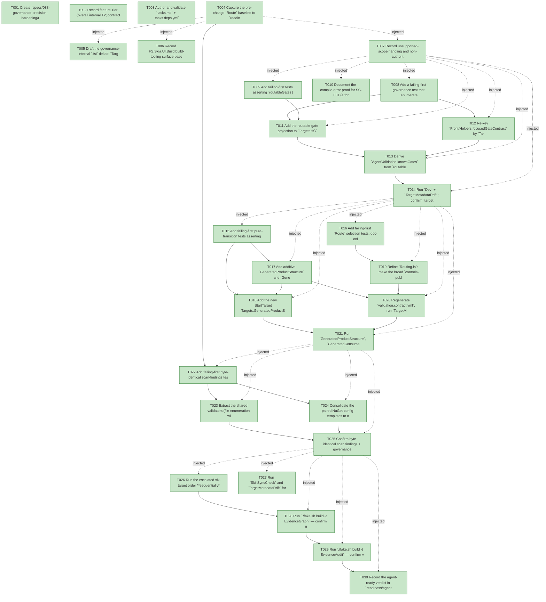

# Task Graph — 088-governance-precision-hardening

## ✓ Graph is acyclic and consistent

## Skill Match Assessments

| Task | Candidate | Confidence | Signals | Reviewer disposition | Diagnostic |
|------|-----------|------------|---------|----------------------|------------|
| T001 | (none) | none |  | accepted-empty | T001: skillist trusted as declared; no owns-based capability requirement |
| T002 | (none) | none |  | accepted-empty | T002: skillist trusted as declared; no owns-based capability requirement |
| T003 | speckit-tasks | high | owns:task-generation | accepted | T003: owns task-generation requires skill speckit-tasks; trigger_group=owns; matched_trigger=owns:task-generation |
| T004 | (none) | none |  | accepted-empty | T004: skillist trusted as declared; no owns-based capability requirement |
| T005 | (none) | none |  | accepted-empty | T005: skillist trusted as declared; no owns-based capability requirement |
| T006 | (none) | none |  | accepted-empty | T006: skillist trusted as declared; no owns-based capability requirement |
| T007 | (none) | none |  | accepted-empty | T007: skillist trusted as declared; no owns-based capability requirement |
| T008 | (none) | none |  | declared | T008: skillist trusted as declared; no owns-based capability requirement |
| T009 | (none) | none |  | declared | T009: skillist trusted as declared; no owns-based capability requirement |
| T010 | (none) | none |  | accepted-empty | T010: skillist trusted as declared; no owns-based capability requirement |
| T011 | (none) | none |  | declared | T011: skillist trusted as declared; no owns-based capability requirement |
| T012 | (none) | none |  | accepted-empty | T012: skillist trusted as declared; no owns-based capability requirement |
| T013 | (none) | none |  | declared | T013: skillist trusted as declared; no owns-based capability requirement |
| T014 | (none) | none |  | declared | T014: skillist trusted as declared; no owns-based capability requirement |
| T015 | (none) | none |  | declared | T015: skillist trusted as declared; no owns-based capability requirement |
| T016 | (none) | none |  | declared | T016: skillist trusted as declared; no owns-based capability requirement |
| T017 | (none) | none |  | accepted-empty | T017: skillist trusted as declared; no owns-based capability requirement |
| T018 | (none) | none |  | accepted-empty | T018: skillist trusted as declared; no owns-based capability requirement |
| T019 | (none) | none |  | declared | T019: skillist trusted as declared; no owns-based capability requirement |
| T020 | (none) | none |  | declared | T020: skillist trusted as declared; no owns-based capability requirement |
| T021 | (none) | none |  | declared | T021: skillist trusted as declared; no owns-based capability requirement |
| T022 | (none) | none |  | declared | T022: skillist trusted as declared; no owns-based capability requirement |
| T023 | (none) | none |  | declared | T023: skillist trusted as declared; no owns-based capability requirement |
| T024 | (none) | none |  | declared | T024: skillist trusted as declared; no owns-based capability requirement |
| T025 | (none) | none |  | declared | T025: skillist trusted as declared; no owns-based capability requirement |
| T026 | (none) | none |  | declared | T026: skillist trusted as declared; no owns-based capability requirement |
| T027 | (none) | none |  | accepted-empty | T027: skillist trusted as declared; no owns-based capability requirement |
| T028 | speckit-evidence-graph | high | owns:graph-validation | accepted | T028: owns graph-validation requires skill speckit-evidence-graph; trigger_group=owns; matched_trigger=owns:graph-validation |
| T029 | speckit-evidence-audit | high | owns:evidence-audit | accepted | T029: owns evidence-audit requires skill speckit-evidence-audit; trigger_group=owns; matched_trigger=owns:evidence-audit |
| T030 | (none) | none |  | accepted-empty | T030: skillist trusted as declared; no owns-based capability requirement |

## Status counts (effective)

| Status | Count |
|--------|-------|
| [X] done | 30 |
| [S] synthetic | 0 |
| [S*] auto-synthetic | 0 |
| accepted [SEH] synthetic | 0 |
| unaccepted synthetic | 0 |

## Graph



## ASCII view

```
T001 [X] Create `specs/088-governance-precision-hardening/readiness/` (and `readiness/logs/`) with audit-enforced placeholder files — each naming its authoritative command, artifact path, failure class, and next action
T002 [X] Record feature Tier (overall internal T2; contracted T1 only for US2 target/contract changes), affected layer (`build/Governance/**` only — no product surface), MVU applicability (build engine boundary reused, no new effect), and the real-evidence obligations in `readiness/`
T003 [X] Author and validate `tasks.md` + `tasks.deps.yml` for this feature (DAG, skillist mirror, owns metadata)
T004 [X] Capture the pre-change `Route` baseline to `readiness/route-before.txt` and the Tier-3 pre-refactor scan-finding baseline artifacts (five generated file-lists + `GeneratedProductValidationPath`) under `readiness/behavior-preserving-baseline/`
T005 [X] Draft the governance-internal `.fsi` deltas: `Targets.fsi` (additive `GeneratedProductStructure`/`GeneratedConsumerValidation` cases + `routableGates`/`productCheckGates`/`isProductCheck` projection vals), `Front/Helpers` typed `focusedGateContract: BuildModel -> Targets.Target -> FocusedGateContract`, and the derived `AgentValidation.knownGates` note — no product `.fsi` touched
T006 [X] Record FS.Skia.UI.Build build-tooling surface-baseline expectations (re-capture only if the build library's own per-package/aggregate baseline moves; product surface baselines stay frozen)
T007 [X] Record unsupported-scope handling and non-authoritative aggregate reporting in `readiness/governance-risk-levels.md`, `readiness/runtime-limitations.md`, and `readiness/aggregate-hang-diagnostics.md`
T008 [X] Add a failing-first governance test that enumerates `Targets.routableGates` and asserts each resolves through `focusedGateContract` to a **non-`VerificationDegraded`** contract (SC-003)
T009 [X] Add failing-first tests asserting `routableGates |> List.map name` set-equals the prior `AgentValidation.knownGates` literal, and `productCheckGates |> List.map name` equals the prior `Update.fs` `ProductChecksRun` list **byte-for-byte and in order** (SC-002)
T010 [X] Document the compile-error proof for SC-001 (a throwaway `Target` case with no `focusedGateContract` arm fails to compile) and record the reverting walkthrough in `readiness/`
T011 [X] Add the routable-gate projection to `Targets.fs`/`Targets.fsi`: `routableGates`, `isProductCheck`, and `productCheckGates` (Verify's prerequisites filtered) rendered in pinned registry order (FR-003/004)
T012 [X] Re-key `Front/Helpers.focusedGateContract` by `Targets.Target` with an **exhaustive, wildcard-free** match: re-key existing arms, add explicit arms for the previously-degraded gates (`ContrastCheck`, `ControlFidelityCheck`, `PerPackageSurfaceDiff`, `SkillContractPathCheck`, …), and route true non-routable targets through a named `internalTargetContract` helper reproducing the exact former wildcard value (FR-001/002)
T013 [X] Derive `AgentValidation.knownGates` from `routableGates` and `Verify`'s `ProductChecksRun` from `productCheckGates`, and convert `Update.fs` gate-name call sites (`focusedGateAssumptionCheck`/`focusedGateSummary`, `targetMetadata`) to pass the typed `Targets.<Case>` (FR-003/004/005)
T014 [X] Run `Dev` + `TargetMetadataDrift`; confirm `target-metadata.json` and `validation.contract.yml` byte-identical to baseline and the failing-first tests now pass; capture logs to `readiness/`
T015 [X] Add failing-first pure-transition tests asserting the new `StartTarget GeneratedProductStructure` / `GeneratedConsumerValidation` arms emit the **existing** effects, and the `GeneratedProductCheck` umbrella composes both sub-targets with an identical emitted-effect/evidence/verdict set (SC-005)
T016 [X] Add failing-first `Route` selection tests: doc-only vs. source vs. mixed diffs under `template/**` and `src/Controls/**` (doc-only resolves to the **exact pinned** `[ EvidenceGraph ]` set; mixed/source re-escalate to the full set), plus the structural-vs-consumer split classification (SC-004)
T017 [X] Add additive `GeneratedProductStructure` and `GeneratedConsumerValidation` cases to `Targets.fs`/`Targets.fsi` (`allTargets`, `spec`, `name`, `directPrerequisites`, `timeoutClass`/`cost`/`failureOwner`); make `GeneratedProductCheck`'s `directPrerequisites` compose both sub-targets while staying a resolvable umbrella (FR-006/007)
T018 [X] Add the new `StartTarget Targets.GeneratedProductStructure` / `…ConsumerValidation` arms in `Engine/Update.fs` that re-emit the existing `GenerateV3Products`/`ScanV3GeneratedProducts`/`ValidateGeneratedConsumer` effects + `RequireFiles`; keep `update` pure and the interpreter unchanged (FR-006)
T019 [X] Refine `Routing.fs`: make the broad `controls-public-surface`/`generated-template` source rules match heavy gates only when the diff has a non-doc path, add `controls-docs` (`src/Controls/**/*.md`) and `template-docs` (`template/**/*.md`) rules with the **pinned** `RequiredGates = [ EvidenceGraph ]` (no heavy gates, no `Dev`), keep `build.fsx`/`scripts/build/**`/`validation.contract.yml`/`.specify/**`/`build/Governance/**` conservative (FR-008/009), and tighten only provably coverage-neutral dependency chains (FR-010)
T020 [X] Regenerate `validation.contract.yml`, run `TargetMetadataDrift`, and record the intentional contract diff with rationale in `readiness/validation-contract-diff.md`; capture `route-after-doconly.txt`, `route-after-source.txt`, `route-after-structural.txt`
T021 [X] Run `GeneratedProductStructure`, `GeneratedConsumerValidation`, and the `GeneratedProductCheck` umbrella; confirm the umbrella's evidence artifacts + verdict are byte-identical to the pre-split run and the structural target fails fast independently of/before consumer validation (SC-005)
T022 [X] Add failing-first byte-identical scan-findings tests for the extracted validators, comparing `scanGeneratedRow`/`scanV3GeneratedRow` output against the `readiness/behavior-preserving-baseline/` captured in T004 (SC-006/FR-013)
T023 [X] Extract the shared validators (file enumeration with bin/obj/readiness filtering, forbidden-path/required-file validation) from `scanGeneratedRow` and `scanV3GeneratedRow` onto common helpers, keeping each caller's distinct row shape — no finding change (FR-011)
T024 [X] Consolidate the paired NuGet-config templates to one rendered source, behavior-preserving (FR-012)
T025 [X] Confirm byte-identical scan findings + governance goldens vs. the baseline and **no** `.fsi` / `validation.contract.yml` change; record the result in `readiness/behavior-preserving-baseline.md` (FR-013)
T026 [X] Run the escalated six-target order **sequentially** (`Dev`, `GeneratedGuidanceCheck`, `TemplateCheck`, `GeneratedProductCheck`, `EvidenceGraph`, `EvidenceAudit`), recording per-target verdicts non-authoritatively to `readiness/logs/`
T027 [X] Run `SkillSyncCheck` and `TargetMetadataDrift` for currency; record clean results in `readiness/skill-sync-check.md` and `readiness/target-metadata.md`
T028 [X] Run `./fake.sh build -t EvidenceGraph` — confirm no cycles, no dangling refs, no `[S*]` surprises
T029 [X] Run `./fake.sh build -t EvidenceAudit` — confirm verdict PASS (no `[S]`/diff-scan hits; no synthetic evidence planned)
T030 [X] Record the agent-ready verdict in `readiness/agent-ready-verdict.md`, including the **SC-007 independent-shippability argument** (verified as a design/ordering property, not an isolated per-tier gate run): the disjoint-file rationale (Tier 1/3 touch typed-keying/derived-lists/scan-helpers; only Tier 2 regenerates `validation.contract.yml`) plus the per-tier checkpoint evidence — US1 byte-identical contract (T014), US2 intentional contract diff + doc-only relaxation (T020/T021), US3 byte-identical artifacts (T025)
```

## Injected checkpoint edges (Phase N+1 → Phase N) — FR-007

- T004 → T005  (auto-injected Phase-checkpoint edge)
- T004 → T006  (auto-injected Phase-checkpoint edge)
- T004 → T007  (auto-injected Phase-checkpoint edge)
- T007 → T008  (auto-injected Phase-checkpoint edge)
- T007 → T009  (auto-injected Phase-checkpoint edge)
- T007 → T010  (auto-injected Phase-checkpoint edge)
- T007 → T011  (auto-injected Phase-checkpoint edge)
- T007 → T012  (auto-injected Phase-checkpoint edge)
- T007 → T013  (auto-injected Phase-checkpoint edge)
- T007 → T014  (auto-injected Phase-checkpoint edge)
- T014 → T015  (auto-injected Phase-checkpoint edge)
- T014 → T016  (auto-injected Phase-checkpoint edge)
- T014 → T017  (auto-injected Phase-checkpoint edge)
- T014 → T018  (auto-injected Phase-checkpoint edge)
- T014 → T019  (auto-injected Phase-checkpoint edge)
- T014 → T020  (auto-injected Phase-checkpoint edge)
- T014 → T021  (auto-injected Phase-checkpoint edge)
- T021 → T022  (auto-injected Phase-checkpoint edge)
- T021 → T023  (auto-injected Phase-checkpoint edge)
- T021 → T024  (auto-injected Phase-checkpoint edge)
- T021 → T025  (auto-injected Phase-checkpoint edge)
- T025 → T026  (auto-injected Phase-checkpoint edge)
- T025 → T027  (auto-injected Phase-checkpoint edge)
- T025 → T028  (auto-injected Phase-checkpoint edge)
- T025 → T029  (auto-injected Phase-checkpoint edge)
- T025 → T030  (auto-injected Phase-checkpoint edge)

## Resolved skillist ids — FR-007

Resolved skillist-id set (8): fs-skia-template-update, fsharp-build-orchestration, fsharp-code-generation, fsharp-graph-algorithms, fsharp-io-globbing, speckit-evidence-audit, speckit-evidence-graph, speckit-tasks

