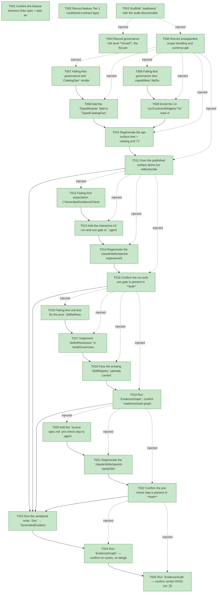

# Task Graph — 089-typed-surface-and-workflow-followups

## ✓ Graph is acyclic and consistent

## Skill Match Assessments

| Task | Candidate | Confidence | Signals | Reviewer disposition | Diagnostic |
|------|-----------|------------|---------|----------------------|------------|
| T001 | (none) | none |  | accepted-empty | T001: skillist trusted as declared; no owns-based capability requirement |
| T002 | (none) | none |  | accepted-empty | T002: skillist trusted as declared; no owns-based capability requirement |
| T003 | (none) | none |  | accepted-empty | T003: skillist trusted as declared; no owns-based capability requirement |
| T004 | (none) | none |  | accepted-empty | T004: skillist trusted as declared; no owns-based capability requirement |
| T005 | (none) | none |  | accepted-empty | T005: skillist trusted as declared; no owns-based capability requirement |
| T006 | (none) | none |  | declared | T006: skillist trusted as declared; no owns-based capability requirement |
| T007 | (none) | none |  | declared | T007: skillist trusted as declared; no owns-based capability requirement |
| T008 | (none) | none |  | declared | T008: skillist trusted as declared; no owns-based capability requirement |
| T009 | (none) | none |  | accepted-empty | T009: skillist trusted as declared; no owns-based capability requirement |
| T010 | (none) | none |  | declared | T010: skillist trusted as declared; no owns-based capability requirement |
| T011 | (none) | none |  | declared | T011: skillist trusted as declared; no owns-based capability requirement |
| T012 | (none) | none |  | declared | T012: skillist trusted as declared; no owns-based capability requirement |
| T013 | (none) | none |  | declared | T013: skillist trusted as declared; no owns-based capability requirement |
| T014 | (none) | none |  | declared | T014: skillist trusted as declared; no owns-based capability requirement |
| T015 | (none) | none |  | declared | T015: skillist trusted as declared; no owns-based capability requirement |
| T016 | (none) | none |  | declared | T016: skillist trusted as declared; no owns-based capability requirement |
| T017 | (none) | none |  | declared | T017: skillist trusted as declared; no owns-based capability requirement |
| T018 | (none) | none |  | accepted-empty | T018: skillist trusted as declared; no owns-based capability requirement |
| T019 | (none) | none |  | declared | T019: skillist trusted as declared; no owns-based capability requirement |
| T020 | (none) | none |  | declared | T020: skillist trusted as declared; no owns-based capability requirement |
| T021 | (none) | none |  | declared | T021: skillist trusted as declared; no owns-based capability requirement |
| T022 | (none) | none |  | declared | T022: skillist trusted as declared; no owns-based capability requirement |
| T023 | (none) | none |  | declared | T023: skillist trusted as declared; no owns-based capability requirement |
| T024 | speckit-evidence-graph | high | owns:graph-validation | accepted | T024: owns graph-validation requires skill speckit-evidence-graph; trigger_group=owns; matched_trigger=owns:graph-validation |
| T025 | speckit-evidence-audit | high | owns:evidence-audit | accepted | T025: owns evidence-audit requires skill speckit-evidence-audit; trigger_group=owns; matched_trigger=owns:evidence-audit |

## Status counts (effective)

| Status | Count |
|--------|-------|
| [X] done | 25 |
| [S] synthetic | 0 |
| [S*] auto-synthetic | 0 |
| accepted [SEH] synthetic | 0 |
| unaccepted synthetic | 0 |

## Graph



## ASCII view

```
T001 [X] Confirm the feature directory links spec + plan and that `./fake.sh build -t Route` escalates this change to `maintainer-verify` (Tier 1, published-contract)
T002 [X] Record feature Tier 1 / published-contract layer, additive public-API impact, Principle IV (MVU) N/A, and the per-story evidence obligations
T003 [X] Scaffold `readiness/` with the audit-discoverable placeholder files (authoritative command, artifact path, failure class, next action each); mark visual/window/real-image files N/A-for-runtime
T004 [X] Record governance risk level **broad**, the focused serialized six-target validation, and how non-authoritative aggregate results (e.g. local `GeneratedProductCheck` feature-resolution failure) are reported
T005 [X] Record unsupported-scope handling and currency-gate failure diagnostics (the `RefreshSurfaceBaselines` remedy named by `ApiSurfaceGen.currency` / `CatalogGen.currency` / `SkillSyncCheck`)
T006 [X] Failing-first governance test: capabilities/`ApiSurfaceGen` currency requires the 14 typed `src/Controls/Widgets/*.fsi` to emit byte-identically into `docs/api-surface/Controls/` (and the `template/base` mirror)
T007 [X] Failing-first governance test: `CatalogGen` renders the `TypedModule` token into `catalog.yml`/`Catalog.fs`, currency fails on drift, and the E1⟂E2 cross-check holds (every `TypedModule` names a module declared in an enrolled `.fsi`) **and the coverage is total** — every one of the 52 `catalog.yml` control ids maps to a typed module that exposes a `view`, with the single bridge-typed `custom-control` (no `Props`/`view`) explicitly excepted — so the SC-001 "100%" claim is mechanically asserted, not spot-checked (SC-001, SC-002, FR-004)
T008 [X] Add the `TypedModule` field to `TypedCatalogFact` (`build/Governance/CatalogGen.fs` + `.fsi`), populate it per control in `catalogFacts`, and render it via `renderYamlRow` (and `renderFSharpRow`)
T009 [X] Enroll the 14 `src/Controls/Widgets/*.fsi` rows into the `template/capabilities.yml` Controls `contracts:` (additive — keep the 14 legacy builder `.fsi`)
T010 [X] Regenerate the api-surface tree + `catalog.yml`/`Catalog.fs` via `RefreshSurfaceBaselines`; recapture the per-package `FS.Skia.UI.Controls.fsi.txt` and the emitted `template/base/docs/api-surface/Controls/` baselines
T011 [X] From the published surface alone (no reflection/decompilation), author a correct typed `Props` value + `view` call for three stateful `CollectionModel`/`TextInputModel`-backed controls; confirm whole-catalog coverage by relying on the T007 total-coverage cross-check (all 52 control ids → a typed module exposing `view`, `custom-control` excepted) rather than per-control spot checks, with the legacy `.fsi` still present (SC-001, SC-002, FR-003, FR-004)
T012 [X] Failing-first expectation (`GeneratedGuidanceCheck` / guidance review): `speckit-implement` is missing the interactive-UI run-and-use gate text — record the red state before editing
T013 [X] Add the interactive-UI run-and-use gate to `.agents/skills/speckit-implement/SKILL.md` (after per-task Workflow step 6, before the status-write step): launch + interact via the `run`/`verify` skills, confirm the evidence exercised the **production render path** stated generically (the real user-reachable surface the feature drives — cite `controlsExampleView` → `Control.renderTree` only as an example, never as the rule, so the gate binds every future interactive-UI feature per FR-007), no-op for non-interactive stories, precondition of `[X]` on `[US*]`
T014 [X] Regenerate the `.claude/skills/speckit-implement/SKILL.md` mirror via `RefreshSurfaceBaselines`; confirm `SkillSyncCheck` byte-identity
T015 [X] Confirm the run-and-use gate is present in **both** the `.agents` source and the `.claude` mirror, and that an interactive `[US*]` cannot be `[X]` without the recorded run-and-use step on the production path (SC-003)
T016 [X] Failing-first unit test for the pure `skillistResolution: SkillRegistry -> string list -> string` helper: resolved `id → path`, and alias / ambiguous / unresolved tokens each flagged distinctly (matching `Audit.fs` semantics)
T017 [X] Implement `skillistResolution` in `build/Governance/Evidence/Render.fs` (+ `.fsi`) and append the resolved section and the separate flagged section to `taskGraphMd`
T018 [X] Pass the existing `SkillRegistry` (already carried in `EvidenceInputs`, built in `Front/Governance.fs`) into the `taskGraphMd` call via `Engine` — reuse the registry already present, no parallel resolver
T019 [X] Run `EvidenceGraph`; confirm `readiness/task-graph.md` shows the per-token `id → SKILL.md path` echo plus the distinct flagged section, agreeing with the `Audit` validator (SC-004)
T020 [X] Add the `source-spec.md` pre-check step to `.agents/skills/speckit-clarify/SKILL.md` (after step 1): when a `source-spec.md` snapshot exists in `FEATURE_DIR`, consult it before forming questions; silent no-op when absent
T021 [X] Regenerate the `.claude/skills/speckit-clarify/SKILL.md` mirror via `RefreshSurfaceBaselines`; confirm `SkillSyncCheck` byte-identity
T022 [X] Confirm the pre-check step is present in **both** trees and degrades gracefully (no-op) when no `source-spec.md` is present (SC-005)
T023 [X] Run the serialized order `Dev` → `GeneratedGuidanceCheck` → `TemplateCheck` → `GeneratedProductCheck` (sequential, FAKE-backed); record non-authoritative aggregate results for any known-environment-only failure
T024 [X] Run `EvidenceGraph` — confirm no cycles, no dangling refs, no `[S*]` surprises, and the skillist resolution echo is present (SC-006)
T025 [X] Run `EvidenceAudit` — confirm verdict PASS (no `[S]`/`[S*]`, no diff-scan hits); no `--accept-synthetic` override expected (SC-006)
```

## Injected checkpoint edges (Phase N+1 → Phase N) — FR-007

- T003 → T004  (auto-injected Phase-checkpoint edge)
- T003 → T005  (auto-injected Phase-checkpoint edge)
- T005 → T006  (auto-injected Phase-checkpoint edge)
- T005 → T007  (auto-injected Phase-checkpoint edge)
- T005 → T008  (auto-injected Phase-checkpoint edge)
- T005 → T009  (auto-injected Phase-checkpoint edge)
- T005 → T010  (auto-injected Phase-checkpoint edge)
- T005 → T011  (auto-injected Phase-checkpoint edge)
- T011 → T012  (auto-injected Phase-checkpoint edge)
- T011 → T013  (auto-injected Phase-checkpoint edge)
- T011 → T014  (auto-injected Phase-checkpoint edge)
- T011 → T015  (auto-injected Phase-checkpoint edge)
- T015 → T016  (auto-injected Phase-checkpoint edge)
- T015 → T017  (auto-injected Phase-checkpoint edge)
- T015 → T018  (auto-injected Phase-checkpoint edge)
- T015 → T019  (auto-injected Phase-checkpoint edge)
- T019 → T020  (auto-injected Phase-checkpoint edge)
- T019 → T021  (auto-injected Phase-checkpoint edge)
- T019 → T022  (auto-injected Phase-checkpoint edge)
- T022 → T024  (auto-injected Phase-checkpoint edge)
- T022 → T025  (auto-injected Phase-checkpoint edge)

## Resolved skillist ids — FR-007

Resolved skillist-id set (9): fs-skia-template-update, fs-skia-typed-controls, fsharp-build-orchestration, fsharp-code-generation, fsharp-parsing, speckit-clarify, speckit-evidence-audit, speckit-evidence-graph, speckit-implement

## Skillist id → SKILL.md path

fs-skia-template-update → .agents/skills/fs-skia-template-update/SKILL.md
fs-skia-typed-controls → .agents/skills/fs-skia-typed-controls/SKILL.md
fsharp-build-orchestration → .agents/skills/fsharp-build-orchestration/SKILL.md
fsharp-code-generation → .agents/skills/fsharp-code-generation/SKILL.md
fsharp-parsing → .agents/skills/fsharp-parsing/SKILL.md
speckit-clarify → .agents/skills/speckit-clarify/SKILL.md
speckit-evidence-audit → .agents/skills/speckit-evidence-audit/SKILL.md
speckit-evidence-graph → .agents/skills/speckit-evidence-graph/SKILL.md
speckit-implement → .agents/skills/speckit-implement/SKILL.md

## Skillist id → unresolved / flagged

_(none — every declared skillist id resolves to exactly one installed skill)_

