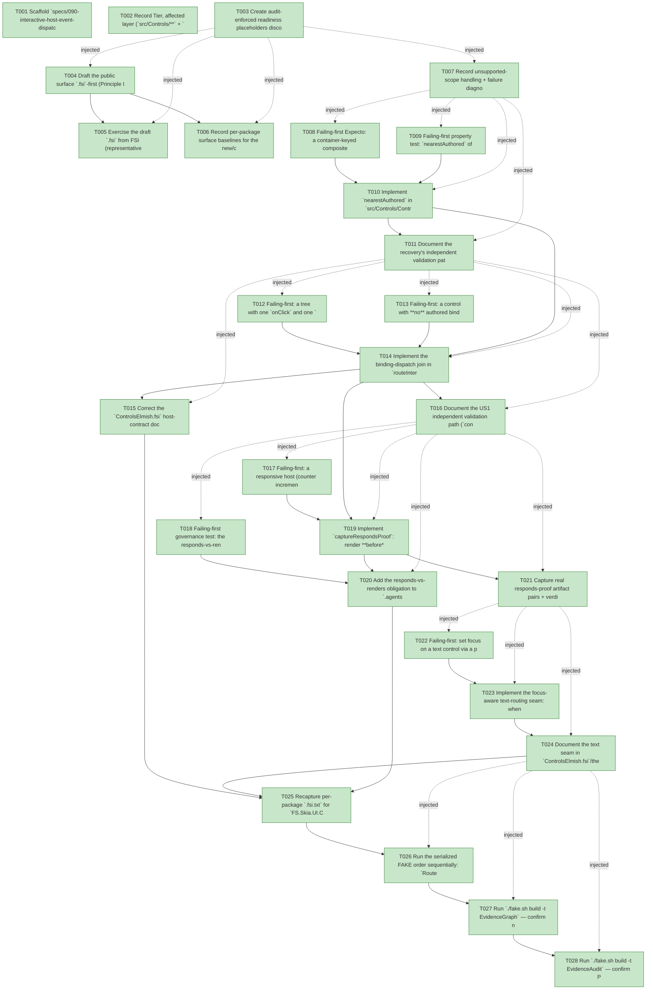

# Task Graph — 090-interactive-host-event-dispatch

## ✓ Graph is acyclic and consistent

## Skill Match Assessments

| Task | Candidate | Confidence | Signals | Reviewer disposition | Diagnostic |
|------|-----------|------------|---------|----------------------|------------|
| T001 | (none) | none |  | accepted-empty | T001: skillist trusted as declared; no owns-based capability requirement |
| T002 | (none) | none |  | accepted-empty | T002: skillist trusted as declared; no owns-based capability requirement |
| T003 | (none) | none |  | accepted-empty | T003: skillist trusted as declared; no owns-based capability requirement |
| T004 | (none) | none |  | declared | T004: skillist trusted as declared; no owns-based capability requirement |
| T005 | (none) | none |  | declared | T005: skillist trusted as declared; no owns-based capability requirement |
| T006 | (none) | none |  | declared | T006: skillist trusted as declared; no owns-based capability requirement |
| T007 | (none) | none |  | declared | T007: skillist trusted as declared; no owns-based capability requirement |
| T008 | (none) | none |  | declared | T008: skillist trusted as declared; no owns-based capability requirement |
| T009 | (none) | none |  | declared | T009: skillist trusted as declared; no owns-based capability requirement |
| T010 | (none) | none |  | declared | T010: skillist trusted as declared; no owns-based capability requirement |
| T011 | (none) | none |  | declared | T011: skillist trusted as declared; no owns-based capability requirement |
| T012 | (none) | none |  | declared | T012: skillist trusted as declared; no owns-based capability requirement |
| T013 | (none) | none |  | declared | T013: skillist trusted as declared; no owns-based capability requirement |
| T014 | (none) | none |  | declared | T014: skillist trusted as declared; no owns-based capability requirement |
| T015 | (none) | none |  | declared | T015: skillist trusted as declared; no owns-based capability requirement |
| T016 | (none) | none |  | declared | T016: skillist trusted as declared; no owns-based capability requirement |
| T017 | (none) | none |  | declared | T017: skillist trusted as declared; no owns-based capability requirement |
| T018 | (none) | none |  | declared | T018: skillist trusted as declared; no owns-based capability requirement |
| T019 | (none) | none |  | declared | T019: skillist trusted as declared; no owns-based capability requirement |
| T020 | (none) | none |  | declared | T020: skillist trusted as declared; no owns-based capability requirement |
| T021 | (none) | none |  | declared | T021: skillist trusted as declared; no owns-based capability requirement |
| T022 | (none) | none |  | declared | T022: skillist trusted as declared; no owns-based capability requirement |
| T023 | (none) | none |  | declared | T023: skillist trusted as declared; no owns-based capability requirement |
| T024 | (none) | none |  | declared | T024: skillist trusted as declared; no owns-based capability requirement |
| T025 | (none) | none |  | declared | T025: skillist trusted as declared; no owns-based capability requirement |
| T026 | (none) | none |  | declared | T026: skillist trusted as declared; no owns-based capability requirement |
| T027 | speckit-evidence-graph | high | owns:graph-validation | accepted | T027: owns graph-validation requires skill speckit-evidence-graph; trigger_group=owns; matched_trigger=owns:graph-validation |
| T028 | speckit-evidence-audit | high | owns:evidence-audit | accepted | T028: owns evidence-audit requires skill speckit-evidence-audit; trigger_group=owns; matched_trigger=owns:evidence-audit |

## Status counts (effective)

| Status | Count |
|--------|-------|
| [X] done | 28 |
| [S] synthetic | 0 |
| [S*] auto-synthetic | 0 |
| accepted [SEH] synthetic | 0 |
| unaccepted synthetic | 0 |

## Graph



## ASCII view

```
T001 [X] Scaffold `specs/090-interactive-host-event-dispatch/readiness/` and link spec + plan; record feature Tier 1 / escalated `maintainer-verify`
T002 [X] Record Tier, affected layer (`src/Controls/**` + `src/Controls.Elmish/**` + the `.agents`/`.claude` evidence spine), public-`.fsi` impact, MVU applicability, and evidence obligations in `readiness/governance-risk-levels.md` (name small/medium/broad levels, the focused validation for **broad**, when broad validation is required, and how non-authoritative aggregate results are recorded). Note that **SC-001's "100% of catalog controls"** is a **host-mechanism guarantee** (the host dispatches any authored binding universally), proven on the representative sample per FR-005a — **not** a per-view audit of all 52 typed `Widgets/*.fs` views
T003 [X] Create audit-enforced readiness placeholders discoverable before implementation — `readiness/visual-evidence-honesty.md`, `readiness/window-visibility.md` (honest "deferred — responds-proof is a headless render-target capture; no live Vulkan window required per plan"), `readiness/aggregate-hang-diagnostics.md`, `readiness/runtime-limitations.md`, `readiness/generated-guidance-validation.md`, `readiness/real-image-evidence.md`, `readiness/skill-sync-check.md` — each naming the authoritative command, artifact path, failure class, and next action
T004 [X] Draft the public surface `.fsi`-first (Principle I): `nearestAuthored : ControlRenderResult<'msg> -> ControlId -> ControlId option` in `src/Controls/Control.fsi` (FR-004/004a/005); the focus-aware text-routing seam field/function, the `captureRespondsProof` capture, and the binding-dispatch behavior note in `src/Controls.Elmish/ControlsElmish.fsi`; and the **corrected** host-contract doc replacing the false "`Layout.hitTestComputed` × `EventBindings`" claim (FR-002)
T005 [X] Exercise the draft `.fsi` from FSI (representative `nearestAuthored` + `routeInteractivePointer` paths the live host wires) and capture the transcript to `readiness/fsi-session.txt`
T006 [X] Record per-package surface baselines for the new/changed modules of `FS.Skia.UI.Controls` and `FS.Skia.UI.Controls.Elmish` (`PerPackageSurface.captureCurrent` — `RefreshSurfaceBaselines` alone does not regenerate `.fsi.txt`)
T007 [X] Record unsupported-scope handling + failure diagnostics in `readiness/runtime-limitations.md`: FR-004a `None`→`MapPointer` fallback (never invent a `Kind`/root id), FR-008a focus/tab-traversal & full editor UX deferred to E4, FR-005a scope (host **dispatch mechanism + representative sample only — no catalog-wide audit/retrofit of the 52 typed `Widgets/*.fs` views**; any per-view "exposes no binding" gap is flagged to a separate fitness pass, not fixed in 090), the non-authoritative `GeneratedProductCheck` env-failure, and render-target-only honesty for the responds-proof
T008 [X] Failing-first Expecto: a container-keyed composite hit on an inner positional node (`"0.1"`) resolves via `nearestAuthored` to the **container** id; a directly-keyed leaf resolves to itself; an unkeyed/unbound subtree returns `None` (FR-004, FR-004a, FR-005, R1/R2/R3) — compare returned `ControlId` strings (`Control<'msg>` has no equality)
T009 [X] Failing-first property test: `nearestAuthored` of an already-authored id is that id (idempotent fixed point); total + deterministic over generated trees (R4)
T010 [X] Implement `nearestAuthored` in `src/Controls/Control.fs` and export it in `Control.fsi` — re-derive the structural-path→node map (same `toLayout` `path + "." + index` scheme), ascend path-parents to the nearest node carrying a `Key` or non-empty authored `EventBindings`, return its authored `ControlId`, else `None` (FR-004, FR-004a, FR-005)
T011 [X] Document the recovery's independent validation path (`contracts/recovery.md`) and confirm no layout-math change
T012 [X] Failing-first: a tree with one `onClick` and one `onChanged` routed through `routeInteractivePointer` (press+release at the bound control's bounds) dispatches the **bound** message and folds it, with **zero** `MapPointer` clauses authored; a competing `MapPointer` clause for the same control does **not** also fire (FR-001, FR-003, G1/G2 — no double-advance)
T013 [X] Failing-first: a control with **no** authored binding plus a `MapPointer` clause still routes via `MapPointer` exactly as today (additive / non-regressive, G3)
T014 [X] Implement the binding-dispatch join in `routeInteractivePointer`: per interaction recover the authored id (`nearestAuthored`), look up `rendered.EventBindings` by `(ControlId, eventKind)`, dispatch the bound message **xor** fall back to `MapPointer` for unconsumed interactions — preserving interaction order (FR-001, FR-003)
T015 [X] Correct the `ControlsElmish.fsi` host-contract doc so it accurately states whether/how authored `EventBindings` fire — no claim of dispatch the code does not perform (FR-002, G4, SC-002)
T016 [X] Document the US1 independent validation path (`contracts/host-dispatch.md`, `quickstart.md` author→host→click→verify loop)
T017 [X] Failing-first: a responsive host (counter incremented by `onClick`) yields before ≠ after → `Responsive`; an inert host (binding dropped / pre-fix behavior) yields before = after → `Inert` and **fails** the proof (FR-006, P1/P3, SC-004)
T018 [X] Failing-first governance test: the responds-vs-renders obligation text is present in the evidence skill tree and `.claude`↔`.agents` are byte-identical (FR-007, P4, SC-006)
T019 [X] Implement `captureRespondsProof`: render **before** → route + `host.Update` fold + repaint (as `SkiaViewer.fs:2469`) → render **after** → emit both frames + verdict (`Responsive`/`Inert`), reusing headless render-target capture (no live Vulkan window) (FR-006)
T020 [X] Add the responds-vs-renders obligation to `.agents/skills/fs-skia-evidence-mode/SKILL.md` and regenerate the `.claude` mirror via `RefreshSurfaceBaselines` (`SkillSyncCheck` byte-identity; watch the trailing-newline drift) (FR-007)
T021 [X] Capture real responds-proof artifact pairs + verdict lines under `readiness/responds-proof/<case>/{before,after}.png` + `responds-proof.txt` on the running host for the two cases responsive by this phase — one **leaf-keyed `onClick`** (US1) and one **container-keyed composite** (US2, routed via `nearestAuthored`) — so US2 has a captured running-window proof, not only a harness test (the focused-text case is captured in Phase 6, T024); each distinct from a render-only screenshot and the offscreen route probe (`readiness/real-image-evidence.md`)
T022 [X] Failing-first: set focus on a text control via a pointer click (focus-on-click path), deliver a keystroke through the focus-aware seam, and assert the character reaches the **focused** text control's `TextInput` model and **not** an unfocused one (FR-008, T1/T3)
T023 [X] Implement the focus-aware text-routing seam: when `ControlRuntime.FocusedControl` names a focusable text control, deliver the keystroke/committed text to its `TextInput.update` and fold the product `'msg`, else fall through to the **unchanged** `MapKey` field (FR-008, no parallel text model)
T024 [X] Document the text seam in `ControlsElmish.fsi`/the published contract (no silent inertness; `MapKey` signature unchanged) and note the E4 scope guard (FR-008/008a, T4/T5); then capture the **focused-text running-window responds-proof** under `readiness/responds-proof/text/{before,after}.png` + `responds-proof.txt` (a keystroke to the focused control visibly changes the running host), completing the plan's leaf/container/text representative sample alongside T021
T025 [X] Recapture per-package `.fsi.txt` for `FS.Skia.UI.Controls` + `FS.Skia.UI.Controls.Elmish` (`PerPackageSurface.captureCurrent`) and the published `template/base/docs/api-surface/**` via `RefreshSurfaceBaselines`; confirm currency (`TargetMetadataDrift`/`SkillSyncCheck`) (SC-006)
T026 [X] Run the serialized FAKE order sequentially: `Route` (expect escalate) → `Dev` → `GeneratedGuidanceCheck` → `TemplateCheck` → `GeneratedProductCheck`; record the non-authoritative `GeneratedProductCheck` env-failure and capture logs (`readiness/aggregate-hang-diagnostics.md`); rerun affected commands sequentially if a failure looks race-like
T027 [X] Run `./fake.sh build -t EvidenceGraph` — confirm no cycles, no dangling refs, no `[S*]` surprises, and the echoed `feature-directory`/`tasks=<n>` match 090
T028 [X] Run `./fake.sh build -t EvidenceAudit` — confirm PASS (no `[S]`/`[S*]`, no diff-scan hits); document any `--accept-synthetic` override
```

## Injected checkpoint edges (Phase N+1 → Phase N) — FR-007

- T003 → T004  (auto-injected Phase-checkpoint edge)
- T003 → T005  (auto-injected Phase-checkpoint edge)
- T003 → T006  (auto-injected Phase-checkpoint edge)
- T003 → T007  (auto-injected Phase-checkpoint edge)
- T007 → T008  (auto-injected Phase-checkpoint edge)
- T007 → T009  (auto-injected Phase-checkpoint edge)
- T007 → T010  (auto-injected Phase-checkpoint edge)
- T007 → T011  (auto-injected Phase-checkpoint edge)
- T011 → T012  (auto-injected Phase-checkpoint edge)
- T011 → T013  (auto-injected Phase-checkpoint edge)
- T011 → T014  (auto-injected Phase-checkpoint edge)
- T011 → T015  (auto-injected Phase-checkpoint edge)
- T011 → T016  (auto-injected Phase-checkpoint edge)
- T016 → T017  (auto-injected Phase-checkpoint edge)
- T016 → T018  (auto-injected Phase-checkpoint edge)
- T016 → T019  (auto-injected Phase-checkpoint edge)
- T016 → T020  (auto-injected Phase-checkpoint edge)
- T016 → T021  (auto-injected Phase-checkpoint edge)
- T021 → T022  (auto-injected Phase-checkpoint edge)
- T021 → T023  (auto-injected Phase-checkpoint edge)
- T021 → T024  (auto-injected Phase-checkpoint edge)
- T024 → T026  (auto-injected Phase-checkpoint edge)
- T024 → T027  (auto-injected Phase-checkpoint edge)
- T024 → T028  (auto-injected Phase-checkpoint edge)

## Resolved skillist ids — FR-007

Resolved skillist-id set (11): fs-skia-elmish, fs-skia-evidence-mode, fs-skia-keyboard-input, fs-skia-skiaviewer, fs-skia-template-update, fs-skia-testing, fs-skia-ui-widgets, fs-skia-viewer-host, fsharp-build-orchestration, speckit-evidence-audit, speckit-evidence-graph

## Skillist id → SKILL.md path

fs-skia-elmish → src/Elmish/skill/SKILL.md
fs-skia-evidence-mode → .agents/skills/fs-skia-evidence-mode/SKILL.md
fs-skia-keyboard-input → src/KeyboardInput/skill/SKILL.md
fs-skia-skiaviewer → src/SkiaViewer/skill/SKILL.md
fs-skia-template-update → .agents/skills/fs-skia-template-update/SKILL.md
fs-skia-testing → src/Testing/skill/SKILL.md
fs-skia-ui-widgets → src/Controls/skill/SKILL.md
fs-skia-viewer-host → .agents/skills/fs-skia-viewer-host/SKILL.md
fsharp-build-orchestration → .agents/skills/fsharp-build-orchestration/SKILL.md
speckit-evidence-audit → .agents/skills/speckit-evidence-audit/SKILL.md
speckit-evidence-graph → .agents/skills/speckit-evidence-graph/SKILL.md

## Skillist id → unresolved / flagged

_(none — every declared skillist id resolves to exactly one installed skill)_

