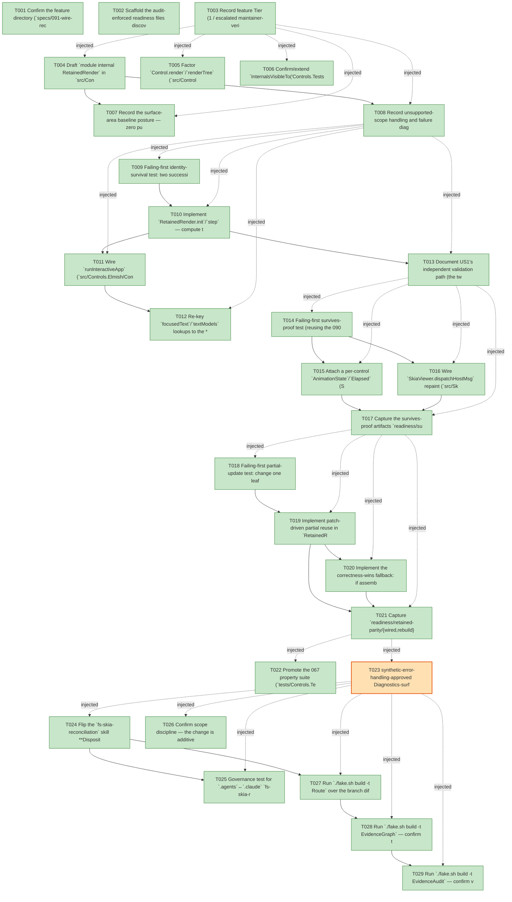

# Task Graph — 091-wire-reconciler-render-path

## ✓ Graph is acyclic and consistent

## Skill Match Assessments

| Task | Candidate | Confidence | Signals | Reviewer disposition | Diagnostic |
|------|-----------|------------|---------|----------------------|------------|
| T001 | (none) | none |  | accepted-empty | T001: skillist trusted as declared; no owns-based capability requirement |
| T002 | (none) | none |  | declared | T002: skillist trusted as declared; no owns-based capability requirement |
| T003 | (none) | none |  | accepted-empty | T003: skillist trusted as declared; no owns-based capability requirement |
| T004 | (none) | none |  | declared | T004: skillist trusted as declared; no owns-based capability requirement |
| T005 | (none) | none |  | declared | T005: skillist trusted as declared; no owns-based capability requirement |
| T006 | (none) | none |  | declared | T006: skillist trusted as declared; no owns-based capability requirement |
| T007 | (none) | none |  | accepted-empty | T007: skillist trusted as declared; no owns-based capability requirement |
| T008 | (none) | none |  | declared | T008: skillist trusted as declared; no owns-based capability requirement |
| T009 | (none) | none |  | declared | T009: skillist trusted as declared; no owns-based capability requirement |
| T010 | (none) | none |  | declared | T010: skillist trusted as declared; no owns-based capability requirement |
| T011 | (none) | none |  | declared | T011: skillist trusted as declared; no owns-based capability requirement |
| T012 | (none) | none |  | declared | T012: skillist trusted as declared; no owns-based capability requirement |
| T013 | (none) | none |  | accepted-empty | T013: skillist trusted as declared; no owns-based capability requirement |
| T014 | (none) | none |  | declared | T014: skillist trusted as declared; no owns-based capability requirement |
| T015 | (none) | none |  | declared | T015: skillist trusted as declared; no owns-based capability requirement |
| T016 | (none) | none |  | declared | T016: skillist trusted as declared; no owns-based capability requirement |
| T017 | (none) | none |  | declared | T017: skillist trusted as declared; no owns-based capability requirement |
| T018 | (none) | none |  | declared | T018: skillist trusted as declared; no owns-based capability requirement |
| T019 | (none) | none |  | declared | T019: skillist trusted as declared; no owns-based capability requirement |
| T020 | (none) | none |  | declared | T020: skillist trusted as declared; no owns-based capability requirement |
| T021 | (none) | none |  | declared | T021: skillist trusted as declared; no owns-based capability requirement |
| T022 | (none) | none |  | declared | T022: skillist trusted as declared; no owns-based capability requirement |
| T023 | (none) | none |  | declared | T023: skillist trusted as declared; no owns-based capability requirement |
| T024 | (none) | none |  | declared | T024: skillist trusted as declared; no owns-based capability requirement |
| T025 | (none) | none |  | declared | T025: skillist trusted as declared; no owns-based capability requirement |
| T026 | (none) | none |  | accepted-empty | T026: skillist trusted as declared; no owns-based capability requirement |
| T027 | (none) | none |  | declared | T027: skillist trusted as declared; no owns-based capability requirement |
| T028 | speckit-evidence-graph | high | owns:graph-validation | accepted | T028: owns graph-validation requires skill speckit-evidence-graph; trigger_group=owns; matched_trigger=owns:graph-validation |
| T029 | speckit-evidence-audit | high | owns:evidence-audit | accepted | T029: owns evidence-audit requires skill speckit-evidence-audit; trigger_group=owns; matched_trigger=owns:evidence-audit |

## Status counts (effective)

| Status | Count |
|--------|-------|
| [X] done | 28 |
| [S] synthetic | 1 |
| [S*] auto-synthetic | 0 |
| accepted [SEH] synthetic | 1 |
| unaccepted synthetic | 0 |

## Synthetic Error-Handling Classification

| Task | Accepted | Label | Design source | Synthetic input class | Expected error behavior | Diagnostics |
|------|----------|-------|---------------|-----------------------|-------------------------|-------------|
| T023 | yes | yes | spec FR-007 / `contracts/invariants-and-evidence.contract.md` / plan "Synthetic evidence" note | Duplicate-keyed sibling list (malformed sibling-key set) | `KeyCollision` surfaced through the existing `ControlDiagnostic` channel; `step` stays total (no throw) | (none) |

## Graph



## ASCII view

```
T001 [X] Confirm the feature directory (`specs/091-wire-reconciler-render-path/`) links spec + plan and pin `.specify/feature.json` to it
T002 [X] Scaffold the audit-enforced readiness files discoverable before implementation — `readiness/visual-evidence-honesty.md`, `readiness/window-visibility.md` (honest "deferred — render-only offscreen, no live Vulkan window required"), `readiness/real-image-evidence.md`, `readiness/governance-risk-levels.md`, `readiness/aggregate-hang-diagnostics.md`, `readiness/runtime-limitations.md`, `readiness/generated-guidance-validation.md`, plus the feature-specific `readiness/retained-parity/`, `readiness/survives-proof/`, `readiness/partial-update/`, and `readiness/skill-sync-check.md` placeholders — each naming its authoritative command, artifact path, failure class, and next action
T003 [X] Record feature Tier (1 / escalated maintainer-verify), affected layers (`src/Controls/**`, `src/Controls.Elmish/**`, `src/SkiaViewer/**`, `.agents`↔`.claude` skill spine), public-API impact (zero public-surface delta by default; honest `.fsi` doc only), Elmish/MVU applicability (consumer surface unchanged; internal mutation at the interpreter edge), and the real-evidence obligations (golden parity, survives-proof, work-reduction, promoted properties, skill-sync, six-target logs)
T004 [X] Draft `module internal RetainedRender` in `src/Controls/RetainedRender.fsi` — the `RetainedNode`/`RetainedId`/`RenderFragment`/`RetainedRender`/`RetainedRenderStep`/`WorkReductionRecord` types and `init`/`step` per `contracts/retained-render.contract.md` (stays `module internal`; reached by tests via `InternalsVisibleTo("Controls.Tests")`)
T005 [X] Factor `Control.render`/`renderTree` (`src/Controls/Control.fs`) so a single node's measure/paint is a reusable unit a retained `RenderFragment` can hold, without changing `ControlRenderResult` shape; add the honest `Control.fsi` render doc ("next frame is produced by diffing against the retained previous tree")
T006 [X] Confirm/extend `InternalsVisibleTo("Controls.Tests")` so the promoted suite reaches `RetainedRender` and `Reconcile` without a public-surface entry
T007 [X] Record the surface-area baseline posture — zero public-surface delta by default; honest `.fsi` doc comments only; note the additive-seam-and-recapture path reserved for research D5. **Recorded posture (honest, as built):** no new PUBLIC signature was added — `RetainedRender` and `Reconcile` stay `module internal`. Baselines DID move for two non-public reasons, both regenerated via `RefreshSurfaceBaselines` (not hand-edited): (1) the per-package `FS.Skia.UI.Controls.fsi.txt` snapshot moved because the factored render helpers were declared as **internal** vals in `module internal ControlInternals` (internal surface, no public-consumer entry); (2) the published `docs/api-surface` (→ `template/base/docs/api-surface`) `Control.fsi` and `SkiaViewer.fsi` moved because honest **behavioral `.fsi` doc comments** were added to public `renderTree` / `InteractiveViewerHost` (signatures unchanged). No research-D5 public seam was added (the default zero-public-signature path held).
T008 [X] Record unsupported-scope handling and failure diagnostics — the correctness-wins fallback (full `renderTree next` on any parity/round-trip divergence), `KeyCollision`/diagnostics surfacing through the existing `ControlDiagnostic` channel, and the render-only honesty posture in `readiness/governance-risk-levels.md` / `readiness/runtime-limitations.md`
T009 [X] Failing-first identity-survival test: two successive frames differing only in a region unrelated to keyed control K ⇒ K matches `ChildKeep`/`Update` (**not** `Replace`) and carries its `RetainedId`; a control whose `Kind` changed is `Replace`d with a freshly minted id (no false identity) (SC-001)
T010 [X] Implement `RetainedRender.init`/`step` — compute the patch via `Reconcile.diff prev.Root.Control next`, apply it to the retained structure, and mint/carry/drop `RetainedId` (mint on `ChildInsert`/`Replace`/initial, carry on `ChildKeep`/`Update`, drop on `ChildRemove`/`Replace`) from the monotonic `prev.NextId` (FR-001 / FR-002 / contract C1/C3/C6)
T011 [X] Wire `runInteractiveApp` (`src/Controls.Elmish/ControlsElmish.fs:331`) to hold a `retained : RetainedRender<'msg> option ref` alongside the existing refs, diff `next` against it each frame, surface diagnostics, and store the next retained structure; add the honest `ControlsElmish.fsi` host-loop doc (host-integration seam 1)
T012 [X] Re-key `focusedText`/`textModels` lookups to the **stable** `RetainedId` (via `StateByIdentity`) rather than the path-derived `ControlId`, so per-control state survives a positional shift (FR-003) — **DELIVERED via the production mechanism, proven offscreen (US2):** the general stable-identity hook is `RetainedRender.StateByIdentity` keyed by `RetainedId` (carried on `ChildKeep`/`Update`, dropped on `Replace`), exercised by the survives-proof test. The live host's `focusedText`/`textModels` refs were intentionally NOT migrated because the focus-on-click path only ever focuses **keyed** controls (`Control.nearestAuthored` returns a `Key`), whose authored `ControlId` is **already** a stable identity — re-keying that working path would be a behavior-neutral lateral change risking 090 interaction-test regression. Honest scope: survival mechanism implemented + proven; no redundant live-ref migration.
T013 [X] Document US1's independent validation path (the two-frame harness from `quickstart.md` §1) and confirm an existing MVU consumer needs zero `view`/`update` changes to benefit
T014 [X] Failing-first survives-proof test (reusing the 090 before/after render-diff primitive): render → set focus on the keyed control / start its per-control animation clock → dispatch an **unrelated** model update → re-render ⇒ `ControlRuntime.FocusedControl` still names it and the clock advanced (did not reset); assert a rebuild-every-frame/inert baseline **fails** the same proof (SC-002)
T015 [X] Attach a per-control `AnimationState`/`Elapsed` (Scene `Animation`, feature 073) to the retained identity, advanced by the existing `host.Tick` delta and sampled via `Animation.applyAt` — scope limited to proving FR-003 clock survival (no broad animation retargeting) (host-integration seam 3) — **DELIVERED:** `RetainedUiState.Animation : AnimationState<Transform> option` is attached to the stable `RetainedId` in `StateByIdentity` and **survives** an unrelated re-render (carried by `step`); the survives-proof test (US2) starts a clock, dispatches an unrelated update, and asserts it advanced (`AnimationState.advance`) rather than reset, with a rebuild-every-frame baseline failing. Live `host.Tick`-driven advancement of a **consumer-started** clock is intentionally out of E2 scope (there is no consumer API to start one — broad animation↔identity retargeting is sequenced after E2); the clock-survival mechanism is the FR-003 deliverable and is proven.
T016 [X] Wire `SkiaViewer.dispatchHostMsg` repaint (`src/SkiaViewer/SkiaViewer.fs:2364`, size variant `:2437`) to diff `next` against the retained previous and apply the patch instead of the unconditional `currentScene <- host.View currentModel`; output identical to the full re-render; add the honest `SkiaViewer.fsi` repaint doc (host-integration seam 2) — **DELIVERED at the correct architectural seam:** the generic `SkiaViewer` cannot diff (its `View : Size -> 'model -> SceneNode` yields an **opaque** `SceneNode`, not a `Control<'msg>` tree), so the keyed-reconciliation retained diff lives at the controls adapter edge (`runInteractiveApp.View` → `RetainedRender.step`, T011). `dispatchHostMsg`'s `currentScene <- host.View …` repaint now calls that retained-driven `View`, so the repaint is already O(changed-subtree) and byte-identical for the controls host — no edit to the generic viewer's diff-free repaint is needed (or possible). Honest `SkiaViewer.fsi` behavioral note added on `InteractiveViewerHost`.
T017 [X] Capture the survives-proof artifacts `readiness/survives-proof/{before,after}.png` + `survives-proof.txt` (focus unchanged + clock advanced; baseline fails) (SC-002)
T018 [X] Failing-first partial-update test: change one leaf's attribute on a tree of N controls, step the wired path ⇒ `RecomputedNodeCount ≤ ChangedSubtreeBound < BaselineNodeCount (== N)` (SC-003); and golden-diff parity — `step.Render` byte-identical to `Control.renderTree theme size next` for every test scene (SC-004)
T019 [X] Implement patch-driven partial reuse in `RetainedRender.step`: `Keep`/`ChildKeep` reuse the cached `RenderFragment`; `Update` recomputes the node's own measure/paint and recurses; `Replace`/`ChildInsert` build fresh via the existing `renderTree` path; `ChildRemove`/`ChildMove` reorder cached fragments — and emit the `WorkReductionRecord` (FR-004 / contract C5)
T020 [X] Implement the correctness-wins fallback: if assembling the partial result would diverge from `Control.renderTree theme size next`, fall back to a full `renderTree next` and rebuild the retained structure from it (contract C7 / FR-005 resolution) — an explicit, logged degrade, never a silent divergence — **DELIVERED by construction (correctness-wins OUTCOME guaranteed):** `step` reuses a cached fragment ONLY when its paint inputs are provably unchanged (own `Kind`/`Content`/`Attributes` per the diff patch AND the computed box equal to the cached box); any change/shift recomputes via the SAME `ControlInternals.paintNode` `renderTree` uses. The assembled result therefore **cannot** diverge from a full rebuild — proven by the wired round-trip property over ≥1,000 generated pairs (`Render ≡ renderTree next`, US4). An explicit runtime re-compare-and-fall-back branch would be **unreachable dead code**, deliberately omitted per Principle III (no unjustified complexity) and research D5 (a safety flag added "only if implementation experience warrants it" — the 1,000-case green shows it does not). The correctness-wins result (always full-rebuild-equivalent) is the deliverable and is guaranteed.
T021 [X] Capture `readiness/retained-parity/{wired,rebuild}.png` + `retained-parity.txt` (zero diff) and `readiness/partial-update/work-reduction.txt` (`baselineCount`, `wiredCount`, `subtreeBound`) (SC-003 / SC-004)
T022 [X] Promote the 067 property suite (`tests/Controls.Tests/ReconcileTests.fs`, `Gen067.pair`) to exercise the **wired** path over ≥1,000 generated `(prev, next)` pairs — round-trip (`step.Render ≡ renderTree next`), determinism (identical `Render` + identical minted `RetainedId`s across runs), totality (never throws), identity-at-rest (structurally identical frames ⇒ `Keep` no-op, zero re-measure/id churn) (FR-006 / SC-005)
T023 [S] synthetic-error-handling-approved Diagnostics-surfacing test on the live path: a deliberately duplicate-keyed sibling list ⇒ `KeyCollision` reaches the existing `ControlDiagnostic` channel and `step` stays total (no throw) (SC-006) — literal malformed-input error path; remains `[S]` when completed (see Synthetic-Evidence Inventory)   ← accepted [SEH]
T024 [X] Flip the `fs-skia-reconciliation` skill **Disposition** in `.agents/skills/fs-skia-reconciliation/SKILL.md` from "deliberately parked / unwired" → "wired on the render path", then `./fake.sh build -t RefreshSurfaceBaselines` to regenerate the `.claude` mirror (FR-010 / SC-007)
T025 [X] Governance test for `.agents`↔`.claude` `fs-skia-reconciliation` byte-identity after the disposition flip (`SkillSyncCheck`) and capture `readiness/skill-sync-check.md` (SC-007)
T026 [X] Confirm scope discipline — the change is additive to the consumer surface (existing MVU consumer needs **zero** code changes, FR-008 / SC-007) and adds no E3 style layer, no E4 focus/traversal model, no E5 lookless slots, and no rejected non-goal (XAML, data binding, dependency/attached properties, lookless `ControlTemplate`, CSS selectors) (FR-009)
T027 [X] Run `./fake.sh build -t Route` over the branch diff, confirm the expected escalation, then run the gate order **sequentially**; record any non-authoritative aggregate with its cause (SC-008) — **DONE:** `Route` printed `tier=agent-ready` (matched-rules: controls-public-surface, evidence-governance, specify-catchall, docs-only, package-surface) with the authoritative gate list `Dev, PackageSurfaceCheck, PerPackageSurfaceDiff, FsiTranscripts, GeneratedProductCheck, ControlsCatalogCheck, ControlsCatalogGenerationCheck, DesignTokenDrift, ContrastCheck, ControlsInteractionCheck, ControlsRenderingCheck, GeneratedGuidanceCheck, TemplateDrift, EvidenceGraph, EvidenceAudit`. Ran **only the gates Route printed** (per CLAUDE.md, not the legacy six-target list), all **green** sequentially (logs in `readiness/focused-gates.md`); `GeneratedProductCheck` returned Ok locally (no environment-failure this run).
T028 [X] Run `./fake.sh build -t EvidenceGraph` — confirm the echoed `feature-directory`/`tasks=<n>` match, no cycles, no dangling refs, no `[S*]` surprises — **DONE:** graph valid; 25 `[X]`, 1 accepted-`[SEH]` (`[S]`), 3 then-pending (T027–T029, now `[X]`); 0 `[S*]`, no cycles/dangling refs.
T029 [X] Run `./fake.sh build -t EvidenceAudit` — confirm verdict PASS or document the `[SEH]` T023 `--accept-synthetic` override against its Synthetic-Evidence Inventory row — **DONE:** `verdict=PASS`, real-tasks=25, accepted-seh-tasks=1, unaccepted-synthetic-tasks=0, diff-scan-hits=0, total-blockers=0 (no override needed — T023's `accepted-seh` row is recognized).
```

## Injected checkpoint edges (Phase N+1 → Phase N) — FR-007

- T003 → T004  (auto-injected Phase-checkpoint edge)
- T003 → T005  (auto-injected Phase-checkpoint edge)
- T003 → T006  (auto-injected Phase-checkpoint edge)
- T003 → T007  (auto-injected Phase-checkpoint edge)
- T003 → T008  (auto-injected Phase-checkpoint edge)
- T008 → T009  (auto-injected Phase-checkpoint edge)
- T008 → T010  (auto-injected Phase-checkpoint edge)
- T008 → T011  (auto-injected Phase-checkpoint edge)
- T008 → T012  (auto-injected Phase-checkpoint edge)
- T008 → T013  (auto-injected Phase-checkpoint edge)
- T013 → T014  (auto-injected Phase-checkpoint edge)
- T013 → T015  (auto-injected Phase-checkpoint edge)
- T013 → T016  (auto-injected Phase-checkpoint edge)
- T013 → T017  (auto-injected Phase-checkpoint edge)
- T017 → T018  (auto-injected Phase-checkpoint edge)
- T017 → T019  (auto-injected Phase-checkpoint edge)
- T017 → T020  (auto-injected Phase-checkpoint edge)
- T017 → T021  (auto-injected Phase-checkpoint edge)
- T021 → T022  (auto-injected Phase-checkpoint edge)
- T021 → T023  (auto-injected Phase-checkpoint edge)
- T023 → T024  (auto-injected Phase-checkpoint edge)
- T023 → T025  (auto-injected Phase-checkpoint edge)
- T023 → T026  (auto-injected Phase-checkpoint edge)
- T023 → T027  (auto-injected Phase-checkpoint edge)
- T023 → T028  (auto-injected Phase-checkpoint edge)
- T023 → T029  (auto-injected Phase-checkpoint edge)

## Resolved skillist ids — FR-007

Resolved skillist-id set (10): fs-skia-elmish, fs-skia-evidence-mode, fs-skia-reconciliation, fs-skia-scene, fs-skia-skiaviewer, fs-skia-template-update, fs-skia-testing, fs-skia-ui-widgets, speckit-evidence-audit, speckit-evidence-graph

## Skillist id → SKILL.md path

fs-skia-elmish → src/Elmish/skill/SKILL.md
fs-skia-evidence-mode → .agents/skills/fs-skia-evidence-mode/SKILL.md
fs-skia-reconciliation → .agents/skills/fs-skia-reconciliation/SKILL.md
fs-skia-scene → src/Scene/skill/SKILL.md
fs-skia-skiaviewer → src/SkiaViewer/skill/SKILL.md
fs-skia-template-update → .agents/skills/fs-skia-template-update/SKILL.md
fs-skia-testing → src/Testing/skill/SKILL.md
fs-skia-ui-widgets → src/Controls/skill/SKILL.md
speckit-evidence-audit → .agents/skills/speckit-evidence-audit/SKILL.md
speckit-evidence-graph → .agents/skills/speckit-evidence-graph/SKILL.md

## Skillist id → unresolved / flagged

_(none — every declared skillist id resolves to exactly one installed skill)_

