# Task Graph — 092-wire-retained-identity-state

## ✓ Graph is acyclic and consistent

## Skill Match Assessments

| Task | Candidate | Confidence | Signals | Reviewer disposition | Diagnostic |
|------|-----------|------------|---------|----------------------|------------|
| T001 | (none) | none |  | accepted-empty | T001: skillist trusted as declared; no owns-based capability requirement |
| T002 | (none) | none |  | declared | T002: skillist trusted as declared; no owns-based capability requirement |
| T003 | (none) | none |  | accepted-empty | T003: skillist trusted as declared; no owns-based capability requirement |
| T004 | (none) | none |  | declared | T004: skillist trusted as declared; no owns-based capability requirement |
| T005 | (none) | none |  | declared | T005: skillist trusted as declared; no owns-based capability requirement |
| T006 | (none) | none |  | declared | T006: skillist trusted as declared; no owns-based capability requirement |
| T007 | (none) | none |  | declared | T007: skillist trusted as declared; no owns-based capability requirement |
| T008 | (none) | none |  | declared | T008: skillist trusted as declared; no owns-based capability requirement |
| T009 | (none) | none |  | declared | T009: skillist trusted as declared; no owns-based capability requirement |
| T010 | (none) | none |  | declared | T010: skillist trusted as declared; no owns-based capability requirement |
| T011 | (none) | none |  | declared | T011: skillist trusted as declared; no owns-based capability requirement |
| T012 | (none) | none |  | declared | T012: skillist trusted as declared; no owns-based capability requirement |
| T013 | (none) | none |  | declared | T013: skillist trusted as declared; no owns-based capability requirement |
| T014 | (none) | none |  | declared | T014: skillist trusted as declared; no owns-based capability requirement |
| T015 | (none) | none |  | declared | T015: skillist trusted as declared; no owns-based capability requirement |
| T016 | (none) | none |  | declared | T016: skillist trusted as declared; no owns-based capability requirement |
| T017 | (none) | none |  | declared | T017: skillist trusted as declared; no owns-based capability requirement |
| T018 | (none) | none |  | declared | T018: skillist trusted as declared; no owns-based capability requirement |
| T019 | (none) | none |  | declared | T019: skillist trusted as declared; no owns-based capability requirement |
| T020 | (none) | none |  | declared | T020: skillist trusted as declared; no owns-based capability requirement |
| T021 | (none) | none |  | declared | T021: skillist trusted as declared; no owns-based capability requirement |
| T022 | (none) | none |  | declared | T022: skillist trusted as declared; no owns-based capability requirement |
| T023 | (none) | none |  | declared | T023: skillist trusted as declared; no owns-based capability requirement |
| T024 | (none) | none |  | declared | T024: skillist trusted as declared; no owns-based capability requirement |
| T025 | (none) | none |  | declared | T025: skillist trusted as declared; no owns-based capability requirement |
| T026 | (none) | none |  | declared | T026: skillist trusted as declared; no owns-based capability requirement |
| T027 | (none) | none |  | declared | T027: skillist trusted as declared; no owns-based capability requirement |
| T028 | (none) | none |  | declared | T028: skillist trusted as declared; no owns-based capability requirement |
| T029 | speckit-evidence-graph | high | owns:graph-validation | accepted | T029: owns graph-validation requires skill speckit-evidence-graph; trigger_group=owns; matched_trigger=owns:graph-validation |
| T030 | speckit-evidence-audit | high | owns:evidence-audit | accepted | T030: owns evidence-audit requires skill speckit-evidence-audit; trigger_group=owns; matched_trigger=owns:evidence-audit |

## Status counts (effective)

| Status | Count |
|--------|-------|
| [X] done | 29 |
| [S] synthetic | 1 |
| [S*] auto-synthetic | 0 |
| accepted [SEH] synthetic | 1 |
| unaccepted synthetic | 0 |

## Synthetic Error-Handling Classification

| Task | Accepted | Label | Design source | Synthetic input class | Expected error behavior | Diagnostics |
|------|----------|-------|---------------|-----------------------|-------------------------|-------------|
| T022 | yes | yes | spec FR-009 / SC-005; plan.md "Synthetic evidence" (mirrors 091 KeyCollision `[SEH]`) | Malformed duplicate-keyed sibling literal tree (first frame) | `KeyCollision` surfaced once via `ControlDiagnostic`; `init`/`step` stays total (no throw) | (none) |

## Graph

```mermaid
graph TD
  T001["T001 Confirm the feature directory (`specs/092-wire-ret"]:::done
  T002["T002 Scaffold the audit-enforced readiness files discov"]:::done
  T003["T003 Record feature Tier (1 / contracted), affected lay"]:::done
  T004["T004 Draft the internal `RetainedRender.fsi` deltas (`s"]:::done
  T005["T005 Draft the `SkiaViewer.fsi` public seam widening (`"]:::done
  T006["T006 Draft the `ControlsElmish.fsi` package-surface foc"]:::done
  T007["T007 Record the surface-baseline posture (`SkiaViewer` "]:::done
  T008["T008 Failing-first **live-survival** test driving the *"]:::done
  T009["T009 Failing-first carry/drop test: when `step` matches"]:::done
  T010["T010 Make `RetainedRender.step` (`src/Controls/Retained"]:::done
  T011["T011 Re-key the `ControlsElmish` interpreter-edge closu"]:::done
  T012["T012 Capture `readiness/live-survival/` — `survival.txt"]:::done
  T013["T013 Failing-first **focus-resolution** test: click-to-"]:::done
  T014["T014 Implement `RetainedRender.retainedHitTest` (`src/C"]:::done
  T015["T015 Wire focus acquisition in `ControlsElmish` to `res"]:::done
  T016["T016 Widen the host `mapKey` closure and `InteractiveVi"]:::done
  T017["T017 Capture `readiness/focus-resolution/` — `focus-res"]:::done
  T018["T018 Failing-first **work-reduction** test exercising a"]:::done
  T019["T019 Add `ShiftedNodeCount` to `WorkReductionRecord` (`"]:::done
  T020["T020 Capture `readiness/work-reduction/work-reduction.t"]:::done
  T021["T021 Failing-first hygiene tests: (a) two consecutive f"]:::done
  T022["T022 synthetic-error-handling-approved Frame-0 duplicat"]:::synthetic
  T023["T023 Fold `Theme` into `RetainedRender<'msg>` and into "]:::done
  T024["T024 Change `RetainedRender.init` to measure/paint the "]:::done
  T025["T025 Capture `readiness/theme-reuse/theme-reuse.txt` (f"]:::done
  T026["T026 Confirm all four 067/091 invariants (totality, det"]:::done
  T027["T027 Recapture surface baselines — per-package for `FS."]:::done
  T028["T028 Run `./fake.sh build -t Route` over the branch dif"]:::done
  T029["T029 Run `./fake.sh build -t EvidenceGraph` — confirm t"]:::done
  T030["T030 Run `./fake.sh build -t EvidenceAudit` — confirm v"]:::done
  T003 -. injected .-> T004
  T003 -. injected .-> T005
  T003 -. injected .-> T006
  T004 --> T007
  T005 --> T007
  T006 --> T007
  T003 -. injected .-> T007
  T007 -. injected .-> T008
  T007 -. injected .-> T009
  T008 --> T010
  T009 --> T010
  T007 -. injected .-> T010
  T010 --> T011
  T007 -. injected .-> T011
  T011 --> T012
  T007 -. injected .-> T012
  T012 -. injected .-> T013
  T013 --> T014
  T012 -. injected .-> T014
  T014 --> T015
  T012 -. injected .-> T015
  T015 --> T016
  T012 -. injected .-> T016
  T015 --> T017
  T016 --> T017
  T012 -. injected .-> T017
  T017 -. injected .-> T018
  T018 --> T019
  T017 -. injected .-> T019
  T019 --> T020
  T017 -. injected .-> T020
  T020 -. injected .-> T021
  T020 -. injected .-> T022
  T021 --> T023
  T020 -. injected .-> T023
  T022 --> T024
  T020 -. injected .-> T024
  T023 --> T025
  T024 --> T025
  T020 -. injected .-> T025
  T025 -. injected .-> T026
  T026 -. injected .-> T027
  T027 --> T028
  T026 -. injected .-> T028
  T028 --> T029
  T026 -. injected .-> T029
  T029 --> T030
  T026 -. injected .-> T030
  classDef pending fill:#eeeeee,stroke:#999
  classDef done fill:#c8e6c9,stroke:#2e7d32
  classDef synthetic fill:#ffe0b2,stroke:#e65100,stroke-width:2px
  classDef autoSynthetic fill:#ffab91,stroke:#bf360c,stroke-width:2px,stroke-dasharray:5 3
  classDef failed fill:#ffcdd2,stroke:#b71c1c,stroke-width:2px
  classDef skipped fill:#f5f5f5,stroke:#666,stroke-dasharray:3 3
```



## ASCII view

```
T001 [X] Confirm the feature directory (`specs/092-wire-retained-identity-state/`) links spec + plan and that `.specify/feature.json` pins to it
T002 [X] Scaffold the audit-enforced readiness files discoverable before implementation — `readiness/visual-evidence-honesty.md`, `readiness/window-visibility.md` (honest "deferred — render-only offscreen, no live Vulkan window required"), `readiness/real-image-evidence.md`, `readiness/governance-risk-levels.md`, `readiness/aggregate-hang-diagnostics.md`, `readiness/runtime-limitations.md`, `readiness/generated-guidance-validation.md`, plus the feature-specific `readiness/live-survival/`, `readiness/focus-resolution/`, `readiness/work-reduction/`, `readiness/theme-reuse/`, and `readiness/multi-frame/` placeholders — each naming its authoritative command, artifact path, failure class, and next action
T003 [X] Record feature Tier (1 / contracted), affected layers (`src/Controls/RetainedRender.fs`, `src/Controls.Elmish/ControlsElmish.fs`, `src/SkiaViewer/SkiaViewer.fs`), public-API impact (`MapKey` widening + `ControlsElmish` focus seam re-key + internal `RetainedRender` work-reduction/theme/first-frame), Elmish/MVU applicability (consumer `view`/`update` unchanged; interpreter-edge focus/text/clock state re-keyed `ControlId`→`RetainedId`), and the real-evidence obligations (live-survival through the real seam, focus-resolution, work-reduction, theme-reuse, multi-frame, surface-baseline diffs)
T004 [X] Draft the internal `RetainedRender.fsi` deltas (`src/Controls/RetainedRender.fsi`, stays `module internal`) per `contracts/contracts.md` §1 — `WorkReductionRecord` gains `ShiftedNodeCount`; `RetainedRender<'msg>` gains `Theme`; add `RetainedInit<'msg>` (init returns retained + render + first-frame diagnostics); `init` return type changes; add `retainedHitTest: x -> y -> RetainedRender<'msg> -> RetainedId option`; correct the work-reduction doc to `RecomputedNodeCount = ChangedSubtreeBound + ShiftedNodeCount < BaselineNodeCount`
T005 [X] Draft the `SkiaViewer.fsi` public seam widening (`src/SkiaViewer/SkiaViewer.fsi`) per `contracts/contracts.md` §2 — `InteractiveViewerHost.MapKey : ViewerKey -> bool -> 'msg list` (was `'msg option`; `[]` = unhandled, non-empty dispatches every message in order); **enumerate every `ViewerKey -> bool -> 'msg option` field across the viewer host records and either widen each identically or record in this task note that no sibling field exists** (resolve the widening scope at contract time, not later); author the compatibility/migration note (`Some m → [ m ]`, `None → []`) for the public release notes
T006 [X] Draft the `ControlsElmish.fsi` package-surface focus-routing seam (`src/Controls.Elmish/ControlsElmish.fsi`) per `contracts/contracts.md` §3 — `resolveFocus: retained -> x -> y -> RetainedId option` (replaces the `ControlId` `hitTest |> nearestAuthored` path) and `routeFocusedText: retained -> focused:RetainedId option -> TextInputMsg -> RetainedRender<'msg> * 'msg list` (seeds from value + line mode on first focus, returns ALL matched `onChanged` messages); note the 090 `ControlId`-keyed `routeFocusedText` is **replaced** (breaking within the package surface, covered by the recaptured baseline + migration note)
T007 [X] Record the surface-baseline posture (`SkiaViewer` + `Controls.Elmish` public per-package + cross-package baselines move; `Controls` internal per-package baseline moves; all regenerated via `RefreshSurfaceBaselines` / `PerPackageSurface`, never hand-edited) and the unsupported-scope handling — correctness-wins fallback (output byte-identical to a full rebuild; FR-007 measurement never alters the scene), frame-0 `KeyCollision` surfacing through the existing `ControlDiagnostic` channel, render-only honesty — in `readiness/governance-risk-levels.md` / `readiness/runtime-limitations.md`
T008 [X] Failing-first **live-survival** test driving the **real adapter seam** (no manual `StateByIdentity` seeding): focus the editor → keystroke `x` (`draft="hix"`) → an unrelated insert shifts the editor down → keystroke `y` ⇒ focus is still on the editor and `draft="hixy"` (continued, not reset), **and the editor's per-control animation clock (`RetainedUiState.Animation`) is the carried value, not a freshly-reset clock** (FR-001 clock element); assert a rebuild-every-frame baseline (re-`init` each frame, minting a fresh id) **fails** the same proof for focus, draft, and clock (SC-001, quickstart steps 1–5 + baseline)
T009 [X] Failing-first carry/drop test: when `step` matches a control across a shift (`ChildKeep`/`Update`, not `Replace`), its `StateByIdentity` entry is carried to the matched `RetainedId`; when the diff `Replace`s (kind/key change) or removes it, the prior entry is dropped — no false identity carry; a focused control removed entirely clears focus (FR-003 + edge case)
T010 [X] Make `RetainedRender.step` (`src/Controls/RetainedRender.fs`) **populate and read** `StateByIdentity`: carry each matched node's `RetainedUiState` to its carried `RetainedId`, drop on `Replace`/remove, filter entries whose identity left the live set (FR-001/FR-002/FR-003) — 091 carried the map but the host never consumed it; this closes that half
T011 [X] Re-key the `ControlsElmish` interpreter-edge closure (`src/Controls.Elmish/ControlsElmish.fs`): `focusedText` ref `ControlId option → RetainedId option`; remove the separate `textModels : Map<ControlId, TextInputModel>` (state now lives in `RetainedRender.StateByIdentity[id].Text`); the carried draft is authoritative while a control is focused, and the model value re-seeds the draft **only on initial focus acquisition** (not every re-render), so a same-frame model change never overwrites in-progress typing (FR-001/FR-002 + the FR-005-vs-draft conflict resolution)
T012 [X] Capture `readiness/live-survival/` — `survival.txt` (focus + draft text + per-control animation clock survive the shift through the live seam) and `baseline-fails.txt` (rebuild-every-frame loses all three under the identical sequence), authoritative as structural `Scene`/identity equality; document US1's independent validation path (quickstart §) and confirm an existing MVU consumer needs zero `view`/`update` changes to benefit (SC-001)
T013 [X] Failing-first **focus-resolution** test: click-to-focus resolves to the correct control for a directly-keyed field, an unkeyed field, and an unkeyed field nested under a keyed container; two unkeyed same-kind siblings resolve to **distinct** `RetainedId`s (independently focusable, no shared-id collapse); in a **pre-filled multi-line** field the first keystroke yields prior value + the new character (zero characters lost); a control with more than one change binding dispatches **every** matching binding (SC-002, FR-004/FR-005/FR-006)
T014 [X] Implement `RetainedRender.retainedHitTest` (`src/Controls/RetainedRender.fs`): return the deepest retained node whose `Fragment.Box` contains the point, else `None` (true gap / outside root); per-node distinct so unkeyed same-kind siblings resolve to different ids — one identity scheme shared between hit-testing and focus resolution (FR-004)
T015 [X] Wire focus acquisition in `ControlsElmish` to `resolveFocus`/`retainedHitTest` (replacing the `ControlId` `hitTest |> nearestAuthored` path) and seed the focused control's `TextInput` from its **current value** + **kind-derived line mode** (single vs multi-line) on first focus, so the first keystroke appends rather than discards; fix the 090 `TextInput.init` value-discard / hardcoded-`SingleLine` defects on this path (FR-004/FR-005)
T016 [X] Widen the host `mapKey` closure and `InteractiveViewerHost.MapKey` to `'msg list` and dispatch **all** matched `onChanged` product messages in order (replacing the 090 `mapKey |> List.tryHead` first-only path) (FR-006)
T017 [X] Capture `readiness/focus-resolution/` — `focus-resolution.txt` (keyed / unkeyed / keyed-container-wrapped each resolve to a distinct id) and `prefilled-append.txt` (pre-filled multi-line first keystroke appends), structural-equality authoritative (SC-002)
T018 [X] Failing-first **work-reduction** test exercising a **sibling-shifting** change (insert a sibling above a fixed-size leaf): assert `RecomputedNodeCount = ChangedSubtreeBound + ShiftedNodeCount` and `RecomputedNodeCount < BaselineNodeCount` — the prior 091 suite only covered the no-geometry-shift case that the 091 `RecomputedNodeCount ≤ ChangedSubtreeBound` doc could not survive (SC-003)
T019 [X] Add `ShiftedNodeCount` to `WorkReductionRecord` (`src/Controls/RetainedRender.fs`), counting nodes recomputed **only** because an upstream change relaid them out, distinct from `ChangedSubtreeBound` (now genuinely-changed work only); bring the `.fsi` doc into agreement (`changed + shifted` relationship, FR-007). Adding the counters MUST NOT alter the produced render output (FR-010 wins if forced)
T020 [X] Capture `readiness/work-reduction/work-reduction.txt` (`BaselineNodeCount`, `RecomputedNodeCount`, `ChangedSubtreeBound`, `ShiftedNodeCount` under the sibling-shifting change satisfying the documented relationship) (SC-003)
T021 [X] Failing-first hygiene tests: (a) two consecutive frames with **different themes** ⇒ the second frame's output is byte-identical to a full rebuild under the new theme, with no fragment painted under the old theme reused (SC-006); (b) the **first frame** measures/paints its node set exactly **once**, not twice (SC-005)
T022 [S] synthetic-error-handling-approved Frame-0 duplicate-key diagnostic test: a tree with **duplicate sibling keys from its first appearance** ⇒ the `KeyCollision` diagnostic is surfaced on that first frame (de-duped to once per standing collision) through the `ControlDiagnostic` channel, and the path stays total (no throw) (SC-005) — deliberately-malformed duplicate-keyed literal tree is the only synthetic element; the diagnostic is produced by the real wired path (mirrors 091's KeyCollision `[SEH]`); remains `[S]` when completed (see Synthetic-Evidence Inventory)   ← accepted [SEH]
T023 [X] Fold `Theme` into `RetainedRender<'msg>` and into the fragment reuse decision in `step` (`src/Controls/RetainedRender.fs`): a fragment painted under one theme is **not** reused unchanged under a different theme — a theme change invalidates the affected fragments and they repaint; the path no longer relies on a constant-per-host-loop theme precondition (FR-008/SC-006)
T024 [X] Change `RetainedRender.init` to measure/paint the first frame **once** and return first-frame `Diagnostics` (duplicate-key `KeyCollision` detected on the first tree) via `RetainedInit<'msg>`; surface those diagnostics through the `ControlsElmish` adapter's existing de-dup `Set` and paint the returned scene once (no frame-0 double render, no deferred collision) (FR-009/SC-005)
T025 [X] Capture `readiness/theme-reuse/theme-reuse.txt` (frame-1 byte-identity to a full rebuild under the new theme) and `readiness/multi-frame/first-frame.txt` (single first-frame paint + frame-0 `KeyCollision` surfaced once) (SC-005/SC-006)
T026 [X] Confirm all four 067/091 invariants (totality, determinism, identity-at-rest, round-trip) still hold on the wired path (SC-007); assert wired round-trip byte-identity (`step.Render.Scene ≡ Control.renderTree theme size next`) over **≥1,000** generated `(prev, next)` frame pairs **and** across a chained sequence of **3 or more** consecutive frames (multi-frame reconciliation, not only a single transition); capture `readiness/multi-frame/round-trip.txt` (SC-004/SC-007)
T027 [X] Recapture surface baselines — per-package for `FS.Skia.UI.SkiaViewer` and `FS.Skia.UI.Controls.Elmish` (public deltas) and `FS.Skia.UI.Controls` (internal `.fsi`, no public delta), plus the cross-package baseline (`MapKey` + `ControlsElmish` seam), via `RefreshSurfaceBaselines` / `PerPackageSurface.captureCurrent` (never hand-edited); add the `MapKey` widening compatibility/migration note to the public docs/release notes — **DONE:** `RefreshSurfaceBaselines` regenerated 11 per-package baselines (Controls/Controls.Elmish/SkiaViewer moved); emitted `template/base/docs/api-surface/SkiaViewer/SkiaViewer.fsi` updated; `PackageSurfaceCheck` + `PerPackageSurfaceDiff` PASS; migration note in `contracts/contracts.md` §2 + `governance-risk-levels.md`.
T028 [X] Run `./fake.sh build -t Route` over the branch diff, confirm the expected escalation (public `.fsi` deltas → consumer-contract tier), then run the gate order **sequentially** (`Dev → GeneratedGuidanceCheck → TemplateCheck → GeneratedProductCheck`); record any non-authoritative aggregate (e.g. a `GeneratedProductCheck` environment failure) with its cause in `readiness/runtime-limitations.md` — **DONE:** `Route` escalated to `agent-ready`; all printed gates PASS — `Dev`, `PackageSurfaceCheck`, `PerPackageSurfaceDiff`, `FsiTranscripts`, `GeneratedProductCheck` (full template instantiate + consumer validation + smoke, no env failure this run), `ControlsCatalogCheck`, `ControlsCatalogGenerationCheck`, `DesignTokenDrift`, `ContrastCheck`, `ControlsInteractionCheck`, `ControlsRenderingCheck`, `GeneratedGuidanceCheck`, `TemplateDrift`.
T029 [X] Run `./fake.sh build -t EvidenceGraph` — confirm the echoed `feature-directory`/`tasks=<n>` match this feature, no cycles, no dangling refs, no `[S*]` surprises — **DONE:** graph valid; 27 `[X]`, 1 accepted-`[SEH]` (`[S]` T022), 0 `[S*]` (accepted-seh stopped the cascade to T024/T025), no cycles/dangling refs.
T030 [X] Run `./fake.sh build -t EvidenceAudit` — confirm verdict PASS, or document the `[SEH]` T022 `accepted-seh` row against its Synthetic-Evidence Inventory entry — **DONE:** `verdict=PASS`, real-tasks=27, accepted-seh-tasks=1, unaccepted-synthetic-tasks=0, auto-synthetic-tasks=0, diff-scan-hits=0, window-visibility-hits=0, total-blockers=0 (T022's `accepted-seh` row recognized; no override needed).
```

## Injected checkpoint edges (Phase N+1 → Phase N) — FR-007

- T003 → T004  (auto-injected Phase-checkpoint edge)
- T003 → T005  (auto-injected Phase-checkpoint edge)
- T003 → T006  (auto-injected Phase-checkpoint edge)
- T003 → T007  (auto-injected Phase-checkpoint edge)
- T007 → T008  (auto-injected Phase-checkpoint edge)
- T007 → T009  (auto-injected Phase-checkpoint edge)
- T007 → T010  (auto-injected Phase-checkpoint edge)
- T007 → T011  (auto-injected Phase-checkpoint edge)
- T007 → T012  (auto-injected Phase-checkpoint edge)
- T012 → T013  (auto-injected Phase-checkpoint edge)
- T012 → T014  (auto-injected Phase-checkpoint edge)
- T012 → T015  (auto-injected Phase-checkpoint edge)
- T012 → T016  (auto-injected Phase-checkpoint edge)
- T012 → T017  (auto-injected Phase-checkpoint edge)
- T017 → T018  (auto-injected Phase-checkpoint edge)
- T017 → T019  (auto-injected Phase-checkpoint edge)
- T017 → T020  (auto-injected Phase-checkpoint edge)
- T020 → T021  (auto-injected Phase-checkpoint edge)
- T020 → T022  (auto-injected Phase-checkpoint edge)
- T020 → T023  (auto-injected Phase-checkpoint edge)
- T020 → T024  (auto-injected Phase-checkpoint edge)
- T020 → T025  (auto-injected Phase-checkpoint edge)
- T025 → T026  (auto-injected Phase-checkpoint edge)
- T026 → T027  (auto-injected Phase-checkpoint edge)
- T026 → T028  (auto-injected Phase-checkpoint edge)
- T026 → T029  (auto-injected Phase-checkpoint edge)
- T026 → T030  (auto-injected Phase-checkpoint edge)

## Resolved skillist ids — FR-007

Resolved skillist-id set (9): fs-skia-elmish, fs-skia-evidence-mode, fs-skia-keyboard-input, fs-skia-reconciliation, fs-skia-skiaviewer, fs-skia-testing, fsharp-build-orchestration, speckit-evidence-audit, speckit-evidence-graph

## Skillist id → SKILL.md path

fs-skia-elmish → src/Elmish/skill/SKILL.md
fs-skia-evidence-mode → .agents/skills/fs-skia-evidence-mode/SKILL.md
fs-skia-keyboard-input → src/KeyboardInput/skill/SKILL.md
fs-skia-reconciliation → .agents/skills/fs-skia-reconciliation/SKILL.md
fs-skia-skiaviewer → src/SkiaViewer/skill/SKILL.md
fs-skia-testing → src/Testing/skill/SKILL.md
fsharp-build-orchestration → .agents/skills/fsharp-build-orchestration/SKILL.md
speckit-evidence-audit → .agents/skills/speckit-evidence-audit/SKILL.md
speckit-evidence-graph → .agents/skills/speckit-evidence-graph/SKILL.md

## Skillist id → unresolved / flagged

_(none — every declared skillist id resolves to exactly one installed skill)_

