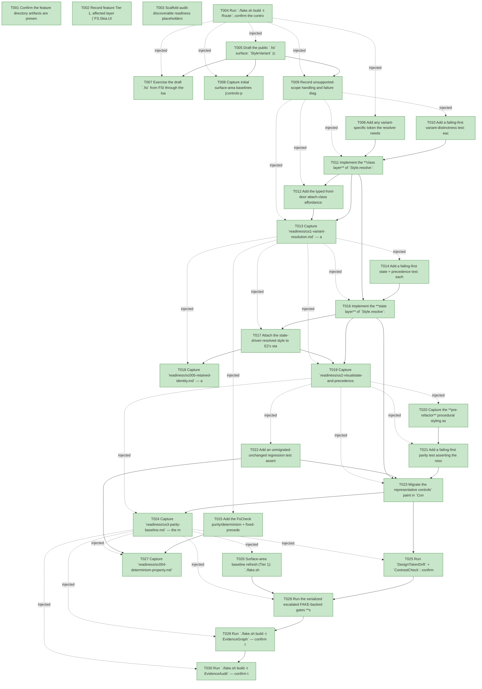

# Task Graph — 093-visual-state-style-layer

## ✓ Graph is acyclic and consistent

## Skill Match Assessments

| Task | Candidate | Confidence | Signals | Reviewer disposition | Diagnostic |
|------|-----------|------------|---------|----------------------|------------|
| T001 | (none) | none |  | accepted-empty | T001: skillist trusted as declared; no owns-based capability requirement |
| T002 | (none) | none |  | accepted-empty | T002: skillist trusted as declared; no owns-based capability requirement |
| T003 | (none) | none |  | accepted-empty | T003: skillist trusted as declared; no owns-based capability requirement |
| T004 | (none) | none |  | accepted-empty | T004: skillist trusted as declared; no owns-based capability requirement |
| T005 | (none) | none |  | accepted-empty | T005: skillist trusted as declared; no owns-based capability requirement |
| T006 | (none) | none |  | declared | T006: skillist trusted as declared; no owns-based capability requirement |
| T007 | (none) | none |  | declared | T007: skillist trusted as declared; no owns-based capability requirement |
| T008 | (none) | none |  | declared | T008: skillist trusted as declared; no owns-based capability requirement |
| T009 | (none) | none |  | accepted-empty | T009: skillist trusted as declared; no owns-based capability requirement |
| T010 | (none) | none |  | declared | T010: skillist trusted as declared; no owns-based capability requirement |
| T011 | (none) | none |  | declared | T011: skillist trusted as declared; no owns-based capability requirement |
| T012 | (none) | none |  | declared | T012: skillist trusted as declared; no owns-based capability requirement |
| T013 | (none) | none |  | declared | T013: skillist trusted as declared; no owns-based capability requirement |
| T014 | (none) | none |  | declared | T014: skillist trusted as declared; no owns-based capability requirement |
| T015 | (none) | none |  | declared | T015: skillist trusted as declared; no owns-based capability requirement |
| T016 | (none) | none |  | declared | T016: skillist trusted as declared; no owns-based capability requirement |
| T017 | (none) | none |  | declared | T017: skillist trusted as declared; no owns-based capability requirement |
| T018 | (none) | none |  | declared | T018: skillist trusted as declared; no owns-based capability requirement |
| T019 | (none) | none |  | declared | T019: skillist trusted as declared; no owns-based capability requirement |
| T020 | (none) | none |  | declared | T020: skillist trusted as declared; no owns-based capability requirement |
| T021 | (none) | none |  | declared | T021: skillist trusted as declared; no owns-based capability requirement |
| T022 | (none) | none |  | declared | T022: skillist trusted as declared; no owns-based capability requirement |
| T023 | (none) | none |  | declared | T023: skillist trusted as declared; no owns-based capability requirement |
| T024 | (none) | none |  | declared | T024: skillist trusted as declared; no owns-based capability requirement |
| T025 | (none) | none |  | declared | T025: skillist trusted as declared; no owns-based capability requirement |
| T026 | (none) | none |  | declared | T026: skillist trusted as declared; no owns-based capability requirement |
| T027 | (none) | none |  | declared | T027: skillist trusted as declared; no owns-based capability requirement |
| T028 | (none) | none |  | declared | T028: skillist trusted as declared; no owns-based capability requirement |
| T029 | speckit-evidence-graph | high | owns:graph-validation | accepted | T029: owns graph-validation requires skill speckit-evidence-graph; trigger_group=owns; matched_trigger=owns:graph-validation |
| T030 | speckit-evidence-audit | high | owns:evidence-audit | accepted | T030: owns evidence-audit requires skill speckit-evidence-audit; trigger_group=owns; matched_trigger=owns:evidence-audit |

## Status counts (effective)

| Status | Count |
|--------|-------|
| [X] done | 30 |
| [S] synthetic | 0 |
| [S*] auto-synthetic | 0 |
| accepted [SEH] synthetic | 0 |
| unaccepted synthetic | 0 |

## Graph



## ASCII view

```
T001 [X] Confirm the feature directory artifacts are present and linked (spec, plan, research, data-model, quickstart, `contracts/style-resolver.md`, `contracts/attach-class-surface.md`, `checklists/requirements.md`)
T002 [X] Record feature Tier 1, affected layer (`FS.Skia.UI.Controls`), public-API impact (`Types.fsi`, new `Style.fsi`, `Attributes.fsi`, migrated `Widgets/*.fsi`), Elmish/MVU applicability (N/A — pure total resolver, no `Model`/`Msg`/`Effect`), and the evidence obligations from the plan
T003 [X] Scaffold audit-discoverable readiness placeholders under `readiness/`: `us1-variant-resolution.md`, `us2-visualstate-and-precedence.md`, `us3-parity-baseline.md`, `sc004-determinism-property.md`, `sc005-retained-identity.md`, `sc006-contrast-authority.md`, `sc007-unmigrated-unchanged.md`, `fsi-transcript.md`, `surface-baselines.md`, plus `governance-risk-levels.md`, `aggregate-hang-diagnostics.md`, `runtime-limitations.md`, `generated-guidance-validation.md`, `real-image-evidence.md`, `evidence-graph.md`, `evidence-audit.md` — each naming its authoritative command, artifact path, failure class, and next action
T004 [X] Run `./fake.sh build -t Route`; confirm the controls-public-surface escalation and record the authoritative gate list plus the small/medium/broad governance risk levels for this Tier-1 surface move into `readiness/governance-risk-levels.md`
T005 [X] Draft the public `.fsi` surface: `StyleVariant` (closed `Primary|Danger|Ghost|Neutral|Success|Warning`), `StyleClass = Variant | Custom`, the `StyleClassesValue` arm on `AttrValue<'msg>` (`Types.fsi`); new `Style.fsi` (`ResolvedStyle` record + `val resolve : Theme -> ResolvedStyle (* kind base *) -> StyleClass list -> VisualState -> ResolvedStyle`, the `base` supplied by the caller per migrated kind so `resolve` stays kind-agnostic); `Attributes.styleClasses` builder (`Attributes.fsi`); insert `Style.fsi`/`Style.fs` into `Controls.fsproj` after `Theme.fs` and before `Attributes`, with a base-only `resolve` stub so Foundation compiles
T006 [X] Add any variant-specific token the resolver needs to the DTCG single source (`design-tokens.tokens.json`) and regenerate `DesignTokens`; confirm no inline color/size literals bypass `DesignTokenDrift` (FR-008)
T007 [X] Exercise the draft `.fsi` from FSI through the loaded/packed library (`Style.resolve`, `Attributes.styleClasses`, typed `Classes`) and capture the session to `readiness/fsi-transcript.md`
T008 [X] Capture initial surface-area baselines (controls-public-surface, per-package, cross-package) for the new/changed public modules so the Tier-1 deltas are reviewable
T009 [X] Record unsupported-scope handling and failure diagnostics — resolver totality (no exception path), `Custom`-unknown ⇒ identity delta (not error/silent-drop), contrast deferred to `ContrastCheck`, and the permanent non-goals (selectors/specificity/cascade/dependency-props/data-binding) — into `readiness/runtime-limitations.md`
T010 [X] Add a failing-first variant-distinctness test: each built-in `StyleVariant` resolves to its token-derived `ResolvedStyle`, two variants on one kind under one theme differ in the variant-appropriate way, and a free-form `Custom` class resolves through the same fold (SC-001)
T011 [X] Implement the **class layer** of `Style.resolve`: an exhaustive `StyleVariant` → `ResolvedStyle` token-derived delta for every arm, and `Custom name` → known-name delta / unknown ⇒ identity, folded left-to-right in attach order (FR-001, last-writer-wins setup for FR-003)
T012 [X] Add the typed front-door attach-class affordance: `Classes: StyleClass list` on the migrated controls' `Props` (`Widgets/Buttons` box+label migrant + `Widgets/Primitives` `CheckBox`/`CheckBoxProps` rich-geometry migrant), `defaults` `Classes = []`, `view` lowering to `Attributes.styleClasses Classes`, and `Classes = []` lowering to **no** style attribute (A1 additive — byte-identical to today)
T013 [X] Capture `readiness/us1-variant-resolution.md` — a semantic variant resolves to its token-derived style and two variants differ token-appropriately, exercised through the packed typed front door (vertical slice)
T014 [X] Add a failing-first state + precedence test: each `VisualState` the procedural baseline differentiates resolves to a distinct token-derived style (states the baseline paints identically stay identical, preserving parity), the visual state wins over a class for an overlapping field, the class's non-overlapping fields are retained, and a later class wins over an earlier one (SC-002, FR-003/FR-004)
T015 [X] Add the FsCheck purity/determinism + fixed-precedence property over ≥1000 generated `(theme, classes, state)` combinations — identical inputs ⇒ identical `ResolvedStyle`, and `base < classes-in-order < state` holds for every generated case (SC-004)
T016 [X] Implement the **state layer** of `Style.resolve`: an exhaustive `VisualState` → token-derived delta (incl. `Validation` mapping its `ValidationState` severity deterministically), applied **after** the class fold so a state's owned field overrides any class value (FR-003, FR-004)
T017 [X] Attach the state-driven resolved style to E2's stable retained identity — the resolver is re-invoked per frame through the existing `RetainedRender.StateByIdentity` / `ControlInternals` path (067/091/092), reading the live `VisualState`/animation clock and altering none of the identity scheme (FR-006)
T018 [X] Capture `readiness/sc005-retained-identity.md` — a hover/focus/selected look survives a sibling-shifting model update through the **live** retained path, not a hand-seeded `StateByIdentity` map (SC-005, the 092 gap this avoids repeating)
T019 [X] Capture `readiness/us2-visualstate-and-precedence.md` — each `VisualState` resolves distinctly and the fixed class-vs-state precedence holds, exercised through the packed surface (vertical slice)
T020 [X] Capture the **pre-refactor** procedural styling as structural-`Scene` baselines `readiness/parity/<kind>.<theme>.<state>.scene.txt` for every migrated `(kind, theme, state)` no-class case — this must precede the refactor so it pins the behavior-preserving target (FR-005, SC-003)
T021 [X] Add a failing-first parity test asserting the resolver-driven render is structurally-`Scene`-equal to the captured procedural baseline for each migrated `(kind, theme, state)` no-class case (SC-003)
T022 [X] Add an unmigrated-unchanged regression test asserting kinds left on the procedural path show no render-output delta (SC-007)
T023 [X] Migrate the representative controls' paint in `ControlInternals` (`Control.fs`) to compute each migrated kind's default `ResolvedStyle` base and call `Style.resolve theme base classes state`, reading back `ResolvedStyle` fields; remove the per-kind inline visual-state color branch for them; ensure base fidelity (`resolve theme base [] state` reproduces the procedural output exactly so parity holds byte-identically)
T024 [X] Capture `readiness/us3-parity-baseline.md` — the migrated kinds' resolver output is structurally-`Scene`-equal to the procedural baseline and inspection confirms no per-kind color branch remains for them (SC-003 inspection clause)
T025 [X] Run `DesignTokenDrift` + `ContrastCheck`; confirm the contrast gate is the sole authority — a deliberately contrast-insufficient `Custom` class is flagged (not silently dropped) and no migrated default styling regresses its contrast result — and capture `readiness/sc006-contrast-authority.md` (SC-006, FR-007)
T026 [X] Surface-area baseline refresh (Tier 1): `./fake.sh build -t RefreshSurfaceBaselines` + `PerPackageSurface.captureCurrent`; capture the recaptured controls-public-surface / per-package / cross-package diffs to `readiness/surface-baselines.md`
T027 [X] Capture `readiness/sc004-determinism-property.md` (≥1000-input property results) and `readiness/sc007-unmigrated-unchanged.md` (regression result), recording aggregate results as non-authoritative until re-confirmed sequentially
T028 [X] Run the serialized escalated FAKE-backed gates **sequentially** — `Dev → GeneratedGuidanceCheck → TemplateCheck → GeneratedProductCheck` — and record the non-authoritative aggregate verdict; rerun sequentially on any race-like failure before any product-regression claim
T029 [X] Run `./fake.sh build -t EvidenceGraph` — confirm the echoed feature directory + task count match, no cycles, no dangling refs, no `[S*]` surprises
T030 [X] Run `./fake.sh build -t EvidenceAudit` — confirm the merge-gate verdict PASS with no synthetic-propagation or diff-scan hits (no `--accept-synthetic` expected; document any override)
```

## Injected checkpoint edges (Phase N+1 → Phase N) — FR-007

- T004 → T005  (auto-injected Phase-checkpoint edge)
- T004 → T006  (auto-injected Phase-checkpoint edge)
- T004 → T007  (auto-injected Phase-checkpoint edge)
- T004 → T008  (auto-injected Phase-checkpoint edge)
- T004 → T009  (auto-injected Phase-checkpoint edge)
- T009 → T010  (auto-injected Phase-checkpoint edge)
- T009 → T011  (auto-injected Phase-checkpoint edge)
- T009 → T012  (auto-injected Phase-checkpoint edge)
- T009 → T013  (auto-injected Phase-checkpoint edge)
- T013 → T014  (auto-injected Phase-checkpoint edge)
- T013 → T015  (auto-injected Phase-checkpoint edge)
- T013 → T016  (auto-injected Phase-checkpoint edge)
- T013 → T017  (auto-injected Phase-checkpoint edge)
- T013 → T018  (auto-injected Phase-checkpoint edge)
- T013 → T019  (auto-injected Phase-checkpoint edge)
- T019 → T020  (auto-injected Phase-checkpoint edge)
- T019 → T021  (auto-injected Phase-checkpoint edge)
- T019 → T022  (auto-injected Phase-checkpoint edge)
- T019 → T023  (auto-injected Phase-checkpoint edge)
- T019 → T024  (auto-injected Phase-checkpoint edge)
- T024 → T025  (auto-injected Phase-checkpoint edge)
- T024 → T026  (auto-injected Phase-checkpoint edge)
- T024 → T027  (auto-injected Phase-checkpoint edge)
- T024 → T028  (auto-injected Phase-checkpoint edge)
- T024 → T029  (auto-injected Phase-checkpoint edge)
- T024 → T030  (auto-injected Phase-checkpoint edge)

## Resolved skillist ids — FR-007

Resolved skillist-id set (10): fs-skia-design-tokens, fs-skia-evidence-mode, fs-skia-reconciliation, fs-skia-scene, fs-skia-template-update, fs-skia-testing, fs-skia-typed-controls, fs-skia-ui-widgets, speckit-evidence-audit, speckit-evidence-graph

## Skillist id → SKILL.md path

fs-skia-design-tokens → .agents/skills/fs-skia-design-tokens/SKILL.md
fs-skia-evidence-mode → .agents/skills/fs-skia-evidence-mode/SKILL.md
fs-skia-reconciliation → .agents/skills/fs-skia-reconciliation/SKILL.md
fs-skia-scene → src/Scene/skill/SKILL.md
fs-skia-template-update → .agents/skills/fs-skia-template-update/SKILL.md
fs-skia-testing → src/Testing/skill/SKILL.md
fs-skia-typed-controls → .agents/skills/fs-skia-typed-controls/SKILL.md
fs-skia-ui-widgets → src/Controls/skill/SKILL.md
speckit-evidence-audit → .agents/skills/speckit-evidence-audit/SKILL.md
speckit-evidence-graph → .agents/skills/speckit-evidence-graph/SKILL.md

## Skillist id → unresolved / flagged

_(none — every declared skillist id resolves to exactly one installed skill)_

