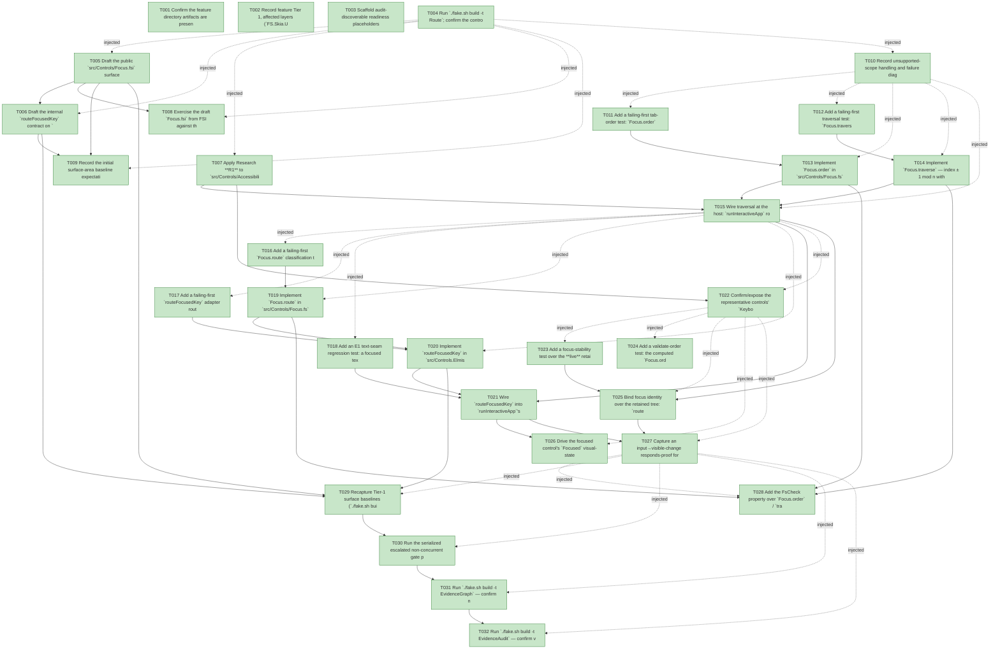

# Task Graph — 094-focus-keyboard-traversal

## ✓ Graph is acyclic and consistent

## Skill Match Assessments

| Task | Candidate | Confidence | Signals | Reviewer disposition | Diagnostic |
|------|-----------|------------|---------|----------------------|------------|
| T001 | (none) | none |  | accepted-empty | T001: skillist trusted as declared; no owns-based capability requirement |
| T002 | (none) | none |  | accepted-empty | T002: skillist trusted as declared; no owns-based capability requirement |
| T003 | (none) | none |  | accepted-empty | T003: skillist trusted as declared; no owns-based capability requirement |
| T004 | (none) | none |  | accepted-empty | T004: skillist trusted as declared; no owns-based capability requirement |
| T005 | (none) | none |  | declared | T005: skillist trusted as declared; no owns-based capability requirement |
| T006 | (none) | none |  | declared | T006: skillist trusted as declared; no owns-based capability requirement |
| T007 | (none) | none |  | declared | T007: skillist trusted as declared; no owns-based capability requirement |
| T008 | (none) | none |  | declared | T008: skillist trusted as declared; no owns-based capability requirement |
| T009 | (none) | none |  | accepted-empty | T009: skillist trusted as declared; no owns-based capability requirement |
| T010 | (none) | none |  | accepted-empty | T010: skillist trusted as declared; no owns-based capability requirement |
| T011 | (none) | none |  | declared | T011: skillist trusted as declared; no owns-based capability requirement |
| T012 | (none) | none |  | declared | T012: skillist trusted as declared; no owns-based capability requirement |
| T013 | (none) | none |  | declared | T013: skillist trusted as declared; no owns-based capability requirement |
| T014 | (none) | none |  | declared | T014: skillist trusted as declared; no owns-based capability requirement |
| T015 | (none) | none |  | declared | T015: skillist trusted as declared; no owns-based capability requirement |
| T016 | (none) | none |  | declared | T016: skillist trusted as declared; no owns-based capability requirement |
| T017 | (none) | none |  | declared | T017: skillist trusted as declared; no owns-based capability requirement |
| T018 | (none) | none |  | declared | T018: skillist trusted as declared; no owns-based capability requirement |
| T019 | (none) | none |  | declared | T019: skillist trusted as declared; no owns-based capability requirement |
| T020 | (none) | none |  | declared | T020: skillist trusted as declared; no owns-based capability requirement |
| T021 | (none) | none |  | declared | T021: skillist trusted as declared; no owns-based capability requirement |
| T022 | (none) | none |  | declared | T022: skillist trusted as declared; no owns-based capability requirement |
| T023 | (none) | none |  | declared | T023: skillist trusted as declared; no owns-based capability requirement |
| T024 | (none) | none |  | declared | T024: skillist trusted as declared; no owns-based capability requirement |
| T025 | (none) | none |  | declared | T025: skillist trusted as declared; no owns-based capability requirement |
| T026 | (none) | none |  | declared | T026: skillist trusted as declared; no owns-based capability requirement |
| T027 | (none) | none |  | declared | T027: skillist trusted as declared; no owns-based capability requirement |
| T028 | (none) | none |  | declared | T028: skillist trusted as declared; no owns-based capability requirement |
| T029 | (none) | none |  | declared | T029: skillist trusted as declared; no owns-based capability requirement |
| T030 | (none) | none |  | declared | T030: skillist trusted as declared; no owns-based capability requirement |
| T031 | speckit-evidence-graph | high | owns:graph-validation | accepted | T031: owns graph-validation requires skill speckit-evidence-graph; trigger_group=owns; matched_trigger=owns:graph-validation |
| T032 | speckit-evidence-audit | high | owns:evidence-audit | accepted | T032: owns evidence-audit requires skill speckit-evidence-audit; trigger_group=owns; matched_trigger=owns:evidence-audit |

## Status counts (effective)

| Status | Count |
|--------|-------|
| [X] done | 32 |
| [S] synthetic | 0 |
| [S*] auto-synthetic | 0 |
| accepted [SEH] synthetic | 0 |
| unaccepted synthetic | 0 |

## Graph



## ASCII view

```
T001 [X] Confirm the feature directory artifacts are present and linked (spec, plan, research, data-model, quickstart, `contracts/focus-model.md`, `contracts/key-routing-surface.md`, `checklists/requirements.md`)
T002 [X] Record feature Tier 1, affected layers (`FS.Skia.UI.Controls` new `Focus`; `FS.Skia.UI.Controls.Elmish` host seam), public-API impact (new `Focus.fsi`; internal `routeFocusedKey` + `runInteractiveApp` doc), MVU applicability (existing `ControlRuntime` boundary + pure reducers + host interpreter edge), and the evidence obligations from the plan
T003 [X] Scaffold audit-discoverable readiness placeholders under `readiness/`: `us1-tab-traversal.md`, `us2-focused-key-delivery.md`, `us2-text-seam-preserved.md`, `us3-focus-stability.md`, `us3-focus-indicator.md`, `sc006-determinism-property.md`, `sc007-validate-order.md`, `responds-proof.md`, `fsi-transcript.md`, `surface-baselines.md`, plus `governance-risk-levels.md`, `aggregate-hang-diagnostics.md`, `runtime-limitations.md`, `generated-guidance-validation.md`, `real-image-evidence.md`, `evidence-graph.md`, `evidence-audit.md` — each naming its authoritative command, artifact path, failure class, and next action
T004 [X] Run `./fake.sh build -t Route`; confirm the controls-public-surface + Controls.Elmish package-surface escalation and record the authoritative gate list plus the small/medium/broad governance risk levels for this Tier-1 surface move into `readiness/governance-risk-levels.md`
T005 [X] Draft the public `src/Controls/Focus.fsi` surface — `FocusStop`, `TabOrder`, `FocusMove`, `KeyRouting`, and the pure totals `Focus.order` / `Focus.traverse` / `Focus.route` per `contracts/focus-model.md`; keep `RetainedId` out of the surface (it binds at the host)
T006 [X] Draft the internal `routeFocusedKey` contract on `src/Controls.Elmish/ControlsElmish.fsi` and update the `runInteractiveApp` `.fsi` doc to honestly describe the key path (text seam → `Focus.route` → traversal → `host.MapKey`) per `contracts/key-routing-surface.md`
T007 [X] Apply Research **R1** to `src/Controls/Accessibility.fs` (signatures unchanged): stop seeding every focusable control's `NavigationKeys` with `["Tab"; "Shift+Tab"]` in `defaultFor` (seed intra-control arrows per role instead); relax `validate` so an activation-only focusable control (e.g. `Button`) is valid — paired with a **failing-first** test asserting a focusable Button validates and a default control does not consume Tab
T008 [X] Exercise the draft `Focus.fsi` from FSI against the packed library (`order` / `traverse` / `route`), capturing the session transcript to `readiness/fsi-transcript.md`
T009 [X] Record the initial surface-area baseline expectations for the new/changed public modules (`Focus.fsi`, `ControlsElmish.fsi`); the authoritative recapture happens in Polish (T029)
T010 [X] Record unsupported-scope handling and failure diagnostics into `readiness/runtime-limitations.md` (the `Fallthrough` no-op falls through to `host.MapKey`; a removed focused control reuses E2 `StaleTarget`/`RecoverStaleTarget`; no new accessibility primitive)
T011 [X] Add a failing-first tab-order test: `Focus.order` over a tree of mixed `FocusOrder` yields focusable-only stops ordered `FocusOrder` ascending with `None` in document order, and excludes non-focusable controls (SC-001 / US1.3)
T012 [X] Add a failing-first traversal test: `Focus.traverse` advances on Tab / reverses on Shift+Tab, wraps cyclically at both ends, `None + Next` → first / `None + Previous` → last, **and an empty `TabOrder` (no focusable controls) is a no-op — `Next`/`Previous` both yield `None`, never throw** (edge case "No focusable controls", SC-001)
T013 [X] Implement `Focus.order` in `src/Controls/Focus.fs` — pre-order tree walk → keep `Keyboard.Focusable = true` → stable sort by `(FocusOrder ?? +∞, docIndex)`; composites are a single stop (clarified)
T014 [X] Implement `Focus.traverse` — index ± 1 mod n with cyclic wrap, `None` → first/last, and stale-target recovery (a current id absent from the order resolves to the next stop at its former position, or `None`)
T015 [X] Wire traversal at the host: `runInteractiveApp` routes an unconsumed Tab / Shift+Tab to `ControlRuntimeMsg.FocusControl (Focus.traverse (Focus.order view) focused move)`; capture the FocusControl transition + traversal evidence to `readiness/us1-tab-traversal.md`
T016 [X] Add a failing-first `Focus.route` classification test: `ActivationKeys` → `Activate`, `NavigationKeys` → `Navigate`, unconsumed Tab → `Traverse`, else `Fallthrough`; a key in both a control's keys and the traversal set is consumed (never `Traverse`) (SC-002 / FR-007)
T017 [X] Add a failing-first `routeFocusedKey` adapter route-probe (via `InternalsVisibleTo`, no hand-seeded map): a focused `Button` + an `ActivationKey` produces exactly the pointer-equivalent message once (no double-dispatch); a focused `Slider` + ArrowLeft/Right produces its value-change message (SC-002)
T018 [X] Add an E1 text-seam regression test: a focused text control still receives typed/committed/composed text through the unchanged `routeFocusedText` path (SC-003)
T019 [X] Implement `Focus.route` in `src/Controls/Focus.fs` — membership tests (`ActivationKeys` then `NavigationKeys`) before the Tab test, returning the closed `KeyRouting` verdict; pure and total
T020 [X] Implement `routeFocusedKey` in `src/Controls.Elmish/ControlsElmish.fs` — resolve the focused control over the retained tree (E2 `RetainedId`), normalize `ViewerKey`, run the E1 `routeFocusedText` first, then `Focus.route`, emitting authored activation/value-change messages, a `FocusControl` traversal message, or fall-through
T021 [X] Wire `routeFocusedKey` into `runInteractiveApp`'s key path ahead of the existing `host.MapKey` fallback; capture evidence to `readiness/us2-focused-key-delivery.md` and `readiness/us2-text-seam-preserved.md`
T022 [X] Confirm/expose the representative controls' `KeyboardOperation` via the corrected `Accessibility.defaultFor` — `Button` (Enter/Space activation), `Slider` (ArrowLeft/Right navigation), a text control (E1 path) — touching `Widgets/*.fsi` only if a default is missing
T023 [X] Add a focus-stability test over the **live** retained path: after a sibling-shifting `RetainedRender.step`, the focused control still resolves to the same `RetainedId` — not a hand-seeded `StateByIdentity` map (SC-004)
T024 [X] Add a validate-order test: the computed `Focus.order` for the representative view passes `Accessibility.validate`, and the order + key semantics derive solely from `AccessibilityMetadata` with no parallel hand-rolled table (SC-007)
T025 [X] Bind focus identity over the retained tree: `routeFocusedKey` / focus resolution consume E2's `RetainedId` (via `retainedHitTest` / `resolveFocus`) so `FocusedControl` survives an unrelated re-render, and a removed focused control reuses stale-target recovery; **also assert pointer↔keyboard focus composition (FR-006): a pointer click sets focus to the hit focusable control or its nearest focusable keyed ancestor (`FocusMovedByPointer`) and subsequent `Focus.traverse` continues from that control's position in the order, while a click on a non-focusable region leaves the current `FocusedControl` unchanged (does not silently clear it)**; capture to `readiness/us3-focus-stability.md` (SC-004, FR-006)
T026 [X] Drive the focused control's `Focused` visual-state through E3's resolver (no procedural per-kind focus-paint branch); the indicator moves with focus and is removed from the previously-focused control; capture to `readiness/us3-focus-indicator.md` (SC-005). **E3 (feature 093) dependency — confirm 093 has landed before asserting the E3-resolver path; if E3 is unlanded at implementation time, resolve the `Focused` state through whatever path renders it then (still no parallel procedural branch, per plan Assumptions) and mark the E3-resolver-specific assertion `[-]` with that written rationale rather than synthesizing evidence**
T027 [X] Capture an input→visible-change responds-proof for a key-driven focus change via the reused E1 `captureRespondsProof` (an inert host yields identical frames + `Inert`); record to `readiness/responds-proof.md`
T028 [X] Add the FsCheck property over `Focus.order` / `traverse` / `route`: purity / totality / determinism over ≥1000 generated combinations, and an unmatched key is a defined no-op that never throws; record to `readiness/sc006-determinism-property.md` (SC-006)
T029 [X] Recapture Tier-1 surface baselines (`./fake.sh build -t RefreshSurfaceBaselines` + `PerPackageSurface.captureCurrent`): controls-public-surface + Controls.Elmish package-surface + per-package + cross-package; record diffs to `readiness/surface-baselines.md`
T030 [X] Run the serialized escalated non-concurrent gate prefix sequentially — `./fake.sh build -t Dev` → `GeneratedGuidanceCheck` → `TemplateCheck` → `GeneratedProductCheck` — recording aggregate results as non-authoritative into `readiness/generated-guidance-validation.md`
T031 [X] Run `./fake.sh build -t EvidenceGraph` — confirm no cycles, no dangling refs, no `[S*]` surprises; record to `readiness/evidence-graph.md`
T032 [X] Run `./fake.sh build -t EvidenceAudit` — confirm verdict PASS or document every `--accept-synthetic` override; record to `readiness/evidence-audit.md`
```

## Injected checkpoint edges (Phase N+1 → Phase N) — FR-007

- T004 → T005  (auto-injected Phase-checkpoint edge)
- T004 → T006  (auto-injected Phase-checkpoint edge)
- T004 → T007  (auto-injected Phase-checkpoint edge)
- T004 → T008  (auto-injected Phase-checkpoint edge)
- T004 → T009  (auto-injected Phase-checkpoint edge)
- T004 → T010  (auto-injected Phase-checkpoint edge)
- T010 → T011  (auto-injected Phase-checkpoint edge)
- T010 → T012  (auto-injected Phase-checkpoint edge)
- T010 → T013  (auto-injected Phase-checkpoint edge)
- T010 → T014  (auto-injected Phase-checkpoint edge)
- T010 → T015  (auto-injected Phase-checkpoint edge)
- T015 → T016  (auto-injected Phase-checkpoint edge)
- T015 → T017  (auto-injected Phase-checkpoint edge)
- T015 → T018  (auto-injected Phase-checkpoint edge)
- T015 → T019  (auto-injected Phase-checkpoint edge)
- T015 → T020  (auto-injected Phase-checkpoint edge)
- T015 → T022  (auto-injected Phase-checkpoint edge)
- T022 → T023  (auto-injected Phase-checkpoint edge)
- T022 → T024  (auto-injected Phase-checkpoint edge)
- T022 → T025  (auto-injected Phase-checkpoint edge)
- T022 → T026  (auto-injected Phase-checkpoint edge)
- T022 → T027  (auto-injected Phase-checkpoint edge)
- T027 → T028  (auto-injected Phase-checkpoint edge)
- T027 → T029  (auto-injected Phase-checkpoint edge)
- T027 → T030  (auto-injected Phase-checkpoint edge)
- T027 → T031  (auto-injected Phase-checkpoint edge)
- T027 → T032  (auto-injected Phase-checkpoint edge)

## Resolved skillist ids — FR-007

Resolved skillist-id set (11): fs-skia-elmish, fs-skia-evidence-mode, fs-skia-keyboard-input, fs-skia-reconciliation, fs-skia-template-update, fs-skia-testing, fs-skia-typed-controls, fs-skia-ui-widgets, fs-skia-viewer-host, speckit-evidence-audit, speckit-evidence-graph

## Skillist id → SKILL.md path

fs-skia-elmish → src/Elmish/skill/SKILL.md
fs-skia-evidence-mode → .agents/skills/fs-skia-evidence-mode/SKILL.md
fs-skia-keyboard-input → src/KeyboardInput/skill/SKILL.md
fs-skia-reconciliation → .agents/skills/fs-skia-reconciliation/SKILL.md
fs-skia-template-update → .agents/skills/fs-skia-template-update/SKILL.md
fs-skia-testing → src/Testing/skill/SKILL.md
fs-skia-typed-controls → .agents/skills/fs-skia-typed-controls/SKILL.md
fs-skia-ui-widgets → src/Controls/skill/SKILL.md
fs-skia-viewer-host → .agents/skills/fs-skia-viewer-host/SKILL.md
speckit-evidence-audit → .agents/skills/speckit-evidence-audit/SKILL.md
speckit-evidence-graph → .agents/skills/speckit-evidence-graph/SKILL.md

## Skillist id → unresolved / flagged

_(none — every declared skillist id resolves to exactly one installed skill)_

